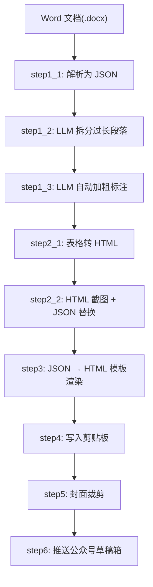
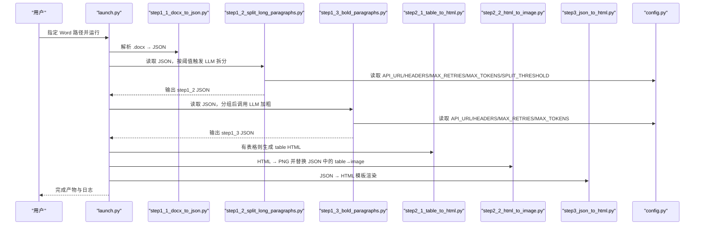
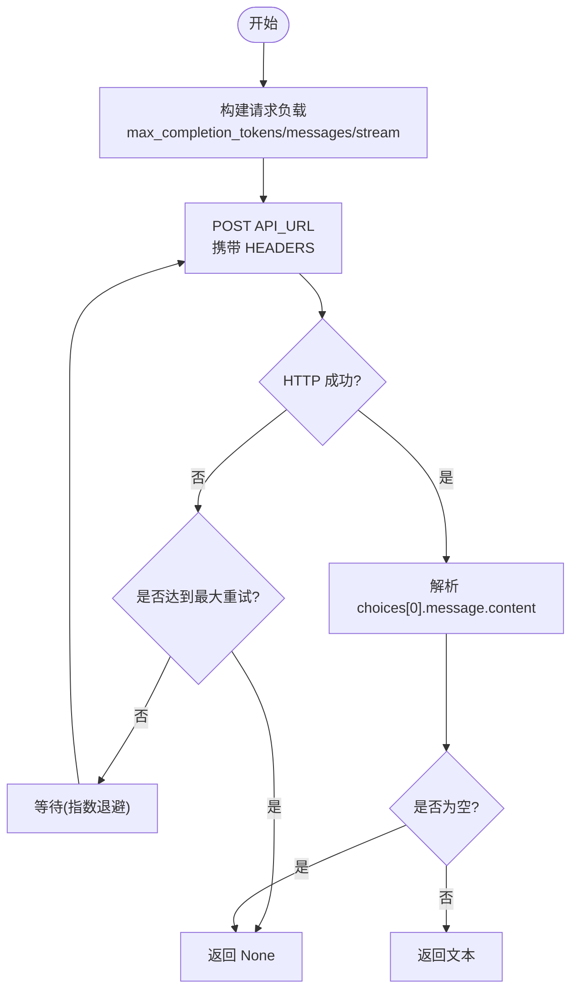
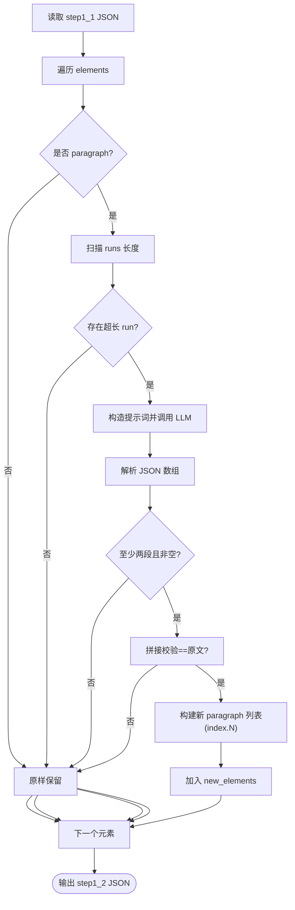
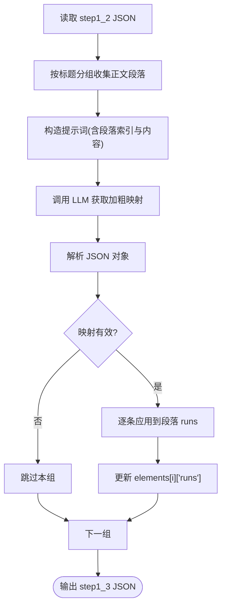
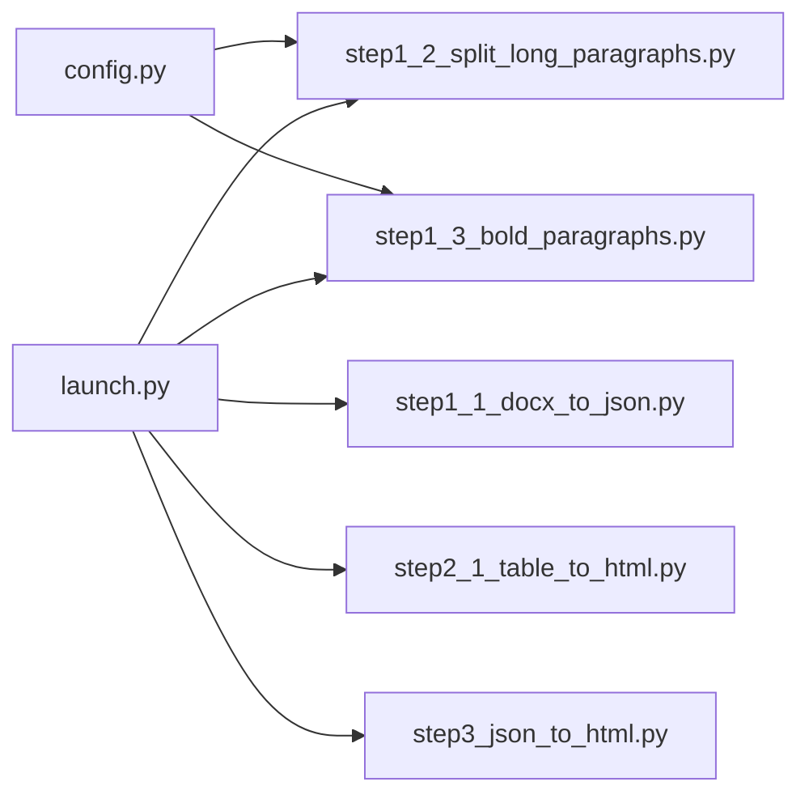

# AI 内容处理

<cite>
**本文引用的文件**   
- [config.py](file://config.py)
- [launch.py](file://launch.py)
- [step1_1_docx_to_json.py](file://step1_1_docx_to_json.py)
- [step1_2_split_long_paragraphs.py](file://step1_2_split_long_paragraphs.py)
- [step1_3_bold_paragraphs.py](file://step1_3_bold_paragraphs.py)
- [step2_1_table_to_html.py](file://step2_1_table_to_html.py)
- [step3_json_to_html.py](file://step3_json_to_html.py)
- [caicai_html_1_green_classical.html](file://html_template/caicai_html_1_green_classical.html)
</cite>

## 目录
1. [简介](#简介)
2. [项目结构](#项目结构)
3. [核心组件](#核心组件)
4. [架构总览](#架构总览)
5. [详细组件分析](#详细组件分析)
6. [依赖关系分析](#依赖关系分析)
7. [性能与成本控制](#性能与成本控制)
8. [故障排查指南](#故障排查指南)
9. [结论](#结论)
10. [附录：调用示例与参数调优](#附录调用示例与参数调优)

## 简介
本仓库实现了一个从 Word 文档到微信公众号草稿箱的一键流水线，其中包含两个关键的 AI 能力：
- 智能段落拆分：对过长段落进行语义分割，保持上下文一致性与原文一致性。
- 自动加粗标注：识别总结性、判断性或序列性表达，为正文添加高亮加粗标记。

系统通过统一的配置模块对接 Azure OpenAI API（经代理网关），提供请求重试、超时控制与结果校验机制，确保在复杂网络环境下具备稳定性与可恢复性。

## 项目结构
整体采用“步骤化”的模块化设计，每个步骤独立可运行，也可由编排脚本统一串联执行。AI 相关逻辑集中在 step1_2 与 step1_3 两个步骤中，分别负责“拆分”和“加粗”。

图表来源
- [launch.py:42-193](file://launch.py#L42-L193)
- [step1_1_docx_to_json.py:190-226](file://step1_1_docx_to_json.py#L190-L226)
- [step1_2_split_long_paragraphs.py:198-301](file://step1_2_split_long_paragraphs.py#L198-L301)
- [step1_3_bold_paragraphs.py:207-330](file://step1_3_bold_paragraphs.py#L207-L330)
- [step2_1_table_to_html.py:74-118](file://step2_1_table_to_html.py#L74-L118)
- [step3_json_to_html.py:121-142](file://step3_json_to_html.py#L121-L142)

章节来源
- [launch.py:1-201](file://launch.py#L1-L201)
- [step1_1_docx_to_json.py:1-233](file://step1_1_docx_to_json.py#L1-L233)
- [step1_2_split_long_paragraphs.py:1-311](file://step1_2_split_long_paragraphs.py#L1-L311)
- [step1_3_bold_paragraphs.py:1-340](file://step1_3_bold_paragraphs.py#L1-L340)
- [step2_1_table_to_html.py:1-125](file://step2_1_table_to_html.py#L1-L125)
- [step3_json_to_html.py:1-149](file://step3_json_to_html.py#L1-L149)

## 核心组件
- 配置中心：集中管理 API 地址、认证头、通用参数（最大重试次数、最大 token、段落长度阈值等）。
- 编排器：按顺序驱动各步骤，支持跳过任意步骤，自动检测是否包含表格以决定是否执行图片生成流程。
- AI 客户端封装：统一的 HTTP 调用、重试与超时策略，以及响应体解析与容错。
- 提示词工程：针对“拆分”和“加粗”两类任务设计了强约束的提示词，保证输出格式稳定与内容保真。
- 数据模型：JSON 中间表示承载段落、表格、图片等元素，贯穿整个流水线。

章节来源
- [config.py:1-39](file://config.py#L1-L39)
- [launch.py:28-111](file://launch.py#L28-L111)
- [step1_2_split_long_paragraphs.py:80-103](file://step1_2_split_long_paragraphs.py#L80-L103)
- [step1_3_bold_paragraphs.py:73-96](file://step1_3_bold_paragraphs.py#L73-L96)

## 架构总览
下图展示了端到端的数据流与控制流，重点突出 AI 处理环节与前后处理的衔接点。

图表来源
- [launch.py:42-193](file://launch.py#L42-L193)
- [config.py:6-24](file://config.py#L6-L24)
- [step1_2_split_long_paragraphs.py:198-301](file://step1_2_split_long_paragraphs.py#L198-L301)
- [step1_3_bold_paragraphs.py:207-330](file://step1_3_bold_paragraphs.py#L207-L330)
- [step2_1_table_to_html.py:74-118](file://step2_1_table_to_html.py#L74-L118)
- [step3_json_to_html.py:121-142](file://step3_json_to_html.py#L121-L142)

## 详细组件分析

### Azure OpenAI API 集成（认证、请求与响应）
- 认证方式
  - 通过统一 HEADERS 注入 client_id、client_secret、api-key（Bearer Token）等字段，API_URL 指向 Azure OpenAI 部署端点。
- 请求格式
  - 使用 POST 发送 JSON 负载，包含 max_completion_tokens、messages（user 角色）、stream=false。
- 响应处理
  - 从 choices[0].message.content 提取文本；若为空或异常，进入重试或返回 None。
- 错误与重试
  - 捕获 requests.exceptions.RequestException，按指数退避策略重试（等待时间随尝试次数递增），超过 MAX_RETRIES 后记录失败并继续下游流程。
- 超时控制
  - 单次请求设置 timeout=120s，避免长时间阻塞。

图表来源
- [config.py:6-24](file://config.py#L6-L24)
- [step1_2_split_long_paragraphs.py:80-103](file://step1_2_split_long_paragraphs.py#L80-L103)
- [step1_3_bold_paragraphs.py:73-96](file://step1_3_bold_paragraphs.py#L73-L96)

章节来源
- [config.py:6-24](file://config.py#L6-L24)
- [step1_2_split_long_paragraphs.py:80-103](file://step1_2_split_long_paragraphs.py#L80-L103)
- [step1_3_bold_paragraphs.py:73-96](file://step1_3_bold_paragraphs.py#L73-L96)

### 智能段落拆分算法（step1_2）
- 触发条件
  - 遍历段落内 runs，当单个 run.text 长度超过 SPLIT_THRESHOLD（默认 120）时触发拆分。
- 提示词工程要点
  - 强调“语义完整优先”，禁止机械按长度切分。
  - 明确允许在句号、问号、感叹号、分号之后拆分，且不得破坏因果/转折/递进关系。
  - 要求每段不少于 15 字符，否则合并至相邻段落。
  - 铁律：拼接后必须与原文完全一致，不增删改任何文字。
- 结果解析
  - 先尝试直接解析 JSON 数组；若失败，去除代码块标记后再解析；最后用正则提取数组片段再解析。
- 一致性校验
  - 将拆分后的段落拼接并与原长文本比对，不一致则放弃本次拆分，保留原段落。
- 数据结构重建
  - 将原始段落拆分为多个新 paragraph 元素，index 追加 .1/.2 后缀，runs 首尾保留原有样式信息。

图表来源
- [step1_2_split_long_paragraphs.py:198-301](file://step1_2_split_long_paragraphs.py#L198-L301)
- [step1_2_split_long_paragraphs.py:106-140](file://step1_2_split_long_paragraphs.py#L106-L140)
- [step1_2_split_long_paragraphs.py:152-192](file://step1_2_split_long_paragraphs.py#L152-L192)

章节来源
- [step1_2_split_long_paragraphs.py:33-74](file://step1_2_split_long_paragraphs.py#L33-L74)
- [step1_2_split_long_paragraphs.py:198-301](file://step1_2_split_long_paragraphs.py#L198-L301)

### 自动加粗标注（step1_3）
- 分组策略
  - 按标题分段，收集每组连续正文段落（通常 4~5 段一组）作为一次 LLM 输入。
- 提示词工程要点
  - 目标：识别总结性、判断性、序列性表达。
  - 频率控制：约每 4~5 段一处，少于 5 段最多 1 处，避免过密。
  - 严格限制：已有加粗的段落跳过；若无合适内容则不加；必须逐字匹配原文；仅修改 bold 字段。
- 结果解析
  - 期望返回 JSON 对象 {index: "需要加粗的完整原文句子"}；支持去除代码块标记与正则提取对象。
- 应用逻辑
  - 根据 index 定位段落，查找 bold_text 在段落全文中的位置，将对应 runs 区间设为 bold=true，必要时拆分 run 以保持精确覆盖。

图表来源
- [step1_3_bold_paragraphs.py:207-330](file://step1_3_bold_paragraphs.py#L207-L330)
- [step1_3_bold_paragraphs.py:99-133](file://step1_3_bold_paragraphs.py#L99-L133)
- [step1_3_bold_paragraphs.py:146-201](file://step1_3_bold_paragraphs.py#L146-L201)

章节来源
- [step1_3_bold_paragraphs.py:32-67](file://step1_3_bold_paragraphs.py#L32-L67)
- [step1_3_bold_paragraphs.py:207-330](file://step1_3_bold_paragraphs.py#L207-L330)

### 数据模型与渲染（step1_1 / step3）
- 数据模型
  - 段落：{type, heading_level, runs:[{text,bold}], index}
  - 表格：{type, row_count, col_count, data:[[cell]]}
  - 图片：{type, file_name, image_path}
- 渲染规则
  - heading_level=1 的大标题不渲染到正文区；heading_level=2 转为小标题样式；正文段落合并在 section 中；bold run 渲染为高亮 span；图片居中显示。

章节来源
- [step1_1_docx_to_json.py:75-139](file://step1_1_docx_to_json.py#L75-L139)
- [step3_json_to_html.py:38-115](file://step3_json_to_html.py#L38-L115)
- [caicai_html_1_green_classical.html:173-278](file://html_template/caicai_html_1_green_classical.html#L173-L278)

## 依赖关系分析
- 模块耦合
  - launch.py 作为编排器，按需导入并调用各步骤 main 函数，形成松耦合的管道式架构。
  - step1_2 与 step1_3 均依赖 config.py 提供的 API 与通用参数。
- 外部依赖
  - requests 用于 HTTP 调用；docx 库用于解析 .docx；HTML 模板位于 html_template 目录。
- 潜在循环依赖
  - 当前无循环导入；步骤间通过文件系统传递 JSON 中间产物，降低运行时耦合。

图表来源
- [launch.py:70-111](file://launch.py#L70-L111)
- [config.py:6-24](file://config.py#L6-L24)

章节来源
- [launch.py:1-201](file://launch.py#L1-L201)
- [config.py:1-39](file://config.py#L1-L39)

## 性能与成本控制
- 请求并发与限流
  - 当前为串行调用，适合单线程环境；如需提升吞吐，可在编排层引入队列与并发池，并对 LLM 调用增加速率限制。
- 超时与重试
  - 单次请求超时 120s，最大重试 3 次，指数退避等待时间逐步增加，兼顾稳定性与资源占用。
- Token 预算
  - 通过 MAX_TOKENS 控制输出上限，避免大响应导致成本飙升；建议结合业务需求动态调整。
- 段落拆分阈值
  - SPLIT_THRESHOLD 越大，触发 LLM 的概率越低，节省调用次数；过小会导致频繁拆分与多次调用。
- 加粗分组粒度
  - 每组 4~5 段，既保证阅读节奏，又减少 LLM 输入规模，平衡效果与成本。
- 缓存与幂等
  - 可对已处理的段落指纹（如 MD5）进行缓存，避免重复调用；当前未实现，可作为优化方向。

[本节为通用指导，无需特定文件引用]

## 故障排查指南
- 常见错误
  - 网络异常/鉴权失败：检查 HEADERS 与 API_URL 是否正确；确认代理网关可达。
  - 响应解析失败：确认 LLM 返回符合预期 JSON 格式；查看日志中的“解析失败”提示。
  - 拼接不一致：拆分结果与原段落不一致会触发回退，检查提示词约束是否被遵守。
  - 加粗未命中：若 bold_text 未在段落中找到，将跳过该条目；核对索引与原文是否一致。
- 调试建议
  - 启用更详细的打印日志（已在各步骤内置）；观察“调用次数”、“拆分/加粗数量”等统计信息。
  - 单独运行某一步骤，隔离问题范围。
  - 临时降低 SPLIT_THRESHOLD 或增大 MAX_TOKENS 验证是否为长度/截断导致的问题。

章节来源
- [step1_2_split_long_paragraphs.py:247-285](file://step1_2_split_long_paragraphs.py#L247-L285)
- [step1_3_bold_paragraphs.py:275-315](file://step1_3_bold_paragraphs.py#L275-L315)

## 结论
本方案通过清晰的步骤化设计与严格的提示词约束，实现了稳定的 AI 内容处理能力：既能保证语义完整性与原文一致性，又能通过加粗标注提升可读性。配合统一的配置与重试机制，系统在真实网络环境中具备较好的鲁棒性。后续可在并发、缓存、质量评估与人工审核方面进一步扩展。

[本节为总结性内容，无需特定文件引用]

## 附录：调用示例与参数调优

### 一键流水线调用
- 修改 launch.py 的 if __name__ 块中的 input_path 为目标 Word 文件路径，直接运行即可。
- 可通过 SKIP_STEP* 标志跳过任意步骤，便于局部调试。

章节来源
- [launch.py:196-201](file://launch.py#L196-L201)

### 单独运行 AI 步骤
- 拆分段落：运行 step1_2_split_long_paragraphs.py，修改其主入口的 input_json 指向 step1_1 的输出。
- 自动加粗：运行 step1_3_bold_paragraphs.py，修改其主入口的 input_json 指向 step1_2 的输出。

章节来源
- [step1_2_split_long_paragraphs.py:304-311](file://step1_2_split_long_paragraphs.py#L304-L311)
- [step1_3_bold_paragraphs.py:333-340](file://step1_3_bold_paragraphs.py#L333-L340)

### 关键参数说明与建议
- API_URL/HEADERS：确保代理网关地址与鉴权头正确；生产环境建议使用环境变量或密钥管理服务。
- MAX_RETRIES：默认 3；在网络不稳定时可适当提高，但需权衡耗时。
- MAX_TOKENS：默认 8192；若出现截断或内容不完整，可适当上调。
- SPLIT_THRESHOLD：默认 120；根据文章风格与排版需求调整，过大可能漏拆，过小可能过度拆分。
- 加粗分组：每组 4~5 段；若文章结构特殊，可考虑自定义分组策略。

章节来源
- [config.py:6-24](file://config.py#L6-L24)
- [step1_2_split_long_paragraphs.py:24](file://step1_2_split_long_paragraphs.py#L24)
- [step1_3_bold_paragraphs.py:40-44](file://step1_3_bold_paragraphs.py#L40-L44)

### 质量评估方法与人工审核流程（建议）
- 自动化指标
  - 拆分一致性：拼接后与原文差异率应为 0%。
  - 加粗覆盖率：统计加粗段落占比，控制在合理区间（例如 10%~20%）。
  - 调用成功率：统计成功/失败次数与平均耗时。
- 人工抽检
  - 随机抽取若干文章，检查拆分是否破坏语义连贯性、加粗是否准确反映重点。
  - 建立反馈闭环，将典型错误样本纳入提示词迭代与阈值调优。
- 版本回归
  - 对同一批测试集在不同版本下对比指标，确保改进不引入退化。

[本节为方法论建议，无需特定文件引用]