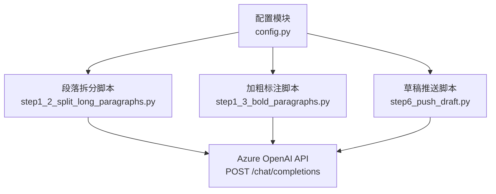
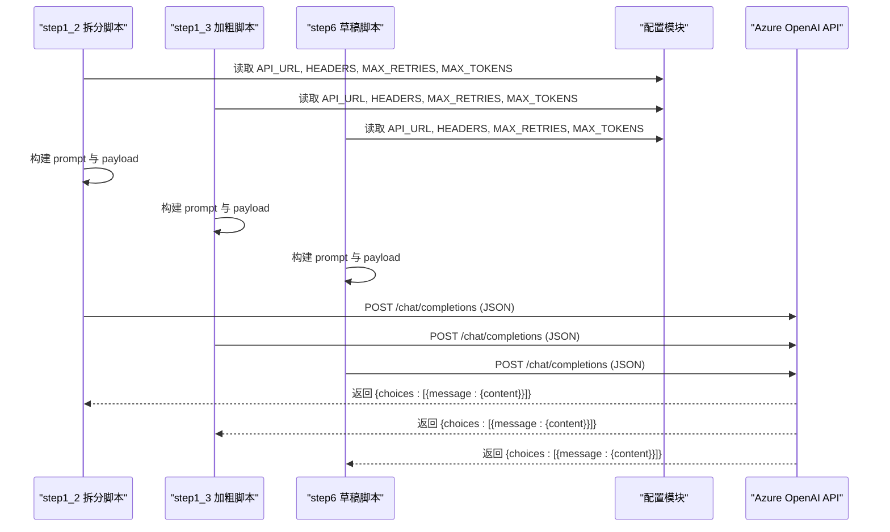
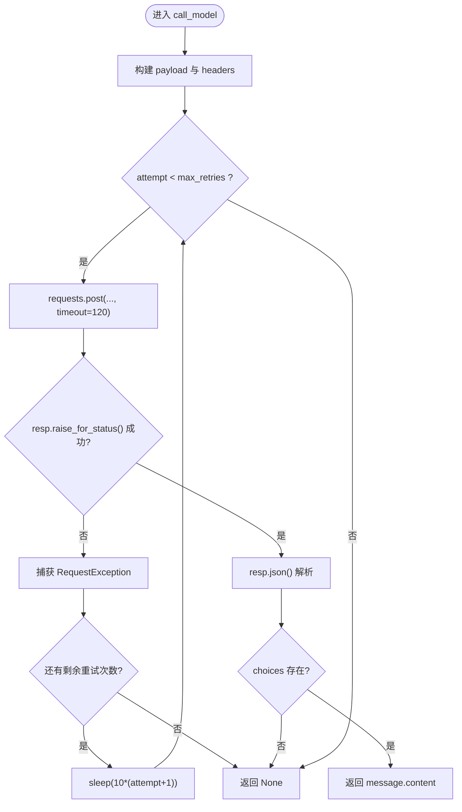
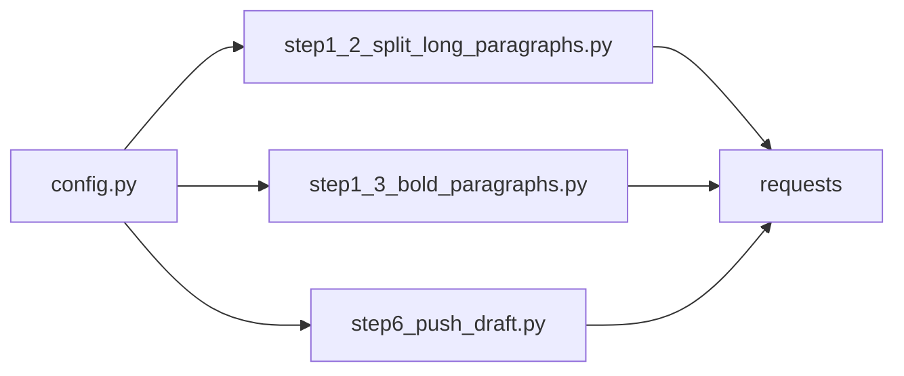

# Azure OpenAI API 集成

<cite>
**本文引用的文件**
- [config.py](file://config.py)
- [step1_2_split_long_paragraphs.py](file://step1_2_split_long_paragraphs.py)
- [step1_3_bold_paragraphs.py](file://step1_3_bold_paragraphs.py)
- [step6_push_draft.py](file://step6_push_draft.py)
</cite>

## 目录
1. [简介](#简介)
2. [项目结构](#项目结构)
3. [核心组件](#核心组件)
4. [架构总览](#架构总览)
5. [详细组件分析](#详细组件分析)
6. [依赖关系分析](#依赖关系分析)
7. [性能与成本控制](#性能与成本控制)
8. [故障排查指南](#故障排查指南)
9. [结论](#结论)

## 简介
本技术文档聚焦于项目中对 Azure OpenAI API 的集成实现，围绕认证机制、HTTP 请求构建、错误处理与重试策略、超时控制、调试技巧以及成本与性能优化进行系统化说明。该集成通过统一的配置模块提供 API URL 与请求头，并在多个业务脚本中以一致的封装函数发起 POST 请求，解析 JSON 响应并提取模型输出内容。

## 项目结构
与 Azure OpenAI 集成直接相关的代码主要分布在以下文件中：
- 全局配置：API URL、请求头、通用参数（最大重试次数、最大 token 数等）
- 文本拆分步骤：调用大模型将过长段落按语义拆分
- 加粗标注步骤：调用大模型识别总结/判断/序列性表达并标记加粗
- 草稿推送步骤：从正文生成摘要金句，再调用微信接口完成草稿创建

图表来源
- [config.py:6-17](file://config.py#L6-L17)
- [step1_2_split_long_paragraphs.py:80-103](file://step1_2_split_long_paragraphs.py#L80-L103)
- [step1_3_bold_paragraphs.py:73-96](file://step1_3_bold_paragraphs.py#L73-L96)
- [step6_push_draft.py:188-211](file://step6_push_draft.py#L188-L211)

章节来源
- [config.py:1-39](file://config.py#L1-L39)
- [step1_2_split_long_paragraphs.py:1-311](file://step1_2_split_long_paragraphs.py#L1-L311)
- [step1_3_bold_paragraphs.py:1-340](file://step1_3_bold_paragraphs.py#L1-L340)
- [step6_push_draft.py:1-404](file://step6_push_draft.py#L1-L404)

## 核心组件
- 统一配置
  - API_URL：指向 Azure OpenAI 的 chat completions 端点，包含部署名与 api-version 查询参数
  - HEADERS：包含 client_id、client_secret、api-key（Bearer Token）、Content-Type
  - MAX_RETRIES：默认最大重试次数
  - MAX_TOKENS：最大 completion tokens 限制
- 统一调用封装
  - call_model：构造 payload（messages、max_completion_tokens、stream），发起 POST 请求，设置超时，捕获异常并重试，解析 choices[0].message.content 返回文本
- 业务脚本中的使用
  - step1_2：超长段落拆分，基于 prompt 要求返回 JSON 数组
  - step1_3：段落加粗标注，基于 prompt 要求返回 JSON 对象
  - step6：从正文提取摘要金句，基于 prompt 要求返回单句原文

章节来源
- [config.py:6-21](file://config.py#L6-L21)
- [step1_2_split_long_paragraphs.py:80-103](file://step1_2_split_long_paragraphs.py#L80-L103)
- [step1_3_bold_paragraphs.py:73-96](file://step1_3_bold_paragraphs.py#L73-L96)
- [step6_push_draft.py:188-211](file://step6_push_draft.py#L188-L211)

## 架构总览
下图展示了各脚本如何依赖配置模块并通过统一封装函数访问 Azure OpenAI API。

图表来源
- [config.py:6-21](file://config.py#L6-L21)
- [step1_2_split_long_paragraphs.py:80-103](file://step1_2_split_long_paragraphs.py#L80-L103)
- [step1_3_bold_paragraphs.py:73-96](file://step1_3_bold_paragraphs.py#L73-L96)
- [step6_push_draft.py:188-211](file://step6_push_draft.py#L188-L211)

## 详细组件分析

### 认证机制与请求头
- API URL 配置
  - 端点路径包含 deployments/gpt-5/chat/completions，并以 api-version=2025-02-01-preview 作为查询参数
- 请求头设置
  - Content-Type: application/json
  - api-key: Bearer <token>
  - client_id/client_secret：由网关层鉴权使用
- 安全建议
  - 当前配置以明文形式存储敏感信息，建议迁移至环境变量或密钥管理服务，避免提交到版本库

章节来源
- [config.py:6-17](file://config.py#L6-L17)

### HTTP 请求构建与消息格式
- 请求方法
  - 使用 requests.post 发送 JSON 负载
- 负载字段
  - max_completion_tokens：限制模型输出 token 数量
  - messages：包含 role=user 与 content=prompt 的消息列表
  - stream：固定为 False，表示非流式响应
- 响应解析
  - 从 resp.json() 中取 choices[0].message.content 作为最终文本
- 流式响应
  - 当前未启用流式模式；如需实时增量输出，可将 stream=True 并逐块消费响应体

章节来源
- [step1_2_split_long_paragraphs.py:80-103](file://step1_2_split_long_paragraphs.py#L80-L103)
- [step1_3_bold_paragraphs.py:73-96](file://step1_3_bold_paragraphs.py#L73-L96)
- [step6_push_draft.py:188-211](file://step6_push_draft.py#L188-L211)

### 错误处理与重试机制
- 异常捕获
  - 捕获 requests.exceptions.RequestException，涵盖网络错误、连接错误、超时等
- 重试策略
  - 最多尝试 MAX_RETRIES 次
  - 等待时间采用线性退避：wait = 10 * (attempt + 1)，即 10s、20s、30s...
  - 最后一次失败打印“请求最终失败”并返回 None
- 指数退避建议
  - 当前为线性退避，可升级为指数退避（如 base=2^attempt）并加入抖动，以降低雪崩风险

图表来源
- [step1_2_split_long_paragraphs.py:80-103](file://step1_2_split_long_paragraphs.py#L80-L103)
- [step1_3_bold_paragraphs.py:73-96](file://step1_3_bold_paragraphs.py#L73-L96)
- [step6_push_draft.py:188-211](file://step6_push_draft.py#L188-L211)

章节来源
- [step1_2_split_long_paragraphs.py:80-103](file://step1_2_split_long_paragraphs.py#L80-L103)
- [step1_3_bold_paragraphs.py:73-96](file://step1_3_bold_paragraphs.py#L73-L96)
- [step6_push_draft.py:188-211](file://step6_push_draft.py#L188-L211)

### 超时处理与异常捕获策略
- 超时设置
  - 模型调用统一设置 timeout=120 秒
  - 其他外部服务（如微信公众号）使用更短超时（如 30 秒）
- 异常分类
  - 网络/连接类异常：RequestException 子类
  - HTTP 状态码异常：raise_for_status 抛出 HTTPError
- 恢复策略
  - 针对临时性错误（限流、网络抖动）进行重试
  - 对于不可恢复错误（如认证失败）应快速失败并记录日志

章节来源
- [step1_2_split_long_paragraphs.py:80-103](file://step1_2_split_long_paragraphs.py#L80-L103)
- [step1_3_bold_paragraphs.py:73-96](file://step1_3_bold_paragraphs.py#L73-L96)
- [step6_push_draft.py:188-211](file://step6_push_draft.py#L188-L211)

### 具体调用示例与调试技巧
- 典型调用流程
  - 读取配置 → 构建 prompt → 调用 call_model → 解析 JSON → 应用结果
- 调试要点
  - 打印 prompt 长度与输入规模，便于评估上下文窗口压力
  - 在解析失败时保留原始响应文本，便于定位 LLM 输出格式问题
  - 对关键中间结果（如拆分后的段落拼接一致性）进行断言校验
- 常见陷阱
  - LLM 可能输出带代码块标记的 JSON，需清理后再解析
  - 中文编码与字节长度限制（如标题截断）需显式处理

章节来源
- [step1_2_split_long_paragraphs.py:106-140](file://step1_2_split_long_paragraphs.py#L106-L140)
- [step1_3_bold_paragraphs.py:99-133](file://step1_3_bold_paragraphs.py#L99-L133)
- [step6_push_draft.py:227-246](file://step6_push_draft.py#L227-L246)

### 成本控制策略与性能优化建议
- 控制输入规模
  - 对长文本进行截断（例如摘要生成前截取前 N 字符），减少 token 消耗
- 限制输出规模
  - 合理设置 max_completion_tokens，避免不必要的冗长输出
- 批量与并行
  - 对多组段落可考虑并发调用（注意速率限制与令牌配额）
- 缓存与复用
  - 对重复提示词或中间结果进行缓存，降低重复计算
- 降级与回退
  - 当模型调用失败时，保留原段落或跳过处理，保证流水线稳定性

章节来源
- [step6_push_draft.py:227-246](file://step6_push_draft.py#L227-L246)
- [config.py:19-21](file://config.py#L19-L21)

## 依赖关系分析
- 模块耦合
  - 所有业务脚本均依赖 config.py 提供的 API_URL、HEADERS、MAX_RETRIES、MAX_TOKENS
  - 各脚本内部实现独立的 call_model 封装，逻辑一致但分散，存在重复
- 外部依赖
  - requests：用于 HTTP 通信
  - json：用于请求与响应数据序列化/反序列化
  - time：用于重试等待
- 潜在改进
  - 抽取统一的 HTTP 客户端与重试策略，集中管理超时、重试、指标采集与日志

图表来源
- [config.py:6-21](file://config.py#L6-L21)
- [step1_2_split_long_paragraphs.py:80-103](file://step1_2_split_long_paragraphs.py#L80-L103)
- [step1_3_bold_paragraphs.py:73-96](file://step1_3_bold_paragraphs.py#L73-L96)
- [step6_push_draft.py:188-211](file://step6_push_draft.py#L188-L211)

章节来源
- [config.py:1-39](file://config.py#L1-L39)
- [step1_2_split_long_paragraphs.py:1-311](file://step1_2_split_long_paragraphs.py#L1-L311)
- [step1_3_bold_paragraphs.py:1-340](file://step1_3_bold_paragraphs.py#L1-L340)
- [step6_push_draft.py:1-404](file://step6_push_draft.py#L1-L404)

## 性能与成本控制
- 超时与重试
  - 合理设置超时以避免长时间阻塞；结合重试提升鲁棒性
- 输入裁剪
  - 对超长正文进行截断，确保不超出模型上下文窗口
- 输出约束
  - 明确 prompt 的输出格式与长度限制，减少无效 token 消耗
- 并发与限流
  - 根据 API 配额与速率限制调整并发度，避免触发限流导致大量重试

[本节为通用指导，无需特定文件引用]

## 故障排查指南
- 认证失败
  - 检查 API_URL 是否正确，确认 api-key 与 client_id/client_secret 有效
- 网络与超时
  - 观察是否频繁出现 RequestException 或超时；适当增大超时或优化网络环境
- 响应解析失败
  - 若 LLM 返回非标准 JSON，增加清理逻辑（去除代码块标记、正则提取）
- 业务校验失败
  - 如段落拆分后拼接不一致，应回退原段落并记录差异，便于后续优化 prompt

章节来源
- [step1_2_split_long_paragraphs.py:106-140](file://step1_2_split_long_paragraphs.py#L106-L140)
- [step1_3_bold_paragraphs.py:99-133](file://step1_3_bold_paragraphs.py#L99-L133)
- [step6_push_draft.py:227-246](file://step6_push_draft.py#L227-L246)

## 结论
本项目对 Azure OpenAI API 的集成采用统一配置与一致的调用封装，具备基本的错误处理与重试能力。建议在安全性（密钥管理）、重试策略（指数退避与抖动）、流式响应支持、并发与限流、以及成本优化方面进一步演进，以提升系统的稳定性与经济性。