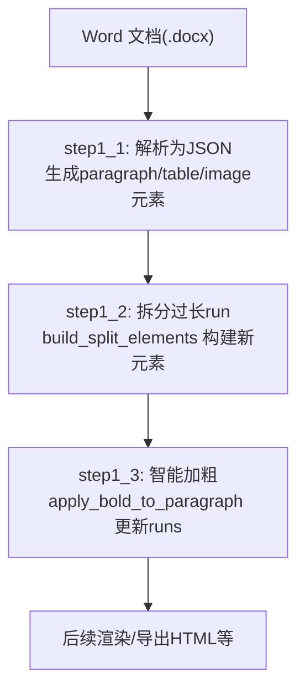
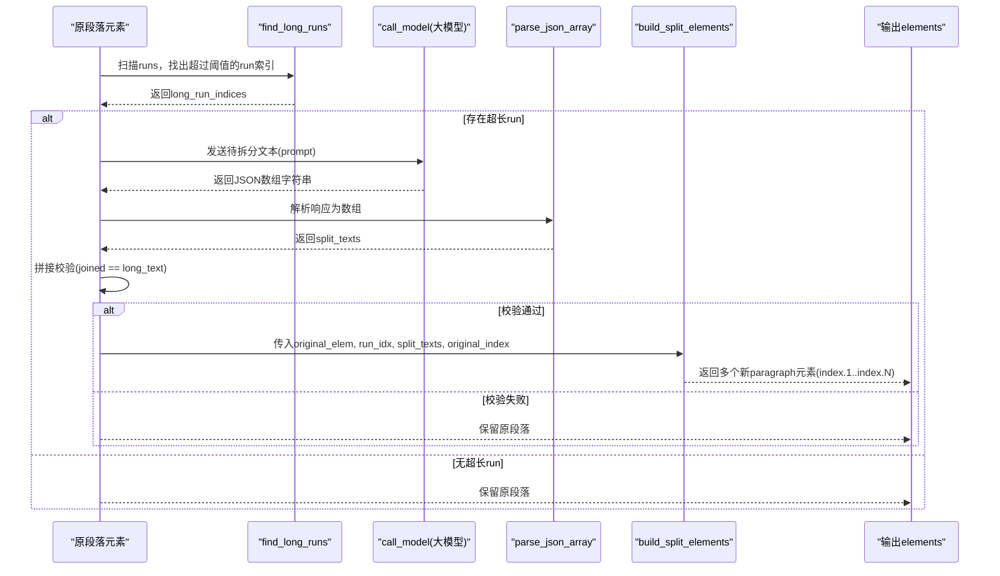
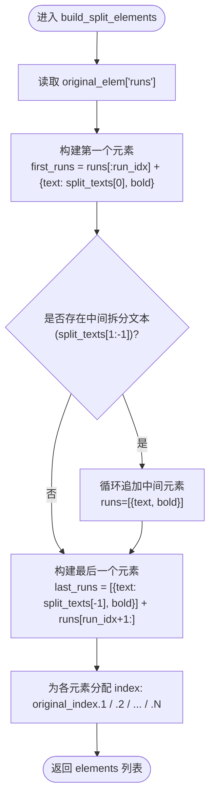
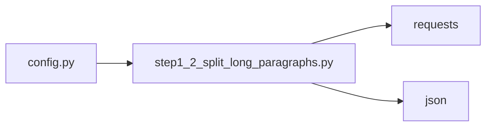

# 元素构建逻辑

<cite>
**本文引用的文件**   
- [step1_2_split_long_paragraphs.py](file://step1_2_split_long_paragraphs.py)
- [step1_1_docx_to_json.py](file://step1_1_docx_to_json.py)
- [step1_3_bold_paragraphs.py](file://step1_3_bold_paragraphs.py)
- [config.py](file://config.py)
- [content_20260702_1/.../step1_1_docx_to_json.json](file://content_instance/content_20260702_1/process/step1_1_docx_to_json.json)
- [content_20260702_1/.../step1_2_split_paragraphs.json](file://content_instance/content_20260702_1/process/step1_2_split_paragraphs.json)
</cite>

## 目录
1. [简介](#简介)
2. [项目结构](#项目结构)
3. [核心组件](#核心组件)
4. [架构总览](#架构总览)
5. [详细组件分析](#详细组件分析)
6. [依赖关系分析](#依赖关系分析)
7. [性能考量](#性能考量)
8. [故障排查指南](#故障排查指南)
9. [结论](#结论)
10. [附录：数据结构与示例](#附录数据结构与示例)

## 简介
本技术文档聚焦于“元素构建逻辑”，围绕将长段落按语义拆分为多个短段落的实现，重点解析 build_split_elements 函数的设计、运行流程与数据流转。文档涵盖以下要点：
- 原始 paragraph 元素到新元素的转换过程
- 第一个元素、中间元素、最后一个元素的构建策略
- index 后缀命名规则（.1/.2/.N）的设计考虑
- runs 列表的重新组织与样式保持机制
- paragraph 元素结构与字段含义
- 最佳实践与扩展方法
- 具体数据结构示例与转换流程图

## 项目结构
该流水线包含三个关键步骤：
- step1_1：从 Word 文档解析为结构化 JSON（段落、表格、图片），并生成 runs 片段
- step1_2：对过长 run 调用大模型进行语义拆分，生成新的 paragraph 元素，并维护 index 层级
- step1_3：基于上下文识别总结性/判断性表达，为段落添加加粗标记

图表来源
- [step1_1_docx_to_json.py:145-184](file://step1_1_docx_to_json.py#L145-L184)
- [step1_2_split_long_paragraphs.py:198-301](file://step1_2_split_long_paragraphs.py#L198-L301)
- [step1_3_bold_paragraphs.py:207-330](file://step1_3_bold_paragraphs.py#L207-L330)

章节来源
- [step1_1_docx_to_json.py:1-233](file://step1_1_docx_to_json.py#L1-L233)
- [step1_2_split_long_paragraphs.py:1-311](file://step1_2_split_long_paragraphs.py#L1-L311)
- [step1_3_bold_paragraphs.py:1-340](file://step1_3_bold_paragraphs.py#L1-L340)

## 核心组件
- 段落构建器（step1_1）：负责从 docx 提取段落、合并相邻同 bold 状态的 run，并识别标题层级
- 拆分构建器（step1_2）：针对超长 run 调用大模型拆分文本，使用 build_split_elements 构造新 paragraph 元素
- 加粗应用器（step1_3）：根据 LLM 返回的目标句子，精确匹配并在 runs 中设置 bold 标记

章节来源
- [step1_1_docx_to_json.py:75-113](file://step1_1_docx_to_json.py#L75-L113)
- [step1_2_split_long_paragraphs.py:152-192](file://step1_2_split_long_paragraphs.py#L152-L192)
- [step1_3_bold_paragraphs.py:146-201](file://step1_3_bold_paragraphs.py#L146-L201)

## 架构总览
下图展示了从原始段落到拆分后多段落的完整流程，包括一致性校验与 index 后缀分配。

图表来源
- [step1_2_split_long_paragraphs.py:143-192](file://step1_2_split_long_paragraphs.py#L143-L192)
- [step1_2_split_long_paragraphs.py:219-286](file://step1_2_split_long_paragraphs.py#L219-L286)

## 详细组件分析

### build_split_elements 函数原理
该函数负责将一个被拆分的 run 转换为多个新的 paragraph 元素，并保持原文顺序与样式一致。其核心策略如下：
- 第一个元素：包含拆分前的所有 runs + 第一段拆分文本
- 中间元素：每个纯拆分文本单独构成一个元素
- 最后一个元素：包含最后一段拆分文本 + 拆分后的剩余 runs

图表来源
- [step1_2_split_long_paragraphs.py:152-192](file://step1_2_split_long_paragraphs.py#L152-L192)

章节来源
- [step1_2_split_long_paragraphs.py:152-192](file://step1_2_split_long_paragraphs.py#L152-L192)

### 第一个元素、中间元素、最后一个元素的构建策略
- 第一个元素
  - runs 组成：原段落中位于目标 run 之前的全部 runs + 第一段拆分文本
  - 样式保持：新增 run 的 bold 继承自原目标 run 的 bold 状态
  - index 分配：original_index.1
- 中间元素
  - runs 组成：仅包含单个拆分文本（bold 继承自原目标 run）
  - index 分配：original_index.2、original_index.3 … 依序递增
- 最后一个元素
  - runs 组成：最后一段拆分文本 + 原段落中位于目标 run 之后的全部 runs
  - index 分配：original_index.N（N 为拆分段数）

章节来源
- [step1_2_split_long_paragraphs.py:162-190](file://step1_2_split_long_paragraphs.py#L162-L190)

### index 后缀命名规则（.1/.2/.N）的设计考虑
- 可追溯性：通过 original_index 前缀，能明确知道新元素来源于哪个原段落
- 有序性：.1/.2/.N 保证拆分后的子段落顺序与原内容一致
- 兼容性：后续步骤（如 step1_3 的加粗映射）可通过 index 定位到具体段落
- 稳定性：即使后续插入或删除其他元素，带后缀的 index 仍能稳定指向对应子段落

章节来源
- [step1_2_split_long_paragraphs.py:169-189](file://step1_2_split_long_paragraphs.py#L169-L189)
- [content_20260702_1/.../step1_2_split_paragraphs.json:68-80](file://content_instance/content_20260702_1/process/step1_2_split_paragraphs.json#L68-L80)

### runs 列表的重新组织与样式保持机制
- 重组原则
  - 不改变原 runs 的顺序，仅在目标 run 处插入拆分文本对应的 run
  - 第一个元素保留 runs[:run_idx]，最后一个元素追加 runs[run_idx+1:]
- 样式保持
  - 新增 run 的 bold 直接复制自原目标 run 的 bold 值
  - 非新增部分保持原有 bold 状态不变
- 复杂度
  - 时间复杂度：O(R)，R 为原段落 runs 数量
  - 空间复杂度：O(R)，用于构建新的 runs 列表

章节来源
- [step1_2_split_long_paragraphs.py:159-190](file://step1_2_split_long_paragraphs.py#L159-L190)

### paragraph 元素结构设计与字段含义
- type: 元素类型，如 "paragraph"、"table"、"image"
- heading_level: 标题级别，null 表示普通正文；1 或 2 表示一级/二级标题
- runs: 文本片段列表，每个片段包含 text 与 bold 字段
- index: 唯一标识符，支持整数或带后缀的字符串（如 "5.1"）

章节来源
- [step1_1_docx_to_json.py:109-113](file://step1_1_docx_to_json.py#L109-L113)
- [content_20260702_1/.../step1_1_docx_to_json.json:1-200](file://content_instance/content_20260702_1/process/step1_1_docx_to_json.json#L1-L200)

### 主流程与一致性校验
- 触发条件：当某个 run 的文本长度超过阈值（默认 120）时触发拆分
- 大模型调用：发送 prompt 请求，期望返回 JSON 数组形式的拆分结果
- 解析与校验：解析响应为数组，并将各段拼接后与原文严格比对，不一致则回退保留原段落
- 构建与输出：调用 build_split_elements 生成新元素，写入输出 JSON

章节来源
- [step1_2_split_long_paragraphs.py:219-286](file://step1_2_split_long_paragraphs.py#L219-L286)
- [config.py:24](file://config.py#L24)

## 依赖关系分析
- 模块内依赖
  - step1_2 依赖 config 中的 API_URL、HEADERS、MAX_TOKENS、SPLIT_THRESHOLD
  - step1_2 在 main 中遍历 elements，调用 find_long_runs、call_model、parse_json_array、build_split_elements
- 外部依赖
  - requests 用于 HTTP 调用大模型接口
  - json 用于序列化/反序列化

图表来源
- [config.py:1-39](file://config.py#L1-L39)
- [step1_2_split_long_paragraphs.py:27-28](file://step1_2_split_long_paragraphs.py#L27-L28)

章节来源
- [config.py:1-39](file://config.py#L1-L39)
- [step1_2_split_long_paragraphs.py:20-28](file://step1_2_split_long_paragraphs.py#L20-L28)

## 性能考量
- 阈值控制：SPLIT_THRESHOLD 决定触发拆分的粒度，过大导致频繁调用大模型，过小可能导致不必要的拆分
- 模型调用次数：每次超长 run 最多一次调用，建议批量处理与重试策略结合
- 文本拼接校验：避免昂贵的 NLP 操作，采用简单字符串拼接对比，确保 O(N) 复杂度
- runs 重组：线性扫描与切片操作，整体开销可控

章节来源
- [config.py:24](file://config.py#L24)
- [step1_2_split_long_paragraphs.py:219-286](file://step1_2_split_long_paragraphs.py#L219-L286)

## 故障排查指南
- 模型调用失败
  - 现象：返回空响应或异常
  - 处理：记录警告日志，保留原段落，继续处理下一个元素
- 拆分结果无效
  - 现象：返回数组长度小于 2
  - 处理：记录警告日志，保留原段落
- 拼接不一致
  - 现象：拆分结果拼接后与原文不同
  - 处理：记录差异信息，保留原段落，避免破坏原文完整性
- 加粗匹配失败
  - 现象：目标句子未在段落中找到
  - 处理：跳过该段落，避免错误修改

章节来源
- [step1_2_split_long_paragraphs.py:251-272](file://step1_2_split_long_paragraphs.py#L251-L272)
- [step1_3_bold_paragraphs.py:305-313](file://step1_3_bold_paragraphs.py#L305-L313)

## 结论
build_split_elements 以最小侵入的方式实现了长段落的语义拆分，并通过 index 后缀维持了元素的可追溯性与顺序一致性。runs 的重组与样式保持确保了视觉呈现与原始格式的一致性。配合严格的拼接校验与健壮的错误处理，该方案在生产环境中具备较高的可靠性与可维护性。

## 附录：数据结构与示例
- 输入段落（step1_1）
  - 字段：type、heading_level、runs、index
  - runs 示例：[{text: "...", bold: false}, ...]
- 输出段落（step1_2）
  - 字段：同上，但 index 可能变为 "5.1"、"5.2" 等
  - runs 重组：第一个元素包含前置 runs + 第一段拆分文本；最后一个元素包含最后一段拆分文本 + 后置 runs
- 加粗应用（step1_3）
  - 通过 apply_bold_to_paragraph 精确匹配目标句子，并在 runs 中设置 bold=true

章节来源
- [content_20260702_1/.../step1_1_docx_to_json.json:1-200](file://content_instance/content_20260702_1/process/step1_1_docx_to_json.json#L1-L200)
- [content_20260702_1/.../step1_2_split_paragraphs.json:1-200](file://content_instance/content_20260702_1/process/step1_2_split_paragraphs.json#L1-L200)
- [step1_3_bold_paragraphs.py:146-201](file://step1_3_bold_paragraphs.py#L146-L201)