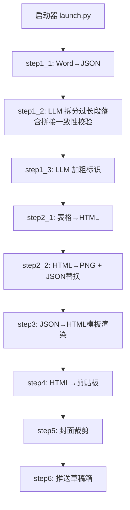
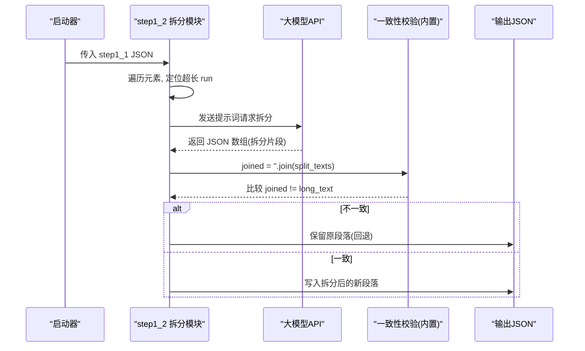
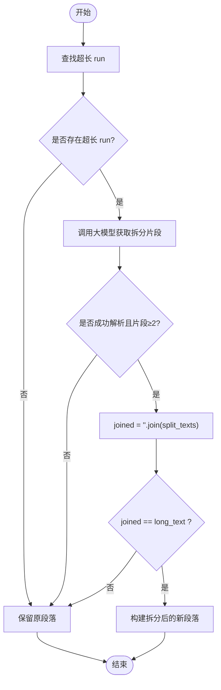
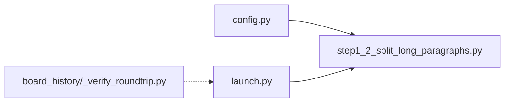

# 拼接一致性校验

<cite>
**本文引用的文件**   
- [step1_2_split_long_paragraphs.py](file://step1_2_split_long_paragraphs.py)
- [config.py](file://config.py)
- [launch.py](file://launch.py)
- [board_history/_verify_roundtrip.py](file://board_history/_verify_roundtrip.py)
</cite>

## 目录
1. [简介](#简介)
2. [项目结构](#项目结构)
3. [核心组件](#核心组件)
4. [架构总览](#架构总览)
5. [详细组件分析](#详细组件分析)
6. [依赖关系分析](#依赖关系分析)
7. [性能考量](#性能考量)
8. [故障排查指南](#故障排查指南)
9. [结论](#结论)
10. [附录](#附录)

## 简介
本技术文档聚焦于“拼接一致性校验”算法，该算法是内容保真度的关键防线。其核心目标是：在将长段落按语义拆分后，确保所有子段直接拼接的结果与原文完全一致（一字不改）。当校验失败时，系统采用回退策略保留原段落，避免污染下游渲染与发布流程。本文深入解释字符串精确匹配机制、差异检测方式、错误处理与回退路径、特殊字符/空白/编码的处理要点，并提供性能优化建议、调试技巧以及测试用例设计思路。

## 项目结构
本项目是一个 Word → 剪贴板的一键流水线，其中“拼接一致性校验”位于第 1.2 步（长段落拆分）中。整体流程由启动脚本编排，各步骤之间通过 JSON 中间产物传递数据。

图表来源
- [launch.py:42-201](file://launch.py#L42-L201)
- [step1_2_split_long_paragraphs.py:198-311](file://step1_2_split_long_paragraphs.py#L198-L311)

章节来源
- [launch.py:42-201](file://launch.py#L42-L201)
- [step1_2_split_long_paragraphs.py:198-311](file://step1_2_split_long_paragraphs.py#L198-L311)

## 核心组件
- 长段落拆分与一致性校验模块：负责调用大模型进行语义拆分，并在拆分结果拼接后执行严格的一致性比对；不一致则回退到原段落。
- 全局配置模块：提供 API 地址、请求头、重试次数、最大 token 数、段落拆分阈值等参数。
- 启动器：串联各步骤，控制跳过逻辑与输入输出路径。
- 往返校验工具：用于验证导出/导入的完整性与一致性（辅助验证手段）。

章节来源
- [step1_2_split_long_paragraphs.py:198-311](file://step1_2_split_long_paragraphs.py#L198-L311)
- [config.py:1-39](file://config.py#L1-L39)
- [launch.py:42-201](file://launch.py#L42-L201)
- [board_history/_verify_roundtrip.py:1-106](file://board_history/_verify_roundtrip.py#L1-L106)

## 架构总览
下图展示了“拼接一致性校验”在流水线中的位置及关键交互点。

图表来源
- [step1_2_split_long_paragraphs.py:231-278](file://step1_2_split_long_paragraphs.py#L231-L278)
- [step1_2_split_long_paragraphs.py:80-103](file://step1_2_split_long_paragraphs.py#L80-L103)

## 详细组件分析

### 拼接一致性校验算法
- 触发条件：对每个 paragraph 元素，扫描其 runs，若存在 text 长度超过阈值的 run，则进入拆分流程。
- 拆分过程：构造提示词并调用大模型，期望返回一个 JSON 数组，包含若干拆分后的文本片段。
- 拼接与比对：将返回的片段列表直接拼接为 joined，并与原始长文本 long_text 进行逐字比较。
- 判定规则：joined != long_text 即视为不一致，触发回退。
- 回退策略：若不一致或解析失败或片段数量不足，保持原段落不变，继续处理后续元素。

图表来源
- [step1_2_split_long_paragraphs.py:225-278](file://step1_2_split_long_paragraphs.py#L225-L278)

章节来源
- [step1_2_split_long_paragraphs.py:225-278](file://step1_2_split_long_paragraphs.py#L225-L278)

### 字符串精确匹配算法
- 实现方式：使用 Python 原生字符串相等性比较（joined != long_text），属于逐码点精确匹配。
- 复杂度：时间 O(n)，空间 O(n)（n 为文本长度），适合中等长度段落。
- 边界情况：
  - 空片段或空原文：直接导致不相等，触发回退。
  - 顺序不同：即使内容相同但顺序不同也会不相等，符合“铁律”。
  - 不可见字符差异：如空格、换行、零宽字符等，均会被检测到。

章节来源
- [step1_2_split_long_paragraphs.py:264-272](file://step1_2_split_long_paragraphs.py#L264-L272)

### 差异检测与诊断信息
- 当前实现：当不一致时，打印 diff 长度差值（len(joined) - len(long_text)），并输出原文与拼接结果的前 80 个字符，便于快速定位差异。
- 改进建议：可引入更精细的差异定位（例如逐字符对比并记录首个差异索引），以便进一步诊断。

章节来源
- [step1_2_split_long_paragraphs.py:266-270](file://step1_2_split_long_paragraphs.py#L266-L270)

### 校验失败的回退策略与错误处理
- 失败场景：
  - 模型调用失败或超时：保留原段落。
  - 解析失败或返回非数组：保留原段落。
  - 片段数量少于 2：保留原段落。
  - 拼接不一致：保留原段落。
- 回退行为：将原段落直接追加到新元素列表，不修改任何文字或格式。

章节来源
- [step1_2_split_long_paragraphs.py:251-272](file://step1_2_split_long_paragraphs.py#L251-L272)

### 特殊字符、空白字符与编码问题
- 空白字符处理：
  - 在打印日志时将不间断空格（\xa0）替换为普通空格，以避免 GBK 环境下的报错风险。
  - 注意：此替换仅用于展示，不参与一致性比对，保证比对基于原始字节序列。
- 编码问题：
  - 输入/输出 JSON 统一使用 UTF-8 编码读写，避免跨平台乱码。
  - 与外部系统交互（如剪贴板）时，需关注 Windows 剪贴板格式的字节偏移与编码转换（参考往返校验工具中对 UTF-8/UTF-16LE/CP936 的处理）。
- 建议：
  - 若未来需要忽略某些空白差异，应在比对前显式规范化（如统一空白），但会违背“一字不改”的铁律，需谨慎评估。

章节来源
- [step1_2_split_long_paragraphs.py:237-245](file://step1_2_split_long_paragraphs.py#L237-L245)
- [board_history/_verify_roundtrip.py:114-135](file://board_history/_verify_roundtrip.py#L114-L135)

### 为什么这个校验至关重要
- 内容保真度：确保拆分不会改变任何字符、标点或空白，维护原文一字不改的承诺。
- 下游安全：防止因 AI 生成偏差导致的篡改，保障渲染与发布的准确性。
- 审计可追溯：当出现不一致时，回退策略保证系统状态稳定，便于人工复核。

[本节为概念性说明，无需列出具体文件来源]

## 依赖关系分析
- 启动器依赖各步骤主函数，按配置决定是否跳过某一步骤。
- 拆分模块依赖全局配置（API_URL、HEADERS、MAX_RETRIES、MAX_TOKENS、SPLIT_THRESHOLD）。
- 往返校验工具独立运行，用于验证导出/导入的完整性与一致性，可作为辅助验证手段。

图表来源
- [config.py:1-39](file://config.py#L1-L39)
- [launch.py:42-201](file://launch.py#L42-L201)
- [board_history/_verify_roundtrip.py:1-106](file://board_history/_verify_roundtrip.py#L1-L106)

章节来源
- [config.py:1-39](file://config.py#L1-L39)
- [launch.py:42-201](file://launch.py#L42-L201)
- [board_history/_verify_roundtrip.py:1-106](file://board_history/_verify_roundtrip.py#L1-L106)

## 性能考量
- 时间复杂度：
  - 查找超长 run：O(m)，m 为段落内 runs 数量。
  - 拼接与比对：O(n)，n 为长文本长度。
  - 总体近似线性，适合常规文章规模。
- 内存占用：
  - 主要消耗在文本拼接与临时变量，建议对超大段落考虑分块处理或流式比对。
- 优化建议：
  - 提前计算长度差：若 len(joined) != len(long_text)，可直接判定不一致，减少后续逐字符比较成本。
  - 缓存阈值判断：对频繁处理的段落集合，可缓存 runs 长度统计。
  - 并行化：对不同段落进行并发处理（需注意线程安全与资源限制）。
  - 增量比对：仅在长度一致的情况下进行逐字符比对，提升效率。

[本节为通用性能讨论，无需列出具体文件来源]

## 故障排查指南
- 常见问题：
  - 模型调用失败：检查网络、API 密钥、超时设置；查看日志中的重试信息。
  - 解析失败：确认返回内容为合法 JSON 数组；必要时增加正则提取容错。
  - 片段数量不足：要求至少 2 段，否则回退。
  - 拼接不一致：核对前后 80 字差异，关注空白、标点、不可见字符。
- 调试技巧：
  - 启用详细日志：观察拆分前/后内容与长度统计。
  - 使用往返校验工具：验证导出/导入的完整性与一致性，辅助定位问题。
  - 逐步缩小范围：针对单个段落复现问题，隔离其他干扰因素。

章节来源
- [step1_2_split_long_paragraphs.py:251-272](file://step1_2_split_long_paragraphs.py#L251-L272)
- [board_history/_verify_roundtrip.py:47-91](file://board_history/_verify_roundtrip.py#L47-L91)

## 结论
“拼接一致性校验”以严格的字符串精确匹配为核心，结合完善的回退策略，确保了内容在拆分过程中的绝对保真。配合合理的异常处理与调试手段，该机制为整个流水线提供了坚实的质量保障。建议在保持“一字不改”原则的前提下，持续优化性能与诊断能力，进一步提升系统的稳定性与可维护性。

[本节为总结性内容，无需列出具体文件来源]

## 附录

### 测试用例与验证方法
- 单元测试建议：
  - 正常拆分：构造已知拆分结果的片段数组，验证拼接与原段落一致。
  - 异常拆分：注入额外空格、缺失标点、顺序打乱等，验证校验失败并回退。
  - 边界条件：空片段、单片段、超长片段、包含不可见字符等。
- 集成测试建议：
  - 端到端流程：从 Word 到剪贴板，验证最终输出与预期一致。
  - 往返校验：使用往返校验工具对比导出/导入的 HTML Format 二进制与纯文本，确保无改动。
- 验证方法：
  - 打印差异摘要：记录首次差异位置与上下文。
  - 哈希对比：对关键中间产物（如 HTML Fragment、Plain Text）计算哈希，辅助回归测试。

[本节为方法论说明，无需列出具体文件来源]