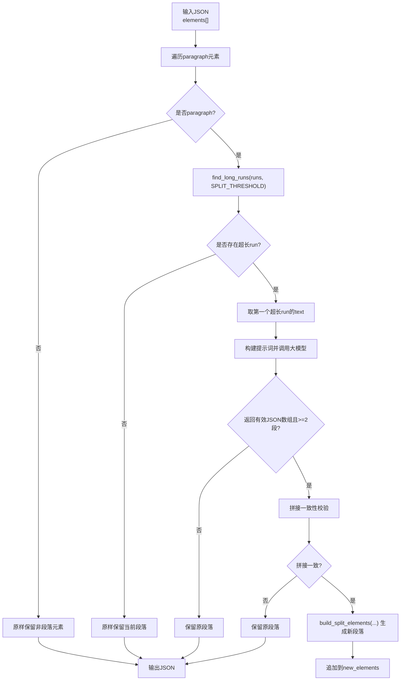
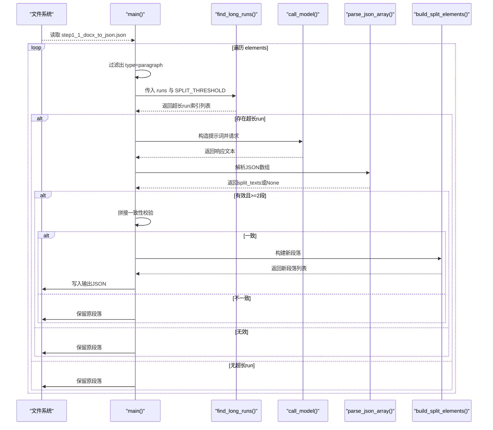
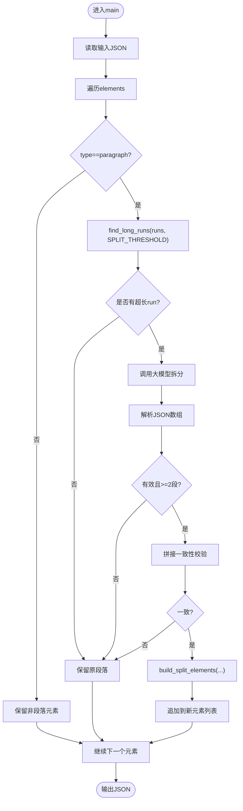
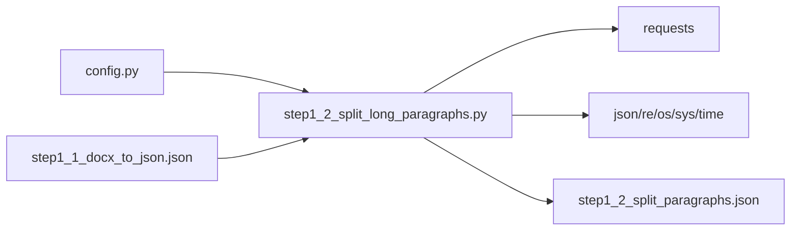

# 文本长度分析算法

<cite>
**本文引用的文件**   
- [step1_2_split_long_paragraphs.py](file://step1_2_split_long_paragraphs.py)
- [config.py](file://config.py)
- [content_20260710_1/step1_1_docx_to_json.json](file://content_instance/content_20260710_1/process/step1_1_docx_to_json.json)
</cite>

## 目录
1. [简介](#简介)
2. [项目结构](#项目结构)
3. [核心组件](#核心组件)
4. [架构总览](#架构总览)
5. [详细组件分析](#详细组件分析)
6. [依赖关系分析](#依赖关系分析)
7. [性能考量](#性能考量)
8. [故障排查指南](#故障排查指南)
9. [结论](#结论)
10. [附录](#附录)

## 简介
本技术文档聚焦于“文本长度分析算法”，围绕 find_long_runs 函数的实现逻辑、阈值检测机制与长段落识别策略展开，深入解释 SPLIT_THRESHOLD 配置参数的作用与调优方法，并说明 run 元素的遍历与长度计算逻辑。同时阐述为何选择基于 run 级别的长度分析而非整个段落级别，并提供性能优化建议、最佳实践以及边界情况处理方案。

## 项目结构
该算法位于流水线第 1.2 步脚本中，负责读取 step1_1 的输出 JSON，对每个 paragraph 元素中的 runs 进行长度扫描，当某个 run 的文本超过阈值时，调用大模型按语义拆分，并将结果重建为多个新的 paragraph 元素输出。

图表来源
- [step1_2_split_long_paragraphs.py:198-310](file://step1_2_split_long_paragraphs.py#L198-L310)
- [config.py:23-24](file://config.py#L23-L24)

章节来源
- [step1_2_split_long_paragraphs.py:1-310](file://step1_2_split_long_paragraphs.py#L1-L310)
- [config.py:1-39](file://config.py#L1-L39)

## 核心组件
- find_long_runs：在给定 runs 列表中找出所有 text 长度超过阈值的索引集合。
- build_split_elements：将单个 run 的拆分结果重构为多个新的 paragraph 元素，保持前后 runs 的归属与样式（如 bold）一致。
- main：主流程控制，包括文件读写、遍历、阈值判断、模型调用、解析与一致性校验、结果写入等。
- call_model / parse_json_array：网络请求封装与响应解析容错。

章节来源
- [step1_2_split_long_paragraphs.py:143-192](file://step1_2_split_long_paragraphs.py#L143-L192)
- [step1_2_split_long_paragraphs.py:80-141](file://step1_2_split_long_paragraphs.py#L80-L141)
- [step1_2_split_long_paragraphs.py:198-310](file://step1_2_split_long_paragraphs.py#L198-L310)

## 架构总览
下图展示了从输入 JSON 到输出 JSON 的关键数据流与控制流，突出 find_long_runs 与阈值检测、run 级拆分与一致性校验的位置。

图表来源
- [step1_2_split_long_paragraphs.py:198-310](file://step1_2_split_long_paragraphs.py#L198-L310)
- [step1_2_split_long_paragraphs.py:143-192](file://step1_2_split_long_paragraphs.py#L143-L192)
- [step1_2_split_long_paragraphs.py:80-141](file://step1_2_split_long_paragraphs.py#L80-L141)

## 详细组件分析

### find_long_runs 函数：阈值检测与长段落识别策略
- 输入：runs（段落内 runs 列表）、threshold（来自配置的 SPLIT_THRESHOLD）。
- 逻辑：线性遍历 runs，使用 len(run['text']) 比较 threshold，收集所有超长的 run 索引。
- 复杂度：时间 O(n)，空间 O(k)（k 为超长 run 的数量）。
- 设计要点：
  - 仅基于 run 级别进行长度判断，避免整段聚合带来的误判。
  - 返回索引列表便于后续只针对首个超长 run 触发拆分，减少不必要的模型调用。

章节来源
- [step1_2_split_long_paragraphs.py:143-149](file://step1_2_split_long_paragraphs.py#L143-L149)

#### 为什么选择基于 run 级别的长度分析而不是整个段落级别？
- 段落可能由多个 runs 组成，不同 run 可能有不同的样式（如加粗），合并统计会丢失样式粒度信息。
- 某些 run 可能包含大量纯文本，而相邻 run 很短；若以段落整体长度判断，可能导致短 run 被忽略或长 run 被掩盖。
- 基于 run 的判断能精准定位需要拆分的文本片段，提高拆分效率与准确性。

章节来源
- [step1_2_split_long_paragraphs.py:219-234](file://step1_2_split_long_paragraphs.py#L219-L234)
- [content_20260710_1/step1_1_docx_to_json.json:1-200](file://content_instance/content_20260710_1/process/step1_1_docx_to_json.json#L1-L200)

### SPLIT_THRESHOLD 配置参数：作用与调优方法
- 作用：定义单个 run 的 text 长度阈值，超过该值才触发拆分流程。
- 默认值：120（字符数）。
- 调优建议：
  - 内容密度高、句子较短的场景可适当降低阈值（例如 80-100），提升可读性。
  - 学术或专业文本句子较长，可适度提高阈值（例如 150-200），避免过度拆分破坏语义连贯。
  - 结合下游渲染平台限制（如移动端阅读体验）调整阈值，平衡段落长度与屏幕适配。
  - 通过小样本测试评估拆分质量，观察模型调用次数与最终段落数量变化。

章节来源
- [config.py:23-24](file://config.py#L23-L24)

### run 元素遍历与长度计算逻辑
- 遍历范围：仅对 type=paragraph 的元素进行处理，其他类型（如 table/image）原样保留。
- 长度计算：对每个 run 的 text 字段执行 len()，并与 SPLIT_THRESHOLD 比较。
- 决策路径：
  - 若无超长 run，直接保留原段落。
  - 若有超长 run，取第一个超长 run 的 text 作为待拆分对象，构建提示词并调用大模型。
  - 解析返回的 JSON 数组，要求至少两段，并进行拼接一致性校验。
  - 校验通过后，使用 build_split_elements 构建新的段落列表，保持前后 runs 归属与样式一致。

章节来源
- [step1_2_split_long_paragraphs.py:219-234](file://step1_2_split_long_paragraphs.py#L219-L234)
- [step1_2_split_long_paragraphs.py:257-276](file://step1_2_split_long_paragraphs.py#L257-L276)

### 构建拆分后元素：build_split_elements
- 目标：将单个 run 的拆分结果转换为多个新的 paragraph 元素。
- 规则：
  - 第一个新元素包含拆分前的 runs 加上第一段拆分文本。
  - 中间元素仅包含拆分后的各段文本。
  - 最后一个新元素包含最后一段拆分文本加上拆分后的 runs。
  - 保持 bold 样式与原 run 一致。
  - index 采用 “原index.N” 后缀，确保顺序与溯源清晰。

章节来源
- [step1_2_split_long_paragraphs.py:152-192](file://step1_2_split_long_paragraphs.py#L152-L192)

### 提示词与模型调用：call_model 与 parse_json_array
- call_model：封装 HTTP POST 请求，支持重试与超时，提取 choices[0].message.content。
- parse_json_array：具备容错能力，尝试直接解析、去除代码块标记后再解析、正则提取数组三种方式，确保鲁棒性。

章节来源
- [step1_2_split_long_paragraphs.py:80-141](file://step1_2_split_long_paragraphs.py#L80-L141)

### 流程图：find_long_runs 与主流程关键分支

图表来源
- [step1_2_split_long_paragraphs.py:198-310](file://step1_2_split_long_paragraphs.py#L198-L310)
- [step1_2_split_long_paragraphs.py:143-192](file://step1_2_split_long_paragraphs.py#L143-L192)

## 依赖关系分析
- 模块依赖：
  - step1_2_split_long_paragraphs.py 依赖 config.py 中的 API_URL、HEADERS、MAX_RETRIES、MAX_TOKENS、SPLIT_THRESHOLD。
- 外部依赖：
  - requests 用于网络请求。
  - json、re、os、sys、time 为标准库。
- 数据依赖：
  - 输入 JSON 结构遵循 step1_1 的输出格式，包含 file_name、total_elements、elements[]，其中 elements 包含 type、heading_level、runs、index 等字段。

图表来源
- [config.py:1-39](file://config.py#L1-L39)
- [step1_2_split_long_paragraphs.py:1-310](file://step1_2_split_long_paragraphs.py#L1-L310)
- [content_20260710_1/step1_1_docx_to_json.json:1-200](file://content_instance/content_20260710_1/process/step1_1_docx_to_json.json#L1-L200)

章节来源
- [config.py:1-39](file://config.py#L1-L39)
- [step1_2_split_long_paragraphs.py:1-310](file://step1_2_split_long_paragraphs.py#L1-L310)
- [content_20260710_1/step1_1_docx_to_json.json:1-200](file://content_instance/content_20260710_1/process/step1_1_docx_to_json.json#L1-L200)

## 性能考量
- 时间复杂度：
  - find_long_runs 为 O(n)，n 为段落内 runs 数量。
  - 主流程对每个段落进行一次阈值判断与可能的模型调用，总体复杂度取决于段落数量与超长 run 的比例。
- 空间复杂度：
  - 主要开销在于 new_elements 列表与临时字符串拼接，内存占用随输出规模线性增长。
- 优化建议：
  - 批量处理：对超长 run 进行批量化模型调用（需改造提示词与解析逻辑），减少网络往返。
  - 缓存策略：对相同文本的拆分结果进行缓存，避免重复调用。
  - 提前剪枝：在 find_long_runs 阶段增加快速失败条件（如空文本、空白字符），减少无效调用。
  - 并行化：对独立段落进行并发处理（注意线程安全与速率限制）。
  - 日志采样：在高吞吐场景下，降低打印频率，避免 I/O 瓶颈。

## 故障排查指南
- 常见错误与处理：
  - 模型调用失败：脚本内置重试机制，若最终失败则保留原段落并记录警告。
  - 解析失败：parse_json_array 提供多种容错路径，若仍失败则保留原段落。
  - 拆分结果无效：要求至少两段，否则保留原段落。
  - 拼接不一致：严格校验 split_texts 拼接后与原文完全一致，不一致则保留原段落并输出差异信息。
- 调试建议：
  - 检查 SPLIT_THRESHOLD 设置是否合理，过小会导致频繁拆分，过大则无法触发拆分。
  - 查看控制台输出的 run_len 与 full_len，确认阈值判断是否符合预期。
  - 对比原文与拼接结果的前若干字，定位不一致原因。

章节来源
- [step1_2_split_long_paragraphs.py:251-276](file://step1_2_split_long_paragraphs.py#L251-L276)
- [step1_2_split_long_paragraphs.py:80-141](file://step1_2_split_long_paragraphs.py#L80-L141)

## 结论
基于 run 级别的长度分析能够更精准地定位需要拆分的文本片段，配合 SPLIT_THRESHOLD 的可调性与严格的拼接一致性校验，既保证了语义完整性，又提升了可读性与渲染适配性。通过合理的阈值调优与性能优化策略，可在保证质量的前提下提升处理效率与稳定性。

## 附录
- 数据结构参考：
  - paragraph 元素包含 type、heading_level、runs、index 字段。
  - runs 为列表，每个 run 包含 text 与 bold 字段。
- 示例数据位置：
  - content_instance/content_20260710_1/process/step1_1_docx_to_json.json

章节来源
- [content_20260710_1/step1_1_docx_to_json.json:1-200](file://content_instance/content_20260710_1/process/step1_1_docx_to_json.json#L1-L200)