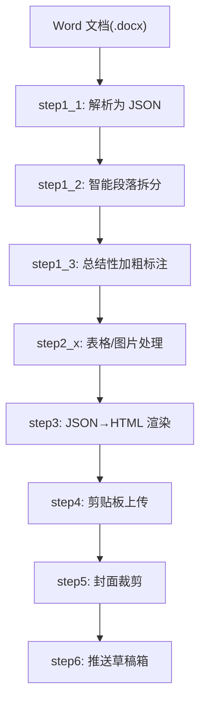
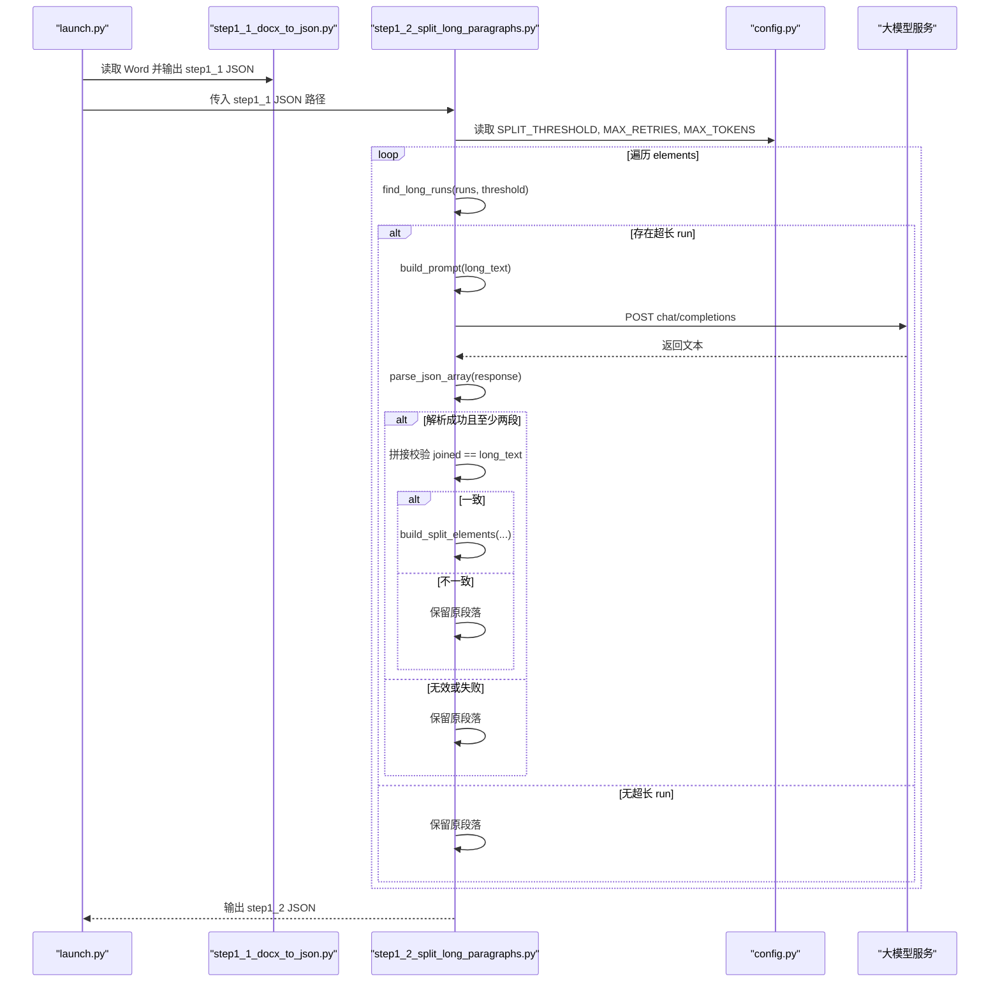
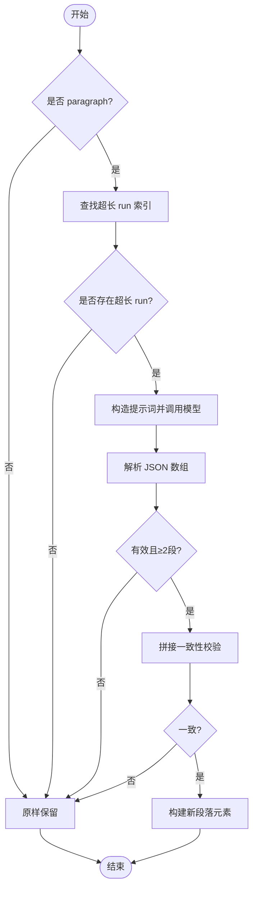
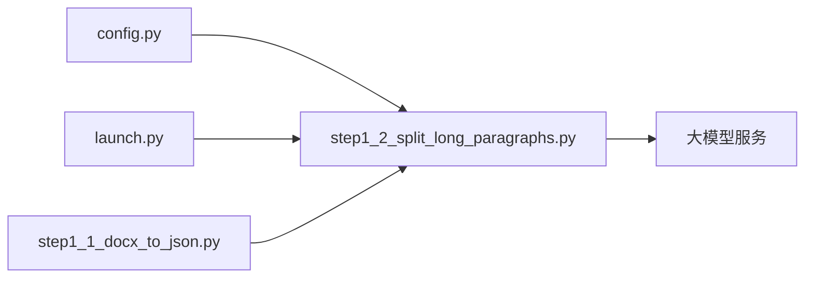

# 智能段落拆分算法

<cite>
**本文引用的文件**   
- [step1_2_split_long_paragraphs.py](file://step1_2_split_long_paragraphs.py)
- [config.py](file://config.py)
- [launch.py](file://launch.py)
- [step1_1_docx_to_json.py](file://step1_1_docx_to_json.py)
- [content_instance/content_20260702_1/process/step1_1_docx_to_json.json](file://content_instance/content_20260702_1/process/step1_1_docx_to_json.json)
- [content_instance/content_20260702_1/process/step1_2_split_paragraphs.json](file://content_instance/content_20260702_1/process/step1_2_split_paragraphs.json)
</cite>

## 目录
1. [简介](#简介)
2. [项目结构](#项目结构)
3. [核心组件](#核心组件)
4. [架构总览](#架构总览)
5. [详细组件分析](#详细组件分析)
6. [依赖关系分析](#依赖关系分析)
7. [性能考量](#性能考量)
8. [故障排查指南](#故障排查指南)
9. [结论](#结论)
10. [附录](#附录)

## 简介
本技术文档围绕“智能段落拆分算法”展开，聚焦以下目标：
- 文本长度分析算法：阈值检测机制与长段落识别逻辑
- 语义分割策略：提示词工程设计与语义完整性保证
- 上下文保持机制：确保拆分后段落内容连贯性
- JSON 数组解析逻辑：多种响应格式的容错处理
- 拼接一致性校验算法：确保原文一字不改的铁律
- 参数调优指南与质量评估方法
- 实际处理示例与常见问题解决方案

该算法作为流水线第 1.2 步，在 Word → JSON 之后、后续加粗标注之前执行，负责将过长段落按语义拆分为多个短段落，同时严格保证拼接结果与原文完全一致。

## 项目结构
与段落拆分直接相关的代码与数据如下：
- step1_2_split_long_paragraphs.py：核心拆分逻辑、提示词、模型调用、JSON 解析、一致性校验
- config.py：API URL、请求头、重试次数、最大 token、拆分阈值等全局配置
- launch.py：一键流水线编排，串联 step1_1 → step1_2 → step1_3 → ...
- step1_1_docx_to_json.py：Word 文档解析为结构化 JSON（供 step1_2 消费）
- content_instance/.../process/*.json：中间产物，用于验证输入输出结构与行为



图表来源
- [launch.py:42-193](file://launch.py#L42-L193)
- [step1_1_docx_to_json.py:145-184](file://step1_1_docx_to_json.py#L145-L184)
- [step1_2_split_long_paragraphs.py:198-301](file://step1_2_split_long_paragraphs.py#L198-L301)

章节来源
- [launch.py:1-201](file://launch.py#L1-L201)
- [step1_1_docx_to_json.py:1-200](file://step1_1_docx_to_json.py#L1-L200)
- [step1_2_split_long_paragraphs.py:1-311](file://step1_2_split_long_paragraphs.py#L1-L311)

## 核心组件
- 长度分析与阈值检测
  - 遍历每个 paragraph 的 runs，对每个 run.text 进行长度判断，超过 SPLIT_THRESHOLD 即标记为需要拆分
  - 默认阈值为 120 字符，可在配置中调整
- 语义分割与提示词工程
  - 通过系统级提示词约束大模型仅按语义切分，禁止机械按字数切割；明确拆分位置规则与最小段长限制
  - 强调“铁律：原文一字不改”，要求拼接后与原文完全一致
- 上下文保持
  - 拆分时保留原段落中其他 runs 的顺序与样式，仅对被拆分的 run 进行替换，生成新的 paragraph 元素并追加 .1/.2 后缀索引
- JSON 解析容错
  - 支持直接 JSON 数组、包裹在 ```json 代码块中的数组、以及正则提取最外层数组三种方式
- 拼接一致性校验
  - 将拆分后的所有片段直接拼接，与原始超长 run.text 逐字比较，不一致则放弃本次拆分，保留原段落

章节来源
- [config.py:23-24](file://config.py#L23-L24)
- [step1_2_split_long_paragraphs.py:143-149](file://step1_2_split_long_paragraphs.py#L143-L149)
- [step1_2_split_long_paragraphs.py:33-74](file://step1_2_split_long_paragraphs.py#L33-L74)
- [step1_2_split_long_paragraphs.py:106-140](file://step1_2_split_long_paragraphs.py#L106-L140)
- [step1_2_split_long_paragraphs.py:152-192](file://step1_2_split_long_paragraphs.py#L152-L192)
- [step1_2_split_long_paragraphs.py:264-272](file://step1_2_split_long_paragraphs.py#L264-L272)

## 架构总览
下图展示了从输入到输出的端到端流程，包括关键函数与数据流转。



图表来源
- [launch.py:82-90](file://launch.py#L82-L90)
- [step1_2_split_long_paragraphs.py:198-301](file://step1_2_split_long_paragraphs.py#L198-L301)
- [config.py:6-24](file://config.py#L6-L24)

## 详细组件分析

### 文本长度分析与阈值检测
- 扫描每个 paragraph 的 runs，计算每个 run.text 的长度
- 若长度大于 SPLIT_THRESHOLD，记录其索引，进入拆分流程
- 当前默认阈值为 120，可根据文章风格与阅读体验调整

复杂度分析
- 时间复杂度：O(N)，N 为 runs 总数
- 空间复杂度：O(1)，仅维护索引列表

优化建议
- 可引入缓存避免重复计算
- 可按段落级别预聚合长度，减少多次 join 开销

章节来源
- [step1_2_split_long_paragraphs.py:143-149](file://step1_2_split_long_paragraphs.py#L143-L149)
- [config.py:23-24](file://config.py#L23-L24)

### 语义分割策略与提示词工程
- 核心原则：语义完整优先，禁止机械按长度切割
- 参考分段数：根据总长度大致估算，每段约 100 字左右，最终以语义为准
- 拆分位置规则：仅在句号、问号、感叹号、分号之后拆分；不得在句子中间或关联关系中间断开；每段不少于 15 字符
- 铁律：拼接后必须与原文完全一致，不得增删改任何文字、标点、空格

设计要点
- 通过强约束提示词降低模型自由发挥，提升稳定性
- 以“语义边界”作为主要切分依据，兼顾可读性与信息密度

章节来源
- [step1_2_split_long_paragraphs.py:33-74](file://step1_2_split_long_paragraphs.py#L33-L74)

### 上下文保持机制
- 非段落元素（table/image）原样保留
- 对需要拆分的 run，将其前后 runs 分别归入第一个和最后一个新段落，中间段落仅包含拆分文本
- 新段落 index 采用 “原索引.序号” 形式，便于溯源与调试

数据结构与关系
- 输入：paragraph 元素，包含 runs 列表
- 输出：多个新的 paragraph 元素，runs 顺序与样式保持一致



图表来源
- [step1_2_split_long_paragraphs.py:198-301](file://step1_2_split_long_paragraphs.py#L198-L301)
- [step1_2_split_long_paragraphs.py:152-192](file://step1_2_split_long_paragraphs.py#L152-L192)

章节来源
- [step1_2_split_long_paragraphs.py:152-192](file://step1_2_split_long_paragraphs.py#L152-L192)

### JSON 数组解析逻辑与容错处理
- 直接解析：尝试将响应文本作为 JSON 数组解析
- 去除代码块标记：移除首尾的 ```json 与 ``` 包裹
- 正则提取：使用正则匹配最外层数组，再尝试解析
- 任一阶段成功即返回数组，否则返回 None

健壮性说明
- 兼容大模型常见的多格式输出
- 对非法 JSON 或空响应进行安全降级，不中断主流程

章节来源
- [step1_2_split_long_paragraphs.py:106-140](file://step1_2_split_long_paragraphs.py#L106-L140)

### 拼接一致性校验算法
- 将拆分后的所有片段直接拼接（不加空格），与原始超长 run.text 逐字比较
- 不一致则打印差异信息并保留原段落，确保“原文一字不改”的铁律不被破坏

实现要点
- 严格相等比较，避免隐式转换
- 失败路径提供诊断信息，便于定位问题

章节来源
- [step1_2_split_long_paragraphs.py:264-272](file://step1_2_split_long_paragraphs.py#L264-L272)

### 模型调用与重试机制
- 构造请求体，设置 max_completion_tokens、messages、stream=false
- 最多重试 MAX_RETRIES 次，指数退避等待
- 超时与网络异常均被捕获并记录日志

章节来源
- [step1_2_split_long_paragraphs.py:80-103](file://step1_2_split_long_paragraphs.py#L80-L103)
- [config.py:19-21](file://config.py#L19-L21)

### 输入输出数据模型
- 输入：step1_1 输出的 JSON，包含 file_name、total_elements、elements 列表
- 输出：step1_2 输出的 JSON，结构相同，但 elements 可能增加（拆分产生新段落）

示例对比
- 原始段落 index=5 的单个 run 被拆分为两个新段落，index 分别为 "5.1" 与 "5.2"
- 其余段落保持不变，非段落元素（如 image）原样保留

章节来源
- [content_instance/content_20260702_1/process/step1_1_docx_to_json.json:1-200](file://content_instance/content_20260702_1/process/step1_1_docx_to_json.json#L1-L200)
- [content_instance/content_20260702_1/process/step1_2_split_paragraphs.json:1-200](file://content_instance/content_20260702_1/process/step1_2_split_paragraphs.json#L1-L200)

## 依赖关系分析
- 模块耦合
  - step1_2 依赖 config 的全局参数
  - step1_2 由 launch.py 编排调用
  - step1_2 的输入来自 step1_1 的输出
- 外部依赖
  - requests 用于 HTTP 调用
  - json、re、os、sys、time 为标准库



图表来源
- [launch.py:82-90](file://launch.py#L82-L90)
- [step1_2_split_long_paragraphs.py:27](file://step1_2_split_long_paragraphs.py#L27)

章节来源
- [launch.py:1-201](file://launch.py#L1-L201)
- [step1_2_split_long_paragraphs.py:1-311](file://step1_2_split_long_paragraphs.py#L1-L311)
- [config.py:1-39](file://config.py#L1-L39)

## 性能考量
- 模型调用成本
  - 每次超长 run 触发一次 API 调用，需控制 SPLIT_THRESHOLD 以减少不必要的拆分
  - MAX_TOKENS 应足够覆盖提示词与输出，避免截断导致解析失败
- 重试与退避
  - 指数退避有助于缓解瞬时拥塞，但会增加整体耗时
- 解析与校验
  - JSON 解析与正则提取为轻量操作，影响较小
  - 拼接一致性校验为 O(L)，L 为超长 run 长度，通常可忽略

优化建议
- 批量合并超长 run 的提示词（风险较高，需谨慎）
- 对频繁失败的 run 进行采样统计，动态调整阈值
- 启用并发调用（需考虑 API 限流与幂等）

[本节为通用指导，无需具体文件引用]

## 故障排查指南
- 模型调用失败
  - 现象：返回 None，保留原段落
  - 排查：检查网络、认证头、超时与重试次数
  - 参考：[step1_2_split_long_paragraphs.py:80-103](file://step1_2_split_long_paragraphs.py#L80-L103)
- JSON 解析失败
  - 现象：parse_json_array 返回 None
  - 排查：查看模型输出是否包含合法数组，必要时调整提示词
  - 参考：[step1_2_split_long_paragraphs.py:106-140](file://step1_2_split_long_paragraphs.py#L106-L140)
- 拆分结果无效
  - 现象：返回数组长度小于 2
  - 排查：提示词是否过于保守，或模型未按要求拆分
  - 参考：[step1_2_split_long_paragraphs.py:257-262](file://step1_2_split_long_paragraphs.py#L257-L262)
- 拼接不一致
  - 现象：joined != long_text，保留原段落
  - 排查：确认模型是否增删改了原文，必要时强化提示词约束
  - 参考：[step1_2_split_long_paragraphs.py:264-272](file://step1_2_split_long_paragraphs.py#L264-L272)
- 阈值设置不当
  - 现象：过多或过少触发拆分
  - 排查：调整 SPLIT_THRESHOLD，结合样本评估效果
  - 参考：[config.py:23-24](file://config.py#L23-L24)

章节来源
- [step1_2_split_long_paragraphs.py:80-103](file://step1_2_split_long_paragraphs.py#L80-L103)
- [step1_2_split_long_paragraphs.py:106-140](file://step1_2_split_long_paragraphs.py#L106-L140)
- [step1_2_split_long_paragraphs.py:257-272](file://step1_2_split_long_paragraphs.py#L257-L272)
- [config.py:23-24](file://config.py#L23-L24)

## 结论
该智能段落拆分算法以“语义完整优先”为核心，通过严格的提示词工程与拼接一致性校验，确保拆分后的内容既易读又忠实于原文。配合灵活的阈值与重试机制，能够在不同文本风格下保持稳定表现。建议在真实业务场景中持续收集样本，迭代提示词与参数，以获得更佳的拆分质量与效率平衡。

[本节为总结性内容，无需具体文件引用]

## 附录

### 参数调优指南
- SPLIT_THRESHOLD
  - 建议范围：100–150 字符
  - 调整依据：平均段落长度、读者阅读习惯、移动端显示效果
- MAX_TOKENS
  - 建议值：≥ 提示词 + 预期输出长度 + 冗余
  - 过大可能导致延迟，过小可能导致截断
- MAX_RETRIES
  - 建议值：2–5
  - 结合网络稳定性与业务 SLA 权衡
- 提示词微调
  - 强化“语义边界”与“最小段长”约束
  - 针对特定领域（金融、科技）加入术语与句式偏好

章节来源
- [config.py:19-24](file://config.py#L19-L24)
- [step1_2_split_long_paragraphs.py:33-74](file://step1_2_split_long_paragraphs.py#L33-L74)

### 质量评估方法
- 指标
  - 拆分率：被拆分段落占比
  - 平均段长：拆分后各段长度的均值与方差
  - 一致性通过率：拼接一致性校验通过的比率
  - 人工抽检：随机抽样评估语义完整性与可读性
- 工具
  - 基于 JSON 统计 total_elements 变化
  - 基于控制台日志统计 split_count 与 call_count
  - 可视化展示段落长度分布

章节来源
- [step1_2_split_long_paragraphs.py:297-301](file://step1_2_split_long_paragraphs.py#L297-L301)
- [content_instance/content_20260702_1/process/step1_1_docx_to_json.json:1-200](file://content_instance/content_20260702_1/process/step1_1_docx_to_json.json#L1-L200)
- [content_instance/content_20260702_1/process/step1_2_split_paragraphs.json:1-200](file://content_instance/content_20260702_1/process/step1_2_split_paragraphs.json#L1-L200)

### 实际处理示例
- 示例一：单 run 超长被拆分为两段
  - 原始 index=5 的段落被拆为 index="5.1" 与 index="5.2"
  - 其余段落保持不变
- 示例二：含图片的段落序列
  - image 元素原样保留，不影响拆分逻辑
- 示例三：多 runs 段落
  - 拆分仅作用于超长 run，前后 runs 顺序与样式不变

章节来源
- [content_instance/content_20260702_1/process/step1_1_docx_to_json.json:60-81](file://content_instance/content_20260702_1/process/step1_1_docx_to_json.json#L60-L81)
- [content_instance/content_20260702_1/process/step1_2_split_paragraphs.json:60-81](file://content_instance/content_20260702_1/process/step1_2_split_paragraphs.json#L60-L81)
- [content_instance/content_20260702_1/process/step1_1_docx_to_json.json:186-190](file://content_instance/content_20260702_1/process/step1_1_docx_to_json.json#L186-L190)
- [content_instance/content_20260702_1/process/step1_2_split_paragraphs.json:196-200](file://content_instance/content_20260702_1/process/step1_2_split_paragraphs.json#L196-L200)