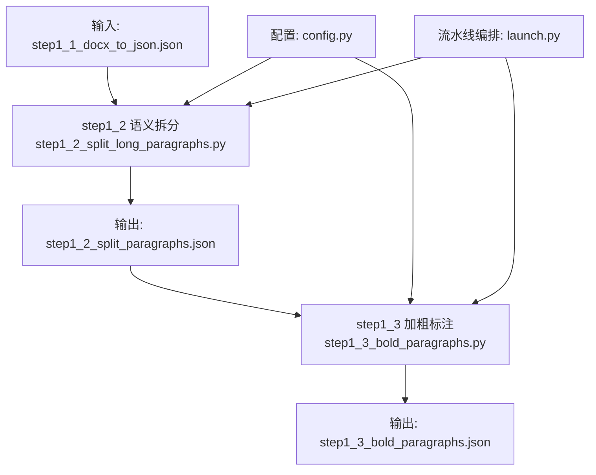
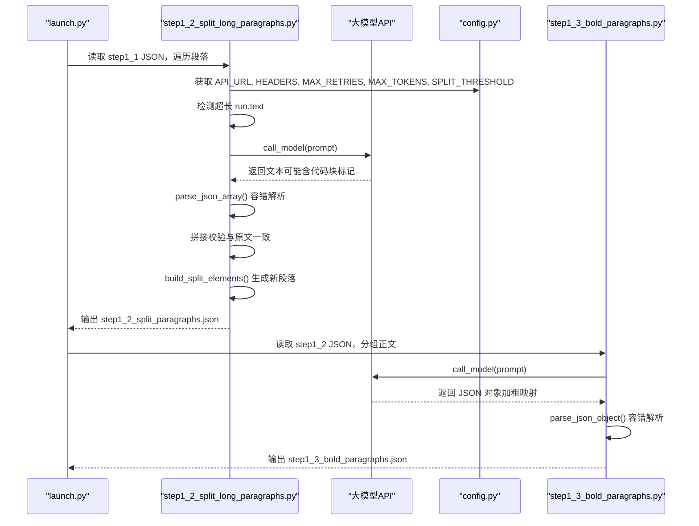
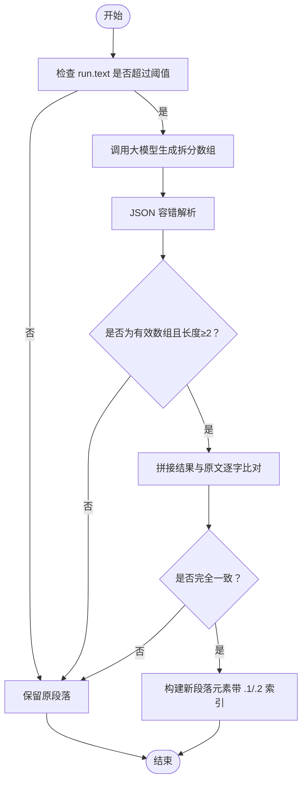
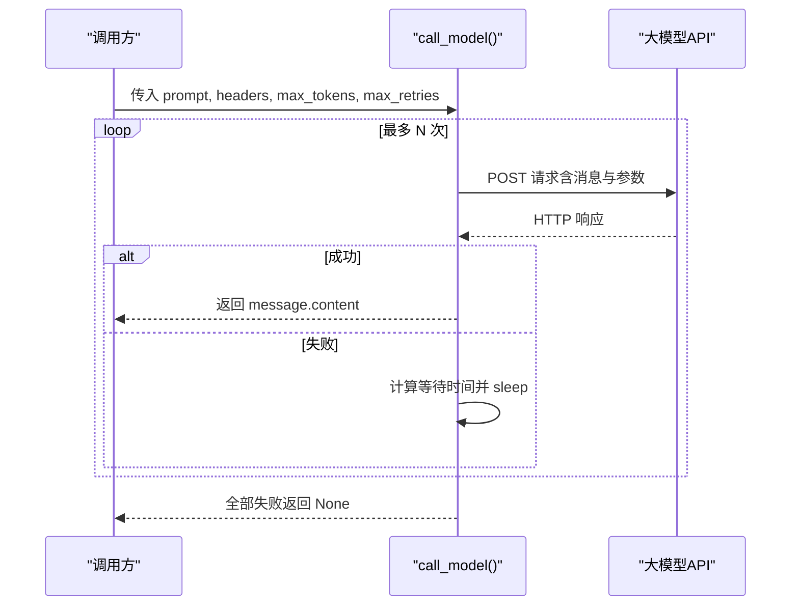
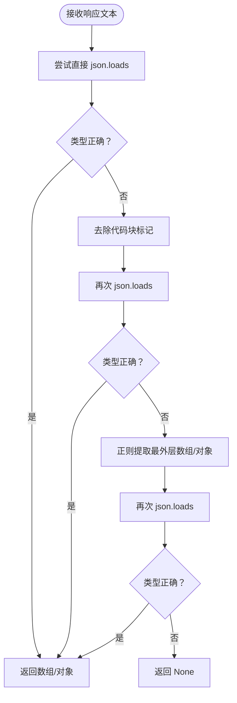
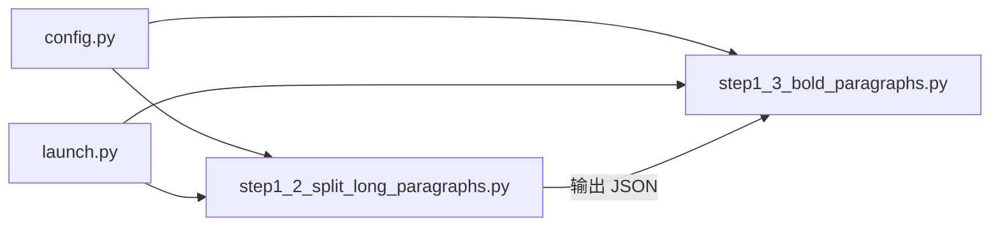

# 语义分割策略

<cite>
**本文引用的文件**
- [step1_2_split_long_paragraphs.py](file://step1_2_split_long_paragraphs.py)
- [step1_3_bold_paragraphs.py](file://step1_3_bold_paragraphs.py)
- [config.py](file://config.py)
- [launch.py](file://launch.py)
- [content_20260702_1/process/step1_2_split_paragraphs.json](file://content_instance/content_20260702_1/process/step1_2_split_paragraphs.json)
</cite>

## 目录
1. [引言](#引言)
2. [项目结构](#项目结构)
3. [核心组件](#核心组件)
4. [架构总览](#架构总览)
5. [详细组件分析](#详细组件分析)
6. [依赖关系分析](#依赖关系分析)
7. [性能与稳定性考量](#性能与稳定性考量)
8. [故障排查指南](#故障排查指南)
9. [结论](#结论)
10. [附录：提示词调优与质量评估](#附录提示词调优与质量评估)

## 引言
本技术文档聚焦于“语义分割策略”，围绕以下目标展开：
- 解释 PROMPT 提示词工程的设计理念与核心原则
- 深入分析语义完整性保证机制，包括拆分位置规则与约束条件
- 描述大模型调用流程（call_model）的实现细节、错误处理与重试机制
- 说明 JSON 响应格式解析的容错处理逻辑
- 解释如何平衡语义完整性和段落长度
- 提供提示词调优指南和质量评估方法
- 包含实际处理示例和常见问题解决方案

该策略应用于流水线 step1_2（过长段落按语义拆分），并在 step1_3 中进一步为正文添加总结性加粗标识，最终输出可用于渲染与发布的结构化内容。

## 项目结构
与语义分割直接相关的代码与数据如下：
- step1_2_split_long_paragraphs.py：实现超长段落的语义拆分主流程、提示词、模型调用与 JSON 解析容错
- step1_3_bold_paragraphs.py：在已拆分段落基础上进行总结性加粗标注（辅助提升可读性）
- config.py：集中配置 API 地址、请求头、重试次数、最大 token 数、拆分阈值等
- launch.py：一键流水线编排器，串联 step1_1 → step1_2 → step1_3 → … 各步骤
- content_instance/.../process/step1_2_split_paragraphs.json：step1_2 的实际输出样例，体现拆分后的元素结构与索引命名约定



图表来源
- [step1_2_split_long_paragraphs.py:1-311](file://step1_2_split_long_paragraphs.py#L1-L311)
- [step1_3_bold_paragraphs.py:1-340](file://step1_3_bold_paragraphs.py#L1-L340)
- [config.py:1-39](file://config.py#L1-L39)
- [launch.py:1-201](file://launch.py#L1-L201)

章节来源
- [step1_2_split_long_paragraphs.py:1-311](file://step1_2_split_long_paragraphs.py#L1-L311)
- [step1_3_bold_paragraphs.py:1-340](file://step1_3_bold_paragraphs.py#L1-L340)
- [config.py:1-39](file://config.py#L1-L39)
- [launch.py:1-201](file://launch.py#L1-L201)

## 核心组件
- 提示词工程（PROMPT）
  - 语义优先：强调以语义为单位切分，禁止机械按长度切割
  - 拆分位置规则：限定在句末标点之后，禁止在复句中切断
  - 原文一致性铁律：拼接后必须与原文完全一致，不得增删改
  - 输出格式：严格返回 JSON 数组，便于程序化解析
- 大模型调用封装（call_model）
  - 统一构造请求体、设置超时
  - 指数退避重试（固定间隔递增）
  - 异常捕获与失败回退（保留原段落或跳过）
- JSON 解析容错（parse_json_array / parse_json_object）
  - 直接解析 → 去除代码块标记再解析 → 正则提取最外层数组/对象 → 再次尝试解析
  - 类型校验（list/dict）确保下游安全使用
- 语义完整性校验
  - 将拆分结果拼接并与原文逐字比对，不一致则丢弃本次拆分并保留原段落
- 段落构建与索引管理
  - 对单个 run 的拆分结果生成多个新 paragraph 元素，index 采用“.1/.2”后缀保持可追溯性

章节来源
- [step1_2_split_long_paragraphs.py:33-74](file://step1_2_split_long_paragraphs.py#L33-L74)
- [step1_2_split_long_paragraphs.py:80-103](file://step1_2_split_long_paragraphs.py#L80-L103)
- [step1_2_split_long_paragraphs.py:106-140](file://step1_2_split_long_paragraphs.py#L106-L140)
- [step1_2_split_long_paragraphs.py:152-192](file://step1_2_split_long_paragraphs.py#L152-L192)
- [step1_2_split_long_paragraphs.py:198-301](file://step1_2_split_long_paragraphs.py#L198-L301)
- [step1_3_bold_paragraphs.py:32-67](file://step1_3_bold_paragraphs.py#L32-L67)
- [step1_3_bold_paragraphs.py:73-96](file://step1_3_bold_paragraphs.py#L73-L96)
- [step1_3_bold_paragraphs.py:99-133](file://step1_3_bold_paragraphs.py#L99-L133)

## 架构总览
下图展示了从输入到输出的关键流程，以及各模块之间的交互关系。



图表来源
- [launch.py:42-110](file://launch.py#L42-L110)
- [step1_2_split_long_paragraphs.py:198-301](file://step1_2_split_long_paragraphs.py#L198-L301)
- [step1_3_bold_paragraphs.py:207-330](file://step1_3_bold_paragraphs.py#L207-L330)
- [config.py:6-24](file://config.py#L6-L24)

## 详细组件分析

### 提示词工程（PROMPT）设计理念与核心原则
- 语义完整性优先
  - 明确“一个完整的意思还没讲完，绝对不能拆”，避免断章取义
  - 拆分点应出现在“上一件事说完了”的位置，而非“字数到了”的地方
- 参考分段数量
  - 给出大致分段建议（每段约 100 字左右），但最终以语义为准
- 拆分位置规则
  - 仅允许在句号、问号、感叹号、分号之后拆分
  - 禁止在因果、转折、递进关系的中间断开
  - 单段最小长度约束（不少于 15 字符），不足则合并
- 原文一字不改的铁律
  - 拼接后必须与原文完全一致，顺序不变，不增删改任何文字与空格
- 输出格式要求
  - 只返回 JSON 数组，不包含解释或代码块标记，便于稳定解析

章节来源
- [step1_2_split_long_paragraphs.py:33-74](file://step1_2_split_long_paragraphs.py#L33-L74)

### 语义完整性保证机制
- 触发条件
  - 当某 run.text 长度超过阈值（默认 120）时触发拆分
- 拆分位置规则与约束
  - 仅在句末标点之后切分；禁止在复句内部切分；最小段落长度约束
- 一致性校验
  - 将拆分结果拼接后与原文逐字比较，不一致则放弃本次拆分，保留原段落
- 数据结构与索引
  - 对单个 run 的拆分结果生成多个新 paragraph 元素，index 采用“.1/.2”后缀，便于溯源



图表来源
- [step1_2_split_long_paragraphs.py:143-192](file://step1_2_split_long_paragraphs.py#L143-L192)
- [step1_2_split_long_paragraphs.py:198-301](file://step1_2_split_long_paragraphs.py#L198-L301)

章节来源
- [step1_2_split_long_paragraphs.py:143-192](file://step1_2_split_long_paragraphs.py#L143-L192)
- [step1_2_split_long_paragraphs.py:198-301](file://step1_2_split_long_paragraphs.py#L198-L301)

### 大模型调用流程（call_model）实现细节、错误处理与重试机制
- 请求构造
  - 统一 payload 结构：max_completion_tokens、messages（user 角色）、stream=False
- 重试策略
  - 最多重试 N 次（由配置决定），每次失败等待时间递增（指数退避）
- 异常处理
  - 捕获网络异常，打印失败信息并继续重试
  - 若所有重试均失败，返回 None，上游保留原段落或跳过
- 响应提取
  - 从 choices[0].message.content 中提取文本



图表来源
- [step1_2_split_long_paragraphs.py:80-103](file://step1_2_split_long_paragraphs.py#L80-L103)
- [step1_3_bold_paragraphs.py:73-96](file://step1_3_bold_paragraphs.py#L73-L96)
- [config.py:20-24](file://config.py#L20-L24)

章节来源
- [step1_2_split_long_paragraphs.py:80-103](file://step1_2_split_long_paragraphs.py#L80-L103)
- [step1_3_bold_paragraphs.py:73-96](file://step1_3_bold_paragraphs.py#L73-L96)
- [config.py:20-24](file://config.py#L20-L24)

### JSON 响应格式解析的容错处理逻辑
- 数组解析（step1_2）
  - 直接 json.loads → 去除 ```json 代码块标记后再解析 → 正则提取最外层 [...] 再解析
  - 类型校验为 list，否则返回 None
- 对象解析（step1_3）
  - 直接 json.loads → 去除 ```json 代码块标记后再解析 → 正则提取最外层 {...} 再解析
  - 类型校验为 dict，否则返回 None
- 设计动机
  - 大模型可能返回 Markdown 包裹的 JSON，或附带多余文本，容错解析提高鲁棒性



图表来源
- [step1_2_split_long_paragraphs.py:106-140](file://step1_2_split_long_paragraphs.py#L106-L140)
- [step1_3_bold_paragraphs.py:99-133](file://step1_3_bold_paragraphs.py#L99-L133)

章节来源
- [step1_2_split_long_paragraphs.py:106-140](file://step1_2_split_long_paragraphs.py#L106-L140)
- [step1_3_bold_paragraphs.py:99-133](file://step1_3_bold_paragraphs.py#L99-L133)

### 语义完整性与段落长度的平衡
- 触发阈值
  - 通过 SPLIT_THRESHOLD 控制何时触发拆分（默认 120 字符）
- 语义优先
  - 即使达到阈值，也必须在语义边界处切分；必要时允许稍长或稍短
- 最小段落长度
  - 单段不得少于 15 字符，防止碎片化
- 参考分段数量
  - 根据总长度估算分段数，但最终服从语义完整性
- 一致性校验兜底
  - 拼接后与原文不一致则放弃拆分，保障“原文一字不改”

章节来源
- [config.py:24](file://config.py#L24)
- [step1_2_split_long_paragraphs.py:33-74](file://step1_2_split_long_paragraphs.py#L33-L74)
- [step1_2_split_long_paragraphs.py:198-301](file://step1_2_split_long_paragraphs.py#L198-L301)

### 实际处理示例
- 输入：step1_1_docx_to_json.json（Word 转 JSON）
- 过程：
  - 遍历 elements，识别 paragraph 中的 run.text
  - 对超长 run 调用大模型，得到 JSON 数组形式的拆分结果
  - 拼接校验通过后，构建新的 paragraph 元素，index 追加“.1/.2”
- 输出：step1_2_split_paragraphs.json
  - 示例片段可见 content_instance/content_20260702_1/process/step1_2_split_paragraphs.json，其中 index 如 “5.1”、“5.2” 体现了拆分后的子段落

章节来源
- [content_instance/content_20260702_1/process/step1_2_split_paragraphs.json:1-200](file://content_instance/content_20260702_1/process/step1_2_split_paragraphs.json#L1-L200)

## 依赖关系分析
- 模块耦合
  - step1_2 与 step1_3 均依赖 config.py 提供的 API 与通用参数
  - launch.py 作为编排器，按顺序调用 step1_2 与 step1_3
- 外部依赖
  - requests 用于 HTTP 请求
  - json、re 用于数据解析与容错
- 潜在循环依赖
  - 当前无循环依赖；step1_2 与 step1_3 相互独立，仅通过 JSON 文件传递数据



图表来源
- [config.py:1-39](file://config.py#L1-L39)
- [launch.py:42-110](file://launch.py#L42-L110)
- [step1_2_split_long_paragraphs.py:1-311](file://step1_2_split_long_paragraphs.py#L1-L311)
- [step1_3_bold_paragraphs.py:1-340](file://step1_3_bold_paragraphs.py#L1-L340)

章节来源
- [config.py:1-39](file://config.py#L1-L39)
- [launch.py:42-110](file://launch.py#L42-L110)
- [step1_2_split_long_paragraphs.py:1-311](file://step1_2_split_long_paragraphs.py#L1-L311)
- [step1_3_bold_paragraphs.py:1-340](file://step1_3_bold_paragraphs.py#L1-L340)

## 性能与稳定性考量
- 并发与串行
  - 当前为串行处理，适合中小规模文档；如需加速，可对段落组并行调用（需考虑 API 限流）
- 重试与超时
  - 指数退避重试 + 固定超时，降低瞬时失败影响
- 解析容错
  - 多层容错解析减少因模型输出格式波动导致的失败
- 资源占用
  - 单次请求 token 上限受 MAX_TOKENS 限制，避免过大上下文导致失败或高延迟

[本节为通用指导，无需具体文件引用]

## 故障排查指南
- 模型调用失败
  - 现象：日志显示“请求失败，Xs 后重试”并最终失败
  - 排查：检查 API_URL、HEADERS、网络连通性与配额；确认 MAX_RETRIES 与 MAX_TOKENS 配置合理
- JSON 解析失败
  - 现象：parse_json_array/object 返回 None
  - 排查：查看模型原始响应，确认是否包含非 JSON 文本；优化 PROMPT 强制纯 JSON 输出
- 拼接不一致
  - 现象：拆分结果拼接后与原文不一致，被判定无效
  - 排查：检查 PROMPT 的“原文一字不改”约束是否生效；必要时调整阈值或提示词
- 拆分过碎或过少
  - 现象：段落过碎或仍过长
  - 排查：调整 SPLIT_THRESHOLD；在 PROMPT 中强化最小段落长度与参考分段数量

章节来源
- [step1_2_split_long_paragraphs.py:80-103](file://step1_2_split_long_paragraphs.py#L80-L103)
- [step1_2_split_long_paragraphs.py:106-140](file://step1_2_split_long_paragraphs.py#L106-L140)
- [step1_2_split_long_paragraphs.py:198-301](file://step1_2_split_long_paragraphs.py#L198-L301)
- [config.py:20-24](file://config.py#L20-L24)

## 结论
本语义分割策略以“语义完整性优先”为核心，结合严格的拆分位置规则与一致性校验，确保“原文一字不改”。通过统一的 call_model 封装与多层 JSON 容错解析，系统在面对模型输出波动与网络不稳定时具备较强鲁棒性。配合合理的阈值与提示词调优，可在语义完整性与段落长度之间取得良好平衡，满足高质量内容生产需求。

[本节为总结性内容，无需具体文件引用]

## 附录：提示词调优与质量评估

### 提示词调优指南
- 强化语义边界
  - 在 PROMPT 中增加典型例句，示范如何在复句前后切分
- 明确输出格式
  - 强调“只输出 JSON 数组/对象，不要任何解释或代码块标记”
- 约束最小段落长度
  - 在 PROMPT 中重申“每段不少于 15 字符”，避免碎片化
- 参考分段数量
  - 根据业务阅读体验调整“每段约 100 字”的引导，但不强求
- 一致性兜底
  - 在 PROMPT 中再次强调“拼接后必须与原文完全一致”

章节来源
- [step1_2_split_long_paragraphs.py:33-74](file://step1_2_split_long_paragraphs.py#L33-L74)
- [step1_3_bold_paragraphs.py:32-67](file://step1_3_bold_paragraphs.py#L32-L67)

### 质量评估方法
- 自动化指标
  - 拆分成功率：成功拆分段落数 / 触发拆分总数
  - 一致性通过率：拼接一致段落数 / 成功解析段落数
  - 平均段落长度：统计拆分后段落长度分布
- 人工抽检
  - 随机抽取若干文章，检查拆分点是否符合语义边界
  - 检查是否存在过碎或过长的段落
- 回归测试
  - 针对历史样本建立基准，对比不同 PROMPT 或阈值的差异

[本节为方法论指导，无需具体文件引用]