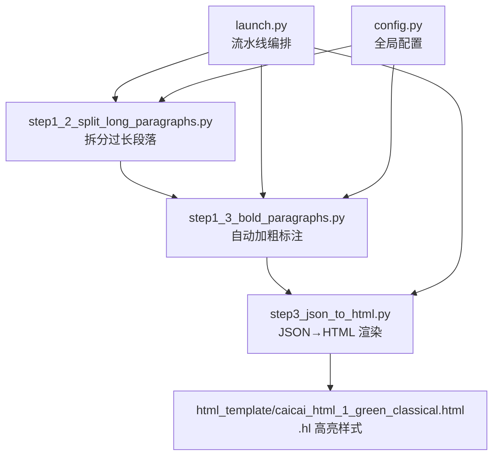
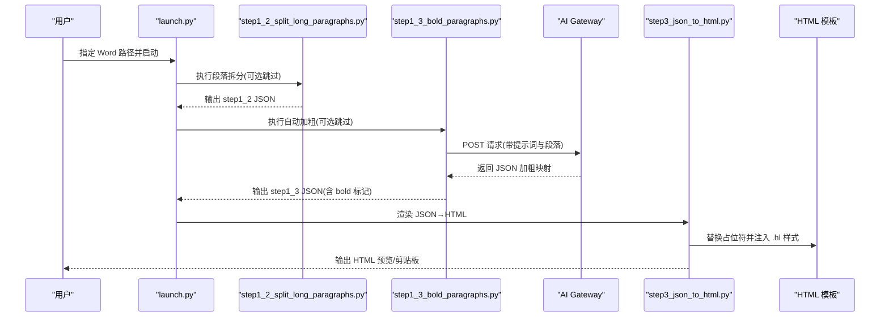
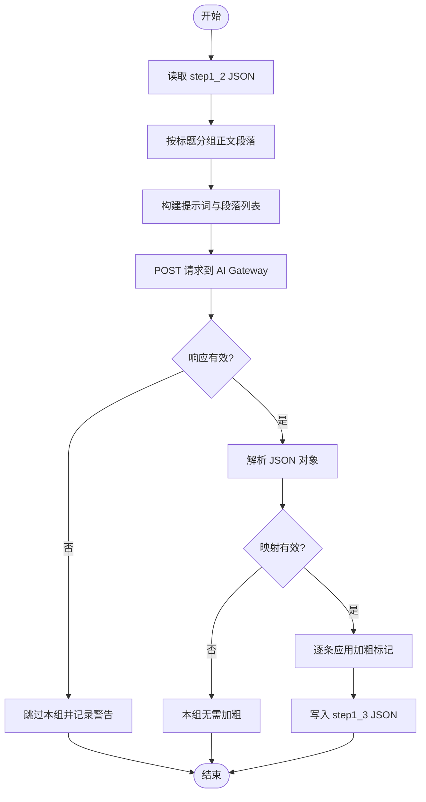
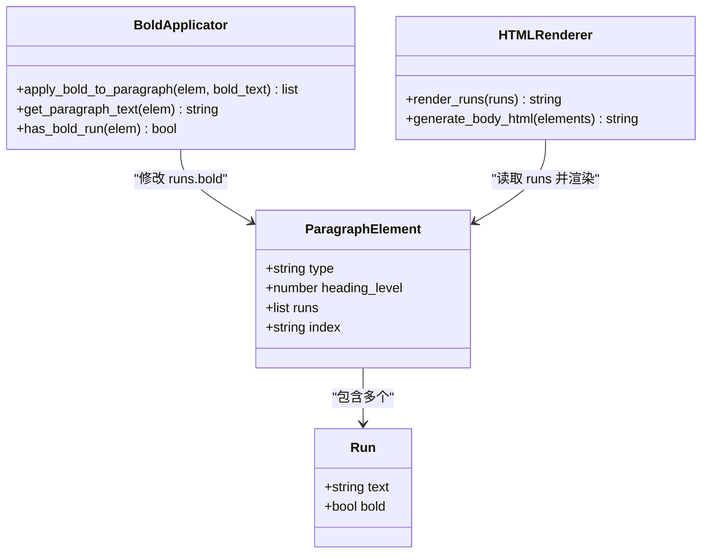
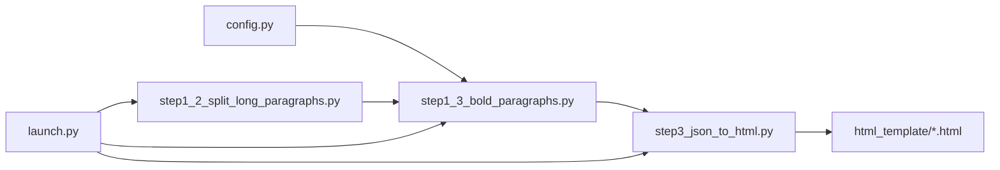

# 自动加粗标注功能

<cite>
**本文引用的文件**   
- [step1_3_bold_paragraphs.py](file://step1_3_bold_paragraphs.py)
- [config.py](file://config.py)
- [launch.py](file://launch.py)
- [step1_2_split_long_paragraphs.py](file://step1_2_split_long_paragraphs.py)
- [step3_json_to_html.py](file://step3_json_to_html.py)
- [caicai_html_1_green_classical.html](file://html_template/caicai_html_1_green_classical.html)
- [clipboard_export.html](file://board_history/clipboard_export.html)
- [content_20260703_1/process/step1_3_bold_paragraphs.json](file://content_instance/content_20260703_1/process/step1_3_bold_paragraphs.json)
</cite>

## 目录
1. [简介](#简介)
2. [项目结构](#项目结构)
3. [核心组件](#核心组件)
4. [架构总览](#架构总览)
5. [详细组件分析](#详细组件分析)
6. [依赖关系分析](#依赖关系分析)
7. [性能与并发](#性能与并发)
8. [提示词设计与优化](#提示词设计与优化)
9. [效果评估方法](#效果评估方法)
10. [故障排查指南](#故障排查指南)
11. [结论](#结论)
12. [附录：处理案例与调参指南](#附录处理案例与调参指南)

## 简介
本技术文档聚焦“自动加粗标注”能力，围绕以下目标展开：
- 解释提示词设计原理：加粗规则定义、语义重要性判断标准
- 描述 AI 模型调用流程：输入数据准备、输出结果解析
- 说明加粗标记生成逻辑：bold 字段设置规则、样式继承机制
- 文档化批量处理策略：分组处理、错误恢复与重试
- 提供提示词优化建议与效果评估方法
- 包含实际处理案例与调参指南

该能力位于流水线第 1.3 步，在段落拆分之后、表格渲染之前执行，通过大模型识别总结性、判断性或序列性表达，为正文段落智能添加加粗标识。

## 项目结构
自动加粗标注功能涉及的关键文件与角色如下：
- step1_3_bold_paragraphs.py：核心实现，负责按标题分段、构造提示词、调用模型、解析返回并应用 bold 标记
- config.py：集中配置（API 地址、请求头、重试次数、最大 token、段落拆分阈值等）
- launch.py：一键流水线编排，串联 step1_1 → step1_2 → step1_3 → … → step6
- step1_2_split_long_paragraphs.py：上游步骤，将过长段落拆分为多段，便于后续加粗定位更精准
- step3_json_to_html.py：下游步骤，将 JSON 中的 runs.bold 渲染为 HTML 的 <span class="hl"> 高亮样式
- html_template/caicai_html_1_green_classical.html：HTML 模板，定义 .hl 高亮样式（绿色背景 + 加粗）
- board_history/clipboard_export.html：剪贴板导出示例，展示最终渲染效果
- content_instance/.../process/step1_3_bold_paragraphs.json：实际运行产物，体现 bold 标记落地情况



图表来源
- [step1_3_bold_paragraphs.py:1-339](file://step1_3_bold_paragraphs.py#L1-L339)
- [step1_2_split_long_paragraphs.py:1-311](file://step1_2_split_long_paragraphs.py#L1-L311)
- [step3_json_to_html.py:1-149](file://step3_json_to_html.py#L1-L149)
- [launch.py:1-201](file://launch.py#L1-L201)
- [config.py:1-39](file://config.py#L1-L39)

章节来源
- [launch.py:1-201](file://launch.py#L1-L201)
- [config.py:1-39](file://config.py#L1-L39)

## 核心组件
- 提示词模块：定义加粗规则、频率控制、严格限制与输出格式要求
- 模型调用模块：封装 HTTP 请求、超时与重试、响应提取
- 解析器模块：从 LLM 文本中稳健提取 JSON 对象（支持代码块包裹、正则兜底）
- 段落分组与索引映射：按标题切分正文组，维护 index→元素位置映射
- 加粗应用引擎：基于原文逐字匹配，精确计算 runs 交集，设置 bold 标志
- 输出写入：生成新 JSON，保留原始结构与新增 bold 标记

章节来源
- [step1_3_bold_paragraphs.py:32-67](file://step1_3_bold_paragraphs.py#L32-L67)
- [step1_3_bold_paragraphs.py:73-96](file://step1_3_bold_paragraphs.py#L73-L96)
- [step1_3_bold_paragraphs.py:99-133](file://step1_3_bold_paragraphs.py#L99-L133)
- [step1_3_bold_paragraphs.py:136-201](file://step1_3_bold_paragraphs.py#L136-L201)
- [step1_3_bold_paragraphs.py:207-330](file://step1_3_bold_paragraphs.py#L207-L330)

## 架构总览
自动加粗标注在整体流水线中的位置与交互如下：



图表来源
- [launch.py:42-102](file://launch.py#L42-L102)
- [step1_3_bold_paragraphs.py:207-330](file://step1_3_bold_paragraphs.py#L207-L330)
- [step3_json_to_html.py:84-149](file://step3_json_to_html.py#L84-L149)

## 详细组件分析

### 提示词设计与语义重要性判断
- 加粗类型定义
  - 总结性表达：对前文进行概括总结的句子
  - 判断性表达：给出观点、结论或定性判断的句子
  - 序列性表达：使用“第一/第二/首先/其次”等引导词的段落开头
- 加粗频率控制
  - 每 4~5 个段落出现一处即可；少于 5 段最多 1 处
  - 避免过密，保持阅读节奏
- 严格限制
  - 已有加粗的段落跳过，不重复加粗
  - 若无合适内容，不强行添加
  - 加粗内容必须是完整句子或几句话，且必须与原文逐字一致
  - 仅做标记，不得增删改任何原文
- 输出格式
  - 返回 JSON 对象：{"index": "要加粗的完整原文句子"}
  - key 为段落索引字符串，value 为该段落中需加粗的原文句子
  - 无需要加粗时返回空对象 {}
  - 只输出 JSON，不包含解释或代码块标记

章节来源
- [step1_3_bold_paragraphs.py:32-67](file://step1_3_bold_paragraphs.py#L32-L67)

### AI 模型调用流程
- 输入数据准备
  - 读取 step1_2 输出的 JSON，遍历 elements，按标题切分正文组
  - 构建段落列表，附带 index 与是否已有加粗的标记
  - 将段落文本拼接为提示词变量 {paragraphs}
- 模型请求
  - 使用统一 API_URL 与 HEADERS，POST 请求
  - payload 包含 max_completion_tokens、messages、stream=False
  - 失败重试：指数退避等待（10*(attempt+1)秒），最多 MAX_RETRIES 次
- 响应解析
  - 优先直接 json.loads；若失败则去除 ```json 代码块标记再尝试
  - 最后用正则提取最外层 {} 对象，确保鲁棒性
- 结果校验与应用
  - 若返回为空或非字典，视为无需加粗
  - 根据 index 查找对应段落元素，跳过已有加粗的段落
  - 在段落全文中逐字匹配 value，计算 runs 交集并设置 bold=True



图表来源
- [step1_3_bold_paragraphs.py:207-330](file://step1_3_bold_paragraphs.py#L207-L330)
- [step1_3_bold_paragraphs.py:73-96](file://step1_3_bold_paragraphs.py#L73-L96)
- [step1_3_bold_paragraphs.py:99-133](file://step1_3_bold_paragraphs.py#L99-L133)

章节来源
- [step1_3_bold_paragraphs.py:207-330](file://step1_3_bold_paragraphs.py#L207-L330)

### 加粗标记生成逻辑与样式继承
- bold 字段设置规则
  - 若整段都是加粗目标：将该段落所有 runs 的 bold 设为 True
  - 否则在段落全文中查找 value 的起始与结束位置，计算每个 run 与目标区间的交集
  - 对交集部分设置 bold=True，前后缀保持原 bold 状态
- 样式继承机制
  - 拆分阶段（step1_2）会将被拆分 run 的 bold 状态复制到新生成的 runs 中，保证语义完整性
  - 渲染阶段（step3）将 runs.bold 转换为 <span class="hl"> 高亮样式，继承模板定义的 .hl 样式（绿色背景 + 加粗）



图表来源
- [step1_3_bold_paragraphs.py:136-201](file://step1_3_bold_paragraphs.py#L136-L201)
- [step1_2_split_long_paragraphs.py:152-192](file://step1_2_split_long_paragraphs.py#L152-L192)
- [step3_json_to_html.py:38-47](file://step3_json_to_html.py#L38-L47)

章节来源
- [step1_3_bold_paragraphs.py:136-201](file://step1_3_bold_paragraphs.py#L136-L201)
- [step1_2_split_long_paragraphs.py:152-192](file://step1_2_split_long_paragraphs.py#L152-L192)
- [step3_json_to_html.py:38-47](file://step3_json_to_html.py#L38-L47)

### 批量处理策略与错误恢复
- 分组策略
  - 按标题切分正文段落，每组独立提交给模型，降低单次上下文长度与出错影响面
- 并发控制
  - 当前实现为串行处理各组，避免并发导致的资源竞争与限流风险
- 错误恢复
  - 模型调用失败：打印警告并跳过本组，继续处理下一组
  - 解析失败：返回空映射，视为无需加粗
  - 文字未找到匹配：跳过该条目，记录警告
  - 已有加粗：跳过，防止重复加粗

章节来源
- [step1_3_bold_paragraphs.py:207-330](file://step1_3_bold_paragraphs.py#L207-L330)

## 依赖关系分析
- 内部依赖
  - step1_3 依赖 step1_2 的输出 JSON（已拆分段落）
  - step3 依赖 step1_3 的输出 JSON（已加粗标记）
  - launch.py 协调各步骤顺序与跳过开关
- 外部依赖
  - config.py 提供 API_URL、HEADERS、MAX_RETRIES、MAX_TOKENS 等全局参数
  - requests 库用于 HTTP 请求
  - HTML 模板定义 .hl 样式，决定最终视觉呈现



图表来源
- [config.py:1-39](file://config.py#L1-L39)
- [step1_2_split_long_paragraphs.py:1-311](file://step1_2_split_long_paragraphs.py#L1-L311)
- [step1_3_bold_paragraphs.py:1-339](file://step1_3_bold_paragraphs.py#L1-L339)
- [step3_json_to_html.py:1-149](file://step3_json_to_html.py#L1-L149)
- [launch.py:1-201](file://launch.py#L1-L201)

章节来源
- [config.py:1-39](file://config.py#L1-L39)
- [launch.py:1-201](file://launch.py#L1-L201)

## 性能与并发
- 当前实现为串行处理，适合中小规模文章；对于长文可考虑：
  - 并行提交不同组的请求（注意 API 限流与令牌消耗）
  - 增加批大小上限与动态分组策略
- 重试策略采用指数退避，有助于缓解瞬时网络波动
- 建议在大规模场景下引入任务队列与去重缓存，减少重复调用

[本节为通用指导，不涉及具体文件分析]

## 提示词设计与优化
- 规则明确性
  - 明确三类加粗类型与频率控制，避免过度加粗
  - 强调“逐字一致”和“不做改写”，保障数据一致性
- 输出约束
  - 强制 JSON 对象格式，禁止多余文本，提升解析成功率
- 优化建议
  - 增加负例示例：明确哪些内容不应加粗（如纯事实罗列、过渡句）
  - 引入置信度评分：让模型返回 {"index": "text", "confidence": 0.85}，便于后处理过滤低置信度项
  - 细化序列性表达：限定常见引导词集合，减少误判
  - 增加上下文窗口提示：提醒模型关注段落组内的前后关系，提高总结性与判断性识别准确率

章节来源
- [step1_3_bold_paragraphs.py:32-67](file://step1_3_bold_paragraphs.py#L32-L67)

## 效果评估方法
- 指标建议
  - 加粗覆盖率：加粗段落数 / 总段落数
  - 加粗密度：加粗处数 / 段落组大小
  - 精确率：人工抽样验证加粗内容是否为总结/判断/序列性表达
  - 召回率：人工标注关键句，统计被正确加粗的比例
  - 一致性：加粗内容与原文逐字匹配的成功率
- 评估流程
  - 随机抽取若干篇文章的 step1_3 JSON
  - 人工标注关键句作为黄金集
  - 对比模型输出与黄金集，计算上述指标
  - 针对低分项迭代提示词与阈值

[本节为通用指导，不涉及具体文件分析]

## 故障排查指南
- 常见问题
  - 模型调用失败：检查 API_URL、HEADERS、网络连通性与配额
  - 解析失败：确认模型返回为合法 JSON 对象；必要时调整解析逻辑
  - 文字未找到匹配：检查 index 映射是否正确、value 是否与原文完全一致
  - 重复加粗：确认 has_bold_run 检测逻辑生效
- 日志定位
  - 查看控制台输出中的 [WARN]/[INFO] 信息，快速定位问题组与原因
  - 比对 step1_2 与 step1_3 JSON 的 elements 数量与 index 变化

章节来源
- [step1_3_bold_paragraphs.py:207-330](file://step1_3_bold_paragraphs.py#L207-L330)

## 结论
自动加粗标注功能通过结构化提示词与严格的逐字匹配机制，在保证原文不变的前提下，为正文段落智能添加加粗标记。其设计兼顾可读性与工程鲁棒性，适用于公众号图文排版与内容分发场景。后续可在并发、置信度与评估体系方面持续优化。

[本节为总结性内容，不涉及具体文件分析]

## 附录：处理案例与调参指南

### 实际处理案例
- 输入：content_instance/content_20260703_1/process/step1_2_split_paragraphs.json
- 输出：content_instance/content_20260703_1/process/step1_3_bold_paragraphs.json
- 观察要点
  - 某些段落的首句被加粗，体现判断性或总结性表达
  - 已有加粗的段落未被重复处理
  - 段落拆分后的 index 后缀（如 "4.1"、"7.2"）在映射中保持一致

章节来源
- [content_instance/content_20260703_1/process/step1_3_bold_paragraphs.json:1-194](file://content_instance/content_20260703_1/process/step1_3_bold_paragraphs.json#L1-L194)

### 调参指南
- 全局参数（config.py）
  - MAX_RETRIES：建议 3~5，平衡稳定性与耗时
  - MAX_TOKENS：根据模型能力与提示词长度调整，默认 8192
  - SPLIT_THRESHOLD：控制段落拆分触发阈值，建议 100~150
- 提示词相关
  - 加粗频率：每 4~5 段一处，可根据文章风格微调
  - 序列性引导词：可扩充或收敛，以减少误判
- 渲染样式（HTML 模板）
  - .hl 样式：绿色背景 + 加粗，可通过模板调整颜色与字体粗细

章节来源
- [config.py:1-39](file://config.py#L1-L39)
- [caicai_html_1_green_classical.html:83-173](file://html_template/caicai_html_1_green_classical.html#L83-L173)
- [clipboard_export.html:83-166](file://board_history/clipboard_export.html#L83-L166)