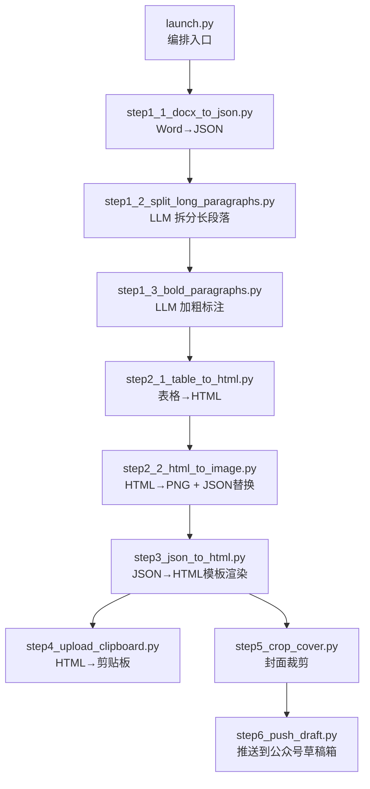
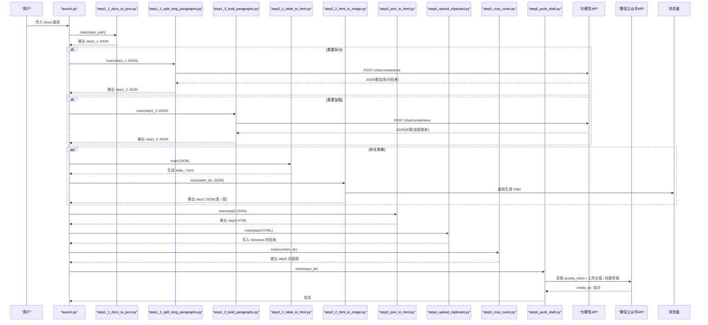
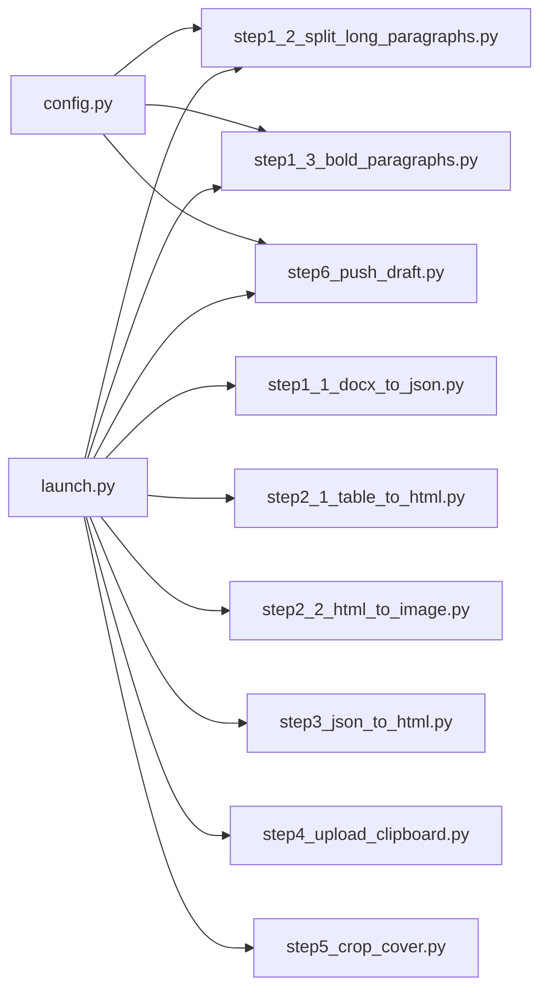

# API 参考文档

<cite>
**本文引用的文件**   
- [config.py](file://config.py)
- [launch.py](file://launch.py)
- [step1_1_docx_to_json.py](file://step1_1_docx_to_json.py)
- [step1_2_split_long_paragraphs.py](file://step1_2_split_long_paragraphs.py)
- [step1_3_bold_paragraphs.py](file://step1_3_bold_paragraphs.py)
- [step2_1_table_to_html.py](file://step2_1_table_to_html.py)
- [step2_2_html_to_image.py](file://step2_2_html_to_image.py)
- [step3_json_to_html.py](file://step3_json_to_html.py)
- [step4_upload_clipboard.py](file://step4_upload_clipboard.py)
- [step5_crop_cover.py](file://step5_crop_cover.py)
- [step6_push_draft.py](file://step6_push_draft.py)
</cite>

## 目录
1. [简介](#简介)
2. [项目结构](#项目结构)
3. [核心组件](#核心组件)
4. [架构总览](#架构总览)
5. [详细组件分析](#详细组件分析)
6. [依赖关系分析](#依赖关系分析)
7. [性能与并发](#性能与并发)
8. [错误码与异常处理](#错误码与异常处理)
9. [版本兼容性与迁移指南](#版本兼容性与迁移指南)
10. [与其他系统集成模式](#与其他系统集成模式)
11. [结论](#结论)

## 简介
本参考文档面向“内容流水线”项目的对外/对内接口，覆盖从 Word 解析、段落拆分与加粗标注、表格转图、HTML 渲染、剪贴板写入到微信公众号草稿箱推送的完整链路。文档以函数为最小单元，提供：
- 公共函数签名、参数说明、返回值类型与异常行为
- 数据结构定义（JSON 字段、约束）
- 调用示例路径（通过源码行号定位）
- 错误码与异常策略
- 异步与并发注意事项
- 性能指标与最佳实践
- 版本兼容与迁移建议
- 外部系统（大模型、微信）集成协议规范

## 项目结构
项目采用“按步骤模块化”的组织方式，每个 step 对应一个可独立运行的脚本，并通过 launch.py 编排成端到端流水线。

图表来源
- [launch.py:42-193](file://launch.py#L42-L193)
- [step1_1_docx_to_json.py:189-233](file://step1_1_docx_to_json.py#L189-L233)
- [step1_2_split_long_paragraphs.py:197-311](file://step1_2_split_long_paragraphs.py#L197-L311)
- [step1_3_bold_paragraphs.py:206-340](file://step1_3_bold_paragraphs.py#L206-L340)
- [step2_1_table_to_html.py:73-125](file://step2_1_table_to_html.py#L73-L125)
- [step2_2_html_to_image.py:119-218](file://step2_2_html_to_image.py#L119-L218)
- [step3_json_to_html.py:120-149](file://step3_json_to_html.py#L120-L149)
- [step4_upload_clipboard.py:435-480](file://step4_upload_clipboard.py#L435-L480)
- [step5_crop_cover.py:173-203](file://step5_crop_cover.py#L173-L203)
- [step6_push_draft.py:275-404](file://step6_push_draft.py#L275-L404)

章节来源
- [launch.py:1-201](file://launch.py#L1-L201)

## 核心组件
- 配置中心：集中管理外部 API 地址、认证头、重试次数、最大 token、阈值等
- 数据中间态：以 JSON 作为各步骤间的数据契约
- 外部服务：大模型聊天补全接口、微信公众号素材与草稿箱接口
- 本地能力：Selenium+Chrome 截图、OpenCV 图片裁剪、Windows 剪贴板写入

章节来源
- [config.py:1-39](file://config.py#L1-L39)

## 架构总览
下图展示了端到端数据流与关键外部交互点。

图表来源
- [launch.py:42-193](file://launch.py#L42-L193)
- [step1_1_docx_to_json.py:189-233](file://step1_1_docx_to_json.py#L189-L233)
- [step1_2_split_long_paragraphs.py:197-311](file://step1_2_split_long_paragraphs.py#L197-L311)
- [step1_3_bold_paragraphs.py:206-340](file://step1_3_bold_paragraphs.py#L206-L340)
- [step2_1_table_to_html.py:73-125](file://step2_1_table_to_html.py#L73-L125)
- [step2_2_html_to_image.py:119-218](file://step2_2_html_to_image.py#L119-L218)
- [step3_json_to_html.py:120-149](file://step3_json_to_html.py#L120-L149)
- [step4_upload_clipboard.py:435-480](file://step4_upload_clipboard.py#L435-L480)
- [step5_crop_cover.py:173-203](file://step5_crop_cover.py#L173-L203)
- [step6_push_draft.py:275-404](file://step6_push_draft.py#L275-L404)

## 详细组件分析

### 配置模块 config.py
- 职责：集中管理外部 API 地址、认证头、通用参数与微信公众号相关配置
- 关键字段
  - API_URL：大模型聊天补全接口地址（含 api-version）
  - HEADERS：请求头（client_id、client_secret、api-key、Content-Type）
  - MAX_RETRIES：网络请求重试次数
  - MAX_TOKENS：最大生成长度
  - SPLIT_THRESHOLD：段落拆分触发阈值（字符数）
  - WX_APP_ID/WX_APP_SECRET：公众号凭证
  - WX_API_BASE：公众号基础 URL
  - WX_AUTHOR/WX_CONTENT_SOURCE_URL/WX_NEED_OPEN_COMMENT/WX_ONLY_FANS_COMMENT：草稿默认值

章节来源
- [config.py:1-39](file://config.py#L1-L39)

### 流水线编排 launch.py
- 入口函数
  - run_pipeline(input_path: str) -> None
    - 参数：input_path 为 .docx 绝对或相对路径
    - 行为：校验输入、派生 process/table 目录、顺序执行各 step（支持跳过）、统计耗时
    - 异常：文件不存在直接退出；子步骤异常由各自脚本抛出并终止
- 控制开关：SKIP_STEP* 布尔标志控制是否执行某一步骤

章节来源
- [launch.py:42-193](file://launch.py#L42-L193)

### Step1.1 解析 Word → JSON
- 主函数
  - main(input_path: str) -> None
    - 参数：.docx 文件路径
    - 输出：process/step1_1_docx_to_json.json；process/images/image_{n}.png
    - 数据结构
      - elements: 列表，元素类型包括 paragraph、table、image
      - paragraph: {type:"paragraph", heading_level:int|None, runs:[{text:str,bold:bool}], index:int}
      - table: {type:"table", row_count:int, col_count:int, data:[[cell]]}, cell:{text:str,bold:bool}
      - image: {type:"image", file_name:str, image_path:str, index:int}
    - 异常：文件不存在或格式非 .docx 时退出
- 辅助函数
  - parse_docx(docx_path: str, images_dir: str) -> list[dict]
  - build_paragraph(paragraph) -> dict
  - build_table(table) -> dict
  - extract_images(element, doc, image_counter) -> list[(str, bytes)]

章节来源
- [step1_1_docx_to_json.py:189-233](file://step1_1_docx_to_json.py#L189-L233)
- [step1_1_docx_to_json.py:145-184](file://step1_1_docx_to_json.py#L145-L184)
- [step1_1_docx_to_json.py:75-139](file://step1_1_docx_to_json.py#L75-L139)
- [step1_1_docx_to_json.py:47-69](file://step1_1_docx_to_json.py#L47-L69)

### Step1.2 拆分过长段落（LLM）
- 主函数
  - main(input_json: str, output_json: str = None) -> None
    - 参数：input_json 为 step1_1 JSON 路径；output_json 可选，默认同目录 step1_2_split_paragraphs.json
    - 行为：遍历 paragraph 的 runs，对超过阈值的 run 调用大模型进行语义拆分；拼接一致性校验；构建新元素并输出
    - 异常：文件不存在退出；模型失败则保留原段落
- 辅助函数
  - call_model(api_url, headers, max_tokens, prompt, max_retries=MAX_RETRIES) -> str|None
  - parse_json_array(response_text) -> list[str]|None
  - find_long_runs(runs, threshold) -> list[int]
  - build_split_elements(original_elem, run_idx, split_texts, original_index) -> list[dict]

章节来源
- [step1_2_split_long_paragraphs.py:197-311](file://step1_2_split_long_paragraphs.py#L197-L311)
- [step1_2_split_long_paragraphs.py:80-103](file://step1_2_split_long_paragraphs.py#L80-L103)
- [step1_2_split_long_paragraphs.py:106-140](file://step1_2_split_long_paragraphs.py#L106-L140)
- [step1_2_split_long_paragraphs.py:143-192](file://step1_2_split_long_paragraphs.py#L143-L192)

### Step1.3 总结性加粗标注（LLM）
- 主函数
  - main(input_json: str, output_json: str = None) -> None
    - 参数：input_json 为 step1_2 JSON 路径；output_json 可选，默认 step1_3_bold_paragraphs.json
    - 行为：按标题分段，分组提交 LLM 识别需加粗的原文句子；应用 bold 标记；不改变文字
    - 异常：文件不存在退出；模型失败或无匹配则跳过
- 辅助函数
  - call_model(...) -> str|None
  - parse_json_object(response_text) -> dict|None
  - get_paragraph_text(elem) -> str
  - has_bold_run(elem) -> bool
  - apply_bold_to_paragraph(elem, bold_text) -> list[dict]|None

章节来源
- [step1_3_bold_paragraphs.py:206-340](file://step1_3_bold_paragraphs.py#L206-L340)
- [step1_3_bold_paragraphs.py:73-96](file://step1_3_bold_paragraphs.py#L73-L96)
- [step1_3_bold_paragraphs.py:99-133](file://step1_3_bold_paragraphs.py#L99-L133)
- [step1_3_bold_paragraphs.py:136-201](file://step1_3_bold_paragraphs.py#L136-L201)

### Step2.1 表格 → HTML
- 主函数
  - main(json_path: str) -> None
    - 参数：json_path 为包含 table 元素的 JSON 路径
    - 输出：process/table/table_{n}.html
    - 行为：读取模板，将 table 第一行作为 thead，其余为 tbody，生成 HTML
    - 异常：JSON 不存在退出；空表格跳过
- 辅助函数
  - load_template() -> str
  - generate_table_tag(table_data) -> str|None

章节来源
- [step2_1_table_to_html.py:73-125](file://step2_1_table_to_html.py#L73-L125)
- [step2_1_table_to_html.py:33-68](file://step2_1_table_to_html.py#L33-L68)

### Step2.2 HTML → PNG + JSON 替换
- 主函数
  - main(table_dir: str, json_path: str) -> None
    - 参数：table_dir 为 table HTML 目录；json_path 为待替换的 JSON
    - 输出：table_{n}.png；process/step2_table_to_image.json
    - 行为：使用 Selenium+Chrome 截图；若目录下无 HTML，则复制输入 JSON 作为输出；最后将 JSON 中 table 元素替换为 image 引用
    - 异常：目录不存在退出；截图失败记录失败清单
- 辅助函数
  - html_to_png(html_path, png_path) -> None
  - replace_tables_in_json(json_path, table_dir, table_count) -> None

章节来源
- [step2_2_html_to_image.py:119-218](file://step2_2_html_to_image.py#L119-L218)
- [step2_2_html_to_image.py:40-115](file://step2_2_html_to_image.py#L40-L115)

### Step3 JSON → HTML 模板渲染
- 主函数
  - main(json_path: str) -> None
    - 参数：json_path 为 step2 JSON 路径
    - 输出：process/step3_json_to_html.html
    - 行为：根据 heading_level 与 type 渲染标题、正文、图片；合并连续正文为 section；替换模板占位符
- 辅助函数
  - render_runs(runs) -> str
  - render_body_section(paragraphs) -> str
  - render_title(text) -> str
  - render_image(image_path) -> str
  - generate_body_html(elements) -> str

章节来源
- [step3_json_to_html.py:120-149](file://step3_json_to_html.py#L120-L149)
- [step3_json_to_html.py:38-115](file://step3_json_to_html.py#L38-L115)

### Step4 HTML → 剪贴板
- 主函数
  - main(html_path: str) -> None
    - 参数：html_path 为 step3 HTML 路径
    - 行为：提取 article 片段；展开 class 为内联样式；去除格式化空白；本地图片转 base64；构建多格式剪贴板数据并写入
    - 输出：Windows 剪贴板；同时保存内联样式 HTML 供后续复用
    - 异常：找不到目标 article 退出；剪贴板打开失败重试后退出
- 辅助函数
  - parse_html_file(html_path) -> (str, list)
  - expand_patterns(html_str) -> str
  - normalize_whitespace(html_str) -> str
  - embed_local_images(html_str, base_dir) -> str
  - build_html_format_binary(fragment) -> bytes
  - extract_plain_text(html_fragment) -> str
  - build_all_formats(content_fragment, raw_formats) -> list[dict]
  - write_clipboard(formats) -> None

章节来源
- [step4_upload_clipboard.py:435-480](file://step4_upload_clipboard.py#L435-L480)
- [step4_upload_clipboard.py:72-109](file://step4_upload_clipboard.py#L72-L109)
- [step4_upload_clipboard.py:115-172](file://step4_upload_clipboard.py#L115-L172)
- [step4_upload_clipboard.py:175-188](file://step4_upload_clipboard.py#L175-L188)
- [step4_upload_clipboard.py:194-222](file://step4_upload_clipboard.py#L194-L222)
- [step4_upload_clipboard.py:228-268](file://step4_upload_clipboard.py#L228-L268)
- [step4_upload_clipboard.py:271-285](file://step4_upload_clipboard.py#L271-L285)
- [step4_upload_clipboard.py:288-365](file://step4_upload_clipboard.py#L288-L365)
- [step4_upload_clipboard.py:371-431](file://step4_upload_clipboard.py#L371-L431)

### Step5 封面裁剪
- 主函数
  - main(content_dir: str) -> None
    - 参数：content_dir 为文章实例目录
    - 行为：查找第一个图片文件；中心裁剪为 2.35:1；自动压缩至 10MB 以内；输出到 process/step5_crop_cover.*
    - 异常：未找到图片则跳过
- 辅助函数
  - find_first_image(folder) -> str|None
  - crop_to_ratio(img_path, output_path, ratio=2.35) -> None
  - _save_image_with_limit(img, output_path, max_bytes=10MB) -> int
  - _shrink_to_fit(img, output_path, max_bytes) -> int

章节来源
- [step5_crop_cover.py:173-203](file://step5_crop_cover.py#L173-L203)
- [step5_crop_cover.py:37-44](file://step5_crop_cover.py#L37-L44)
- [step5_crop_cover.py:133-171](file://step5_crop_cover.py#L133-L171)
- [step5_crop_cover.py:59-107](file://step5_crop_cover.py#L59-L107)
- [step5_crop_cover.py:110-130](file://step5_crop_cover.py#L110-L130)

### Step6 推送到公众号草稿箱
- 主函数
  - main(input_dir: str, step1_1_json: str = None, process_dir: str = None) -> None
    - 参数：input_dir 为文章实例目录；step1_1_json/process_dir 可选
    - 行为：获取 access_token；提取标题；上传封面图（带缓存）；从正文 JSON 生成摘要；推送草稿
    - 异常：未配置凭证退出；未找到封面图退出；无法获取标题退出
- 辅助函数
  - get_access_token() -> str
  - upload_permanent_image(access_token, image_path) -> str
  - extract_title(json_path) -> str|None
  - find_cover_image(process_dir) -> str|None
  - extract_body_text(json_path) -> str
  - call_model(...) -> str|None
  - generate_digest(plain_text) -> str|None
  - push_draft(access_token, article) -> str

章节来源
- [step6_push_draft.py:275-404](file://step6_push_draft.py#L275-L404)
- [step6_push_draft.py:42-56](file://step6_push_draft.py#L42-L56)
- [step6_push_draft.py:62-79](file://step6_push_draft.py#L62-L79)
- [step6_push_draft.py:105-127](file://step6_push_draft.py#L105-L127)
- [step6_push_draft.py:133-140](file://step6_push_draft.py#L133-L140)
- [step6_push_draft.py:146-182](file://step6_push_draft.py#L146-L182)
- [step6_push_draft.py:188-211](file://step6_push_draft.py#L188-L211)
- [step6_push_draft.py:227-246](file://step6_push_draft.py#L227-L246)
- [step6_push_draft.py:252-270](file://step6_push_draft.py#L252-L270)

## 依赖关系分析
- 内部依赖
  - launch.py 依赖所有 step 的 main 函数
  - step1_2/step1_3/step6 依赖 config 中的 API_URL、HEADERS、MAX_RETRIES、MAX_TOKENS 等
- 外部依赖
  - requests：HTTP 客户端（大模型、微信公众号）
  - selenium + Chrome：HTML 截图
  - opencv-python/numpy：图片裁剪与压缩
  - python-docx：解析 .docx
  - ctypes：Windows 剪贴板写入

图表来源
- [config.py:1-39](file://config.py#L1-L39)
- [launch.py:42-193](file://launch.py#L42-L193)

章节来源
- [config.py:1-39](file://config.py#L1-L39)
- [launch.py:42-193](file://launch.py#L42-L193)

## 性能与并发
- 大模型调用
  - 统一封装 call_model 实现指数退避重试（间隔 10*(attempt+1) 秒），超时 120s
  - 建议：在批量任务中串行调用以避免限流；如需并行，请增加全局速率限制与熔断
- 截图流程
  - 单进程逐张截图，内置超时保护（默认 60s），失败强制清理 chromedriver/chrome 进程
  - 建议：对大量表格场景，考虑分片批处理与失败重试队列
- 图片裁剪
  - 自动质量二分搜索与分辨率缩放，确保 ≤10MB
  - 建议：优先 JPEG 格式以获得更好压缩比
- 剪贴板写入
  - 多次尝试打开剪贴板（最多 5 次），避免竞争
  - 建议：避免与 UI 线程阻塞操作并发

章节来源
- [step1_2_split_long_paragraphs.py:80-103](file://step1_2_split_long_paragraphs.py#L80-L103)
- [step1_3_bold_paragraphs.py:73-96](file://step1_3_bold_paragraphs.py#L73-L96)
- [step6_push_draft.py:188-211](file://step6_push_draft.py#L188-L211)
- [step2_2_html_to_image.py:40-115](file://step2_2_html_to_image.py#L40-L115)
- [step5_crop_cover.py:59-107](file://step5_crop_cover.py#L59-L107)
- [step4_upload_clipboard.py:371-431](file://step4_upload_clipboard.py#L371-L431)

## 错误码与异常处理
- 本地错误
  - 文件/目录不存在：打印错误并 sys.exit(1)
  - 剪贴板不可用：重试 5 次后退出
  - 截图失败：记录失败清单并继续处理其他文件
- 外部服务错误
  - 大模型：捕获 requests.exceptions.RequestException，指数退避重试；最终失败返回 None，上游回退逻辑保留原数据
  - 微信公众号：raise RuntimeError 携带服务端返回信息；access_token 缺失、media_id 缺失、草稿创建失败均抛错
- 建议
  - 统一日志级别与结构化日志
  - 对关键步骤增加幂等与断点续跑（已部分实现：step6 缓存 media_id）

章节来源
- [step1_1_docx_to_json.py:189-196](file://step1_1_docx_to_json.py#L189-L196)
- [step1_2_split_long_paragraphs.py:203-205](file://step1_2_split_long_paragraphs.py#L203-L205)
- [step1_3_bold_paragraphs.py:212-214](file://step1_3_bold_paragraphs.py#L212-L214)
- [step2_1_table_to_html.py:75-77](file://step2_1_table_to_html.py#L75-L77)
- [step2_2_html_to_image.py:121-123](file://step2_2_html_to_image.py#L121-L123)
- [step3_json_to_html.py:122-124](file://step3_json_to_html.py#L122-L124)
- [step4_upload_clipboard.py:88-91](file://step4_upload_clipboard.py#L88-L91)
- [step4_upload_clipboard.py:377-384](file://step4_upload_clipboard.py#L377-L384)
- [step6_push_draft.py:53-56](file://step6_push_draft.py#L53-L56)
- [step6_push_draft.py:74-76](file://step6_push_draft.py#L74-L76)
- [step6_push_draft.py:266-268](file://step6_push_draft.py#L266-L268)

## 版本兼容性与迁移指南
- 大模型接口
  - API_URL 中包含 api-version=2025-02-01-preview，升级时需同步更新版本号与请求体字段
  - 请求体字段：max_completion_tokens、messages、stream；响应体字段：choices[].message.content
- 微信公众号接口
  - 基础路径：WX_API_BASE=/cgi-bin
  - 常用接口：/token、/material/add_material、/draft/add
  - 注意：草稿 content 字段当前为空占位，实际发布前需另行填充
- 向后兼容
  - 当 step1_2/step1_3 被跳过时，下游会回退到更早的 JSON 产物
  - 当无表格时，step2_2 会原样复制输入 JSON 作为 step2 输出，保证下游可用

章节来源
- [config.py:6-10](file://config.py#L6-L10)
- [step1_2_split_long_paragraphs.py:197-210](file://step1_2_split_long_paragraphs.py#L197-L210)
- [step1_3_bold_paragraphs.py:206-218](file://step1_3_bold_paragraphs.py#L206-L218)
- [step2_2_html_to_image.py:131-142](file://step2_2_html_to_image.py#L131-L142)
- [step6_push_draft.py:42-56](file://step6_push_draft.py#L42-L56)
- [step6_push_draft.py:62-79](file://step6_push_draft.py#L62-L79)
- [step6_push_draft.py:252-270](file://step6_push_draft.py#L252-L270)

## 与其他系统集成模式
- 大模型集成
  - 协议：HTTPS POST application/json
  - 头部：client_id、client_secret、api-key、Content-Type
  - 请求体：{max_completion_tokens, messages:[{role,content}], stream:false}
  - 响应体：{choices:[{message:{content}}]}
  - 重试：指数退避，最大重试次数由 MAX_RETRIES 控制
- 微信公众号集成
  - 鉴权：GET /token?grant_type=client_credential&appid=&secret=
  - 永久素材上传：POST /material/add_material?type=image
  - 草稿新增：POST /draft/add，articles 数组
  - 超时：token 30s，上传 60s，草稿 30s
- 剪贴板集成（Windows）
  - 写入格式：HTML Format、CF_UNICODETEXT、CF_LOCALE、CF_TEXT、CF_OEMTEXT 等
  - 图片：base64 data URI 嵌入，确保跨应用粘贴可见

章节来源
- [config.py:12-17](file://config.py#L12-L17)
- [step1_2_split_long_paragraphs.py:80-103](file://step1_2_split_long_paragraphs.py#L80-L103)
- [step1_3_bold_paragraphs.py:73-96](file://step1_3_bold_paragraphs.py#L73-L96)
- [step6_push_draft.py:42-56](file://step6_push_draft.py#L42-L56)
- [step6_push_draft.py:62-79](file://step6_push_draft.py#L62-L79)
- [step6_push_draft.py:252-270](file://step6_push_draft.py#L252-L270)
- [step4_upload_clipboard.py:228-268](file://step4_upload_clipboard.py#L228-L268)
- [step4_upload_clipboard.py:288-365](file://step4_upload_clipboard.py#L288-L365)

## 结论
该流水线以 JSON 为契约，串联了文档解析、智能增强、媒体转换、页面渲染与多渠道分发。通过统一的配置与健壮的错误处理，具备较好的可维护性与可扩展性。建议在大规模使用时引入任务队列与监控告警，并对外部 API 调用增加更细粒度的速率控制与熔断策略。