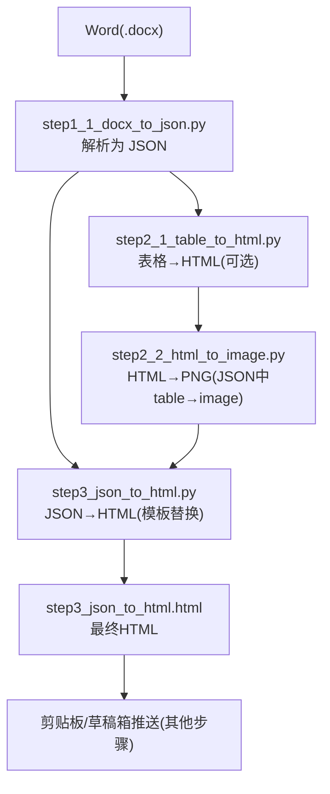
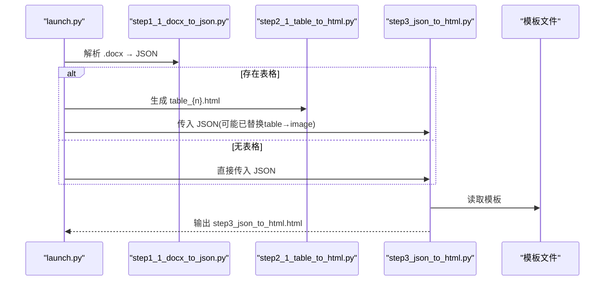
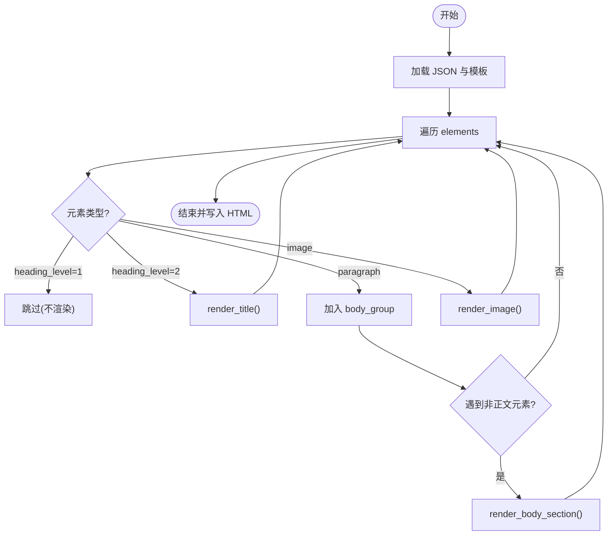
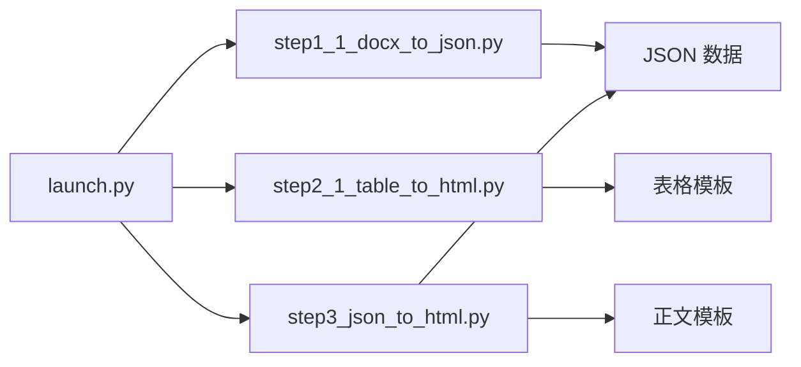

# HTML 渲染 API

<cite>
**本文引用的文件**
- [step3_json_to_html.py](file://step3_json_to_html.py)
- [step2_1_table_to_html.py](file://step2_1_table_to_html.py)
- [step1_1_docx_to_json.py](file://step1_1_docx_to_json.py)
- [caicai_html_1_green_classical.html](file://html_template/caicai_html_1_green_classical.html)
- [caicai_html_1_green_table.html](file://html_template/caicai_html_1_green_table.html)
- [config.py](file://config.py)
- [launch.py](file://launch.py)
</cite>

## 目录
1. [简介](#简介)
2. [项目结构](#项目结构)
3. [核心组件](#核心组件)
4. [架构总览](#架构总览)
5. [详细组件分析](#详细组件分析)
6. [依赖关系分析](#依赖关系分析)
7. [性能与兼容性](#性能与兼容性)
8. [故障排查指南](#故障排查指南)
9. [结论](#结论)
10. [附录：API 参考与示例](#附录api-参考与示例)

## 简介
本仓库提供一套从 Word 文档到微信公众号兼容 HTML 的流水线，其中“JSON → HTML”渲染是核心环节。该渲染系统基于轻量模板占位符机制，将结构化 JSON（段落、标题、图片、表格）转换为内联样式为主的 HTML，适配微信生态的渲染限制。本文档聚焦于 JSON 到 HTML 转换的核心函数接口、输入数据结构要求、模板变量替换机制、CSS 样式应用规则、元素类型渲染规则、模板系统用法、以及性能优化与最佳实践。

## 项目结构
- 渲染主流程入口位于 step3_json_to_html.py，负责读取 JSON 数据与模板，生成最终 HTML。
- 表格渲染由 step2_1_table_to_html.py 完成，输出独立表格 HTML 并配合后续截图步骤。
- 模板文件位于 html_template 目录，分别用于正文页面与表格页面。
- launch.py 串联整个流水线，可按需跳过各步骤。
- config.py 提供全局配置项（如公众号参数等）。



图表来源
- [launch.py:42-193](file://launch.py#L42-L193)
- [step1_1_docx_to_json.py:145-184](file://step1_1_docx_to_json.py#L145-L184)
- [step2_1_table_to_html.py:74-118](file://step2_1_table_to_html.py#L74-L118)
- [step3_json_to_html.py:121-142](file://step3_json_to_html.py#L121-L142)

章节来源
- [launch.py:1-201](file://launch.py#L1-L201)
- [step1_1_docx_to_json.py:1-233](file://step1_1_docx_to_json.py#L1-L233)
- [step2_1_table_to_html.py:1-125](file://step2_1_table_to_html.py#L1-L125)
- [step3_json_to_html.py:1-149](file://step3_json_to_html.py#L1-L149)

## 核心组件
- JSON 模型定义与构建
  - 段落：包含 heading_level、runs 列表（每个 run 含 text、bold）
  - 表格：包含 row_count、col_count、data（二维数组，每项含 text、bold）
  - 图片：包含 file_name、image_path
- 渲染器
  - 正文渲染：按段落、标题、图片顺序生成 HTML 片段，合并连续正文段落到 section
  - 表格渲染：首行作为 thead，其余行作为 tbody，支持单元格加粗
- 模板系统
  - 占位符 {{BODY_PLACEHOLDER}} 和 {{TABLE_PLACEHOLDER}} 进行简单字符串替换
  - 无循环/条件语法，通过预处理 JSON 控制分支逻辑

章节来源
- [step1_1_docx_to_json.py:75-139](file://step1_1_docx_to_json.py#L75-L139)
- [step3_json_to_html.py:38-115](file://step3_json_to_html.py#L38-L115)
- [step2_1_table_to_html.py:39-68](file://step2_1_table_to_html.py#L39-L68)
- [caicai_html_1_green_classical.html:207-209](file://html_template/caicai_html_1_green_classical.html#L207-L209)
- [caicai_html_1_green_table.html:59-62](file://html_template/caicai_html_1_green_table.html#L59-L62)

## 架构总览
整体采用“数据驱动 + 模板占位符”的轻量渲染架构：
- 数据层：step1_1_docx_to_json.py 将 Word 解析为 JSON；step2_1_table_to_html.py 生成表格 HTML；step2_2_html_to_image.py 将表格转为图片并更新 JSON。
- 渲染层：step3_json_to_html.py 读取 JSON 与模板，生成最终 HTML。
- 模板层：两个 HTML 模板分别承载正文与表格样式。



图表来源
- [launch.py:146-155](file://launch.py#L146-L155)
- [step1_1_docx_to_json.py:190-226](file://step1_1_docx_to_json.py#L190-L226)
- [step2_1_table_to_html.py:74-118](file://step2_1_table_to_html.py#L74-L118)
- [step3_json_to_html.py:121-142](file://step3_json_to_html.py#L121-L142)

## 详细组件分析

### JSON 数据模型与输入要求
- 顶层对象
  - file_name: 源文件名
  - total_elements: 元素总数
  - elements: 元素数组
- 元素类型
  - paragraph
    - type: "paragraph"
    - heading_level: 1|2|null（1=大标题，2=小标题，null=正文）
    - runs: 文本片段数组，每项 {text, bold}
  - table
    - type: "table"
    - row_count: 行数
    - col_count: 列数
    - data: 二维数组，每项 {text, bold}
  - image
    - type: "image"
    - file_name: 图片文件名
    - image_path: 相对路径（统一使用正斜杠）

说明
- 标题识别：以 # 或 ## 前缀判定 heading_level，并在构建时去除前缀。
- 空段落过滤：不含有效文本的段落会被丢弃。
- 加粗检测：支持样式继承判断，相邻同 bold 状态的 run 会合并。

章节来源
- [step1_1_docx_to_json.py:75-139](file://step1_1_docx_to_json.py#L75-L139)
- [step1_1_docx_to_json.py:145-184](file://step1_1_docx_to_json.py#L145-L184)
- [content_instance/content_20260702_1/process/step1_3_bold_paragraphs.json:1-200](file://content_instance/content_20260702_1/process/step1_3_bold_paragraphs.json#L1-L200)

### 正文渲染 API（段落、标题、图片）
- 主要函数
  - render_runs(runs): 将 runs 列表渲染为内联 HTML 片段
  - render_body_section(paragraphs): 将一组连续正文段落包裹在 <section> 里
  - render_title(text): 渲染小标题
  - render_image(image_path): 渲染图片（居中）
  - generate_body_html(elements): 遍历 elements，生成正文区 HTML 片段
  - main(json_path): 读取 JSON 与模板，替换 {{BODY_PLACEHOLDER}}，输出 HTML

- 渲染规则
  - heading_level=1：不渲染到正文区域
  - heading_level=2：渲染为带 class="title" 的段落
  - 普通段落：合并为 <section>，每段 <p class="body">，段间插入空行
  - bold run：渲染为 <span class="hl">文字</span>
  - image：渲染为居中的 ，路径统一为正斜杠

- CSS 样式要点
  - 正文 section 统一字体大小、行高、字间距、box-sizing
  - 标题类 .title：字号、加粗、居中
  - 正文类 .body：字号、行高、字间距、两端对齐
  - 高亮类 .hl：绿色背景、加粗
  - 空行类 .empty-line：高度控制



图表来源
- [step3_json_to_html.py:84-115](file://step3_json_to_html.py#L84-L115)
- [step3_json_to_html.py:38-78](file://step3_json_to_html.py#L38-L78)
- [caicai_html_1_green_classical.html:97-137](file://html_template/caicai_html_1_green_classical.html#L97-L137)

章节来源
- [step3_json_to_html.py:38-115](file://step3_json_to_html.py#L38-L115)
- [caicai_html_1_green_classical.html:97-137](file://html_template/caicai_html_1_green_classical.html#L97-L137)

### 表格渲染 API
- 主要函数
  - load_template(): 读取表格模板
  - generate_table_tag(table_data): 根据表格数据生成 <table>...</table> 片段
  - main(json_path): 筛选表格元素，逐个生成 table_{n}.html

- 渲染规则
  - 第一行作为表头 <thead>，其余行作为表体 <tbody>
  - 单元格 bold 字段映射为 td.bold 类
  - 模板占位符 {{TABLE_PLACEHOLDER}} 被替换为生成的 <table> 片段

- CSS 样式要点
  - 表头：绿色背景、白色文字、加粗、固定边框
  - 表体：隔行换色、边框、居中
  - 行高同步脚本：确保同一 tbody 各行高度一致

```mermaid
classDiagram
class TableRenderer {
+load_template() string
+generate_table_tag(table_data) string
+main(json_path) void
}
class Template {
+{{TABLE_PLACEHOLDER}}
}
TableRenderer --> Template : "替换占位符"
```

图表来源
- [step2_1_table_to_html.py:33-68](file://step2_1_table_to_html.py#L33-L68)
- [caicai_html_1_green_table.html:59-62](file://html_template/caicai_html_1_green_table.html#L59-L62)

章节来源
- [step2_1_table_to_html.py:33-118](file://step2_1_table_to_html.py#L33-L118)
- [caicai_html_1_green_table.html:1-81](file://html_template/caicai_html_1_green_table.html#L1-L81)

### 模板系统与占位符
- 占位符语法
  - {{BODY_PLACEHOLDER}}：正文内容区占位符
  - {{TABLE_PLACEHOLDER}}：表格内容区占位符
- 替换机制
  - 使用字符串 replace 进行一次性替换，不支持循环/条件语法
- 高级特性建议
  - 如需循环/条件，可在 JSON 预处理阶段生成对应 HTML 片段，再交由模板替换

章节来源
- [step3_json_to_html.py:135-136](file://step3_json_to_html.py#L135-L136)
- [step2_1_table_to_html.py:108-109](file://step2_1_table_to_html.py#L108-L109)
- [caicai_html_1_green_classical.html:207-209](file://html_template/caicai_html_1_green_classical.html#L207-L209)
- [caicai_html_1_green_table.html:59-62](file://html_template/caicai_html_1_green_table.html#L59-L62)

### 样式继承与响应式布局
- 样式继承
  - 正文 section 设置统一的 font-size、line-height、letter-spacing、box-sizing
  - 标题与正文通过 class 区分，避免样式冲突
  - 高亮 span 使用 .hl 类，保持视觉一致性
- 响应式适配
  - 图片 max-width: 90% 适配移动端
  - 正文最大宽度与边距控制，保证阅读体验
  - 表格行高同步脚本提升跨浏览器一致性

章节来源
- [step3_json_to_html.py:32](file://step3_json_to_html.py#L32)
- [caicai_html_1_green_classical.html:15-29](file://html_template/caicai_html_1_green_classical.html#L15-L29)
- [caicai_html_1_green_table.html:65-77](file://html_template/caicai_html_1_green_table.html#L65-L77)

### 浏览器兼容性处理
- 使用内联样式与基础 CSS 属性，避免复杂选择器
- 表格行高同步脚本使用原生 DOM API，兼容主流浏览器
- 图片路径统一为正斜杠，避免 Windows 路径问题

章节来源
- [step3_json_to_html.py:72-78](file://step3_json_to_html.py#L72-L78)
- [caicai_html_1_green_table.html:65-77](file://html_template/caicai_html_1_green_table.html#L65-L77)

## 依赖关系分析
- 模块耦合
  - step3_json_to_html.py 依赖模板文件与 JSON 数据
  - step2_1_table_to_html.py 依赖模板文件与 JSON 数据
  - launch.py 协调各步骤，按需调用
- 外部依赖
  - docx 库用于解析 Word 文档
  - 微信公众号相关配置在 config.py 中



图表来源
- [launch.py:146-155](file://launch.py#L146-L155)
- [step1_1_docx_to_json.py:190-226](file://step1_1_docx_to_json.py#L190-L226)
- [step2_1_table_to_html.py:74-118](file://step2_1_table_to_html.py#L74-L118)
- [step3_json_to_html.py:121-142](file://step3_json_to_html.py#L121-L142)

章节来源
- [launch.py:1-201](file://launch.py#L1-L201)
- [config.py:1-39](file://config.py#L1-L39)

## 性能与兼容性
- 性能优化建议
  - 减少不必要的 DOM 操作：表格行高同步仅在必要时执行
  - 预合并 runs：降低渲染时的字符串拼接开销
  - 批量写入：HTML 片段先 join 再一次性写入文件
- 兼容性注意事项
  - 使用内联样式与基础 CSS，避免现代特性
  - 图片路径规范化，避免平台差异
  - 表格脚本使用原生 API，避免引入额外库

[本节为通用指导，无需具体文件引用]

## 故障排查指南
- JSON 文件不存在
  - 现象：程序报错退出
  - 处理：检查输入路径是否正确
- 未找到表格元素
  - 现象：提示未找到表格，跳过表格步骤
  - 处理：确认 JSON 中是否存在 type="table" 的元素
- 模板占位符未替换
  - 现象：输出 HTML 仍包含 {{BODY_PLACEHOLDER}} 或 {{TABLE_PLACEHOLDER}}
  - 处理：检查模板文件是否完整，确认替换逻辑是否执行

章节来源
- [step3_json_to_html.py:121-142](file://step3_json_to_html.py#L121-L142)
- [step2_1_table_to_html.py:74-92](file://step2_1_table_to_html.py#L74-L92)

## 结论
本渲染引擎采用轻量模板占位符机制，结合结构化 JSON 数据，实现了从 Word 到微信公众号兼容 HTML 的高效转换。通过明确的渲染规则、稳定的样式体系与良好的兼容性处理，能够满足日常内容生产需求。建议在需要更复杂逻辑时，在 JSON 预处理阶段完成分支与循环控制，保持渲染层的简洁与可维护性。

[本节为总结，无需具体文件引用]

## 附录：API 参考与示例

### 正文渲染 API
- 函数列表
  - render_runs(runs)
  - render_body_section(paragraphs)
  - render_title(text)
  - render_image(image_path)
  - generate_body_html(elements)
  - main(json_path)
- 输入数据结构
  - elements: 数组，包含 paragraph、table、image 元素
  - paragraph: {type, heading_level, runs}
  - table: {type, row_count, col_count, data}
  - image: {type, file_name, image_path}
- 输出
  - HTML 片段（正文区），最终替换到模板 {{BODY_PLACEHOLDER}}

章节来源
- [step3_json_to_html.py:38-115](file://step3_json_to_html.py#L38-L115)
- [step3_json_to_html.py:121-142](file://step3_json_to_html.py#L121-L142)

### 表格渲染 API
- 函数列表
  - load_template()
  - generate_table_tag(table_data)
  - main(json_path)
- 输入数据结构
  - table_data: {row_count, col_count, data}
- 输出
  - 独立 HTML 文件 table_{n}.html，包含表格样式与脚本

章节来源
- [step2_1_table_to_html.py:33-118](file://step2_1_table_to_html.py#L33-L118)

### 使用示例（微信公众号兼容 HTML 生成）
- 准备 JSON 数据
  - 确保 elements 数组包含正确的 paragraph、image 元素
  - 若存在表格，先运行表格渲染与截图步骤，再将 table 替换为 image
- 调用渲染
  - 使用 main(json_path) 读取 JSON 与模板，生成 step3_json_to_html.html
- 验证输出
  - 打开生成的 HTML，检查标题、正文、图片、空行是否符合预期

章节来源
- [launch.py:146-155](file://launch.py#L146-L155)
- [step3_json_to_html.py:121-142](file://step3_json_to_html.py#L121-L142)