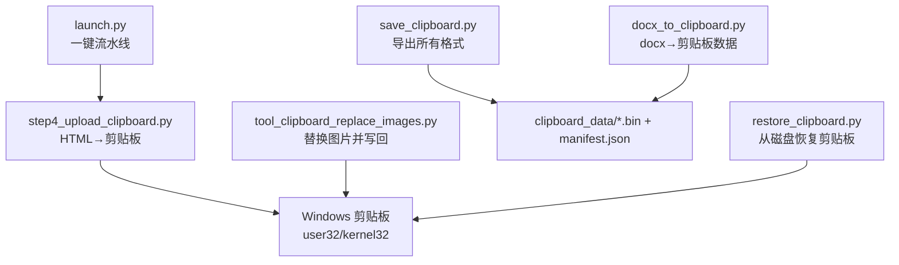
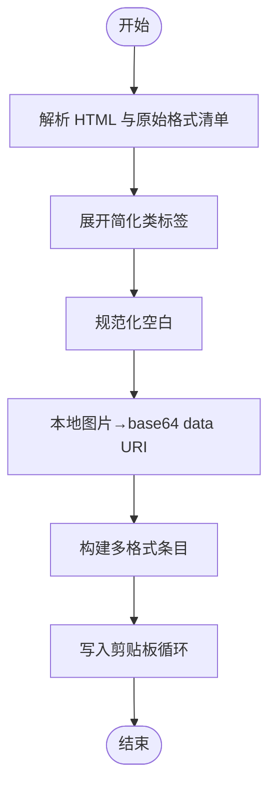
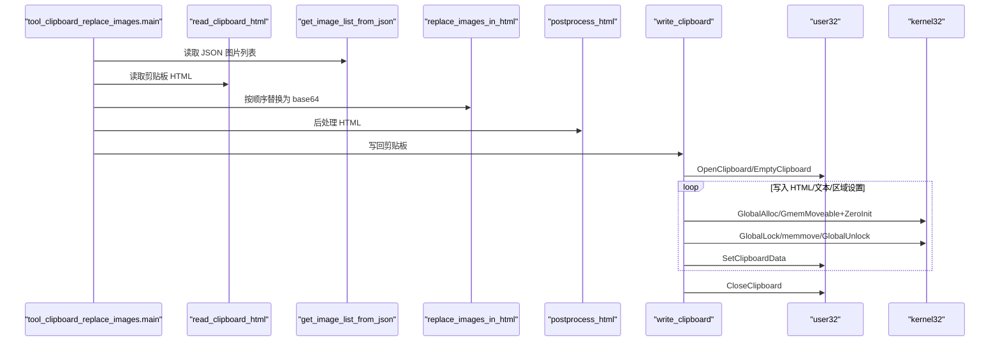
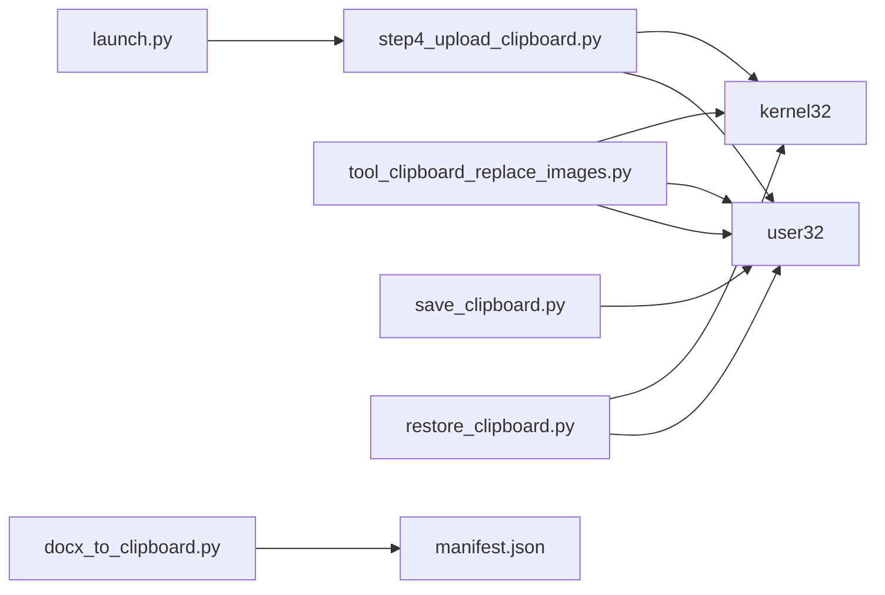

# 剪贴板集成 API

<cite>
**本文引用的文件列表**
- [step4_upload_clipboard.py](file://step4_upload_clipboard.py)
- [tool/tool_clipboard_replace_images.py](file://tool/tool_clipboard_replace_images.py)
- [board_history/restore_clipboard.py](file://board_history/restore_clipboard.py)
- [board_history/save_clipboard.py](file://board_history/save_clipboard.py)
- [board_history/docx_to_clipboard.py](file://board_history/docx_to_clipboard.py)
- [launch.py](file://launch.py)
</cite>

## 目录
1. [简介](#简介)
2. [项目结构](#项目结构)
3. [核心组件](#核心组件)
4. [架构总览](#架构总览)
5. [详细组件分析](#详细组件分析)
6. [依赖关系分析](#依赖关系分析)
7. [性能与内存管理](#性能与内存管理)
8. [故障排查指南](#故障排查指南)
9. [结论](#结论)
10. [附录：API 参考](#附录api-参考)

## 简介
本仓库提供 Windows 剪贴板集成的完整实现，支持将 HTML 内容、纯文本（CF_UNICODETEXT）、区域设置（CF_LOCALE）以及自定义格式写入系统剪贴板。重点能力包括：
- 多格式剪贴板写入：HTML Format、CF_UNICODETEXT、CF_TEXT/OEMTEXT、CF_LOCALE 等
- 图片内嵌机制：本地图片转 base64 data URI，确保粘贴到微信公众号等平台时图片可正确显示
- Windows API 封装：基于 ctypes 调用 user32/kernel32，处理全局内存分配、锁定、拷贝与释放
- 兼容性与错误处理：重试打开剪贴板、注册自定义格式、异常路径清理与日志输出

## 项目结构
与剪贴板写入直接相关的核心模块如下：
- step4_upload_clipboard.py：主流程，解析 HTML、扩展样式、内联图片、构建多格式并写入剪贴板
- tool/tool_clipboard_replace_images.py：读取当前剪贴板中的 HTML，按 JSON 顺序替换为本地图片（base64），再写回
- board_history/*：保存/恢复剪贴板数据、从 docx 生成剪贴板数据的辅助工具
- launch.py：一键流水线入口，串联各步骤并最终调用剪贴板写入



图表来源
- [launch.py:157-166](file://launch.py#L157-L166)
- [step4_upload_clipboard.py:436-479](file://step4_upload_clipboard.py#L436-L479)
- [tool/tool_clipboard_replace_images.py:398-498](file://tool/tool_clipboard_replace_images.py#L398-L498)
- [board_history/save_clipboard.py:116-188](file://board_history/save_clipboard.py#L116-L188)
- [board_history/restore_clipboard.py:81-159](file://board_history/restore_clipboard.py#L81-L159)
- [board_history/docx_to_clipboard.py:415-478](file://board_history/docx_to_clipboard.py#L415-L478)

章节来源
- [launch.py:1-201](file://launch.py#L1-201)
- [step4_upload_clipboard.py:1-480](file://step4_upload_clipboard.py#L1-480)
- [tool/tool_clipboard_replace_images.py:1-498](file://tool/tool_clipboard_replace_images.py#L1-498)
- [board_history/save_clipboard.py:1-188](file://board_history/save_clipboard.py#L1-188)
- [board_history/restore_clipboard.py:1-159](file://board_history/restore_clipboard.py#L1-159)
- [board_history/docx_to_clipboard.py:1-478](file://board_history/docx_to_clipboard.py#L1-478)

## 核心组件
- 剪贴板写入主流程（step4_upload_clipboard.py）
  - 解析 HTML 片段与原始格式清单
  - 展开简化类标签为 Xiumi 风格内联样式
  - 规范化空白字符
  - 本地图片转 base64 data URI
  - 构建 HTML Format、CF_UNICODETEXT、CF_LOCALE、CF_TEXT/OEMTEXT 等
  - 通过 ctypes 调用 Windows API 写入剪贴板
- 图片替换工具（tool_clipboard_replace_images.py）
  - 读取剪贴板 HTML Format
  - 依据 JSON 中图片顺序逐一替换为本地图片的 base64
  - 后处理 HTML（去除背景色、归零 margin、精简 span/br 冗余）
  - 写回剪贴板（覆盖式更新 HTML 与必要文本格式）
- 剪贴板数据持久化与恢复（board_history/*）
  - save_clipboard.py：枚举剪贴板所有格式，保存到磁盘
  - restore_clipboard.py：从磁盘 manifest 恢复全部格式到剪贴板
  - docx_to_clipboard.py：从 docx 生成 HTML 与纯文本，构造剪贴板二进制数据与清单

章节来源
- [step4_upload_clipboard.py:72-479](file://step4_upload_clipboard.py#L72-L479)
- [tool/tool_clipboard_replace_images.py:76-498](file://tool/tool_clipboard_replace_images.py#L76-L498)
- [board_history/save_clipboard.py:116-188](file://board_history/save_clipboard.py#L116-L188)
- [board_history/restore_clipboard.py:81-159](file://board_history/restore_clipboard.py#L81-L159)
- [board_history/docx_to_clipboard.py:300-478](file://board_history/docx_to_clipboard.py#L300-L478)

## 架构总览
下图展示了从 HTML 到剪贴板的端到端流程，包含关键函数与 Windows API 交互点。

```mermaid
sequenceDiagram
participant App as "应用"
participant S4 as "step4_upload_clipboard.main"
participant P as "parse_html_file"
participant E as "expand_patterns"
participant N as "normalize_whitespace"
case I as "embed_local_images"
participant B as "build_all_formats"
participant W as "write_clipboard"
participant U as "user32"
participant K as "kernel32"
App->>S4 : 传入 HTML 路径
S4->>P : 解析内容与原始格式清单
S4->>E : 展开简化类标签
S4->>N : 规范化空白
S4->>I : 本地图片→base64 data URI
S4->>B : 构建 HTML Format/CF_UNICODETEXT/CF_LOCALE/CF_TEXT/OEMTEXT
S4->>W : 写入剪贴板
W->>U : OpenClipboard/EmptyClipboard
loop 遍历每个格式
W->>K : GlobalAlloc/GmemMoveable+ZeroInit
W->>K : GlobalLock
W->>W : memmove 到锁指针
W->>K : GlobalUnlock
W->>U : SetClipboardData(format_id, hMem)
end
W->>U : CloseClipboard
```

图表来源
- [step4_upload_clipboard.py:436-479](file://step4_upload_clipboard.py#L436-L479)
- [step4_upload_clipboard.py:371-431](file://step4_upload_clipboard.py#L371-L431)
- [step4_upload_clipboard.py:288-365](file://step4_upload_clipboard.py#L288-L365)
- [step4_upload_clipboard.py:228-268](file://step4_upload_clipboard.py#L228-L268)
- [step4_upload_clipboard.py:194-222](file://step4_upload_clipboard.py#L194-L222)
- [step4_upload_clipboard.py:115-188](file://step4_upload_clipboard.py#L115-L188)
- [step4_upload_clipboard.py:72-109](file://step4_upload_clipboard.py#L72-L109)

## 详细组件分析

### 组件一：多格式剪贴板写入（step4_upload_clipboard.py）
- 功能要点
  - 解析 HTML 片段与 cb-raw-data 清单，用于保留 Chromium 内部格式等
  - 将简化类标签还原为 Xiumi 风格的内联样式
  - 规范化空白，保证剪贴板渲染稳定
  - 本地图片转 base64 data URI，适配微信公众号粘贴场景
  - 构建 HTML Format、CF_UNICODETEXT、CF_LOCALE、CF_TEXT/OEMTEXT 等
  - 使用 ctypes 调用 Windows API 完成写入
- 关键函数与职责
  - parse_html_file(html_path) → (content_fragment, raw_formats)
  - expand_patterns(html_str) → 展开 title/body/hl/empty-line 等
  - normalize_whitespace(html_str) → 移除格式化空白
  - embed_local_images(html_str, base_dir) → 本地图片→data URI
  - build_html_format_binary(fragment) → 生成 HTML Format 二进制（含偏移头）
  - extract_plain_text(html_fragment) → 提取纯文本
  - build_all_formats(content_fragment, raw_formats) → 组装多格式条目
  - write_clipboard(formats) → 循环写入各格式
  - main(html_path) → 编排全流程
- 数据结构与复杂度
  - formats 列表项：{format_id, format_name, raw}
  - 时间复杂度近似 O(N)（N 为格式数量），主要开销在图片 base64 编码与字符串处理
- 错误处理与健壮性
  - 打开剪贴板带重试（最多 5 次）
  - 空数据跳过并记录警告
  - 自定义格式 ID 解析失败时使用原 ID 降级
  - 资源释放严格遵循 try/finally 模式



图表来源
- [step4_upload_clipboard.py:436-479](file://step4_upload_clipboard.py#L436-L479)
- [step4_upload_clipboard.py:288-365](file://step4_upload_clipboard.py#L288-L365)
- [step4_upload_clipboard.py:371-431](file://step4_upload_clipboard.py#L371-L431)

章节来源
- [step4_upload_clipboard.py:72-479](file://step4_upload_clipboard.py#L72-L479)

### 组件二：图片替换工具（tool_clipboard_replace_images.py）
- 功能要点
  - 读取剪贴板 HTML Format，解析 fragment
  - 根据 JSON 中图片顺序逐一替换为本地图片的 base64
  - 对 HTML 进行后处理（去 background-color、margin 归零、精简 span/br）
  - 写回剪贴板（覆盖式更新 HTML 与必要的文本格式）
- 关键函数与职责
  - read_clipboard_html() → 读取 HTML Fragment
  - build_html_format_binary(fragment) → 构建 HTML Format 二进制
  - extract_plain_text(html_fragment) → 提取纯文本
  - write_clipboard(html_fragment) → 写回 HTML Format + CF_UNICODETEXT + CF_LOCALE
  - get_image_list_from_json(json_path) → 读取图片列表
  - replace_images_in_html(html_str, image_list, base_dir) → 顺序替换图片
  - postprocess_html(html_str) → 后处理
  - main(input_dir) → 编排流程
- 兼容性策略
  - 严格校验剪贴板  数量与 JSON 图片数量一致，否则中止
  - 从后往前替换避免偏移量变化
  - 验证阶段回读剪贴板并统计 base64 数量以确认替换成功



图表来源
- [tool/tool_clipboard_replace_images.py:398-498](file://tool/tool_clipboard_replace_images.py#L398-L498)
- [tool/tool_clipboard_replace_images.py:76-139](file://tool/tool_clipboard_replace_images.py#L76-L139)
- [tool/tool_clipboard_replace_images.py:194-263](file://tool/tool_clipboard_replace_images.py#L194-L263)
- [tool/tool_clipboard_replace_images.py:289-336](file://tool/tool_clipboard_replace_images.py#L289-L336)
- [tool/tool_clipboard_replace_images.py:342-393](file://tool/tool_clipboard_replace_images.py#L342-L393)

章节来源
- [tool/tool_clipboard_replace_images.py:76-498](file://tool/tool_clipboard_replace_images.py#L76-L498)

### 组件三：剪贴板数据持久化与恢复（board_history/*）
- save_clipboard.py
  - 枚举剪贴板所有格式，获取名称与大小，保存为 .bin 文件
  - 生成 manifest.json 描述每个格式的 id、name、file、size
- restore_clipboard.py
  - 读取 manifest.json，逐个加载 .bin 数据
  - 解析自定义格式 ID（必要时通过 RegisterClipboardFormatW 注册）
  - 分配全局内存、拷贝数据、SetClipboardData 写入
- docx_to_clipboard.py
  - 从 docx 解析段落与样式，生成 Xiumi 风格 HTML
  - 构建 HTML Format 二进制与纯文本，生成剪贴板数据与清单

```mermaid
classDiagram
class SaveClipboard {
+save_clipboard(output_dir)
+get_format_name(fmt_id) string
}
class RestoreClipboard {
+restore_clipboard(input_dir)
+resolve_format_id(fmt_id, fmt_name) UINT
}
class DocxToClipboard {
+run(docx_path, output_dir) string
+build_clipboard_html(fragment_html) bytes
+build_clipboard_data(html_bin, plain_text, output_dir) list
}
SaveClipboard --> "manifest.json" : 生成清单
RestoreClipboard --> "manifest.json" : 读取清单
DocxToClipboard --> "manifest.json" : 生成清单
```

图表来源
- [board_history/save_clipboard.py:116-188](file://board_history/save_clipboard.py#L116-L188)
- [board_history/restore_clipboard.py:81-159](file://board_history/restore_clipboard.py#L81-L159)
- [board_history/docx_to_clipboard.py:300-478](file://board_history/docx_to_clipboard.py#L300-L478)

章节来源
- [board_history/save_clipboard.py:1-188](file://board_history/save_clipboard.py#L1-188)
- [board_history/restore_clipboard.py:1-159](file://board_history/restore_clipboard.py#L1-159)
- [board_history/docx_to_clipboard.py:1-478](file://board_history/docx_to_clipboard.py#L1-478)

## 依赖关系分析
- 外部库
  - ctypes.windll.user32：OpenClipboard、CloseClipboard、EmptyClipboard、SetClipboardData、RegisterClipboardFormatW、GetClipboardData、IsClipboardFormatAvailable、EnumClipboardFormats、CountClipboardFormats、GetClipboardFormatNameW
  - ctypes.windll.kernel32：GlobalAlloc、GlobalLock、GlobalUnlock、GlobalFree、GlobalSize
- 内部依赖
  - launch.py 调用 step4_upload_clipboard.main 完成最终写入
  - tool_clipboard_replace_images.py 独立运行，读写剪贴板
  - board_history/* 提供数据持久化与恢复能力



图表来源
- [launch.py:157-166](file://launch.py#L157-L166)
- [step4_upload_clipboard.py:35-56](file://step4_upload_clipboard.py#L35-L56)
- [tool/tool_clipboard_replace_images.py:37-64](file://tool/tool_clipboard_replace_images.py#L37-L64)
- [board_history/save_clipboard.py:67-102](file://board_history/save_clipboard.py#L67-L102)
- [board_history/restore_clipboard.py:30-62](file://board_history/restore_clipboard.py#L30-L62)

章节来源
- [launch.py:1-201](file://launch.py#L1-201)
- [step4_upload_clipboard.py:35-56](file://step4_upload_clipboard.py#L35-L56)
- [tool/tool_clipboard_replace_images.py:37-64](file://tool/tool_clipboard_replace_images.py#L37-L64)
- [board_history/save_clipboard.py:67-102](file://board_history/save_clipboard.py#L67-L102)
- [board_history/restore_clipboard.py:30-62](file://board_history/restore_clipboard.py#L30-L62)

## 性能与内存管理
- 内存管理策略
  - 使用 GMEM_MOVEABLE | GMEM_ZEROINIT 分配可移动内存块
  - GlobalLock 获取指针后进行 memmove 拷贝，随后 GlobalUnlock
  - 写入成功后由剪贴板接管所有权；失败路径需显式 GlobalFree
- 性能特征
  - 图片 base64 编码是主要 CPU 与 I/O 瓶颈，建议控制图片尺寸与数量
  - 正则表达式处理 HTML 片段可能带来额外开销，尽量保持片段规模可控
- 优化建议
  - 批量写入前预计算偏移头长度，减少迭代次数
  - 对大图片考虑压缩或分片策略（若目标平台允许）
  - 避免重复解析与重建，复用中间结果

[本节为通用指导，不直接分析具体文件]

## 故障排查指南
- 常见问题
  - 无法打开剪贴板：其他程序占用，增加重试次数或关闭冲突应用
  - SetClipboardData 失败：检查格式 ID 是否正确、内存是否有效、权限是否足够
  - 图片未显示：确认 src 是否为 data URI，路径是否存在，扩展名映射是否正确
  - 文本乱码：确保 CF_UNICODETEXT 使用 UTF-16LE 编码，CF_TEXT 使用 cp936 或 UTF-8 回退
- 调试技巧
  - 保存中间 HTML 到文件（如 _debug_clipboard_before.html / _debug_clipboard_after.html）
  - 打印各格式大小与 handle，定位失败环节
  - 回读剪贴板验证替换结果，统计 base64 数量

章节来源
- [tool/tool_clipboard_replace_images.py:431-490](file://tool/tool_clipboard_replace_images.py#L431-L490)
- [step4_upload_clipboard.py:371-431](file://step4_upload_clipboard.py#L371-L431)
- [board_history/restore_clipboard.py:137-148](file://board_history/restore_clipboard.py#L137-L148)

## 结论
本项目提供了完整的 Windows 剪贴板集成方案，涵盖多格式写入、图片内嵌、内存管理与错误处理。通过标准化的 HTML Format 头部与偏移计算、严格的内存生命周期管理以及完善的调试输出，能够稳定地将富文本与图片粘贴到各类目标应用（尤其是微信公众号）。建议在大规模使用时关注图片体积与正则处理性能，并结合持久化与恢复工具进行数据备份与回溯。

[本节为总结，不直接分析具体文件]

## 附录：API 参考

### 多格式写入核心接口（step4_upload_clipboard.py）
- 输入
  - html_path：生成的 HTML 文件路径（包含 article 片段与 cb-raw-data 清单）
- 输出
  - 系统剪贴板中包含以下格式：
    - HTML Format（id=49393）
    - CF_UNICODETEXT（id=13）
    - CF_LOCALE（id=16，默认 zh-CN）
    - CF_TEXT（id=1）
    - CF_OEMTEXT（id=7）
    - 其他原始格式（来自 cb-raw-data）
- 关键函数
  - parse_html_file(html_path) → (content_fragment, raw_formats)
  - expand_patterns(html_str) → 展开简化类标签
  - normalize_whitespace(html_str) → 规范化空白
  - embed_local_images(html_str, base_dir) → 本地图片→base64 data URI
  - build_html_format_binary(fragment) → 构建 HTML Format 二进制
  - extract_plain_text(html_fragment) → 提取纯文本
  - build_all_formats(content_fragment, raw_formats) → 组装多格式条目
  - write_clipboard(formats) → 写入剪贴板
  - main(html_path) → 编排全流程

章节来源
- [step4_upload_clipboard.py:72-479](file://step4_upload_clipboard.py#L72-L479)

### Windows API 封装与内存管理（ctypes）
- user32 常用函数
  - OpenClipboard(hwnd) → BOOL
  - CloseClipboard() → BOOL
  - EmptyClipboard() → BOOL
  - SetClipboardData(format_id, hMem) → HANDLE
  - RegisterClipboardFormatW(name) → UINT
  - GetClipboardData(format_id) → HANDLE
  - IsClipboardFormatAvailable(format_id) → BOOL
  - EnumClipboardFormats(prev) → UINT
  - CountClipboardFormats() → INT
  - GetClipboardFormatNameW(id, buf, size) → INT
- kernel32 常用函数
  - GlobalAlloc(flags, size) → HANDLE
  - GlobalLock(hMem) → LPVOID
  - GlobalUnlock(hMem) → BOOL
  - GlobalFree(hMem) → HANDLE
  - GlobalSize(hMem) → SIZE_T
- 内存管理要点
  - 使用 GMEM_MOVEABLE | GMEM_ZEROINIT 分配
  - GlobalLock 后 memmove 拷贝数据，然后 GlobalUnlock
  - SetClipboardData 成功后由剪贴板接管所有权；失败需 GlobalFree

章节来源
- [step4_upload_clipboard.py:35-56](file://step4_upload_clipboard.py#L35-L56)
- [tool/tool_clipboard_replace_images.py:37-64](file://tool/tool_clipboard_replace_images.py#L37-L64)
- [board_history/save_clipboard.py:67-102](file://board_history/save_clipboard.py#L67-L102)
- [board_history/restore_clipboard.py:30-62](file://board_history/restore_clipboard.py#L30-L62)

### 图片内嵌机制（base64 data URI）
- 触发条件
  - 当  指向本地文件路径时，转换为 data:image/{ext};base64,{encoded}
- 技术细节
  - 读取图片二进制，base64.b64encode 编码为 ASCII 字符串
  - 扩展名映射：jpg → jpeg
  - 跳过远程 URL 与已内嵌 data URI
- 大小限制与压缩
  - 剪贴板无硬性大小限制，但受目标应用与内存约束
  - 建议控制图片尺寸与数量，必要时进行压缩或分片

章节来源
- [step4_upload_clipboard.py:194-222](file://step4_upload_clipboard.py#L194-L222)
- [tool/tool_clipboard_replace_images.py:289-336](file://tool/tool_clipboard_replace_images.py#L289-L336)

### 兼容性处理与差异说明
- 不同应用程序对剪贴板格式的解析差异
  - 部分应用优先使用 HTML Format，另一些仅识别 CF_UNICODETEXT
  - 微信公众号粘贴需要图片以 data URI 内嵌
- 解决方案
  - 同时写入 HTML Format 与 CF_UNICODETEXT，并提供 CF_LOCALE 与 CF_TEXT/OEMTEXT
  - 对自定义格式使用 RegisterClipboardFormatW 动态注册，确保运行时 ID 正确

章节来源
- [step4_upload_clipboard.py:288-365](file://step4_upload_clipboard.py#L288-L365)
- [board_history/restore_clipboard.py:65-78](file://board_history/restore_clipboard.py#L65-L78)

### 完整示例：将 HTML 与图片同时写入剪贴板
- 步骤概览
  - 准备 HTML 文件（包含 article 片段与 cb-raw-data 清单）
  - 运行 step4_upload_clipboard.main(html_path)
  - 自动展开样式、规范化空白、内嵌图片、构建多格式并写入剪贴板
- 参考路径
  - [step4_upload_clipboard.py:436-479](file://step4_upload_clipboard.py#L436-L479)

章节来源
- [step4_upload_clipboard.py:436-479](file://step4_upload_clipboard.py#L436-L479)