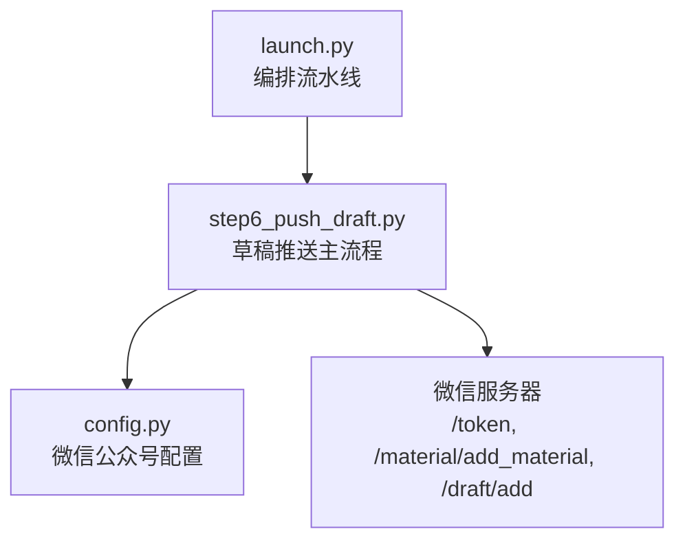
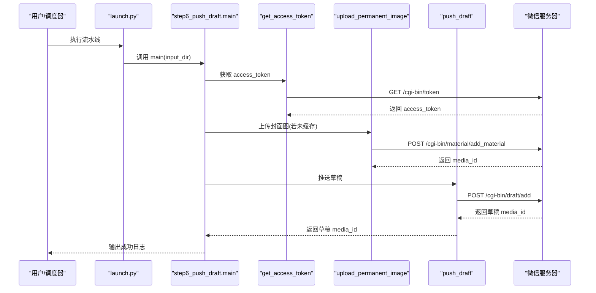
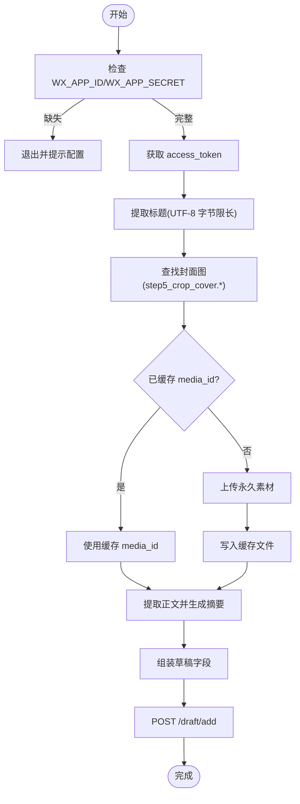
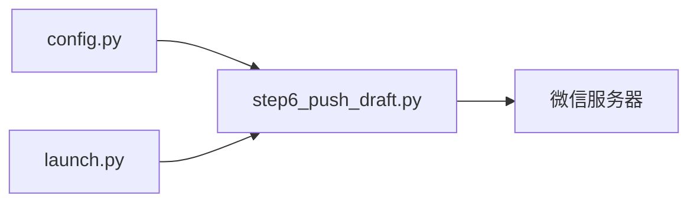

# 微信公众号 API

<cite>
**本文引用的文件**   
- [config.py](file://config.py)
- [step6_push_draft.py](file://step6_push_draft.py)
- [launch.py](file://launch.py)
</cite>

## 目录
1. [简介](#简介)
2. [项目结构](#项目结构)
3. [核心组件](#核心组件)
4. [架构总览](#架构总览)
5. [详细组件分析](#详细组件分析)
6. [依赖关系分析](#依赖关系分析)
7. [性能与配额限制](#性能与配额限制)
8. [故障排查指南](#故障排查指南)
9. [结论](#结论)
10. [附录：API 参考与示例](#附录api-参考与示例)

## 简介
本模块面向微信公众号内容发布流水线，聚焦“草稿推送”能力。其职责包括：
- 通过 AppID + AppSecret 获取 access_token
- 上传永久素材（封面图）并缓存 media_id
- 从中间产物 JSON 提取标题、正文摘要等元数据
- 调用微信草稿箱接口新增草稿
- 提供重试与错误处理策略，便于集成到自动化流程

该模块可独立运行，也可作为一键流水线的最后一步执行。

## 项目结构
与微信公众号集成相关的核心文件如下：
- config.py：集中存放微信公众号配置（AppID、AppSecret、基础 URL、默认作者、评论开关等）
- step6_push_draft.py：实现 access_token 获取、素材上传、草稿构建与推送的主逻辑
- launch.py：编排整条流水线，最终调用 step6 完成草稿推送

图表来源
- [launch.py:179-186](file://launch.py#L179-L186)
- [step6_push_draft.py:276-397](file://step6_push_draft.py#L276-L397)
- [config.py:29-38](file://config.py#L29-L38)

章节来源
- [launch.py:1-201](file://launch.py#L1-201)
- [step6_push_draft.py:1-404](file://step6_push_draft.py#L1-L404)
- [config.py:1-39](file://config.py#L1-L39)

## 核心组件
- 认证与令牌
  - get_access_token：使用 AppID 与 AppSecret 向微信服务端换取 access_token
- 素材管理
  - upload_permanent_image：上传永久图片素材，返回 media_id；支持本地缓存避免重复上传
- 内容组装
  - extract_title：从 step1_1 JSON 中取 heading_level=1 的标题，并按 UTF-8 字节上限截断
  - extract_body_text：从 step1_3/step1_2/step1_1 JSON 中提取纯文本正文，用于生成摘要
  - generate_digest：调用大模型从正文中抽取金句摘要（受 MAX_TOKENS 与输入长度限制）
- 草稿推送
  - push_draft：调用微信草稿箱接口新增草稿，返回草稿 media_id
- 流程编排
  - main：串联上述步骤，输出关键日志与结果

章节来源
- [step6_push_draft.py:42-56](file://step6_push_draft.py#L42-L56)
- [step6_push_draft.py:62-79](file://step6_push_draft.py#L62-L79)
- [step6_push_draft.py:105-127](file://step6_push_draft.py#L105-L127)
- [step6_push_draft.py:146-182](file://step6_push_draft.py#L146-L182)
- [step6_push_draft.py:227-246](file://step6_push_draft.py#L227-L246)
- [step6_push_draft.py:252-270](file://step6_push_draft.py#L252-L270)
- [step6_push_draft.py:276-397](file://step6_push_draft.py#L276-L397)
- [config.py:29-38](file://config.py#L29-L38)

## 架构总览
以下时序图展示了从流水线入口到草稿推送的关键调用链。

图表来源
- [launch.py:179-186](file://launch.py#L179-L186)
- [step6_push_draft.py:276-397](file://step6_push_draft.py#L276-L397)
- [step6_push_draft.py:42-56](file://step6_push_draft.py#L42-L56)
- [step6_push_draft.py:62-79](file://step6_push_draft.py#L62-L79)
- [step6_push_draft.py:252-270](file://step6_push_draft.py#L252-L270)

## 详细组件分析

### 认证与 access_token 机制
- 配置项
  - WX_APP_ID、WX_APP_SECRET：公众号凭证
  - WX_API_BASE：微信 API 基础地址
- 获取流程
  - 构造请求参数 grant_type=client_credential、appid、secret
  - 发起 GET 请求至 /cgi-bin/token
  - 校验响应中是否包含 access_token，否则抛出异常
- 注意
  - 当前实现每次推送均重新获取 token，未做本地缓存与自动刷新
  - 建议在生产环境增加内存或持久化缓存，并在过期前主动刷新

章节来源
- [config.py:29-32](file://config.py#L29-L32)
- [step6_push_draft.py:42-56](file://step6_push_draft.py#L42-L56)

### 素材上传与媒体资源管理
- 永久素材（封面图）
  - 接口：POST /cgi-bin/material/add_material?type=image
  - 入参：access_token、type=image、media(二进制图片)
  - 返回：media_id
  - 本地缓存：process 目录下 step6_thumb_media_id.txt，存在则复用
- 临时素材与永久素材
  - 当前仅实现永久素材上传
  - 如需临时素材（如消息回复、菜单图片），可参考微信文档在 /cgi-bin/media/upload 基础上扩展
- 注意事项
  - 图片格式与大小需符合微信要求
  - 建议对上传失败进行重试与幂等处理（基于 media_id 去重）

章节来源
- [step6_push_draft.py:62-79](file://step6_push_draft.py#L62-L79)
- [step6_push_draft.py:313-327](file://step6_push_draft.py#L313-L327)

### 草稿构建与推送
- 标题提取
  - 从 step1_1_docx_to_json.json 中查找 heading_level=1 的段落
  - 按 UTF-8 字节数上限截断，避免超长
- 正文摘要
  - 优先从 step1_3_bold_paragraphs.json 提取纯文本，回退到 step1_2/step1_1
  - 调用大模型生成摘要，并对长度进行保护性截断
- 草稿字段
  - title、author、content（占位）、thumb_media_id、digest、content_source_url、need_open_comment、only_fans_can_comment
- 推送接口
  - POST /cgi-bin/draft/add
  - 请求体 articles 数组，确保中文不被转义为 \uXXXX
  - 返回草稿 media_id

图表来源
- [step6_push_draft.py:276-397](file://step6_push_draft.py#L276-L397)
- [step6_push_draft.py:105-127](file://step6_push_draft.py#L105-L127)
- [step6_push_draft.py:146-182](file://step6_push_draft.py#L146-L182)
- [step6_push_draft.py:227-246](file://step6_push_draft.py#L227-L246)
- [step6_push_draft.py:252-270](file://step6_push_draft.py#L252-L270)

章节来源
- [step6_push_draft.py:105-127](file://step6_push_draft.py#L105-L127)
- [step6_push_draft.py:146-182](file://step6_push_draft.py#L146-L182)
- [step6_push_draft.py:227-246](file://step6_push_draft.py#L227-L246)
- [step6_push_draft.py:252-270](file://step6_push_draft.py#L252-L270)
- [step6_push_draft.py:276-397](file://step6_push_draft.py#L276-L397)

### 错误处理与重试策略
- HTTP 层
  - 使用 raise_for_status() 快速失败，捕获网络异常后打印错误信息
- 重试机制
  - 大模型调用采用指数退避式重试（固定间隔倍数），最大重试次数由全局配置控制
  - 微信 API 调用目前未内置重试，建议在封装层统一添加
- 健壮性
  - 对关键返回值进行存在性校验，缺失时抛出明确异常
  - 对超长字段进行截断保护（标题、摘要）

章节来源
- [step6_push_draft.py:188-211](file://step6_push_draft.py#L188-L211)
- [config.py:20-21](file://config.py#L20-L21)
- [step6_push_draft.py:50-56](file://step6_push_draft.py#L50-L56)
- [step6_push_draft.py:71-79](file://step6_push_draft.py#L71-L79)
- [step6_push_draft.py:262-270](file://step6_push_draft.py#L262-L270)

### 安全与合规
- 凭证管理
  - AppID/AppSecret 应通过环境变量或密钥管理服务注入，避免硬编码
- 传输安全
  - 所有请求均使用 HTTPS
- 最小权限
  - 仅申请必要接口权限（草稿箱、素材管理）
- 审计与脱敏
  - 日志中避免记录敏感信息（如 token、secret）

章节来源
- [config.py:29-32](file://config.py#L29-L32)
- [step6_push_draft.py:42-56](file://step6_push_draft.py#L42-L56)

## 依赖关系分析
- 外部依赖
  - requests：HTTP 客户端
- 内部依赖
  - config.py：集中配置
  - launch.py：流水线编排入口

图表来源
- [launch.py:179-186](file://launch.py#L179-L186)
- [step6_push_draft.py:31-36](file://step6_push_draft.py#L31-L36)
- [config.py:29-38](file://config.py#L29-L38)

章节来源
- [launch.py:179-186](file://launch.py#L179-L186)
- [step6_push_draft.py:31-36](file://step6_push_draft.py#L31-L36)
- [config.py:29-38](file://config.py#L29-L38)

## 性能与配额限制
- 并发与限流
  - 微信 API 有频率限制，建议串行调用或在应用层加令牌桶/漏桶限流
- 超时设置
  - 当前各请求设置了合理超时，可根据网络状况调整
- 缓存优化
  - 封面图 media_id 本地缓存，减少重复上传
  - 建议引入 access_token 缓存与提前刷新策略，降低频繁换票开销
- 内容体积
  - 标题与摘要长度限制已在代码中做保护性截断，避免超限失败

[本节为通用指导，不直接分析具体文件]

## 故障排查指南
- 常见错误定位
  - 未配置 AppID/AppSecret：启动即报错退出
  - 封面图不存在：提示先运行封面裁剪步骤
  - 无标题：无法继续推送
  - 草稿推送失败：检查返回码与错误信息
- 日志要点
  - 关注 “[INFO]/[WARN]/[ERROR]/[DEBUG]” 级别输出
  - 核对字段长度与字节数，确认是否符合微信限制
- 恢复建议
  - 针对网络抖动，可在封装层增加重试与退避
  - 针对 token 失效，增加自动刷新逻辑
  - 针对素材上传失败，结合 media_id 缓存与幂等重试

章节来源
- [step6_push_draft.py:285-287](file://step6_push_draft.py#L285-L287)
- [step6_push_draft.py:318-327](file://step6_push_draft.py#L318-L327)
- [step6_push_draft.py:303-307](file://step6_push_draft.py#L303-L307)
- [step6_push_draft.py:262-270](file://step6_push_draft.py#L262-L270)

## 结论
本模块以简洁清晰的函数式接口实现了微信公众号草稿推送的核心链路，具备基础的错误处理与日志输出。生产落地建议补充：
- access_token 缓存与自动刷新
- 统一的 HTTP 重试与熔断降级
- 更完善的错误码分类与告警上报
- 将敏感配置纳入密钥管理系统

[本节为总结性内容，不直接分析具体文件]

## 附录：API 参考与示例

### 认证与令牌
- 接口
  - GET {WX_API_BASE}/token?grant_type=client_credential&appid={WX_APP_ID}&secret={WX_APP_SECRET}
- 返回关键字段
  - access_token、expires_in
- 使用方式
  - 后续所有接口均需携带 access_token 参数

章节来源
- [step6_push_draft.py:42-56](file://step6_push_draft.py#L42-L56)
- [config.py:29-32](file://config.py#L29-L32)

### 素材上传（永久素材）
- 接口
  - POST {WX_API_BASE}/material/add_material?type=image
- 表单字段
  - media：图片二进制
- 返回关键字段
  - media_id
- 本地缓存
  - process 目录下的 step6_thumb_media_id.txt

章节来源
- [step6_push_draft.py:62-79](file://step6_push_draft.py#L62-L79)
- [step6_push_draft.py:313-327](file://step6_push_draft.py#L313-L327)

### 草稿推送
- 接口
  - POST {WX_API_BASE}/draft/add
- 请求体
  - articles：文章对象数组
  - 关键字段：title、author、content、thumb_media_id、digest、content_source_url、need_open_comment、only_fans_can_comment
- 返回关键字段
  - media_id（草稿 ID）

章节来源
- [step6_push_draft.py:252-270](file://step6_push_draft.py#L252-L270)
- [step6_push_draft.py:365-384](file://step6_push_draft.py#L365-L384)

### 端到端示例（调用路径）
- 通过流水线入口执行
  - launch.py 调用 step6_push_draft.main(input_dir)
- 独立运行
  - 直接执行 step6_push_draft.py，修改 input_dir 指向目标实例目录

章节来源
- [launch.py:179-186](file://launch.py#L179-L186)
- [step6_push_draft.py:400-404](file://step6_push_draft.py#L400-L404)