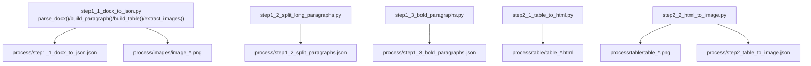
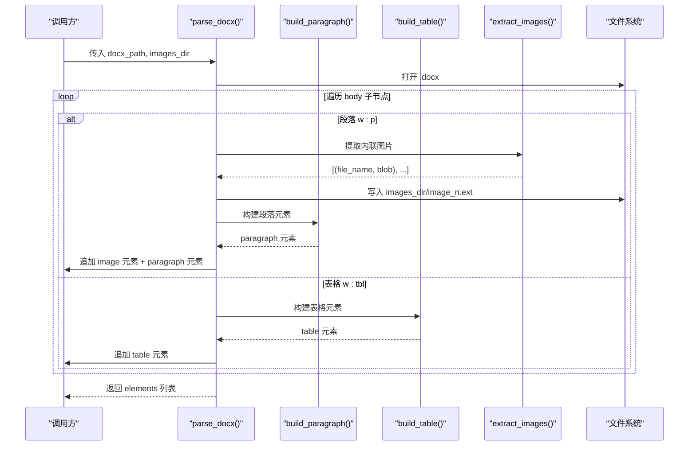
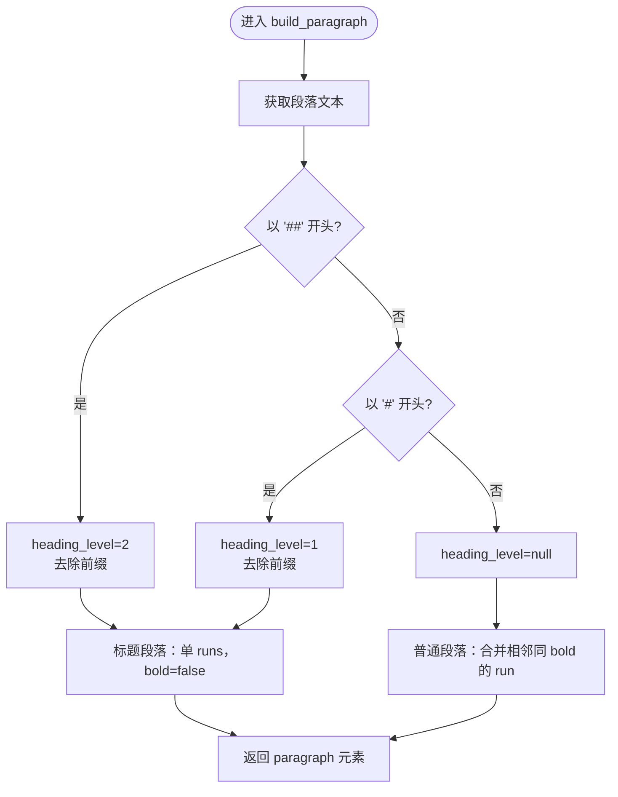
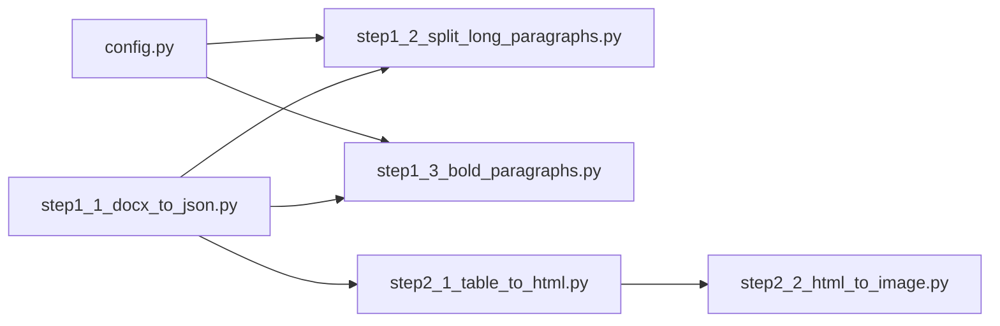

# 文档处理 API

<cite>
**本文引用的文件**
- [step1_1_docx_to_json.py](file://step1_1_docx_to_json.py)
- [config.py](file://config.py)
- [step1_2_split_long_paragraphs.py](file://step1_2_split_long_paragraphs.py)
- [step1_3_bold_paragraphs.py](file://step1_3_bold_paragraphs.py)
- [step2_1_table_to_html.py](file://step2_1_table_to_html.py)
- [step2_2_html_to_image.py](file://step2_2_html_to_image.py)
- [content_instance/content_20260702_1/process/step1_1_docx_to_json.json](file://content_instance/content_20260702_1/process/step1_1_docx_to_json.json)
</cite>

## 目录
1. [简介](#简介)
2. [项目结构](#项目结构)
3. [核心组件](#核心组件)
4. [架构总览](#架构总览)
5. [详细组件分析](#详细组件分析)
6. [依赖关系分析](#依赖关系分析)
7. [性能与稳定性](#性能与稳定性)
8. [故障排查指南](#故障排查指南)
9. [结论](#结论)
10. [附录：JSON 输出规范与示例](#附录json-输出规范与示例)

## 简介
本模块负责将 Word 文档（.docx）解析为结构化 JSON，并支持后续段落拆分、加粗标记、表格转图片等流水线步骤。核心入口函数为 parse_docx()，其输入为 docx_path 与 images_dir，返回按文档顺序排列的 elements 列表。elements 包含三类元素：段落（paragraph）、表格（table）、图片（image）。此外还提供辅助函数 build_paragraph()、build_table()、extract_images() 用于构建各类型元素。

## 项目结构
- step1_1_docx_to_json.py：解析 .docx，提取段落、表格、内联图片，生成 process/step1_1_docx_to_json.json 与 process/images/*.png
- step1_2_split_long_paragraphs.py：对过长段落进行语义拆分，输出 step1_2_split_paragraphs.json
- step1_3_bold_paragraphs.py：基于 LLM 为正文添加总结/判断性加粗标识，输出 step1_3_bold_paragraphs.json
- step2_1_table_to_html.py：将 table 数据转为 HTML 片段，输出到 process/table/
- step2_2_html_to_image.py：将表格 HTML 截图为 PNG，并将 JSON 中的 table 元素替换为 image 元素
- config.py：全局配置（API URL、重试次数、最大 token、段落拆分阈值等）

图表来源
- [step1_1_docx_to_json.py:145-184](file://step1_1_docx_to_json.py#L145-L184)
- [step1_2_split_long_paragraphs.py:198-301](file://step1_2_split_long_paragraphs.py#L198-L301)
- [step1_3_bold_paragraphs.py:207-330](file://step1_3_bold_paragraphs.py#L207-L330)
- [step2_1_table_to_html.py:40-85](file://step2_1_table_to_html.py#L40-L85)
- [step2_2_html_to_image.py:120-217](file://step2_2_html_to_image.py#L120-L217)

章节来源
- [step1_1_docx_to_json.py:1-233](file://step1_1_docx_to_json.py#L1-L233)
- [config.py:1-39](file://config.py#L1-L39)

## 核心组件
- parse_docx(docx_path, images_dir)
  - 作用：按文档原始顺序遍历 body，依次处理段落、表格、内联图片，返回 elements 列表
  - 输入参数：
    - docx_path: 字符串，.docx 文件路径
    - images_dir: 字符串，图片保存目录路径（会写入 image_n.ext）
  - 返回值：elements 列表，每个元素为 dict，包含 type、index 及具体字段
  - 行为要点：
    - 段落中先插入所有内联图片元素，再插入段落本身
    - 空段落自动过滤
    - 表格元素记录行列数与单元格文本/加粗状态
- build_paragraph(paragraph)
  - 作用：将 Paragraph 对象转换为 paragraph 元素
  - 标题识别规则：以 ## 开头优先匹配 heading_level=2；否则 # 开头匹配 heading_level=1；普通段落 heading_level=null
  - runs 合并：相邻且 bold 状态相同的 run 会被合并
- build_table(table)
  - 作用：将 Table 对象转换为 table 元素
  - 单元格 bold 检测：取单元格首个非空 run 的加粗状态作为该单元格 bold
- extract_images(element, doc, image_counter)
  - 作用：从 XML 元素中提取所有内联图片，返回 (file_name, image_bytes) 列表
  - 命名规则：image_{n}.{ext}，ext 来自 content_type（jpeg 统一为 jpg）

章节来源
- [step1_1_docx_to_json.py:34-69](file://step1_1_docx_to_json.py#L34-L69)
- [step1_1_docx_to_json.py:75-139](file://step1_1_docx_to_json.py#L75-L139)
- [step1_1_docx_to_json.py:145-184](file://step1_1_docx_to_json.py#L145-L184)

## 架构总览
下图展示了从 .docx 到最终可渲染元素的端到端流程，包括段落拆分、加粗标注、表格转图替换等关键步骤。

图表来源
- [step1_1_docx_to_json.py:145-184](file://step1_1_docx_to_json.py#L145-L184)
- [step1_1_docx_to_json.py:75-139](file://step1_1_docx_to_json.py#L75-L139)
- [step1_1_docx_to_json.py:47-69](file://step1_1_docx_to_json.py#L47-L69)

## 详细组件分析

### parse_docx() 接口规范
- 签名
  - parse_docx(docx_path: str, images_dir: str) -> list[dict]
- 参数要求
  - docx_path: 必须存在且为 .docx 格式（主函数 main 中有校验，若直接调用需自行保证）
  - images_dir: 必须为有效目录路径（函数内部不会创建目录，建议由调用方确保存在）
- 返回值
  - elements: 列表，元素顺序与文档 body 中出现的顺序一致
  - 每个元素包含通用字段：
    - index: 整数或字符串（拆分后可能为带小数点的字符串）
    - type: "paragraph" | "table" | "image"
- 元素定义
  - 段落（paragraph）
    - type: "paragraph"
    - heading_level: null | 1 | 2
    - runs: 列表，每项为 {text: str, bold: bool}
    - index: 整数或字符串
  - 表格（table）
    - type: "table"
    - row_count: int
    - col_count: int
    - data: [[{text: str, bold: bool}]]
    - index: 整数
  - 图片（image）
    - type: "image"
    - file_name: str（如 image_1.png）
    - image_path: str（相对路径，形如 process/images/image_1.png）
    - index: 整数
- 处理顺序与约束
  - 段落内图片先于段落本身插入 elements
  - 空段落（runs 为空或所有 text 为空）被过滤
  - 标题前缀在构建段落时去除，heading_level 仅保留级别信息
  - 表格单元格 bold 取首个非空 run 的加粗状态

章节来源
- [step1_1_docx_to_json.py:145-184](file://step1_1_docx_to_json.py#L145-L184)
- [step1_1_docx_to_json.py:75-113](file://step1_1_docx_to_json.py#L75-L113)
- [step1_1_docx_to_json.py:116-139](file://step1_1_docx_to_json.py#L116-L139)

### build_paragraph() 接口说明
- 签名
  - build_paragraph(paragraph) -> dict
- 输入
  - paragraph: docx.text.paragraph.Paragraph 实例
- 输出
  - 段落元素 dict，包含 type、heading_level、runs、index（index 由上层设置）
- 标题识别规则
  - 优先匹配 ## 开头 → heading_level=2，并去除前缀
  - 其次匹配 # 开头 → heading_level=1，并去除前缀
  - 普通段落 heading_level=null
- 加粗样式检测逻辑
  - 通过 is_run_bold(run) 判断单个 run 是否加粗（含样式继承）
  - 普通段落会将相邻且 bold 状态相同的 run 合并，减少冗余
- 复杂度
  - O(n)，n 为段落中 run 数量

章节来源
- [step1_1_docx_to_json.py:75-113](file://step1_1_docx_to_json.py#L75-L113)
- [step1_1_docx_to_json.py:34-44](file://step1_1_docx_to_json.py#L34-L44)

### build_table() 接口说明
- 签名
  - build_table(table) -> dict
- 输入
  - table: docx.table.Table 实例
- 输出
  - 表格元素 dict，包含 type、row_count、col_count、data、index（index 由上层设置）
- 单元格 bold 检测
  - 遍历单元格段落与 run，取首个非空 run 的加粗状态作为单元格 bold
- 复杂度
  - O(R*C)，R 为行数，C 为列数

章节来源
- [step1_1_docx_to_json.py:116-139](file://step1_1_docx_to_json.py#L116-L139)

### extract_images() 接口说明
- 签名
  - extract_images(element, doc, image_counter) -> list[tuple[str, bytes]]
- 输入
  - element: XML 元素（通常为段落 w:p）
  - doc: Document 实例（用于通过 rId 获取图片资源）
  - image_counter: 长度为 1 的列表，用于全局递增计数
- 输出
  - 列表项为 (file_name, image_bytes)
  - file_name 形如 image_{n}.ext，ext 来自 content_type（jpeg→jpg）
- 图片提取机制
  - 遍历 drawing → wp:inline/wp:anchor → a:blip → r:embed
  - 通过 rels[rId].target_part.blob 读取二进制内容
- 异常处理
  - 捕获 KeyError/AttributeError，跳过无法解析的图片

章节来源
- [step1_1_docx_to_json.py:47-69](file://step1_1_docx_to_json.py#L47-L69)

### 流程图：标题识别与加粗检测

图表来源
- [step1_1_docx_to_json.py:75-113](file://step1_1_docx_to_json.py#L75-L113)

## 依赖关系分析
- 外部库
  - python-docx：用于解析 .docx 结构与样式
- 内部依赖
  - config.py：提供 SPLIT_THRESHOLD、MAX_RETRIES、MAX_TOKENS、API_URL、HEADERS 等
  - 下游步骤：step1_2、step1_3、step2_1、step2_2 均依赖 step1_1 的输出 JSON

图表来源
- [config.py:1-39](file://config.py#L1-L39)
- [step1_2_split_long_paragraphs.py:198-301](file://step1_2_split_long_paragraphs.py#L198-L301)
- [step1_3_bold_paragraphs.py:207-330](file://step1_3_bold_paragraphs.py#L207-L330)
- [step2_1_table_to_html.py:40-85](file://step2_1_table_to_html.py#L40-L85)
- [step2_2_html_to_image.py:120-217](file://step2_2_html_to_image.py#L120-L217)

章节来源
- [config.py:1-39](file://config.py#L1-L39)

## 性能与稳定性
- 时间复杂度
  - parse_docx：O(N+M+K)，N 为段落数，M 为表格数，K 为内联图片总数
  - build_paragraph：O(R)，R 为段落中 run 数
  - build_table：O(R*C)，R 为行数，C 为列数
  - extract_images：O(D)，D 为 drawing 节点数
- 内存占用
  - 主要取决于文档大小与图片数量；图片以二进制形式暂存后再落盘
- 稳定性
  - 图片提取使用 try/except 忽略损坏或不可解析的资源
  - 空段落自动过滤，避免无意义元素
  - 表格首行作为表头，后续行作为表体，便于后续 HTML 生成

## 故障排查指南
- 常见错误
  - 文件不存在或后缀非 .docx：main 函数会打印错误并退出
  - images_dir 不存在：写入图片时会抛出异常，建议在调用前确保目录存在
  - 模型调用失败（step1_2/step1_3）：有重试机制，失败则保留原段落或跳过
- 定位方法
  - 检查 process 目录下生成的 JSON 与图片是否完整
  - 查看控制台日志中的 [ERROR]/[WARN]/[INFO] 提示
  - 对于表格转图失败，确认 table/*.html 是否存在以及 step2_2 是否正确替换 JSON 中的 table 元素

章节来源
- [step1_1_docx_to_json.py:190-226](file://step1_1_docx_to_json.py#L190-L226)
- [step1_2_split_long_paragraphs.py:80-103](file://step1_2_split_long_paragraphs.py#L80-L103)
- [step1_3_bold_paragraphs.py:73-96](file://step1_3_bold_paragraphs.py#L73-96)
- [step2_2_html_to_image.py:120-217](file://step2_2_html_to_image.py#L120-L217)

## 结论
本模块提供了完整的 .docx 解析能力，并通过辅助函数与流水线步骤实现了段落拆分、加粗标注与表格转图的自动化处理。parse_docx() 作为核心入口，返回标准化的 elements 列表，便于后续多步处理与渲染。

## 附录：JSON 输出规范与示例

### 顶层结构
- file_name: 源文件名
- total_elements: 元素总数
- elements: 元素列表

### 元素类型与字段
- 段落（paragraph）
  - type: "paragraph"
  - heading_level: null | 1 | 2
  - runs: [{text: str, bold: bool}, ...]
  - index: int | str
- 表格（table）
  - type: "table"
  - row_count: int
  - col_count: int
  - data: [[{text: str, bold: bool}], ...]
  - index: int
- 图片（image）
  - type: "image"
  - file_name: str
  - image_path: str（相对路径，形如 process/images/image_n.ext）
  - index: int

### 示例片段（节选）
以下为实际输出的部分片段，展示段落、图片与表格的结构形态：
- 段落元素示例（含 heading_level 与 runs）
- 图片元素示例（含 file_name 与 image_path）
- 表格元素示例（含 row_count、col_count、data）

章节来源
- [content_instance/content_20260702_1/process/step1_1_docx_to_json.json:1-200](file://content_instance/content_20260702_1/process/step1_1_docx_to_json.json#L1-L200)