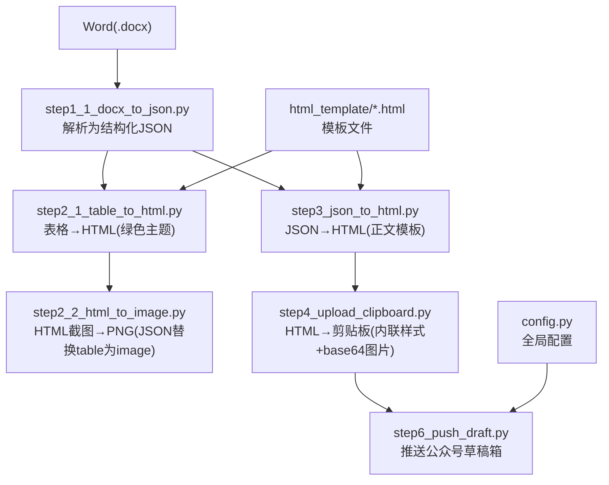
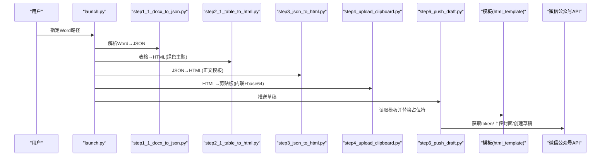
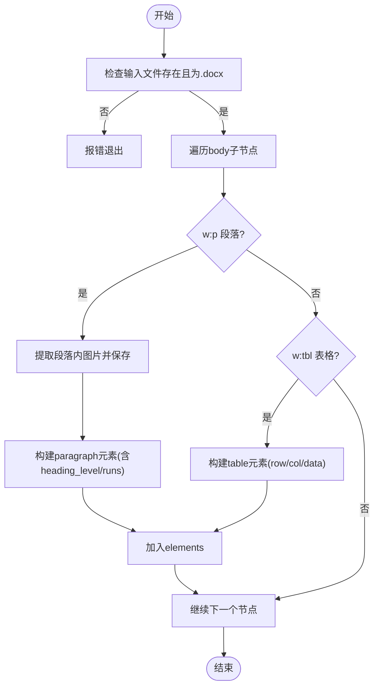
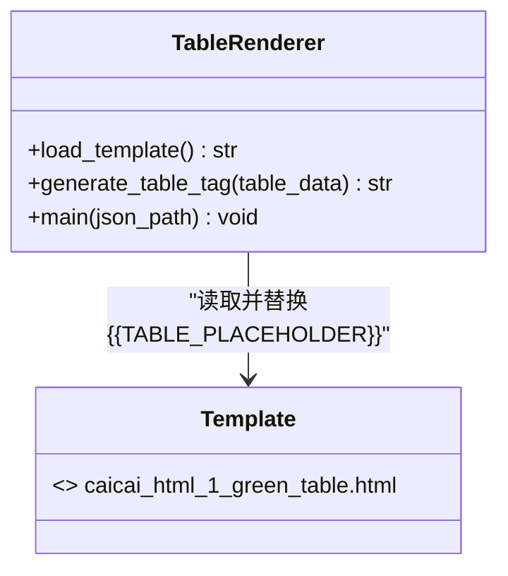
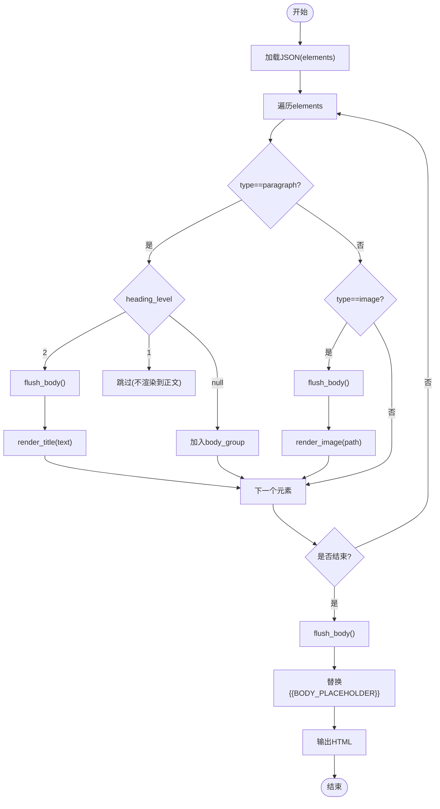
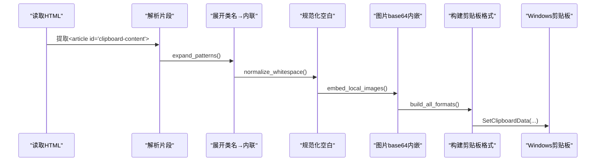
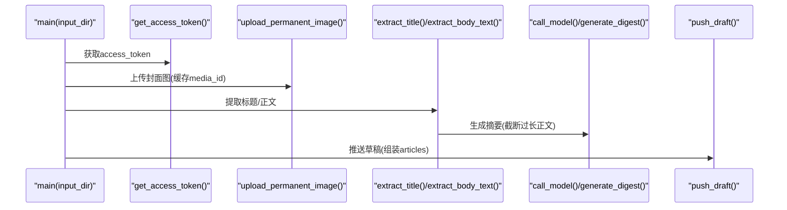
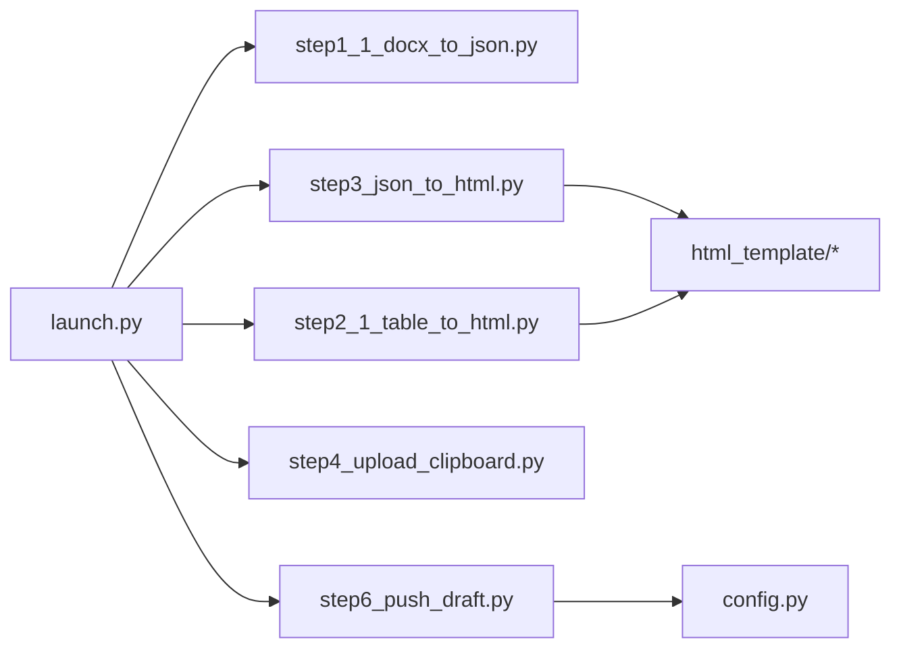

# HTML 渲染引擎

<cite>
**本文引用的文件**   
- [config.py](file://config.py)
- [launch.py](file://launch.py)
- [step1_1_docx_to_json.py](file://step1_1_docx_to_json.py)
- [step2_1_table_to_html.py](file://step2_1_table_to_html.py)
- [step3_json_to_html.py](file://step3_json_to_html.py)
- [step4_upload_clipboard.py](file://step4_upload_clipboard.py)
- [step6_push_draft.py](file://step6_push_draft.py)
- [caicai_html_1_green_classical.html](file://html_template/caicai_html_1_green_classical.html)
- [caicai_html_1_green_table.html](file://html_template/caicai_html_1_green_table.html)
</cite>

## 目录
1. [简介](#简介)
2. [项目结构](#项目结构)
3. [核心组件](#核心组件)
4. [架构总览](#架构总览)
5. [详细组件分析](#详细组件分析)
6. [依赖关系分析](#依赖关系分析)
7. [性能与缓存](#性能与缓存)
8. [微信公众号兼容性](#微信公众号兼容性)
9. [模板系统与占位符替换](#模板系统与占位符替换)
10. [JSON 到 HTML 的渲染规则](#json-到-html-的渲染规则)
11. [扩展指南：新增元素类型与样式主题](#扩展指南新增元素类型与样式主题)
12. [调试与测试方法](#调试与测试方法)
13. [故障排查](#故障排查)
14. [结论](#结论)

## 简介
本技术文档围绕 HTML 渲染引擎，系统阐述从 Word 文档到微信公众号草稿箱的一体化流水线。重点覆盖：
- 模板系统设计与占位符替换机制
- CSS 样式继承与内联化策略
- JSON 到 HTML 的渲染规则（段落、标题、图片、表格）
- 微信公众号兼容处理（CSS 限制、图片内嵌、脚本禁用）
- 模板文件结构与自定义方式
- 扩展新元素类型与样式主题的方法
- 渲染性能优化与缓存策略
- 调试工具与测试方法

## 项目结构
项目采用“步骤式”流水线组织，每个步骤对应一个独立脚本，数据以 JSON/HTML 在 process 目录中流转；模板集中存放于 html_template 目录；全局配置集中于 config.py；一键编排入口为 launch.py。

图表来源
- [launch.py:42-193](file://launch.py#L42-L193)
- [step1_1_docx_to_json.py:145-184](file://step1_1_docx_to_json.py#L145-L184)
- [step2_1_table_to_html.py:74-118](file://step2_1_table_to_html.py#L74-L118)
- [step3_json_to_html.py:121-142](file://step3_json_to_html.py#L121-L142)
- [step4_upload_clipboard.py:436-475](file://step4_upload_clipboard.py#L436-L475)
- [step6_push_draft.py:276-397](file://step6_push_draft.py#L276-L397)
- [caicai_html_1_green_classical.html:187-209](file://html_template/caicai_html_1_green_classical.html#L187-L209)
- [caicai_html_1_green_table.html:59-62](file://html_template/caicai_html_1_green_table.html#L59-L62)

章节来源
- [launch.py:1-201](file://launch.py#L1-L201)
- [config.py:1-39](file://config.py#L1-L39)

## 核心组件
- 解析器：将 Word 文档解析为结构化 JSON（段落、表格、图片），并识别标题层级与加粗样式。
- 表格处理器：按绿色主题模板生成表格 HTML，首行作为表头，其余为表体。
- 正文渲染器：读取 JSON elements，按规则生成正文 HTML，并注入模板占位符。
- 剪贴板写入器：将简化类名标签展开为内联样式，本地图片转 base64，构建 Windows 剪贴板多格式数据。
- 公众号推送器：获取 access_token、上传封面图、调用大模型生成摘要、推送草稿。

章节来源
- [step1_1_docx_to_json.py:75-184](file://step1_1_docx_to_json.py#L75-L184)
- [step2_1_table_to_html.py:39-118](file://step2_1_table_to_html.py#L39-L118)
- [step3_json_to_html.py:38-115](file://step3_json_to_html.py#L38-L115)
- [step4_upload_clipboard.py:115-222](file://step4_upload_clipboard.py#L115-L222)
- [step6_push_draft.py:42-79](file://step6_push_draft.py#L42-L79)

## 架构总览
整体流程由 launch.py 统一调度，各步骤通过 process 目录中的中间产物衔接。模板文件提供可插拔的视觉主题，渲染阶段仅做最小化的占位符替换与类名生成，最终在剪贴板写入阶段完成样式内联与资源内嵌，确保目标平台（微信编辑器/剪贴板）兼容性。

图表来源
- [launch.py:42-193](file://launch.py#L42-L193)
- [step3_json_to_html.py:121-142](file://step3_json_to_html.py#L121-L142)
- [step4_upload_clipboard.py:436-475](file://step4_upload_clipboard.py#L436-L475)
- [step6_push_draft.py:276-397](file://step6_push_draft.py#L276-L397)

## 详细组件分析

### 组件一：Word 解析器（step1_1_docx_to_json.py）
- 功能要点
  - 遍历文档 body，顺序提取段落、表格、图片，保持原始顺序。
  - 标题识别：以 # 或 ## 前缀判定 heading_level=1/2，并去除前缀。
  - 加粗检测：支持 run.bold 与 XML 属性 w:b 的样式继承判断。
  - 图片提取：从 inline/anchor 节点解析 rId，导出 image_* 文件。
  - 输出 JSON：包含 file_name、total_elements、elements 列表。
- 数据结构
  - paragraph: { type, heading_level, runs:[{text,bold}], index }
  - table: { type, row_count, col_count, data:[[cell]] }
  - image: { type, file_name, image_path, index }
- 复杂度
  - 时间 O(N) 线性扫描段落/表格/图片；runs 合并相邻同 bold 状态，减少冗余。
  - 空间 O(E) 存储 elements 列表。
- 错误处理
  - 文件不存在/非 .docx 直接退出；XML 节点缺失时跳过。
- 优化建议
  - 对超大文档可考虑分块解析；图片导出可并行 IO。

图表来源
- [step1_1_docx_to_json.py:145-184](file://step1_1_docx_to_json.py#L145-L184)
- [step1_1_docx_to_json.py:75-113](file://step1_1_docx_to_json.py#L75-L113)
- [step1_1_docx_to_json.py:116-139](file://step1_1_docx_to_json.py#L116-L139)

章节来源
- [step1_1_docx_to_json.py:1-233](file://step1_1_docx_to_json.py#L1-L233)

### 组件二：表格 HTML 生成器（step2_1_table_to_html.py）
- 功能要点
  - 读取 step1 JSON，筛选 type=table 的元素。
  - 使用绿色主题模板 caicai_html_1_green_table.html，填充 {{TABLE_PLACEHOLDER}}。
  - 首行作为 <thead>，其余行作为 <tbody>；单元格 bold 映射为 class="bold"。
- 输出
  - process/table/table_{n}.html 独立表格页面。
- 注意事项
  - 空表格跳过；模板中包含脚本用于行高同步（后续会被截图，不影响最终文章）。

图表来源
- [step2_1_table_to_html.py:33-68](file://step2_1_table_to_html.py#L33-L68)
- [caicai_html_1_green_table.html:59-62](file://html_template/caicai_html_1_green_table.html#L59-L62)

章节来源
- [step2_1_table_to_html.py:1-125](file://step2_1_table_to_html.py#L1-L125)
- [caicai_html_1_green_table.html:1-81](file://html_template/caicai_html_1_green_table.html#L1-L81)

### 组件三：正文渲染器（step3_json_to_html.py）
- 功能要点
  - 读取 step2 JSON（若存在表格则用 step2 输出，否则用 step1 输出）。
  - 渲染规则：
    - heading_level=1：不渲染到正文区（仅用于标题提取等下游用途）。
    - heading_level=2：渲染为 
。
    - 普通段落：合并入 <section style="...">，每段 
，并以空行分隔。
    - 加粗 run：渲染为 。
    - 图片：居中 。
  - 将生成的正文片段替换模板中的 {{BODY_PLACEHOLDER}}，输出 step3_json_to_html.html。
- 模板
  - 使用 caicai_html_1_green_classical.html，其中包含装饰容器与占位符。

图表来源
- [step3_json_to_html.py:84-115](file://step3_json_to_html.py#L84-L115)
- [step3_json_to_html.py:121-142](file://step3_json_to_html.py#L121-L142)
- [caicai_html_1_green_classical.html:207-209](file://html_template/caicai_html_1_green_classical.html#L207-L209)

章节来源
- [step3_json_to_html.py:1-149](file://step3_json_to_html.py#L1-L149)
- [caicai_html_1_green_classical.html:1-278](file://html_template/caicai_html_1_green_classical.html#L1-L278)

### 组件四：剪贴板写入器（step4_upload_clipboard.py）
- 功能要点
  - 解析 HTML，提取 <article id="clipboard-content"> 内容片段。
  - 将简化类名标签展开为 Xiumi 风格的内联样式：
    - .title → 带字级与强化的 section/p/strong
    - .body → 白边距与 box-sizing 的 p
    - .empty-line → 带 br 的 p
    - .hl(span) → 背景色+强化的 span
  - 规范化空白字符，移除格式化缩进与换行。
  - 本地图片转 base64 data URI，确保剪贴板粘贴可用。
  - 构建 Windows 剪贴板多格式数据（HTML Format、CF_UNICODETEXT、CF_TEXT/OEMTEXT、CF_LOCALE 等），写入剪贴板。
- 微信公众号兼容
  - 内联样式与 base64 图片满足微信编辑器粘贴要求。
  - 避免外部链接与脚本执行。

图表来源
- [step4_upload_clipboard.py:72-109](file://step4_upload_clipboard.py#L72-L109)
- [step4_upload_clipboard.py:115-172](file://step4_upload_clipboard.py#L115-L172)
- [step4_upload_clipboard.py:175-188](file://step4_upload_clipboard.py#L175-L188)
- [step4_upload_clipboard.py:194-222](file://step4_upload_clipboard.py#L194-L222)
- [step4_upload_clipboard.py:288-365](file://step4_upload_clipboard.py#L288-L365)
- [step4_upload_clipboard.py:371-430](file://step4_upload_clipboard.py#L371-L430)

章节来源
- [step4_upload_clipboard.py:1-480](file://step4_upload_clipboard.py#L1-L480)

### 组件五：公众号推送器（step6_push_draft.py）
- 功能要点
  - 获取 access_token（AppID/AppSecret）。
  - 上传永久素材（封面图），返回 media_id 并缓存。
  - 从 step1_1 JSON 提取 heading_level=1 的标题（UTF-8 字节截断保护）。
  - 从 step1_3/step1_2/step1_1 中抽取正文文本，调用大模型生成摘要金句（截断输入长度）。
  - 组装草稿字段并调用草稿箱 API 推送。
- 配置
  - 来自 config.py 的 WX_APP_ID/WX_APP_SECRET、作者、评论开关、来源 URL 等。

图表来源
- [step6_push_draft.py:42-79](file://step6_push_draft.py#L42-L79)
- [step6_push_draft.py:105-127](file://step6_push_draft.py#L105-L127)
- [step6_push_draft.py:146-182](file://step6_push_draft.py#L146-L182)
- [step6_push_draft.py:188-246](file://step6_push_draft.py#L188-L246)
- [step6_push_draft.py:252-270](file://step6_push_draft.py#L252-L270)
- [config.py:29-39](file://config.py#L29-L39)

章节来源
- [step6_push_draft.py:1-404](file://step6_push_draft.py#L1-L404)
- [config.py:1-39](file://config.py#L1-L39)

## 依赖关系分析
- 模块耦合
  - launch.py 作为编排者，低耦合地调用各步骤 main。
  - step3 依赖模板文件；step4 依赖 step3 输出；step6 依赖 step1/step5 产物与 config。
- 外部依赖
  - requests（网络请求）、ctypes（Windows 剪贴板 API）、python-docx（解析 .docx）。
- 潜在循环依赖
  - 无直接循环导入；步骤间通过文件系统传递数据，解耦良好。

图表来源
- [launch.py:42-193](file://launch.py#L42-L193)
- [step3_json_to_html.py:121-142](file://step3_json_to_html.py#L121-L142)
- [step2_1_table_to_html.py:74-118](file://step2_1_table_to_html.py#L74-L118)
- [step6_push_draft.py:276-397](file://step6_push_draft.py#L276-L397)
- [config.py:1-39](file://config.py#L1-L39)

章节来源
- [launch.py:1-201](file://launch.py#L1-L201)

## 性能与缓存
- 渲染性能
  - 正文渲染为字符串拼接，时间复杂度 O(N)，适合中等规模文档。
  - 表格 HTML 生成与截图属于 I/O 密集操作，可通过并发提升吞吐。
- 缓存策略
  - 封面图 media_id 缓存至 step6_thumb_media_id.txt，避免重复上传。
  - 剪贴板写入阶段会保存内联样式 HTML 供复用（不含 base64，便于后续上传微信）。
- 优化建议
  - 对长文摘要生成进行输入截断（已实现），必要时引入异步队列。
  - 图片 base64 内嵌体积较大，可在预览阶段保留外链，仅在最终发布时内嵌。

章节来源
- [step6_push_draft.py:313-327](file://step6_push_draft.py#L313-L327)
- [step4_upload_clipboard.py:455-462](file://step4_upload_clipboard.py#L455-L462)

## 微信公众号兼容性
- CSS 限制
  - 使用内联样式与基础布局，避免复杂选择器与外部样式表。
  - 模板中大量使用 box-sizing、white-space、line-height 等通用属性。
- 图片内嵌
  - 剪贴板写入阶段将本地图片转为 base64 data URI，确保粘贴后显示正常。
- 脚本禁用
  - 最终文章不包含可执行脚本；表格模板中的脚本仅用于截图阶段，不参与最终正文。
- 剪贴板格式
  - 同时提供 HTML Format 与纯文本格式，适配不同粘贴场景。

章节来源
- [step4_upload_clipboard.py:115-222](file://step4_upload_clipboard.py#L115-L222)
- [caicai_html_1_green_table.html:65-78](file://html_template/caicai_html_1_green_table.html#L65-L78)

## 模板系统与占位符替换
- 占位符
  - 正文模板：{{BODY_PLACEHOLDER}} 被 step3 替换为生成的正文片段。
  - 表格模板：{{TABLE_PLACEHOLDER}} 被 step2 替换为 <table>...</table>。
- 模板结构
  - 绿色古典模板包含元信息栏、内容区域、装饰容器与底部提示。
  - 表格模板定义表头/表体样式与行高同步脚本（仅截图阶段使用）。
- 自定义方法
  - 新增主题：复制现有模板，修改样式与装饰结构，保持占位符不变。
  - 调整渲染：在 step3 中扩展 generate_body_html 与 render_* 函数，输出新的类名或标签。

章节来源
- [step3_json_to_html.py:121-142](file://step3_json_to_html.py#L121-L142)
- [step2_1_table_to_html.py:96-118](file://step2_1_table_to_html.py#L96-L118)
- [caicai_html_1_green_classical.html:187-209](file://html_template/caicai_html_1_green_classical.html#L187-L209)
- [caicai_html_1_green_table.html:59-62](file://html_template/caicai_html_1_green_table.html#L59-L62)

## JSON 到 HTML 的渲染规则
- 元素类型与处理方式
  - paragraph
    - heading_level=1：不渲染到正文（用于标题提取）。
    - heading_level=2：渲染为 
。
    - null：合并入 <section>，每段 
，并以空行分隔。
  - image：居中 。
  - table：在 step2 单独生成 HTML 并截图，step3 中以 image 形式插入。
- 样式映射
  - runs.bold → 。
  - 正文 section 统一字体大小、行高、字间距与 box-sizing。
- 布局控制
  - 标题居中、正文两端对齐、图片最大宽度限制与垂直对齐。
  - 空行使用 
 
 保证段落间距。

章节来源
- [step3_json_to_html.py:38-115](file://step3_json_to_html.py#L38-L115)
- [step3_json_to_html.py:121-142](file://step3_json_to_html.py#L121-L142)

## 扩展指南：新增元素类型与样式主题
- 新增元素类型（示例：引用块 blockquote）
  - 在 step1 解析阶段识别特定标记（如 > 前缀），生成 type=blockquote 的 element。
  - 在 step3 的 generate_body_html 中添加分支，渲染为 <blockquote class="quote">。
  - 在模板或样式表中添加 .quote 的样式（或直接在 step3 输出内联样式）。
  - 在 step4 的 expand_patterns 中增加正则匹配，将 .quote 展开为内联样式。
- 新增样式主题
  - 复制 caicai_html_1_green_classical.html 为新模板，修改配色与装饰。
  - 在 step3 中切换 TEMPLATE_PATH 指向新模板。
  - 如需改变渲染类名，更新 step3 与 step4 的映射逻辑保持一致。

[本节为概念性指导，无需代码来源]

## 调试与测试方法
- 单步运行
  - 直接运行各步骤脚本，传入相应输入路径，观察控制台输出与中间产物。
- 关键日志
  - 解析统计：step1 输出元素数量与类型分布。
  - 表格处理：step2 输出表格行列数与生成文件。
  - 渲染结果：step3 输出 HTML 路径；step4 输出内联样式 HTML 与嵌入图片大小。
  - 推送调试：step6 打印各字段长度与字节数，便于定位超限问题。
- 验证方法
  - 打开 step3 生成的 HTML 预览排版。
  - 运行 step4 后将内容粘贴到微信编辑器，检查样式与图片显示。
  - 运行 step6 查看草稿箱内容与摘要。

章节来源
- [step1_1_docx_to_json.py:219-226](file://step1_1_docx_to_json.py#L219-L226)
- [step2_1_table_to_html.py:94-118](file://step2_1_table_to_html.py#L94-L118)
- [step3_json_to_html.py:142-142](file://step3_json_to_html.py#L142-L142)
- [step4_upload_clipboard.py:455-469](file://step4_upload_clipboard.py#L455-L469)
- [step6_push_draft.py:378-396](file://step6_push_draft.py#L378-L396)

## 故障排查
- 常见问题
  - 文件不存在：检查输入路径与 process 目录权限。
  - 图片未找到：确认 image_path 相对路径与 base_dir 计算正确。
  - 剪贴板写入失败：重试打开剪贴板，检查内存分配与格式 ID。
  - 推送失败：校验 AppID/AppSecret、封面图存在性与摘要长度。
- 定位技巧
  - 逐步启用 SKIP 标志，隔离问题步骤。
  - 查看中间产物（JSON/HTML/inline HTML）对比差异。
  - 关注控制台 WARN/ERROR 提示与字节长度限制。

章节来源
- [step1_1_docx_to_json.py:190-196](file://step1_1_docx_to_json.py#L190-L196)
- [step4_upload_clipboard.py:207-222](file://step4_upload_clipboard.py#L207-L222)
- [step4_upload_clipboard.py:376-384](file://step4_upload_clipboard.py#L376-L384)
- [step6_push_draft.py:285-287](file://step6_push_draft.py#L285-L287)

## 结论
该 HTML 渲染引擎通过清晰的步骤拆分与模板占位符机制，实现了从 Word 到微信公众号草稿箱的端到端自动化。渲染阶段保持轻量，样式内联与资源内嵌在剪贴板写入阶段完成，兼顾了跨平台兼容性与可维护性。通过合理的缓存与截断策略，系统在稳定性与性能之间取得平衡。未来可扩展更多元素类型与主题，进一步提升灵活性与表现力。