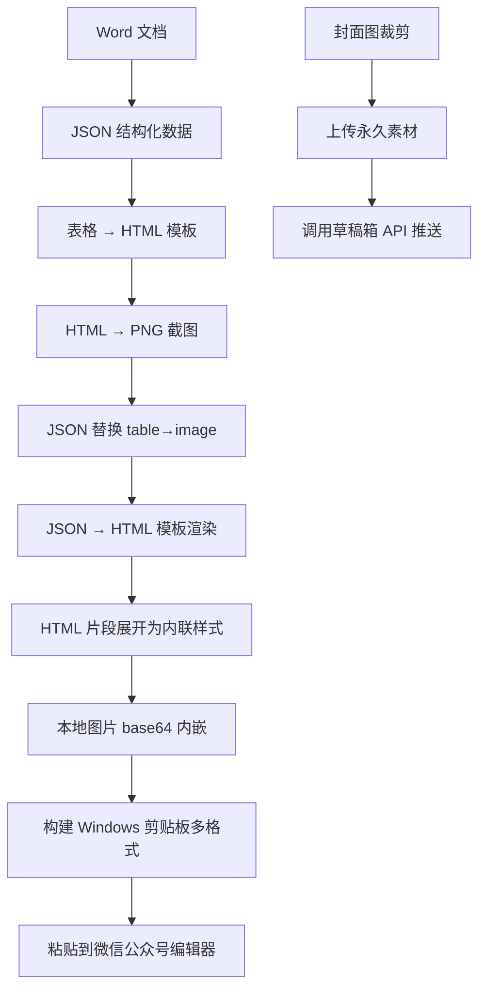
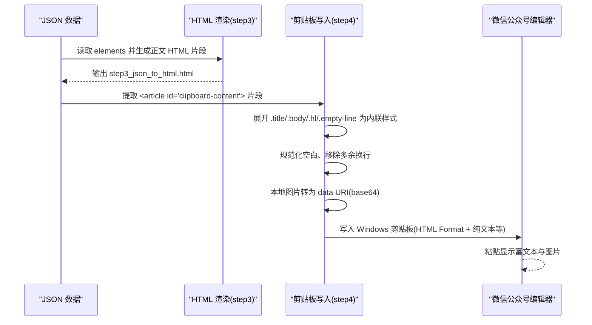
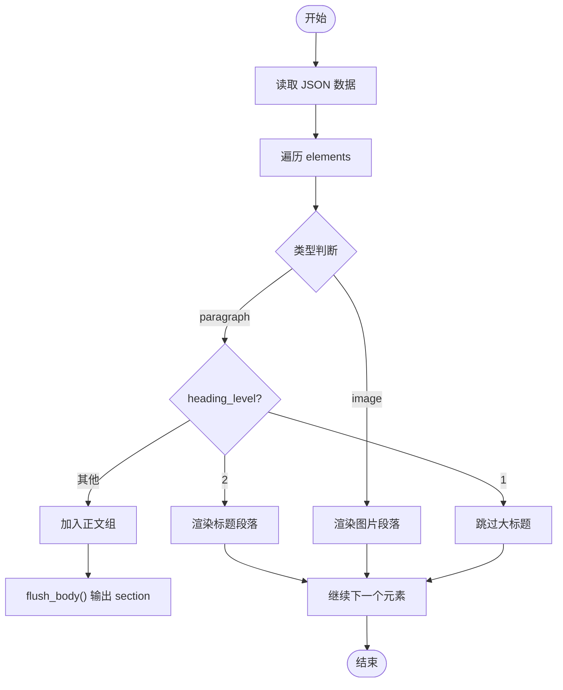
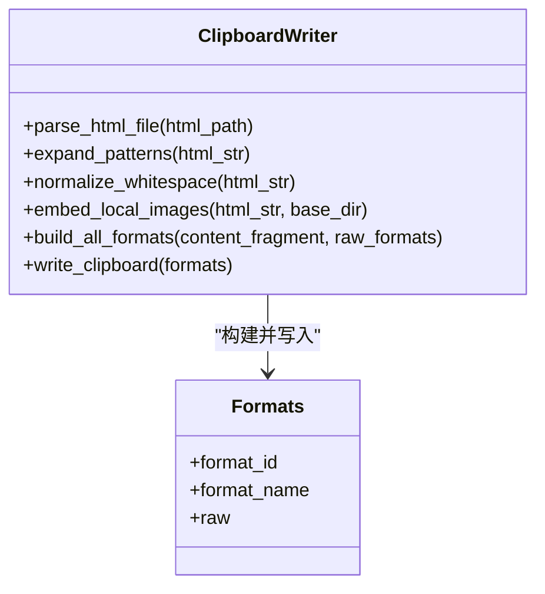
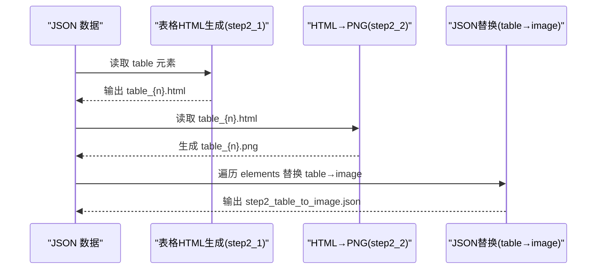
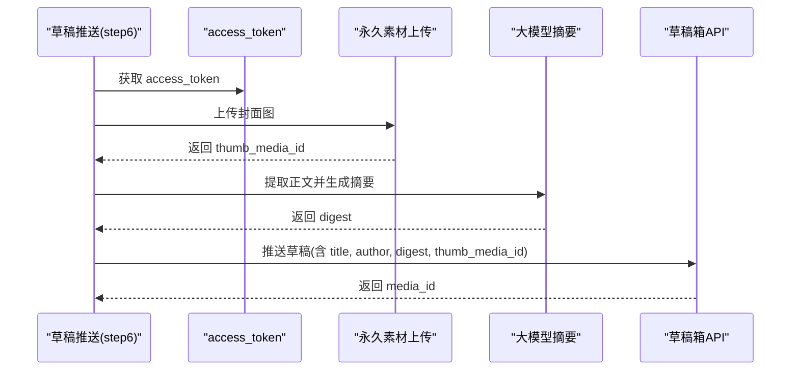
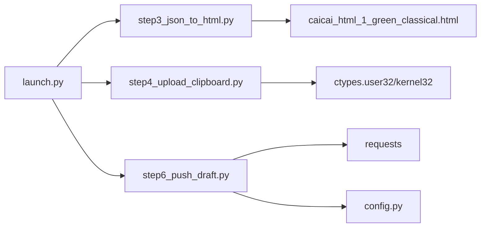
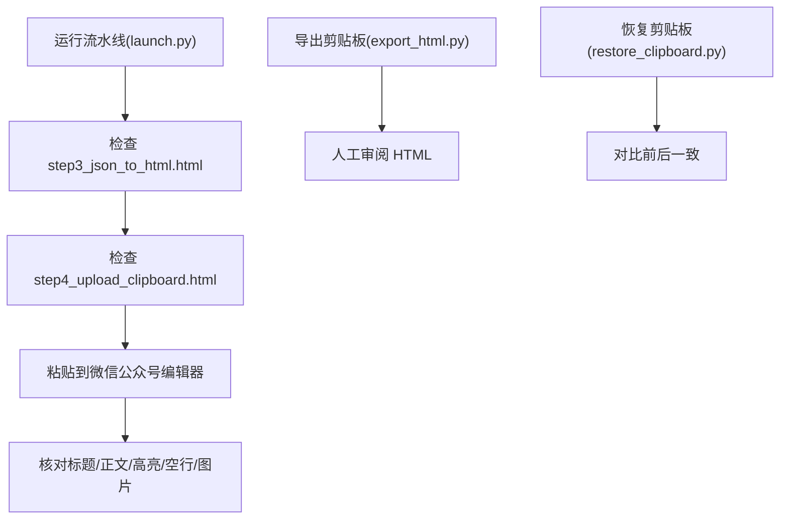

# 微信公众号兼容性

<cite>
**本文引用的文件列表**
- [config.py](file://config.py)
- [launch.py](file://launch.py)
- [step3_json_to_html.py](file://step3_json_to_html.py)
- [step4_upload_clipboard.py](file://step4_upload_clipboard.py)
- [step6_push_draft.py](file://step6_push_draft.py)
- [caicai_html_1_green_classical.html](file://html_template/caicai_html_1_green_classical.html)
- [caicai_html_1_green_table.html](file://html_template/caicai_html_1_green_table.html)
- [step2_1_table_to_html.py](file://step2_1_table_to_html.py)
- [step2_2_html_to_image.py](file://step2_2_html_to_image.py)
- [export_html.py](file://board_history/export_html.py)
- [restore_clipboard.py](file://board_history/restore_clipboard.py)
</cite>

## 目录
1. [引言](#引言)
2. [项目结构](#项目结构)
3. [核心组件](#核心组件)
4. [架构总览](#架构总览)
5. [详细组件分析](#详细组件分析)
6. [依赖关系分析](#依赖关系分析)
7. [性能与体积考量](#性能与体积考量)
8. [测试与验证方法](#测试与验证方法)
9. [常见问题排查](#常见问题排查)
10. [结论](#结论)

## 引言
本技术文档聚焦于“微信公众号编辑器”的 HTML/CSS 兼容性与安全策略，结合仓库中的内容生成与剪贴板写入流程，系统梳理：
- 支持的标签、属性与样式（以内联样式为主）
- 脚本禁用与外部资源加载限制的处理方式
- 图片路径格式、尺寸限制与内嵌策略
- 剪贴板复制时的多格式兼容与富文本保留机制
- 可复用的测试方法与验证工具
- 常见问题的定位与修复建议

## 项目结构
本项目通过流水线将 Word 文档转换为可在微信公众号编辑器中粘贴的富文本内容，并支持自动推送草稿。关键步骤包括：
- JSON 渲染为 HTML 模板
- 表格转 HTML 再截图为 PNG
- 将 HTML 片段展开为微信剪贴板所需的内联样式与多格式数据
- 本地图片 base64 内嵌，确保粘贴后图片可见
- 可选地调用公众号 API 创建草稿

图表来源
- [launch.py:42-193](file://launch.py#L42-L193)
- [step3_json_to_html.py:121-149](file://step3_json_to_html.py#L121-L149)
- [step2_1_table_to_html.py:74-125](file://step2_1_table_to_html.py#L74-L125)
- [step2_2_html_to_image.py:120-218](file://step2_2_html_to_image.py#L120-L218)
- [step4_upload_clipboard.py:436-479](file://step4_upload_clipboard.py#L436-L479)
- [step6_push_draft.py:276-404](file://step6_push_draft.py#L276-L404)

章节来源
- [launch.py:1-201](file://launch.py#L1-L201)

## 核心组件
- 模板渲染器：将 JSON 元素渲染为 HTML 片段，并注入到文章模板占位符中
- 剪贴板写入器：解析 HTML 片段，展开类名为内联样式，规范化空白，内嵌图片，构建 Windows 剪贴板多格式数据
- 表格处理：表格 HTML 生成与截图为 PNG，并在 JSON 中将 table 元素替换为 image 引用
- 草稿推送：获取 access_token，上传封面图，生成摘要，调用草稿箱 API

章节来源
- [step3_json_to_html.py:1-149](file://step3_json_to_html.py#L1-L149)
- [step4_upload_clipboard.py:1-480](file://step4_upload_clipboard.py#L1-L480)
- [step2_1_table_to_html.py:1-125](file://step2_1_table_to_html.py#L1-L125)
- [step2_2_html_to_image.py:1-218](file://step2_2_html_to_image.py#L1-L218)
- [step6_push_draft.py:1-404](file://step6_push_draft.py#L1-L404)

## 架构总览
下图展示了从 JSON 到微信公众号编辑器的完整数据流与关键转换点。

图表来源
- [step3_json_to_html.py:84-116](file://step3_json_to_html.py#L84-L116)
- [step4_upload_clipboard.py:115-223](file://step4_upload_clipboard.py#L115-L223)
- [step4_upload_clipboard.py:288-366](file://step4_upload_clipboard.py#L288-L366)

## 详细组件分析

### 组件A：HTML 渲染与模板注入（step3_json_to_html.py）
- 渲染规则
  - heading_level=1 的大标题不渲染到正文区
  - heading_level=2 的小标题渲染为带样式的段落
  - 连续正文段落合并到一个 section，每段使用 body 样式
  - bold run 渲染为高亮 span
  - image 元素居中展示，设置最大宽度
- 模板
  - 使用 caicai_html_1_green_classical.html 作为页面模板，将 {{BODY_PLACEHOLDER}} 替换为生成的正文片段

图表来源
- [step3_json_to_html.py:84-116](file://step3_json_to_html.py#L84-L116)
- [step3_json_to_html.py:38-79](file://step3_json_to_html.py#L38-L79)

章节来源
- [step3_json_to_html.py:1-149](file://step3_json_to_html.py#L1-L149)
- [caicai_html_1_green_classical.html:1-278](file://html_template/caicai_html_1_green_classical.html#L1-L278)

### 组件B：剪贴板写入与富文本保留（step4_upload_clipboard.py）
- 解析 HTML 片段
  - 从 article#clipboard-content 中提取内容
  - 若存在 cb-raw-data 则复用原始二进制格式，否则重新生成
- 展开简化类名
  - .title → 外层 section + p + strong 的内联样式
  - .body → p 的内联样式（white-space、margin、padding、box-sizing）
  - .empty-line → br 的内联样式
  - .hl(span) → 绿色背景 + strong 的内联样式
- 规范化空白
  - 去除标签间换行与缩进，保证剪贴板格式稳定
- 图片内嵌
  - 将本地路径的图片转为 data:image/*;base64, 形式，避免外部路径不可用
- 构建剪贴板格式
  - HTML Format（Windows 专用）
  - CF_UNICODETEXT / CF_TEXT / CF_OEMTEXT（纯文本）
  - CF_LOCALE（语言环境）
  - 其他 Chromium 内部格式（如有）

图表来源
- [step4_upload_clipboard.py:72-109](file://step4_upload_clipboard.py#L72-L109)
- [step4_upload_clipboard.py:115-172](file://step4_upload_clipboard.py#L115-L172)
- [step4_upload_clipboard.py:175-188](file://step4_upload_clipboard.py#L175-L188)
- [step4_upload_clipboard.py:194-223](file://step4_upload_clipboard.py#L194-L223)
- [step4_upload_clipboard.py:288-366](file://step4_upload_clipboard.py#L288-L366)
- [step4_upload_clipboard.py:371-431](file://step4_upload_clipboard.py#L371-L431)

章节来源
- [step4_upload_clipboard.py:1-480](file://step4_upload_clipboard.py#L1-L480)

### 组件C：表格处理与截图（step2_1_table_to_html.py、step2_2_html_to_image.py）
- 表格 HTML 生成
  - 读取 JSON 中的 table 元素，按模板生成独立 HTML 文件
  - 表头使用 thead，表体使用 tbody，首行作为表头
- HTML → PNG 截图
  - 使用 Selenium + Chrome 无头模式截图，设置高清缩放与窗口位置
  - 超时保护：超过阈值强制终止 Chrome 进程
- JSON 替换
  - 将 table 元素替换为 image 引用，image_path 指向 process/table/table_n.png

图表来源
- [step2_1_table_to_html.py:39-68](file://step2_1_table_to_html.py#L39-L68)
- [step2_1_table_to_html.py:74-125](file://step2_1_table_to_html.py#L74-L125)
- [step2_2_html_to_image.py:40-101](file://step2_2_html_to_image.py#L40-L101)
- [step2_2_html_to_image.py:175-211](file://step2_2_html_to_image.py#L175-L211)

章节来源
- [step2_1_table_to_html.py:1-125](file://step2_1_table_to_html.py#L1-L125)
- [step2_2_html_to_image.py:1-218](file://step2_2_html_to_image.py#L1-L218)
- [caicai_html_1_green_table.html:1-81](file://html_template/caicai_html_1_green_table.html#L1-L81)

### 组件D：草稿推送（step6_push_draft.py）
- 获取 access_token
- 上传封面图（永久素材），返回 media_id
- 从 JSON 提取标题与正文，调用大模型生成摘要金句
- 调用草稿箱 API 新增草稿

图表来源
- [step6_push_draft.py:42-56](file://step6_push_draft.py#L42-L56)
- [step6_push_draft.py:62-79](file://step6_push_draft.py#L62-L79)
- [step6_push_draft.py:105-127](file://step6_push_draft.py#L105-L127)
- [step6_push_draft.py:146-182](file://step6_push_draft.py#L146-L182)
- [step6_push_draft.py:252-270](file://step6_push_draft.py#L252-L270)

章节来源
- [step6_push_draft.py:1-404](file://step6_push_draft.py#L1-L404)
- [config.py:28-39](file://config.py#L28-L39)

## 依赖关系分析
- 模块耦合
  - launch.py 串联各步骤，控制执行顺序与跳过标志
  - step3 依赖模板文件；step4 依赖 step3 的输出；step6 依赖 config 配置
- 外部依赖
  - requests 用于 HTTP 请求（草稿推送、封面上传）
  - selenium + Chrome 用于 HTML 截图
  - ctypes 调用 Windows API 写剪贴板

图表来源
- [launch.py:42-193](file://launch.py#L42-L193)
- [step3_json_to_html.py:121-149](file://step3_json_to_html.py#L121-L149)
- [step4_upload_clipboard.py:35-56](file://step4_upload_clipboard.py#L35-L56)
- [step6_push_draft.py:25-36](file://step6_push_draft.py#L25-L36)

章节来源
- [launch.py:1-201](file://launch.py#L1-L201)
- [config.py:1-39](file://config.py#L1-L39)

## 性能与体积考量
- 图片内嵌体积
  - 本地图片转为 base64 会显著增大 HTML 体积，影响剪贴板大小与粘贴速度
  - 建议在批量或长文场景下评估图片压缩与分辨率
- 剪贴板格式数量
  - 同时写入多种格式（HTML、UnicodeText、Text、OEMText、Locale 等）会增加内存占用与写入时间
- 截图耗时
  - 表格截图依赖 Chrome 启动与渲染，需考虑超时与进程清理

[本节为通用指导，无需具体文件引用]

## 测试与验证方法

### 目标
确保生成的 HTML 在微信公众号编辑器中正确显示，且富文本与图片粘贴后保持结构与样式。

### 推荐流程
- 运行流水线
  - 使用 launch.py 一键执行，或在需要时单独运行 step3/step4/step6
- 检查中间产物
  - 查看 step3_json_to_html.html 的结构与样式
  - 查看 step4_upload_clipboard.html（内联样式版本）
  - 查看 process/table/*.png 是否生成
- 剪贴板还原与对比
  - 使用 board_history/export_html.py 导出剪贴板数据为 HTML，便于人工审阅
  - 使用 board_history/restore_clipboard.py 将保存的数据恢复至剪贴板，进行一致性校验

图表来源
- [launch.py:42-193](file://launch.py#L42-L193)
- [export_html.py:466-516](file://board_history/export_html.py#L466-L516)
- [restore_clipboard.py:81-152](file://board_history/restore_clipboard.py#L81-L152)

章节来源
- [export_html.py:1-516](file://board_history/export_html.py#L1-L516)
- [restore_clipboard.py:1-159](file://board_history/restore_clipboard.py#L1-L159)

## 常见问题排查

- 图片未显示
  - 原因：本地路径无法被编辑器访问
  - 解决：确保 step4 已将本地图片转为 data URI；如仍失败，检查图片路径与扩展名映射
  - 参考实现：图片内嵌逻辑
    - [step4_upload_clipboard.py:194-223](file://step4_upload_clipboard.py#L194-L223)

- 样式丢失或错乱
  - 原因：类名未被展开或空白不规范
  - 解决：确认 expand_patterns 与 normalize_whitespace 已执行；检查 .title/.body/.hl/.empty-line 的匹配规则
  - 参考实现：
    - [step4_upload_clipboard.py:115-172](file://step4_upload_clipboard.py#L115-L172)
    - [step4_upload_clipboard.py:175-188](file://step4_upload_clipboard.py#L175-L188)

- 表格错位或高度不一致
  - 原因：截图前 CSS 布局差异或行高计算问题
  - 解决：检查表格模板样式与行高同步脚本；必要时调整 force-device-scale-factor 与窗口尺寸
  - 参考实现：
    - [caicai_html_1_green_table.html:1-81](file://html_template/caicai_html_1_green_table.html#L1-L81)
    - [step2_2_html_to_image.py:40-101](file://step2_2_html_to_image.py#L40-L101)

- 剪贴板粘贴后纯文本异常
  - 原因：CF_UNICODETEXT/CF_TEXT 编码或换行分隔不符合预期
  - 解决：检查 extract_plain_text 的换行与实体解码逻辑
  - 参考实现：
    - [step4_upload_clipboard.py:271-285](file://step4_upload_clipboard.py#L271-L285)

- 草稿推送失败
  - 原因：access_token 获取失败、封面图缺失、字段长度超限
  - 解决：检查 config 配置、封面图是否存在、标题与摘要长度限制
  - 参考实现：
    - [step6_push_draft.py:42-56](file://step6_push_draft.py#L42-L56)
    - [step6_push_draft.py:105-127](file://step6_push_draft.py#L105-L127)
    - [config.py:28-39](file://config.py#L28-L39)

章节来源
- [step4_upload_clipboard.py:115-223](file://step4_upload_clipboard.py#L115-L223)
- [step2_2_html_to_image.py:40-101](file://step2_2_html_to_image.py#L40-L101)
- [step6_push_draft.py:42-127](file://step6_push_draft.py#L42-L127)
- [config.py:28-39](file://config.py#L28-L39)

## 结论
本项目通过“JSON→HTML→剪贴板”的流水线，实现了微信公众号编辑器对富文本与图片的稳定粘贴。其兼容性要点在于：
- 使用内联样式与标准标签，避免外部 CSS/JS 依赖
- 将本地图片转为 data URI，规避外部资源加载限制
- 构建 Windows 剪贴板多格式，提升跨应用粘贴兼容性
- 提供导出与恢复工具，便于人工审阅与回归测试

遵循上述策略与测试流程，可显著提升在微信公众号编辑器中的显示一致性与稳定性。