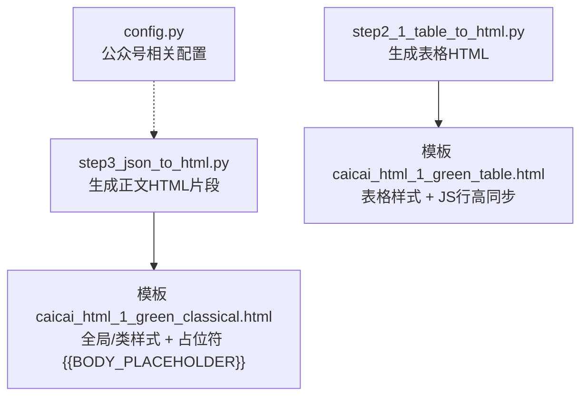
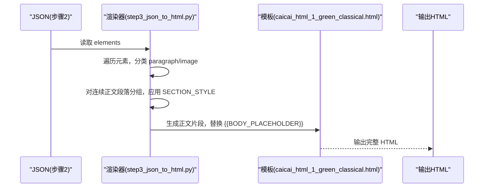
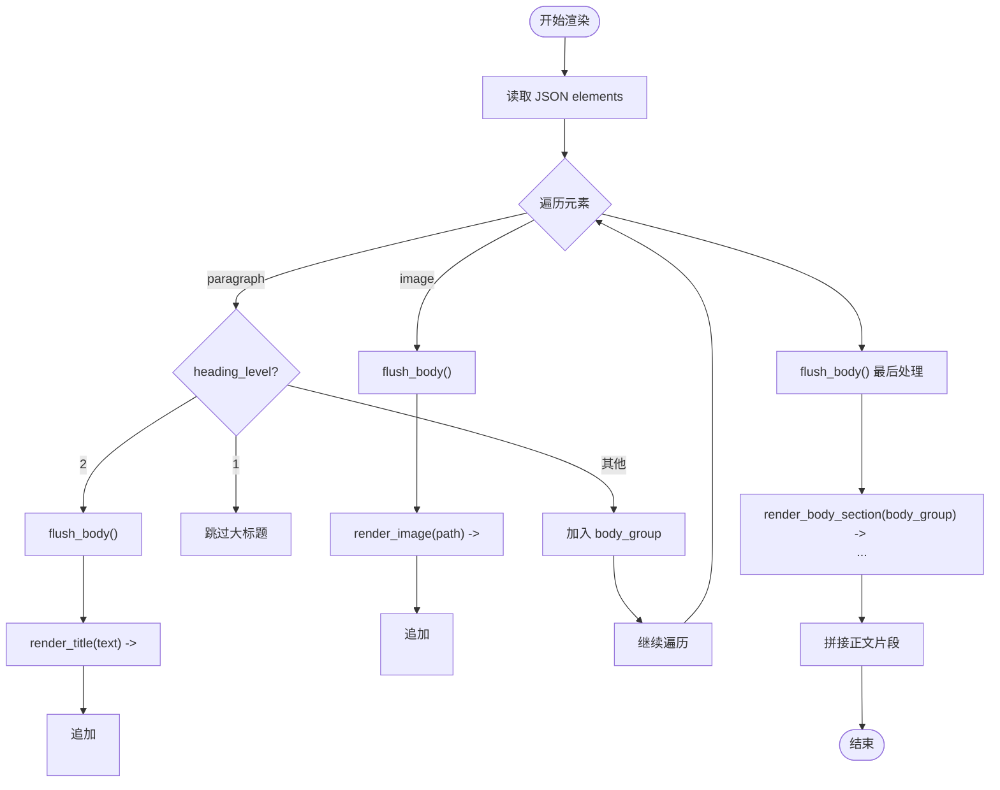
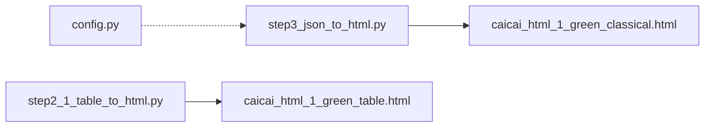

# 样式处理机制

<cite>
**本文引用的文件**   
- [step3_json_to_html.py](file://step3_json_to_html.py)
- [caicai_html_1_green_classical.html](file://html_template/caicai_html_1_green_classical.html)
- [caicai_html_1_green_table.html](file://html_template/caicai_html_1_green_table.html)
- [step2_1_table_to_html.py](file://step2_1_table_to_html.py)
- [config.py](file://config.py)
</cite>

## 目录
1. [简介](#简介)
2. [项目结构](#项目结构)
3. [核心组件](#核心组件)
4. [架构总览](#架构总览)
5. [详细组件分析](#详细组件分析)
6. [依赖关系分析](#依赖关系分析)
7. [性能与兼容性考量](#性能与兼容性考量)
8. [故障排查指南](#故障排查指南)
9. [结论](#结论)
10. [附录：主题定制与适配示例](#附录主题定制与适配示例)

## 简介
本技术文档聚焦于“样式处理机制”，围绕微信公众号生态下的 HTML 输出，系统说明以下内容：
- 内联样式的统一策略：通过 SECTION_STYLE 在正文段落容器上集中注入字体、行高、字间距等基础排版参数。
- 元素级特定样式：标题、正文、图片、空行分隔、表格等的具体样式定义与渲染规则。
- 微信公众号兼容性与限制：针对微信内置浏览器的 CSS 支持现状，采用内联样式与稳定属性组合，规避不兼容特性。
- 样式继承与优先级：模板类选择器与内联样式的叠加关系，以及如何在不同层级进行覆盖。
- 图片居中、标题样式、正文段落的映射规则：从 JSON 到 HTML 的渲染路径与样式落点。
- 响应式设计与移动端优化：基于 max-width、相对单位与内联约束的自适应方案。
- 主题定制与多场景适配：如何替换模板、调整配色与字号，以适配不同显示需求。

## 项目结构
本项目将“样式”分为两类：
- 模板层样式：位于 html_template 目录，提供全局样式、类样式与页面布局。
- 生成层样式：由 step3_json_to_html.py 在渲染时注入的内联样式（如 SECTION_STYLE），用于保证跨环境一致性。

图表来源
- [step3_json_to_html.py:1-149](file://step3_json_to_html.py#L1-L149)
- [caicai_html_1_green_classical.html:1-278](file://html_template/caicai_html_1_green_classical.html#L1-L278)
- [step2_1_table_to_html.py:1-125](file://step2_1_table_to_html.py#L1-L125)
- [caicai_html_1_green_table.html:1-81](file://html_template/caicai_html_1_green_table.html#L1-L81)
- [config.py:1-39](file://config.py#L1-L39)

章节来源
- [step3_json_to_html.py:1-149](file://step3_json_to_html.py#L1-L149)
- [caicai_html_1_green_classical.html:1-278](file://html_template/caicai_html_1_green_classical.html#L1-L278)
- [step2_1_table_to_html.py:1-125](file://step2_1_table_to_html.py#L1-L125)
- [caicai_html_1_green_table.html:1-81](file://html_template/caicai_html_1_green_table.html#L1-L81)
- [config.py:1-39](file://config.py#L1-L39)

## 核心组件
- 正文渲染器（step3_json_to_html.py）
  - 负责将 JSON 中的段落、标题、图片转换为 HTML 片段，并插入模板占位符。
  - 使用 SECTION_STYLE 为每个正文 section 注入统一的字体大小、行高、字间距与盒模型设置。
  - 标题渲染为 class="title" 的 p 标签；正文段落渲染为 class="body" 的 p 标签；加粗 run 渲染为 class="hl" 的 span。
  - 图片渲染为居中的 img，外层包裹 p 并使用 text-align:center 与 max-width 控制尺寸。
- 模板（caicai_html_1_green_classical.html）
  - 定义全局 body 样式、内容区域容器、类样式 .title/.body/.empty-line/.hl 等。
  - 提供占位符 {{BODY_PLACEHOLDER}} 供正文渲染器替换。
- 表格渲染器（step2_1_table_to_html.py）
  - 读取 JSON 中的表格数据，生成 <table><thead><tbody> 结构。
  - 使用模板 caicai_html_1_green_table.html 的表格样式，并通过脚本实现 tbody 行高同步。
- 配置（config.py）
  - 包含微信公众号相关常量（AppID、Secret、API 基址等），虽不直接参与样式，但影响最终发布流程。

章节来源
- [step3_json_to_html.py:31-78](file://step3_json_to_html.py#L31-L78)
- [caicai_html_1_green_classical.html:85-138](file://html_template/caicai_html_1_green_classical.html#L85-L138)
- [step2_1_table_to_html.py:39-68](file://step2_1_table_to_html.py#L39-L68)
- [caicai_html_1_green_table.html:16-56](file://html_template/caicai_html_1_green_table.html#L16-L56)
- [config.py:26-39](file://config.py#L26-L39)

## 架构总览
整体样式处理遵循“模板类样式 + 生成期内联样式”的双层策略：
- 模板层：提供稳定的视觉基线与可复用的类样式，确保在不同文章间保持一致性。
- 生成层：在渲染阶段按元素类型注入内联样式，避免外部样式表或复杂选择器带来的兼容性问题。

图表来源
- [step3_json_to_html.py:84-115](file://step3_json_to_html.py#L84-L115)
- [caicai_html_1_green_classical.html:207-209](file://html_template/caicai_html_1_green_classical.html#L207-L209)

## 详细组件分析

### 正文渲染器与 SECTION_STYLE 策略
- 统一样式注入
  - 每个正文 section 通过 style 属性注入 SECTION_STYLE，包含 font-size、line-height、letter-spacing、box-sizing 等关键排版属性。
  - 该策略确保在微信环境中，即使外部样式被裁剪或覆盖，基础阅读体验仍稳定。
- 段落与标题映射
  - heading_level=2 的段落渲染为 class="title" 的 p 标签，配合模板中 .title 的字号、加粗与居中。
  - 普通段落渲染为 class="body" 的 p 标签，配合模板中 .body 的字号、行高、字间距与两端对齐。
  - 加粗 run 渲染为 class="hl" 的 span，配合模板中 .hl 的背景色与加粗。
- 图片居中
  - 图片外层 p 使用 text-align:center，img 使用 max-width 与 vertical-align:middle，确保在不同宽度下居中且比例可控。
- 空行分隔
  - 每段后追加 class="empty-line" 的 p 标签，内部仅含  ，用于在微信中产生稳定的行距。

图表来源
- [step3_json_to_html.py:84-115](file://step3_json_to_html.py#L84-L115)
- [step3_json_to_html.py:50-78](file://step3_json_to_html.py#L50-L78)

章节来源
- [step3_json_to_html.py:31-78](file://step3_json_to_html.py#L31-L78)
- [step3_json_to_html.py:84-115](file://step3_json_to_html.py#L84-L115)

### 模板样式与类定义
- 全局样式
  - body 设置最大宽度、边距、背景与颜色，确保在桌面与移动端均有良好表现。
- 类样式
  - .title：字号较大、加粗、居中，适合二级标题。
  - .body：字号适中、行高宽松、字间距微调、两端对齐，提升可读性。
  - .empty-line：高度固定为 1em，作为段落间的稳定分隔。
  - .hl：浅绿背景与加粗，突出强调文本。
- 占位符
  - {{BODY_PLACEHOLDER}} 由渲染器替换为生成的正文片段。

章节来源
- [caicai_html_1_green_classical.html:15-138](file://html_template/caicai_html_1_green_classical.html#L15-L138)
- [caicai_html_1_green_classical.html:207-209](file://html_template/caicai_html_1_green_classical.html#L207-L209)

### 表格样式与行高同步
- 表格模板
  - 表头 th 使用主题色背景与白色文字，表体 td 使用边框与交替行背景。
  - 单元格 bold 类用于加粗关键信息。
- 行高同步脚本
  - 页面加载后计算 tbody 各行自然高度，取最大值并统一设置所有行的 height，确保表格行高一致。

章节来源
- [step2_1_table_to_html.py:39-68](file://step2_1_table_to_html.py#L39-L68)
- [caicai_html_1_green_table.html:16-56](file://html_template/caicai_html_1_green_table.html#L16-L56)
- [caicai_html_1_green_table.html:64-78](file://html_template/caicai_html_1_green_table.html#L64-L78)

### 微信公众号兼容性与限制
- 内联优先
  - 正文 section 使用 style 属性注入 SECTION_STYLE，避免依赖外部样式表或复杂选择器，提高在微信环境中的稳定性。
- 支持的属性
  - 字体大小、行高、字间距、文本对齐、盒模型（box-sizing）、背景色、边框、内外边距等常用属性均被广泛支持。
- 字体与字号
  - 模板 body 指定了微软雅黑与苹方等常见中文字体族；正文使用 18px 字号，标题使用 24px，兼顾可读性与版面紧凑。
- 行高与字间距
  - 正文行高设置为 2，字间距 1px，提升中文阅读的呼吸感与清晰度。
- 图片与布局
  - 图片使用 max-width 与 text-align:center 实现居中与自适应缩放，避免溢出与错位。
- 已知限制与规避
  - 避免使用复杂的 CSS 动画、滤镜、变量与高级选择器；尽量使用稳定属性与内联样式。
  - 表格行高差异通过脚本同步，规避微信渲染差异导致的行高不一致。

章节来源
- [step3_json_to_html.py:31-78](file://step3_json_to_html.py#L31-L78)
- [caicai_html_1_green_classical.html:15-138](file://html_template/caicai_html_1_green_classical.html#L15-L138)
- [caicai_html_1_green_table.html:64-78](file://html_template/caicai_html_1_green_table.html#L64-L78)

### 样式继承与优先级
- 继承链
  - body 的全局样式会被 .title/.body/.hl 等类样式覆盖；section 的内联样式会进一步覆盖类样式中的对应属性。
- 优先级顺序
  - 内联样式 > 类样式 > 全局样式。因此，SECTION_STYLE 能确保正文的基础排版不被模板类样式干扰。
- 覆盖建议
  - 如需局部调整，建议在渲染函数中增加可选参数，动态拼接 style 字符串，保持内联优先的策略。

章节来源
- [step3_json_to_html.py:50-78](file://step3_json_to_html.py#L50-L78)
- [caicai_html_1_green_classical.html:85-138](file://html_template/caicai_html_1_green_classical.html#L85-L138)

### 图片居中、标题与正文映射规则
- 图片居中
  - 外层 p 使用 text-align:center，img 使用 max-width 与 vertical-align:middle，确保居中与比例控制。
- 标题映射
  - heading_level=2 → 
，模板中 .title 定义字号、加粗与居中。
- 正文映射
  - 普通段落 → 
，模板中 .body 定义字号、行高、字间距与两端对齐。
- 空行分隔
  - 每段后追加 
 
，提供稳定的行距。

章节来源
- [step3_json_to_html.py:63-78](file://step3_json_to_html.py#L63-L78)
- [caicai_html_1_green_classical.html:97-127](file://html_template/caicai_html_1_green_classical.html#L97-L127)

## 依赖关系分析
- 渲染器依赖模板
  - step3_json_to_html.py 依赖 caicai_html_1_green_classical.html 的占位符与类样式。
- 表格渲染器独立
  - step2_1_table_to_html.py 生成独立的表格 HTML，依赖 caicai_html_1_green_table.html 的表格样式与脚本。
- 配置项
  - config.py 提供公众号相关常量，虽不直接参与样式，但与后续推送流程相关。

图表来源
- [step3_json_to_html.py:1-149](file://step3_json_to_html.py#L1-L149)
- [caicai_html_1_green_classical.html:1-278](file://html_template/caicai_html_1_green_classical.html#L1-L278)
- [step2_1_table_to_html.py:1-125](file://step2_1_table_to_html.py#L1-L125)
- [caicai_html_1_green_table.html:1-81](file://html_template/caicai_html_1_green_table.html#L1-L81)
- [config.py:1-39](file://config.py#L1-L39)

章节来源
- [step3_json_to_html.py:1-149](file://step3_json_to_html.py#L1-L149)
- [step2_1_table_to_html.py:1-125](file://step2_1_table_to_html.py#L1-L125)
- [caicai_html_1_green_classical.html:1-278](file://html_template/caicai_html_1_green_classical.html#L1-L278)
- [caicai_html_1_green_table.html:1-81](file://html_template/caicai_html_1_green_table.html#L1-L81)
- [config.py:1-39](file://config.py#L1-L39)

## 性能与兼容性考量
- 内联样式减少样式解析开销，有利于在微信环境中快速渲染。
- 使用相对单位与 max-width 提升响应式能力，避免固定宽度导致的横向滚动。
- 表格行高同步脚本仅在页面加载后执行一次，对性能影响有限。
- 避免复杂 CSS 特性，降低渲染失败风险。

[本节为通用指导，无需引用具体文件]

## 故障排查指南
- 正文样式未生效
  - 检查 SECTION_STYLE 是否成功注入到 section 的 style 属性。
  - 确认模板中 .body/.title/.hl 类是否存在且未被覆盖。
- 图片未居中或溢出
  - 检查外层 p 的 text-align:center 与 img 的 max-width 是否正确设置。
- 表格行高不一致
  - 确认 caicai_html_1_green_table.html 的行高同步脚本是否执行。
- 标题未渲染
  - 检查 heading_level=2 的段落是否被正确识别并渲染为 class="title"。

章节来源
- [step3_json_to_html.py:50-78](file://step3_json_to_html.py#L50-L78)
- [caicai_html_1_green_table.html:64-78](file://html_template/caicai_html_1_green_table.html#L64-L78)

## 结论
本项目通过“模板类样式 + 生成期内联样式”的双层策略，实现了在微信公众号环境下稳定一致的样式呈现。SECTION_STYLE 的统一注入确保了正文排版的基线稳定，而模板类样式提供了灵活的视觉扩展点。表格与图片的样式处理充分考虑了微信环境的限制与差异，并通过脚本与内联约束提升了兼容性。整体方案具备良好的可维护性与可扩展性，便于后续主题定制与多场景适配。

[本节为总结，无需引用具体文件]

## 附录：主题定制与适配示例
- 更换主题色
  - 修改模板中 .hl 的背景色与 .title/.body 的颜色，即可切换强调色与主色调。
- 调整字号与行高
  - 在 SECTION_STYLE 中调整 font-size 与 line-height，或在模板 .body 中修改对应属性，以适应不同阅读偏好。
- 自定义标题样式
  - 在模板中扩展 .title 的样式（如添加下划线、阴影等），注意避免使用微信不支持的属性。
- 适配窄屏设备
  - 使用 max-width 与相对单位，确保在小屏设备上自动换行与合理留白。
- 新增段落样式类
  - 在模板中添加新的类（如 .note/.quote），并在渲染器中按需应用，保持内联优先的策略。

[本节为概念性指导，无需引用具体文件]