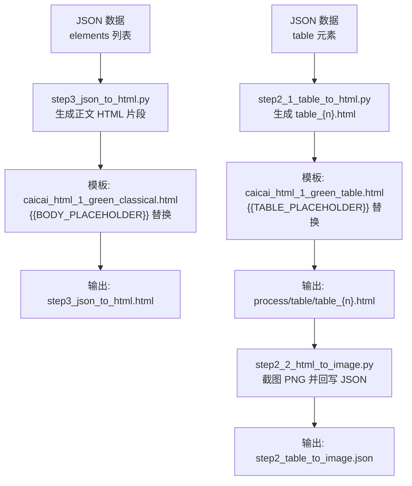
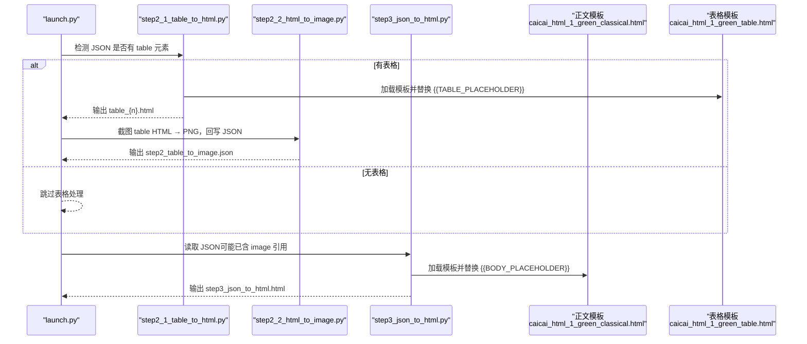
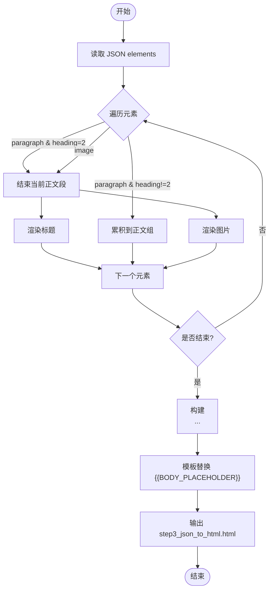
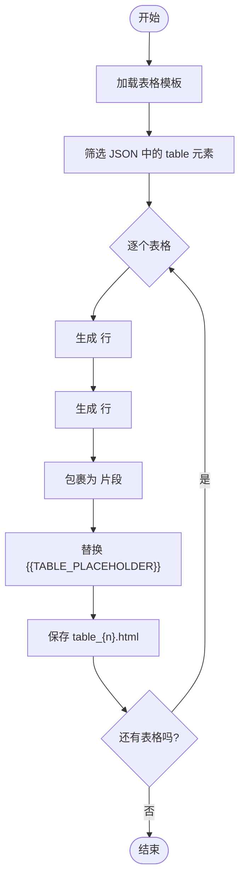
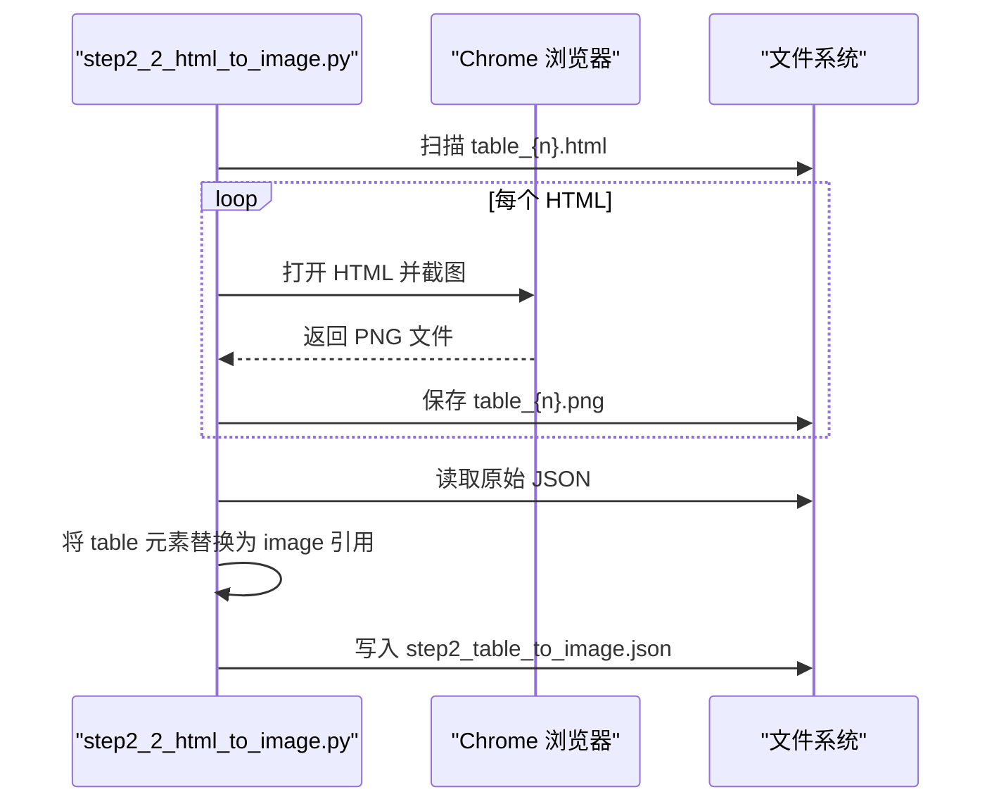
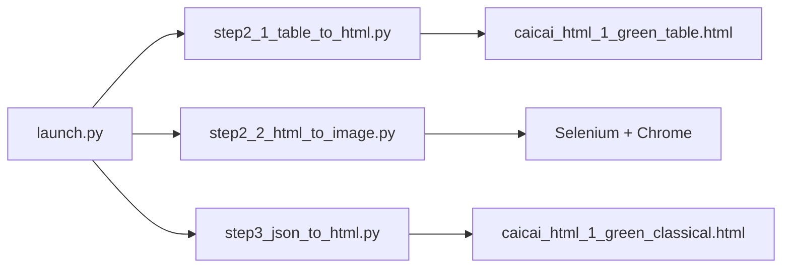

# 模板系统架构

<cite>
**本文引用的文件**   
- [config.py](file://config.py)
- [launch.py](file://launch.py)
- [step3_json_to_html.py](file://step3_json_to_html.py)
- [step2_1_table_to_html.py](file://step2_1_table_to_html.py)
- [step2_2_html_to_image.py](file://step2_2_html_to_image.py)
- [caicai_html_1_green_classical.html](file://html_template/caicai_html_1_green_classical.html)
- [caicai_html_1_green_table.html](file://html_template/caicai_html_1_green_table.html)
</cite>

## 目录
1. [简介](#简介)
2. [项目结构](#项目结构)
3. [核心组件](#核心组件)
4. [架构总览](#架构总览)
5. [详细组件分析](#详细组件分析)
6. [依赖关系分析](#依赖关系分析)
7. [性能与兼容性考量](#性能与兼容性考量)
8. [故障排查指南](#故障排查指南)
9. [结论](#结论)
10. [附录：自定义与扩展模板](#附录自定义与扩展模板)

## 简介
本技术文档聚焦于“模板系统架构”，围绕 HTML 模板文件的设计结构与占位符机制，深入解释正文模板中的 {{BODY_PLACEHOLDER}} 的工作原理与替换流程，并说明表格模板的 {{TABLE_PLACEHOLDER}} 机制。文档同时覆盖模板的组织方式、CSS 样式定义与布局结构，提供如何自定义和扩展模板（添加新样式类、修改布局、适配不同微信公众号主题）的具体步骤与最佳实践，并通过示例展示如何创建新模板并将其集成到渲染引擎中。

## 项目结构
模板系统由“渲染脚本 + HTML 模板”两部分组成：
- 渲染脚本负责将 JSON 数据转换为 HTML 片段，并在模板中进行占位符替换，输出最终可发布的 HTML。
- HTML 模板包含完整的页面结构、内联 CSS 以及占位符位置，用于承载渲染结果。

图表来源
- [step3_json_to_html.py:121-149](file://step3_json_to_html.py#L121-L149)
- [caicai_html_1_green_classical.html:207-209](file://html_template/caicai_html_1_green_classical.html#L207-L209)
- [step2_1_table_to_html.py:74-125](file://step2_1_table_to_html.py#L74-L125)
- [caicai_html_1_green_table.html:59-62](file://html_template/caicai_html_1_green_table.html#L59-L62)
- [step2_2_html_to_image.py:120-218](file://step2_2_html_to_image.py#L120-L218)

章节来源
- [launch.py:42-201](file://launch.py#L42-L201)
- [step3_json_to_html.py:1-149](file://step3_json_to_html.py#L1-149)
- [step2_1_table_to_html.py:1-125](file://step2_1_table_to_html.py#L1-125)
- [step2_2_html_to_image.py:1-218](file://step2_2_html_to_image.py#L1-218)
- [caicai_html_1_green_classical.html:1-278](file://html_template/caicai_html_1_green_classical.html#L1-L278)
- [caicai_html_1_green_table.html:1-81](file://html_template/caicai_html_1_green_table.html#L1-L81)

## 核心组件
- 正文渲染器：读取 JSON elements，按规则生成段落、标题、图片等 HTML 片段，并将片段插入到正文模板的占位符处。
- 表格渲染器：从 JSON 中提取表格数据，生成独立 HTML 文件，使用表格模板的占位符进行替换。
- 表格转图与 JSON 回写：对表格 HTML 进行截图生成 PNG，并将 JSON 中的 table 元素替换为 image 引用，供后续正文渲染使用。
- 模板文件：
  - 正文模板：包含全局样式、内容区域与占位符 {{BODY_PLACEHOLDER}}。
  - 表格模板：包含表格样式与占位符 {{TABLE_PLACEHOLDER}}。

章节来源
- [step3_json_to_html.py:35-116](file://step3_json_to_html.py#L35-L116)
- [step2_1_table_to_html.py:33-68](file://step2_1_table_to_html.py#L33-L68)
- [step2_2_html_to_image.py:175-211](file://step2_2_html_to_image.py#L175-L211)
- [caicai_html_1_green_classical.html:173-278](file://html_template/caicai_html_1_green_classical.html#L173-L278)
- [caicai_html_1_green_table.html:58-81](file://html_template/caicai_html_1_green_table.html#L58-L81)

## 架构总览
整体流水线由编排脚本串联多个步骤，模板系统作为关键一环参与“JSON → HTML”的渲染阶段。

图表来源
- [launch.py:112-155](file://launch.py#L112-L155)
- [step2_1_table_to_html.py:74-125](file://step2_1_table_to_html.py#L74-L125)
- [step2_2_html_to_image.py:120-218](file://step2_2_html_to_image.py#L120-L218)
- [step3_json_to_html.py:121-149](file://step3_json_to_html.py#L121-L149)
- [caicai_html_1_green_table.html:59-62](file://html_template/caicai_html_1_green_table.html#L59-L62)
- [caicai_html_1_green_classical.html:207-209](file://html_template/caicai_html_1_green_classical.html#L207-L209)

## 详细组件分析

### 正文模板与占位符机制（{{BODY_PLACEHOLDER}}）
- 模板位置与结构
  - 正文模板位于 html_template 目录，包含全局样式、元信息栏、内容区域与占位符。
  - 占位符 {{BODY_PLACEHOLDER}} 位于 article#clipboard-content 内部，是正文内容的注入点。
- 渲染流程
  - 渲染器读取 JSON 的 elements 列表，按类型生成 HTML 片段：
    - heading_level=2 的小标题 → 

    - 普通段落 → <section style="...">
...
</section>
    - 加粗 run → 
    - 图片 → （居中）
  - 渲染器将生成的 body_html 字符串替换模板中的 {{BODY_PLACEHOLDER}}，输出完整 HTML。
- 样式约定
  - .title：大标题样式（字号、加粗、居中）
  - .body：正文样式（字号、行高、字距、两端对齐）
  - .empty-line：空行分隔
  - .hl：内联高亮（绿色背景 + 加粗）

图表来源
- [step3_json_to_html.py:84-116](file://step3_json_to_html.py#L84-L116)
- [step3_json_to_html.py:121-149](file://step3_json_to_html.py#L121-L149)
- [caicai_html_1_green_classical.html:207-209](file://html_template/caicai_html_1_green_classical.html#L207-L209)

章节来源
- [step3_json_to_html.py:35-116](file://step3_json_to_html.py#L35-L116)
- [step3_json_to_html.py:121-149](file://step3_json_to_html.py#L121-L149)
- [caicai_html_1_green_classical.html:85-138](file://html_template/caicai_html_1_green_classical.html#L85-L138)
- [caicai_html_1_green_classical.html:173-278](file://html_template/caicai_html_1_green_classical.html#L173-L278)

### 表格模板与占位符机制（{{TABLE_PLACEHOLDER}}）
- 模板位置与结构
  - 表格模板位于 html_template 目录，包含表格样式与占位符 {{TABLE_PLACEHOLDER}}。
  - 占位符位于 div.table-container 内部，用于注入 <table> 片段。
- 渲染流程
  - 渲染器从 JSON 中筛选 type=table 的元素，逐表生成 <thead>/<tbody> 片段。
  - 将 {{TABLE_PLACEHOLDER}} 替换为生成的 <table> 片段，输出 table_{n}.html。
- 样式约定
  - th：表头样式（绿色背景、白色文字、居中对齐）
  - td：表体样式（边框、交替行背景色）
  - tr:nth-child(even/odd)：斑马纹效果
  - td.bold：单元格加粗

图表来源
- [step2_1_table_to_html.py:39-68](file://step2_1_table_to_html.py#L39-L68)
- [step2_1_table_to_html.py:74-125](file://step2_1_table_to_html.py#L74-L125)
- [caicai_html_1_green_table.html:59-62](file://html_template/caicai_html_1_green_table.html#L59-L62)

章节来源
- [step2_1_table_to_html.py:33-68](file://step2_1_table_to_html.py#L33-L68)
- [step2_1_table_to_html.py:74-125](file://step2_1_table_to_html.py#L74-L125)
- [caicai_html_1_green_table.html:1-81](file://html_template/caicai_html_1_green_table.html#L1-L81)

### 表格转图与 JSON 回写
- 功能概述
  - 使用 Selenium + Chrome 将每个 table_{n}.html 截图为 PNG。
  - 将 JSON 中的 table 元素替换为 image 元素，引用对应 PNG 路径，输出 step2_table_to_image.json。
- 关键点
  - 超时保护：Chrome 截图超过阈值会强制终止进程，避免阻塞。
  - 相对路径：PNG 路径以 process/table/ 开头，保持与正文渲染一致。

图表来源
- [step2_2_html_to_image.py:40-101](file://step2_2_html_to_image.py#L40-L101)
- [step2_2_html_to_image.py:175-211](file://step2_2_html_to_image.py#L175-L211)

章节来源
- [step2_2_html_to_image.py:120-218](file://step2_2_html_to_image.py#L120-L218)

## 依赖关系分析
- 编排层
  - launch.py 根据配置控制各步骤执行顺序与跳过逻辑，动态选择输入 JSON 路径。
- 渲染层
  - step2_1_table_to_html.py 依赖表格模板；step3_json_to_html.py 依赖正文模板。
- 外部依赖
  - step2_2_html_to_image.py 依赖 Selenium 与 Chrome 环境。

图表来源
- [launch.py:112-155](file://launch.py#L112-L155)
- [step2_1_table_to_html.py:74-125](file://step2_1_table_to_html.py#L74-L125)
- [step3_json_to_html.py:121-149](file://step3_json_to_html.py#L121-L149)
- [step2_2_html_to_image.py:120-218](file://step2_2_html_to_image.py#L120-L218)

章节来源
- [launch.py:42-201](file://launch.py#L42-L201)
- [config.py:1-39](file://config.py#L1-L39)

## 性能与兼容性考量
- 渲染性能
  - 正文渲染采用字符串拼接与一次模板替换，时间复杂度近似 O(n)，n 为 elements 数量。
  - 表格渲染为逐表生成 HTML，复杂度与表格行列数线性相关。
- 截图性能
  - 表格截图依赖 Chrome，存在启动与渲染开销；通过超时保护与进程清理提升稳定性。
- 兼容性
  - 正文模板使用内联样式与通用类名，兼容微信公众号编辑器粘贴场景。
  - 表格模板使用较简单的 CSS 选择器，确保在微信环境中稳定显示。

[本节为通用指导，不直接分析具体文件]

## 故障排查指南
- 常见问题
  - 模板未找到：检查模板路径常量是否正确指向 html_template 目录。
  - 占位符未替换：确认模板中存在 {{BODY_PLACEHOLDER}} 或 {{TABLE_PLACEHOLDER}}。
  - 表格截图失败：检查 Chrome 安装与环境变量，确认 Selenium 驱动可用。
  - JSON 路径错误：确认 step2_table_to_image.json 是否存在且格式正确。
- 定位方法
  - 查看渲染脚本打印日志，定位失败步骤。
  - 检查输出目录下的中间产物（table_{n}.html、PNG、JSON）。

章节来源
- [step2_2_html_to_image.py:90-101](file://step2_2_html_to_image.py#L90-L101)
- [step2_2_html_to_image.py:175-211](file://step2_2_html_to_image.py#L175-L211)

## 结论
该模板系统通过“渲染脚本 + HTML 模板”的解耦设计，实现了从结构化 JSON 到公众号发布 HTML 的稳定转换。正文模板与表格模板各自维护占位符与样式，便于独立定制与扩展。结合编排脚本的灵活控制，整个流程具备良好的可维护性与可扩展性。

[本节为总结，不直接分析具体文件]

## 附录：自定义与扩展模板

### 新增正文模板的步骤
- 复制现有正文模板文件，重命名为新主题名称（例如 my_theme_body.html）。
- 在模板文件中保留占位符 {{BODY_PLACEHOLDER}} 的位置不变。
- 修改 <style> 中的样式类（如 .title、.body、.hl），实现新的视觉风格。
- 在 step3_json_to_html.py 中更新 TEMPLATE_PATH 指向新模板文件。
- 运行流水线或直接调用 step3_json_to_html.py，验证渲染结果。

章节来源
- [step3_json_to_html.py:28-33](file://step3_json_to_html.py#L28-L33)
- [caicai_html_1_green_classical.html:173-278](file://html_template/caicai_html_1_green_classical.html#L173-L278)

### 新增表格模板的步骤
- 复制现有表格模板文件，重命名为新主题名称（例如 my_theme_table.html）。
- 在模板文件中保留占位符 {{TABLE_PLACEHOLDER}} 的位置不变。
- 修改表格样式（th、td、tr 选择器），实现新的配色与排版。
- 在 step2_1_table_to_html.py 中更新 TEMPLATE_PATH 指向新模板文件。
- 运行流水线或直接调用 step2_1_table_to_html.py，验证表格 HTML 输出。

章节来源
- [step2_1_table_to_html.py:26-28](file://step2_1_table_to_html.py#L26-L28)
- [caicai_html_1_green_table.html:58-81](file://html_template/caicai_html_1_green_table.html#L58-L81)

### 添加新的样式类与布局
- 在模板文件的 <style> 中新增类名（例如 .subtitle、.note），定义字体、颜色、间距等属性。
- 在渲染器中按需生成带有新类的 HTML 片段（例如在 paragraph 渲染时判断条件并插入 
）。
- 在正文模板中调整布局容器（如 section 的 padding、margin），确保新样式在不同设备上表现一致。

章节来源
- [step3_json_to_html.py:50-78](file://step3_json_to_html.py#L50-L78)
- [caicai_html_1_green_classical.html:85-138](file://html_template/caicai_html_1_green_classical.html#L85-L138)

### 适配不同的微信公众号主题
- 主题切换策略
  - 通过环境变量或配置文件指定模板文件名，运行时动态加载。
  - 在 launch.py 中增加主题参数，传入渲染脚本以选择模板。
- 样式隔离
  - 使用唯一前缀的类名（如 theme-a-title）避免冲突。
  - 将主题样式集中在 <style> 块中，便于管理与复用。
- 测试与回归
  - 针对每种主题准备样例 JSON，自动化验证渲染结果与截图一致性。

章节来源
- [launch.py:42-201](file://launch.py#L42-L201)
- [config.py:1-39](file://config.py#L1-L39)