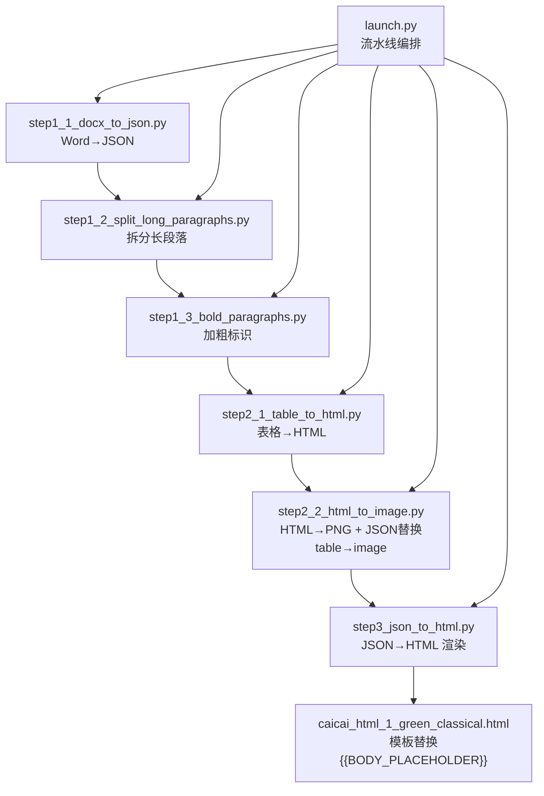
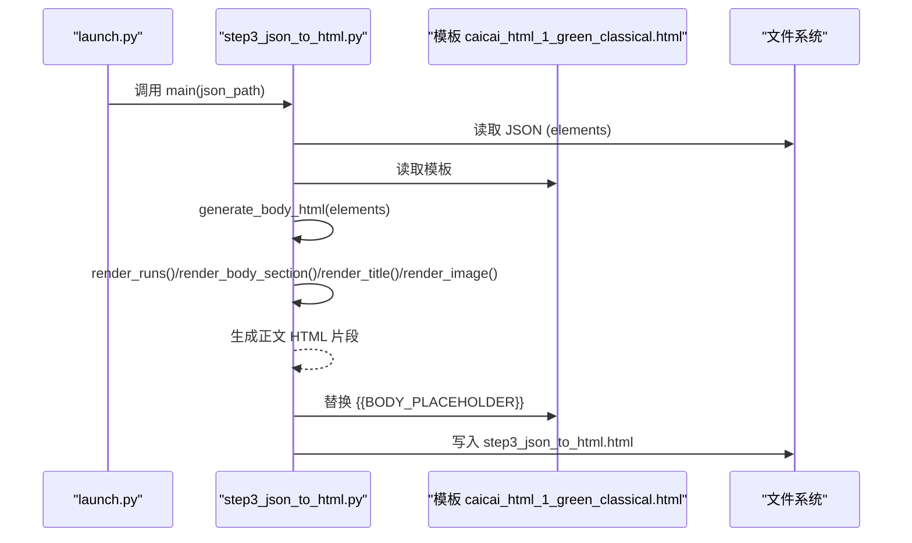
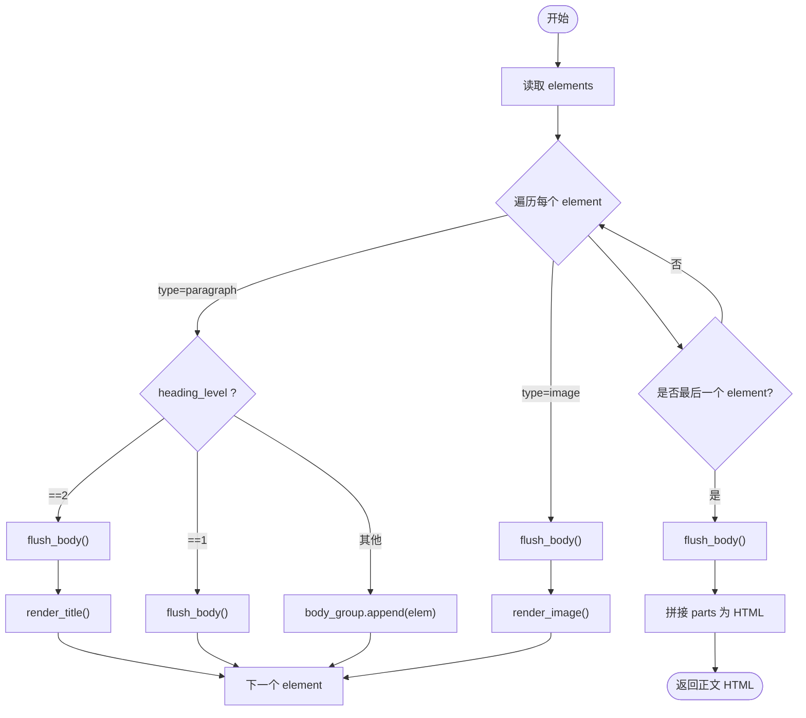
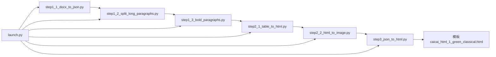

# 渲染规则引擎

<cite>
**本文引用的文件**   
- [step3_json_to_html.py](file://step3_json_to_html.py)
- [caicai_html_1_green_classical.html](file://html_template/caicai_html_1_green_classical.html)
- [launch.py](file://launch.py)
- [config.py](file://config.py)
- [step1_1_docx_to_json.py](file://step1_1_docx_to_json.py)
- [step1_2_split_long_paragraphs.py](file://step1_2_split_long_paragraphs.py)
- [step1_3_bold_paragraphs.py](file://step1_3_bold_paragraphs.py)
- [step2_1_table_to_html.py](file://step2_1_table_to_html.py)
- [step2_2_html_to_image.py](file://step2_2_html_to_image.py)
</cite>

## 目录
1. [简介](#简介)
2. [项目结构](#项目结构)
3. [核心组件](#核心组件)
4. [架构总览](#架构总览)
5. [详细组件分析](#详细组件分析)
6. [依赖关系分析](#依赖关系分析)
7. [性能与可扩展性](#性能与可扩展性)
8. [故障排查指南](#故障排查指南)
9. [结论](#结论)
10. [附录：新增元素类型示例](#附录新增元素类型示例)

## 简介
本技术文档聚焦于“JSON 到 HTML”的渲染规则引擎，详细说明从结构化 JSON（elements）生成最终 HTML 的规则与实现。重点覆盖以下方面：
- 段落、标题（heading_level 1/2）、图片等元素的渲染策略
- 连续正文段落的合并策略、空行分隔规则以及 section 包裹机制
- run 级别的渲染规则，特别是加粗文本在 span.hl 中的生成
- 渲染函数设计模式：render_runs()、render_body_section()、render_title()、render_image() 的实现细节
- 如何扩展新的元素类型和处理规则

该引擎位于 step3_json_to_html.py，配合模板 caicai_html_1_green_classical.html 完成最终页面输出。

## 项目结构
渲染相关的关键文件与职责如下：
- step3_json_to_html.py：读取 step2 输出的 JSON，按规则将 elements 渲染为 HTML 片段，并替换模板占位符
- html_template/caicai_html_1_green_classical.html：HTML 模板，包含样式与 {{BODY_PLACEHOLDER}} 占位符
- launch.py：一键流水线编排，串联各步骤，最终调用 step3 渲染
- config.py：全局配置（如拆分阈值等），供上游步骤使用
- step1_1_docx_to_json.py：Word → JSON（定义 JSON 数据结构）
- step1_2_split_long_paragraphs.py：LLM 拆分过长段落（维护 JSON 结构一致性）
- step1_3_bold_paragraphs.py：LLM 添加总结性加粗标识（影响 run.bold）
- step2_1_table_to_html.py：表格 JSON → HTML 文件
- step2_2_html_to_image.py：表格 HTML → PNG，并将 JSON 中 table 元素替换为 image

图表来源
- [step3_json_to_html.py:1-149](file://step3_json_to_html.py#L1-L149)
- [caicai_html_1_green_classical.html:187-210](file://html_template/caicai_html_1_green_classical.html#L187-L210)
- [launch.py:42-156](file://launch.py#L42-L156)
- [step1_1_docx_to_json.py:145-184](file://step1_1_docx_to_json.py#L145-L184)
- [step1_2_split_long_paragraphs.py:198-200](file://step1_2_split_long_paragraphs.py#L198-L200)
- [step1_3_bold_paragraphs.py:207-224](file://step1_3_bold_paragraphs.py#L207-L224)
- [step2_1_table_to_html.py:74-85](file://step2_1_table_to_html.py#L74-L85)
- [step2_2_html_to_image.py:179-217](file://step2_2_html_to_image.py#L179-L217)

章节来源
- [step3_json_to_html.py:1-149](file://step3_json_to_html.py#L1-L149)
- [caicai_html_1_green_classical.html:187-210](file://html_template/caicai_html_1_green_classical.html#L187-L210)
- [launch.py:42-156](file://launch.py#L42-L156)

## 核心组件
本节深入解析渲染引擎的核心函数与数据流。

- render_runs(runs)
  - 作用：将 runs 列表渲染为内联 HTML 字符串
  - 规则：若 run.bold 为真，则用  包裹；否则直接拼接文本
  - 复杂度：O(n)，n 为 runs 数量
  - 关键点：保持顺序与内容不变，仅根据 bold 标记进行标签包裹

- render_body_section(paragraphs)
  - 作用：将一组连续正文段落包裹在 <section> 里
  - 规则：每个段落渲染为 
，并在其后追加一个空行 
 

  - 输出：以统一 SECTION_STYLE 包裹的 <section> 块

- render_title(text)
  - 作用：渲染 heading_level=2 的小标题
  - 规则：输出 
 文字 
 及一个空行

- render_image(image_path)
  - 作用：渲染图片元素
  - 规则：路径统一转为正斜杠，输出居中的  标签，并附加空行

- generate_body_html(elements)
  - 作用：遍历 elements，按类型分流处理，维护 body_group 累积连续正文段落
  - 规则：
    - paragraph + heading_level=2：flush_body() 后渲染标题
    - paragraph + heading_level=1：flush_body()，不渲染到正文
    - paragraph + 无 heading_level：加入 body_group
    - image：flush_body() 后渲染图片
  - 结束：末尾 flush_body() 确保最后一组正文被输出

- main(json_path)
  - 作用：加载 JSON 与模板，调用 generate_body_html() 生成正文 HTML，替换 {{BODY_PLACEHOLDER}}，写入输出文件

章节来源
- [step3_json_to_html.py:38-79](file://step3_json_to_html.py#L38-L79)
- [step3_json_to_html.py:84-115](file://step3_json_to_html.py#L84-L115)
- [step3_json_to_html.py:121-149](file://step3_json_to_html.py#L121-L149)

## 架构总览
渲染流程从 JSON 到 HTML 的整体时序如下：

图表来源
- [launch.py:146-156](file://launch.py#L146-L156)
- [step3_json_to_html.py:121-149](file://step3_json_to_html.py#L121-L149)
- [caicai_html_1_green_classical.html:207-209](file://html_template/caicai_html_1_green_classical.html#L207-L209)

## 详细组件分析

### 渲染函数设计与实现细节
- render_runs()
  - 输入：runs 列表，每个元素包含 text 与可选 bold
  - 输出：内联 HTML 字符串
  - 行为：对每个 run，若 bold 为真，则用  包裹；否则直接拼接
  - 边界情况：空 runs 返回空串；bold 字段缺失视为非加粗

- render_body_section()
  - 输入：paragraphs 列表（连续正文段落）
  - 输出：<section style="..."> 包裹的多个 
 与空行
  - 行为：每段渲染后追加 
 
，保证段落间有单行空行分隔

- render_title()
  - 输入：标题文本
  - 输出：
 与空行
  - 行为：用于 heading_level=2 的小标题

- render_image()
  - 输入：image_path
  - 输出：居中  与空行
  - 行为：路径统一为正斜杠，适配跨平台路径

- generate_body_html()
  - 输入：elements 列表
  - 输出：正文区 HTML 片段
  - 状态机：
    - body_group 累积连续正文段落
    - 遇到 heading_level=2 或 image 时，先 flush_body() 再渲染对应元素
    - heading_level=1 仅触发 flush_body()，不渲染到正文
    - 末尾 flush_body() 确保收尾

图表来源
- [step3_json_to_html.py:84-115](file://step3_json_to_html.py#L84-L115)

章节来源
- [step3_json_to_html.py:38-79](file://step3_json_to_html.py#L38-L79)
- [step3_json_to_html.py:84-115](file://step3_json_to_html.py#L84-L115)

### 数据模型与 JSON 结构
- 段落（paragraph）
  - type: "paragraph"
  - heading_level: 1/2 或 null
  - runs: [{text, bold}]
- 图片（image）
  - type: "image"
  - file_name: 文件名
  - image_path: 相对路径
- 表格（table）
  - type: "table"
  - row_count, col_count
  - data: [[{text, bold}]]

这些结构由 step1_1_docx_to_json.py 构建，后续步骤可能修改（如 step2_2 将 table 替换为 image）。

章节来源
- [step1_1_docx_to_json.py:75-139](file://step1_1_docx_to_json.py#L75-L139)
- [step2_2_html_to_image.py:184-201](file://step2_2_html_to_image.py#L184-L201)

### 模板与样式
- 模板文件包含 {{BODY_PLACEHOLDER}} 占位符，渲染引擎将生成的正文 HTML 片段替换该占位符
- 样式类：
  - .title：大标题样式（24px、加粗、居中）
  - .body：正文样式（18px、行高 2、字间距 1px、两端对齐）
  - .empty-line：空行高度
  - .hl：内联高亮（绿色背景、加粗）

章节来源
- [caicai_html_1_green_classical.html:87-138](file://html_template/caicai_html_1_green_classical.html#L87-L138)
- [caicai_html_1_green_classical.html:207-209](file://html_template/caicai_html_1_green_classical.html#L207-L209)

## 依赖关系分析
- step3_json_to_html.py 依赖：
  - JSON 输入（来自 step1_3 或 step2 的输出）
  - HTML 模板（caicai_html_1_green_classical.html）
- launch.py 负责编排，按需跳过步骤，并最终调用 step3 渲染
- 上游步骤影响 JSON 结构与内容：
  - step1_1：构建基础 JSON 结构
  - step1_2：拆分长段落（维持 runs 与 index 一致性）
  - step1_3：添加加粗标识（影响 run.bold）
  - step2_1/2：表格转 HTML/PNG，并将 table 替换为 image

图表来源
- [launch.py:70-156](file://launch.py#L70-L156)
- [step3_json_to_html.py:121-149](file://step3_json_to_html.py#L121-L149)

章节来源
- [launch.py:42-156](file://launch.py#L42-L156)
- [step3_json_to_html.py:121-149](file://step3_json_to_html.py#L121-L149)

## 性能与可扩展性
- 时间复杂度
  - render_runs(): O(n)
  - render_body_section(): O(m)（m 为段落数）
  - generate_body_html(): O(N)（N 为 elements 总数）
- 空间复杂度
  - 主要取决于 parts 列表与 body_group 缓存，整体线性增长
- 优化建议
  - 对于超大文档，可考虑分块渲染与流式写入
  - 避免重复字符串拼接，可使用列表 join 方式（已采用）
- 可扩展性
  - 新增元素类型：在 generate_body_html() 中添加分支处理，并实现对应的 render_* 函数
  - 新增 run 级别样式：在 render_runs() 中扩展条件判断

[本节提供通用指导，无需具体文件分析]

## 故障排查指南
- JSON 文件不存在
  - 现象：main() 打印错误并退出
  - 排查：确认 json_path 正确且文件存在
- 模板未找到
  - 现象：模板路径常量指向 html_template 下文件
  - 排查：检查 TEMPLATE_PATH 与模板文件是否存在
- 正文为空
  - 现象：输出 HTML 中 {{BODY_PLACEHOLDER}} 未被替换或为空
  - 排查：检查 elements 是否为空或全部为 heading_level=1（不渲染到正文）
- 图片路径异常
  - 现象：图片无法显示
  - 排查：确认 image_path 使用正斜杠，且文件存在于 process/table 或 process/images 目录

章节来源
- [step3_json_to_html.py:121-149](file://step3_json_to_html.py#L121-L149)

## 结论
渲染规则引擎通过清晰的函数分工与状态机逻辑，实现了从 JSON 到 HTML 的稳定转换。其设计遵循单一职责原则，便于扩展与维护。结合模板与样式，最终输出符合微信公众号排版要求的 HTML 页面。

[本节为总结性内容，无需具体文件分析]

## 附录：新增元素类型示例
假设需要新增一种“引用块”（quote）元素类型，处理步骤如下：

- 在 JSON 中新增元素
  - type: "quote"
  - content: 引用文本
  - author: 可选作者信息

- 在 step3_json_to_html.py 中扩展
  - 新增 render_quote(content, author=None) 函数，输出 <blockquote>...</blockquote> 与空行
  - 在 generate_body_html() 中添加分支：
    - if etype == 'quote': flush_body(); parts.append(render_quote(...))

- 在模板中补充样式（可选）
  - 在 caicai_html_1_green_classical.html 中增加 .quote 样式类

- 验证
  - 运行 launch.py 或单独执行 step3，检查输出 HTML 是否正确渲染引用块

章节来源
- [step3_json_to_html.py:84-115](file://step3_json_to_html.py#L84-L115)
- [caicai_html_1_green_classical.html:87-138](file://html_template/caicai_html_1_green_classical.html#L87-L138)