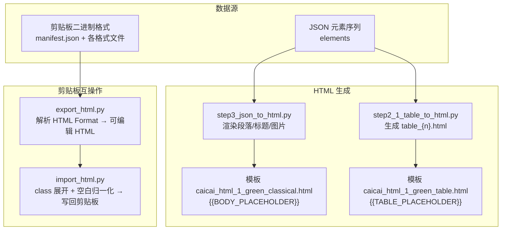
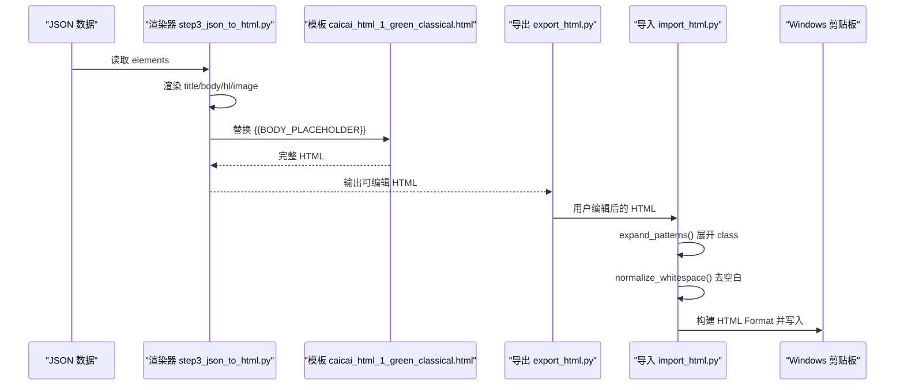
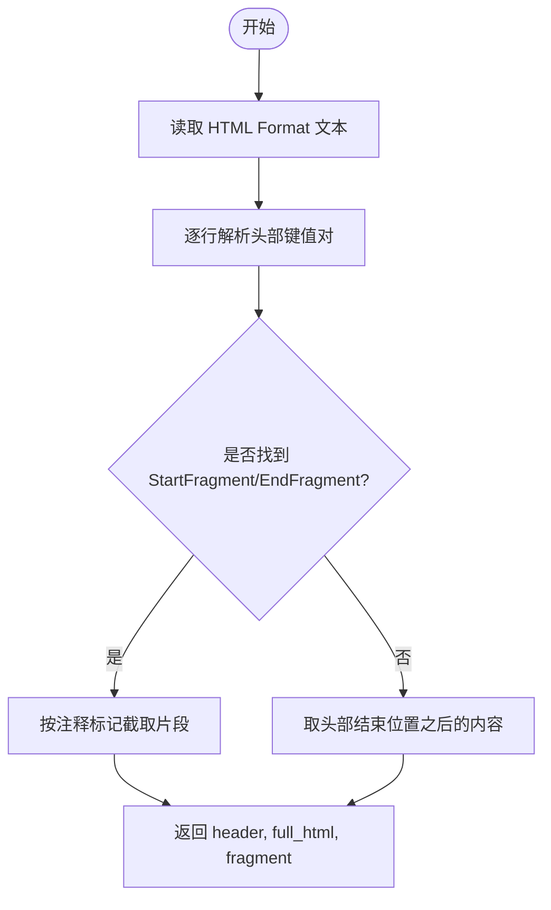
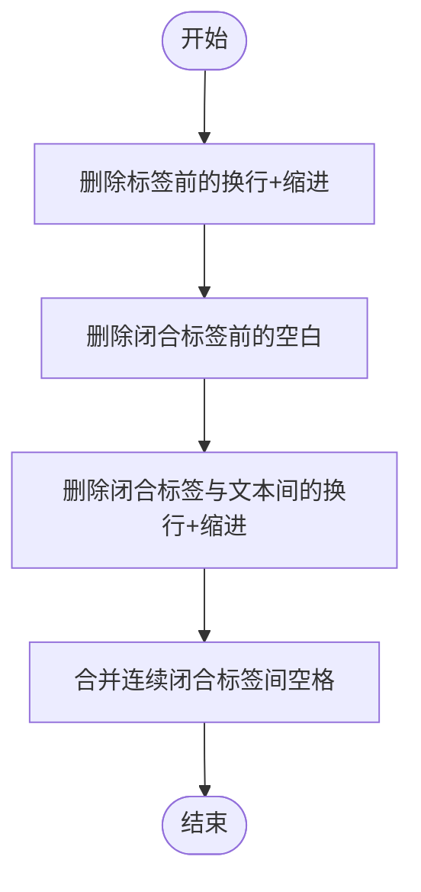
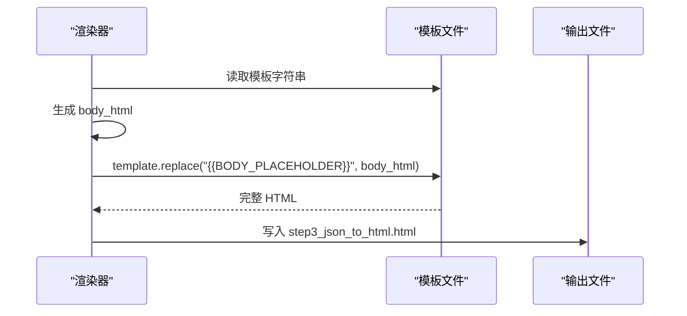
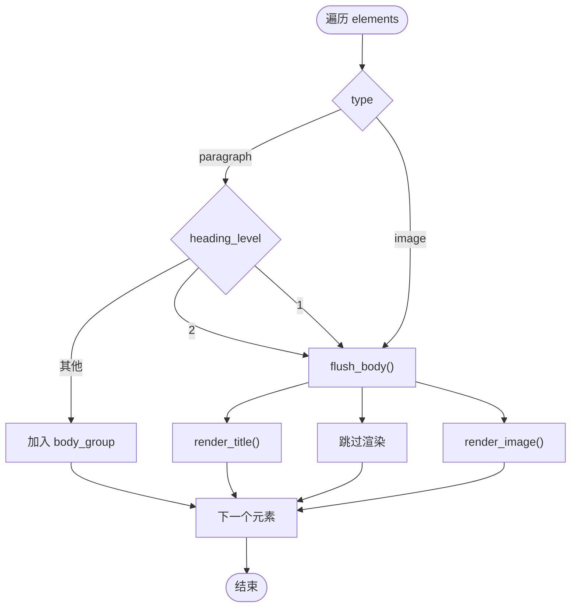
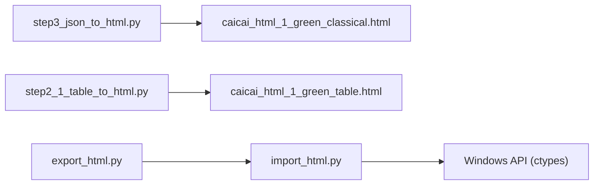

# HTML 内容处理

<cite>
**本文引用的文件列表**
- [step3_json_to_html.py](file://step3_json_to_html.py)
- [config.py](file://config.py)
- [export_html.py](file://board_history/export_html.py)
- [import_html.py](file://board_history/import_html.py)
- [caicai_html_1_green_classical.html](file://html_template/caicai_html_1_green_classical.html)
- [caicai_html_1_green_table.html](file://html_template/caicai_html_1_green_table.html)
- [step2_1_table_to_html.py](file://step2_1_table_to_html.py)
</cite>

## 目录
1. [简介](#简介)
2. [项目结构](#项目结构)
3. [核心组件](#核心组件)
4. [架构总览](#架构总览)
5. [详细组件分析](#详细组件分析)
6. [依赖关系分析](#依赖关系分析)
7. [性能与复杂度](#性能与复杂度)
8. [故障排查指南](#故障排查指南)
9. [结论](#结论)
10. [附录：扩展样式类与规则示例](#附录扩展样式类与规则示例)

## 简介
本技术文档聚焦于仓库中的 HTML 内容处理链路，覆盖以下关键能力：
- HTML 片段提取算法：从剪贴板原始 HTML Format 中解析并提取片段。
- CSS 类展开机制：将简化的 class 属性（title、body、empty-line、hl 等）转换为平台要求的完整内联样式。
- 空白字符规范化：去除格式化换行与缩进，恢复紧凑的标签结构。
- HTML 模板引擎：基于占位符替换生成最终页面。
- 验证与错误恢复策略：在导入/导出流程中对异常进行容错处理。
- 可扩展性：如何新增样式类与处理规则。

## 项目结构
与 HTML 内容处理直接相关的核心文件如下：
- 正文渲染与模板替换：step3_json_to_html.py
- 剪贴板导出/导入：board_history/export_html.py、board_history/import_html.py
- 模板文件：html_template/caicai_html_1_green_classical.html、html_template/caicai_html_1_green_table.html
- 表格生成：step2_1_table_to_html.py
- 全局配置：config.py



图表来源
- [step3_json_to_html.py:121-149](file://step3_json_to_html.py#L121-L149)
- [caicai_html_1_green_classical.html:207-209](file://html_template/caicai_html_1_green_classical.html#L207-L209)
- [step2_1_table_to_html.py:74-118](file://step2_1_table_to_html.py#L74-L118)
- [caicai_html_1_green_table.html:59-62](file://html_template/caicai_html_1_green_table.html#L59-L62)
- [export_html.py:59-88](file://board_history/export_html.py#L59-L88)
- [import_html.py:427-478](file://board_history/import_html.py#L427-L478)

章节来源
- [step3_json_to_html.py:1-22](file://step3_json_to_html.py#L1-L22)
- [export_html.py:1-16](file://board_history/export_html.py#L1-L16)
- [import_html.py:1-14](file://board_history/import_html.py#L1-L14)
- [caicai_html_1_green_classical.html:1-10](file://html_template/caicai_html_1_green_classical.html#L1-L10)
- [caicai_html_1_green_table.html:1-10](file://html_template/caicai_html_1_green_table.html#L1-L10)
- [step2_1_table_to_html.py:1-16](file://step2_1_table_to_html.py#L1-L16)

## 核心组件
- 正文渲染器（step3_json_to_html.py）
  - 将 JSON elements 渲染为 HTML 片段，包含标题、正文段落、加粗高亮、图片等。
  - 使用模板占位符 {{BODY_PLACEHOLDER}} 插入到主模板中。
- 剪贴板导出器（export_html.py）
  - 解析 Windows 剪贴板 HTML Format，提取片段并进行可读性格式化。
  - 将常见模式折叠为简洁的 <p class="..."> 结构，便于人工编辑。
- 剪贴板导入器（import_html.py）
  - 将简化 class 结构展开为平台所需的完整内联样式。
  - 执行空白字符规范化，确保生成的 HTML Format 二进制偏移正确。
- 模板系统
  - 主模板含 {{BODY_PLACEHOLDER}}；表格模板含 {{TABLE_PLACEHOLDER}}。
  - 通过字符串替换完成内容注入。

章节来源
- [step3_json_to_html.py:35-116](file://step3_json_to_html.py#L35-L116)
- [export_html.py:94-227](file://board_history/export_html.py#L94-L227)
- [import_html.py:118-208](file://board_history/import_html.py#L118-L208)
- [caicai_html_1_green_classical.html:207-209](file://html_template/caicai_html_1_green_classical.html#L207-L209)
- [caicai_html_1_green_table.html:59-62](file://html_template/caicai_html_1_green_table.html#L59-L62)

## 架构总览
整体处理流程分为两条主线：
- 生成线：JSON → 渲染正文/表格 → 模板占位符替换 → 输出 HTML。
- 剪贴板互操作线：剪贴板 HTML Format → 解析与格式化 → 折叠为 class 结构 → 人工编辑 → 展开为内联样式 → 重新构建 HTML Format → 写回剪贴板。



图表来源
- [step3_json_to_html.py:121-149](file://step3_json_to_html.py#L121-L149)
- [export_html.py:466-516](file://board_history/export_html.py#L466-L516)
- [import_html.py:427-478](file://board_history/import_html.py#L427-L478)

## 详细组件分析

### 组件 A：HTML 片段提取算法（剪贴板 HTML Format）
- 目标：从 Windows 剪贴板的 HTML Format 二进制中解析出头部信息与片段内容。
- 关键点：
  - 按行解析头部键值对（Version、StartHTML、EndHTML、StartFragment、EndFragment）。
  - 通过注释标记 <!--StartFragment--> 与 <!--EndFragment--> 定位片段边界。
  - 若未找到标记，则回退到头部结束位置之后的全部内容作为片段。
- 复杂度：线性扫描文本，时间 O(N)，空间 O(1)。



图表来源
- [export_html.py:59-88](file://board_history/export_html.py#L59-L88)

章节来源
- [export_html.py:59-88](file://board_history/export_html.py#L59-L88)

### 组件 B：CSS 类展开机制（class → 内联样式）
- 支持类名及转换规则：
  - title：转为外层 section + p + strong 的内联样式组合。
  - body：转为带 white-space/margin/padding/box-sizing 的 p。
  - body-bold：转为 p > span(背景色) > strong 的组合。
  - empty-line：转为 p > br 的标准空行结构。
  - hl（span）：转为 span(背景色) > strong 的内联高亮。
- 顺序要求：
  - 展开时先处理复合结构（如 body-bold），再处理简单 body，避免误匹配。
- 正则策略：
  - 使用非贪婪匹配与 DOTALL 标志，确保跨行内容安全捕获。
  - 使用负向前瞻 (?!</p>) 防止跨越闭合标签边界。

```mermaid
flowchart TD
In["输入 HTML含 class"] --> Title["匹配 <p class=\"title\">...</p>"]
In --> BodyBold["匹配 <p class=\"body-bold\">...</p>"]
In --> Body["匹配 <p class=\"body\">...</p>"]
In --> Empty["匹配 <p class=\"empty-line\"><br></p>"]
In --> HL["匹配 <span class=\"hl\">...</span>"]
Title --> Out["替换为内联样式结构"]
BodyBold --> Out
Body --> Out
Empty --> Out
HL --> Out
Out --> Next["继续下一规则或输出"]
```

图表来源
- [import_html.py:118-190](file://board_history/import_html.py#L118-L190)
- [export_html.py:148-227](file://board_history/export_html.py#L148-L227)

章节来源
- [import_html.py:118-190](file://board_history/import_html.py#L118-L190)
- [export_html.py:148-227](file://board_history/export_html.py#L148-L227)

### 组件 C：空白字符规范化算法
- 目标：移除由格式化步骤引入的换行与缩进，恢复紧凑标签结构，保证 HTML Format 二进制偏移计算正确。
- 主要操作：
  - 删除标签前的换行与缩进。
  - 删除闭合标签前的多余空白。
  - 清理闭合标签与文本间的换行与缩进。
  - 合并连续闭合标签之间的空格。
- 复杂度：多次正则替换，总体 O(N)。



图表来源
- [import_html.py:193-208](file://board_history/import_html.py#L193-L208)

章节来源
- [import_html.py:193-208](file://board_history/import_html.py#L193-L208)

### 组件 D：HTML 模板引擎与占位符替换
- 主模板：caicai_html_1_green_classical.html，包含 {{BODY_PLACEHOLDER}}。
- 表格模板：caicai_html_1_green_table.html，包含 {{TABLE_PLACEHOLDER}}。
- 替换逻辑：
  - 读取模板文件为字符串。
  - 使用字符串 replace 方法替换占位符。
  - 输出到 process 目录下的 HTML 文件。
- 特点：
  - 轻量级、无外部依赖。
  - 适合固定结构的页面组装。



图表来源
- [step3_json_to_html.py:121-149](file://step3_json_to_html.py#L121-L149)
- [caicai_html_1_green_classical.html:207-209](file://html_template/caicai_html_1_green_classical.html#L207-L209)
- [step2_1_table_to_html.py:97-118](file://step2_1_table_to_html.py#L97-L118)
- [caicai_html_1_green_table.html:59-62](file://html_template/caicai_html_1_green_table.html#L59-L62)

章节来源
- [step3_json_to_html.py:121-149](file://step3_json_to_html.py#L121-L149)
- [step2_1_table_to_html.py:74-118](file://step2_1_table_to_html.py#L74-L118)

### 组件 E：正文渲染与元素映射
- 元素类型与映射：
  - heading_level=2 → <p class="title">
  - heading_level=1 → 跳过不渲染
  - paragraph → <section><p class="body">...</p><p class="empty-line"><br></p></section>
  - bold run → <span class="hl">
  - image → 居中 img 标签
- 合并策略：
  - 连续正文段落合并在同一 section 中，段末追加空行。
  - 遇到标题或图片时，先 flush 当前 body_group。



图表来源
- [step3_json_to_html.py:84-116](file://step3_json_to_html.py#L84-L116)

章节来源
- [step3_json_to_html.py:35-116](file://step3_json_to_html.py#L35-L116)

## 依赖关系分析
- 模块耦合：
  - step3_json_to_html.py 仅依赖 JSON 与模板文件，低耦合。
  - export_html.py 与 import_html.py 相互协作，形成“折叠/展开”对称关系。
  - 模板文件被渲染器与表格生成器共同引用。
- 外部依赖：
  - import_html.py 调用 Windows API（ctypes）写入剪贴板。
  - 所有脚本均使用标准库（re、json、os、sys、base64、struct、ctypes）。



图表来源
- [step3_json_to_html.py:121-149](file://step3_json_to_html.py#L121-L149)
- [step2_1_table_to_html.py:74-118](file://step2_1_table_to_html.py#L74-L118)
- [import_html.py:27-54](file://board_history/import_html.py#L27-L54)

章节来源
- [step3_json_to_html.py:121-149](file://step3_json_to_html.py#L121-L149)
- [step2_1_table_to_html.py:74-118](file://step2_1_table_to_html.py#L74-L118)
- [import_html.py:27-54](file://board_history/import_html.py#L27-L54)

## 性能与复杂度
- 正则替换：
  - 折叠/展开阶段均为多轮正则替换，时间复杂度近似 O(N·M)，N 为 HTML 长度，M 为规则数量。
  - 建议将高频规则预编译（re.compile）以提升性能。
- 空白规范化：
  - 多次正则替换，但每轮扫描一次，整体仍为线性。
- 模板替换：
  - 字符串 replace 为 O(N)，开销极低。
- 内存占用：
  - 主要取决于 HTML 片段大小与二进制格式数据量。

[本节为通用性能讨论，无需特定文件来源]

## 故障排查指南
- 常见问题与对策：
  - 找不到 article 区域：检查 <article id="clipboard-content"> 是否存在且未被破坏。
  - 未找到 cb-raw-data：程序会提示警告并尝试从内容重建所有格式。
  - 剪贴板打开失败：程序会重试最多 5 次，若仍失败则退出。
  - 编码问题：CF_TEXT 优先使用 cp936，失败时回退到 utf-8。
- 调试建议：
  - 使用纯文本预览区核对内容。
  - 对比 original_fragment 与 content_fragment 判断是否被编辑。
  - 统计各类 class 出现次数以确认折叠/展开是否正确。

章节来源
- [import_html.py:70-112](file://board_history/import_html.py#L70-L112)
- [import_html.py:362-422](file://board_history/import_html.py#L362-L422)
- [export_html.py:265-304](file://board_history/export_html.py#L265-L304)

## 结论
该 HTML 内容处理体系通过“折叠/展开”的对称设计，实现了从复杂内联样式到简洁 class 的可读化转换，以及反向还原为平台兼容的完整内联样式。配合模板占位符替换与空白规范化，形成了稳定、可维护、可扩展的内容流水线。

[本节为总结，无需特定文件来源]

## 附录：扩展样式类与规则示例
- 新增一个样式类（例如 .note）的步骤：
  - 在模板文件中添加 .note 的 CSS 定义（用于预览展示）。
  - 在导出器的 collapse_patterns 中添加匹配规则，将现有模式折叠为 <p class="note">...</p>。
  - 在导入器的 expand_patterns 中添加对应展开规则，将 <p class="note">...</p> 展开为平台要求的内联样式结构。
  - 在渲染器中增加对应的生成逻辑（如需从 JSON 元素直接生成 .note）。
- 注意事项：
  - 保持折叠与展开规则的对称性。
  - 正则表达式需考虑跨行与嵌套标签边界，避免误匹配。
  - 更新相关统计与校验逻辑（如有）。

章节来源
- [export_html.py:148-227](file://board_history/export_html.py#L148-L227)
- [import_html.py:118-190](file://board_history/import_html.py#L118-L190)
- [caicai_html_1_green_classical.html:97-137](file://html_template/caicai_html_1_green_classical.html#L97-L137)
- [step3_json_to_html.py:35-116](file://step3_json_to_html.py#L35-L116)