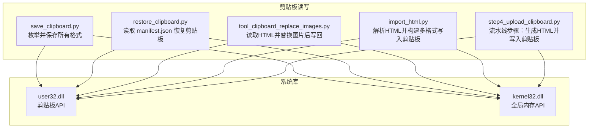
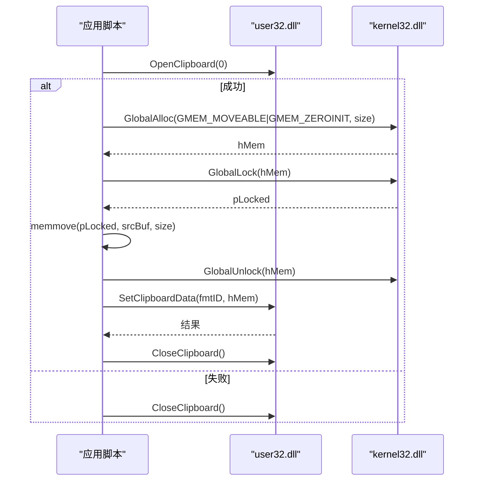
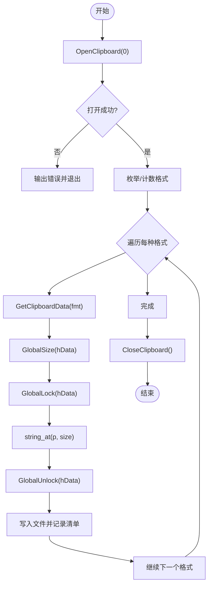
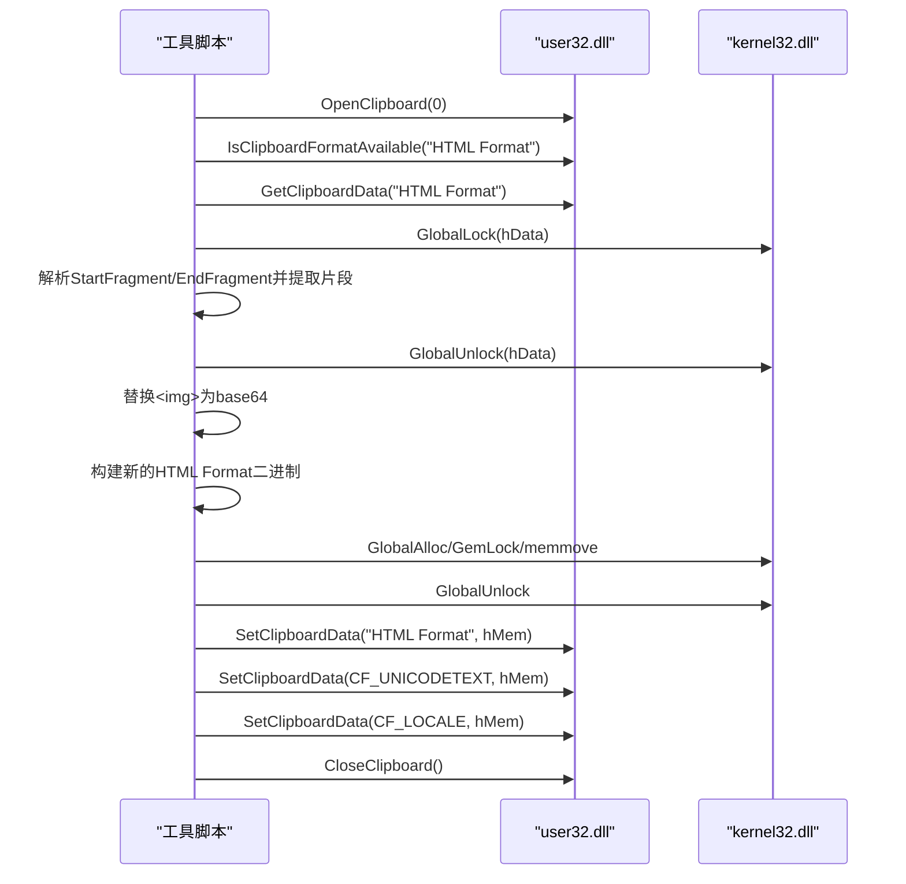
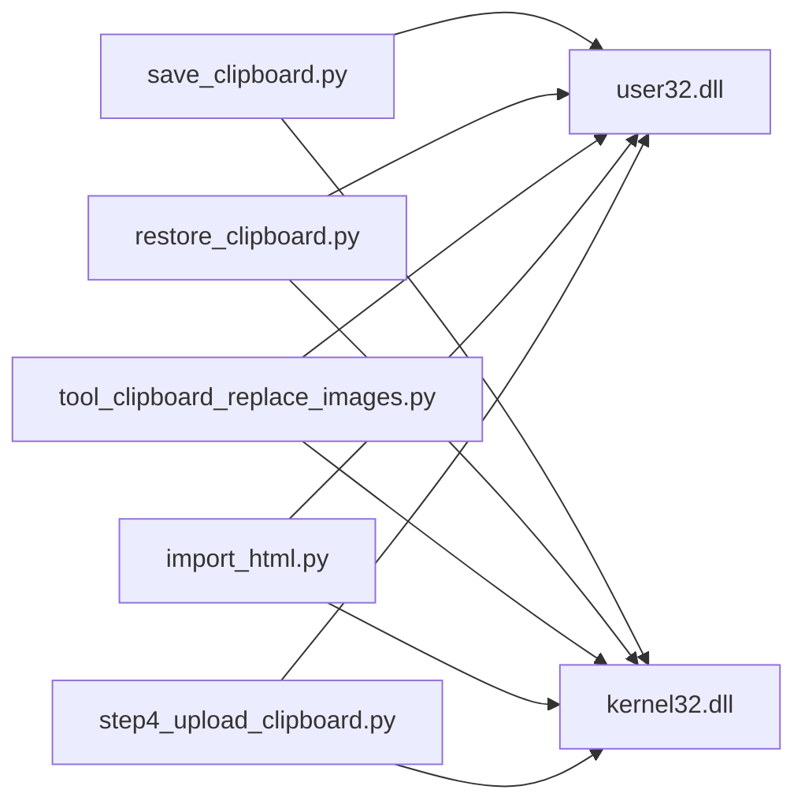

# Windows API 调用机制

<cite>
**本文引用的文件**   
- [board_history/save_clipboard.py](file://board_history/save_clipboard.py)
- [board_history/restore_clipboard.py](file://board_history/restore_clipboard.py)
- [tool/tool_clipboard_replace_images.py](file://tool/tool_clipboard_replace_images.py)
- [board_history/import_html.py](file://board_history/import_html.py)
- [step4_upload_clipboard.py](file://step4_upload_clipboard.py)
</cite>

## 目录
1. [简介](#简介)
2. [项目结构](#项目结构)
3. [核心组件](#核心组件)
4. [架构总览](#架构总览)
5. [详细组件分析](#详细组件分析)
6. [依赖关系分析](#依赖关系分析)
7. [性能与内存管理](#性能与内存管理)
8. [故障排查指南](#故障排查指南)
9. [结论](#结论)
10. [附录：API 参考与最佳实践](#附录api-参考与最佳实践)

## 简介
本技术文档围绕 Windows 剪贴板操作，系统性梳理了通过 Python ctypes 调用 user32.dll 与 kernel32.dll 的机制与实践。重点覆盖以下主题：
- ctypes 绑定与函数签名（restype/argtypes）
- 剪贴板核心 API：OpenClipboard、EmptyClipboard、SetClipboardData、CloseClipboard、GetClipboardData、IsClipboardFormatAvailable、RegisterClipboardFormatW 等
- 全局内存管理：GlobalAlloc、GlobalLock、GlobalUnlock、GlobalFree 的使用模式
- 自定义剪贴板格式注册：RegisterClipboardFormatW 的原理与用法
- 错误处理策略与资源释放的最佳实践
- 结合仓库中多个脚本的实际实现进行代码级说明

## 项目结构
仓库中包含多处使用 ctypes 访问 Windows 剪贴板的脚本，分别承担“导出剪贴板”、“恢复剪贴板”、“替换图片并写回剪贴板”、“从 HTML 生成多格式数据写入剪贴板”等职责。这些脚本在 API 绑定、内存分配与释放、格式解析等方面形成一致的模式。

图表来源
- [board_history/save_clipboard.py:67-102](file://board_history/save_clipboard.py#L67-L102)
- [board_history/restore_clipboard.py:30-62](file://board_history/restore_clipboard.py#L30-L62)
- [tool/tool_clipboard_replace_images.py:37-64](file://tool/tool_clipboard_replace_images.py#L37-L64)
- [board_history/import_html.py:33-54](file://board_history/import_html.py#L33-L54)
- [step4_upload_clipboard.py:35-56](file://step4_upload_clipboard.py#L35-L56)

章节来源
- [board_history/save_clipboard.py:1-188](file://board_history/save_clipboard.py#L1-L188)
- [board_history/restore_clipboard.py:1-159](file://board_history/restore_clipboard.py#L1-L159)
- [tool/tool_clipboard_replace_images.py:1-498](file://tool/tool_clipboard_replace_images.py#L1-L498)
- [board_history/import_html.py:1-483](file://board_history/import_html.py#L1-L483)
- [step4_upload_clipboard.py:1-480](file://step4_upload_clipboard.py#L1-L480)

## 核心组件
- ctypes.windll.user32 与 ctypes.windll.kernel32 模块加载与函数签名声明
- 剪贴板生命周期管理：打开、清空、设置数据、关闭
- 全局内存分配与拷贝：分配可移动内存、锁定指针、复制数据、解锁、释放
- 自定义格式注册：通过 RegisterClipboardFormatW 获取运行时格式 ID
- HTML Format 二进制构造：包含版本与偏移量头部的标准格式

章节来源
- [board_history/save_clipboard.py:67-102](file://board_history/save_clipboard.py#L67-L102)
- [board_history/restore_clipboard.py:30-62](file://board_history/restore_clipboard.py#L30-L62)
- [tool/tool_clipboard_replace_images.py:37-64](file://tool/tool_clipboard_replace_images.py#L37-L64)
- [board_history/import_html.py:33-54](file://board_history/import_html.py#L33-L54)
- [step4_upload_clipboard.py:35-56](file://step4_upload_clipboard.py#L35-L56)

## 架构总览
整体流程围绕“数据准备 → 内存分配 → 写入剪贴板 → 资源释放”展开。不同脚本在数据源与预处理上有所差异，但底层 API 调用模式一致。

图表来源
- [board_history/restore_clipboard.py:92-152](file://board_history/restore_clipboard.py#L92-L152)
- [board_history/import_html.py:367-421](file://board_history/import_html.py#L367-L421)
- [step4_upload_clipboard.py:371-430](file://step4_upload_clipboard.py#L371-L430)

## 详细组件分析

### 组件一：ctypes 绑定与函数签名
- 使用 ctypes.windll.user32 和 ctypes.windll.kernel32 加载系统库
- 为每个函数设置 restype 与 argtypes，确保 64 位安全（句柄/指针返回类型统一为 c_void_p）
- 常用函数包括：
  - user32.OpenClipboard、CloseClipboard、EmptyClipboard、SetClipboardData、GetClipboardData、EnumClipboardFormats、CountClipboardFormats、IsClipboardFormatAvailable、RegisterClipboardFormatW、GetClipboardFormatNameW
  - kernel32.GlobalAlloc、GlobalLock、GlobalUnlock、GlobalSize、GlobalFree

章节来源
- [board_history/save_clipboard.py:67-102](file://board_history/save_clipboard.py#L67-L102)
- [board_history/restore_clipboard.py:30-62](file://board_history/restore_clipboard.py#L30-L62)
- [tool/tool_clipboard_replace_images.py:37-64](file://tool/tool_clipboard_replace_images.py#L37-L64)
- [board_history/import_html.py:33-54](file://board_history/import_html.py#L33-L54)
- [step4_upload_clipboard.py:35-56](file://step4_upload_clipboard.py#L35-L56)

### 组件二：剪贴板生命周期与核心 API
- OpenClipboard(hwndOwner=0)：以当前进程所有者打开剪贴板
- EmptyClipboard()：清空现有内容，便于后续写入
- SetClipboardData(formatID, hMem)：将全局内存句柄写入指定格式
- GetClipboardData(formatID)：读取指定格式的数据句柄
- IsClipboardFormatAvailable(formatID)：检查某格式是否可用
- EnumClipboardFormats(prevFmt) / CountClipboardFormats()：枚举或计数剪贴板中的格式
- CloseClipboard()：关闭剪贴板，必须成对出现

章节来源
- [board_history/save_clipboard.py:70-86](file://board_history/save_clipboard.py#L70-L86)
- [board_history/restore_clipboard.py:33-49](file://board_history/restore_clipboard.py#L33-L49)
- [tool/tool_clipboard_replace_images.py:40-53](file://tool/tool_clipboard_replace_images.py#L40-L53)
- [board_history/import_html.py:36-45](file://board_history/import_html.py#L36-L45)
- [step4_upload_clipboard.py:38-47](file://step4_upload_clipboard.py#L38-L47)

### 组件三：全局内存管理（GlobalAlloc/Lock/Unlock/Free）
- GlobalAlloc(flags, size)：分配可移动内存（GMEM_MOVEABLE | GMEM_ZEROINIT）
- GlobalLock(hMem)：锁定内存并返回可访问指针
- GlobalUnlock(hMem)：解锁内存
- GlobalFree(hMem)：释放内存
- GlobalSize(hMem)：查询已分配内存大小（用于读取场景）

典型模式：
- 分配 → 锁定 → 拷贝数据 → 解锁 → 设置到剪贴板
- 若 SetClipboardData 失败，需显式释放句柄

章节来源
- [board_history/restore_clipboard.py:120-143](file://board_history/restore_clipboard.py#L120-L143)
- [board_history/import_html.py:393-413](file://board_history/import_html.py#L393-L413)
- [step4_upload_clipboard.py:402-422](file://step4_upload_clipboard.py#L402-L422)
- [tool/tool_clipboard_replace_images.py:234-256](file://tool/tool_clipboard_replace_images.py#L234-L256)

### 组件四：自定义剪贴板格式注册（RegisterClipboardFormatW）
- 对于标准格式（ID ≤ 17），直接使用常量 ID
- 对于自定义格式（如 “HTML Format”），调用 RegisterClipboardFormatW(name) 获取运行时 ID
- 当注册失败时，部分脚本会回退使用原始 ID 或报错退出

章节来源
- [board_history/restore_clipboard.py:65-78](file://board_history/restore_clipboard.py#L65-L78)
- [board_history/import_html.py:57-64](file://board_history/import_html.py#L57-L64)
- [step4_upload_clipboard.py:59-66](file://step4_upload_clipboard.py#L59-L66)
- [tool/tool_clipboard_replace_images.py:67-70](file://tool/tool_clipboard_replace_images.py#L67-L70)

### 组件五：HTML Format 二进制构造与解析
- 头部包含 Version、StartHTML、EndHTML、StartFragment、EndFragment 字段，值为字节偏移
- 构造时需迭代计算头部长度，确保偏移量正确
- 解析时按 StartFragment/EndFragment 切片得到实际片段内容

章节来源
- [tool/tool_clipboard_replace_images.py:144-178](file://tool/tool_clipboard_replace_images.py#L144-L178)
- [board_history/import_html.py:213-253](file://board_history/import_html.py#L213-L253)
- [step4_upload_clipboard.py:228-268](file://step4_upload_clipboard.py#L228-L268)

### 组件六：剪贴板导出与导入流程
- 导出（save_clipboard.py）：打开剪贴板 → 枚举格式 → 读取数据 → 保存到磁盘 → 记录清单
- 导入（restore_clipboard.py）：读取清单 → 打开剪贴板 → 清空 → 逐个格式分配内存并写入 → 关闭剪贴板

图表来源
- [board_history/save_clipboard.py:116-181](file://board_history/save_clipboard.py#L116-L181)

章节来源
- [board_history/save_clipboard.py:116-181](file://board_history/save_clipboard.py#L116-L181)
- [board_history/restore_clipboard.py:81-152](file://board_history/restore_clipboard.py#L81-L152)

### 组件七：图片替换与写回剪贴板
- 读取剪贴板 HTML Format，解析片段
- 根据 JSON 列表顺序替换  标签为 base64 data URI
- 重新构建 HTML Format 与纯文本格式，写回剪贴板

图表来源
- [tool/tool_clipboard_replace_images.py:76-138](file://tool/tool_clipboard_replace_images.py#L76-L138)
- [tool/tool_clipboard_replace_images.py:194-262](file://tool/tool_clipboard_replace_images.py#L194-L262)

章节来源
- [tool/tool_clipboard_replace_images.py:76-138](file://tool/tool_clipboard_replace_images.py#L76-L138)
- [tool/tool_clipboard_replace_images.py:194-262](file://tool/tool_clipboard_replace_images.py#L194-L262)

## 依赖关系分析
- 各脚本均依赖 user32.dll 与 kernel32.dll，并通过 ctypes.windll 加载
- 剪贴板 API 与全局内存 API 的组合使用贯穿所有脚本
- 自定义格式注册逻辑在不同脚本中保持一致：优先使用标准 ID，否则通过 RegisterClipboardFormatW 获取运行时 ID

图表来源
- [board_history/save_clipboard.py:67-102](file://board_history/save_clipboard.py#L67-L102)
- [board_history/restore_clipboard.py:30-62](file://board_history/restore_clipboard.py#L30-L62)
- [tool/tool_clipboard_replace_images.py:37-64](file://tool/tool_clipboard_replace_images.py#L37-L64)
- [board_history/import_html.py:33-54](file://board_history/import_html.py#L33-L54)
- [step4_upload_clipboard.py:35-56](file://step4_upload_clipboard.py#L35-L56)

章节来源
- [board_history/save_clipboard.py:67-102](file://board_history/save_clipboard.py#L67-L102)
- [board_history/restore_clipboard.py:30-62](file://board_history/restore_clipboard.py#L30-L62)
- [tool/tool_clipboard_replace_images.py:37-64](file://tool/tool_clipboard_replace_images.py#L37-L64)
- [board_history/import_html.py:33-54](file://board_history/import_html.py#L33-L54)
- [step4_upload_clipboard.py:35-56](file://step4_upload_clipboard.py#L35-L56)

## 性能与内存管理
- 避免重复分配：尽量复用已分配的内存块，减少频繁 GlobalAlloc/GlobalFree 开销
- 批量写入：合并多次 SetClipboardData 调用，降低系统调用次数
- 大对象处理：对大二进制数据采用分块处理与流式写入策略（在剪贴板场景中需谨慎，因为 SetClipboardData 要求完整句柄）
- 错误路径释放：任何异常分支都应确保 GlobalFree 被调用，防止句柄泄漏
- 锁粒度控制：GlobalLock 与 GlobalUnlock 之间仅执行必要的拷贝操作，缩短临界区

[本节为通用指导，不直接分析具体文件]

## 故障排查指南
- 无法打开剪贴板：可能是其他程序独占，建议重试或提示用户关闭占用程序
- 格式不可用：使用 IsClipboardFormatAvailable 检查后再读取
- 内存分配失败：检查 size 是否为正数，确认系统内存充足
- SetClipboardData 失败：调用 GetLastError 获取错误码，常见原因为句柄无效或格式未注册
- 资源泄漏：确保 finally 块中调用 CloseClipboard；在异常路径中调用 GlobalFree

章节来源
- [board_history/restore_clipboard.py:137-143](file://board_history/restore_clipboard.py#L137-L143)
- [board_history/import_html.py:410-413](file://board_history/import_html.py#L410-L413)
- [step4_upload_clipboard.py:419-422](file://step4_upload_clipboard.py#L419-L422)
- [tool/tool_clipboard_replace_images.py:251-256](file://tool/tool_clipboard_replace_images.py#L251-L256)

## 结论
该仓库在多份脚本中实现了稳定一致的 Windows 剪贴板操作模式：通过 ctypes 绑定 user32 与 kernel32，遵循“打开 → 分配 → 锁定 → 拷贝 → 解锁 → 设置 → 关闭”的标准流程，并结合 RegisterClipboardFormatW 支持自定义格式。良好的错误处理与资源释放策略确保了健壮性。建议在后续开发中进一步抽象公共模块，提升复用性与可维护性。

[本节为总结，不直接分析具体文件]

## 附录：API 参考与最佳实践

### 剪贴板 API 参数与返回值要点
- OpenClipboard(hwndOwner)：返回布尔值表示是否成功
- CloseClipboard()：无参，返回布尔值
- EmptyClipboard()：清空剪贴板，返回布尔值
- SetClipboardData(formatID, hMem)：返回新句柄或空指针
- GetClipboardData(formatID)：返回数据句柄或空指针
- IsClipboardFormatAvailable(formatID)：返回布尔值
- RegisterClipboardFormatW(name)：返回运行时格式 ID，失败返回 0
- EnumClipboardFormats(prevFmt) / CountClipboardFormats()：枚举与计数

章节来源
- [board_history/save_clipboard.py:70-86](file://board_history/save_clipboard.py#L70-L86)
- [board_history/restore_clipboard.py:33-49](file://board_history/restore_clipboard.py#L33-L49)
- [tool/tool_clipboard_replace_images.py:40-53](file://tool/tool_clipboard_replace_images.py#L40-L53)
- [board_history/import_html.py:36-45](file://board_history/import_html.py#L36-L45)
- [step4_upload_clipboard.py:38-47](file://step4_upload_clipboard.py#L38-L47)

### 全局内存 API 使用模式
- GlobalAlloc(GMEM_MOVEABLE | GMEM_ZEROINIT, size)：分配可移动且初始化为零的内存
- GlobalLock(hMem)：返回可访问指针
- GlobalUnlock(hMem)：解锁内存
- GlobalFree(hMem)：释放内存
- GlobalSize(hMem)：查询大小（常用于读取场景）

章节来源
- [board_history/restore_clipboard.py:120-135](file://board_history/restore_clipboard.py#L120-L135)
- [board_history/import_html.py:393-408](file://board_history/import_html.py#L393-L408)
- [step4_upload_clipboard.py:402-417](file://step4_upload_clipboard.py#L402-L417)
- [tool/tool_clipboard_replace_images.py:234-249](file://tool/tool_clipboard_replace_images.py#L234-L249)

### 自定义格式注册原理
- 标准格式 ID ≤ 17 可直接使用
- 自定义格式通过 RegisterClipboardFormatW(name) 获取运行时 ID
- 注册失败时的回退策略：使用原始 ID 或报错退出

章节来源
- [board_history/restore_clipboard.py:65-78](file://board_history/restore_clipboard.py#L65-L78)
- [board_history/import_html.py:57-64](file://board_history/import_html.py#L57-L64)
- [step4_upload_clipboard.py:59-66](file://step4_upload_clipboard.py#L59-L66)
- [tool/tool_clipboard_replace_images.py:67-70](file://tool/tool_clipboard_replace_images.py#L67-L70)

### 错误处理与资源释放最佳实践
- 使用 try/finally 确保 CloseClipboard 始终被调用
- 在异常路径中调用 GlobalFree 释放句柄
- 使用 GetLastError 获取失败原因
- 对大对象进行边界检查，避免溢出与越界访问

章节来源
- [board_history/restore_clipboard.py:137-143](file://board_history/restore_clipboard.py#L137-L143)
- [board_history/import_html.py:410-413](file://board_history/import_html.py#L410-L413)
- [step4_upload_clipboard.py:419-422](file://step4_upload_clipboard.py#L419-L422)
- [tool/tool_clipboard_replace_images.py:251-256](file://tool/tool_clipboard_replace_images.py#L251-L256)