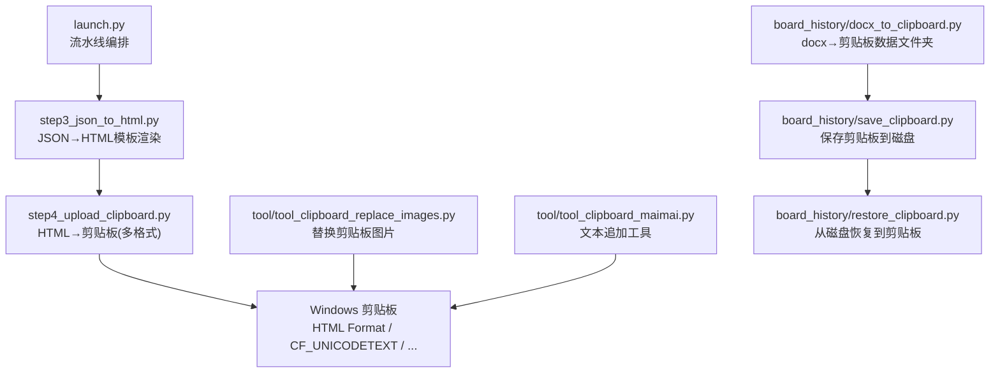
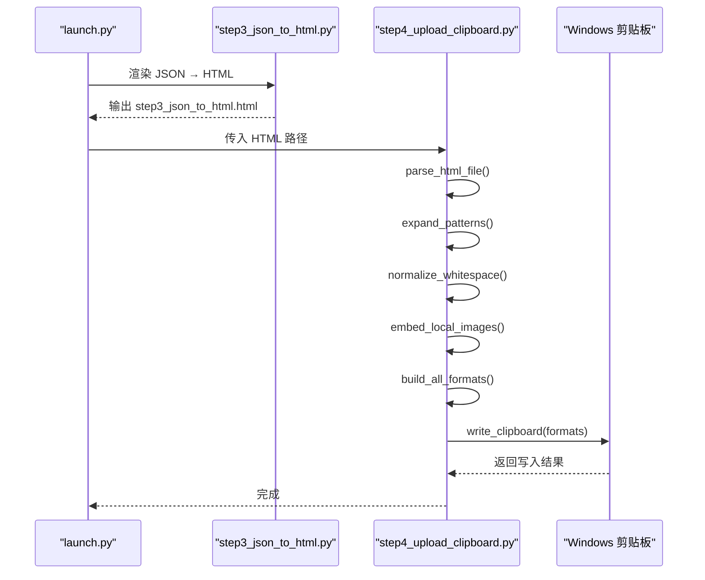
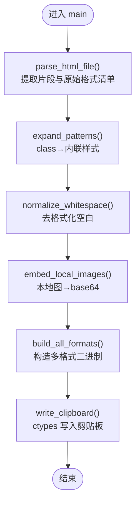
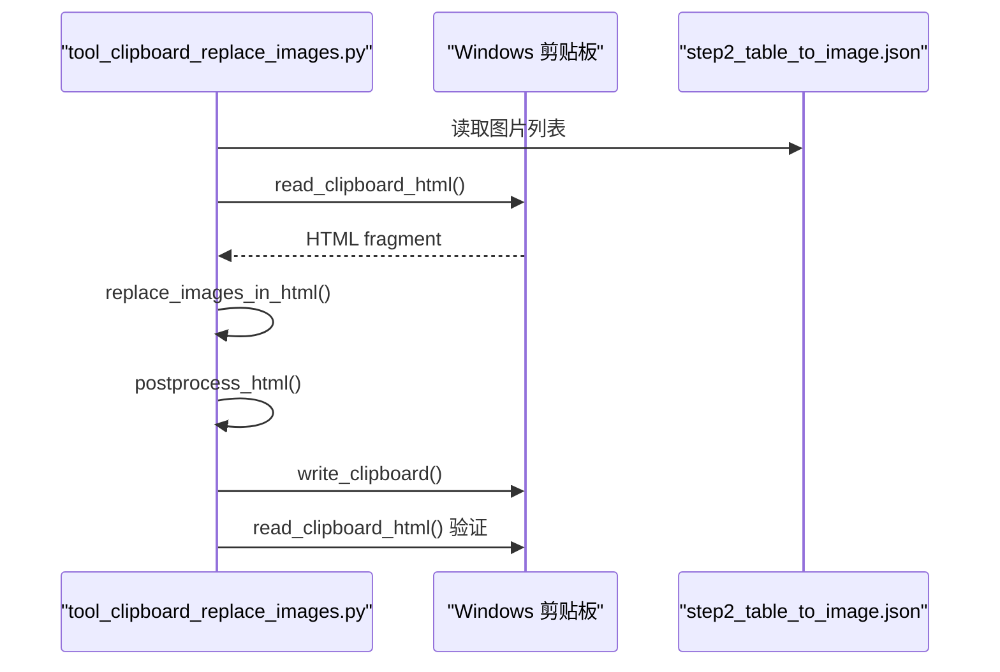
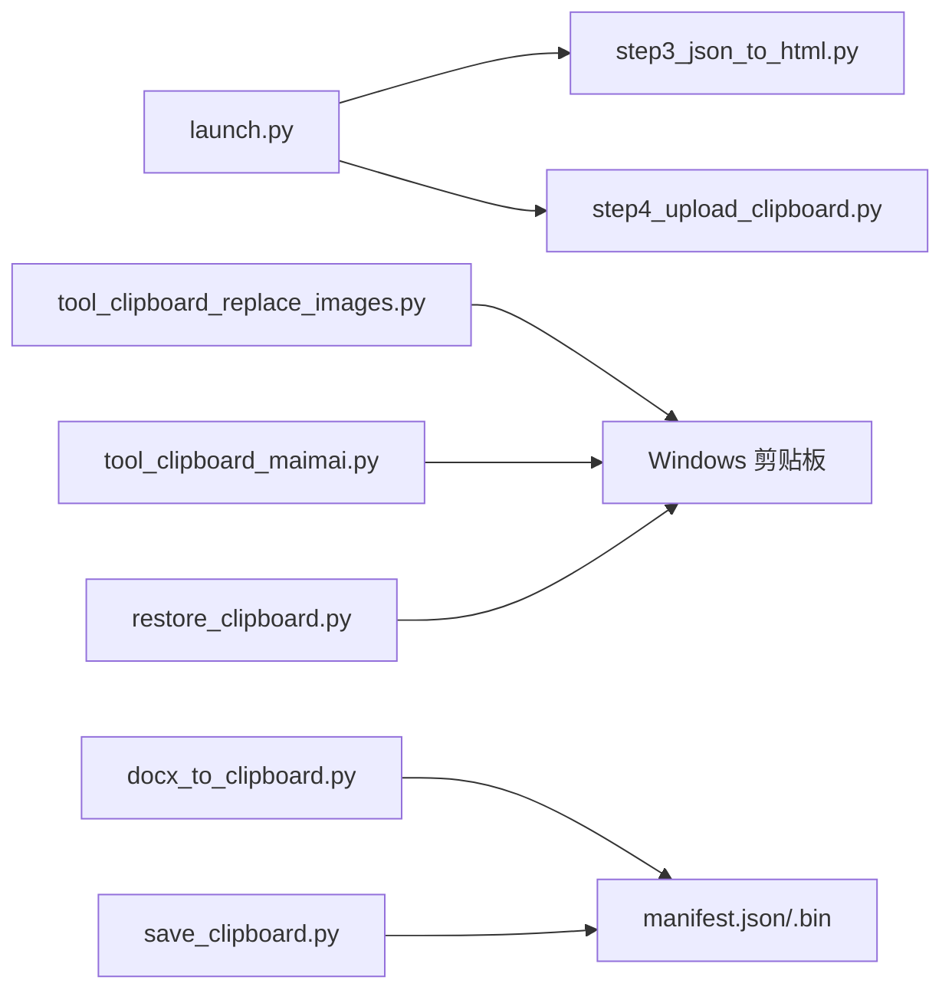

# 剪贴板集成

<cite>
**本文引用的文件列表**
- [config.py](file://config.py)
- [launch.py](file://launch.py)
- [step4_upload_clipboard.py](file://step4_upload_clipboard.py)
- [tool/tool_clipboard_maimai.py](file://tool/tool_clipboard_maimai.py)
- [tool/tool_clipboard_replace_images.py](file://tool/tool_clipboard_replace_images.py)
- [step3_json_to_html.py](file://step3_json_to_html.py)
- [board_history/docx_to_clipboard.py](file://board_history/docx_to_clipboard.py)
- [board_history/restore_clipboard.py](file://board_history/restore_clipboard.py)
- [board_history/save_clipboard.py](file://board_history/save_clipboard.py)
- [tool/add_html.html](file://tool/add_html.html)
</cite>

## 目录
1. [简介](#简介)
2. [项目结构](#项目结构)
3. [核心组件](#核心组件)
4. [架构总览](#架构总览)
5. [详细组件分析](#详细组件分析)
6. [依赖关系分析](#依赖关系分析)
7. [性能与优化](#性能与优化)
8. [故障排查指南](#故障排查指南)
9. [结论](#结论)
10. [附录：接口规范与示例](#附录接口规范与示例)

## 简介
本仓库实现了一套面向 Windows 平台的“剪贴板集成功能”，将 Word 文档内容经多步处理，最终写入系统剪贴板，支持 HTML Format、CF_UNICODETEXT、CF_TEXT、CF_OEMTEXT、CF_LOCALE 等标准格式，并内嵌图片为 base64 data URI，确保粘贴到微信公众号编辑器等平台时图文一致。同时提供工具脚本用于读取/替换剪贴板中的图片、对文本进行追加工具化拼接等。

## 项目结构
- 流水线入口：通过 launch.py 串联多个步骤，最终调用 step4_upload_clipboard.py 将 HTML 写入剪贴板。
- 剪贴板读写：基于 ctypes 直接调用 user32/kernel32 API，构建 Windows 剪贴板多格式数据。
- 工具脚本：
  - tool_clipboard_maimai.py：读取剪贴板纯文本，按规则拼接后写回。
  - tool_clipboard_replace_images.py：从 JSON 中获取图片顺序，替换剪贴板 HTML 中的图片为本地 base64。
- 历史兼容模块：board_history 下提供 docx → 剪贴板数据文件夹的生成与恢复能力（save/restore）。

图表来源
- [launch.py:42-201](file://launch.py#L42-L201)
- [step3_json_to_html.py:121-149](file://step3_json_to_html.py#L121-L149)
- [step4_upload_clipboard.py:436-480](file://step4_upload_clipboard.py#L436-L480)
- [tool/tool_clipboard_replace_images.py:398-498](file://tool/tool_clipboard_replace_images.py#L398-L498)
- [tool/tool_clipboard_maimai.py:179-220](file://tool/tool_clipboard_maimai.py#L179-L220)
- [board_history/docx_to_clipboard.py:415-478](file://board_history/docx_to_clipboard.py#L415-L478)
- [board_history/save_clipboard.py:116-188](file://board_history/save_clipboard.py#L116-L188)
- [board_history/restore_clipboard.py:81-159](file://board_history/restore_clipboard.py#L81-L159)

章节来源
- [launch.py:1-201](file://launch.py#L1-L201)
- [step3_json_to_html.py:1-149](file://step3_json_to_html.py#L1-L149)
- [step4_upload_clipboard.py:1-480](file://step4_upload_clipboard.py#L1-L480)
- [tool/tool_clipboard_maimai.py:1-220](file://tool/tool_clipboard_maimai.py#L1-L220)
- [tool/tool_clipboard_replace_images.py:1-498](file://tool/tool_clipboard_replace_images.py#L1-L498)
- [board_history/docx_to_clipboard.py:1-478](file://board_history/docx_to_clipboard.py#L1-L478)
- [board_history/save_clipboard.py:1-188](file://board_history/save_clipboard.py#L1-L188)
- [board_history/restore_clipboard.py:1-159](file://board_history/restore_clipboard.py#L1-L159)

## 核心组件
- 剪贴板写入主流程（step4_upload_clipboard.py）
  - 解析 HTML 片段与原始格式清单
  - 展开简化类名到内联样式
  - 规范化空白字符
  - 本地图片转 base64 data URI
  - 构建 HTML Format、CF_UNICODETEXT、CF_TEXT/OEMTEXT、CF_LOCALE 等多格式二进制
  - 使用 ctypes 调用 user32/kernel32 写入剪贴板
- 剪贴板图片替换工具（tool_clipboard_replace_images.py）
  - 读取当前剪贴板 HTML Format
  - 依据 JSON 顺序逐一替换  为本地图片 base64
  - 可选 HTML 后处理（清理背景色、margin 归零、去除冗余 span 包裹 br、追加尾部声明）
  - 写回剪贴板并验证
- 剪贴板文本追加工具（tool_clipboard_maimai.py）
  - 读取 CF_UNICODETEXT
  - 拼接固定文案与外部文章条目
  - 写回剪贴板
- 历史兼容（board_history）
  - docx_to_clipboard.py：解析 docx，生成可编辑配置与 HTML，再输出剪贴板数据文件夹（manifest.json + 各格式 .bin）
  - save_clipboard.py：枚举剪贴板所有格式，保存到磁盘
  - restore_clipboard.py：从磁盘 manifest 恢复全部格式到剪贴板

章节来源
- [step4_upload_clipboard.py:1-480](file://step4_upload_clipboard.py#L1-L480)
- [tool/tool_clipboard_replace_images.py:1-498](file://tool/tool_clipboard_replace_images.py#L1-L498)
- [tool/tool_clipboard_maimai.py:1-220](file://tool/tool_clipboard_maimai.py#L1-L220)
- [board_history/docx_to_clipboard.py:1-478](file://board_history/docx_to_clipboard.py#L1-L478)
- [board_history/save_clipboard.py:1-188](file://board_history/save_clipboard.py#L1-L188)
- [board_history/restore_clipboard.py:1-159](file://board_history/restore_clipboard.py#L1-L159)

## 架构总览
下图展示了从 HTML 到剪贴板的完整数据流与关键函数调用链。

图表来源
- [launch.py:157-166](file://launch.py#L157-L166)
- [step3_json_to_html.py:121-149](file://step3_json_to_html.py#L121-L149)
- [step4_upload_clipboard.py:436-480](file://step4_upload_clipboard.py#L436-L480)

## 详细组件分析

### 组件一：HTML 到剪贴板（step4_upload_clipboard.py）
- 功能要点
  - 解析 HTML 片段与 cb-raw-data 清单，若缺失则重建必要格式
  - 将简化 class 标签扩展为 Xiumi 风格内联样式
  - 规范化空白，保证剪贴板渲染稳定
  - 将本地图片转为 base64 data URI，提升跨应用粘贴兼容性
  - 构建 HTML Format 二进制（含 Version/StartHTML/EndHTML/StartFragment/EndFragment 头）
  - 生成 CF_UNICODETEXT、CF_TEXT/OEMTEXT、CF_LOCALE 等
  - 使用 ctypes 调用 user32.kernel32 写入剪贴板
- 关键算法与数据结构
  - HTML Format 头部偏移计算：迭代两次以修正 header 长度变化导致的偏移误差
  - 正则匹配与替换：
、、 等
  - 编码策略：UTF-16LE 用于 CF_UNICODETEXT；CP936 或 UTF-8 用于 CF_TEXT/OEMTEXT
- 错误处理
  - 打开剪贴板失败重试
  - GlobalAlloc/GloabalLock/SetClipboardData 失败日志与资源释放
  - 图片缺失告警并跳过
- 复杂度
  - 主要开销在正则替换与 base64 编码，时间复杂度近似 O(n)，n 为 HTML 大小
  - 内存占用与图片数量及大小线性相关

图表来源
- [step4_upload_clipboard.py:436-480](file://step4_upload_clipboard.py#L436-L480)

章节来源
- [step4_upload_clipboard.py:59-67](file://step4_upload_clipboard.py#L59-L67)
- [step4_upload_clipboard.py:72-109](file://step4_upload_clipboard.py#L72-L109)
- [step4_upload_clipboard.py:115-172](file://step4_upload_clipboard.py#L115-L172)
- [step4_upload_clipboard.py:175-188](file://step4_upload_clipboard.py#L175-L188)
- [step4_upload_clipboard.py:194-222](file://step4_upload_clipboard.py#L194-L222)
- [step4_upload_clipboard.py:228-268](file://step4_upload_clipboard.py#L228-L268)
- [step4_upload_clipboard.py:271-285](file://step4_upload_clipboard.py#L271-L285)
- [step4_upload_clipboard.py:288-365](file://step4_upload_clipboard.py#L288-L365)
- [step4_upload_clipboard.py:371-431](file://step4_upload_clipboard.py#L371-L431)
- [step4_upload_clipboard.py:436-480](file://step4_upload_clipboard.py#L436-L480)

### 组件二：剪贴板图片替换工具（tool_clipboard_replace_images.py）
- 功能要点
  - 读取当前剪贴板 HTML Format，解析 fragment
  - 根据 step2_table_to_image.json 的图片顺序，逐一替换  为本地图片 base64
  - 可选 HTML 后处理：移除 background-color、margin 归零、清理冗余 span 包裹 br、追加 add_html.html 尾部
  - 写回剪贴板并回读验证
- 关键算法与数据结构
  - 从剪贴板读取 HTML Format：注册自定义格式 ID，解析头部字节偏移，切片解码
  - 正则匹配 ，按索引顺序替换，避免偏移量变化（从后往前替换）
  - 后处理正则批量替换样式属性
- 错误处理
  - 注册格式失败、打开剪贴板失败、GetClipboardData 为空等异常抛出
  - 图片数量不匹配时中止替换
  - 写入失败打印 GetLastError 辅助定位
- 复杂度
  - 正则扫描与字符串替换为主，O(n)；base64 编码与 IO 为额外开销

图表来源
- [tool/tool_clipboard_replace_images.py:76-139](file://tool/tool_clipboard_replace_images.py#L76-L139)
- [tool/tool_clipboard_replace_images.py:289-336](file://tool/tool_clipboard_replace_images.py#L289-L336)
- [tool/tool_clipboard_replace_images.py:342-392](file://tool/tool_clipboard_replace_images.py#L342-L392)
- [tool/tool_clipboard_replace_images.py:398-498](file://tool/tool_clipboard_replace_images.py#L398-L498)

章节来源
- [tool/tool_clipboard_replace_images.py:67-71](file://tool/tool_clipboard_replace_images.py#L67-L71)
- [tool/tool_clipboard_replace_images.py:144-178](file://tool/tool_clipboard_replace_images.py#L144-L178)
- [tool/tool_clipboard_replace_images.py:181-191](file://tool/tool_clipboard_replace_images.py#L181-L191)
- [tool/tool_clipboard_replace_images.py:194-263](file://tool/tool_clipboard_replace_images.py#L194-L263)
- [tool/tool_clipboard_replace_images.py:268-283](file://tool/tool_clipboard_replace_images.py#L268-L283)
- [tool/tool_clipboard_replace_images.py:289-336](file://tool/tool_clipboard_replace_images.py#L289-L336)
- [tool/tool_clipboard_replace_images.py:342-392](file://tool/tool_clipboard_replace_images.py#L342-L392)
- [tool/tool_clipboard_replace_images.py:398-498](file://tool/tool_clipboard_replace_images.py#L398-L498)

### 组件三：剪贴板文本追加工具（tool_clipboard_maimai.py）
- 功能要点
  - 读取 CF_UNICODETEXT，取前 600 字
  - 解析 wx_content_list.txt 文章条目
  - 拼接“展开内容如下”和“其他优质内容分享”区块
  - 规范化段落后写回剪贴板
- 关键点
  - 使用 ctypes 安全读取/写入宽字符串
  - 终端 GBK 安全打印封装
- 复杂度
  - 文本处理 O(n)，IO 与编码开销较小

章节来源
- [tool/tool_clipboard_maimai.py:46-81](file://tool/tool_clipboard_maimai.py#L46-L81)
- [tool/tool_clipboard_maimai.py:83-103](file://tool/tool_clipboard_maimai.py#L83-L103)
- [tool/tool_clipboard_maimai.py:105-132](file://tool/tool_clipboard_maimai.py#L105-L132)
- [tool/tool_clipboard_maimai.py:135-176](file://tool/tool_clipboard_maimai.py#L135-L176)
- [tool/tool_clipboard_maimai.py:179-220](file://tool/tool_clipboard_maimai.py#L179-L220)

### 组件四：历史兼容（docx → 剪贴板数据文件夹 → 恢复）
- docx_to_clipboard.py
  - 解析 docx XML，分类标题/正文/空行，生成可编辑 config.json
  - 生成 Xiumi 风格 HTML 片段，构建 HTML Format 二进制
  - 输出 manifest.json 与各格式 .bin 文件
- save_clipboard.py
  - 枚举剪贴板所有格式，保存为 .bin 与 manifest.json
- restore_clipboard.py
  - 读取 manifest.json，逐个格式恢复至剪贴板
- 关键点
  - 统一使用 RegisterClipboardFormatW 解析自定义格式 ID
  - 全局内存分配与拷贝遵循 64 位安全签名

章节来源
- [board_history/docx_to_clipboard.py:33-116](file://board_history/docx_to_clipboard.py#L33-L116)
- [board_history/docx_to_clipboard.py:122-170](file://board_history/docx_to_clipboard.py#L122-L170)
- [board_history/docx_to_clipboard.py:176-200](file://board_history/docx_to_clipboard.py#L176-L200)
- [board_history/docx_to_clipboard.py:268-294](file://board_history/docx_to_clipboard.py#L268-L294)
- [board_history/docx_to_clipboard.py:300-360](file://board_history/docx_to_clipboard.py#L300-L360)
- [board_history/docx_to_clipboard.py:366-409](file://board_history/docx_to_clipboard.py#L366-L409)
- [board_history/docx_to_clipboard.py:415-478](file://board_history/docx_to_clipboard.py#L415-L478)
- [board_history/save_clipboard.py:105-113](file://board_history/save_clipboard.py#L105-L113)
- [board_history/save_clipboard.py:116-188](file://board_history/save_clipboard.py#L116-L188)
- [board_history/restore_clipboard.py:65-78](file://board_history/restore_clipboard.py#L65-L78)
- [board_history/restore_clipboard.py:81-159](file://board_history/restore_clipboard.py#L81-L159)

## 依赖关系分析
- 平台依赖
  - Windows 平台：ctypes.windll.user32、kernel32 调用
  - 64 位安全：指针类型使用 c_void_p，避免截断
- 外部依赖
  - 无第三方库，仅使用 Python 标准库（re、json、struct、base64、os、sys、time、zipfile、xml.etree.ElementTree）
- 内部耦合
  - launch.py 作为编排器，依赖 step3/step4 等模块
  - 工具脚本独立运行，但共享剪贴板 API 模式

图表来源
- [launch.py:42-201](file://launch.py#L42-L201)
- [step3_json_to_html.py:121-149](file://step3_json_to_html.py#L121-L149)
- [step4_upload_clipboard.py:436-480](file://step4_upload_clipboard.py#L436-L480)
- [tool/tool_clipboard_replace_images.py:398-498](file://tool/tool_clipboard_replace_images.py#L398-L498)
- [tool/tool_clipboard_maimai.py:179-220](file://tool/tool_clipboard_maimai.py#L179-L220)
- [board_history/docx_to_clipboard.py:415-478](file://board_history/docx_to_clipboard.py#L415-L478)
- [board_history/save_clipboard.py:116-188](file://board_history/save_clipboard.py#L116-L188)
- [board_history/restore_clipboard.py:81-159](file://board_history/restore_clipboard.py#L81-L159)

章节来源
- [launch.py:1-201](file://launch.py#L1-L201)
- [step3_json_to_html.py:1-149](file://step3_json_to_html.py#L1-L149)
- [step4_upload_clipboard.py:1-480](file://step4_upload_clipboard.py#L1-L480)
- [tool/tool_clipboard_replace_images.py:1-498](file://tool/tool_clipboard_replace_images.py#L1-L498)
- [tool/tool_clipboard_maimai.py:1-220](file://tool/tool_clipboard_maimai.py#L1-L220)
- [board_history/docx_to_clipboard.py:1-478](file://board_history/docx_to_clipboard.py#L1-L478)
- [board_history/save_clipboard.py:1-188](file://board_history/save_clipboard.py#L1-L188)
- [board_history/restore_clipboard.py:1-159](file://board_history/restore_clipboard.py#L1-L159)

## 性能与优化
- 正则表达式
  - 建议预编译常用正则（如 img 匹配、样式替换），减少重复编译开销
- 图片嵌入
  - 大图片 base64 会显著增大 HTML 体积，建议在必要时启用压缩或外链策略（需目标平台支持）
- 剪贴板写入
  - 批量写入时尽量合并内存分配与拷贝，减少锁/解锁次数
- 文本处理
  - 长文本清洗可考虑分块处理，降低单次正则替换成本

[本节为通用指导，无需特定文件引用]

## 故障排查指南
- 无法打开剪贴板
  - 现象：OpenClipboard 失败
  - 排查：关闭占用剪贴板的程序；增加重试间隔；检查权限
  - 参考：[step4_upload_clipboard.py:371-384](file://step4_upload_clipboard.py#L371-L384)、[tool/tool_clipboard_maimai.py:46-54](file://tool/tool_clipboard_maimai.py#L46-L54)
- SetClipboardData 失败
  - 现象：写入某格式失败
  - 排查：查看 GetLastError；确认格式 ID 是否有效；检查内存分配是否成功
  - 参考：[tool/tool_clipboard_replace_images.py:251-258](file://tool/tool_clipboard_replace_images.py#L251-L258)、[board_history/restore_clipboard.py:137-143](file://board_history/restore_clipboard.py#L137-L143)
- 图片未正确内嵌
  - 现象：粘贴后图片丢失
  - 排查：确认 embed_local_images 是否找到文件；检查 data URI 前缀与 MIME 类型
  - 参考：[step4_upload_clipboard.py:194-222](file://step4_upload_clipboard.py#L194-L222)
- HTML 渲染错位
  - 现象：粘贴后样式错乱
  - 排查：检查 expand_patterns 与 normalize_whitespace 的输出；对比调试 HTML
  - 参考：[step4_upload_clipboard.py:115-188](file://step4_upload_clipboard.py#L115-L188)
- 图片替换顺序不一致
  - 现象：替换错位
  - 排查：确认 JSON 图片顺序与剪贴板  数量一致；从后往前替换避免偏移变化
  - 参考：[tool/tool_clipboard_replace_images.py:289-336](file://tool/tool_clipboard_replace_images.py#L289-L336)

章节来源
- [step4_upload_clipboard.py:371-431](file://step4_upload_clipboard.py#L371-L431)
- [tool/tool_clipboard_replace_images.py:251-258](file://tool/tool_clipboard_replace_images.py#L251-L258)
- [board_history/restore_clipboard.py:137-143](file://board_history/restore_clipboard.py#L137-L143)
- [tool/tool_clipboard_maimai.py:46-54](file://tool/tool_clipboard_maimai.py#L46-L54)

## 结论
本项目通过严格的 HTML 片段处理与 Windows 剪贴板多格式写入，实现了高保真图文粘贴体验。ctypes 直接调用系统 API 保证了与原生应用的兼容性；base64 内嵌图片提升了跨平台粘贴稳定性。配套工具提供了灵活的二次处理能力，适合自动化内容生产与发布场景。

[本节为总结性内容，无需特定文件引用]

## 附录：接口规范与示例

### 主要函数接口与参数规范
- step4_upload_clipboard.main(html_path)
  - 输入：HTML 文件路径（包含 article id="clipboard-content" 与 script id="cb-raw-data"）
  - 行为：解析、展开、规范化、内嵌图片、构建多格式、写入剪贴板
  - 输出：控制台日志与剪贴板更新
  - 参考：[step4_upload_clipboard.py:436-480](file://step4_upload_clipboard.py#L436-L480)
- tool_clipboard_replace_images.main(input_dir)
  - 输入：文章实例目录（含 process/step2_table_to_image.json）
  - 行为：读取剪贴板 HTML，按 JSON 顺序替换图片为 base64，可选后处理，写回剪贴板并验证
  - 输出：控制台日志与剪贴板更新
  - 参考：[tool/tool_clipboard_replace_images.py:398-498](file://tool/tool_clipboard_replace_images.py#L398-L498)
- tool_clipboard_maimai.main()
  - 输入：剪贴板文本、wx_content_list.txt
  - 行为：拼接文案并写回剪贴板
  - 输出：控制台日志与剪贴板更新
  - 参考：[tool/tool_clipboard_maimai.py:179-220](file://tool/tool_clipboard_maimai.py#L179-L220)
- board_history.docx_to_clipboard.run(docx_path, output_dir=None)
  - 输入：docx 文件路径、可选输出目录
  - 行为：解析 docx，生成 config.json、HTML、manifest.json 与各格式 .bin
  - 输出：控制台日志与输出目录
  - 参考：[board_history/docx_to_clipboard.py:415-478](file://board_history/docx_to_clipboard.py#L415-L478)
- board_history.save_clipboard.save_clipboard(output_dir)
  - 输入：输出目录
  - 行为：枚举剪贴板所有格式并保存
  - 输出：控制台日志与输出目录
  - 参考：[board_history/save_clipboard.py:116-188](file://board_history/save_clipboard.py#L116-L188)
- board_history.restore_clipboard.restore_clipboard(input_dir)
  - 输入：包含 manifest.json 的目录
  - 行为：恢复所有格式到剪贴板
  - 输出：控制台日志
  - 参考：[board_history/restore_clipboard.py:81-159](file://board_history/restore_clipboard.py#L81-L159)

### 支持的剪贴板格式与说明
- HTML Format（ID 49393）：Windows 专用富文本格式，包含版本与片段偏移头
- CF_UNICODETEXT（ID 13）：UTF-16LE 文本，末尾双 null
- CF_TEXT（ID 1）、CF_OEMTEXT（ID 7）：ANSI/OEM 文本，末尾单 null
- CF_LOCALE（ID 16）：区域设置（zh-CN=2052）
- 其他 Chromium 内部格式：优先复用原始数据（来自 cb-raw-data）

章节来源
- [step4_upload_clipboard.py:288-365](file://step4_upload_clipboard.py#L288-L365)
- [board_history/docx_to_clipboard.py:366-409](file://board_history/docx_to_clipboard.py#L366-L409)

### 自定义格式支持方法（示例思路）
- 注册自定义格式 ID
  - 使用 RegisterClipboardFormatW 获取运行时 ID
  - 参考：[step4_upload_clipboard.py:59-67](file://step4_upload_clipboard.py#L59-L67)、[tool/tool_clipboard_replace_images.py:67-71](file://tool/tool_clipboard_replace_images.py#L67-L71)
- 准备二进制数据
  - 构造符合目标应用规范的字节序列
- 写入剪贴板
  - GlobalAlloc/GloabalLock/memmove/SetClipboardData
  - 参考：[step4_upload_clipboard.py:371-431](file://step4_upload_clipboard.py#L371-L431)
- 读取与验证
  - GetClipboardData/GlobalSize/string_at 读取并校验
  - 参考：[tool/tool_clipboard_replace_images.py:76-139](file://tool/tool_clipboard_replace_images.py#L76-L139)

### 跨平台兼容性与替代方案
- 当前实现基于 Windows API，非 Windows 平台不可用
- 替代方案
  - Linux：使用 xclip/xsel 或 pyperclip（X11/Wayland）
  - macOS：使用 pbcopy/pbpaste 或 AppKit NSPasteboard
  - 跨平台库：pyperclip（注意不同平台行为差异）
- 注意事项
  - 不同平台对富文本与图片内嵌的支持差异较大，建议降级为纯文本或外链图片

[本节为通用指导，无需特定文件引用]

### 错误处理策略与调试工具使用方法
- 错误处理策略
  - 打开剪贴板失败：重试机制与明确提示
  - 内存操作失败：记录错误码并释放资源
  - 图片缺失：告警并跳过，不影响整体流程
- 调试工具
  - 保存内联样式 HTML：step4 输出 step4_upload_clipboard.html
  - 前后对比：tool_clipboard_replace_images 生成 _debug_clipboard_before.html 与 _debug_clipboard_after.html
  - 回读验证：工具自动回读剪贴板并统计 base64 图片数量
  - 参考：
    - [step4_upload_clipboard.py:455-469](file://step4_upload_clipboard.py#L455-L469)
    - [tool/tool_clipboard_replace_images.py:431-444](file://tool/tool_clipboard_replace_images.py#L431-L444)
    - [tool/tool_clipboard_replace_images.py:470-490](file://tool/tool_clipboard_replace_images.py#L470-L490)

章节来源
- [step4_upload_clipboard.py:455-469](file://step4_upload_clipboard.py#L455-L469)
- [tool/tool_clipboard_replace_images.py:431-444](file://tool/tool_clipboard_replace_images.py#L431-L444)
- [tool/tool_clipboard_replace_images.py:470-490](file://tool/tool_clipboard_replace_images.py#L470-L490)