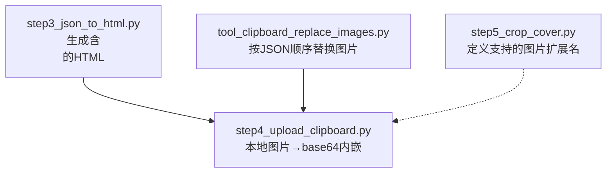
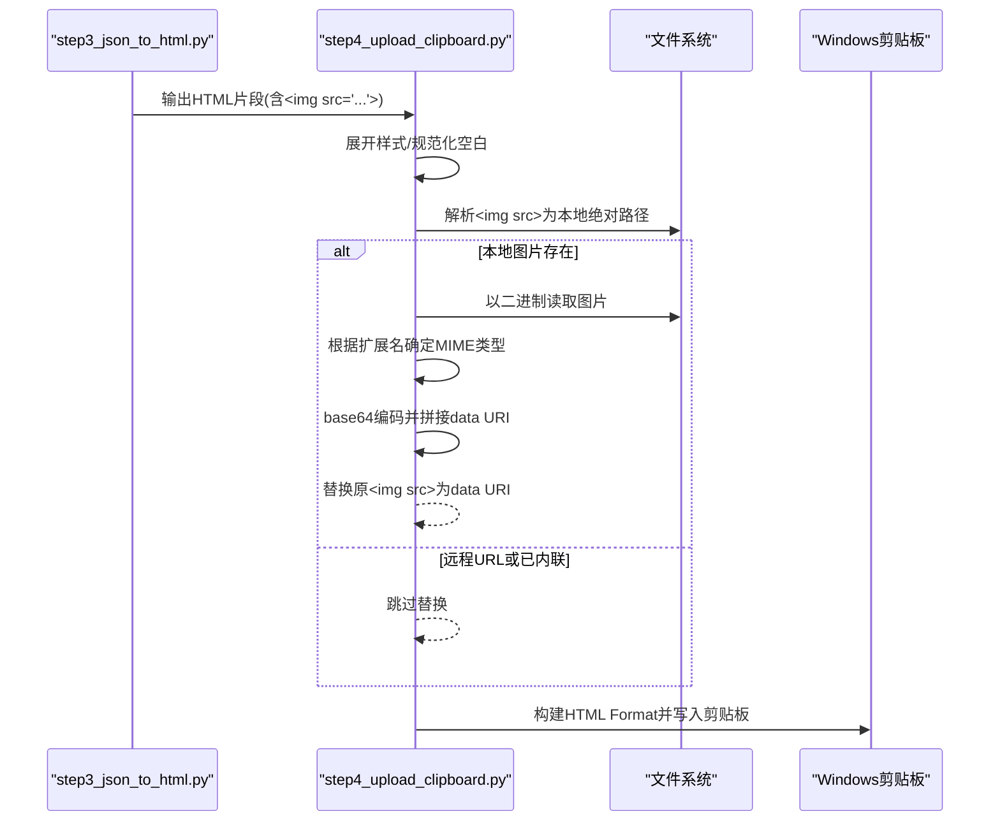
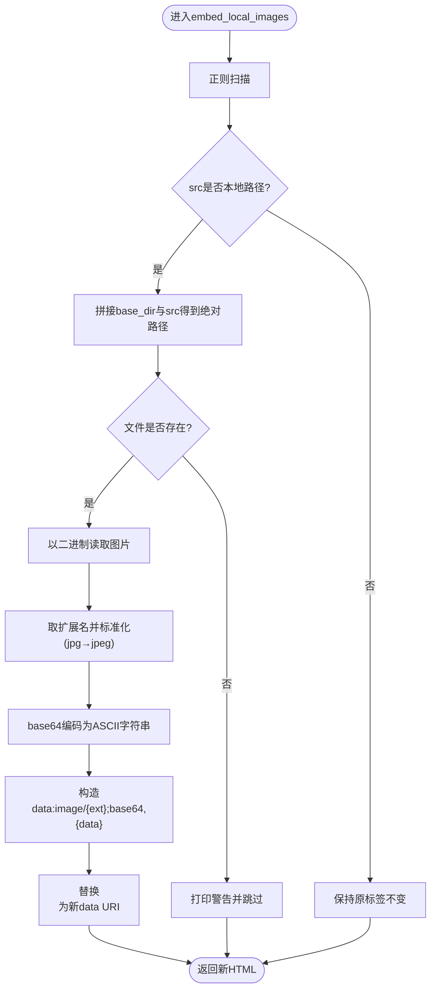
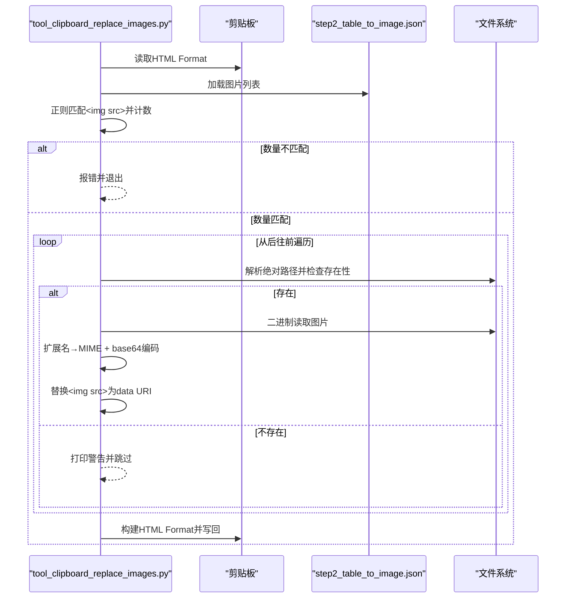
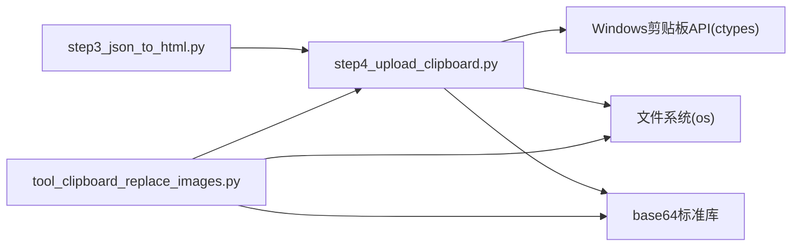

# 图片内嵌处理

<cite>
**本文引用的文件列表**
- [step4_upload_clipboard.py](file://step4_upload_clipboard.py)
- [tool_clipboard_replace_images.py](file://tool/tool_clipboard_replace_images.py)
- [step3_json_to_html.py](file://step3_json_to_html.py)
- [step5_crop_cover.py](file://step5_crop_cover.py)
</cite>

## 目录
1. [简介](#简介)
2. [项目结构](#项目结构)
3. [核心组件](#核心组件)
4. [架构总览](#架构总览)
5. [详细组件分析](#详细组件分析)
6. [依赖关系分析](#依赖关系分析)
7. [性能与优化](#性能与优化)
8. [故障排查指南](#故障排查指南)
9. [结论](#结论)

## 简介
本技术文档聚焦于“图片内嵌处理”功能，系统会将本地图片转换为 base64 data URI，并替换 HTML 中的  标签。该能力用于将文章正文中的外部图片资源内联到剪贴板 HTML 中，从而在微信公众号等场景下粘贴时能正确显示图片。文档覆盖以下要点：
- 完整流程：文件路径解析、MIME 类型识别、二进制数据编码
- 正则匹配 img 标签逻辑：src 属性提取与 URL 过滤规则
- 图片格式支持差异：JPEG、PNG、GIF 等的处理方式
- base64 编码的性能考量与大小优化策略
- 错误处理机制：文件不存在、权限不足等情况的处理方案
- 具体代码示例（以源码路径引用形式提供）

## 项目结构
与图片内嵌处理直接相关的核心脚本如下：
- step4_upload_clipboard.py：主流程，负责从 HTML 片段中提取内容、展开样式、规范化空白、将本地图片转为 base64 data URI，并写入 Windows 剪贴板
- tool_clipboard_replace_images.py：独立工具，按 JSON 顺序替换剪贴板 HTML 中的图片为本地图片的 base64
- step3_json_to_html.py：生成包含  的 HTML 片段（供后续步骤内嵌）
- step5_crop_cover.py：封面裁剪工具，定义了支持的图片扩展名集合，便于理解系统对图片格式的通用约定

图表来源
- [step3_json_to_html.py:70-78](file://step3_json_to_html.py#L70-L78)
- [step4_upload_clipboard.py:194-222](file://step4_upload_clipboard.py#L194-L222)
- [tool_clipboard_replace_images.py:289-336](file://tool/tool_clipboard_replace_images.py#L289-L336)
- [step5_crop_cover.py:27-28](file://step5_crop_cover.py#L27-L28)

章节来源
- [step3_json_to_html.py:70-78](file://step3_json_to_html.py#L70-L78)
- [step4_upload_clipboard.py:194-222](file://step4_upload_clipboard.py#L194-L222)
- [tool_clipboard_replace_images.py:289-336](file://tool/tool_clipboard_replace_images.py#L289-L336)
- [step5_crop_cover.py:27-28](file://step5_crop_cover.py#L27-L28)

## 核心组件
- 本地图片内嵌函数：将  替换为 data:image/{ext};base64,...
- 正则匹配器：定位所有  标签并提取 src
- MIME 类型推断：基于文件扩展名映射到 image/jpeg/png/gif 等
- 二进制读取与 base64 编码：以二进制模式读取图片并编码为 ASCII 字符串
- 过滤规则：跳过远程 URL 和已内联的 data URI，避免重复处理
- 错误处理：文件不存在或不可读时给出警告并跳过

章节来源
- [step4_upload_clipboard.py:194-222](file://step4_upload_clipboard.py#L194-L222)
- [tool_clipboard_replace_images.py:289-336](file://tool/tool_clipboard_replace_images.py#L289-L336)

## 架构总览
下图展示了从 HTML 生成到图片内嵌再到剪贴板写入的整体流程。

图表来源
- [step3_json_to_html.py:70-78](file://step3_json_to_html.py#L70-L78)
- [step4_upload_clipboard.py:194-222](file://step4_upload_clipboard.py#L194-L222)
- [step4_upload_clipboard.py:228-268](file://step4_upload_clipboard.py#L228-L268)

## 详细组件分析

### 组件A：本地图片内嵌（step4_upload_clipboard.py）
- 功能：遍历 HTML 片段中的所有 ，若 src 是本地路径则读取图片并替换为 base64 data URI；否则保留原样
- 关键实现点：
  - 正则匹配：]+src="([^"]+)"，捕获 src 值
  - URL 过滤：跳过 http://、https://、data: 开头的 src
  - 路径解析：将相对路径与 base_dir 拼接，统一斜杠为系统分隔符
  - 文件存在性检查：os.path.isfile(img_path)，不存在则打印警告并跳过
  - MIME 类型推断：取扩展名，jpg→jpeg 标准化
  - 二进制读取与编码：open(..., 'rb') + base64.b64encode(...)
  - 替换策略：使用 re.sub 回调函数原地替换

图表来源
- [step4_upload_clipboard.py:194-222](file://step4_upload_clipboard.py#L194-L222)

章节来源
- [step4_upload_clipboard.py:194-222](file://step4_upload_clipboard.py#L194-L222)

### 组件B：按顺序替换剪贴板图片（tool_clipboard_replace_images.py）
- 功能：从 JSON 获取图片列表，按出现顺序逐一替换剪贴板 HTML 中的  为本地图片的 base64
- 关键实现点：
  - 正则匹配：re.compile(r']+src="([^"]+)"', re.IGNORECASE)
  - 数量校验：剪贴板中  数量必须与 JSON 图片数量一致，否则放弃替换
  - 从后往前替换：避免字符串偏移量变化导致索引错乱
  - 路径解析与存在性检查：同组件A
  - MIME 类型与 base64 编码：同组件A
  - 写回剪贴板：构建 HTML Format 与纯文本等格式并写入

图表来源
- [tool_clipboard_replace_images.py:289-336](file://tool/tool_clipboard_replace_images.py#L289-L336)
- [tool_clipboard_replace_images.py:144-178](file://tool/tool_clipboard_replace_images.py#L144-L178)

章节来源
- [tool_clipboard_replace_images.py:289-336](file://tool/tool_clipboard_replace_images.py#L289-L336)
- [tool_clipboard_replace_images.py:144-178](file://tool/tool_clipboard_replace_images.py#L144-L178)

### 组件C：HTML 生成与图片渲染（step3_json_to_html.py）
- 功能：将 JSON 元素渲染为 HTML，其中图片元素渲染为  并居中显示
- 关键点：
  - render_image(image_path) 生成 

  - 路径统一为正斜杠，便于后续路径解析

章节来源
- [step3_json_to_html.py:70-78](file://step3_json_to_html.py#L70-L78)

### 组件D：图片格式支持约定（step5_crop_cover.py）
- 功能：定义系统支持的图片扩展名集合，便于理解整体对图片格式的支持范围
- 关键点：
  - IMAGE_EXTS = {'.jpg', '.jpeg', '.png', '.bmp', '.webp', '.tiff', '.tif'}
  - 该集合可用于判断是否属于常见图片格式，辅助 MIME 类型推断与处理分支

章节来源
- [step5_crop_cover.py:27-28](file://step5_crop_cover.py#L27-L28)

## 依赖关系分析
- 模块耦合：
  - step4_upload_clipboard.py 依赖 step3_json_to_html.py 的输出（HTML 片段）
  - tool_clipboard_replace_images.py 依赖剪贴板内容与 JSON 列表
  - 两者均依赖操作系统文件系统 API 与 base64 标准库
- 外部依赖：
  - Windows 剪贴板 API（ctypes.windll.user32/kernel32）
  - Python 标准库：re、os、base64、struct、json、sys

图表来源
- [step4_upload_clipboard.py:194-222](file://step4_upload_clipboard.py#L194-L222)
- [tool_clipboard_replace_images.py:289-336](file://tool/tool_clipboard_replace_images.py#L289-L336)

章节来源
- [step4_upload_clipboard.py:194-222](file://step4_upload_clipboard.py#L194-L222)
- [tool_clipboard_replace_images.py:289-336](file://tool/tool_clipboard_replace_images.py#L289-L336)

## 性能与优化
- base64 编码开销：
  - 大图片会导致 HTML 体积显著膨胀（约增加 33%），影响内存占用与传输效率
  - 建议对超大图片进行压缩或分片策略（如仅内嵌缩略图，正文链接大图）
- 正则匹配复杂度：
  - 使用非贪婪匹配与预编译正则可减少回溯成本
  - 对于长 HTML 片段，建议先统计  数量再决定是否批量处理
- 文件 I/O 优化：
  - 使用二进制流读取，避免额外解码/编码
  - 可考虑缓存已处理的图片路径与 base64 结果，避免重复读取
- MIME 类型推断：
  - 基于扩展名的方式简单高效，但需确保扩展名与实际内容一致
  - 如需更高可靠性，可在必要时结合文件头魔数检测（当前未实现）

[本节为通用性能讨论，无需特定文件分析]

## 故障排查指南
- 文件不存在：
  - 现象：打印警告并跳过该图片
  - 原因：路径拼接错误或图片被移动/删除
  - 处理：检查 base_dir 与 src 相对路径是否正确，确认图片实际存在
  - 参考位置：
    - [step4_upload_clipboard.py:207-210](file://step4_upload_clipboard.py#L207-L210)
    - [tool_clipboard_replace_images.py:317-319](file://tool/tool_clipboard_replace_images.py#L317-L319)
- 权限不足：
  - 现象：打开文件失败或读取异常
  - 处理：确保运行进程具有读取权限；在 Windows 上以管理员身份运行或调整文件权限
  - 注意：当前代码未显式捕获 IO 异常，建议在 open() 处增加 try/except 并记录错误日志
- 正则匹配失败：
  - 现象：未找到  或数量不匹配
  - 处理：检查 HTML 结构是否符合预期；在工具模式中要求数量严格一致
  - 参考位置：
    - [step4_upload_clipboard.py:222](file://step4_upload_clipboard.py#L222)
    - [tool_clipboard_replace_images.py:298-303](file://tool/tool_clipboard_replace_images.py#L298-L303)
- 远程 URL 或已内联 data URI：
  - 现象：这些 src 不会被替换
  - 处理：这是预期行为，避免重复内嵌与网络请求
  - 参考位置：
    - [step4_upload_clipboard.py:204-205](file://step4_upload_clipboard.py#L204-L205)

章节来源
- [step4_upload_clipboard.py:204-210](file://step4_upload_clipboard.py#L204-L210)
- [tool_clipboard_replace_images.py:298-319](file://tool/tool_clipboard_replace_images.py#L298-L319)

## 结论
本项目实现了可靠的本地图片内嵌处理流程，通过正则匹配与路径解析，将  替换为 base64 data URI，满足剪贴板 HTML 的兼容性需求。系统在 MIME 类型推断、URL 过滤、错误提示等方面具备良好健壮性。针对大图片带来的体积膨胀问题，建议引入压缩与缓存策略以提升性能。未来可考虑增强 MIME 类型检测（文件头魔数）与更完善的异常处理，进一步提升鲁棒性与可维护性。