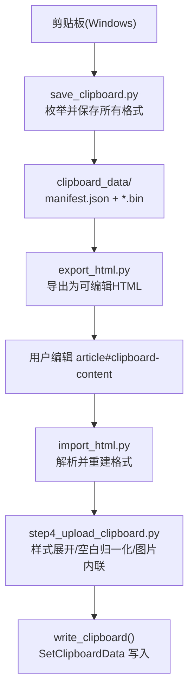
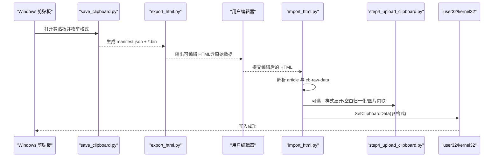
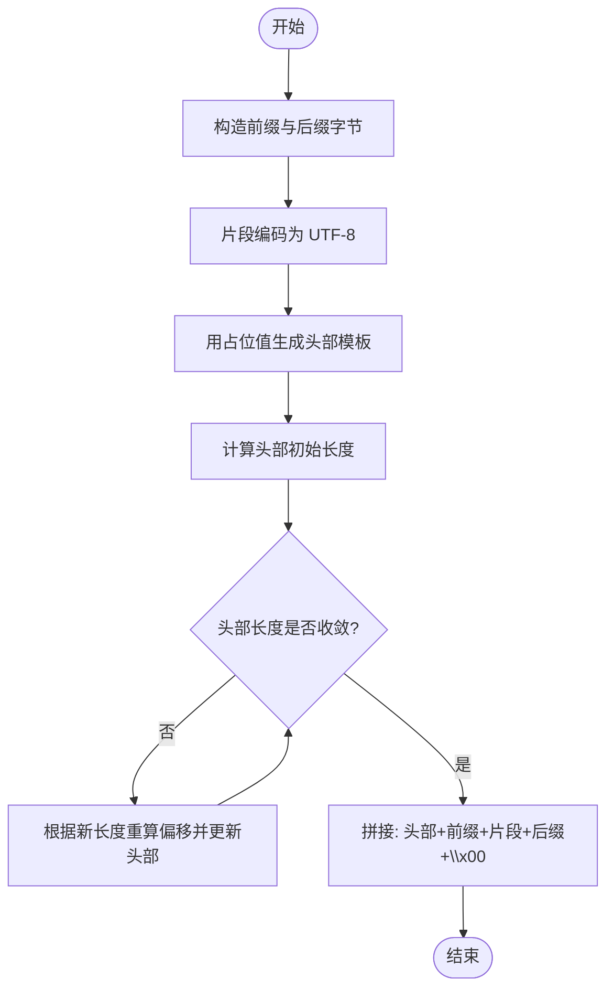
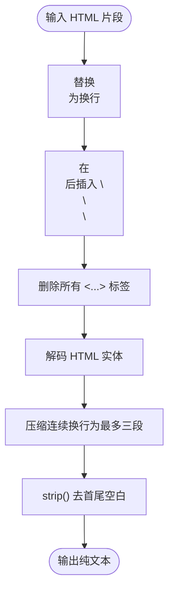
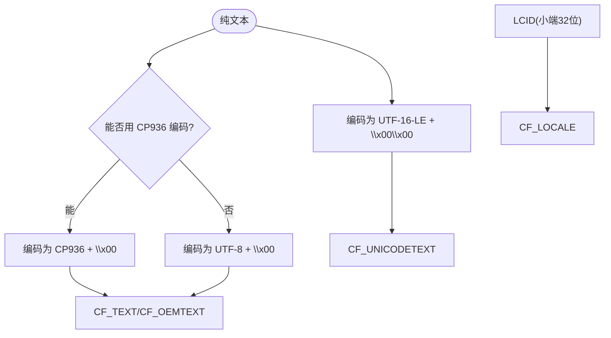
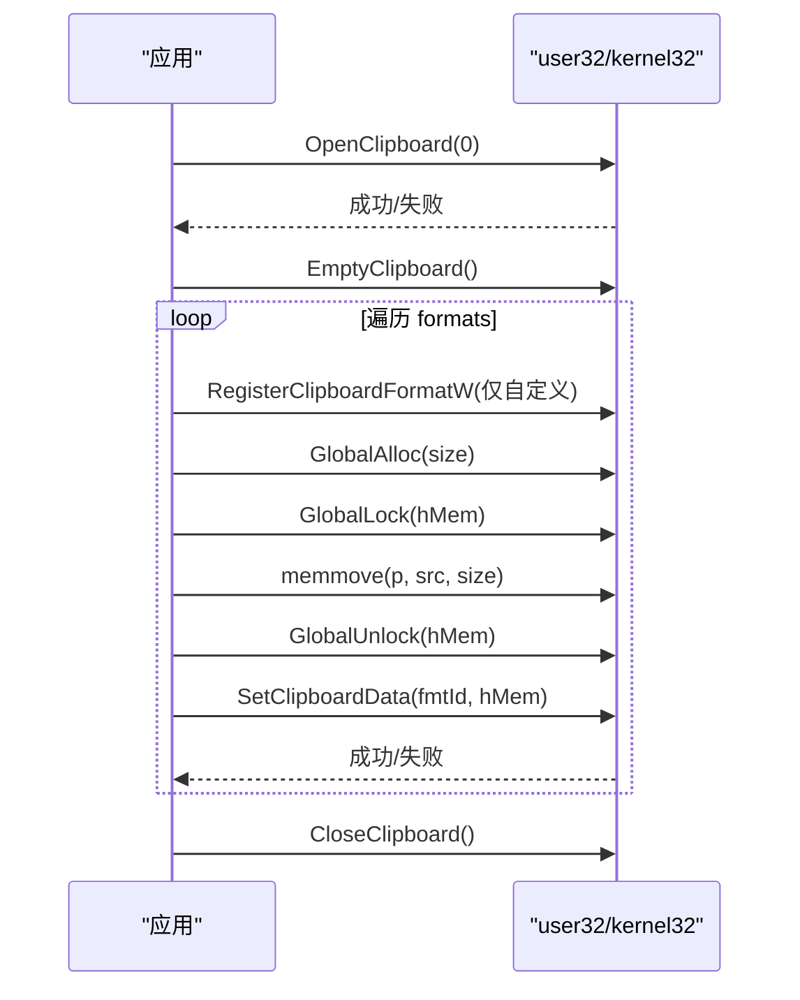
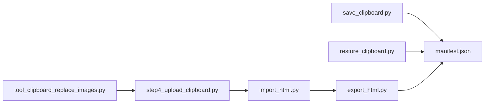
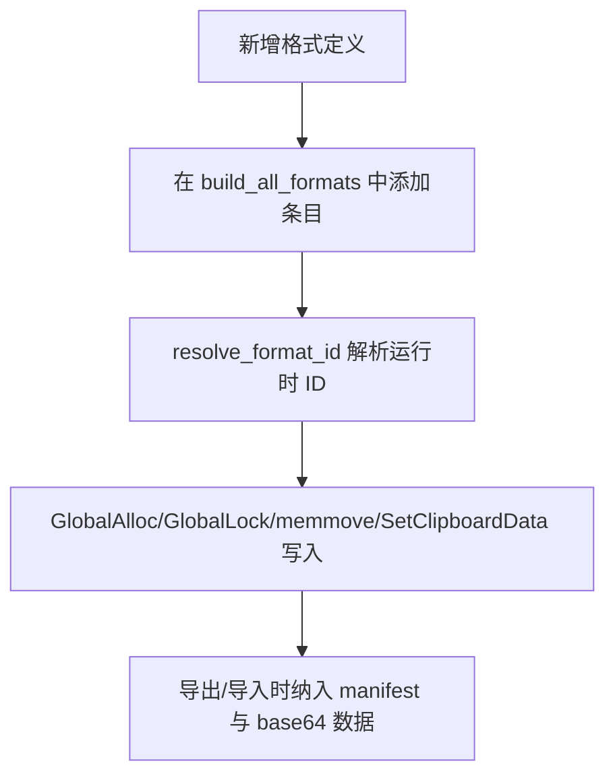

# 多格式支持实现

<cite>
**本文引用的文件**
- [step4_upload_clipboard.py](file://step4_upload_clipboard.py)
- [import_html.py](file://board_history/import_html.py)
- [export_html.py](file://board_history/export_html.py)
- [save_clipboard.py](file://board_history/save_clipboard.py)
- [restore_clipboard.py](file://board_history/restore_clipboard.py)
- [manifest.json](file://board_history/clipboard_data/manifest.json)
- [tool_clipboard_replace_images.py](file://tool/tool_clipboard_replace_images.py)
</cite>

## 目录
1. [简介](#简介)
2. [项目结构](#项目结构)
3. [核心组件](#核心组件)
4. [架构总览](#架构总览)
5. [详细组件分析](#详细组件分析)
6. [依赖关系分析](#依赖关系分析)
7. [性能考虑](#性能考虑)
8. [故障排查指南](#故障排查指南)
9. [结论](#结论)
10. [附录：新增剪贴板格式支持示例](#附录新增剪贴板格式支持示例)

## 简介
本技术文档聚焦于“多格式支持”能力，围绕 Windows 剪贴板的标准与扩展格式进行系统化说明。重点覆盖以下方面：
- Windows 剪贴板标准格式：HTML Format (49393)、CF_UNICODETEXT (13)、CF_TEXT (1)、CF_OEMTEXT (7)、CF_LOCALE (16) 等的用途与数据结构
- HTML Format 二进制格式的构建过程：头部字段、字节偏移计算、内容封装
- 纯文本提取算法：HTML 标签解析、实体字符转换、空白字符处理
- 编码处理：UTF-16-LE、CP936、UTF-8 等编码的转换逻辑
- 如何添加新的剪贴板格式支持（含代码级参考路径）

## 项目结构
本项目通过“导出—编辑—导入—写入剪贴板”的流水线，实现对剪贴板多格式数据的读取、可视化编辑与重建写入。关键脚本职责如下：
- save_clipboard.py：枚举并保存当前剪贴板所有格式为本地二进制文件及清单 manifest.json
- export_html.py：将本地剪贴板数据导出为可编辑 HTML，内嵌原始二进制数据（base64），并提供格式化与模式折叠
- import_html.py：从 HTML 中解析内容与原始数据，按需重建各格式并写回剪贴板
- step4_upload_clipboard.py：面向微信公众号场景，对 HTML 片段做样式展开、空白归一化、图片 base64 内联后，生成并写入剪贴板
- restore_clipboard.py：从本地保存的数据恢复剪贴板
- tool_clipboard_replace_images.py：工具脚本，演示最小化的 HTML Format + 纯文本写入流程

图表来源
- [save_clipboard.py:116-188](file://board_history/save_clipboard.py#L116-L188)
- [export_html.py:265-460](file://board_history/export_html.py#L265-L460)
- [import_html.py:427-483](file://board_history/import_html.py#L427-L483)
- [step4_upload_clipboard.py:436-480](file://step4_upload_clipboard.py#L436-L480)

章节来源
- [save_clipboard.py:116-188](file://board_history/save_clipboard.py#L116-L188)
- [export_html.py:265-460](file://board_history/export_html.py#L265-L460)
- [import_html.py:427-483](file://board_history/import_html.py#L427-L483)
- [step4_upload_clipboard.py:436-480](file://step4_upload_clipboard.py#L436-L480)

## 核心组件
本节概述与多格式支持直接相关的核心函数与流程：
- 剪贴板读写与格式注册
  - OpenClipboard/EmptyClipboard/SetClipboardData/CloseClipboard
  - RegisterClipboardFormatW（用于自定义格式名到运行时 ID 的映射）
  - GlobalAlloc/GlobalLock/GlobalUnlock/GlobalFree（内存块分配与拷贝）
- 格式构建与解析
  - build_html_format_binary：按 Windows HTML Format 规范构造二进制
  - extract_plain_text/html_to_plain_text：HTML 片段转纯文本
  - expand_patterns/normalize_whitespace：简化类标签还原与空白归一化
  - parse_html_file/generate_export_html：导出/导入 HTML 中的元信息与原始数据
- 编码策略
  - CF_UNICODETEXT：UTF-16-LE + 双零终止
  - CF_TEXT/CF_OEMTEXT：优先 CP936，失败回退 UTF-8 + 单零终止
  - CF_LOCALE：LCID（如 zh-CN=2052）

章节来源
- [step4_upload_clipboard.py:59-67](file://step4_upload_clipboard.py#L59-L67)
- [step4_upload_clipboard.py:227-269](file://step4_upload_clipboard.py#L227-L269)
- [step4_upload_clipboard.py:271-286](file://step4_upload_clipboard.py#L271-L286)
- [step4_upload_clipboard.py:288-366](file://step4_upload_clipboard.py#L288-L366)
- [import_html.py:213-254](file://board_history/import_html.py#L213-L254)
- [import_html.py:256-271](file://board_history/import_html.py#L256-L271)
- [import_html.py:273-356](file://board_history/import_html.py#L273-L356)
- [export_html.py:59-89](file://board_history/export_html.py#L59-L89)
- [export_html.py:233-260](file://board_history/export_html.py#L233-L260)

## 架构总览
下图展示了从“剪贴板数据落地”到“重新写入剪贴板”的端到端流程，以及关键模块间的调用关系。

图表来源
- [save_clipboard.py:116-188](file://board_history/save_clipboard.py#L116-L188)
- [export_html.py:265-460](file://board_history/export_html.py#L265-L460)
- [import_html.py:427-483](file://board_history/import_html.py#L427-L483)
- [step4_upload_clipboard.py:436-480](file://step4_upload_clipboard.py#L436-L480)

## 详细组件分析

### Windows 剪贴板标准格式与用途
- HTML Format (49393)
  - 用途：富文本粘贴的核心格式，包含版本头与片段起止标记
  - 数据结构：UTF-8 文本，包含固定键值行与 HTML 片段
- CF_UNICODETEXT (13)
  - 用途：Unicode 文本，兼容现代应用
  - 数据结构：UTF-16-LE 编码字符串，以两个零字节结尾
- CF_TEXT (1) / CF_OEMTEXT (7)
  - 用途：ANSI/OEM 文本，兼容旧版程序
  - 数据结构：ANSI 或 OEM 编码字符串，以单个零字节结尾；中文环境常用 CP936
- CF_LOCALE (16)
  - 用途：区域设置 LCID，指示文本语言/地区
  - 数据结构：32 位小端整数（例如 zh-CN=2052）

章节来源
- [manifest.json:1-44](file://board_history/clipboard_data/manifest.json#L1-L44)
- [save_clipboard.py:23-62](file://board_history/save_clipboard.py#L23-L62)

### HTML Format 二进制构建过程
构建步骤要点：
- 前缀与后缀：包裹 <html><body> 与 <!--StartFragment--><!--EndFragment--> 标记
- 头部模板：Version、StartHTML、EndHTML、StartFragment、EndFragment 五个键值行
- 迭代计算偏移：由于头部长度可能随数字位数变化，需多次迭代直至稳定
- 最终拼接：头部 + 前缀 + 片段 + 后缀 + 一个零字节

图表来源
- [step4_upload_clipboard.py:227-269](file://step4_upload_clipboard.py#L227-L269)
- [import_html.py:213-254](file://board_history/import_html.py#L213-L254)
- [tool_clipboard_replace_images.py:144-180](file://tool/tool_clipboard_replace_images.py#L144-L180)

章节来源
- [step4_upload_clipboard.py:227-269](file://step4_upload_clipboard.py#L227-L269)
- [import_html.py:213-254](file://board_history/import_html.py#L213-L254)
- [tool_clipboard_replace_images.py:144-180](file://tool/tool_clipboard_replace_images.py#L144-L180)

### 纯文本提取算法
目标：从 HTML 片段生成与 Xiumi 剪贴板一致的纯文本。主要步骤：
- 将   替换为换行
- 在段落/区块闭合标签后插入三段换行，模拟段落分隔
- 移除所有 HTML 标签
- 解码常见实体：&amp;、&lt;、&gt;、&quot;、&#39;、&nbsp;
- 压缩多余换行（最多保留三段换行）并去除首尾空白

图表来源
- [step4_upload_clipboard.py:271-286](file://step4_upload_clipboard.py#L271-L286)
- [import_html.py:256-271](file://board_history/import_html.py#L256-L271)
- [export_html.py:233-260](file://board_history/export_html.py#L233-L260)

章节来源
- [step4_upload_clipboard.py:271-286](file://step4_upload_clipboard.py#L271-L286)
- [import_html.py:256-271](file://board_history/import_html.py#L256-L271)
- [export_html.py:233-260](file://board_history/export_html.py#L233-L260)

### 编码处理与转换逻辑
- CF_UNICODETEXT
  - 使用 UTF-16-LE 编码，并以两个零字节作为终止符
- CF_TEXT / CF_OEMTEXT
  - 优先尝试 CP936（简体中文 ANSI）编码；若抛出编码错误则回退为 UTF-8
  - 均以单个零字节作为终止符
- CF_LOCALE
  - 优先使用原始数据中的 LCID；若无则默认 zh-CN（2052）
  - 以小端序 32 位整数存储

图表来源
- [step4_upload_clipboard.py:316-351](file://step4_upload_clipboard.py#L316-L351)
- [import_html.py:307-342](file://board_history/import_html.py#L307-L342)
- [tool_clipboard_replace_images.py:206-213](file://tool/tool_clipboard_replace_images.py#L206-L213)

章节来源
- [step4_upload_clipboard.py:316-351](file://step4_upload_clipboard.py#L316-L351)
- [import_html.py:307-342](file://board_history/import_html.py#L307-L342)
- [tool_clipboard_replace_images.py:206-213](file://tool/tool_clipboard_replace_images.py#L206-L213)

### 剪贴板写入流程（API 层）
整体流程：
- 打开剪贴板（带重试）
- 清空剪贴板
- 遍历格式列表：
  - 解析格式 ID（标准 ID 直接使用，自定义名称通过 RegisterClipboardFormatW 获取运行时 ID）
  - 分配全局内存（GMEM_MOVEABLE | GMEM_ZEROINIT）
  - 锁定内存并拷贝数据
  - 调用 SetClipboardData 写入
  - 释放内存句柄
- 关闭剪贴板

图表来源
- [step4_upload_clipboard.py:371-431](file://step4_upload_clipboard.py#L371-L431)
- [import_html.py:362-422](file://board_history/import_html.py#L362-L422)
- [restore_clipboard.py:81-152](file://board_history/restore_clipboard.py#L81-L152)

章节来源
- [step4_upload_clipboard.py:371-431](file://step4_upload_clipboard.py#L371-L431)
- [import_html.py:362-422](file://board_history/import_html.py#L362-L422)
- [restore_clipboard.py:81-152](file://board_history/restore_clipboard.py#L81-L152)

### 导出/导入 HTML 与原始数据
- 导出（export_html.py）
  - 加载 manifest.json 与各 .bin 文件
  - 解析 HTML Format 二进制，提取片段
  - 格式化片段并折叠识别到的样式模式（标题、正文、加粗正文、空行、内联高亮）
  - 生成可编辑 HTML，内嵌原始数据（base64）与纯文本预览
- 导入（import_html.py）
  - 解析 article 内容与 cb-raw-data 元信息
  - 若未检测到内容被修改，则直接使用原始二进制数据
  - 否则基于新内容重建 HTML Format、CF_UNICODETEXT、CF_TEXT/CF_OEMTEXT、CF_LOCALE，其他格式沿用原始数据

章节来源
- [export_html.py:30-53](file://board_history/export_html.py#L30-L53)
- [export_html.py:59-89](file://board_history/export_html.py#L59-L89)
- [export_html.py:94-143](file://board_history/export_html.py#L94-L143)
- [export_html.py:148-228](file://board_history/export_html.py#L148-L228)
- [export_html.py:265-460](file://board_history/export_html.py#L265-L460)
- [import_html.py:70-112](file://board_history/import_html.py#L70-L112)
- [import_html.py:117-191](file://board_history/import_html.py#L117-L191)
- [import_html.py:273-356](file://board_history/import_html.py#L273-L356)
- [import_html.py:427-483](file://board_history/import_html.py#L427-L483)

### 公众号上传专用流程（step4_upload_clipboard.py）
该流程在通用导入基础上增加了：
- 样式展开：将简化类标签还原为完整内联样式
- 空白归一化：去除格式化空白，确保紧凑结构
- 图片内联：将本地图片转为 data URI（base64），便于粘贴到不支持外链的环境

章节来源
- [step4_upload_clipboard.py:114-173](file://step4_upload_clipboard.py#L114-L173)
- [step4_upload_clipboard.py:175-189](file://step4_upload_clipboard.py#L175-L189)
- [step4_upload_clipboard.py:194-223](file://step4_upload_clipboard.py#L194-L223)
- [step4_upload_clipboard.py:436-480](file://step4_upload_clipboard.py#L436-L480)

## 依赖关系分析
- 模块耦合
  - save_clipboard.py 与 restore_clipboard.py 对称：前者枚举写入磁盘，后者从磁盘恢复
  - export_html.py 与 import_html.py 对称：前者导出为可编辑 HTML，后者解析并重建
  - step4_upload_clipboard.py 复用 import_html.py 的构建逻辑，但增加样式展开与图片内联
- 外部依赖
  - user32.dll：OpenClipboard/EnumClipboardFormats/GetClipboardData/SetClipboardData/RegisterClipboardFormatW 等
  - kernel32.dll：GlobalAlloc/GlobalLock/GlobalUnlock/GlobalFree/GlobalSize 等

图表来源
- [save_clipboard.py:116-188](file://board_history/save_clipboard.py#L116-L188)
- [restore_clipboard.py:81-152](file://board_history/restore_clipboard.py#L81-L152)
- [export_html.py:265-460](file://board_history/export_html.py#L265-L460)
- [import_html.py:427-483](file://board_history/import_html.py#L427-L483)
- [step4_upload_clipboard.py:436-480](file://step4_upload_clipboard.py#L436-L480)
- [tool_clipboard_replace_images.py:144-245](file://tool/tool_clipboard_replace_images.py#L144-L245)

章节来源
- [save_clipboard.py:116-188](file://board_history/save_clipboard.py#L116-L188)
- [restore_clipboard.py:81-152](file://board_history/restore_clipboard.py#L81-L152)
- [export_html.py:265-460](file://board_history/export_html.py#L265-L460)
- [import_html.py:427-483](file://board_history/import_html.py#L427-L483)
- [step4_upload_clipboard.py:436-480](file://step4_upload_clipboard.py#L436-L480)
- [tool_clipboard_replace_images.py:144-245](file://tool/tool_clipboard_replace_images.py#L144-L245)

## 性能考虑
- 大片段处理
  - HTML Format 构建涉及多次字符串编码与长度计算，建议避免重复拼接，尽量一次性计算偏移
- 内存管理
  - 使用 GlobalAlloc/GmemMoveable 时注意及时解锁与释放，避免泄漏
- I/O 优化
  - 批量写入剪贴板时，尽量减少系统调用次数；已实现的循环写入方式较为合理
- 编码选择
  - 优先 CP936 可减少字节数，但在非中文环境下应做好回退策略

## 故障排查指南
- 无法打开剪贴板
  - 现象：OpenClipboard 返回失败
  - 排查：确认无其他进程独占剪贴板；增加重试间隔
  - 参考路径：[step4_upload_clipboard.py:371-384](file://step4_upload_clipboard.py#L371-L384)
- SetClipboardData 失败
  - 现象：写入特定格式失败
  - 排查：检查格式 ID 是否正确；自定义格式需先 RegisterClipboardFormatW；查看 GetLastError
  - 参考路径：[restore_clipboard.py:137-143](file://board_history/restore_clipboard.py#L137-L143)
- HTML Format 偏移不匹配
  - 现象：粘贴后片段错位或缺失
  - 排查：确认头部迭代收敛；验证前缀/后缀与片段编码一致（UTF-8）
  - 参考路径：[import_html.py:213-254](file://board_history/import_html.py#L213-L254)
- 纯文本乱码
  - 现象：CF_TEXT/CF_OEMTEXT 显示异常
  - 排查：确认 CP936 编码失败时的回退逻辑；必要时强制 UTF-8
  - 参考路径：[step4_upload_clipboard.py:335-344](file://step4_upload_clipboard.py#L335-L344)

章节来源
- [step4_upload_clipboard.py:371-384](file://step4_upload_clipboard.py#L371-L384)
- [restore_clipboard.py:137-143](file://board_history/restore_clipboard.py#L137-L143)
- [import_html.py:213-254](file://board_history/import_html.py#L213-L254)
- [step4_upload_clipboard.py:335-344](file://step4_upload_clipboard.py#L335-L344)

## 结论
本项目在多格式剪贴板支持上实现了完整的“读—存—编—写”闭环：
- 通过标准与自定义格式的统一处理，兼容多种应用场景
- HTML Format 的二进制构建严格遵循头部与偏移约定
- 纯文本提取与编码策略兼顾可读性与兼容性
- 提供可扩展的框架，便于新增更多剪贴板格式

## 附录：新增剪贴板格式支持示例
以下以“新增一个自定义格式”为例，给出最小改动点与参考路径。假设新增格式名为 “MyCustomFormat”，ID 由运行时注册获得。

- 在构建格式列表处追加条目
  - 参考路径：[step4_upload_clipboard.py:288-366](file://step4_upload_clipboard.py#L288-L366)
  - 参考路径：[import_html.py:273-356](file://board_history/import_html.py#L273-L356)
- 在写入剪贴板时，自动通过 resolve_format_id 解析自定义格式名
  - 参考路径：[step4_upload_clipboard.py:59-67](file://step4_upload_clipboard.py#L59-L67)
  - 参考路径：[import_html.py:57-65](file://board_history/import_html.py#L57-L65)
- 如需持久化与导出/导入
  - 在导出时将该格式加入 manifest 与 base64 数据
    - 参考路径：[export_html.py:288-304](file://board_history/export_html.py#L288-L304)
  - 在导入时从 manifest 中读取并参与重建
    - 参考路径：[import_html.py:70-112](file://board_history/import_html.py#L70-L112)

图表来源
- [step4_upload_clipboard.py:288-366](file://step4_upload_clipboard.py#L288-L366)
- [import_html.py:273-356](file://board_history/import_html.py#L273-L356)
- [export_html.py:288-304](file://board_history/export_html.py#L288-L304)

章节来源
- [step4_upload_clipboard.py:288-366](file://step4_upload_clipboard.py#L288-L366)
- [import_html.py:273-356](file://board_history/import_html.py#L273-L356)
- [export_html.py:288-304](file://board_history/export_html.py#L288-L304)