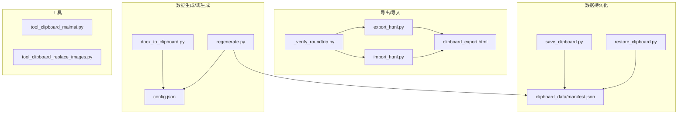
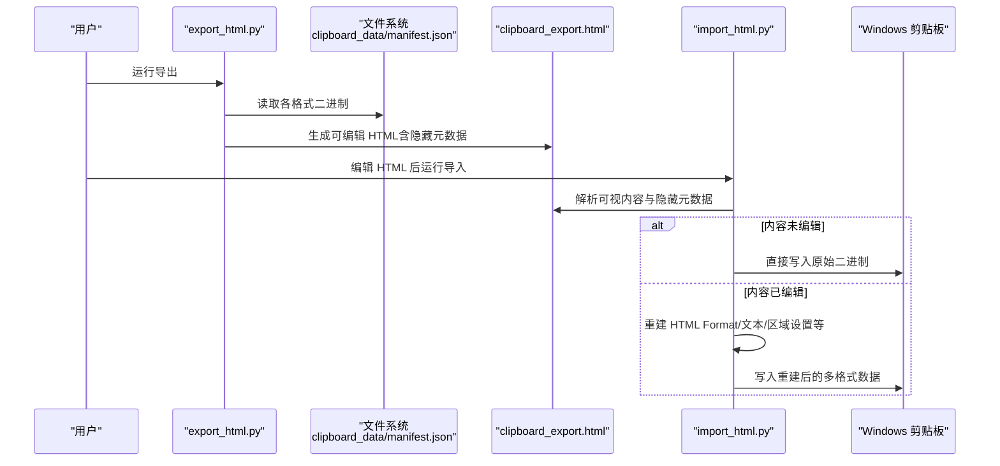
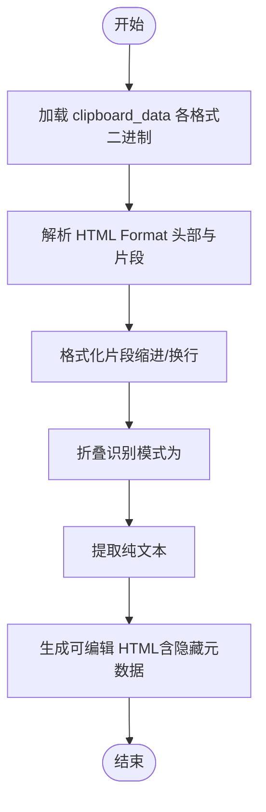
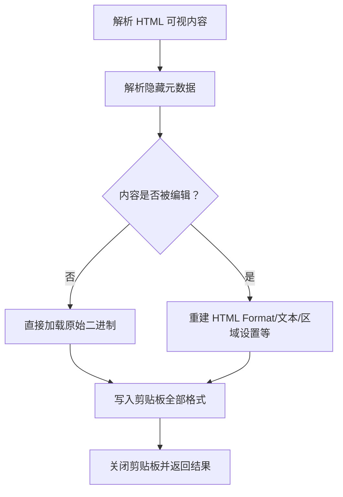
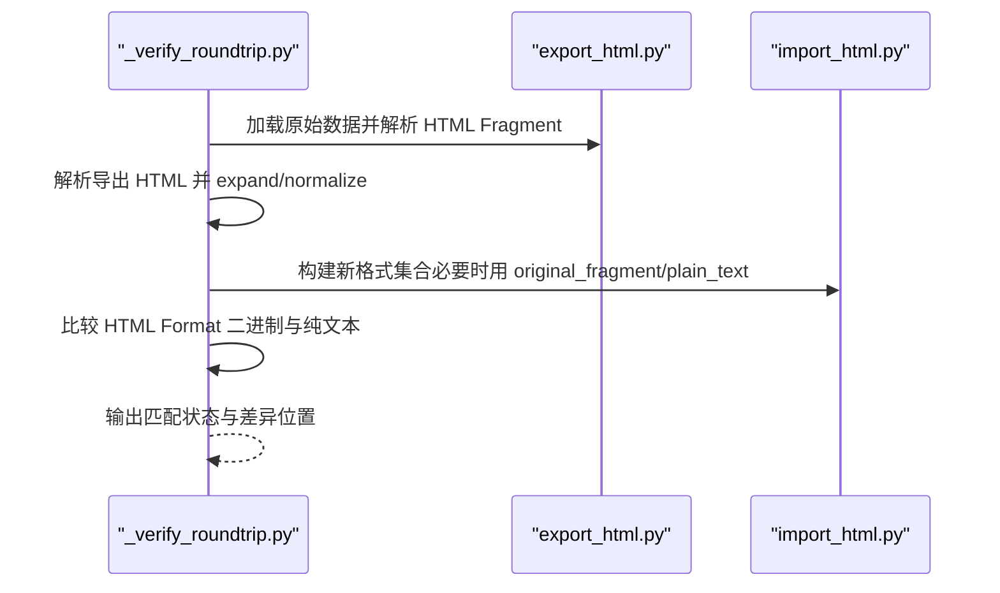
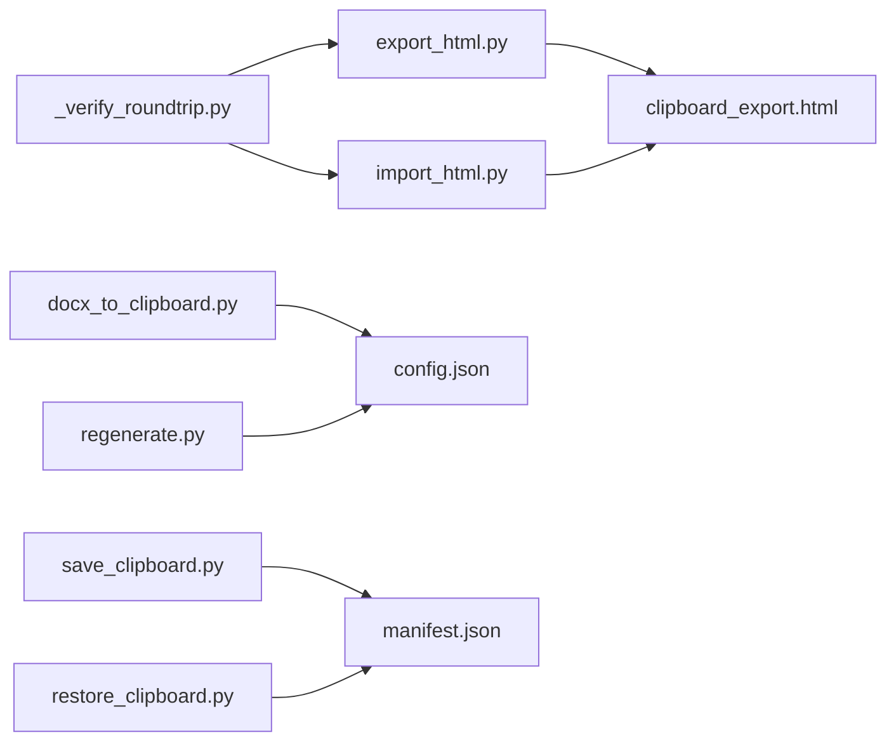

# 历史管理工具

<cite>
**本文引用的文件**   
- [board_history/export_html.py](file://board_history/export_html.py)
- [board_history/import_html.py](file://board_history/import_html.py)
- [board_history/_verify_roundtrip.py](file://board_history/_verify_roundtrip.py)
- [board_history/clipboard_export.html](file://board_history/clipboard_export.html)
- [board_history/clipboard_data/manifest.json](file://board_history/clipboard_data/manifest.json)
- [board_history/save_clipboard.py](file://board_history/save_clipboard.py)
- [board_history/restore_clipboard.py](file://board_history/restore_clipboard.py)
- [board_history/docx_to_clipboard.py](file://board_history/docx_to_clipboard.py)
- [board_history/regenerate.py](file://board_history/regenerate.py)
- [tool/tool_clipboard_maimai.py](file://tool/tool_clipboard_maimai.py)
- [tool/tool_clipboard_replace_images.py](file://tool/tool_clipboard_replace_images.py)
</cite>

## 目录
1. [简介](#简介)
2. [项目结构](#项目结构)
3. [核心组件](#核心组件)
4. [架构总览](#架构总览)
5. [详细组件分析](#详细组件分析)
6. [依赖关系分析](#依赖关系分析)
7. [性能与可靠性](#性能与可靠性)
8. [故障排查指南](#故障排查指南)
9. [结论](#结论)
10. [附录：使用示例与最佳实践](#附录使用示例与最佳实践)

## 简介
本仓库提供一套“历史管理工具”，围绕剪贴板数据的全生命周期展开，包括：
- 导出：将 Windows 剪贴板的多格式数据（HTML、纯文本、区域设置等）导出为可编辑的 HTML 文档与原始二进制清单。
- 导入：从导出的 HTML 中解析内容并写回剪贴板，支持对内容进行可视化编辑后重建多格式数据。
- 往返验证：通过一致性校验与差异报告，确保导出→编辑→导入的完整链路保持数据一致。
- 批量处理：提供基于配置文件的生成与再生成流程，便于批量化处理与版本化归档。
- 数据迁移与兼容：支持从 docx 构建剪贴板数据、替换图片、追加尾部内容等场景，并提供 manifest 作为跨工具共享的数据契约。

该工具集以“manifest.json”为核心契约，配合 HTML 中间表示与 Python 脚本，实现高保真、可审计、可复现的剪贴板数据处理流水线。

## 项目结构
- board_history：核心导出/导入/验证与数据持久化工具
  - export_html.py：读取 clipboard_data 下的多格式数据，生成可编辑的 HTML 与隐藏元数据
  - import_html.py：解析 HTML，重建剪贴板各格式并写入系统剪贴板
  - _verify_roundtrip.py：端到端往返一致性校验与差异报告
  - clipboard_export.html：由 export_html.py 生成的可编辑输出样例
  - clipboard_data/manifest.json：剪贴板多格式清单（格式ID、文件名、大小）
  - save_clipboard.py / restore_clipboard.py：直接读写系统剪贴板到本地目录
  - docx_to_clipboard.py：从 docx 构建剪贴板数据（含段落分类、HTML 生成、manifest 生成）
  - regenerate.py：基于 config.json 重新生成剪贴板二进制与 manifest
- tool：辅助工具
  - tool_clipboard_maimai.py：剪贴板文字追加工具（拼接文章列表）
  - tool_clipboard_replace_images.py：按 JSON 顺序替换剪贴板 HTML 中的图片并写回

图表来源
- [board_history/export_html.py:1-516](file://board_history/export_html.py#L1-L516)
- [board_history/import_html.py:1-483](file://board_history/import_html.py#L1-L483)
- [board_history/_verify_roundtrip.py:1-106](file://board_history/_verify_roundtrip.py#L1-L106)
- [board_history/clipboard_data/manifest.json:1-44](file://board_history/clipboard_data/manifest.json#L1-L44)
- [board_history/save_clipboard.py:1-188](file://board_history/save_clipboard.py#L1-L188)
- [board_history/restore_clipboard.py:1-159](file://board_history/restore_clipboard.py#L1-L159)
- [board_history/docx_to_clipboard.py:1-478](file://board_history/docx_to_clipboard.py#L1-L478)
- [board_history/regenerate.py:1-78](file://board_history/regenerate.py#L1-L78)

章节来源
- [board_history/export_html.py:1-516](file://board_history/export_html.py#L1-L516)
- [board_history/import_html.py:1-483](file://board_history/import_html.py#L1-L483)
- [board_history/_verify_roundtrip.py:1-106](file://board_history/_verify_roundtrip.py#L1-L106)
- [board_history/clipboard_data/manifest.json:1-44](file://board_history/clipboard_data/manifest.json#L1-L44)
- [board_history/save_clipboard.py:1-188](file://board_history/save_clipboard.py#L1-L188)
- [board_history/restore_clipboard.py:1-159](file://board_history/restore_clipboard.py#L1-L159)
- [board_history/docx_to_clipboard.py:1-478](file://board_history/docx_to_clipboard.py#L1-L478)
- [board_history/regenerate.py:1-78](file://board_history/regenerate.py#L1-L78)

## 核心组件
- 导出器（export_html.py）
  - 加载 clipboard_data 下所有格式二进制，解析 HTML Format，格式化片段，提取纯文本，生成带样式预览和隐藏元数据的 HTML。
- 导入器（import_html.py）
  - 解析 HTML 中的可视内容与隐藏元数据，判断是否被编辑；若未编辑则直接使用原始二进制，否则重建 HTML Format、CF_UNICODETEXT、CF_TEXT/OEMTEXT、CF_LOCALE 及其他格式，并写入系统剪贴板。
- 往返验证器（_verify_roundtrip.py）
  - 对比原始与重建后的 HTML Format 二进制与纯文本，输出匹配状态与首个差异位置，统计模式数量。
- 保存/恢复（save_clipboard.py / restore_clipboard.py）
  - 枚举系统剪贴板所有格式，保存到本地目录并生成 manifest；或从 manifest 恢复至剪贴板。
- Docx 转换（docx_to_clipboard.py）
  - 解析 docx 段落，分类标题/正文/空行，生成 Xiumi 风格 HTML，构造剪贴板多格式二进制与 manifest，并输出可编辑的 config.json。
- 再生成（regenerate.py）
  - 读取 config.json，校验字段，重新生成 HTML 与多格式二进制，覆盖更新 manifest。
- 工具（tool_clipboard_maimai.py / tool_clipboard_replace_images.py）
  - 前者用于拼接剪贴板文本与外部文章列表；后者按 JSON 顺序替换剪贴板 HTML 中的图片为 base64，并进行 HTML 后处理与写回。

章节来源
- [board_history/export_html.py:1-516](file://board_history/export_html.py#L1-L516)
- [board_history/import_html.py:1-483](file://board_history/import_html.py#L1-L483)
- [board_history/_verify_roundtrip.py:1-106](file://board_history/_verify_roundtrip.py#L1-L106)
- [board_history/save_clipboard.py:1-188](file://board_history/save_clipboard.py#L1-L188)
- [board_history/restore_clipboard.py:1-159](file://board_history/restore_clipboard.py#L1-L159)
- [board_history/docx_to_clipboard.py:1-478](file://board_history/docx_to_clipboard.py#L1-L478)
- [board_history/regenerate.py:1-78](file://board_history/regenerate.py#L1-L78)
- [tool/tool_clipboard_maimai.py:1-220](file://tool/tool_clipboard_maimai.py#L1-L220)
- [tool/tool_clipboard_replace_images.py:1-498](file://tool/tool_clipboard_replace_images.py#L1-L498)

## 架构总览
整体数据流围绕“manifest.json + HTML 中间表示”的双轨设计：
- 原始二进制（manifest 描述）保证高保真还原
- HTML 中间表示提供人类可读、可编辑的内容视图
- 导入时根据是否编辑选择“原样恢复”或“重建关键格式”的策略

图表来源
- [board_history/export_html.py:1-516](file://board_history/export_html.py#L1-L516)
- [board_history/import_html.py:1-483](file://board_history/import_html.py#L1-L483)
- [board_history/clipboard_data/manifest.json:1-44](file://board_history/clipboard_data/manifest.json#L1-L44)

## 详细组件分析

### 数据导出功能（剪贴板序列化、存储格式与元数据）
- 输入来源
  - 从 clipboard_data 目录加载所有格式二进制，依据 manifest.json 索引。
- HTML Format 解析
  - 解析头部 Version/StartHTML/EndHTML/StartFragment/EndFragment，提取 fragment 内容。
- 可读性增强
  - 对 fragment 进行格式化（缩进换行），并将常见 Xiumi 样式模式折叠为语义化 class（title/body/body-bold/empty-line/hl）。
- 纯文本提取
  - 将 HTML 片段转换为纯文本，保留段落分隔与实体解码，供 CF_UNICODETEXT/CF_TEXT/CF_OEMTEXT 使用。
- 输出产物
  - 生成 clipboard_export.html：包含样式预览、可视内容区、纯文本预览、隐藏的 cb-raw-data（JSON 清单，base64 编码的二进制与 original_fragment/plain_text 元信息）。
- 存储格式
  - manifest.json 记录每个格式的 format_id、format_name、file、size，作为跨工具的契约。

图表来源
- [board_history/export_html.py:59-228](file://board_history/export_html.py#L59-L228)
- [board_history/export_html.py:233-260](file://board_history/export_html.py#L233-L260)
- [board_history/export_html.py:265-461](file://board_history/export_html.py#L265-L461)
- [board_history/clipboard_data/manifest.json:1-44](file://board_history/clipboard_data/manifest.json#L1-L44)

章节来源
- [board_history/export_html.py:1-516](file://board_history/export_html.py#L1-L516)
- [board_history/clipboard_data/manifest.json:1-44](file://board_history/clipboard_data/manifest.json#L1-L44)

### 数据导入功能（格式验证、冲突解决与完整性检查）
- 解析 HTML
  - 正则提取 article#clipboard-content 可视内容与 script#cb-raw-data 隐藏元数据。
- 内容编辑检测
  - 将可视内容与 original_fragment 经相同折叠/格式化流程比较，判定是否被编辑。
- 格式重建策略
  - 未编辑：直接复用原始二进制（最高保真）。
  - 已编辑：重建 HTML Format（带正确偏移）、CF_UNICODETEXT（UTF-16LE+终止符）、CF_TEXT/CF_OEMTEXT（CP936 优先，失败回退 UTF-8）、CF_LOCALE（zh-CN），其他格式（如 Chromium 内部源）沿用原始数据。
- 剪贴板写入
  - 打开剪贴板（重试机制），清空后逐个 SetClipboardData，错误日志与计数汇总。

图表来源
- [board_history/import_html.py:70-113](file://board_history/import_html.py#L70-L113)
- [board_history/import_html.py:118-208](file://board_history/import_html.py#L118-L208)
- [board_history/import_html.py:273-356](file://board_history/import_html.py#L273-L356)
- [board_history/import_html.py:362-422](file://board_history/import_html.py#L362-L422)

章节来源
- [board_history/import_html.py:1-483](file://board_history/import_html.py#L1-L483)

### 往返验证机制（一致性校验与差异分析报告）
- 步骤
  - 加载原始剪贴板数据，解析 HTML Fragment 与纯文本。
  - 解析导出 HTML，执行 expand + normalize，判断是否编辑。
  - 构建新格式集合，比较 HTML Format 二进制与纯文本。
  - 输出 SHA-256 摘要对比与首个差异位置。
  - 统计折叠模式数量（title/body/body-bold/empty-line/un-collapsed p）。
- 价值
  - 保障导出→编辑→导入链路的无损性与可审计性。

图表来源
- [board_history/_verify_roundtrip.py:1-106](file://board_history/_verify_roundtrip.py#L1-L106)
- [board_history/export_html.py:59-228](file://board_history/export_html.py#L59-L228)
- [board_history/import_html.py:118-208](file://board_history/import_html.py#L118-L208)

章节来源
- [board_history/_verify_roundtrip.py:1-106](file://board_history/_verify_roundtrip.py#L1-L106)

### 批量处理工具（任务调度、进度跟踪与错误恢复）
- 任务类型
  - 从 docx 生成剪贴板数据（docx_to_clipboard.py）
  - 基于 config.json 重新生成（regenerate.py）
  - 从本地目录恢复至剪贴板（restore_clipboard.py）
  - 从剪贴板保存到本地目录（save_clipboard.py）
- 进度跟踪
  - 每步打印 INFO/WARN/ERROR 日志，包含条目数、文件大小、成功/失败计数。
- 错误恢复
  - 剪贴板操作采用重试打开、异常捕获与继续处理；缺失文件或空数据跳过并记录警告。
- 建议扩展
  - 增加任务队列与断点续传（以 manifest 为最小单元），支持并发写入与失败重试。

章节来源
- [board_history/docx_to_clipboard.py:415-478](file://board_history/docx_to_clipboard.py#L415-L478)
- [board_history/regenerate.py:28-78](file://board_history/regenerate.py#L28-L78)
- [board_history/restore_clipboard.py:81-159](file://board_history/restore_clipboard.py#L81-L159)
- [board_history/save_clipboard.py:116-188](file://board_history/save_clipboard.py#L116-L188)

### 数据存储结构与备份策略
- 存储结构
  - clipboard_data 目录：每个格式一个 .bin 文件，命名规则 {fmt_id}_{safe_name}.bin
  - manifest.json：清单，记录 format_id、format_name、file、size
  - clipboard_export.html：可编辑 HTML，内含 cb-raw-data（JSON，base64 编码的二进制与 original_fragment/plain_text）
- 备份策略
  - 以目录快照形式备份整个 clipboard_data 与对应 HTML 文件，便于回溯与迁移。
  - 利用 manifest.json 的 size 字段进行完整性快速校验。

章节来源
- [board_history/clipboard_data/manifest.json:1-44](file://board_history/clipboard_data/manifest.json#L1-L44)
- [board_history/export_html.py:265-461](file://board_history/export_html.py#L265-L461)

### 数据迁移工具与版本兼容性处理
- 迁移路径
  - docx → 剪贴板数据（docx_to_clipboard.py）→ 可编辑 config.json → 再生成（regenerate.py）→ 恢复（restore_clipboard.py）
- 版本兼容
  - export HTML 的 cb-raw-data 包含 version 字段（当前为 3），导入器据此决定是否使用 original_fragment/plain_text 优化路径。
  - 自定义格式 ID 通过 RegisterClipboardFormatW 动态注册，兼容 Chromium 内部源等私有格式。

章节来源
- [board_history/docx_to_clipboard.py:300-410](file://board_history/docx_to_clipboard.py#L300-L410)
- [board_history/regenerate.py:28-78](file://board_history/regenerate.py#L28-L78)
- [board_history/import_html.py:57-65](file://board_history/import_html.py#L57-L65)
- [board_history/clipboard_export.html:1-690](file://board_history/clipboard_export.html#L1-L690)

## 依赖关系分析
- 模块耦合
  - export_html.py 与 import_html.py 通过 HTML 中间表示与 cb-raw-data 解耦，降低双向依赖。
  - _verify_roundtrip.py 同时依赖两者，形成测试桥接。
  - docx_to_clipboard.py 与 regenerate.py 共享 HTML 生成与二进制构建逻辑，减少重复。
- 外部依赖
  - Windows API（user32/kernel32）用于剪贴板读写与全局内存管理。
  - 标准库（json/base64/re/struct/ctypes）用于数据编解码与系统交互。

图表来源
- [board_history/export_html.py:1-516](file://board_history/export_html.py#L1-L516)
- [board_history/import_html.py:1-483](file://board_history/import_html.py#L1-L483)
- [board_history/_verify_roundtrip.py:1-106](file://board_history/_verify_roundtrip.py#L1-L106)
- [board_history/docx_to_clipboard.py:1-478](file://board_history/docx_to_clipboard.py#L1-L478)
- [board_history/regenerate.py:1-78](file://board_history/regenerate.py#L1-L78)
- [board_history/save_clipboard.py:1-188](file://board_history/save_clipboard.py#L1-L188)
- [board_history/restore_clipboard.py:1-159](file://board_history/restore_clipboard.py#L1-L159)

章节来源
- [board_history/export_html.py:1-516](file://board_history/export_html.py#L1-L516)
- [board_history/import_html.py:1-483](file://board_history/import_html.py#L1-L483)
- [board_history/_verify_roundtrip.py:1-106](file://board_history/_verify_roundtrip.py#L1-L106)
- [board_history/docx_to_clipboard.py:1-478](file://board_history/docx_to_clipboard.py#L1-L478)
- [board_history/regenerate.py:1-78](file://board_history/regenerate.py#L1-L78)
- [board_history/save_clipboard.py:1-188](file://board_history/save_clipboard.py#L1-L188)
- [board_history/restore_clipboard.py:1-159](file://board_history/restore_clipboard.py#L1-L159)

## 性能与可靠性
- 性能要点
  - 未编辑路径直接复用原始二进制，避免重建开销。
  - HTML 片段格式化与折叠使用正则，复杂度与片段长度线性相关。
  - 剪贴板写入循环中分配/锁定/拷贝/释放内存，注意大对象时的内存峰值。
- 可靠性措施
  - 剪贴板打开重试、异常捕获与继续处理。
  - 缺失文件/空数据跳过并记录警告。
  - 往返验证输出 SHA-256 摘要与首个差异位置，便于定位问题。

[本节为通用指导，不直接分析具体文件]

## 故障排查指南
- 无法打开剪贴板
  - 现象：提示无法打开剪贴板，可能因其他程序占用。
  - 处理：关闭占用程序后重试；工具内置重试机制。
- 文件格式缺失或不匹配
  - 现象：manifest.json 存在但对应 .bin 缺失，或图片数量与 JSON 不一致。
  - 处理：补全缺失文件；核对 step2_table_to_image.json 与剪贴板 HTML 的 img 数量。
- 中文编码问题
  - 现象：CF_TEXT/CF_OEMTEXT 乱码。
  - 处理：优先 CP936 编码，失败回退 UTF-8；确认目标应用支持相应编码。
- 自定义格式 ID 失效
  - 现象：Chromium 内部源等私有格式无法写入。
  - 处理：确保运行时通过 RegisterClipboardFormatW 注册同名格式。

章节来源
- [board_history/import_html.py:362-422](file://board_history/import_html.py#L362-L422)
- [board_history/restore_clipboard.py:116-148](file://board_history/restore_clipboard.py#L116-L148)
- [tool/tool_clipboard_replace_images.py:289-336](file://tool/tool_clipboard_replace_images.py#L289-L336)

## 结论
本工具集以 manifest.json 为契约，结合 HTML 中间表示与 Python 脚本，实现了剪贴板数据的高保真导出/导入、可编辑的可视化工作流、严格的往返验证与完善的错误处理。通过 docx 转换与图片替换等工具，覆盖了从内容创作到发布前的多种场景，具备较强的可扩展性与工程可用性。

[本节为总结，不直接分析具体文件]

## 附录：使用示例与最佳实践

- 导出剪贴板数据
  - 命令：python save_clipboard.py clipboard_data
  - 说明：枚举剪贴板所有格式，保存到 clipboard_data 目录并生成 manifest.json。
  - 参考：[board_history/save_clipboard.py:116-188](file://board_history/save_clipboard.py#L116-L188)

- 生成可编辑 HTML
  - 命令：python export_html.py clipboard_data clipboard_export.html
  - 说明：从 clipboard_data 生成可编辑 HTML，内含隐藏元数据。
  - 参考：[board_history/export_html.py:466-516](file://board_history/export_html.py#L466-L516)

- 导入回剪贴板
  - 命令：python import_html.py clipboard_export.html
  - 说明：解析 HTML，若未编辑则直接恢复原始二进制；若已编辑则重建关键格式。
  - 参考：[board_history/import_html.py:427-483](file://board_history/import_html.py#L427-L483)

- 往返验证
  - 命令：python _verify_roundtrip.py
  - 说明：对比原始与重建后的二进制与纯文本，输出匹配状态与差异位置。
  - 参考：[board_history/_verify_roundtrip.py:1-106](file://board_history/_verify_roundtrip.py#L1-L106)

- 从 docx 生成剪贴板数据
  - 命令：python docx_to_clipboard.py input.docx content_YYYYMMDD
  - 说明：解析 docx，分类段落，生成 HTML、二进制与 manifest，并输出 config.json。
  - 参考：[board_history/docx_to_clipboard.py:415-478](file://board_history/docx_to_clipboard.py#L415-L478)

- 基于 config.json 重新生成
  - 命令：python regenerate.py content_YYYYMMDD
  - 说明：校验 config.json，重新生成 HTML 与二进制，覆盖更新 manifest。
  - 参考：[board_history/regenerate.py:28-78](file://board_history/regenerate.py#L28-L78)

- 恢复剪贴板数据
  - 命令：python restore_clipboard.py content_YYYYMMDD
  - 说明：从 manifest.json 恢复所有格式到剪贴板。
  - 参考：[board_history/restore_clipboard.py:81-159](file://board_history/restore_clipboard.py#L81-L159)

- 剪贴板文字追加
  - 命令：python tool_clipboard_maimai.py
  - 说明：读取剪贴板文本前 600 字，拼接 wx_content_list.txt 的文章条目，写回剪贴板。
  - 参考：[tool/tool_clipboard_maimai.py:179-220](file://tool/tool_clipboard_maimai.py#L179-L220)

- 替换剪贴板图片
  - 命令：python tool_clipboard_replace_images.py content_instance/content_YYYYMMDD_X
  - 说明：按 step2_table_to_image.json 顺序替换 HTML 中的图片为 base64，进行 HTML 后处理后写回剪贴板。
  - 参考：[tool/tool_clipboard_replace_images.py:398-498](file://tool/tool_clipboard_replace_images.py#L398-L498)

章节来源
- [board_history/save_clipboard.py:116-188](file://board_history/save_clipboard.py#L116-L188)
- [board_history/export_html.py:466-516](file://board_history/export_html.py#L466-L516)
- [board_history/import_html.py:427-483](file://board_history/import_html.py#L427-L483)
- [board_history/_verify_roundtrip.py:1-106](file://board_history/_verify_roundtrip.py#L1-L106)
- [board_history/docx_to_clipboard.py:415-478](file://board_history/docx_to_clipboard.py#L415-L478)
- [board_history/regenerate.py:28-78](file://board_history/regenerate.py#L28-L78)
- [board_history/restore_clipboard.py:81-159](file://board_history/restore_clipboard.py#L81-L159)
- [tool/tool_clipboard_maimai.py:179-220](file://tool/tool_clipboard_maimai.py#L179-L220)
- [tool/tool_clipboard_replace_images.py:398-498](file://tool/tool_clipboard_replace_images.py#L398-L498)