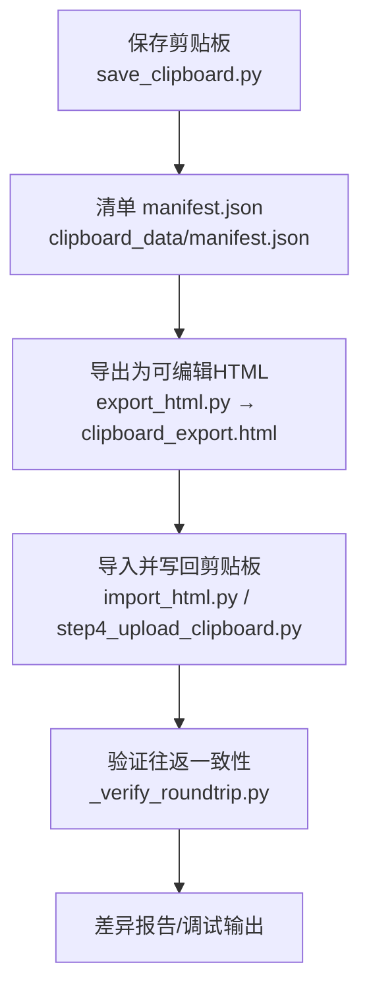
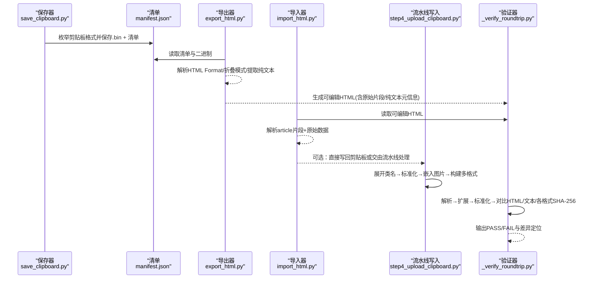
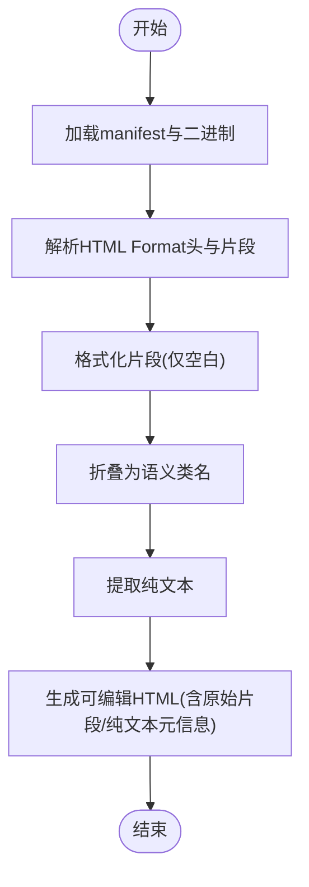
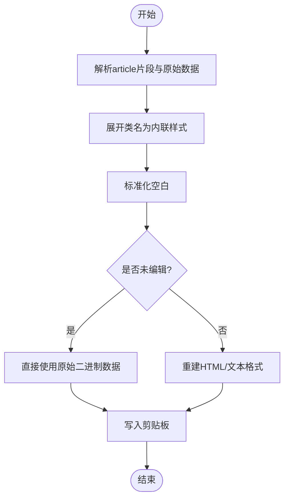
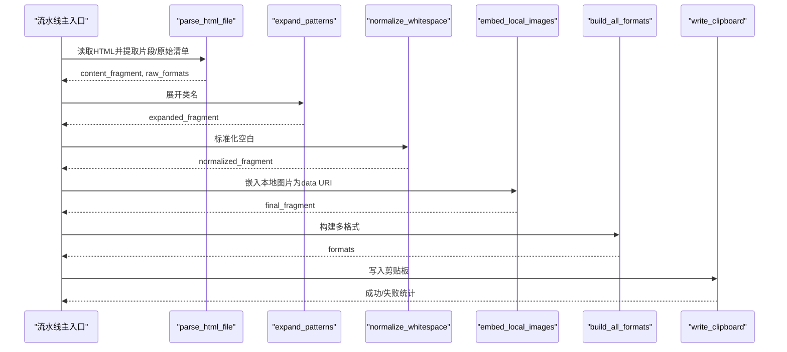
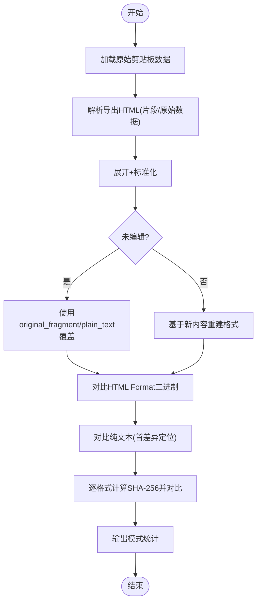
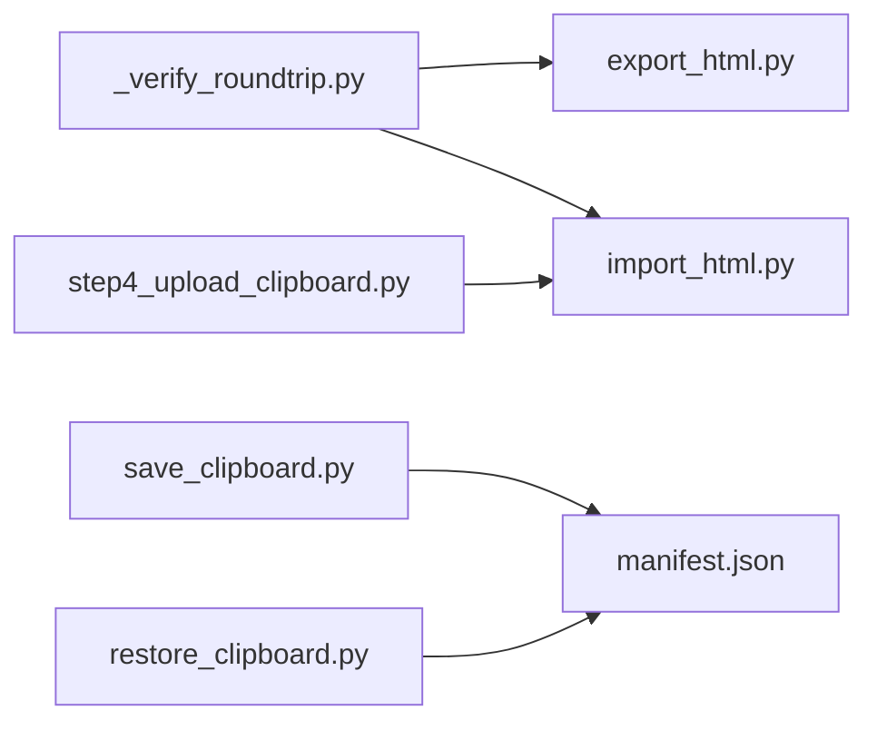

# 往返验证机制

<cite>
**本文引用的文件列表**
- [board_history/_verify_roundtrip.py](file://board_history/_verify_roundtrip.py)
- [board_history/export_html.py](file://board_history/export_html.py)
- [board_history/import_html.py](file://board_history/import_html.py)
- [step4_upload_clipboard.py](file://step4_upload_clipboard.py)
- [board_history/save_clipboard.py](file://board_history/save_clipboard.py)
- [board_history/restore_clipboard.py](file://board_history/restore_clipboard.py)
- [board_history/clipboard_data/manifest.json](file://board_history/clipboard_data/manifest.json)
- [board_history/clipboard_export.html](file://board_history/clipboard_export.html)
</cite>

## 目录
1. [引言](#引言)
2. [项目结构](#项目结构)
3. [核心组件](#核心组件)
4. [架构总览](#架构总览)
5. [详细组件分析](#详细组件分析)
6. [依赖关系分析](#依赖关系分析)
7. [性能考虑](#性能考虑)
8. [故障排查指南](#故障排查指南)
9. [结论](#结论)
10. [附录：使用示例与最佳实践](#附录使用示例与最佳实践)

## 引言
本文件面向“往返验证机制”的技术文档，围绕完整的数据往返测试流程展开：导出→解析→扩展→标准化→剪贴板格式的循环校验。重点说明内容一致性校验算法（HTML片段比较、文本差异分析）、SHA-256哈希值计算与格式对比机制、未编辑内容的识别逻辑与优化策略，并提供具体使用示例、差异报告生成与调试信息输出方法，以及大规模数据处理的最佳实践。

## 项目结构
往返验证相关代码集中在 board_history 目录，配合根目录的 step4_upload_clipboard.py 完成从 HTML 到剪贴板的写入；save/restore 脚本用于将系统剪贴板数据持久化与恢复，便于离线比对与回归测试。

图表来源
- [board_history/save_clipboard.py:116-188](file://board_history/save_clipboard.py#L116-L188)
- [board_history/export_html.py:466-516](file://board_history/export_html.py#L466-L516)
- [board_history/import_html.py:427-483](file://board_history/import_html.py#L427-L483)
- [step4_upload_clipboard.py:436-480](file://step4_upload_clipboard.py#L436-L480)
- [board_history/_verify_roundtrip.py:1-106](file://board_history/_verify_roundtrip.py#L1-L106)

章节来源
- [board_history/save_clipboard.py:116-188](file://board_history/save_clipboard.py#L116-L188)
- [board_history/export_html.py:466-516](file://board_history/export_html.py#L466-L516)
- [board_history/import_html.py:427-483](file://board_history/import_html.py#L427-L483)
- [step4_upload_clipboard.py:436-480](file://step4_upload_clipboard.py#L436-L480)
- [board_history/_verify_roundtrip.py:1-106](file://board_history/_verify_roundtrip.py#L1-L106)

## 核心组件
- 剪贴板数据持久化与恢复
  - save_clipboard.py：枚举系统剪贴板所有格式，按格式ID命名保存二进制文件，并生成 manifest.json。
  - restore_clipboard.py：读取 manifest.json 和对应 .bin 文件，重建剪贴板。
- 可编辑中间表示
  - export_html.py：加载 clipboard_data，解析 HTML Format，格式化并折叠为语义类名（title/body/body-bold/empty-line/hl），提取纯文本，生成带样式预览与隐藏原始数据的 HTML。
  - import_html.py：读取上述 HTML，解析内容与原始数据，支持用户编辑后重新构建剪贴板格式。
- 流水线集成
  - step4_upload_clipboard.py：从 JSON 渲染的 HTML 中提取片段，展开类名为内联样式，去除格式化空白，嵌入本地图片为 base64，构建多格式并写入剪贴板。
- 往返验证
  - _verify_roundtrip.py：对“导出→解析→扩展→标准化→剪贴板格式”进行端到端校验，输出 PASS/FAIL、SHA-256 摘要、首个差异位置等。

章节来源
- [board_history/save_clipboard.py:116-188](file://board_history/save_clipboard.py#L116-L188)
- [board_history/restore_clipboard.py:81-159](file://board_history/restore_clipboard.py#L81-L159)
- [board_history/export_html.py:59-228](file://board_history/export_html.py#L59-L228)
- [board_history/import_html.py:70-208](file://board_history/import_html.py#L70-L208)
- [step4_upload_clipboard.py:72-189](file://step4_upload_clipboard.py#L72-L189)
- [board_history/_verify_roundtrip.py:1-106](file://board_history/_verify_roundtrip.py#L1-L106)

## 架构总览
下图展示了往返验证的核心数据流与关键函数调用关系。

图表来源
- [board_history/save_clipboard.py:116-188](file://board_history/save_clipboard.py#L116-L188)
- [board_history/export_html.py:466-516](file://board_history/export_html.py#L466-L516)
- [board_history/import_html.py:427-483](file://board_history/import_html.py#L427-L483)
- [step4_upload_clipboard.py:436-480](file://step4_upload_clipboard.py#L436-L480)
- [board_history/_verify_roundtrip.py:1-106](file://board_history/_verify_roundtrip.py#L1-L106)

## 详细组件分析

### 组件A：导出与折叠（export_html.py）
- 功能要点
  - 加载 clipboard_data 中的多格式二进制，解析 Windows HTML Format，提取 fragment。
  - format_html_fragment：为可读性添加换行与缩进（仅空白变化）。
  - collapse_patterns：将特定内联样式模式折叠为语义类名（title/body/body-bold/empty-line/hl），便于人工编辑。
  - html_to_plain_text：将 fragment 转为纯文本，保留段落分隔与实体解码。
  - generate_export_html：生成包含样式预览、纯文本预览与隐藏原始数据的 HTML。
- 复杂度与优化
  - 正则替换为主，时间复杂度近似 O(n)，n 为片段长度。
  - 折叠/展开互为逆操作，保证往返一致性的前提。
- 错误处理
  - 缺失 manifest.json 或二进制文件时告警并跳过。
  - 无 HTML Format 时降级处理。

图表来源
- [board_history/export_html.py:59-228](file://board_history/export_html.py#L59-L228)
- [board_history/export_html.py:466-516](file://board_history/export_html.py#L466-L516)

章节来源
- [board_history/export_html.py:59-228](file://board_history/export_html.py#L59-L228)
- [board_history/export_html.py:466-516](file://board_history/export_html.py#L466-L516)

### 组件B：导入与写回（import_html.py）
- 功能要点
  - parse_html_file：解析 article 片段与 cb-raw-data 清单，同时返回 original_fragment/original_plain_text。
  - expand_patterns：将 class 标签还原为内联样式，匹配 Windows 剪贴板期望格式。
  - normalize_whitespace：移除格式化空白，恢复紧凑结构。
  - build_all_formats：基于新内容重建 HTML Format、CF_UNICODETEXT、CF_TEXT/OEMTEXT，其他格式复用原始数据。
  - write_clipboard：通过 Windows API 写入多格式。
- 未编辑内容识别
  - 若 original_fragment 存在，将其经 format_html_fragment + collapse_patterns 后与当前 content_fragment 比较，相等则判定未编辑，直接复用全部原始二进制数据，避免不必要的重建。

图表来源
- [board_history/import_html.py:70-208](file://board_history/import_html.py#L70-L208)
- [board_history/import_html.py:273-356](file://board_history/import_html.py#L273-L356)
- [board_history/import_html.py:362-422](file://board_history/import_html.py#L362-L422)

章节来源
- [board_history/import_html.py:70-208](file://board_history/import_html.py#L70-L208)
- [board_history/import_html.py:273-356](file://board_history/import_html.py#L273-L356)
- [board_history/import_html.py:362-422](file://board_history/import_html.py#L362-L422)

### 组件C：流水线写入（step4_upload_clipboard.py）
- 功能要点
  - parse_html_file：从 JSON 渲染的 HTML 中抽取 article 片段与原始格式清单。
  - expand_patterns/normalize_whitespace：与 import_html.py 一致的展开与标准化。
  - embed_local_images：将本地图片路径转换为 data URI，确保粘贴兼容性。
  - build_all_formats/write_clipboard：构建多格式并写入剪贴板。
- 与验证器的衔接
  - 验证器会重复该流程，以确认生成的 HTML Format 与 CF_UNICODETEXT 等与原始一致。

图表来源
- [step4_upload_clipboard.py:72-189](file://step4_upload_clipboard.py#L72-L189)
- [step4_upload_clipboard.py:228-365](file://step4_upload_clipboard.py#L228-L365)
- [step4_upload_clipboard.py:371-431](file://step4_upload_clipboard.py#L371-L431)

章节来源
- [step4_upload_clipboard.py:72-189](file://step4_upload_clipboard.py#L72-L189)
- [step4_upload_clipboard.py:228-365](file://step4_upload_clipboard.py#L228-L365)
- [step4_upload_clipboard.py:371-431](file://step4_upload_clipboard.py#L371-L431)

### 组件D：往返验证器（_verify_roundtrip.py）
- 功能要点
  - 步骤1：加载原始剪贴板数据，解析 HTML Format 片段与纯文本。
  - 步骤2：解析导出 HTML 文件，得到 content_fragment、raw_formats、original_fragment、original_plain_text。
  - 步骤3：执行 expand_patterns + normalize_whitespace。
  - 步骤4：未编辑检测：将 original_fragment 经 format_html_fragment + collapse_patterns 后与 content_fragment 比较。
  - 步骤5：构建所有格式（未编辑时使用 original_fragment/plain_text 覆盖）。
  - 步骤6：对比 HTML Format 二进制是否完全一致。
  - 步骤7：对比纯文本（CF_UNICODETEXT），如不一致输出首个差异位置及上下文。
  - 步骤8：遍历所有格式，计算 SHA-256 前缀并输出 MATCH/DIFF。
  - 步骤9：统计文章模式数量（title/body/body-bold/empty-line/un-collapsed 
）。
- 一致性校验算法
  - HTML片段比较：content_fragment 与 collapsed_original 字符串精确相等。
  - 文本差异分析：逐字符比较，定位第一个不同位置并打印前后若干字符上下文。
  - SHA-256 哈希对比：对每个格式的二进制数据计算 sha256 十六进制前16位，用于快速判断是否一致。

图表来源
- [board_history/_verify_roundtrip.py:1-106](file://board_history/_verify_roundtrip.py#L1-L106)
- [board_history/export_html.py:94-228](file://board_history/export_html.py#L94-L228)
- [board_history/import_html.py:118-208](file://board_history/import_html.py#L118-L208)

章节来源
- [board_history/_verify_roundtrip.py:1-106](file://board_history/_verify_roundtrip.py#L1-L106)
- [board_history/export_html.py:94-228](file://board_history/export_html.py#L94-L228)
- [board_history/import_html.py:118-208](file://board_history/import_html.py#L118-L208)

## 依赖关系分析
- 模块耦合
  - _verify_roundtrip.py 依赖 export_html 与 import_html 的公共能力（解析、展开、标准化、纯文本提取）。
  - step4_upload_clipboard.py 与 import_html.py 在 expand_patterns/normalize_whitespace/build_all_formats 上保持一致，确保流水线产物与验证器预期一致。
  - save/restore 提供离线数据源，使验证可在无系统剪贴板环境下进行。
- 外部依赖
  - Windows API（user32/kernel32）用于读写剪贴板。
  - 标准库 re/json/base64/hashlib/ctypes。

图表来源
- [board_history/_verify_roundtrip.py:1-106](file://board_history/_verify_roundtrip.py#L1-L106)
- [board_history/export_html.py:466-516](file://board_history/export_html.py#L466-L516)
- [board_history/import_html.py:427-483](file://board_history/import_html.py#L427-L483)
- [step4_upload_clipboard.py:436-480](file://step4_upload_clipboard.py#L436-L480)
- [board_history/save_clipboard.py:116-188](file://board_history/save_clipboard.py#L116-L188)
- [board_history/restore_clipboard.py:81-159](file://board_history/restore_clipboard.py#L81-L159)

章节来源
- [board_history/_verify_roundtrip.py:1-106](file://board_history/_verify_roundtrip.py#L1-L106)
- [board_history/export_html.py:466-516](file://board_history/export_html.py#L466-L516)
- [board_history/import_html.py:427-483](file://board_history/import_html.py#L427-L483)
- [step4_upload_clipboard.py:436-480](file://step4_upload_clipboard.py#L436-L480)
- [board_history/save_clipboard.py:116-188](file://board_history/save_clipboard.py#L116-L188)
- [board_history/restore_clipboard.py:81-159](file://board_history/restore_clipboard.py#L81-L159)

## 性能考虑
- 未编辑内容优化
  - 当检测到未编辑时，直接复用原始二进制数据，避免重建 HTML Format 与文本格式，显著降低 CPU 与内存开销。
- 正则与字符串处理
  - 展开/标准化/折叠均为线性扫描，建议对超大片段采用分块处理或预编译正则以提升吞吐。
- 图片嵌入
  - 大量图片 base64 嵌入会增大 HTML 体积，建议在批量处理时启用缓存或延迟嵌入策略。
- 剪贴板写入
  - 多次 OpenClipboard/GlobalAlloc 调用有系统开销，建议合并写入批次与减少重试等待。

[本节为通用指导，不直接分析具体文件]

## 故障排查指南
- 常见问题
  - 无法打开剪贴板：检查是否有其他进程占用，或权限不足。
  - SetClipboardData 失败：核对格式 ID 与名称注册，确认内存分配成功。
  - HTML Format 不生效：确认 StartFragment/EndFragment 偏移计算正确，且片段编码为 UTF-8。
- 定位手段
  - 使用 _verify_roundtrip.py 的输出定位首个差异位置与格式哈希差异。
  - 查看导出 HTML 的纯文本预览与 article 片段，确认折叠/展开是否正确。
  - 对比 manifest.json 与实际 .bin 文件大小，排除损坏或缺失。

章节来源
- [board_history/_verify_roundtrip.py:62-93](file://board_history/_verify_roundtrip.py#L62-L93)
- [board_history/import_html.py:362-422](file://board_history/import_html.py#L362-L422)
- [board_history/export_html.py:59-89](file://board_history/export_html.py#L59-L89)

## 结论
往返验证机制通过“导出→解析→扩展→标准化→剪贴板格式”的闭环，结合未编辑内容识别与 SHA-256 格式级对比，确保了内容在不同阶段转换后的严格一致性。该机制既适用于单篇文章的快速回归，也可扩展到批量自动化流水线中，保障最终粘贴到目标应用（如微信公众号编辑器）的内容稳定可靠。

[本节为总结，不直接分析具体文件]

## 附录：使用示例与最佳实践

- 典型工作流
  1) 保存剪贴板数据
     - 运行 save_clipboard.py，指定输出目录（默认 clipboard_data），生成 manifest.json 与各格式 .bin。
  2) 导出为可编辑 HTML
     - 运行 export_html.py，生成 clipboard_export.html，内含 article 片段与原始数据。
  3) 编辑与导入
     - 手动编辑 article 区域后，运行 import_html.py 将修改写回剪贴板。
  4) 流水线写入
     - 通过 launch.py 或 step4_upload_clipboard.py 将 JSON 渲染的 HTML 写入剪贴板。
  5) 往返验证
     - 运行 _verify_roundtrip.py，自动执行导出→解析→扩展→标准化→剪贴板格式对比，输出 PASS/FAIL、SHA-256 摘要与差异定位。

- 关键命令参考
  - 保存剪贴板：python board_history/save_clipboard.py [output_dir]
  - 导出 HTML：python board_history/export_html.py [clipboard_data_dir] [output.html]
  - 导入 HTML：python board_history/import_html.py [html_file]
  - 流水线写入：python step4_upload_clipboard.py
  - 往返验证：python board_history/_verify_roundtrip.py

- 差异报告解读
  - HTML Format binary：EXACT MATCH 表示二进制完全一致；否则输出原始与新片段的字节数与 SHA-256 前16位。
  - Plain text：若不等，输出首个差异字符索引与前后若干字符上下文，便于快速定位。
  - Format comparison (SHA-256)：逐格式输出 MATCH/DIFF，辅助定位具体格式问题。
  - 模式统计：title/body/body-bold/empty-line/un-collapsed 
 计数，帮助发现折叠/展开异常。

- 最佳实践
  - 保持 expand/collapse 规则对称，避免引入新的样式模式导致往返不一致。
  - 对大文档启用未编辑路径，减少重建开销。
  - 在 CI 中集成 _verify_roundtrip.py，作为发布前的质量门禁。
  - 定期归档 clipboard_data 与 clipboard_export.html，便于回溯与审计。

章节来源
- [board_history/save_clipboard.py:116-188](file://board_history/save_clipboard.py#L116-L188)
- [board_history/export_html.py:466-516](file://board_history/export_html.py#L466-L516)
- [board_history/import_html.py:427-483](file://board_history/import_html.py#L427-L483)
- [step4_upload_clipboard.py:436-480](file://step4_upload_clipboard.py#L436-L480)
- [board_history/_verify_roundtrip.py:1-106](file://board_history/_verify_roundtrip.py#L1-L106)