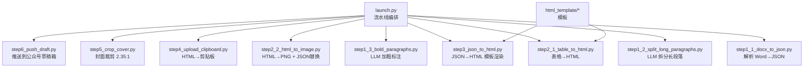
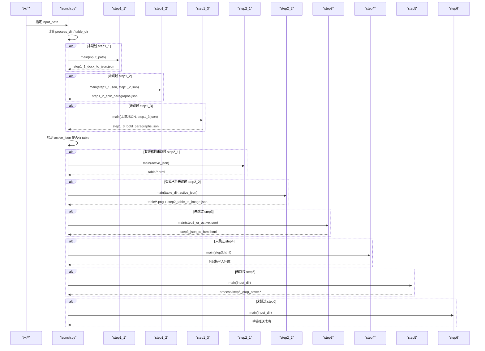
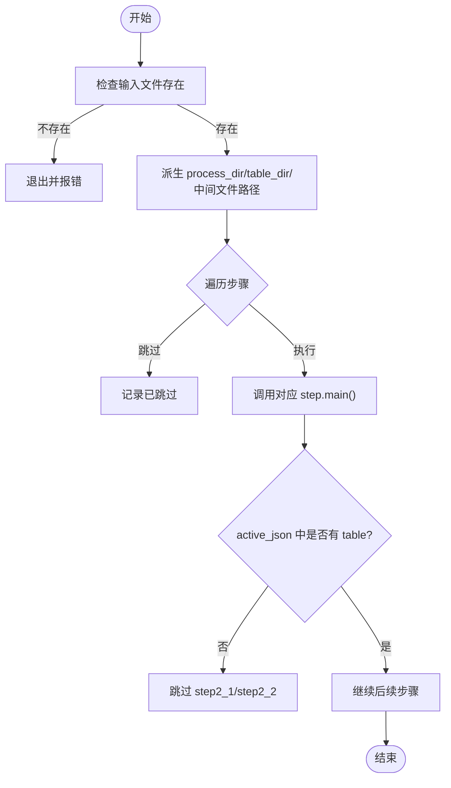
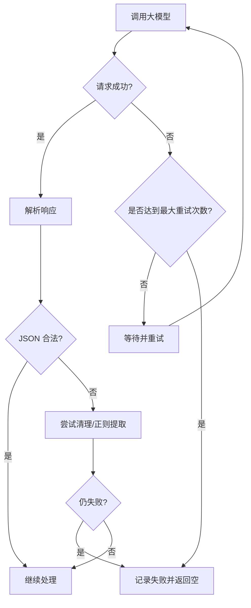
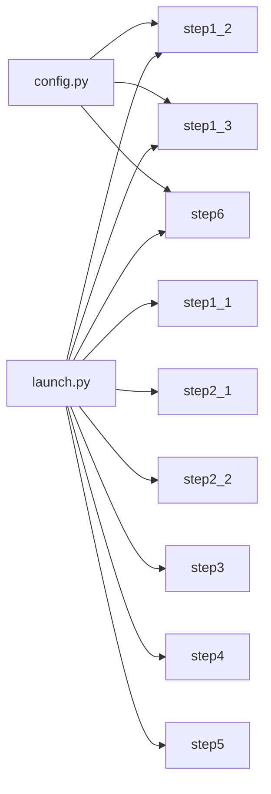

# 批量处理工具

<cite>
**本文引用的文件**   
- [config.py](file://config.py)
- [launch.py](file://launch.py)
- [step1_1_docx_to_json.py](file://step1_1_docx_to_json.py)
- [step1_2_split_long_paragraphs.py](file://step1_2_split_long_paragraphs.py)
- [step1_3_bold_paragraphs.py](file://step1_3_bold_paragraphs.py)
- [step2_1_table_to_html.py](file://step2_1_table_to_html.py)
- [step2_2_html_to_image.py](file://step2_2_html_to_image.py)
- [step3_json_to_html.py](file://step3_json_to_html.py)
- [step4_upload_clipboard.py](file://step4_upload_clipboard.py)
- [step5_crop_cover.py](file://step5_crop_cover.py)
- [step6_push_draft.py](file://step6_push_draft.py)
- [export_html.py](file://board_history/export_html.py)
- [import_html.py](file://board_history/import_html.py)
</cite>

## 目录
1. [简介](#简介)
2. [项目结构](#项目结构)
3. [核心组件](#核心组件)
4. [架构总览](#架构总览)
5. [详细组件分析](#详细组件分析)
6. [依赖关系分析](#依赖关系分析)
7. [性能与内存管理](#性能与内存管理)
8. [故障排查指南](#故障排查指南)
9. [结论](#结论)
10. [附录：使用示例与最佳实践](#附录使用示例与最佳实践)

## 简介
本工具是一套面向“Word 文档 → 微信公众号草稿箱”的端到端批处理流水线。它以可跳过的步骤化方式组织任务，支持段落拆分、加粗标注、表格转图、HTML 渲染、剪贴板写入、封面裁剪与草稿推送等能力。系统通过 JSON 中间态串联各阶段，具备输入校验、输出落盘、重试与超时保护、断点续传（基于中间产物）等工程化特性，适合对大量历史文章进行批量加工与发布。

## 项目结构
- 根目录脚本负责编排与调度，每个 step 脚本职责单一、可独立运行或按顺序被编排执行。
- 中间产物统一落在每个内容实例的 process 子目录下，便于断点续传与调试。
- 模板位于 html_template 目录，供 HTML 生成步骤复用。
- board_history 提供剪贴板导出/导入工具，用于人工编辑与回写。

图表来源
- [launch.py:42-193](file://launch.py#L42-L193)
- [step1_1_docx_to_json.py:190-226](file://step1_1_docx_to_json.py#L190-L226)
- [step1_2_split_long_paragraphs.py:198-301](file://step1_2_split_long_paragraphs.py#L198-L301)
- [step1_3_bold_paragraphs.py:207-330](file://step1_3_bold_paragraphs.py#L207-L330)
- [step2_1_table_to_html.py:74-118](file://step2_1_table_to_html.py#L74-L118)
- [step2_2_html_to_image.py:120-210](file://step2_2_html_to_image.py#L120-L210)
- [step3_json_to_html.py:121-142](file://step3_json_to_html.py#L121-L142)
- [step4_upload_clipboard.py:436-475](file://step4_upload_clipboard.py#L436-L475)
- [step5_crop_cover.py:174-196](file://step5_crop_cover.py#L174-L196)
- [step6_push_draft.py:276-397](file://step6_push_draft.py#L276-L397)

章节来源
- [launch.py:1-201](file://launch.py#L1-L201)

## 核心组件
- 配置中心：集中存放 API 地址、请求头、重试次数、分段阈值、公众号参数等。
- 编排器：根据开关控制步骤执行顺序与输入/输出路径派生。
- 数据模型：以 JSON 为中间态，定义元素类型（paragraph/table/image）、runs、heading_level 等字段。
- 外部集成：大模型接口、Selenium+Chrome 截图、Windows 剪贴板 API、微信公众号 API。

章节来源
- [config.py:1-39](file://config.py#L1-L39)
- [launch.py:28-39](file://launch.py#L28-L39)
- [step1_1_docx_to_json.py:145-184](file://step1_1_docx_to_json.py#L145-L184)

## 架构总览
整体采用“顺序流水线 + 可选跳过 + 中间产物持久化”的设计。每一步都产出明确的文件，既可作为下一步输入，也可作为断点恢复的依据。

图表来源
- [launch.py:42-193](file://launch.py#L42-L193)
- [step1_1_docx_to_json.py:190-226](file://step1_1_docx_to_json.py#L190-L226)
- [step1_2_split_long_paragraphs.py:198-301](file://step1_2_split_long_paragraphs.py#L198-L301)
- [step1_3_bold_paragraphs.py:207-330](file://step1_3_bold_paragraphs.py#L207-L330)
- [step2_1_table_to_html.py:74-118](file://step2_1_table_to_html.py#L74-L118)
- [step2_2_html_to_image.py:120-210](file://step2_2_html_to_image.py#L120-L210)
- [step3_json_to_html.py:121-142](file://step3_json_to_html.py#L121-L142)
- [step4_upload_clipboard.py:436-475](file://step4_upload_clipboard.py#L436-L475)
- [step5_crop_cover.py:174-196](file://step5_crop_cover.py#L174-L196)
- [step6_push_draft.py:276-397](file://step6_push_draft.py#L276-L397)

## 详细组件分析

### 任务调度与执行框架（launch.py）
- 功能要点
  - 根据 SKIP_* 标志决定是否执行某一步骤。
  - 自动派生 process_dir、table_dir 与各中间文件名。
  - 动态选择 active_json（考虑上游是否跳过）。
  - 自动检测是否存在表格元素，决定 step2_1/step2_2 是否执行。
  - 统计并打印每步耗时与总体耗时。
- 关键流程
  - 输入校验：检查 .docx 存在性。
  - 目录创建：process 与 table 目录按需创建。
  - 步骤调用：按序 import 并调用各模块 main。
  - 结果汇总：打印完成时间与最终状态。

图表来源
- [launch.py:42-193](file://launch.py#L42-L193)

章节来源
- [launch.py:28-39](file://launch.py#L28-L39)
- [launch.py:42-193](file://launch.py#L42-L193)

### 数据模型与中间态（JSON）
- 元素类型
  - paragraph：包含 runs 列表，runs 含 text 与 bold；heading_level 可为空、1 或 2。
  - table：包含 row_count、col_count、data（二维数组，单元格含 text/bold）。
  - image：包含 file_name、image_path。
- 文件命名约定
  - step1_1_docx_to_json.json
  - step1_2_split_paragraphs.json
  - step1_3_bold_paragraphs.json
  - step2_table_to_image.json
  - step3_json_to_html.html
- 设计优势
  - 解耦：每步仅依赖上一步产物，便于单独重跑。
  - 可观测：JSON 便于 diff 与定位问题。
  - 可恢复：任意步骤失败后，从最近成功产物继续。

章节来源
- [step1_1_docx_to_json.py:145-184](file://step1_1_docx_to_json.py#L145-L184)
- [step1_1_docx_to_json.py:190-226](file://step1_1_docx_to_json.py#L190-L226)
- [step2_2_html_to_image.py:175-210](file://step2_2_html_to_image.py#L175-L210)

### 输入验证与输出管理
- 输入验证
  - 文件存在性与扩展名校验（如 .docx）。
  - JSON 文件存在性校验。
  - 目录存在性校验（如 table_dir）。
- 输出管理
  - 所有中间产物均写入 process 子目录，避免污染源文件。
  - 图片与表格截图分别落入 images 与 table 子目录。
  - 部分步骤会生成额外辅助文件（如 step4 的内联样式 HTML、step6 的 media_id 缓存）。

章节来源
- [step1_1_docx_to_json.py:190-206](file://step1_1_docx_to_json.py#L190-L206)
- [step2_2_html_to_image.py:120-142](file://step2_2_html_to_image.py#L120-L142)
- [step4_upload_clipboard.py:455-462](file://step4_upload_clipboard.py#L455-L462)
- [step6_push_draft.py:313-327](file://step6_push_draft.py#L313-L327)

### 进度跟踪与状态监控
- 控制台日志
  - 每步开始前打印分隔线与步骤编号。
  - 关键信息包括：输入/输出路径、元素数量、调用次数、失败项等。
- 中间产物
  - JSON 中的 total_elements、elements 列表可用于自动化校验。
  - 截图失败清单、媒体 ID 缓存文件便于快速定位问题。

章节来源
- [launch.py:62-66](file://launch.py#L62-L66)
- [step1_2_split_long_paragraphs.py:236-285](file://step1_2_split_long_paragraphs.py#L236-L285)
- [step2_2_html_to_image.py:144-169](file://step2_2_html_to_image.py#L144-L169)

### 错误恢复与重试机制
- 网络请求重试
  - 大模型调用封装了指数退避重试（固定间隔递增），并在达到最大重试次数后返回失败。
- 截图超时保护
  - 使用线程计时器在 Chrome 无响应时强制终止进程，避免卡死。
- 断点续传
  - 基于中间 JSON/HTML/PNG 产物，可按需跳过已完成步骤，直接重跑失败步骤。
- 异常处理策略
  - 常见异常（网络、IO、解析）均有捕获与提示，必要时保留上游数据不覆盖。

图表来源
- [step1_2_split_long_paragraphs.py:80-103](file://step1_2_split_long_paragraphs.py#L80-L103)
- [step1_2_split_long_paragraphs.py:106-140](file://step1_2_split_long_paragraphs.py#L106-L140)
- [step2_2_html_to_image.py:64-94](file://step2_2_html_to_image.py#L64-L94)

章节来源
- [step1_2_split_long_paragraphs.py:80-103](file://step1_2_split_long_paragraphs.py#L80-L103)
- [step1_3_bold_paragraphs.py:73-96](file://step1_3_bold_paragraphs.py#L73-L96)
- [step6_push_draft.py:188-211](file://step6_push_draft.py#L188-L211)
- [step2_2_html_to_image.py:64-94](file://step2_2_html_to_image.py#L64-L94)

### 并发处理与资源管理
- 当前实现为单进程顺序执行，确保中间产物一致性与可追踪性。
- 截图过程通过 headless Chrome 无头模式运行，配合超时保护与进程清理，避免资源泄漏。
- 建议扩展方向
  - 对 step1_2/step1_3 的 LLM 调用引入队列与限流，降低瞬时压力。
  - 对 step2_2 的截图任务引入多进程池，但需注意共享临时目录与锁。

章节来源
- [step2_2_html_to_image.py:40-101](file://step2_2_html_to_image.py#L40-L101)

### 配置管理与参数传递
- 全局配置
  - API_URL、HEADERS、MAX_RETRIES、MAX_TOKENS、SPLIT_THRESHOLD、WX_* 系列参数。
- 参数传递
  - launch.py 通过函数参数与默认路径派生在各 step 间传递上下文。
  - 各 step 内部通过相对路径与 os.path 组合定位输入/输出。

章节来源
- [config.py:1-39](file://config.py#L1-L39)
- [launch.py:42-66](file://launch.py#L42-L66)

### 具体使用示例（批量处理历史数据）
- 批量入口
  - 修改 launch.py 的 __main__ 块中的 input_path，指向目标 .docx 文件。
  - 根据需要设置 SKIP_* 标志，跳过不需要执行的步骤。
- 批量历史数据
  - 将多个 content_instance 目录下的 .docx 逐一传入 run_pipeline。
  - 若需要全量重跑，可将 SKIP_* 全部置为 False。
- 剪贴板编辑与回写
  - 使用 export_html.py 将剪贴板导出为可编辑 HTML。
  - 编辑 article 区域后，用 import_html.py 写回剪贴板。

章节来源
- [launch.py:196-201](file://launch.py#L196-L201)
- [export_html.py:466-516](file://board_history/export_html.py#L466-L516)
- [import_html.py:427-483](file://board_history/import_html.py#L427-L483)

## 依赖关系分析
- 外部依赖
  - requests：大模型与微信公众号 API 调用。
  - selenium + Chrome：HTML 截图。
  - opencv-python/numpy：封面裁剪与压缩。
  - python-docx：解析 .docx。
  - ctypes：Windows 剪贴板写入。
- 内部耦合
  - launch.py 强耦合于各 step 的 main 签名与产物命名。
  - step1_2/step1_3/step6 共用 config 中的 API 与头部。
  - step2_2 依赖 step2_1 产物的命名规则与位置。

图表来源
- [config.py:1-39](file://config.py#L1-L39)
- [launch.py:42-193](file://launch.py#L42-L193)

章节来源
- [config.py:1-39](file://config.py#L1-L39)
- [launch.py:42-193](file://launch.py#L42-L193)

## 性能与内存管理
- 性能优化建议
  - 并行化 LLM 调用：对 step1_2/step1_3 增加并发队列与速率限制，结合重试与熔断。
  - 截图并发：对 step2_2 使用进程池，限制同时运行的 Chrome 实例数，避免 OOM。
  - 模板与 HTML 渲染：避免重复加载模板，可在内存中缓存。
  - 图片处理：优先 JPEG 质量二分搜索，减少不必要的缩放迭代。
- 内存管理最佳实践
  - 大文本截断：step6 对正文长度做上限截断，避免超出模型上下文窗口。
  - 及时释放资源：截图完成后显式 quit 浏览器驱动，清理残留进程。
  - 避免大对象常驻：逐条处理 elements，不在内存中累积过多中间字符串。

章节来源
- [step6_push_draft.py:227-246](file://step6_push_draft.py#L227-L246)
- [step2_2_html_to_image.py:95-101](file://step2_2_html_to_image.py#L95-L101)
- [step5_crop_cover.py:59-107](file://step5_crop_cover.py#L59-L107)

## 故障排查指南
- 常见问题
  - 大模型调用失败：检查网络、API_KEY、请求头与 MAX_TOKENS；查看重试日志。
  - 截图失败/超时：确认 Chrome 安装与版本，检查 headless 参数与超时时间。
  - 剪贴板写入失败：确认 Windows 权限与 clipboard 占用情况。
  - 标题过长：step6 会自动截断至字节上限，注意实际显示效果。
- 定位方法
  - 查看 process 目录中间产物，对比前后差异。
  - 关注控制台输出的 [WARN]/[ERROR] 行，定位失败步骤与原因。
  - 使用 step4 生成的内联样式 HTML 与 step6 的 media_id 缓存辅助诊断。

章节来源
- [step1_2_split_long_paragraphs.py:251-272](file://step1_2_split_long_paragraphs.py#L251-L272)
- [step2_2_html_to_image.py:156-169](file://step2_2_html_to_image.py#L156-L169)
- [step4_upload_clipboard.py:436-475](file://step4_upload_clipboard.py#L436-L475)
- [step6_push_draft.py:303-309](file://step6_push_draft.py#L303-L309)

## 结论
该批处理工具以清晰的步骤化设计与稳定的中间产物为基础，实现了从 Word 到公众号草稿箱的全链路自动化。其重试、超时保护与断点续传能力保障了大规模历史数据的稳定处理。未来可通过并发改造与资源管控进一步提升吞吐与稳定性。

## 附录：使用示例与最佳实践
- 单次处理
  - 修改 launch.py 的 input_path，运行即可。
- 批量处理
  - 遍历 content_instance 下多个目录，逐个调用 run_pipeline。
  - 对于仅需局部重跑的场景，设置相应 SKIP_* 标志。
- 剪贴板编辑
  - 使用 export_html.py 导出，编辑 article 区域后，用 import_html.py 写回。
- 参数调优
  - 调整 SPLIT_THRESHOLD 控制段落拆分粒度。
  - 调整 MAX_TOKENS 与 MAX_RETRIES 平衡质量与稳定性。
  - 调整 CHROME_TIMEOUT 与截图并发度提升效率。

章节来源
- [launch.py:196-201](file://launch.py#L196-L201)
- [config.py:20-24](file://config.py#L20-L24)
- [step2_2_html_to_image.py:34](file://step2_2_html_to_image.py#L34)
- [export_html.py:466-516](file://board_history/export_html.py#L466-L516)
- [import_html.py:427-483](file://board_history/import_html.py#L427-L483)