# 数据导入功能

<cite>
**本文引用的文件**   
- [import_html.py](file://board_history/import_html.py)
- [export_html.py](file://board_history/export_html.py)
- [restore_clipboard.py](file://board_history/restore_clipboard.py)
- [save_clipboard.py](file://board_history/save_clipboard.py)
- [docx_to_clipboard.py](file://board_history/docx_to_clipboard.py)
- [step4_upload_clipboard.py](file://step4_upload_clipboard.py)
- [clipboard_export.html](file://board_history/clipboard_export.html)
- [manifest.json](file://board_history/clipboard_data/manifest.json)
</cite>

## 目录
1. [简介](#简介)
2. [项目结构](#项目结构)
3. [核心组件](#核心组件)
4. [架构总览](#架构总览)
5. [详细组件分析](#详细组件分析)
6. [依赖关系分析](#依赖关系分析)
7. [性能与兼容性](#性能与兼容性)
8. [故障排查指南](#故障排查指南)
9. [结论](#结论)
10. [附录：使用示例](#附录使用示例)

## 简介
本技术文档聚焦于“数据导入”能力，围绕从 HTML 导出文件中解析内容、恢复原始剪贴板格式、将数据写回 Windows 剪贴板的完整流程展开。重点覆盖以下方面：
- HTML 文件的解析过程：内容片段提取与原始格式清单读取
- 模式扩展算法：占位符（简化类名）替换与内容重构逻辑
- 空白字符标准化处理与文本清洗机制
- 剪贴板格式的重新构建：HTML Format 二进制、纯文本及多编码文本
- 增量更新策略：基于版本与内容对比的“原样复用 vs 重建”决策
- 版本兼容性与冲突解决策略
- 具体使用示例：如何将导出的数据恢复到系统剪贴板

## 项目结构
与数据导入相关的核心脚本与产物如下：
- 导出器：将剪贴板数据导出为可编辑 HTML + 隐藏元数据
- 导入器：解析 HTML，按需重建或复用原始二进制，写入剪贴板
- 直接恢复器：从本地保存的剪贴板数据文件夹中恢复所有格式
- 辅助工具：从 docx 生成剪贴板数据、流水线集成等

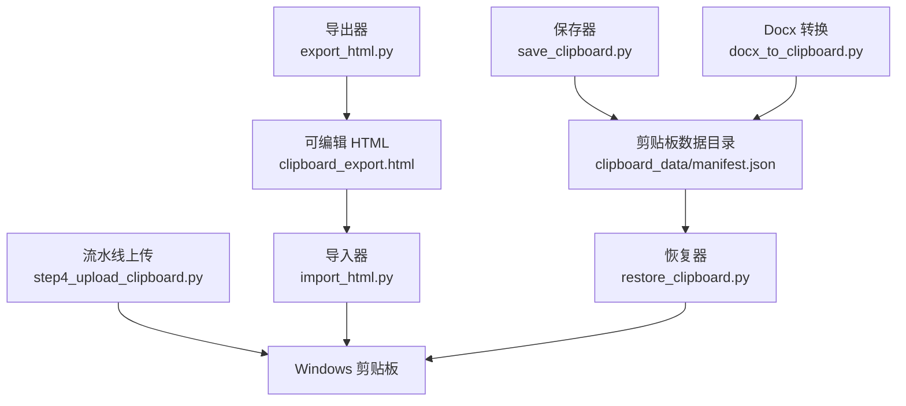

图表来源
- [export_html.py:265-460](file://board_history/export_html.py#L265-L460)
- [import_html.py:70-112](file://board_history/import_html.py#L70-L112)
- [restore_clipboard.py:81-152](file://board_history/restore_clipboard.py#L81-L152)
- [save_clipboard.py:116-181](file://board_history/save_clipboard.py#L116-L181)
- [docx_to_clipboard.py:415-467](file://board_history/docx_to_clipboard.py#L415-L467)
- [step4_upload_clipboard.py:436-475](file://step4_upload_clipboard.py#L436-L475)

章节来源
- [export_html.py:265-460](file://board_history/export_html.py#L265-L460)
- [import_html.py:70-112](file://board_history/import_html.py#L70-L112)
- [restore_clipboard.py:81-152](file://board_history/restore_clipboard.py#L81-L152)
- [save_clipboard.py:116-181](file://board_history/save_clipboard.py#L116-L181)
- [docx_to_clipboard.py:415-467](file://board_history/docx_to_clipboard.py#L415-L467)
- [step4_upload_clipboard.py:436-475](file://step4_upload_clipboard.py#L436-L475)

## 核心组件
- 导出器（export_html.py）
  - 加载剪贴板二进制数据并解析 HTML Format
  - 格式化 HTML 片段便于阅读与编辑
  - 将常见样式模式折叠为简洁的 class 占位符（title/body/body-bold/empty-line/hl）
  - 生成包含内容区与隐藏元数据的 HTML 文件
- 导入器（import_html.py）
  - 解析 HTML 文件，提取内容片段与原始格式清单
  - 执行模式扩展与空白标准化
  - 检测是否被用户编辑，决定“原样复用”还是“重建关键格式”
  - 构建剪贴板所需的多格式数据并写入系统剪贴板
- 恢复器（restore_clipboard.py）
  - 从本地 manifest.json 与对应 .bin 文件恢复全部格式到剪贴板
- 保存器（save_clipboard.py）
  - 枚举当前剪贴板的所有格式并保存到本地目录
- Docx 转换（docx_to_clipboard.py）
  - 将 Word 文档转换为剪贴板数据目录（含 HTML Format、CF_UNICODETEXT、CF_TEXT/OEMTEXT、CF_LOCALE 等）
- 流水线上传（step4_upload_clipboard.py）
  - 在流水线中将渲染后的 HTML 转为剪贴板数据，支持图片内联 base64

章节来源
- [export_html.py:94-227](file://board_history/export_html.py#L94-L227)
- [import_html.py:118-207](file://board_history/import_html.py#L118-L207)
- [restore_clipboard.py:81-152](file://board_history/restore_clipboard.py#L81-L152)
- [save_clipboard.py:116-181](file://board_history/save_clipboard.py#L116-L181)
- [docx_to_clipboard.py:300-409](file://board_history/docx_to_clipboard.py#L300-L409)
- [step4_upload_clipboard.py:194-222](file://step4_upload_clipboard.py#L194-L222)

## 架构总览
下图展示了从“保存 → 导出 → 编辑 → 导入/恢复 → 写入剪贴板”的整体流程与数据流向。

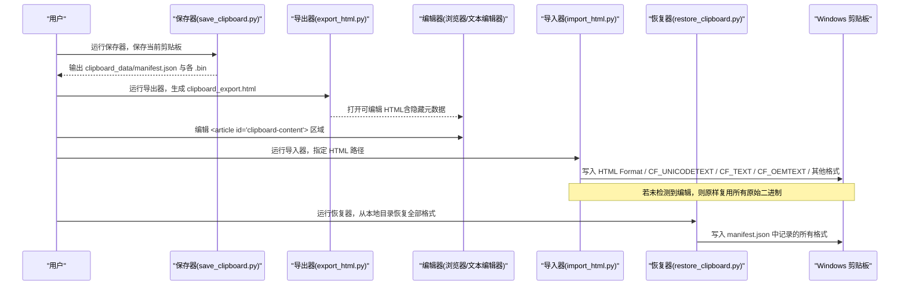

图表来源
- [save_clipboard.py:116-181](file://board_history/save_clipboard.py#L116-L181)
- [export_html.py:265-460](file://board_history/export_html.py#L265-L460)
- [import_html.py:427-478](file://board_history/import_html.py#L427-L478)
- [restore_clipboard.py:81-152](file://board_history/restore_clipboard.py#L81-L152)

## 详细组件分析

### HTML 文件解析与内容片段提取
- 解析目标
  - 从 HTML 中提取 <article id="clipboard-content"> 的内容片段
  - 从 <script type="application/json" id="cb-raw-data"> 中读取原始格式清单与可选的原始片段/纯文本
- 行为说明
  - 若缺少 cb-raw-data，导入器会提示并尝试从内容重建所有格式
  - 返回 content_fragment、raw_formats、original_fragment、original_plain_text

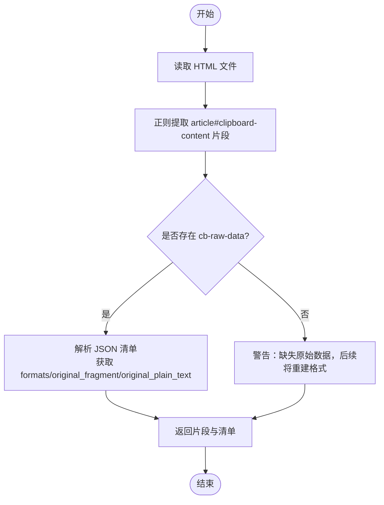

图表来源
- [import_html.py:70-112](file://board_history/import_html.py#L70-L112)

章节来源
- [import_html.py:70-112](file://board_history/import_html.py#L70-L112)

### 模式扩展算法（占位符替换与内容重构）
- 识别的模式（由导出器折叠，导入器还原）
  - title：大标题（section+strong）
  - body-bold：正文加粗（绿色背景+strong）
  - body：普通正文段落
  - empty-line：空行（br）
  - hl：内联高亮（绿色背景+strong）
- 扩展规则
  - 将简化的 <p class="..."> 与 <span class="hl"> 替换为完整的 Xiumi 风格内联样式 HTML
  - 确保生成的 HTML 结构与 Windows 剪贴板期望一致

```mermaid
flowchart TD
S(["输入片段"]) --> T1["匹配 <p class=\"title\"> 并替换为 section+p+strong"]
T1 --> T2["匹配 <p class=\"body-bold\"> 并替换为 p+span+strong"]
T2 --> T3["匹配 <p class=\"body\"> 并替换为 p"]
T3 --> T4["匹配 <p class=\"empty-line\"><br></p> 并替换为带样式的 br"]
T4 --> T5["匹配 <span class=\"hl\"> 并替换为 span+strong"]
T5 --> E(["输出完整内联样式片段"])
```

图表来源
- [import_html.py:118-190](file://board_history/import_html.py#L118-L190)
- [export_html.py:148-227](file://board_history/export_html.py#L148-L227)

章节来源
- [import_html.py:118-190](file://board_history/import_html.py#L118-L190)
- [export_html.py:148-227](file://board_history/export_html.py#L148-L227)

### 空白字符标准化与文本清洗
- 空白标准化
  - 移除标签间因格式化产生的换行与缩进，恢复紧凑结构
  - 清理闭合标签间的多余空格
- 文本清洗（用于生成纯文本）
  - 将 <br> 转换为换行
  - 块级闭合标签后插入三段换行以模拟段落分隔
  - 去除所有标签、解码 HTML 实体、压缩连续换行

```mermaid
flowchart TD
A["输入片段"] --> N1["移除标签前换行与缩进"]
N1 --> N2["移除闭合标签前的尾随空白"]
N2 --> N3["移除闭合标签与文本间的换行缩进"]
N3 --> N4["合并相邻闭合标签间的空格"]
N4 --> B["标准化后的片段"]
B --> P1["<br> -> \\n"]
P1 --> P2["块级闭合 -> \\n\\n\\n"]
P2 --> P3["去除所有标签"]
P3 --> P4["解码实体 &amp; &lt; &gt; &quot; &#39; &nbsp;"]
P4 --> P5["压缩连续换行至最多三段"]
P5 --> P6["strip() 去首尾空白"]
P6 --> C["纯文本结果"]
```

图表来源
- [import_html.py:193-207](file://board_history/import_html.py#L193-L207)
- [import_html.py:256-270](file://board_history/import_html.py#L256-L270)

章节来源
- [import_html.py:193-207](file://board_history/import_html.py#L193-L207)
- [import_html.py:256-270](file://board_history/import_html.py#L256-L270)

### 剪贴板格式重建（HTML Format 二进制与纯文本）
- HTML Format 二进制
  - 构造标准头部（Version、StartHTML、EndHTML、StartFragment、EndFragment）
  - 计算各偏移量，拼接 prefix、fragment、suffix，并以 null 结尾
- 纯文本与多编码文本
  - CF_UNICODETEXT：UTF-16LE + 双字节终止符
  - CF_TEXT：优先 cp936（ANSI），失败回退 UTF-8 + 单字节终止符
  - CF_OEMTEXT：与 CF_TEXT 相同
  - CF_LOCALE：优先使用原始数据，否则默认 zh-CN（2052）
- 其他格式（如 Chromium 内部 token/URL）
  - 直接从原始清单中 base64 解码并透传

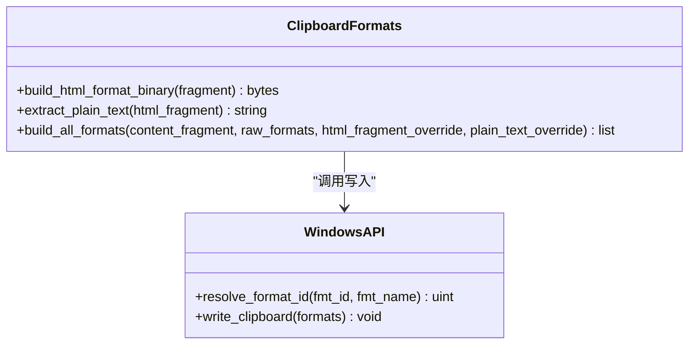

图表来源
- [import_html.py:213-356](file://board_history/import_html.py#L213-L356)
- [import_html.py:362-421](file://board_history/import_html.py#L362-L421)

章节来源
- [import_html.py:213-356](file://board_history/import_html.py#L213-L356)
- [import_html.py:362-421](file://board_history/import_html.py#L362-L421)

### 增量更新与版本兼容性处理
- 版本信息
  - 导出器在元数据中包含 version=3，以及 original_fragment 与 original_plain_text
- 内容变更检测
  - 导入器将当前片段与“折叠后的原始片段”进行比对
  - 若未变化：直接复用所有原始二进制数据（零重建）
  - 若有变化：仅重建 HTML Format、CF_UNICODETEXT、CF_TEXT、CF_OEMTEXT、CF_LOCALE；其余格式保持原样
- 兼容性策略
  - 若缺失 cb-raw-data：按内容重建所有必要格式
  - 若 CF_LOCALE 缺失：使用默认 zh-CN
  - 自定义格式 ID 通过 RegisterClipboardFormatW 动态解析

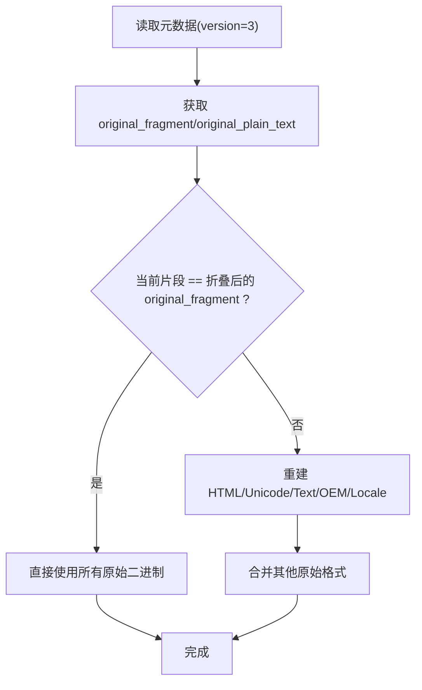

图表来源
- [export_html.py:298-304](file://board_history/export_html.py#L298-L304)
- [import_html.py:451-475](file://board_history/import_html.py#L451-L475)

章节来源
- [export_html.py:298-304](file://board_history/export_html.py#L298-L304)
- [import_html.py:451-475](file://board_history/import_html.py#L451-L475)

### 直接恢复器（从本地目录恢复全部格式）
- 读取 manifest.json，遍历每个条目对应的 .bin 文件
- 对每个格式分配内存、拷贝数据、设置到剪贴板
- 支持标准格式与注册格式（通过名称动态解析）

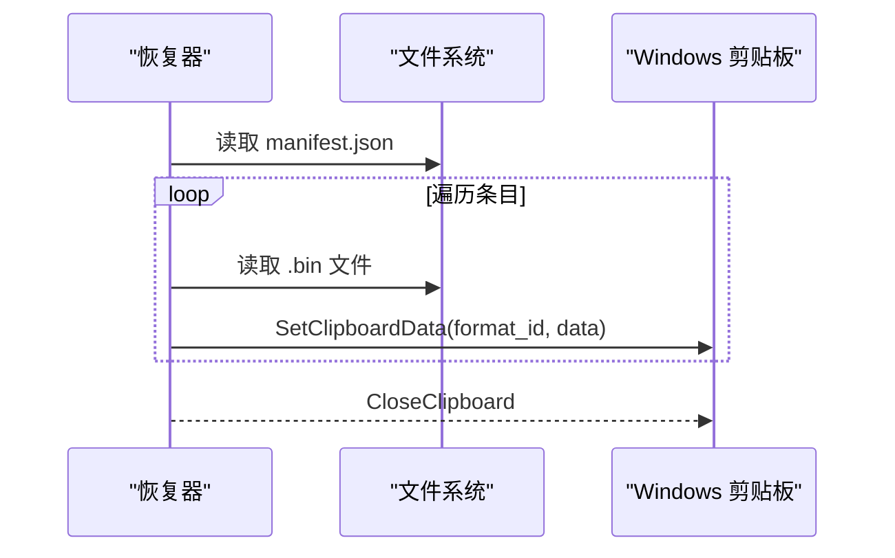

图表来源
- [restore_clipboard.py:81-152](file://board_history/restore_clipboard.py#L81-L152)

章节来源
- [restore_clipboard.py:81-152](file://board_history/restore_clipboard.py#L81-L152)

### 保存器（枚举并保存剪贴板所有格式）
- 枚举剪贴板格式数量与类型
- 获取每个格式的数据大小与指针，拷贝为二进制文件
- 生成 manifest.json 记录格式 ID、名称、文件名与大小

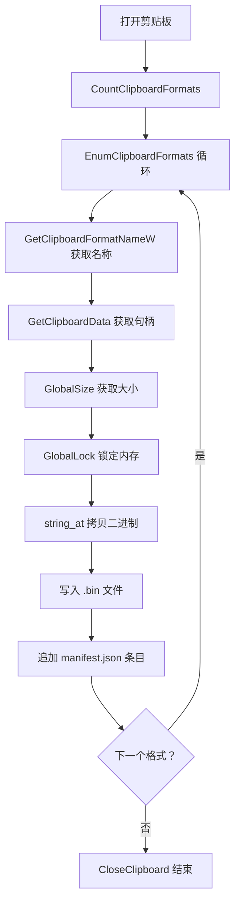

图表来源
- [save_clipboard.py:116-181](file://board_history/save_clipboard.py#L116-L181)

章节来源
- [save_clipboard.py:116-181](file://board_history/save_clipboard.py#L116-L181)

### Docx 转换（生成剪贴板数据目录）
- 解析 docx XML，抽取段落与 run 级别格式
- 分类段落为 title/heading/body/empty，生成 Xiumi 风格 HTML
- 构建 HTML Format 二进制与纯文本，写出 manifest.json 与 config.json

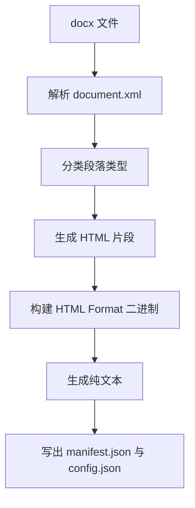

图表来源
- [docx_to_clipboard.py:33-116](file://board_history/docx_to_clipboard.py#L33-L116)
- [docx_to_clipboard.py:268-294](file://board_history/docx_to_clipboard.py#L268-L294)
- [docx_to_clipboard.py:300-409](file://board_history/docx_to_clipboard.py#L300-L409)

章节来源
- [docx_to_clipboard.py:33-116](file://board_history/docx_to_clipboard.py#L33-L116)
- [docx_to_clipboard.py:268-294](file://board_history/docx_to_clipboard.py#L268-L294)
- [docx_to_clipboard.py:300-409](file://board_history/docx_to_clipboard.py#L300-L409)

### 流水线上传（HTML → 剪贴板，支持图片内联）
- 解析 HTML 片段，扩展模式，标准化空白
- 将本地图片路径替换为 base64 data URI（适配剪贴板粘贴）
- 构建多格式数据并写入剪贴板

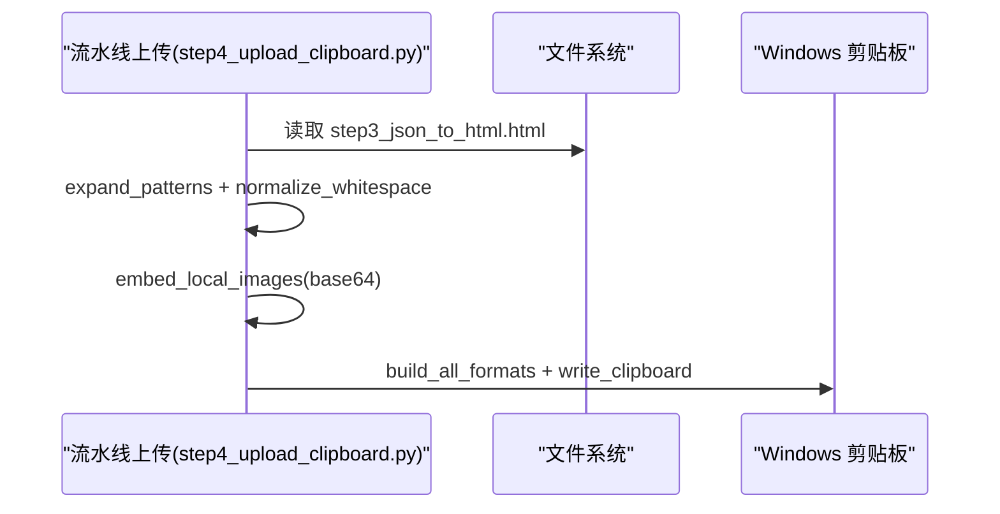

图表来源
- [step4_upload_clipboard.py:194-222](file://step4_upload_clipboard.py#L194-L222)
- [step4_upload_clipboard.py:436-475](file://step4_upload_clipboard.py#L436-L475)

章节来源
- [step4_upload_clipboard.py:194-222](file://step4_upload_clipboard.py#L194-L222)
- [step4_upload_clipboard.py:436-475](file://step4_upload_clipboard.py#L436-L475)

## 依赖关系分析
- 模块耦合
  - import_html.py 依赖 export_html.py 的 collapse_patterns/format_html_fragment 用于“未编辑”判定
  - restore_clipboard.py 与 save_clipboard.py 通过 manifest.json 约定数据结构
  - step4_upload_clipboard.py 与流水线其他步骤共享 HTML 片段与资源路径
- 外部依赖
  - Windows API（user32、kernel32）用于剪贴板读写与全局内存管理
  - 正则表达式用于 HTML 解析与模式匹配
  - base64 与 json 用于元数据与二进制编解码

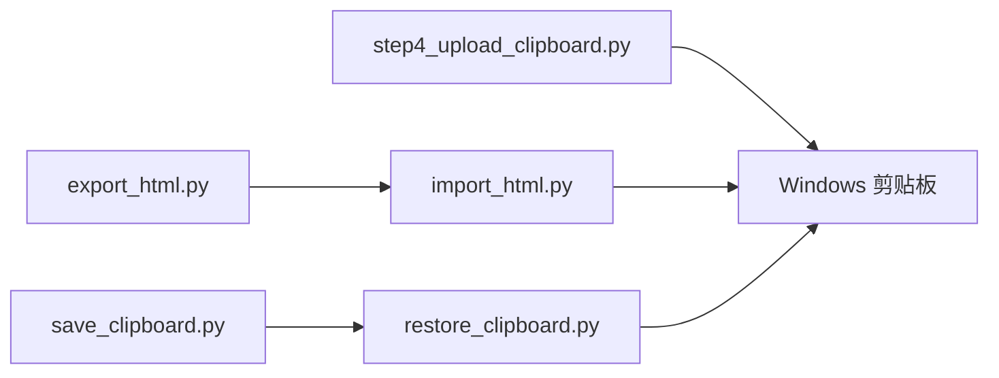

图表来源
- [import_html.py:454-456](file://board_history/import_html.py#L454-L456)
- [restore_clipboard.py:81-152](file://board_history/restore_clipboard.py#L81-L152)
- [save_clipboard.py:116-181](file://board_history/save_clipboard.py#L116-L181)
- [step4_upload_clipboard.py:436-475](file://step4_upload_clipboard.py#L436-L475)

章节来源
- [import_html.py:454-456](file://board_history/import_html.py#L454-L456)
- [restore_clipboard.py:81-152](file://board_history/restore_clipboard.py#L81-L152)
- [save_clipboard.py:116-181](file://board_history/save_clipboard.py#L116-L181)
- [step4_upload_clipboard.py:436-475](file://step4_upload_clipboard.py#L436-L475)

## 性能与兼容性
- 性能要点
  - 未编辑场景下直接复用原始二进制，避免重复构建，显著降低 CPU 与 I/O 开销
  - 正则替换与字符串拼接为线性复杂度，适合中等规模片段
- 兼容性要点
  - 标准格式 ID ≤ 17 直接使用；自定义格式通过名称动态注册
  - 缺失元数据时提供降级策略（重建必要格式、默认语言环境）
  - 文本编码优先 ANSI（cp936），失败回退 UTF-8，保证跨应用粘贴

[本节为通用指导，不直接分析具体文件]

## 故障排查指南
- 无法打开剪贴板
  - 现象：OpenClipboard 失败
  - 排查：确认没有其他程序独占剪贴板；重试次数已内置
- 某格式写入失败
  - 现象：SetClipboardData 失败
  - 排查：检查 format_id 与名称是否匹配；查看 GetLastError 返回值
- 图片丢失或无法显示
  - 现象：粘贴后图片不可见
  - 排查：确认图片路径存在且已被替换为 base64 data URI
- 纯文本乱码
  - 现象：CF_TEXT 显示异常
  - 排查：确认 cp936 编码失败时的回退逻辑生效；必要时手动调整编码

章节来源
- [import_html.py:362-421](file://board_history/import_html.py#L362-L421)
- [restore_clipboard.py:118-147](file://board_history/restore_clipboard.py#L118-L147)
- [step4_upload_clipboard.py:194-222](file://step4_upload_clipboard.py#L194-L222)

## 结论
本数据导入方案通过“可编辑 HTML + 隐藏元数据”的设计，实现了：
- 安全的增量更新：未编辑即原样复用，编辑则精准重建
- 可靠的格式重建：HTML Format 二进制与多编码纯文本
- 良好的兼容性：动态格式解析与降级策略
- 便捷的使用体验：一键导出/导入/恢复，支持流水线集成

[本节为总结性内容，不直接分析具体文件]

## 附录：使用示例
- 从剪贴板保存到本地
  - 运行：python board_history/save_clipboard.py [output_dir]
  - 输出：clipboard_data/manifest.json 与各 .bin 文件
- 从本地数据导出为可编辑 HTML
  - 运行：python board_history/export_html.py [clipboard_data_dir] [output.html]
  - 产物：clipboard_export.html（含内容区与隐藏元数据）
- 编辑并导入回剪贴板
  - 打开 clipboard_export.html，编辑 <article id="clipboard-content"> 区域
  - 运行：python board_history/import_html.py [clipboard_export.html]
- 从本地数据直接恢复全部格式
  - 运行：python board_history/restore_clipboard.py [input_dir]
- 从 docx 生成剪贴板数据目录
  - 运行：python board_history/docx_to_clipboard.py <docx_file> [output_dir]
- 流水线上传（HTML → 剪贴板，图片内联）
  - 运行：python step4_upload_clipboard.py [html_path]

章节来源
- [save_clipboard.py:184-188](file://board_history/save_clipboard.py#L184-L188)
- [export_html.py:466-511](file://board_history/export_html.py#L466-L511)
- [import_html.py:427-478](file://board_history/import_html.py#L427-L478)
- [restore_clipboard.py:155-159](file://board_history/restore_clipboard.py#L155-L159)
- [docx_to_clipboard.py:470-478](file://board_history/docx_to_clipboard.py#L470-L478)
- [step4_upload_clipboard.py:478-480](file://step4_upload_clipboard.py#L478-L480)