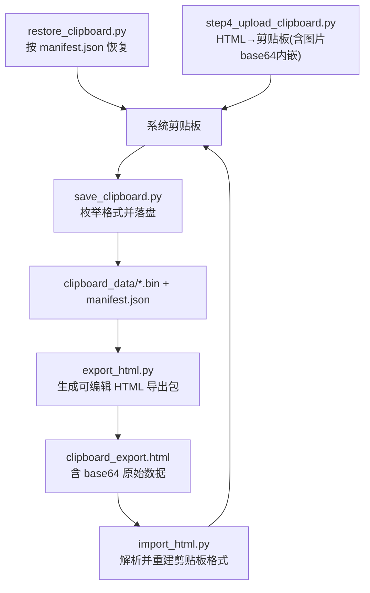
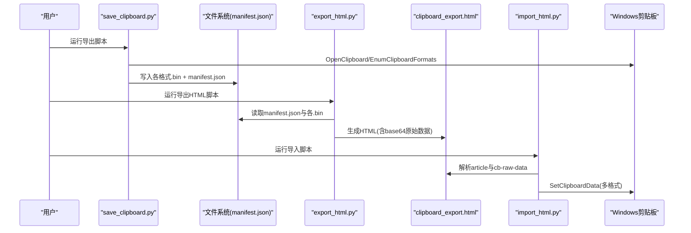
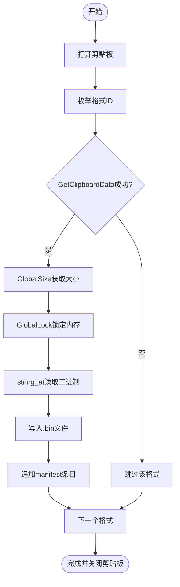
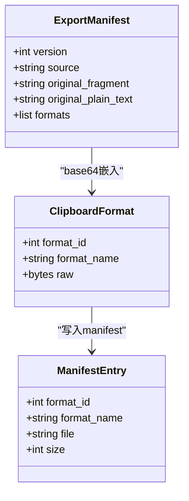
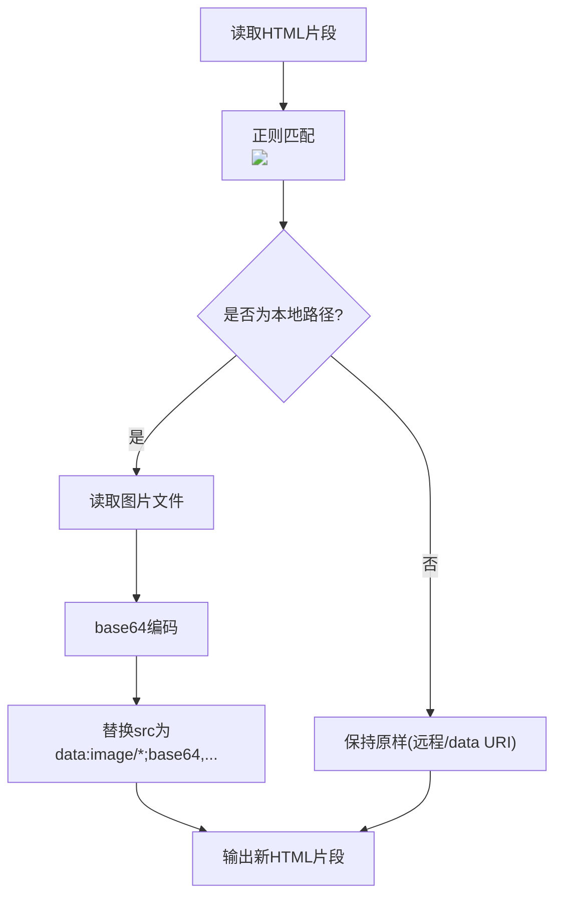
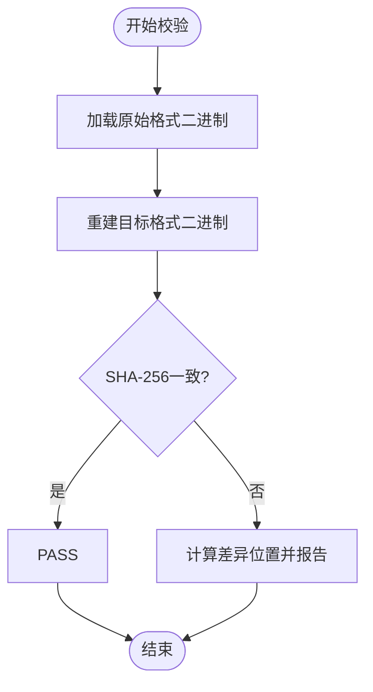
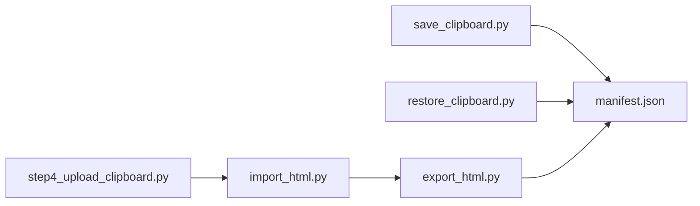

# 数据导出功能

<cite>
**本文引用的文件列表**
- [board_history/save_clipboard.py](file://board_history/save_clipboard.py)
- [board_history/restore_clipboard.py](file://board_history/restore_clipboard.py)
- [board_history/export_html.py](file://board_history/export_html.py)
- [board_history/import_html.py](file://board_history/import_html.py)
- [board_history/_verify_roundtrip.py](file://board_history/_verify_roundtrip.py)
- [board_history/clipboard_data/manifest.json](file://board_history/clipboard_data/manifest.json)
- [step4_upload_clipboard.py](file://step4_upload_clipboard.py)
- [config.py](file://config.py)
</cite>

## 目录
1. [简介](#简介)
2. [项目结构](#项目结构)
3. [核心组件](#核心组件)
4. [架构总览](#架构总览)
5. [详细组件分析](#详细组件分析)
6. [依赖关系分析](#依赖关系分析)
7. [性能与压缩策略](#性能与压缩策略)
8. [故障排查指南](#故障排查指南)
9. [结论](#结论)
10. [附录：使用示例](#附录使用示例)

## 简介
本技术文档聚焦于“剪贴板数据导出”的完整链路，覆盖从系统剪贴板读取多格式数据、序列化到本地文件、生成可编辑 HTML 导出包、再写回剪贴板的闭环。重点包括：
- Windows 剪贴板多格式（HTML Format、CF_UNICODETEXT、CF_TEXT、CF_OEMTEXT、CF_LOCALE 及 Chromium 内部格式等）的枚举、解析与保存
- manifest.json 清单结构与元数据管理
- base64 图片内嵌处理逻辑与体积控制策略
- 数据完整性校验与错误处理机制
- 批量导出能力与进度跟踪实现细节

## 项目结构
围绕导出功能的代码主要分布在 board_history 与 step4_upload_clipboard.py 中：
- save_clipboard.py：从系统剪贴板枚举所有格式并落盘为 .bin 文件，同时生成 manifest.json
- export_html.py：将 clipboard_data 目录下的二进制数据转换为结构化、可编辑的 HTML 导出包，并将原始二进制以 base64 嵌入隐藏区域
- import_html.py：读取 export_html.py 生成的 HTML，解析内容与原始数据，重建剪贴板多格式并写回
- restore_clipboard.py：直接根据 manifest.json 将历史剪贴板数据恢复至系统剪贴板
- _verify_roundtrip.py：对导出→导入流程进行端到端一致性校验（SHA-256 对比）
- step4_upload_clipboard.py：流水线步骤，负责将 HTML 内容写入剪贴板，包含图片 base64 内嵌

图表来源
- [board_history/save_clipboard.py:116-187](file://board_history/save_clipboard.py#L116-L187)
- [board_history/export_html.py:265-460](file://board_history/export_html.py#L265-L460)
- [board_history/import_html.py:273-421](file://board_history/import_html.py#L273-L421)
- [board_history/restore_clipboard.py:81-152](file://board_history/restore_clipboard.py#L81-L152)
- [step4_upload_clipboard.py:288-430](file://step4_upload_clipboard.py#L288-L430)

章节来源
- [board_history/save_clipboard.py:116-187](file://board_history/save_clipboard.py#L116-L187)
- [board_history/export_html.py:265-460](file://board_history/export_html.py#L265-L460)
- [board_history/import_html.py:273-421](file://board_history/import_html.py#L273-L421)
- [board_history/restore_clipboard.py:81-152](file://board_history/restore_clipboard.py#L81-L152)
- [step4_upload_clipboard.py:288-430](file://step4_upload_clipboard.py#L288-L430)

## 核心组件
- 剪贴板枚举与落盘（Windows API）：通过 user32 和 kernel32 调用枚举格式、获取句柄、锁定内存、拷贝二进制并写入磁盘；记录每个格式的 ID、名称、文件名与大小，生成 manifest.json
- HTML Format 解析：解析头部键值（Version、StartHTML、EndHTML、StartFragment、EndFragment），提取片段 HTML
- 文本格式化与模式折叠：对 HTML 片段进行可读性排版，并将特定样式模式折叠为语义化 class（title/body/body-bold/hl/empty-line）
- 纯文本提取：将 HTML 片段转为符合目标平台规范的纯文本（段落分隔、实体解码、换行规范化）
- 导出 HTML 生成：构建带样式的 HTML 文档，内含可编辑内容区与隐藏的 cb-raw-data JSON（base64 编码的原始二进制）
- 导入与重建：解析 HTML，展开简化标签，去除格式化空白，重建 HTML Format、CF_UNICODETEXT、CF_TEXT/OEMTEXT、CF_LOCALE 及其他格式，写回剪贴板
- 图片 base64 内嵌：在写入剪贴板前，将本地图片路径替换为 data URI（base64），确保粘贴兼容性
- 完整性校验：使用 SHA-256 对比关键格式二进制，验证往返一致性

章节来源
- [board_history/save_clipboard.py:116-187](file://board_history/save_clipboard.py#L116-L187)
- [board_history/export_html.py:59-142](file://board_history/export_html.py#L59-L142)
- [board_history/export_html.py:148-227](file://board_history/export_html.py#L148-L227)
- [board_history/export_html.py:233-259](file://board_history/export_html.py#L233-L259)
- [board_history/export_html.py:265-460](file://board_history/export_html.py#L265-L460)
- [board_history/import_html.py:118-207](file://board_history/import_html.py#L118-L207)
- [board_history/import_html.py:213-356](file://board_history/import_html.py#L213-L356)
- [step4_upload_clipboard.py:194-222](file://step4_upload_clipboard.py#L194-L222)
- [board_history/_verify_roundtrip.py:47-92](file://board_history/_verify_roundtrip.py#L47-L92)

## 架构总览
导出与导入的整体时序如下：

图表来源
- [board_history/save_clipboard.py:116-187](file://board_history/save_clipboard.py#L116-L187)
- [board_history/export_html.py:30-53](file://board_history/export_html.py#L30-L53)
- [board_history/export_html.py:265-460](file://board_history/export_html.py#L265-L460)
- [board_history/import_html.py:70-112](file://board_history/import_html.py#L70-L112)
- [board_history/import_html.py:362-421](file://board_history/import_html.py#L362-L421)

## 详细组件分析

### 剪贴板数据序列化与存储
- 枚举与读取：通过 user32.EnumClipboardFormats 遍历所有格式，user32.GetClipboardData 获取句柄，kernel32.GlobalSize/GlobalLock/string_at 读取二进制
- 安全命名：清理文件名非法字符，统一命名为 {format_id:05d}_{safe_name}.bin
- 清单生成：manifest.json 记录 format_id、format_name、file、size，便于后续加载与还原
- 资源释放：严格遵循 GlobalUnlock/CloseClipboard 生命周期，避免句柄泄漏

图表来源
- [board_history/save_clipboard.py:116-187](file://board_history/save_clipboard.py#L116-L187)

章节来源
- [board_history/save_clipboard.py:116-187](file://board_history/save_clipboard.py#L116-L187)

### Windows 剪贴板格式解析与保存
- HTML Format 解析：
  - 解析头部键值（Version、StartHTML、EndHTML、StartFragment、EndFragment）
  - 基于字节偏移定位 <!--StartFragment--> 与 <!--EndFragment--> 之间的片段
- 其他文本格式：
  - CF_UNICODETEXT：UTF-16LE 编码，末尾补双零终止符
  - CF_TEXT / CF_OEMTEXT：优先 cp936，失败回退 utf-8，末尾补单零
  - CF_LOCALE：保留原数据或默认 zh-CN（2052）
- Chromium 内部格式：作为自定义格式注册后原样保留

图表来源
- [board_history/clipboard_data/manifest.json:1-44](file://board_history/clipboard_data/manifest.json#L1-L44)
- [board_history/export_html.py:288-304](file://board_history/export_html.py#L288-L304)
- [board_history/import_html.py:273-356](file://board_history/import_html.py#L273-L356)

章节来源
- [board_history/export_html.py:59-88](file://board_history/export_html.py#L59-L88)
- [board_history/import_html.py:213-356](file://board_history/import_html.py#L213-L356)
- [board_history/clipboard_data/manifest.json:1-44](file://board_history/clipboard_data/manifest.json#L1-L44)

### manifest.json 清单结构与元数据管理
- 字段说明：
  - format_id：剪贴板格式标识（标准或自定义）
  - format_name：人类可读的名称（支持自定义格式名）
  - file：对应二进制文件名
  - size：二进制大小（字节）
- 用途：
  - 快速索引与加载
  - 完整性校验（结合 size 与哈希）
  - 恢复时按顺序重建剪贴板

章节来源
- [board_history/clipboard_data/manifest.json:1-44](file://board_history/clipboard_data/manifest.json#L1-L44)

### base64 图片内嵌处理与数据压缩策略
- 内嵌时机：在写入剪贴板前，扫描 HTML 中的 ，若为本地路径则读取文件并以 base64 替换为 data URI
- 兼容性与限制：
  - 自动跳过远程 URL 与已内嵌的 data URI
  - 仅支持常见图片扩展（如 jpg/jpeg、png 等）
- 压缩策略：
  - 当前实现未引入额外压缩（如 JPEG 质量调整或 PNG 优化）
  - 建议：在大规模图片场景下，可在内嵌前进行有损压缩或尺寸缩放以降低剪贴板负载

图表来源
- [step4_upload_clipboard.py:194-222](file://step4_upload_clipboard.py#L194-L222)

章节来源
- [step4_upload_clipboard.py:194-222](file://step4_upload_clipboard.py#L194-L222)

### 数据完整性校验与错误处理
- 完整性校验：
  - 使用 SHA-256 对比关键格式（如 HTML Format、CF_UNICODETEXT）的二进制，验证往返一致性
  - 比较长度与首段差异位置，辅助定位问题
- 错误处理：
  - 剪贴板打开失败：重试多次或提示占用
  - 内存分配/锁定失败：记录错误并跳过该格式
  - 文件缺失或为空：警告并跳过
  - 编码异常：回退编码方案（如 cp936 → utf-8）

图表来源
- [board_history/_verify_roundtrip.py:47-92](file://board_history/_verify_roundtrip.py#L47-L92)

章节来源
- [board_history/_verify_roundtrip.py:47-92](file://board_history/_verify_roundtrip.py#L47-L92)

### 批量导出与进度跟踪
- 批量导出：
  - save_clipboard.py 支持一次导出全部格式，无需逐个处理
  - restore_clipboard.py 支持按 manifest.json 批量恢复
- 进度跟踪：
  - 每处理一个格式打印状态（OK/WARN/ERROR）
  - 最终汇总成功数量与总数量
- 可扩展点：
  - 可通过回调或日志聚合器收集进度事件，用于 UI 展示或外部监控

章节来源
- [board_history/save_clipboard.py:116-187](file://board_history/save_clipboard.py#L116-L187)
- [board_history/restore_clipboard.py:81-152](file://board_history/restore_clipboard.py#L81-L152)

## 依赖关系分析
- 模块耦合：
  - export_html.py 与 import_html.py 通过 HTML 结构与 cb-raw-data JSON 契约耦合
  - save_clipboard.py 与 restore_clipboard.py 通过 manifest.json 契约耦合
  - step4_upload_clipboard.py 复用 import_html.py 的构建逻辑，但侧重流水线集成与图片内嵌
- 外部依赖：
  - Windows API（user32、kernel32）用于剪贴板操作与内存管理
  - Python 标准库（json、base64、re、struct、ctypes）

图表来源
- [board_history/save_clipboard.py:116-187](file://board_history/save_clipboard.py#L116-L187)
- [board_history/restore_clipboard.py:81-152](file://board_history/restore_clipboard.py#L81-L152)
- [board_history/export_html.py:265-460](file://board_history/export_html.py#L265-L460)
- [board_history/import_html.py:273-421](file://board_history/import_html.py#L273-L421)
- [step4_upload_clipboard.py:288-430](file://step4_upload_clipboard.py#L288-L430)

章节来源
- [board_history/save_clipboard.py:116-187](file://board_history/save_clipboard.py#L116-L187)
- [board_history/restore_clipboard.py:81-152](file://board_history/restore_clipboard.py#L81-L152)
- [board_history/export_html.py:265-460](file://board_history/export_html.py#L265-L460)
- [board_history/import_html.py:273-421](file://board_history/import_html.py#L273-L421)
- [step4_upload_clipboard.py:288-430](file://step4_upload_clipboard.py#L288-L430)

## 性能与压缩策略
- 内存与 I/O：
  - 大格式数据采用流式读写（逐格式读取与写入），避免一次性加载全部数据
  - 使用 GlobalAlloc/GMEM_MOVEABLE 提升跨进程共享效率
- 文本与 HTML 处理：
  - 正则与字符串拼接开销可控，必要时可考虑分块处理长片段
- 图片内嵌：
  - 建议在导入前对图片进行尺寸缩放与有损压缩，减少 base64 膨胀
  - 对于大量图片场景，可考虑懒加载或外链策略（需目标平台支持）

[本节提供通用指导，不直接分析具体文件]

## 故障排查指南
- 无法打开剪贴板：
  - 检查是否有其他程序独占剪贴板
  - 增加重试次数与间隔
- 某些格式缺失或为空：
  - 确认 manifest.json 中对应文件存在且非空
  - 查看日志中的 WARN 信息定位具体格式
- 导入后显示异常：
  - 检查 HTML 片段是否被意外修改
  - 使用 _verify_roundtrip.py 进行一致性校验，定位差异
- 图片无法显示：
  - 确认本地图片路径正确且可访问
  - 检查是否已被替换为 data URI

章节来源
- [board_history/save_clipboard.py:116-187](file://board_history/save_clipboard.py#L116-L187)
- [board_history/restore_clipboard.py:81-152](file://board_history/restore_clipboard.py#L81-L152)
- [board_history/_verify_roundtrip.py:47-92](file://board_history/_verify_roundtrip.py#L47-L92)

## 结论
本导出功能实现了从系统剪贴板到本地文件再到可编辑 HTML 的完整闭环，并通过 manifest.json 与 base64 嵌入保证数据可追溯与可还原。HTML Format 与多种文本格式的解析与重建确保了跨应用粘贴的兼容性。完整性校验与完善的错误处理提升了鲁棒性。针对图片内嵌，当前实现简洁可靠，未来可按需引入压缩与尺寸优化以提升性能。

[本节为总结性内容，不直接分析具体文件]

## 附录：使用示例
- 从系统剪贴板导出数据到本地文件：
  - 运行保存脚本：python board_history/save_clipboard.py [output_dir]
  - 查看生成的 manifest.json 与各 .bin 文件
- 生成可编辑 HTML 导出包：
  - 运行导出脚本：python board_history/export_html.py [clipboard_data_dir] [output.html]
  - 打开 clipboard_export.html 进行内容编辑
- 将编辑后的内容写回剪贴板：
  - 运行导入脚本：python board_history/import_html.py [html_file]
- 直接从历史数据恢复剪贴板：
  - 运行恢复脚本：python board_history/restore_clipboard.py [input_dir]
- 流水线写入剪贴板（含图片 base64 内嵌）：
  - 运行步骤脚本：python step4_upload_clipboard.py

章节来源
- [board_history/save_clipboard.py:184-187](file://board_history/save_clipboard.py#L184-L187)
- [board_history/export_html.py:466-515](file://board_history/export_html.py#L466-L515)
- [board_history/import_html.py:427-482](file://board_history/import_html.py#L427-L482)
- [board_history/restore_clipboard.py:155-159](file://board_history/restore_clipboard.py#L155-L159)
- [step4_upload_clipboard.py:478-480](file://step4_upload_clipboard.py#L478-L480)