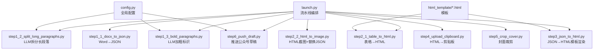
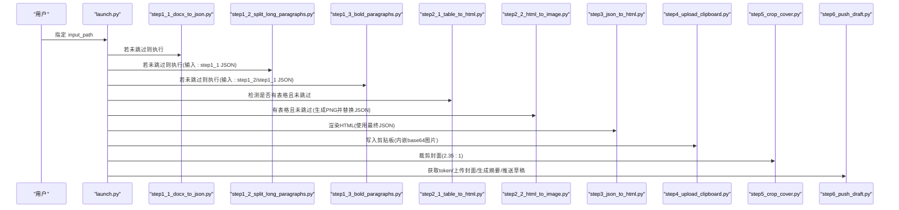
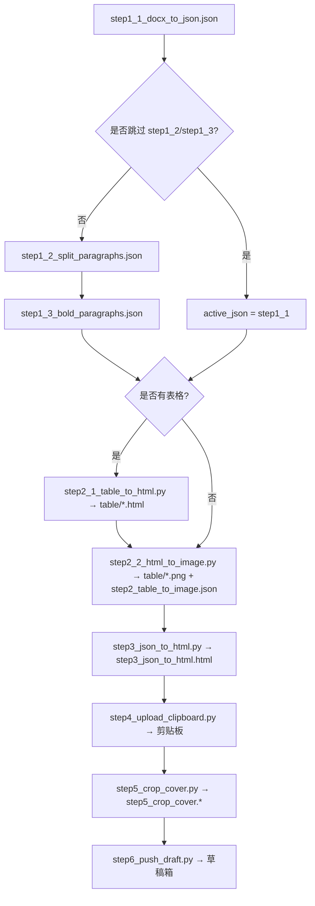
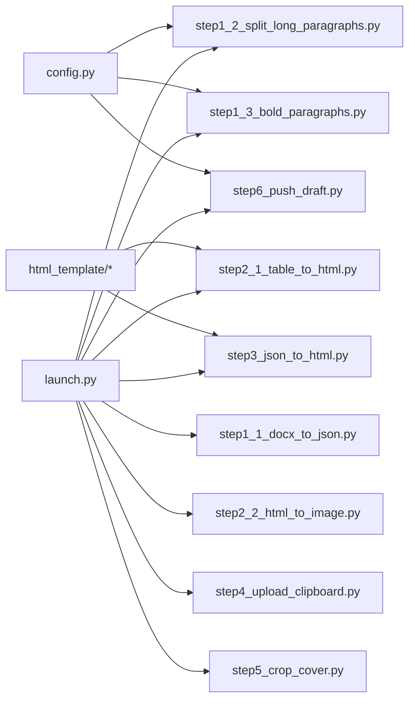

# 代码结构说明

<cite>
**本文引用的文件**   
- [launch.py](file://launch.py)
- [config.py](file://config.py)
- [step1_1_docx_to_json.py](file://step1_1_docx_to_json.py)
- [step1_2_split_long_paragraphs.py](file://step1_2_split_long_paragraphs.py)
- [step1_3_bold_paragraphs.py](file://step1_3_bold_paragraphs.py)
- [step2_1_table_to_html.py](file://step2_1_table_to_html.py)
- [step2_2_html_to_image.py](file://step2_2_html_to_image.py)
- [step3_json_to_html.py](file://step3_json_to_html.py)
- [step4_upload_clipboard.py](file://step4_upload_clipboard.py)
- [step5_crop_cover.py](file://step5_crop_cover.py)
- [step6_push_draft.py](file://step6_push_draft.py)
- [caicai_html_1_green_classical.html](file://html_template/caicai_html_1_green_classical.html)
- [caicai_html_1_green_table.html](file://html_template/caicai_html_1_green_table.html)
</cite>

## 目录
1. [简介](#简介)
2. [项目结构](#项目结构)
3. [核心组件](#核心组件)
4. [架构总览](#架构总览)
5. [详细组件分析](#详细组件分析)
6. [依赖关系分析](#依赖关系分析)
7. [性能与稳定性](#性能与稳定性)
8. [故障排查指南](#故障排查指南)
9. [结论](#结论)
10. [附录：中间数据格式与命名约定](#附录：中间数据格式与命名约定)

## 简介
本项目是一个“Word → 剪贴板/公众号草稿”的一键流水线工具。通过模块化步骤将 Word 文档解析为结构化 JSON，进行段落拆分、加粗标注、表格转图、HTML 渲染、剪贴板写入、封面裁剪与草稿推送等处理。每个步骤以独立模块实现，便于单独运行或串联执行。

## 项目结构
- 根目录包含主入口 launch.py、全局配置 config.py 以及 step*.py 各阶段处理脚本。
- html_template 存放 HTML 模板（正文模板与表格模板）。
- content_instance 下按文章实例组织，每个实例含 process 子目录用于保存中间产物（JSON、HTML、PNG 等）。
- board_history 与 tool 为辅助历史与工具脚本，不在本次重点范围内。

图表来源
- [launch.py:42-193](file://launch.py#L42-L193)
- [config.py:1-39](file://config.py#L1-L39)
- [step1_1_docx_to_json.py:190-226](file://step1_1_docx_to_json.py#L190-L226)
- [step1_2_split_long_paragraphs.py:198-301](file://step1_2_split_long_paragraphs.py#L198-L301)
- [step1_3_bold_paragraphs.py:207-330](file://step1_3_bold_paragraphs.py#L207-L330)
- [step2_1_table_to_html.py:74-118](file://step2_1_table_to_html.py#L74-L118)
- [step2_2_html_to_image.py:120-210](file://step2_2_html_to_image.py#L120-L210)
- [step3_json_to_html.py:121-142](file://step3_json_to_html.py#L121-L142)
- [step4_upload_clipboard.py:436-475](file://step4_upload_clipboard.py#L436-L475)
- [step5_crop_cover.py:174-196](file://step5_crop_cover.py#L174-L196)
- [step6_push_draft.py:276-397](file://step6_push_draft.py#L276-L397)

章节来源
- [launch.py:1-201](file://launch.py#L1-L201)
- [config.py:1-39](file://config.py#L1-L39)

## 核心组件
- 流水线编排器：负责路径派生、步骤调度、跳过控制、动态输入选择（根据是否跳过上游步骤自动回退到可用 JSON）。
- 配置中心：集中管理 API 地址、请求头、重试次数、令牌上限、段落拆分阈值、微信公众号相关参数。
- 步骤模块：每个 step*.py 模块职责单一，遵循“输入 JSON/HTML/图片 → 输出新文件”的契约，支持独立运行与串联调用。
- 模板系统：表格模板与正文模板分离，便于样式与渲染逻辑解耦。

章节来源
- [launch.py:28-193](file://launch.py#L28-L193)
- [config.py:1-39](file://config.py#L1-L39)

## 架构总览
整体采用“顺序流水线 + 可选步骤 + 中间文件契约”的架构。步骤之间通过文件系统传递数据，关键中间产物包括：
- step1_1_docx_to_json.json
- step1_2_split_paragraphs.json
- step1_3_bold_paragraphs.json
- table/*.html 与 table/*.png
- step2_table_to_image.json
- step3_json_to_html.html
- step4_upload_clipboard.html（内联样式快照）
- step5_crop_cover.*（封面裁剪结果）
- step6_thumb_media_id.txt（封面上传缓存）

图表来源
- [launch.py:70-188](file://launch.py#L70-L188)
- [step1_1_docx_to_json.py:190-226](file://step1_1_docx_to_json.py#L190-L226)
- [step1_2_split_long_paragraphs.py:198-301](file://step1_2_split_long_paragraphs.py#L198-L301)
- [step1_3_bold_paragraphs.py:207-330](file://step1_3_bold_paragraphs.py#L207-L330)
- [step2_1_table_to_html.py:74-118](file://step2_1_table_to_html.py#L74-L118)
- [step2_2_html_to_image.py:120-210](file://step2_2_html_to_image.py#L120-L210)
- [step3_json_to_html.py:121-142](file://step3_json_to_html.py#L121-L142)
- [step4_upload_clipboard.py:436-475](file://step4_upload_clipboard.py#L436-L475)
- [step5_crop_cover.py:174-196](file://step5_crop_cover.py#L174-L196)
- [step6_push_draft.py:276-397](file://step6_push_draft.py#L276-L397)

## 详细组件分析

### 流水线编排器（launch.py）
- 功能要点
  - 统一创建 process 与 table 目录，计算各步骤输入输出路径。
  - 提供 SKIP_STEP* 开关，支持选择性跳过步骤。
  - 自动检测 active_json（考虑上游跳过情况），并根据是否存在表格决定是否执行 step2_1/step2_2。
  - 维护 TOTAL_STEPS 与打印进度信息。
- 设计模式
  - 命令式编排 + 条件分支；通过 import 延迟加载减少启动开销。
  - 基于文件系统的“消息总线”，步骤间无直接函数耦合。
- 错误处理
  - 输入文件不存在时退出；对缺失中间文件采取回退策略。
- 扩展点
  - 新增步骤可在末尾追加，并在 active_json 选择逻辑中考虑兼容性。

章节来源
- [launch.py:28-193](file://launch.py#L28-L193)

### 配置管理（config.py）
- 内容
  - 大模型 API 地址与请求头、通用参数（最大重试次数、最大 token）。
  - 段落拆分阈值。
  - 微信公众号 AppID/Secret、API 基址、草稿默认作者与评论设置。
- 设计模式
  - 单例式全局配置模块，被多个步骤导入使用。
- 安全建议
  - 敏感凭据应外置至环境变量或配置文件，避免硬编码。

章节来源
- [config.py:1-39](file://config.py#L1-L39)

### 步骤模块职责与接口规范
- 通用接口约定
  - 每个模块暴露 main(...) 作为可执行入口。
  - 输入参数多为路径字符串，输出为同目录下的新文件。
  - 失败时打印错误并 sys.exit(1)。
- 步骤清单
  - step1_1_docx_to_json.py：解析 .docx，提取段落、表格、图片，输出 JSON。
  - step1_2_split_long_paragraphs.py：调用大模型拆分过长段落，输出新 JSON。
  - step1_3_bold_paragraphs.py：调用大模型识别总结性/判断性表达，标记加粗，输出新 JSON。
  - step2_1_table_to_html.py：读取 JSON 中的表格，按模板生成 table_*.html。
  - step2_2_html_to_image.py：用 Selenium + Chrome 截图生成 PNG，并将 JSON 中 table 元素替换为 image 引用，输出 step2_table_to_image.json。
  - step3_json_to_html.py：将 JSON 渲染为 HTML，替换模板占位符，输出 step3_json_to_html.html。
  - step4_upload_clipboard.py：从 HTML 提取片段，展开类名到内联样式，本地图片转 base64，构建多格式剪贴板数据并写入。
  - step5_crop_cover.py：在实例目录下查找首张图片，按 2.35:1 比例裁剪并保存到 process。
  - step6_push_draft.py：获取 access_token，上传封面，生成摘要金句，推送草稿。

章节来源
- [step1_1_docx_to_json.py:190-226](file://step1_1_docx_to_json.py#L190-L226)
- [step1_2_split_long_paragraphs.py:198-301](file://step1_2_split_long_paragraphs.py#L198-L301)
- [step1_3_bold_paragraphs.py:207-330](file://step1_3_bold_paragraphs.py#L207-L330)
- [step2_1_table_to_html.py:74-118](file://step2_1_table_to_html.py#L74-L118)
- [step2_2_html_to_image.py:120-210](file://step2_2_html_to_image.py#L120-L210)
- [step3_json_to_html.py:121-142](file://step3_json_to_html.py#L121-L142)
- [step4_upload_clipboard.py:436-475](file://step4_upload_clipboard.py#L436-L475)
- [step5_crop_cover.py:174-196](file://step5_crop_cover.py#L174-L196)
- [step6_push_draft.py:276-397](file://step6_push_draft.py#L276-L397)

#### 对象与流程可视化（示例）
- 步骤间数据流（部分）

图表来源
- [launch.py:104-155](file://launch.py#L104-L155)
- [step2_1_table_to_html.py:74-118](file://step2_1_table_to_html.py#L74-L118)
- [step2_2_html_to_image.py:120-210](file://step2_2_html_to_image.py#L120-L210)
- [step3_json_to_html.py:121-142](file://step3_json_to_html.py#L121-L142)
- [step4_upload_clipboard.py:436-475](file://step4_upload_clipboard.py#L436-L475)
- [step5_crop_cover.py:174-196](file://step5_crop_cover.py#L174-L196)
- [step6_push_draft.py:276-397](file://step6_push_draft.py#L276-L397)

### 模板系统
- 表格模板 caicai_html_1_green_table.html：定义绿色主题表格样式与行高同步脚本，由 step2_1 填充 <table> 内容。
- 正文模板 caicai_html_1_green_classical.html：定义页面布局、元信息栏、正文区与类样式（title/body/hl/empty-line），由 step3 注入 {{BODY_PLACEHOLDER}}。

章节来源
- [caicai_html_1_green_table.html:1-81](file://html_template/caicai_html_1_green_table.html#L1-L81)
- [caicai_html_1_green_classical.html:1-200](file://html_template/caicai_html_1_green_classical.html#L1-L200)

## 依赖关系分析
- 外部库
  - docx：解析 .docx 文档结构与样式。
  - requests：HTTP 客户端，用于大模型与微信 API 调用。
  - selenium + Chrome：无头浏览器截图。
  - numpy + opencv-python：图像处理（封面裁剪与压缩）。
  - ctypes：Windows 剪贴板底层写入。
- 内部依赖
  - 所有步骤均通过文件系统交换数据，仅 step1_2/step1_3/step6 显式导入 config。
  - launch.py 通过相对路径与 os.path 组合定位中间文件。

图表来源
- [config.py:1-39](file://config.py#L1-L39)
- [launch.py:70-188](file://launch.py#L70-L188)
- [step2_1_table_to_html.py:26-27](file://step2_1_table_to_html.py#L26-L27)
- [step3_json_to_html.py:28-29](file://step3_json_to_html.py#L28-L29)

章节来源
- [launch.py:70-188](file://launch.py#L70-L188)
- [config.py:1-39](file://config.py#L1-L39)

## 性能与稳定性
- 大模型调用
  - 带重试与指数等待，避免瞬时网络抖动导致失败。
  - 提示词长度与 token 上限受 MAX_TOKENS 限制，必要时截断输入。
- 截图稳定性
  - 超时保护线程强制终止卡住的 Chrome/chromedriver，避免进程泄漏。
  - 窗口移出屏幕、禁用 GPU/扩展等优化提升无头截图成功率。
- 图片处理
  - JPEG 质量二分搜索压缩，非 JPEG 通过缩放适配大小限制。
- 剪贴板写入
  - 多次尝试打开剪贴板，兼容其他程序占用场景。
  - 本地图片转 base64 确保粘贴后仍可显示。

[本节为通用指导，不直接分析具体文件]

## 故障排查指南
- 常见错误与定位
  - 文件不存在：检查 launch.py 传入的 input_path 是否正确，确认 process 目录已创建。
  - 大模型返回为空或 JSON 解析失败：查看对应步骤日志，确认提示词与响应格式；必要时降低并发或增大超时。
  - 截图失败或超时：确认已安装 Chrome 与 chromedriver，检查系统资源与权限。
  - 剪贴板写入失败：关闭可能占用剪贴板的程序，或以管理员权限运行。
  - 封面裁剪失败：确认实例目录存在图片文件，且 OpenCV 支持该格式。
  - 草稿推送失败：核对 WX_APP_ID/WX_APP_SECRET 与网络连通性，检查封面 media_id 缓存。
- 调试技巧
  - 逐步运行单个 step*.py，观察其输入/输出文件是否符合预期。
  - 临时关闭某些步骤（设置 SKIP_* = True）快速定位问题范围。
  - 关注步骤输出的统计信息与 WARN 日志，优先修复警告项。

章节来源
- [step1_2_split_long_paragraphs.py:247-285](file://step1_2_split_long_paragraphs.py#L247-L285)
- [step2_2_html_to_image.py:64-115](file://step2_2_html_to_image.py#L64-L115)
- [step4_upload_clipboard.py:371-431](file://step4_upload_clipboard.py#L371-L431)
- [step5_crop_cover.py:133-171](file://step5_crop_cover.py#L133-L171)
- [step6_push_draft.py:276-397](file://step6_push_draft.py#L276-L397)

## 结论
本项目通过清晰的模块化设计与严格的中间文件契约，实现了从 Word 到剪贴板/公众号草稿的端到端自动化。步骤间松耦合、可插拔，配合完善的错误处理与调试输出，具备良好的可维护性与可扩展性。建议在后续迭代中引入更健壮的配置管理与日志体系，进一步提升稳定性与可观测性。

[本节为总结性内容，不直接分析具体文件]

## 附录：中间数据格式与命名约定

### 命名约定与目录组织
- 步骤文件命名：stepN_xxx.py，数字顺序体现流水线次序，字母描述具体任务。
- 中间产物命名：stepN_xxx.json / stepN_xxx.html / table/table_N.html / table/table_N.png / step5_crop_cover.* / step6_thumb_media_id.txt。
- 目录组织：content_instance/<实例>/process 存放中间产物；html_template 存放模板。

章节来源
- [launch.py:48-66](file://launch.py#L48-L66)
- [step2_1_table_to_html.py:79-118](file://step2_1_table_to_html.py#L79-L118)
- [step2_2_html_to_image.py:120-173](file://step2_2_html_to_image.py#L120-L173)
- [step5_crop_cover.py:174-196](file://step5_crop_cover.py#L174-L196)
- [step6_push_draft.py:313-327](file://step6_push_draft.py#L313-L327)

### 中间 JSON 数据结构（概念说明）
- 顶层字段
  - file_name：源文件名
  - total_elements：元素总数
  - elements：元素数组
- 元素类型
  - paragraph：段落
    - type: "paragraph"
    - heading_level: null | 1 | 2（null 表示普通正文）
    - runs: 文本片段数组，每项含 text 与 bold
    - index: 序号（拆分后可能出现小数后缀）
  - table：表格
    - type: "table"
    - row_count, col_count
    - data: 二维数组，单元格含 text 与 bold
  - image：图片
    - type: "image"
    - file_name, image_path（相对路径，如 process/images/... 或 process/table/...）

注意：以上为基于源码行为归纳的结构说明，不包含具体代码片段。

章节来源
- [step1_1_docx_to_json.py:145-184](file://step1_1_docx_to_json.py#L145-L184)
- [step2_2_html_to_image.py:175-210](file://step2_2_html_to_image.py#L175-L210)

### 新模块添加最佳实践
- 命名与位置
  - 新增步骤命名为 stepN_xxx.py，放置在根目录，保持与现有步骤一致的 main 入口。
- 输入输出契约
  - 明确输入文件路径（优先从 launch.py 传入），输出到 process 目录下的固定文件名。
  - 若修改上游 JSON，请保证字段兼容（至少保留 file_name、total_elements、elements）。
- 配置与依赖
  - 需要外部配置时，从 config.py 导入；避免在各模块重复定义。
- 错误处理与日志
  - 对关键 IO 与网络操作增加异常捕获与友好提示；记录关键统计信息。
- 与编排器集成
  - 在 launch.py 中添加 SKIP_STEP* 标志与调用逻辑；如有必要，调整 active_json 选择策略。
- 模板与渲染
  - 如需新增模板，放入 html_template 目录，并在相应步骤中引用。

章节来源
- [launch.py:28-193](file://launch.py#L28-L193)
- [config.py:1-39](file://config.py#L1-L39)