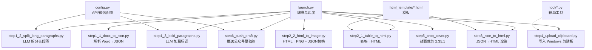
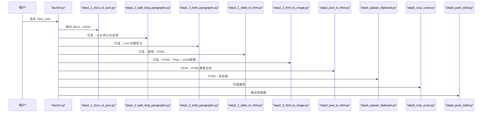
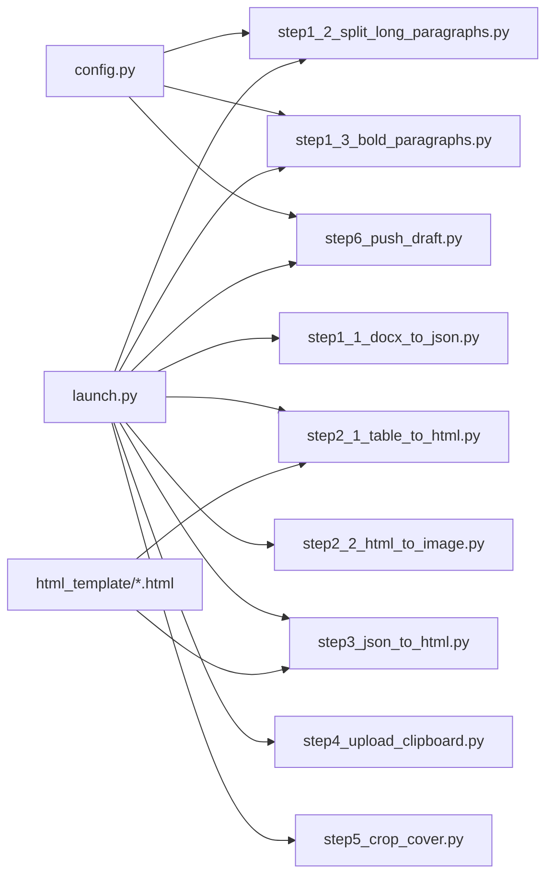

# 开发工作流程

<cite>
**本文引用的文件**   
- [launch.py](file://launch.py)
- [config.py](file://config.py)
- [step1_1_docx_to_json.py](file://step1_1_docx_to_json.py)
- [step1_2_split_long_paragraphs.py](file://step1_2_split_long_paragraphs.py)
- [step1_3_bold_paragraphs.py](file://step1_3_bold_paragraphs.py)
- [step2_1_table_to_html.py](file://step2_1_table_to_html.py)
- [step2_2_html_to_image.py](file://step2_2_html_to_image.py)
- [step3_json_to_html.py](file://step3_json_to_html.py)
- [step4_upload_clipboard.py](file://step4_upload_clipboard.py)
- [step5_crop_cover.py](file://step5_crop_cover.py)
- [step6_push_draft.py](file://step6_push_draft.py)
- [caicai_html_1_green_classical.html](file://html_template/caicai_html_1_green_classical.html)
- [tool_clipboard_maimai.py](file://tool/tool_clipboard_maimai.py)
</cite>

## 目录
1. [引言](#引言)
2. [项目结构](#项目结构)
3. [核心组件](#核心组件)
4. [架构总览](#架构总览)
5. [详细组件分析](#详细组件分析)
6. [依赖关系分析](#依赖关系分析)
7. [性能与内存优化](#性能与内存优化)
8. [调试与常用工具](#调试与常用工具)
9. [单元测试规范与测试数据策略](#单元测试规范与测试数据策略)
10. [版本控制与分支管理](#版本控制与分支管理)
11. [从概念到实现：完整示例](#从概念到实现完整示例)
12. [结论](#结论)

## 引言
本指南面向开发者，提供从需求分析、设计、实现到发布的全流程实践方法。围绕内容处理流水线（Word → JSON → HTML → 剪贴板/公众号草稿箱），说明如何扩展现有 step*.py 模块、如何进行调试与测试、如何进行性能优化与内存监控，并给出端到端的开发示例。

## 项目结构
仓库采用“按步骤拆分”的模块化组织方式：每个数据处理阶段对应一个 step*.py 脚本；模板集中在 html_template；工具脚本集中于 tool；全局配置在 config.py；统一入口为 launch.py。

图表来源
- [launch.py:42-193](file://launch.py#L42-L193)
- [config.py:1-39](file://config.py#L1-L39)
- [step1_1_docx_to_json.py:190-233](file://step1_1_docx_to_json.py#L190-L233)
- [step1_2_split_long_paragraphs.py:198-301](file://step1_2_split_long_paragraphs.py#L198-L301)
- [step1_3_bold_paragraphs.py:207-330](file://step1_3_bold_paragraphs.py#L207-L330)
- [step2_1_table_to_html.py:74-118](file://step2_1_table_to_html.py#L74-L118)
- [step2_2_html_to_image.py:120-211](file://step2_2_html_to_image.py#L120-L211)
- [step3_json_to_html.py:121-143](file://step3_json_to_html.py#L121-L143)
- [step4_upload_clipboard.py:436-476](file://step4_upload_clipboard.py#L436-L476)
- [step5_crop_cover.py:174-196](file://step5_crop_cover.py#L174-L196)
- [step6_push_draft.py:276-397](file://step6_push_draft.py#L276-L397)
- [caicai_html_1_green_classical.html:187-208](file://html_template/caicai_html_1_green_classical.html#L187-L208)

章节来源
- [launch.py:1-201](file://launch.py#L1-L201)
- [config.py:1-39](file://config.py#L1-L39)

## 核心组件
- 编排器：launch.py 负责路径派生、步骤顺序、跳过开关、中间产物选择与统计输出。
- 解析器：step1_1_docx_to_json.py 将 .docx 解析为结构化 JSON，提取段落、表格、图片。
- LLM 增强：step1_2_split_long_paragraphs.py 与 step1_3_bold_paragraphs.py 调用大模型进行文本拆分与加粗标注。
- 表格处理：step2_1_table_to_html.py 生成表格 HTML；step2_2_html_to_image.py 截图 PNG 并回写 JSON。
- 渲染器：step3_json_to_html.py 基于模板渲染最终 HTML。
- 剪贴板：step4_upload_clipboard.py 将 HTML 转为多格式写入 Windows 剪贴板。
- 封面：step5_crop_cover.py 自动裁剪首图为 2.35:1。
- 推送：step6_push_draft.py 获取 access_token、上传封面、生成摘要、推送草稿。
- 配置：config.py 集中管理 API 与微信公众号参数。
- 模板：html_template/*.html 提供页面结构与样式占位符。
- 工具：tool/*.py 提供剪贴板二次加工等辅助能力。

章节来源
- [launch.py:42-193](file://launch.py#L42-L193)
- [step1_1_docx_to_json.py:190-233](file://step1_1_docx_to_json.py#L190-L233)
- [step1_2_split_long_paragraphs.py:198-301](file://step1_2_split_long_paragraphs.py#L198-L301)
- [step1_3_bold_paragraphs.py:207-330](file://step1_3_bold_paragraphs.py#L207-L330)
- [step2_1_table_to_html.py:74-118](file://step2_1_table_to_html.py#L74-L118)
- [step2_2_html_to_image.py:120-211](file://step2_2_html_to_image.py#L120-L211)
- [step3_json_to_html.py:121-143](file://step3_json_to_html.py#L121-L143)
- [step4_upload_clipboard.py:436-476](file://step4_upload_clipboard.py#L436-L476)
- [step5_crop_cover.py:174-196](file://step5_crop_cover.py#L174-L196)
- [step6_push_draft.py:276-397](file://step6_push_draft.py#L276-L397)
- [config.py:1-39](file://config.py#L1-L39)
- [caicai_html_1_green_classical.html:187-208](file://html_template/caicai_html_1_green_classical.html#L187-L208)

## 架构总览
整体为“输入→多步处理→输出”的流水线架构，各 step 之间通过 process 目录下的 JSON/HTML/PNG 等中间产物传递数据。

图表来源
- [launch.py:70-188](file://launch.py#L70-L188)
- [step1_1_docx_to_json.py:190-233](file://step1_1_docx_to_json.py#L190-L233)
- [step1_2_split_long_paragraphs.py:198-301](file://step1_2_split_long_paragraphs.py#L198-L301)
- [step1_3_bold_paragraphs.py:207-330](file://step1_3_bold_paragraphs.py#L207-L330)
- [step2_1_table_to_html.py:74-118](file://step2_1_table_to_html.py#L74-L118)
- [step2_2_html_to_image.py:120-211](file://step2_2_html_to_image.py#L120-L211)
- [step3_json_to_html.py:121-143](file://step3_json_to_html.py#L121-L143)
- [step4_upload_clipboard.py:436-476](file://step4_upload_clipboard.py#L436-L476)
- [step5_crop_cover.py:174-196](file://step5_crop_cover.py#L174-L196)
- [step6_push_draft.py:276-397](file://step6_push_draft.py#L276-L397)

## 详细组件分析

### 编排器 launch.py
- 职责：校验输入、派生路径、创建目录、按顺序调用各 step、根据前序结果动态选择下游输入、打印进度与耗时。
- 关键行为：
  - 支持 SKIP_* 开关以跳过任意步骤。
  - 自动检测 JSON 中是否存在 table 元素，决定是否执行 step2_1/step2_2。
  - 维护 active_json 与 step3_input 的选择逻辑，确保下游始终拿到最新可用数据。

章节来源
- [launch.py:42-193](file://launch.py#L42-L193)

### 解析器 step1_1_docx_to_json.py
- 职责：遍历 docx 文档体，识别段落、表格、内联图片，输出结构化 JSON。
- 关键点：
  - 标题识别：以 # 或 ## 前缀判定 heading_level。
  - runs 合并：相邻且 bold 状态相同的 run 合并，减少冗余。
  - 图片提取：按 XML 关系抽取 blip，保存为 image_n.ext。
  - 空段落过滤，index 自增保证顺序稳定。

章节来源
- [step1_1_docx_to_json.py:75-184](file://step1_1_docx_to_json.py#L75-L184)
- [step1_1_docx_to_json.py:190-233](file://step1_1_docx_to_json.py#L190-L233)

### LLM 拆分 step1_2_split_long_paragraphs.py
- 职责：对过长 run 调用大模型按语义拆分，保持原文一字不改的一致性校验。
- 关键点：
  - 阈值来自 config.SPLIT_THRESHOLD。
  - 重试机制与超时保护。
  - 拼接一致性校验失败则保留原段落。
  - 输出新文件，不覆盖上游。

章节来源
- [step1_2_split_long_paragraphs.py:80-141](file://step1_2_split_long_paragraphs.py#L80-L141)
- [step1_2_split_long_paragraphs.py:198-301](file://step1_2_split_long_paragraphs.py#L198-L301)
- [config.py:23-24](file://config.py#L23-L24)

### LLM 加粗 step1_3_bold_paragraphs.py
- 职责：按标题分段，对正文组识别总结/判断/序列性表达，标记 bold。
- 关键点：
  - 分组策略：遇到 heading 或非 paragraph 即切分一组。
  - 已有加粗段落跳过，避免重复。
  - 精确匹配 bold_text 在 runs 中的位置，拆分 runs 并设置 bold。

章节来源
- [step1_3_bold_paragraphs.py:146-201](file://step1_3_bold_paragraphs.py#L146-L201)
- [step1_3_bold_paragraphs.py:207-330](file://step1_3_bold_paragraphs.py#L207-L330)

### 表格转 HTML step2_1_table_to_html.py
- 职责：读取 JSON 中的 table 元素，使用绿色主题模板生成独立 HTML。
- 关键点：
  - 第一行作为 thead，其余为 tbody。
  - 输出 table_{n}.html 到 process/table。

章节来源
- [step2_1_table_to_html.py:39-68](file://step2_1_table_to_html.py#L39-L68)
- [step2_1_table_to_html.py:74-118](file://step2_1_table_to_html.py#L74-L118)

### HTML 截图与 JSON 替换 step2_2_html_to_image.py
- 职责：用 Selenium+Chrome 无头模式截图 table HTML 为 PNG，并将 JSON 中 table 元素替换为 image 引用。
- 关键点：
  - 超时保护与进程清理。
  - 若无表格，直接复制输入 JSON 为 step2_table_to_image.json。
  - 替换后输出新 JSON，供 step3 使用。

章节来源
- [step2_2_html_to_image.py:40-101](file://step2_2_html_to_image.py#L40-L101)
- [step2_2_html_to_image.py:120-211](file://step2_2_html_to_image.py#L120-L211)

### 渲染器 step3_json_to_html.py
- 职责：读取 JSON，按规则生成正文 HTML，替换模板 {{BODY_PLACEHOLDER}}。
- 关键点：
  - heading_level=1 不渲染到正文；heading_level=2 渲染为标题。
  - 连续正文段落合入 <section>，每段 
。
  - bold run 渲染为 。

章节来源
- [step3_json_to_html.py:38-115](file://step3_json_to_html.py#L38-L115)
- [step3_json_to_html.py:121-143](file://step3_json_to_html.py#L121-L143)
- [caicai_html_1_green_classical.html:187-208](file://html_template/caicai_html_1_green_classical.html#L187-L208)

### 剪贴板写入 step4_upload_clipboard.py
- 职责：读取 HTML，展开类名到内联样式，本地图片转 base64，构建 Windows 剪贴板多格式并写入。
- 关键点：
  - 正则展开 title/body/empty-line/hl 等简化标签。
  - 规范化空白，嵌入本地图片为 data URI。
  - 构造 HTML Format、CF_UNICODETEXT、CF_TEXT/OEMTEXT、CF_LOCALE 等格式。

章节来源
- [step4_upload_clipboard.py:115-172](file://step4_upload_clipboard.py#L115-L172)
- [step4_upload_clipboard.py:194-222](file://step4_upload_clipboard.py#L194-L222)
- [step4_upload_clipboard.py:228-268](file://step4_upload_clipboard.py#L228-L268)
- [step4_upload_clipboard.py:288-365](file://step4_upload_clipboard.py#L288-L365)
- [step4_upload_clipboard.py:371-431](file://step4_upload_clipboard.py#L371-L431)
- [step4_upload_clipboard.py:436-476](file://step4_upload_clipboard.py#L436-L476)

### 封面裁剪 step5_crop_cover.py
- 职责：查找首个图片，中心裁剪为 2.35:1，保存到 process。
- 关键点：
  - 自适应质量压缩与分辨率缩放，确保不超过平台限制。
  - 安全打印兼容 GBK 终端。

章节来源
- [step5_crop_cover.py:133-171](file://step5_crop_cover.py#L133-L171)
- [step5_crop_cover.py:174-196](file://step5_crop_cover.py#L174-L196)

### 推送草稿 step6_push_draft.py
- 职责：获取 access_token、上传封面、生成摘要、推送草稿。
- 关键点：
  - 标题字节数截断保护。
  - 封面 media_id 缓存。
  - 从 step1_3 > step1_2 > step1_1 优先级取正文生成摘要。

章节来源
- [step6_push_draft.py:42-56](file://step6_push_draft.py#L42-L56)
- [step6_push_draft.py:62-79](file://step6_push_draft.py#L62-L79)
- [step6_push_draft.py:105-127](file://step6_push_draft.py#L105-L127)
- [step6_push_draft.py:146-182](file://step6_push_draft.py#L146-L182)
- [step6_push_draft.py:276-397](file://step6_push_draft.py#L276-L397)
- [config.py:29-39](file://config.py#L29-L39)

### 模板 caicai_html_1_green_classical.html
- 职责：提供页面骨架与样式，包含 {{BODY_PLACEHOLDER}} 占位符。
- 关键点：
  - 定义 title/body/empty-line/hl 等类样式。
  - 装饰区域保持不变，仅替换正文区。

章节来源
- [caicai_html_1_green_classical.html:97-137](file://html_template/caicai_html_1_green_classical.html#L97-L137)
- [caicai_html_1_green_classical.html:187-208](file://html_template/caicai_html_1_green_classical.html#L187-L208)

### 工具 tool_clipboard_maimai.py
- 职责：读取剪贴板文本，结合 wx_content_list.txt 拼装推荐内容，写回剪贴板。
- 关键点：
  - 纯文本读写、UTF-16LE 编码。
  - 段落规范化与条目拼接。

章节来源
- [tool_clipboard_maimai.py:57-103](file://tool/tool_clipboard_maimai.py#L57-L103)
- [tool_clipboard_maimai.py:105-176](file://tool/tool_clipboard_maimai.py#L105-L176)
- [tool_clipboard_maimai.py:179-219](file://tool/tool_clipboard_maimai.py#L179-L219)

## 依赖关系分析
- 外部依赖
  - requests：LLM 调用与微信 API 请求。
  - selenium + Chrome：表格 HTML 截图。
  - opencv-python/numpy：封面裁剪与压缩。
  - python-docx：解析 .docx。
  - ctypes：Windows 剪贴板原生写入。
- 内部耦合
  - launch.py 强耦合 step 间产物命名与路径约定。
  - step1_2/step1_3/step6 共享 config 中的 API_URL/HEADERS/MAX_RETRIES/MAX_TOKENS。
  - step2_1/step2_2 依赖 html_template 与 process/table 目录。
  - step3 依赖 html_template 的 {{BODY_PLACEHOLDER}}。
  - step4 依赖 step3 输出的 HTML 与图片相对路径。
  - step6 依赖 step5 生成的封面与 step1_x JSON 的标题/正文。

图表来源
- [config.py:1-39](file://config.py#L1-L39)
- [launch.py:70-188](file://launch.py#L70-L188)
- [step2_1_table_to_html.py:26-27](file://step2_1_table_to_html.py#L26-L27)
- [step3_json_to_html.py:28-29](file://step3_json_to_html.py#L28-L29)

章节来源
- [launch.py:70-188](file://launch.py#L70-L188)
- [config.py:1-39](file://config.py#L1-L39)

## 性能与内存优化
- 网络与 LLM
  - 合理设置 MAX_RETRIES 与超时，避免长时间阻塞。
  - 批量处理时复用会话（requests.Session）以减少握手开销。
  - 对超长正文进行截断（如 step6 的 digest 生成）。
- 截图与渲染
  - 使用 headless Chrome 与固定窗口尺寸，避免 GPU 相关开销。
  - 对大量表格截图可考虑串行化与失败重试。
- 图像处理
  - JPEG quality 二分搜索平衡体积与质量。
  - 非 JPEG 格式优先降分辨率而非强行压缩。
- 内存
  - 避免一次性加载超大 HTML 到内存，必要时流式处理。
  - 及时关闭浏览器驱动与释放句柄。
  - 剪贴板写入时注意内存分配与释放。

[本节为通用建议，无需特定文件引用]

## 调试与常用工具
- 单步运行
  - 直接运行某个 step*.py 的 __main__ 块，传入目标路径进行验证。
- 跳过控制
  - 修改 launch.py 中的 SKIP_* 标志，快速定位问题步骤。
- 日志与中间产物
  - 观察控制台输出与 process 目录下的 JSON/HTML/PNG 中间产物。
  - 使用 step4 生成的 inline HTML 进行样式调试。
- 工具辅助
  - tool_clipboard_maimai.py 用于剪贴板文本二次加工与排版检查。

章节来源
- [launch.py:28-37](file://launch.py#L28-L37)
- [step4_upload_clipboard.py:455-462](file://step4_upload_clipboard.py#L455-L462)
- [tool_clipboard_maimai.py:179-219](file://tool/tool_clipboard_maimai.py#L179-L219)

## 单元测试规范与测试数据策略
- 单元边界
  - 每个 step 应提供独立的 main 入口，便于单独测试。
  - 对纯函数（如 render_runs、generate_table_tag、expand_patterns）编写用例。
- 输入输出契约
  - 明确 JSON schema（elements 列表、type、runs、table 行列等）。
  - 明确 HTML 模板占位符与类名约定。
- 测试数据
  - 准备最小可复现的 .docx（含段落、表格、图片）。
  - 准备对应的期望 JSON/HTML/PNG 快照。
  - 针对异常路径（缺失文件、非法格式、网络错误）准备用例。
- 断言要点
  - 结构完整性（字段存在、类型正确）。
  - 内容一致性（拼接前后一致、图片路径正确）。
  - 边界条件（空段落、零表格、超长文本）。
- 自动化
  - 使用 pytest 组织用例，按 step 划分目录。
  - 对外部依赖（LLM、微信 API、Chrome）使用 mock 或隔离环境。

[本节为通用规范，无需特定文件引用]

## 版本控制与分支管理
- 分支策略
  - main：稳定可发布分支。
  - feature/*：新功能开发（如新增 stepN）。
  - fix/*：缺陷修复。
  - hotfix/*：紧急修复。
- 提交规范
  - 语义化提交信息（feat/fix/docs/chore 等）。
  - 变更影响范围清晰（新增 step、修改模板、调整配置）。
- 代码审查
  - 涉及 LLM 提示词、网络请求、系统 API 的改动需重点审查。
  - 模板与样式变更需回归验证剪贴板粘贴效果。
- 发布流程
  - 打 tag 记录版本。
  - 更新 README 与变更记录。

[本节为通用实践，无需特定文件引用]

## 从概念到实现：完整示例
以下示例展示如何新增一个“step7_1_summary_to_markdown.py”，将 step1_3 的 JSON 转换为 Markdown 摘要，并在 launch.py 中集成。

- 需求分析
  - 输入：process/step1_3_bold_paragraphs.json。
  - 输出：process/step7_1_summary.md。
  - 规则：heading_level=2 作为二级标题；普通段落保留；bold run 用 ** 包裹。
- 设计要点
  - 复用 step3 的渲染思路，但输出 Markdown。
  - 保持 index 与顺序不变，便于回溯。
- 实现步骤
  - 新建 step7_1_summary_to_markdown.py，实现 main(json_path, output_path)。
  - 在 launch.py 中添加 SKIP_STEP7_1 与调用逻辑，置于 step3 之后。
  - 若需要，可在 step6 之前插入该步骤，以便后续使用。
- 集成与验证
  - 设置 SKIP_STEP7_1=False，运行 launch.py。
  - 检查 process/step7_1_summary.md 内容与预期一致。
- 测试与回归
  - 为该 step 编写单元测试，覆盖空段落、无标题、全加粗等场景。
  - 回归验证现有步骤不受影响。

[本节为概念性示例，无需特定文件引用]

## 结论
本指南系统化梳理了内容处理流水线的架构与各 step 的职责，提供了扩展步骤的标准流程、调试与测试方法、性能优化建议以及版本控制最佳实践。遵循本文档的流程与规范，可高效、稳健地迭代功能并确保交付质量。