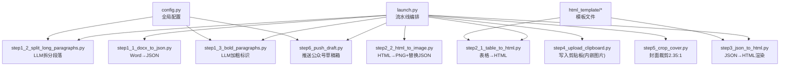
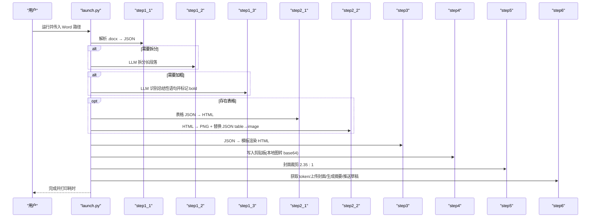
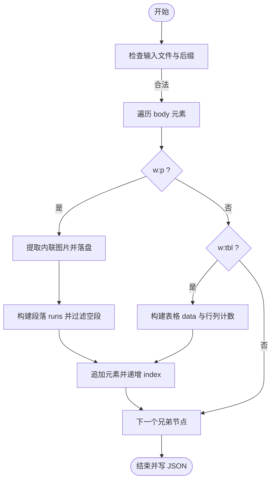
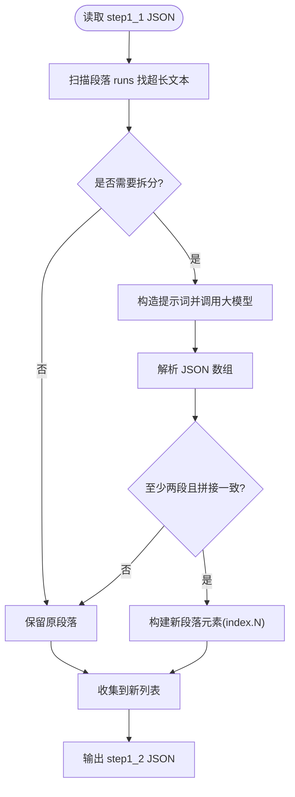
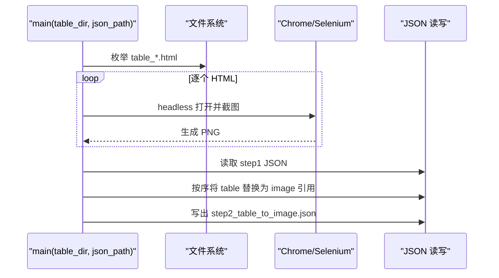
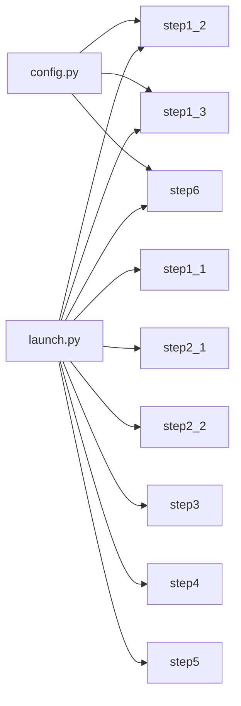

# 开发指南

<cite>
**本文引用的文件**   
- [config.py](file://config.py)
- [launch.py](file://launch.py)
- [step1_1_docx_to_json.py](file://step1_1_docx_to_json.py)
- [step1_2_split_long_paragraphs.py](file://step1_2_split_long_paragraphs.py)
- [step1_3_bold_paragraphs.py](file://step1_3_bold_paragraphs.py)
- [step2_1_table_to_html.py](file://step2_1_table_to_html.py)
- [step2_2_html_to_image.py](file://step2_2_html_to_image.py)
- [step3_json_to_html.py](file://step3_json_to_html.py)
- [step4_upload_clipboard.py](file://step4_upload_clipboard.py)
- [step5_crop_cover.py](file://step5_crop_cover.py)
- [step6_push_draft.py](file://step6_push_draft.py)
- [export_html.py](file://board_history/export_html.py)
- [import_html.py](file://board_history/import_html.py)
- [_verify_roundtrip.py](file://board_history/_verify_roundtrip.py)
</cite>

## 目录
1. [简介](#简介)
2. [项目结构](#项目结构)
3. [核心组件](#核心组件)
4. [架构总览](#架构总览)
5. [详细组件分析](#详细组件分析)
6. [依赖关系分析](#依赖关系分析)
7. [性能与内存优化](#性能与内存优化)
8. [测试策略与单元测试](#测试策略与单元测试)
9. [调试技巧与常用工具](#调试技巧与常用工具)
10. [代码审查清单与质量标准](#代码审查清单与质量标准)
11. [版本控制与协作规范](#版本控制与协作规范)
12. [新增模块开发规范](#新增模块开发规范)
13. [端到端示例：从零到一添加新功能](#端到端示例从零到一添加新功能)
14. [故障排查指南](#故障排查指南)
15. [结论](#结论)

## 简介
本指南面向开发者，系统化说明内容板项目的代码组织原则、流水线设计、接口约定、错误处理、文档规范、测试策略、调试方法、质量与评审标准、版本控制与协作流程，并给出性能分析与内存泄漏检测建议。同时提供“新增功能”的完整实操示例，帮助快速上手与高质量交付。

## 项目结构
项目采用“按步骤/功能模块化”的组织方式，根目录为可执行脚本与配置，子目录用于模板与历史工具。核心流水线由 launch.py 编排，各 stepX 脚本负责单一职责的数据转换或外部交互。

图表来源
- [launch.py:42-193](file://launch.py#L42-L193)
- [config.py:1-39](file://config.py#L1-L39)
- [step1_1_docx_to_json.py:190-226](file://step1_1_docx_to_json.py#L190-L226)
- [step1_2_split_long_paragraphs.py:198-301](file://step1_2_split_long_paragraphs.py#L198-L301)
- [step1_3_bold_paragraphs.py:207-330](file://step1_3_bold_paragraphs.py#L207-L330)
- [step2_1_table_to_html.py:74-118](file://step2_1_table_to_html.py#L74-L118)
- [step2_2_html_to_image.py:120-210](file://step2_2_html_to_image.py#L120-L210)
- [step3_json_to_html.py:121-143](file://step3_json_to_html.py#L121-L143)
- [step4_upload_clipboard.py:436-476](file://step4_upload_clipboard.py#L436-L476)
- [step5_crop_cover.py:174-196](file://step5_crop_cover.py#L174-L196)
- [step6_push_draft.py:276-397](file://step6_push_draft.py#L276-L397)

章节来源
- [launch.py:1-201](file://launch.py#L1-L201)
- [config.py:1-39](file://config.py#L1-L39)

## 核心组件
- 配置中心：集中管理 API 地址、请求头、重试次数、令牌上限、微信公众号参数等。
- 流水线编排器：统一入口，支持跳过任意步骤，自动推导输入输出路径，统计耗时。
- 数据模型（JSON）：以 elements 数组为核心，元素类型包括 paragraph/table/image，字段包含 type、heading_level、runs、row_count/col_count/data、image_path 等。
- 模板系统：HTML 模板通过占位符注入正文片段；表格模板生成独立 HTML 供截图。
- 外部集成：大模型调用封装（含重试）、Selenium+Chrome 截图、Windows 剪贴板写入、微信公众号 API。

章节来源
- [config.py:1-39](file://config.py#L1-L39)
- [launch.py:42-193](file://launch.py#L42-L193)
- [step1_1_docx_to_json.py:145-184](file://step1_1_docx_to_json.py#L145-L184)
- [step3_json_to_html.py:84-115](file://step3_json_to_html.py#L84-L115)
- [step2_1_table_to_html.py:39-68](file://step2_1_table_to_html.py#L39-L68)
- [step2_2_html_to_image.py:175-210](file://step2_2_html_to_image.py#L175-L210)
- [step4_upload_clipboard.py:228-268](file://step4_upload_clipboard.py#L228-L268)
- [step6_push_draft.py:42-79](file://step6_push_draft.py#L42-L79)

## 架构总览
整体为“顺序流水线 + 条件分支”的批处理架构。每个 step 只关注单一职责，通过 JSON 中间产物衔接。对外部服务（LLM、微信、浏览器）进行封装并提供失败回退与日志。

图表来源
- [launch.py:42-193](file://launch.py#L42-L193)
- [step1_1_docx_to_json.py:190-226](file://step1_1_docx_to_json.py#L190-L226)
- [step1_2_split_long_paragraphs.py:198-301](file://step1_2_split_long_paragraphs.py#L198-L301)
- [step1_3_bold_paragraphs.py:207-330](file://step1_3_bold_paragraphs.py#L207-L330)
- [step2_1_table_to_html.py:74-118](file://step2_1_table_to_html.py#L74-L118)
- [step2_2_html_to_image.py:120-210](file://step2_2_html_to_image.py#L120-L210)
- [step3_json_to_html.py:121-143](file://step3_json_to_html.py#L121-L143)
- [step4_upload_clipboard.py:436-476](file://step4_upload_clipboard.py#L436-L476)
- [step5_crop_cover.py:174-196](file://step5_crop_cover.py#L174-L196)
- [step6_push_draft.py:276-397](file://step6_push_draft.py#L276-L397)

## 详细组件分析

### 配置模块（config.py）
- 职责：集中管理 API 地址、请求头、重试次数、令牌上限、段落拆分阈值、微信公众号 AppID/Secret、草稿默认值等。
- 使用点：step1_2、step1_3、step6 均从该模块导入配置。
- 建议：敏感信息应迁移至环境变量或密钥管理服务；增加配置校验与默认值保护。

章节来源
- [config.py:1-39](file://config.py#L1-L39)
- [step1_2_split_long_paragraphs.py:27](file://step1_2_split_long_paragraphs.py#L27)
- [step1_3_bold_paragraphs.py:26](file://step1_3_bold_paragraphs.py#L26)
- [step6_push_draft.py:31-36](file://step6_push_draft.py#L31-L36)

### 流水线编排（launch.py）
- 职责：串联所有步骤，支持 SKIP_* 开关，自动推导 process 目录与中间产物路径，统计总耗时。
- 关键逻辑：根据是否跳过上游步骤选择 active_json；自动检测是否存在表格决定是否执行 step2_1/step2_2。
- 扩展点：新增步骤时在此注册，保持幂等与可跳过的特性。

章节来源
- [launch.py:28-39](file://launch.py#L28-L39)
- [launch.py:42-111](file://launch.py#L42-L111)
- [launch.py:112-144](file://launch.py#L112-L144)
- [launch.py:145-193](file://launch.py#L145-L193)

### 第一步：Word → JSON（step1_1_docx_to_json.py）
- 输入/输出：.docx → process/step1_1_docx_to_json.json；images 目录保存内联图片。
- 数据结构：elements 列表，包含 paragraph/table/image 三类；paragraph 含 heading_level 与 runs；table 含行列数与 data。
- 关键点：标题识别基于前缀 #/##；合并相邻同 bold 状态的 run；空段落过滤。

图表来源
- [step1_1_docx_to_json.py:145-184](file://step1_1_docx_to_json.py#L145-L184)
- [step1_1_docx_to_json.py:190-226](file://step1_1_docx_to_json.py#L190-L226)

章节来源
- [step1_1_docx_to_json.py:1-233](file://step1_1_docx_to_json.py#L1-L233)

### 第二步：LLM 拆分长段落（step1_2_split_long_paragraphs.py）
- 职责：对超长 run 调用大模型按语义拆分，保证拼接一致性。
- 提示词与约束：严格限定只能在句末标点处切分，最小长度限制，禁止增删改原文。
- 健壮性：多次重试、响应解析容错（直接 JSON/去除代码块/正则提取）、拼接一致性校验。

图表来源
- [step1_2_split_long_paragraphs.py:198-301](file://step1_2_split_long_paragraphs.py#L198-L301)

章节来源
- [step1_2_split_long_paragraphs.py:1-311](file://step1_2_split_long_paragraphs.py#L1-L311)

### 第三步：LLM 加粗标识（step1_3_bold_paragraphs.py）
- 职责：按标题分段，分组提交给大模型识别总结/判断/序列表达，返回需加粗的原文句子。
- 应用策略：仅修改 bold 字段，不改动文字；已有加粗的段落跳过；找不到匹配则跳过。
- 健壮性：重试、响应解析、组大小过滤、重复加粗保护。

章节来源
- [step1_3_bold_paragraphs.py:1-340](file://step1_3_bold_paragraphs.py#L1-L340)

### 第四步：表格 → HTML（step2_1_table_to_html.py）
- 职责：筛选 table 元素，按绿色主题模板生成独立 HTML，第一行作为 thead。
- 输出：process/table/table_{n}.html。

章节来源
- [step2_1_table_to_html.py:1-125](file://step2_1_table_to_html.py#L1-L125)

### 第五步：HTML → PNG + JSON 替换（step2_2_html_to_image.py）
- 职责：Selenium+Chrome 无头截图，带超时保护与进程清理；将 JSON 中 table 元素替换为 image 引用。
- 健壮性：超时强制终止 Chrome/chromedriver；失败统计与恢复；无表格时原样复制 JSON。

图表来源
- [step2_2_html_to_image.py:120-210](file://step2_2_html_to_image.py#L120-L210)

章节来源
- [step2_2_html_to_image.py:1-218](file://step2_2_html_to_image.py#L1-L218)

### 第六步：JSON → HTML 渲染（step3_json_to_html.py）
- 职责：读取最终 JSON，按规则渲染标题、正文、图片，替换模板中的占位符。
- 规则：heading_level=1 跳过；heading_level=2 渲染为小标题；连续正文合并入 section；bold run 渲染为高亮 span。

章节来源
- [step3_json_to_html.py:1-149](file://step3_json_to_html.py#L1-L149)

### 第七步：写入剪贴板（step4_upload_clipboard.py）
- 职责：解析 HTML，展开类名到内联样式，去除格式化空白，本地图片转 base64，构建多格式写入 Windows 剪贴板。
- 兼容：保留原始 CF_LOCALE 等格式；支持 Chromium 内部格式透传。

章节来源
- [step4_upload_clipboard.py:1-480](file://step4_upload_clipboard.py#L1-L480)

### 第八步：封面裁剪（step5_crop_cover.py）
- 职责：在文章实例目录查找首张图片，按 2.35:1 比例中心裁剪，自动压缩或缩放以满足 10MB 限制。
- 算法：先尝试 JPEG quality 二分搜索，非 JPEG 则逐步缩小分辨率。

章节来源
- [step5_crop_cover.py:1-203](file://step5_crop_cover.py#L1-L203)

### 第九步：推送公众号草稿（step6_push_draft.py）
- 职责：获取 access_token，上传永久素材（封面），从 JSON 提取标题与正文，调用大模型生成摘要金句，推送草稿。
- 健壮性：标题 UTF-8 字节截断；摘要长度限制；缓存 media_id 避免重复上传。

章节来源
- [step6_push_draft.py:1-404](file://step6_push_draft.py#L1-L404)

### 剪贴板导出/导入与往返校验（board_history）
- export_html.py：加载 clipboard_data，解析 HTML Format，格式化与模式折叠，生成可编辑 HTML 与隐藏原始数据。
- import_html.py：解析导出 HTML，展开模式、归一化空白，重建剪贴板多格式并写入。
- _verify_roundtrip.py：对比原始与重建后的二进制与纯文本，确保无损往返。

章节来源
- [export_html.py:1-516](file://board_history/export_html.py#L1-L516)
- [import_html.py:1-483](file://board_history/import_html.py#L1-L483)
- [_verify_roundtrip.py:1-106](file://board_history/_verify_roundtrip.py#L1-L106)

## 依赖关系分析
- 模块耦合：
  - launch.py 强耦合于各 step 的 main 函数签名与产物命名约定。
  - step1_2/step1_3/step6 共享 config 与 LLM 调用封装。
  - step2_2 依赖 Selenium/Chrome 环境。
  - step4 依赖 Windows API（ctypes）。
- 外部依赖：requests、python-docx、selenium、opencv-python、numpy。
- 潜在循环：当前未见循环依赖；但建议在新增模块时避免反向引用 launch。

图表来源
- [config.py:1-39](file://config.py#L1-L39)
- [launch.py:42-193](file://launch.py#L42-L193)

章节来源
- [launch.py:1-201](file://launch.py#L1-L201)
- [config.py:1-39](file://config.py#L1-L39)

## 性能与内存优化
- 大模型调用：
  - 已实现指数退避重试；建议增加并发限流与结果缓存（相同 prompt 去重）。
  - 对超长正文做截断（step6 已实现），可在 step1_2/step1_3 也加入长度门控。
- 截图性能：
  - 无头 Chrome 启动开销较大，建议复用驱动实例或池化；当前每次截图新建 driver，可考虑进程级复用。
  - 超时保护已实现，建议增加队列串行化以避免资源竞争。
- 图片处理：
  - OpenCV 编码质量二分搜索合理；对于大量图片可考虑并行（注意线程安全与磁盘 IO）。
- 剪贴板写入：
  - 本地图片转 base64 会显著增大体积，仅在粘贴场景需要；若仅需预览，可跳过嵌入。

[本节为通用指导，无需源码引用]

## 测试策略与单元测试
- 目标：覆盖数据模型契约、边界条件、异常路径与外部依赖隔离。
- 分层：
  - 单元测试：针对纯函数（如 is_run_bold、generate_table_tag、build_html_format_binary、extract_plain_text 等）。
  - 集成测试：端到端流水线（可跳过外部依赖，使用 mock）。
  - 往返校验：参考 _verify_roundtrip.py 的思路，对导出/导入进行二进制比对。
- 模拟对象：
  - requests：mock 大模型与微信 API 响应。
  - selenium：mock 截图行为或直接使用预置 HTML/PNG。
  - Windows API：在 CI 上跳过剪贴板写入，改用临时文件验证。
- 测试数据准备：
  - 使用 content_instance 下的真实样本；构造极端用例（超长段落、空表格、缺失图片等）。
- 推荐工具：pytest、unittest.mock、responses、selenium-wire（可选）。

[本节为通用指导，无需源码引用]

## 调试技巧与常用工具
- 单步调试：
  - 在 launch.py 设置对应 SKIP_* = True，仅运行目标步骤。
  - 在各 step 的 __main__ 块直接指定输入路径快速复现。
- 日志与诊断：
  - 关注 [INFO]/[WARN]/[ERROR] 输出；必要时增加结构化日志（JSON 格式）。
  - 对 LLM 调用记录 prompt/response 摘要（脱敏）。
- 可视化：
  - 查看 process 下中间产物（JSON/HTML/PNG）定位问题。
  - 使用浏览器打开 HTML 模板渲染结果核对样式。
- 外部依赖：
  - Chrome 截图失败时检查 chromedriver 版本与 PATH；必要时显式指定 Service 路径。
  - 剪贴板写入失败时确认权限与是否被其他程序占用。

[本节为通用指导，无需源码引用]

## 代码审查清单与质量标准
- 结构与可读性
  - 单一职责：每个脚本只做一件事，函数粒度清晰。
  - 命名：snake_case 函数/变量，常量全大写；模块 docstring 描述输入/输出/副作用。
- 健壮性
  - 输入校验：文件存在性、类型、编码；外部 API 状态码与异常处理。
  - 幂等：重复运行不破坏既有产物；输出文件名稳定。
- 安全性
  - 敏感配置不进仓库；使用环境变量或密钥管理。
  - 对用户输入路径做白名单/安全检查。
- 可维护性
  - 避免硬编码路径，优先相对路径与配置项。
  - 对外部依赖提供降级或跳过能力。
- 性能
  - 避免不必要的 I/O 与重复计算；对大对象使用迭代器/生成器。
- 测试
  - 新增/修改逻辑必须补充相应测试用例。
- 文档
  - 更新 README/注释，说明变更影响面与升级步骤。

[本节为通用指导，无需源码引用]

## 版本控制与协作规范
- 分支策略
  - main：稳定发布；feature/* 开发分支；hotfix/* 紧急修复。
- 提交规范
  - 类型：feat/fix/docs/style/refactor/test/chore
  - 范围：模块名或步骤编号（如 step1_2）
  - 描述：动词开头，简述动机与影响
- 代码评审
  - 至少 1 人审核；关注风险点与回归影响。
- 标签与发布
  - 语义化版本；变更记录在 CHANGELOG。

[本节为通用指导，无需源码引用]

## 新增模块开发规范
- 命名与位置
  - 新增脚本置于根目录，命名为 stepN_xxx.py；在 launch.py 注册。
- 接口约定
  - 暴露 main(input_or_config) 函数；遵循现有输入/输出路径约定。
  - 中间产物命名：stepN_xxx.json/html/png 等，避免覆盖上游产物。
- 错误处理
  - 明确错误码/消息；对不可恢复错误 sys.exit(1)，可恢复错误记录 WARN 并跳过。
- 配置与常量
  - 新增配置放入 config.py，提供默认值与环境覆盖。
- 文档
  - 模块头部 docstring 说明目的、输入、输出、依赖与注意事项。
- 测试
  - 提供最小可运行样例与断言；对外部依赖使用 mock。

[本节为通用指导，无需源码引用]

## 端到端示例：从零到一添加新功能
假设新增“step7_extract_keywords.py”，从 JSON 中提取关键词并写入 JSON 元数据。

- 步骤
  1) 创建 step7_extract_keywords.py，定义 main(json_path)：
     - 读取 JSON，遍历 elements，聚合 runs 文本。
     - 调用大模型（复用 call_model）提取关键词。
     - 在 result 中添加 keywords 字段，写入新 JSON。
  2) 在 launch.py 中注册：
     - 新增 SKIP_STEP7 标志。
     - 在合适位置插入调用，使用 active_json 或 step2 输出作为输入。
  3) 配置项：
     - 在 config.py 新增相关阈值或提示词开关。
  4) 测试：
     - 编写 pytest 用例，mock 大模型返回固定关键词。
     - 断言输出 JSON 包含 keywords 且长度符合预期。
  5) 文档：
     - 更新模块 docstring 与 README。

[本节为概念性示例，无需源码引用]

## 故障排查指南
- 大模型调用失败
  - 现象：重试后仍失败。
  - 排查：检查网络、API_URL/HEADERS、token 有效期；降低 MAX_TOKENS；记录 prompt 摘要。
  - 参考：call_model 重试逻辑。
- 截图失败或超时
  - 现象：Chrome 未响应或进程残留。
  - 排查：确认 Chrome/chromedriver 安装；减少并发；检查超时阈值；查看 _kill_chrome_processes 是否生效。
- 剪贴板写入失败
  - 现象：SetClipboardData 失败。
  - 排查：权限问题；其他程序占用；HTML 片段过大导致内存不足；检查 embed_local_images 是否成功。
- 封面裁剪失败
  - 现象：无法读取图片或超出大小限制。
  - 排查：路径编码问题；图片格式不支持；调整 quality 或缩放策略。
- 公众号推送失败
  - 现象：access_token 获取失败或草稿推送失败。
  - 排查：AppID/Secret 是否正确；网络连通；media_id 缓存是否有效；标题/摘要长度限制。

章节来源
- [step1_2_split_long_paragraphs.py:80-103](file://step1_2_split_long_paragraphs.py#L80-L103)
- [step2_2_html_to_image.py:64-115](file://step2_2_html_to_image.py#L64-L115)
- [step4_upload_clipboard.py:371-430](file://step4_upload_clipboard.py#L371-L430)
- [step5_crop_cover.py:133-171](file://step5_crop_cover.py#L133-L171)
- [step6_push_draft.py:42-79](file://step6_push_draft.py#L42-L79)

## 结论
本项目以清晰的模块化与流水线编排实现了从 Word 到微信公众号草稿的全链路自动化。通过严格的中间产物约定、健壮的错误处理与完善的调试手段，具备良好的可维护性与可扩展性。建议后续引入更完善的配置管理、测试覆盖率与性能监控，进一步提升稳定性与效率。