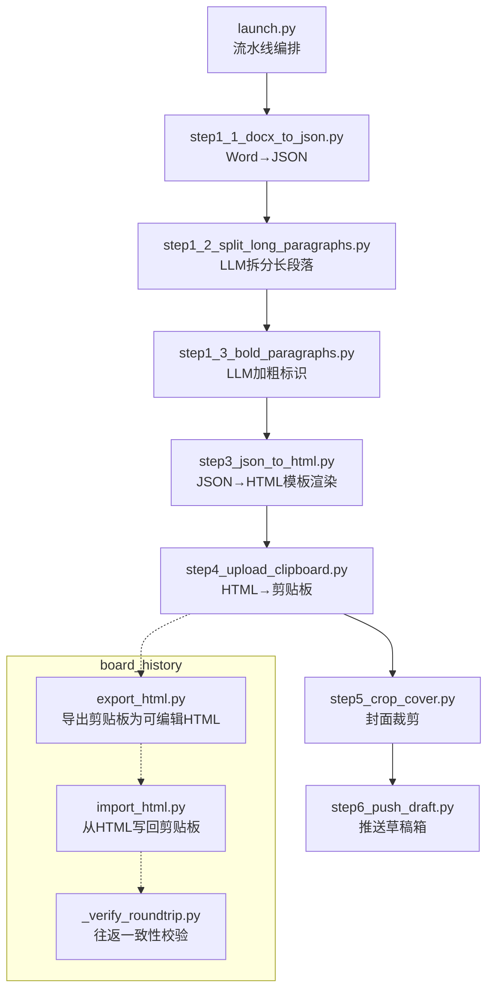
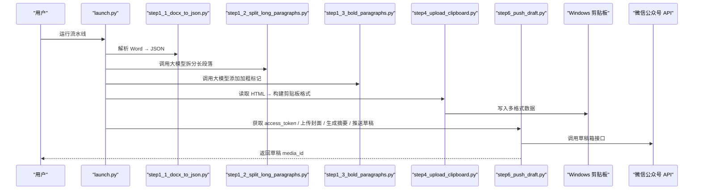
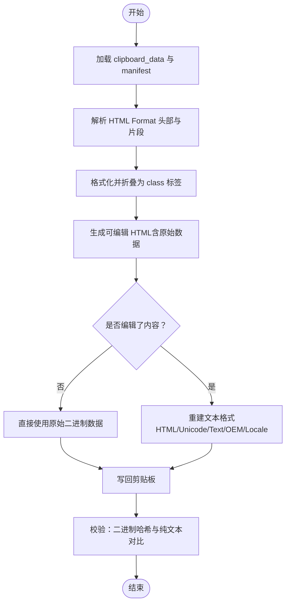
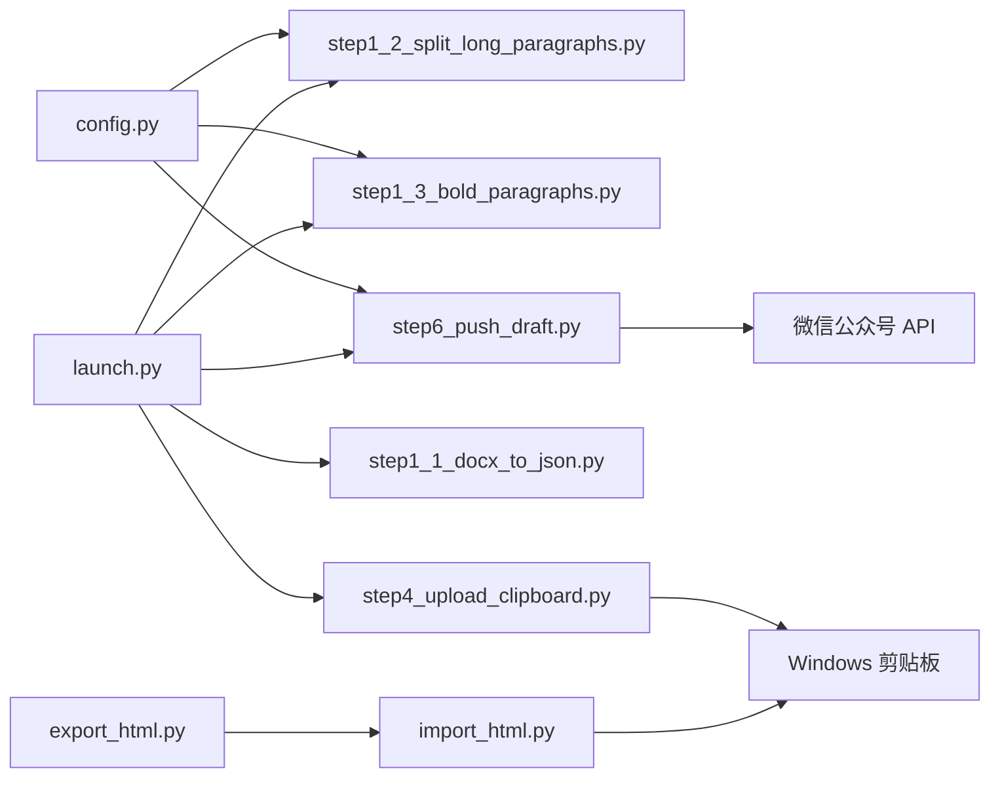

# 调试与故障排查

<cite>
**本文引用的文件列表**
- [config.py](file://config.py)
- [launch.py](file://launch.py)
- [step1_1_docx_to_json.py](file://step1_1_docx_to_json.py)
- [step1_2_split_long_paragraphs.py](file://step1_2_split_long_paragraphs.py)
- [step1_3_bold_paragraphs.py](file://step1_3_bold_paragraphs.py)
- [step4_upload_clipboard.py](file://step4_upload_clipboard.py)
- [step6_push_draft.py](file://step6_push_draft.py)
- [export_html.py](file://board_history/export_html.py)
- [import_html.py](file://board_history/import_html.py)
- [_verify_roundtrip.py](file://board_history/_verify_roundtrip.py)
- [tool_clipboard_maimai.py](file://tool/tool_clipboard_maimai.py)
</cite>

## 目录
1. [简介](#简介)
2. [项目结构](#项目结构)
3. [核心组件](#核心组件)
4. [架构总览](#架构总览)
5. [详细组件分析](#详细组件分析)
6. [依赖关系分析](#依赖关系分析)
7. [性能考虑](#性能考虑)
8. [故障排查指南](#故障排查指南)
9. [结论](#结论)
10. [附录](#附录)

## 简介
本指南面向开发者，聚焦于内容流水线（Word → JSON → HTML → 剪贴板 → 公众号草稿箱）的调试与故障排查。覆盖常见问题诊断、日志与调试信息解读、断点与关键变量检查方法、使用 board_history 工具进行数据往返验证、性能瓶颈识别与优化建议、错误码对照表与 FAQ，以及远程调试与日志收集最佳实践。

## 项目结构
本项目采用“按步骤拆分”的流水线式组织方式：
- 入口编排：launch.py 串联各 step
- 解析与处理：step1_1/step1_2/step1_3/step2_x/step3/step4/step5/step6
- 配置：config.py 集中管理 API 与微信参数
- 剪贴板与导出导入：board_history 提供 export/import/roundtrip 校验工具
- 辅助工具：tool 下提供剪贴板文本加工等脚本

图表来源
- [launch.py:42-193](file://launch.py#L42-L193)
- [step1_1_docx_to_json.py:190-226](file://step1_1_docx_to_json.py#L190-L226)
- [step1_2_split_long_paragraphs.py:198-301](file://step1_2_split_long_paragraphs.py#L198-L301)
- [step1_3_bold_paragraphs.py:207-330](file://step1_3_bold_paragraphs.py#L207-L330)
- [step4_upload_clipboard.py:436-475](file://step4_upload_clipboard.py#L436-L475)
- [step6_push_draft.py:276-397](file://step6_push_draft.py#L276-L397)
- [export_html.py:466-511](file://board_history/export_html.py#L466-L511)
- [import_html.py:427-478](file://board_history/import_html.py#L427-L478)
- [_verify_roundtrip.py:1-106](file://board_history/_verify_roundtrip.py#L1-L106)

章节来源
- [launch.py:1-201](file://launch.py#L1-L201)

## 核心组件
- 全局配置：API URL、请求头、重试次数、最大 token、段落拆分阈值、微信公众号 AppID/Secret 及默认值
- Word 解析：提取段落、表格、图片，输出结构化 JSON
- LLM 调用：拆分过长段落、自动加粗总结句，带重试与健壮解析
- 剪贴板写入：构建 Windows 多格式数据（HTML Format、CF_UNICODETEXT、CF_TEXT/OEMTEXT、CF_LOCALE 等），并内嵌本地图片为 base64
- 公众号草稿推送：获取 access_token、上传封面图、生成摘要金句、推送草稿
- 剪贴板导出/导入与往返校验：将剪贴板二进制导出为可读 HTML，支持人工编辑后写回，并提供一致性比对

章节来源
- [config.py:1-39](file://config.py#L1-L39)
- [step1_1_docx_to_json.py:190-226](file://step1_1_docx_to_json.py#L190-L226)
- [step1_2_split_long_paragraphs.py:198-301](file://step1_2_split_long_paragraphs.py#L198-L301)
- [step1_3_bold_paragraphs.py:207-330](file://step1_3_bold_paragraphs.py#L207-L330)
- [step4_upload_clipboard.py:436-475](file://step4_upload_clipboard.py#L436-L475)
- [step6_push_draft.py:276-397](file://step6_push_draft.py#L276-L397)
- [export_html.py:466-511](file://board_history/export_html.py#L466-L511)
- [import_html.py:427-478](file://board_history/import_html.py#L427-L478)
- [_verify_roundtrip.py:1-106](file://board_history/_verify_roundtrip.py#L1-L106)

## 架构总览
下图展示了从 Word 到剪贴板的端到端流程，以及 board_history 工具的参与位置。

图表来源
- [launch.py:42-193](file://launch.py#L42-L193)
- [step1_1_docx_to_json.py:190-226](file://step1_1_docx_to_json.py#L190-L226)
- [step1_2_split_long_paragraphs.py:198-301](file://step1_2_split_long_paragraphs.py#L198-L301)
- [step1_3_bold_paragraphs.py:207-330](file://step1_3_bold_paragraphs.py#L207-L330)
- [step4_upload_clipboard.py:436-475](file://step4_upload_clipboard.py#L436-L475)
- [step6_push_draft.py:276-397](file://step6_push_draft.py#L276-L397)

## 详细组件分析

### Word 解析（step1_1）
- 功能要点
  - 遍历文档元素，顺序提取段落、表格、图片
  - 标题识别：以 # 或 ## 前缀判定 heading_level
  - 合并相邻且 bold 状态相同的 run，减少冗余
  - 输出 elements 列表，包含 type/index/runs/data 等字段
- 常见错误与定位
  - 非 .docx 文件或路径不存在：直接报错退出
  - 图片嵌入失败：XML 节点缺失或关系引用异常，会跳过该图片
  - 空段落过滤：避免无意义元素进入后续流程
- 关键变量与断点
  - 在 parse_docx 函数中设置断点，观察 elements 列表长度与类型分布
  - 关注 image_counter 与 extract_images 返回值，确认图片是否成功提取
  - 检查 build_table 的 row_count/col_count 是否与预期一致
- 典型日志
  - 统计输出：共解析 N 个元素（paragraph/table/image 数量）
  - 输出文件路径提示，便于定位中间产物

章节来源
- [step1_1_docx_to_json.py:145-184](file://step1_1_docx_to_json.py#L145-L184)
- [step1_1_docx_to_json.py:190-226](file://step1_1_docx_to_json.py#L190-L226)

### 长段落拆分（step1_2）
- 功能要点
  - 扫描 runs，超过阈值的 run 触发 LLM 拆分
  - 严格语义拆分规则，要求拼接结果与原文完全一致
  - 失败或无效结果时保留原段落，保证鲁棒性
- 常见错误与定位
  - 网络超时/鉴权失败：call_model 内部重试，最终打印失败原因
  - 响应非 JSON 或数组长度不足：解析失败，保留原段落
  - 拼接不一致：diff 长度打印，便于快速对比
- 关键变量与断点
  - 在 call_model 处断点，查看 payload 与 response
  - 在 parse_json_array 处断点，观察清理后的字符串与解析结果
  - 在 find_long_runs/build_split_elements 处断点，核对拆分索引与 runs 分配
- 典型日志
  - 拆分前后完整段落内容打印（含长度与 index）
  - 模型调用次数与拆分段落数统计

章节来源
- [step1_2_split_long_paragraphs.py:80-103](file://step1_2_split_long_paragraphs.py#L80-L103)
- [step1_2_split_long_paragraphs.py:106-140](file://step1_2_split_long_paragraphs.py#L106-L140)
- [step1_2_split_long_paragraphs.py:198-301](file://step1_2_split_long_paragraphs.py#L198-L301)

### 自动加粗（step1_3）
- 功能要点
  - 按标题分段，每组正文交由 LLM 识别总结/判断/序列表达
  - 仅修改 bold 字段，不改动文字；已有加粗段落跳过
  - 应用加粗时精确匹配原文子串，必要时拆分 run
- 常见错误与定位
  - 模型调用失败：跳过整组，不影响其他组
  - 未找到匹配文本：跳过该条加粗建议
  - 重复加粗：已检测并跳过
- 关键变量与断点
  - 在 apply_bold_to_paragraph 处断点，观察 runs 拆分与 bold 区间
  - 在 parse_json_object 处断点，确认返回键值对与段落索引映射
- 典型日志
  - 每组段落输入预览、加粗结果明细、成功计数

章节来源
- [step1_3_bold_paragraphs.py:73-96](file://step1_3_bold_paragraphs.py#L73-L96)
- [step1_3_bold_paragraphs.py:99-133](file://step1_3_bold_paragraphs.py#L99-L133)
- [step1_3_bold_paragraphs.py:146-201](file://step1_3_bold_paragraphs.py#L146-L201)
- [step1_3_bold_paragraphs.py:207-330](file://step1_3_bold_paragraphs.py#L207-L330)

### 剪贴板写入（step4）
- 功能要点
  - 解析 HTML 片段，展开简化 class 标签为 Xiumi 内联样式
  - 去除格式化空白，确保紧凑结构
  - 本地图片转 base64 data URI，兼容粘贴场景
  - 构建 HTML Format、CF_UNICODETEXT、CF_TEXT/OEMTEXT、CF_LOCALE 等多格式
  - 通过 ctypes 调用 Windows API 写入剪贴板
- 常见错误与定位
  - 打开剪贴板失败：多次重试仍失败则退出
  - GlobalAlloc/GlobalLock/SetClipboardData 失败：逐格式记录错误并继续
  - 图片路径不存在：发出警告并跳过嵌入
- 关键变量与断点
  - 在 write_clipboard 循环中设置断点，检查 format_id/format_name/raw 大小
  - 在 embed_local_images 中检查 img_path 是否存在与扩展名转换逻辑
  - 在 expand_patterns/normalize_whitespace 前后比较字符长度变化
- 典型日志
  - 每个格式写入成功字节数统计
  - 内联样式 HTML 保存路径提示

章节来源
- [step4_upload_clipboard.py:72-109](file://step4_upload_clipboard.py#L72-L109)
- [step4_upload_clipboard.py:115-172](file://step4_upload_clipboard.py#L115-L172)
- [step4_upload_clipboard.py:175-188](file://step4_upload_clipboard.py#L175-L188)
- [step4_upload_clipboard.py:194-222](file://step4_upload_clipboard.py#L194-L222)
- [step4_upload_clipboard.py:228-268](file://step4_upload_clipboard.py#L228-L268)
- [step4_upload_clipboard.py:271-285](file://step4_upload_clipboard.py#L271-L285)
- [step4_upload_clipboard.py:288-365](file://step4_upload_clipboard.py#L288-L365)
- [step4_upload_clipboard.py:371-431](file://step4_upload_clipboard.py#L371-L431)
- [step4_upload_clipboard.py:436-475](file://step4_upload_clipboard.py#L436-L475)

### 公众号草稿推送（step6）
- 功能要点
  - 获取 access_token，上传永久素材（封面图）
  - 从 step1_1 JSON 提取一级标题（UTF-8 字节限制截断）
  - 从正文 JSON 提取纯文本，调用大模型生成摘要金句
  - 组装文章字段并推送草稿箱
- 常见错误与定位
  - access_token 获取失败：抛出运行时异常并终止
  - 封面图上传失败：抛出异常并终止
  - 未找到封面图：提示先运行 step5
  - 标题超长：自动截断并给出警告
- 关键变量与断点
  - 在 get_access_token/upload_permanent_image/push_draft 处断点，检查返回体
  - 在 extract_title 中观察 UTF-8 字节截断逻辑
  - 在 generate_digest 中检查 prompt 长度与截取策略
- 典型日志
  - 各字段长度调试输出（chars/bytes）
  - 封面 media_id 缓存写入提示

章节来源
- [step6_push_draft.py:42-56](file://step6_push_draft.py#L42-L56)
- [step6_push_draft.py:62-79](file://step6_push_draft.py#L62-L79)
- [step6_push_draft.py:88-127](file://step6_push_draft.py#L88-L127)
- [step6_push_draft.py:133-140](file://step6_push_draft.py#L133-L140)
- [step6_push_draft.py:146-182](file://step6_push_draft.py#L146-L182)
- [step6_push_draft.py:188-211](file://step6_push_draft.py#L188-L211)
- [step6_push_draft.py:227-246](file://step6_push_draft.py#L227-L246)
- [step6_push_draft.py:252-270](file://step6_push_draft.py#L252-L270)
- [step6_push_draft.py:276-397](file://step6_push_draft.py#L276-L397)

### 剪贴板导出/导入与往返校验（board_history）
- 导出（export_html.py）
  - 加载 clipboard_data 中的 manifest.json 与各格式二进制
  - 解析 HTML Format 头部与片段，格式化并折叠为简洁 class 标签
  - 生成可编辑 HTML，内含原始二进制数据（base64）
- 导入（import_html.py）
  - 解析 article 内容与原始数据清单
  - 若内容未编辑，直接使用原始二进制；否则重建文本格式
  - 写回剪贴板，支持自定义格式注册
- 往返校验（_verify_roundtrip.py）
  - 对比原始与重建的 HTML Format 二进制（SHA-256）
  - 对比 CF_UNICODETEXT 纯文本差异，定位首个不同字符
  - 统计各类 pattern 出现次数，辅助定位折叠/展开问题

图表来源
- [export_html.py:30-53](file://board_history/export_html.py#L30-L53)
- [export_html.py:59-88](file://board_history/export_html.py#L59-L88)
- [export_html.py:94-142](file://board_history/export_html.py#L94-L142)
- [export_html.py:148-227](file://board_history/export_html.py#L148-L227)
- [export_html.py:265-460](file://board_history/export_html.py#L265-L460)
- [import_html.py:70-112](file://board_history/import_html.py#L70-L112)
- [import_html.py:118-190](file://board_history/import_html.py#L118-L190)
- [import_html.py:193-207](file://board_history/import_html.py#L193-L207)
- [import_html.py:213-253](file://board_history/import_html.py#L213-L253)
- [import_html.py:256-270](file://board_history/import_html.py#L256-L270)
- [import_html.py:273-356](file://board_history/import_html.py#L273-L356)
- [import_html.py:362-421](file://board_history/import_html.py#L362-L421)
- [import_html.py:427-478](file://board_history/import_html.py#L427-L478)
- [_verify_roundtrip.py:1-106](file://board_history/_verify_roundtrip.py#L1-L106)

章节来源
- [export_html.py:466-511](file://board_history/export_html.py#L466-L511)
- [import_html.py:427-478](file://board_history/import_html.py#L427-L478)
- [_verify_roundtrip.py:1-106](file://board_history/_verify_roundtrip.py#L1-L106)

## 依赖关系分析
- 模块耦合
  - launch.py 作为编排器，动态导入各 step 主函数，松耦合
  - step1_2/step1_3/step6 均依赖 config.py 的 API_URL/HEADERS/MAX_RETRIES/MAX_TOKENS
  - step4 与 import_html.py 共享 Windows 剪贴板 API 调用模式
- 外部依赖
  - requests：HTTP 请求（AI API、微信公众号 API）
  - docx：解析 .docx 文档
  - ctypes：调用 Windows API 读写剪贴板
- 潜在环路与风险
  - 无直接循环依赖；但注意 step4 与 import_html.py 的相似实现，需保持行为一致
  - AI API 与微信 API 的网络稳定性是关键风险点

图表来源
- [config.py:1-39](file://config.py#L1-L39)
- [launch.py:42-193](file://launch.py#L42-L193)
- [step1_2_split_long_paragraphs.py:198-301](file://step1_2_split_long_paragraphs.py#L198-L301)
- [step1_3_bold_paragraphs.py:207-330](file://step1_3_bold_paragraphs.py#L207-L330)
- [step4_upload_clipboard.py:436-475](file://step4_upload_clipboard.py#L436-L475)
- [step6_push_draft.py:276-397](file://step6_push_draft.py#L276-L397)
- [export_html.py:466-511](file://board_history/export_html.py#L466-L511)
- [import_html.py:427-478](file://board_history/import_html.py#L427-L478)

章节来源
- [config.py:1-39](file://config.py#L1-L39)
- [launch.py:1-201](file://launch.py#L1-L201)

## 性能考虑
- 网络请求
  - AI 与微信 API 调用存在超时与重试，合理设置 MAX_RETRIES 与 timeout
  - 批量处理时建议增加指数退避，避免瞬时拥塞
- 数据处理
  - Word 解析阶段尽量合并相邻 run，减少后续处理量
  - 剪贴板写入时，优先复用原始二进制（未编辑场景），避免不必要的重建
- 内存与 I/O
  - 大文档图片 base64 嵌入会显著增大 HTML 体积，仅在需要时启用
  - 封面图上传与媒体 ID 缓存可减少重复上传开销

[本节为通用指导，无需具体文件分析]

## 故障排查指南

### 日志记录机制与调试信息输出格式
- 统一日志前缀
  - [ERROR]：致命错误，通常伴随 sys.exit(1)
  - [WARN]：可恢复问题，程序继续执行
  - [INFO]：一般信息，如文件大小、耗时、路径
  - [DEBUG]：调试细节，如字段长度、字节数
  - [OK]/[DONE]：操作完成标志
- 典型输出位置
  - 各 step 的 main 函数末尾汇总统计
  - 网络请求失败时的重试与最终失败提示
  - 剪贴板写入时逐格式成功/失败日志

章节来源
- [step1_1_docx_to_json.py:219-226](file://step1_1_docx_to_json.py#L219-L226)
- [step1_2_split_long_paragraphs.py:297-301](file://step1_2_split_long_paragraphs.py#L297-L301)
- [step1_3_bold_paragraphs.py:327-330](file://step1_3_bold_paragraphs.py#L327-L330)
- [step4_upload_clipboard.py:371-431](file://step4_upload_clipboard.py#L371-L431)
- [step6_push_draft.py:378-397](file://step6_push_draft.py#L378-L397)
- [export_html.py:476-511](file://board_history/export_html.py#L476-L511)
- [import_html.py:363-421](file://board_history/import_html.py#L363-L421)

### 断点调试技巧与关键变量检查
- 推荐断点位置
  - 网络层：call_model 函数，检查 payload、headers、response
  - 解析层：parse_docx、build_table、expand_patterns、normalize_whitespace
  - 写入层：write_clipboard 循环，检查 format_id/format_name/raw 大小
  - 业务层：apply_bold_to_paragraph、extract_title、generate_digest
- 关键变量
  - elements 列表结构与类型分布
  - content_fragment 与 normalized_fragment 的长度与差异
  - formats 列表中各格式的 size 与名称
  - 标题与摘要的 UTF-8 字节长度

章节来源
- [step1_1_docx_to_json.py:145-184](file://step1_1_docx_to_json.py#L145-L184)
- [step1_2_split_long_paragraphs.py:80-103](file://step1_2_split_long_paragraphs.py#L80-L103)
- [step1_3_bold_paragraphs.py:146-201](file://step1_3_bold_paragraphs.py#L146-L201)
- [step4_upload_clipboard.py:371-431](file://step4_upload_clipboard.py#L371-L431)
- [step6_push_draft.py:88-127](file://step6_push_draft.py#L88-L127)
- [step6_push_draft.py:227-246](file://step6_push_draft.py#L227-L246)

### 使用 board_history 进行数据往返验证与中间结果检查
- 导出剪贴板为 HTML：运行 export_html.py，生成 clipboard_export.html
- 人工编辑内容：仅编辑 <article id="clipboard-content"> 区域
- 写回剪贴板：运行 import_html.py，若未编辑则直接复用原始二进制
- 往返校验：运行 _verify_roundtrip.py，对比 HTML Format 二进制与纯文本差异，定位首个不同字符

章节来源
- [export_html.py:466-511](file://board_history/export_html.py#L466-L511)
- [import_html.py:427-478](file://board_history/import_html.py#L427-L478)
- [_verify_roundtrip.py:1-106](file://board_history/_verify_roundtrip.py#L1-L106)

### 常见问题诊断与解决方案
- Word 解析错误
  - 症状：非 .docx 或文件不存在
  - 解决：确认输入路径与后缀；检查 images 目录权限
  - 参考：step1_1 主函数入口校验
- AI API 调用失败
  - 症状：请求超时、鉴权失败、响应非 JSON
  - 解决：检查 config.py 的 API_URL/HEADERS；调整 MAX_RETRIES；查看重试日志
  - 参考：step1_2/step1_3/step6 的 call_model 封装
- 剪贴板写入异常
  - 症状：无法打开剪贴板、GlobalAlloc/GlobalLock/SetClipboardData 失败
  - 解决：关闭占用剪贴板的程序；检查格式大小是否为 0；确认图片路径有效
  - 参考：step4 与 import_html.py 的 write_clipboard 实现
- 公众号草稿推送失败
  - 症状：access_token 获取失败、封面上传失败、标题超长
  - 解决：检查 WX_APP_ID/WX_APP_SECRET；确认封面图存在；关注截断警告
  - 参考：step6 的各步骤函数

章节来源
- [step1_1_docx_to_json.py:190-226](file://step1_1_docx_to_json.py#L190-L226)
- [step1_2_split_long_paragraphs.py:80-103](file://step1_2_split_long_paragraphs.py#L80-L103)
- [step1_3_bold_paragraphs.py:73-96](file://step1_3_bold_paragraphs.py#L73-L96)
- [step4_upload_clipboard.py:371-431](file://step4_upload_clipboard.py#L371-L431)
- [step6_push_draft.py:42-56](file://step6_push_draft.py#L42-L56)
- [step6_push_draft.py:62-79](file://step6_push_draft.py#L62-L79)
- [step6_push_draft.py:88-127](file://step6_push_draft.py#L88-L127)

### 错误码对照表与常见问题 FAQ
- 错误码与含义（基于代码中的错误分支）
  - 文件不存在：输入路径无效或中间产物缺失
  - 仅支持 .docx：文件格式不符合预期
  - 无法打开剪贴板：系统资源被占用或权限不足
  - GlobalAlloc/GlobalLock/SetClipboardData 失败：内存分配或写入失败
  - access_token 获取失败：微信公众号凭证错误或网络异常
  - 上传封面图失败：文件不存在或 API 返回异常
  - 标题超长：UTF-8 字节超出上限，已自动截断
- FAQ
  - Q：为什么拆分后段落拼接不一致？
    - A：检查 LLM 响应是否被清理或改写；确认 parse_json_array 的清理逻辑；查看 diff 长度
  - Q：为什么剪贴板粘贴后图片丢失？
    - A：确认 embed_local_images 是否成功将本地图片转为 base64；检查图片路径与扩展名
  - Q：为什么草稿推送没有摘要？
    - A：检查正文 JSON 是否存在；查看 generate_digest 的 prompt 长度与截取策略

章节来源
- [step1_1_docx_to_json.py:190-226](file://step1_1_docx_to_json.py#L190-L226)
- [step4_upload_clipboard.py:371-431](file://step4_upload_clipboard.py#L371-L431)
- [step6_push_draft.py:42-56](file://step6_push_draft.py#L42-L56)
- [step6_push_draft.py:62-79](file://step6_push_draft.py#L62-L79)
- [step6_push_draft.py:88-127](file://step6_push_draft.py#L88-L127)
- [step1_2_split_long_paragraphs.py:264-272](file://step1_2_split_long_paragraphs.py#L264-L272)

### 远程调试与日志收集最佳实践
- 日志收集
  - 将控制台输出重定向到文件，便于离线分析
  - 针对网络请求，记录 payload 与 response 摘要（脱敏敏感信息）
- 远程调试
  - 使用 IDE 远程附加进程，在关键函数设置断点
  - 对于 Windows 剪贴板相关操作，建议在 write_clipboard 循环中逐格式断点
- 环境隔离
  - 使用虚拟环境隔离依赖，避免版本冲突
  - 将配置文件与密钥分离，避免泄露

[本节为通用指导，无需具体文件分析]

## 结论
通过统一的日志前缀、清晰的断点策略与 board_history 往返校验工具，可以快速定位 Word 解析、AI 调用、剪贴板写入与公众号推送等环节的问题。结合错误码对照与 FAQ，能显著提升排障效率。建议在持续集成中加入往返校验步骤，保障数据一致性。

[本节为总结，无需具体文件分析]

## 附录

### 剪贴板文本追加工具（tool_clipboard_maimai.py）
- 功能：读取剪贴板纯文本，结合 wx_content_list.txt 拼接输出，写回剪贴板
- 适用场景：快速整理文章条目，追加到剪贴板内容末尾
- 注意事项：确保 wx_content_list.txt 存在且条目数量满足要求

章节来源
- [tool_clipboard_maimai.py:1-220](file://tool/tool_clipboard_maimai.py#L1-L220)