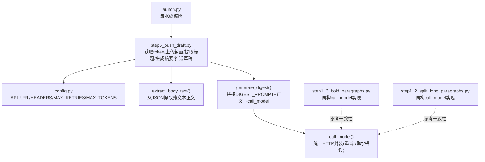
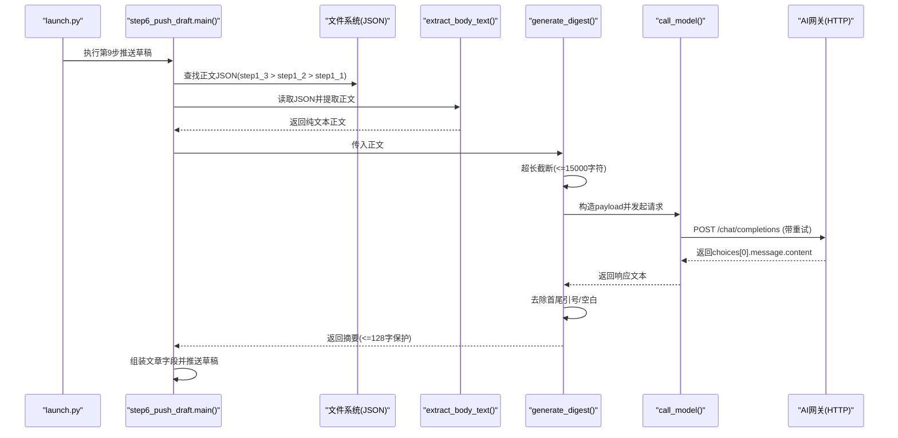
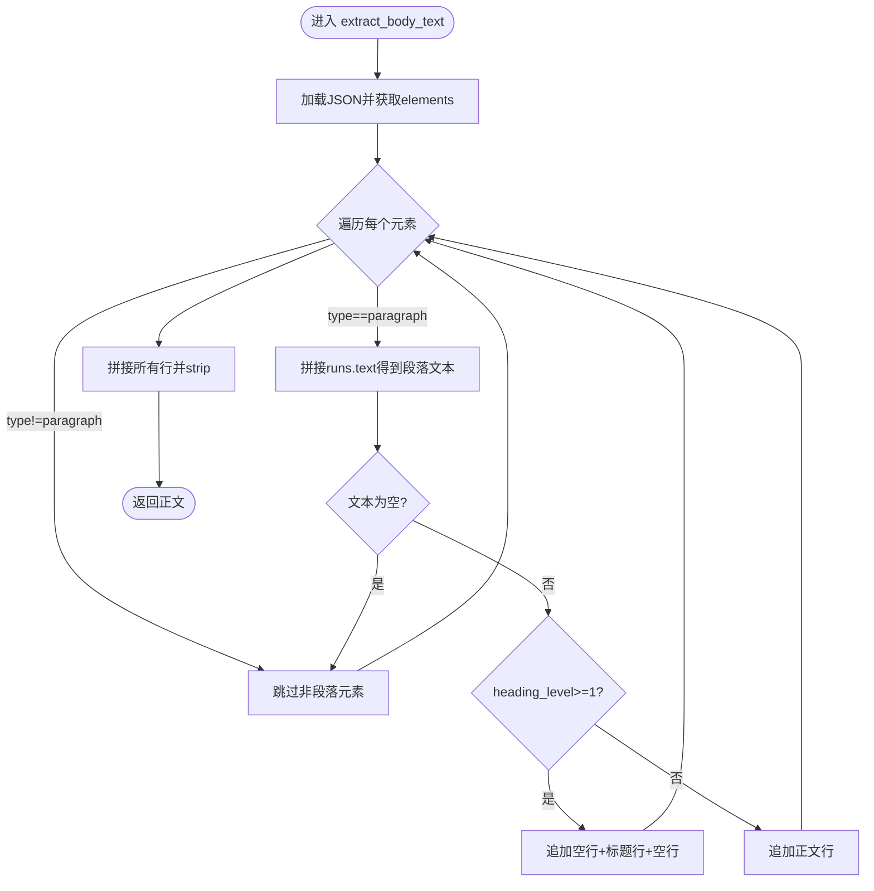
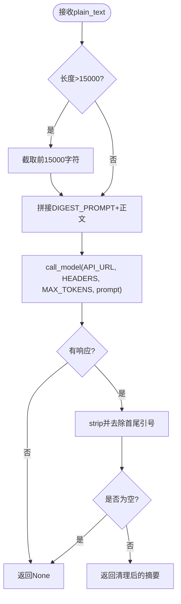
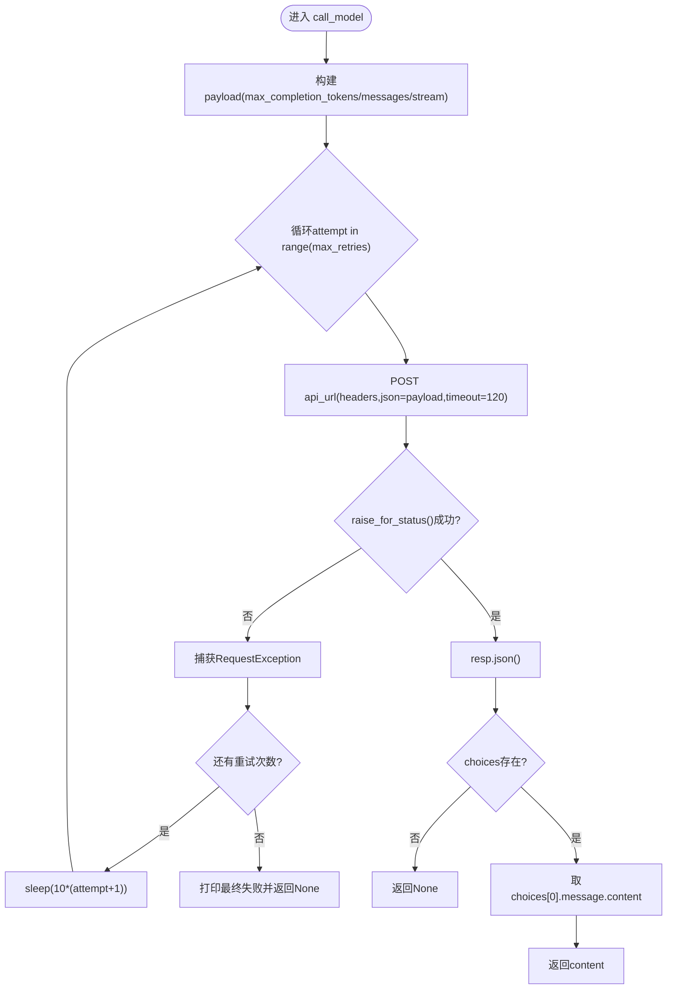
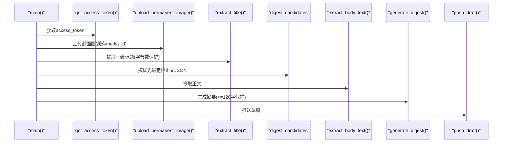
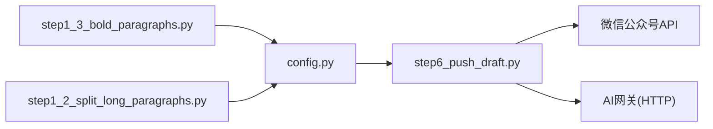

# AI 摘要生成

<cite>
**本文引用的文件**   
- [step6_push_draft.py](file://step6_push_draft.py)
- [config.py](file://config.py)
- [step1_3_bold_paragraphs.py](file://step1_3_bold_paragraphs.py)
- [step1_2_split_long_paragraphs.py](file://step1_2_split_long_paragraphs.py)
- [launch.py](file://launch.py)
</cite>

## 目录
1. [简介](#简介)
2. [项目结构](#项目结构)
3. [核心组件](#核心组件)
4. [架构总览](#架构总览)
5. [详细组件分析](#详细组件分析)
6. [依赖关系分析](#依赖关系分析)
7. [性能与稳定性](#性能与稳定性)
8. [故障排查指南](#故障排查指南)
9. [结论](#结论)
10. [附录：配置示例与提示词工程实践](#附录配置示例与提示词工程实践)

## 简介
本技术文档聚焦于“AI 摘要生成功能”，围绕以下目标展开：
- 深入说明 generate_digest() 的实现原理，包括正文文本提取、提示词工程与模型调用流程。
- 解析 DIGEST_PROMPT 的设计思路与约束条件（金句提取要求）。
- 文档化 call_model() 的封装逻辑（请求参数构建、重试机制、错误处理）。
- 解释正文文本提取算法 extract_body_text() 对段落元素与标题层级的处理方式。
- 提供可操作的配置示例，展示如何调整 AI 模型参数与行为。
- 总结常见 AI 服务问题及解决方案（如超时、内容过滤等），并给出提示词工程最佳实践。

## 项目结构
与 AI 摘要功能直接相关的代码集中在 step6_push_draft.py，同时涉及全局配置 config.py 以及其它步骤中对 call_model 的一致实现（step1_2_split_long_paragraphs.py、step1_3_bold_paragraphs.py）。流水线入口 launch.py 负责串联各步骤，最终在 step6 中完成摘要生成与草稿推送。

图表来源
- [launch.py:178-188](file://launch.py#L178-L188)
- [step6_push_draft.py:276-397](file://step6_push_draft.py#L276-L397)
- [config.py:1-39](file://config.py#L1-L39)
- [step1_3_bold_paragraphs.py:73-96](file://step1_3_bold_paragraphs.py#L73-L96)
- [step1_2_split_long_paragraphs.py:79-103](file://step1_2_split_long_paragraphs.py#L79-L103)

章节来源
- [launch.py:178-188](file://launch.py#L178-L188)
- [step6_push_draft.py:276-397](file://step6_push_draft.py#L276-L397)
- [config.py:1-39](file://config.py#L1-L39)

## 核心组件
本节概述与摘要生成相关的关键函数与常量：
- DIGEST_PROMPT：定义金句提取的提示词模板与约束。
- extract_body_text(json_path)：从 JSON 中提取纯文本正文，保留标题层级带来的空行分隔。
- generate_digest(plain_text)：截断过长正文、拼接提示词、调用模型并清洗结果。
- call_model(api_url, headers, max_tokens, prompt, max_retries=MAX_RETRIES)：统一的 HTTP 请求封装，包含重试与错误处理。
- 主流程 main(input_dir, ...)：按优先级选择输入 JSON、提取正文、生成摘要、推送草稿。

章节来源
- [step6_push_draft.py:146-182](file://step6_push_draft.py#L146-L182)
- [step6_push_draft.py:217-246](file://step6_push_draft.py#L217-L246)
- [step6_push_draft.py:188-211](file://step6_push_draft.py#L188-L211)
- [step6_push_draft.py:276-397](file://step6_push_draft.py#L276-L397)

## 架构总览
下图展示了从流水线入口到摘要生成的端到端流程，包括正文提取、提示词组装、模型调用与结果后处理。

图表来源
- [launch.py:178-188](file://launch.py#L178-L188)
- [step6_push_draft.py:333-359](file://step6_push_draft.py#L333-L359)
- [step6_push_draft.py:146-182](file://step6_push_draft.py#L146-L182)
- [step6_push_draft.py:227-246](file://step6_push_draft.py#L227-L246)
- [step6_push_draft.py:188-211](file://step6_push_draft.py#L188-L211)

## 详细组件分析

### 组件一：正文文本提取算法 extract_body_text()
职责与规则
- 仅处理 type=paragraph 的元素，忽略表格、图片等非段落元素。
- 合并 runs 中的 text 字段为完整段落文本。
- 若 heading_level >= 1，则在段落前后插入空行以增强可读性；普通段落每段一行。
- 输出为用换行符连接的纯文本正文。

复杂度与边界
- 时间复杂度 O(N)，N 为 elements 数量；空间复杂度 O(M)，M 为正文长度。
- 边界处理：空段落跳过；heading_level 为 None 时视为普通段落。

图表来源
- [step6_push_draft.py:146-182](file://step6_push_draft.py#L146-L182)

章节来源
- [step6_push_draft.py:146-182](file://step6_push_draft.py#L146-L182)

### 组件二：提示词工程 DIGEST_PROMPT
设计要点
- 角色与任务：从正文中找出一句最精炼、最有概括力或最生动的原文语句作为摘要/金句。
- 约束条件：
  - 必须为原文语句，不得改写。
  - 字数尽量简短，但至少 20 字，不超过 100 字。
  - 需点出全文核心矛盾或反差感。
  - 只输出这一句话，不要任何解释、引号或前缀。
  - 如果总结不出来，返回“不知道”。
- 优化策略：
  - 明确“原文”和“不改写”的要求，降低模型自由发挥的风险。
  - 通过“核心矛盾/反差感”引导模型关注高信息密度句子。
  - 限制输出格式，便于后续清洗与直接使用。

章节来源
- [step6_push_draft.py:217-224](file://step6_push_draft.py#L217-L224)

### 组件三：摘要生成流程 generate_digest()
处理步骤
- 输入截断：当正文超过 15000 字符时，截取前 15000 字符，避免超出上下文窗口。
- 提示词组装：将 DIGEST_PROMPT 与“文章正文”拼接为最终 prompt。
- 模型调用：调用 call_model() 发送请求。
- 结果清洗：去除首尾可能的引号与空白，返回有效内容；否则返回 None。

图表来源
- [step6_push_draft.py:227-246](file://step6_push_draft.py#L227-L246)

章节来源
- [step6_push_draft.py:227-246](file://step6_push_draft.py#L227-L246)

### 组件四：模型调用封装 call_model()
职责与特性
- 请求参数构建：
  - max_completion_tokens：由配置控制。
  - messages：单条 user 消息，内容为 prompt。
  - stream：关闭流式输出。
- 重试机制：
  - 最多尝试 MAX_RETRIES 次。
  - 指数退避等待：第 i 次失败后等待 10*(i+1) 秒再重试。
- 错误处理：
  - 捕获 requests.exceptions.RequestException（网络异常、超时、HTTP错误等）。
  - 解析响应体 JSON，提取 choices[0].message.content；若无 choices 则返回 None。
- 超时设置：单次请求 timeout=120 秒。

图表来源
- [step6_push_draft.py:188-211](file://step6_push_draft.py#L188-L211)

章节来源
- [step6_push_draft.py:188-211](file://step6_push_draft.py#L188-L211)

### 组件五：主流程集成 main()
关键逻辑
- 自动派生路径：process 目录与 step1_1 JSON 路径。
- 获取 access_token、上传封面图、提取标题（UTF-8 字节上限保护）。
- 正文来源优先级：step1_3_bold_paragraphs.json > step1_2_split_paragraphs.json > step1_1_docx_to_json.json。
- 生成摘要：调用 extract_body_text() → generate_digest()，并对结果进行微信摘要上限 128 字的截断保护。
- 推送草稿：组装 article 字段并调用草稿箱 API。

图表来源
- [step6_push_draft.py:276-397](file://step6_push_draft.py#L276-L397)

章节来源
- [step6_push_draft.py:276-397](file://step6_push_draft.py#L276-L397)

## 依赖关系分析
- 模块耦合
  - step6_push_draft.py 依赖 config.py 提供的 API_URL、HEADERS、MAX_RETRIES、MAX_TOKENS 等全局参数。
  - 多处重复实现了 call_model()，保持行为一致，但存在轻微冗余。建议抽取为公共模块以提升内聚性。
- 外部依赖
  - requests：用于 HTTP 请求。
  - 微信公众号 API：获取 access_token、上传素材、创建草稿。
  - AI 网关：OpenAI 兼容接口（Azure OpenAI 代理）。

图表来源
- [config.py:1-39](file://config.py#L1-L39)
- [step6_push_draft.py:31-36](file://step6_push_draft.py#L31-L36)
- [step1_3_bold_paragraphs.py:25-26](file://step1_3_bold_paragraphs.py#L25-L26)
- [step1_2_split_long_paragraphs.py:26](file://step1_2_split_long_paragraphs.py#L26)

章节来源
- [config.py:1-39](file://config.py#L1-L39)
- [step6_push_draft.py:31-36](file://step6_push_draft.py#L31-L36)
- [step1_3_bold_paragraphs.py:25-26](file://step1_3_bold_paragraphs.py#L25-L26)
- [step1_2_split_long_paragraphs.py:26](file://step1_2_split_long_paragraphs.py#L26)

## 性能与稳定性
- 正文截断策略：generate_digest() 对超长正文进行 15000 字符截断，降低模型上下文压力与延迟。
- 重试与退避：call_model() 采用固定最大重试次数与线性退避（10*(attempt+1) 秒），提升在网络抖动或服务瞬态错误下的成功率。
- 超时控制：HTTP 请求设置 120 秒超时，避免长时间挂起。
- 结果保护：摘要结果在写入草稿前进行 128 字截断，符合平台限制。

优化建议
- 将 call_model() 抽取为公共模块，减少重复实现，提高可维护性与一致性。
- 引入指数退避（例如 base*2^attempt）替代线性退避，进一步缓解服务端拥塞。
- 增加更细粒度的日志（如请求 ID、耗时、状态码），便于监控与排障。
- 对 AI 网关返回的错误码进行分类处理（如鉴权失败、配额不足、内容过滤），针对性重试或降级。

[本节为通用指导，无需特定文件引用]

## 故障排查指南
常见问题与定位要点
- 请求超时
  - 现象：调用 call_model() 抛出 RequestException 或触发最终失败。
  - 排查：检查网络连通性、AI 网关可用性、timeout 设置是否合理。
  - 参考位置：[step6_push_draft.py:188-211](file://step6_push_draft.py#L188-L211)
- 鉴权失败
  - 现象：HTTP 401/403 或返回无 choices。
  - 排查：确认 HEADERS 中的 client_id/client_secret/api-key 是否正确；必要时刷新密钥。
  - 参考位置：[config.py:12-17](file://config.py#L12-L17)
- 内容过滤/安全拦截
  - 现象：返回空 content 或提示违规。
  - 排查：调整 DIGEST_PROMPT 措辞，避免敏感表述；确保正文不包含违规内容。
  - 参考位置：[step6_push_draft.py:217-224](file://step6_push_draft.py#L217-L224)
- 正文为空或过短
  - 现象：extract_body_text() 返回空字符串，导致无法生成摘要。
  - 排查：确认 JSON 是否存在且包含 paragraph 元素；检查 heading_level 与 runs 字段。
  - 参考位置：[step6_push_draft.py:146-182](file://step6_push_draft.py#L146-L182)
- 摘要过长被截断
  - 现象：摘要超过 128 字被强制截断。
  - 排查：优化 DIGEST_PROMPT 的字数约束，或在生成后二次精简。
  - 参考位置：[step6_push_draft.py:350-352](file://step6_push_draft.py#L350-L352)

章节来源
- [step6_push_draft.py:188-211](file://step6_push_draft.py#L188-L211)
- [config.py:12-17](file://config.py#L12-L17)
- [step6_push_draft.py:217-224](file://step6_push_draft.py#L217-L224)
- [step6_push_draft.py:146-182](file://step6_push_draft.py#L146-L182)
- [step6_push_draft.py:350-352](file://step6_push_draft.py#L350-L352)

## 结论
本方案通过清晰的正文提取、严格的提示词约束与稳健的模型调用封装，实现了稳定可靠的 AI 摘要生成能力。结合重试与超时控制、结果长度保护，整体具备较好的鲁棒性与可维护性。后续可通过抽取公共模块、完善错误分类与监控指标进一步提升系统质量。

[本节为总结性内容，无需特定文件引用]

## 附录：配置示例与提示词工程实践

### 配置示例（来自仓库）
- AI 网关与认证
  - API_URL：指向 Azure OpenAI 兼容部署。
  - HEADERS：包含 client_id、client_secret、api-key 等。
- 通用参数
  - MAX_RETRIES：默认 3 次重试。
  - MAX_TOKENS：默认 8192。
- 微信公众号
  - WX_APP_ID/WX_APP_SECRET：用于获取 access_token。
  - WX_API_BASE：微信 API 基础地址。
  - 草稿默认值：作者、评论开关、来源链接等。

章节来源
- [config.py:1-39](file://config.py#L1-L39)

### 提示词工程最佳实践
- 明确角色与任务：清晰描述“你是谁”“要做什么”。
- 严格约束输出：限定字数范围、禁止改写、禁止多余解释。
- 结构化指令：使用分节与编号，强化关键要求。
- 容错与降级：允许返回“不知道”，避免模型强行编造。
- 示例与反例：在复杂场景下可提供正反示例，提升稳定性。
- 迭代优化：根据实际返回持续微调措辞与约束，平衡召回率与准确率。

章节来源
- [step6_push_draft.py:217-224](file://step6_push_draft.py#L217-L224)