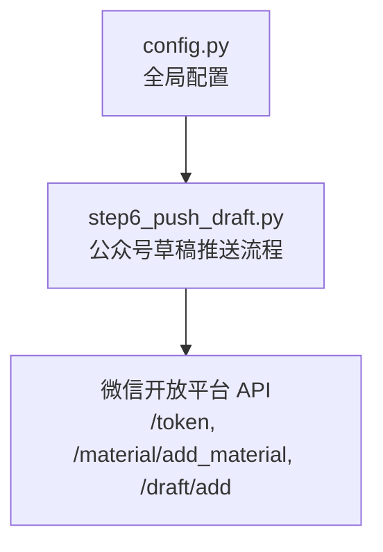
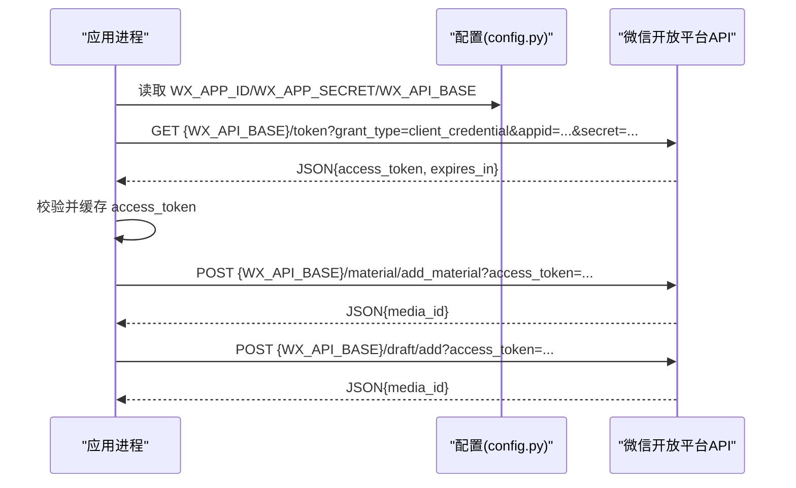
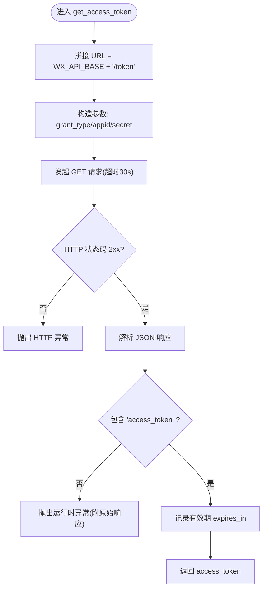
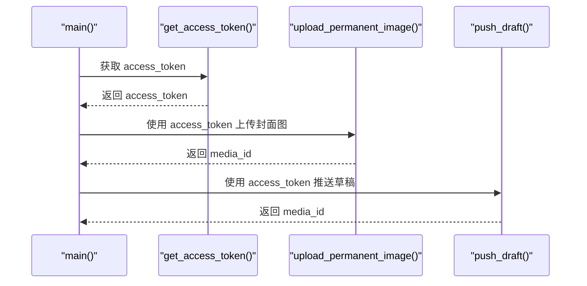
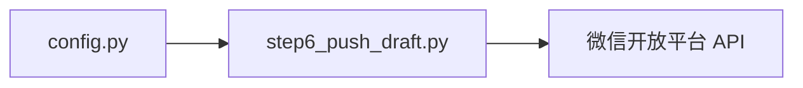

# API 认证机制

<cite>
**本文引用的文件**   
- [config.py](file://config.py)
- [step6_push_draft.py](file://step6_push_draft.py)
</cite>

## 目录
1. [简介](#简介)
2. [项目结构](#项目结构)
3. [核心组件](#核心组件)
4. [架构总览](#架构总览)
5. [详细组件分析](#详细组件分析)
6. [依赖关系分析](#依赖关系分析)
7. [性能与可用性考虑](#性能与可用性考虑)
8. [故障排查指南](#故障排查指南)
9. [结论](#结论)
10. [附录：配置示例](#附录配置示例)

## 简介
本技术文档聚焦微信公众号 API 的认证机制，围绕 access_token 的获取、生命周期管理、错误重试与安全实践展开。重点解析 get_access_token() 的实现细节（HTTP 请求构建、超时处理、异常捕获），并给出在 config.py 中配置 AppID 与 AppSecret 的方法与最佳实践。同时提供常见认证错误的定位思路与解决方案，帮助读者在生产环境中稳定运行。

## 项目结构
本项目为内容生产流水线的一部分，微信公众号相关逻辑集中在推送草稿步骤中，认证与凭证配置位于全局配置文件。

图表来源
- [config.py:26-32](file://config.py#L26-L32)
- [step6_push_draft.py:42-56](file://step6_push_draft.py#L42-L56)
- [step6_push_draft.py:62-79](file://step6_push_draft.py#L62-L79)
- [step6_push_draft.py:252-270](file://step6_push_draft.py#L252-L270)

章节来源
- [config.py:1-39](file://config.py#L1-L39)
- [step6_push_draft.py:1-404](file://step6_push_draft.py#L1-L404)

## 核心组件
- 凭证与基础 URL 配置：AppID、AppSecret、微信 API 基础地址等
- access_token 获取函数：构造请求、发送 HTTP GET、校验响应、返回 token
- 调用方主流程：在推送草稿前获取 token，并在后续接口调用中复用

章节来源
- [config.py:26-32](file://config.py#L26-L32)
- [step6_push_draft.py:42-56](file://step6_push_draft.py#L42-L56)
- [step6_push_draft.py:294-298](file://step6_push_draft.py#L294-L298)

## 架构总览
下图展示了从应用启动到获取 access_token 的关键交互路径，以及后续使用 token 调用素材与草稿接口的整体流程。

图表来源
- [config.py:26-32](file://config.py#L26-L32)
- [step6_push_draft.py:42-56](file://step6_push_draft.py#L42-L56)
- [step6_push_draft.py:62-79](file://step6_push_draft.py#L62-L79)
- [step6_push_draft.py:252-270](file://step6_push_draft.py#L252-L270)

## 详细组件分析

### 配置项与凭证管理（config.py）
- 微信公众号相关常量
  - WX_APP_ID：公众号 AppID
  - WX_APP_SECRET：公众号 AppSecret
  - WX_API_BASE：微信 API 基础地址
- 其他通用参数（如最大重试次数、最大令牌数等）用于大模型调用，非认证必需，但可影响整体稳定性

建议
- 将敏感凭证从代码中剥离，改用环境变量或密钥管理服务注入
- 避免将真实凭证提交至版本库；开发环境与生产环境分离

章节来源
- [config.py:26-32](file://config.py#L26-L32)
- [config.py:19-24](file://config.py#L19-L24)

### access_token 获取流程（get_access_token）
职责
- 构造访问微信 /token 端点的请求参数
- 发起 HTTP GET 请求并设置超时
- 校验响应状态码与返回体字段
- 打印有效期信息并返回 access_token

关键实现要点
- 请求参数
  - grant_type：固定为 client_credential
  - appid：来自配置 WX_APP_ID
  - secret：来自配置 WX_APP_SECRET
- 请求 URL：由 WX_API_BASE + "/token" 拼接
- 超时控制：GET 请求设置 30 秒超时
- 响应处理
  - 先检查 HTTP 状态码，非 2xx 抛出异常
  - 解析 JSON 后检查是否存在 access_token 字段
  - 若缺失，抛出运行时异常并附带原始响应数据以便定位问题
  - 成功时打印有效期（expires_in）

图表来源
- [step6_push_draft.py:42-56](file://step6_push_draft.py#L42-L56)

章节来源
- [step6_push_draft.py:42-56](file://step6_push_draft.py#L42-L56)

### 调用方主流程中的 token 使用
- 主流程在进入推送草稿前会显式调用 get_access_token() 获取 token
- 后续上传永久素材与新增草稿均通过 access_token 作为查询参数传递
- 当前实现未内置自动刷新策略，每次执行流程都会重新获取 token

图表来源
- [step6_push_draft.py:294-298](file://step6_push_draft.py#L294-L298)
- [step6_push_draft.py:62-79](file://step6_push_draft.py#L62-L79)
- [step6_push_draft.py:252-270](file://step6_push_draft.py#L252-L270)

章节来源
- [step6_push_draft.py:294-298](file://step6_push_draft.py#L294-L298)
- [step6_push_draft.py:62-79](file://step6_push_draft.py#L62-L79)
- [step6_push_draft.py:252-270](file://step6_push_draft.py#L252-L270)

## 依赖关系分析
- step6_push_draft.py 依赖 config.py 提供的 WX_APP_ID、WX_APP_SECRET、WX_API_BASE 等常量
- 网络层依赖 requests 库进行 HTTP 通信
- 微信开放平台提供三类接口：获取 token、上传永久素材、新增草稿

图表来源
- [config.py:26-32](file://config.py#L26-L32)
- [step6_push_draft.py:31-36](file://step6_push_draft.py#L31-L36)

章节来源
- [config.py:26-32](file://config.py#L26-L32)
- [step6_push_draft.py:31-36](file://step6_push_draft.py#L31-L36)

## 性能与可用性考虑
- 超时设置
  - 获取 token 的 GET 请求设置了 30 秒超时，适合短连接快速失败
  - 上传素材与草稿接口分别设置了 60 秒与 30 秒超时，兼顾大文件与网络波动
- 重试机制
  - 当前 get_access_token() 未实现内部重试；如需提升鲁棒性，可在上层封装指数退避重试
  - 项目中其他模块对大模型调用实现了带退避的重试逻辑，可作为参考模式
- 并发与限流
  - 微信对 access_token 有全局频率限制，应避免多进程重复频繁拉取
  - 建议在进程内缓存 token，结合有效期判断是否刷新

[本节为通用指导，不直接分析具体文件]

## 故障排查指南
常见问题与定位方法
- 网络超时
  - 现象：请求长时间无响应或抛出超时异常
  - 排查：确认服务器出站网络可达微信域名；适当增大超时时间；检查代理与防火墙规则
- 凭证无效
  - 现象：返回错误码提示 appid/secret 不正确
  - 排查：核对 WX_APP_ID 与 WX_APP_SECRET 是否与微信公众平台一致；注意大小写与隐藏字符
- 响应缺少关键字段
  - 现象：响应体中没有 access_token 或 media_id
  - 排查：打印完整响应体；检查业务错误码与描述；确认接口权限已开通
- 状态码异常
  - 现象：HTTP 非 2xx
  - 排查：查看响应头与响应体；根据错误码对照微信文档定位原因

建议的增强点
- 在 get_access_token() 外层增加重试与退避策略
- 统一封装异常类型与日志格式，便于集中监控与告警
- 引入 token 缓存与过期检测，减少不必要的拉取

章节来源
- [step6_push_draft.py:42-56](file://step6_push_draft.py#L42-L56)
- [step6_push_draft.py:62-79](file://step6_push_draft.py#L62-L79)
- [step6_push_draft.py:252-270](file://step6_push_draft.py#L252-L270)

## 结论
本项目对微信公众号 API 的认证采用标准的 client_credential 方式，通过 AppID 与 AppSecret 获取 access_token，并在后续接口调用中复用。当前实现简洁可靠，具备基本的超时与异常处理。面向生产环境，建议补充 token 缓存与自动刷新、统一重试策略与更完善的错误分类与日志输出，以提升系统的可用性与可观测性。

[本节为总结性内容，不直接分析具体文件]

## 附录：配置示例
以下展示如何在 config.py 中配置微信公众号凭证与基础 URL。请将占位值替换为你在微信公众平台申请到的真实值。

- WX_APP_ID：填写你的公众号 AppID
- WX_APP_SECRET：填写你的公众号 AppSecret
- WX_API_BASE：保持默认 https://api.weixin.qq.com/cgi-bin

章节来源
- [config.py:26-32](file://config.py#L26-L32)