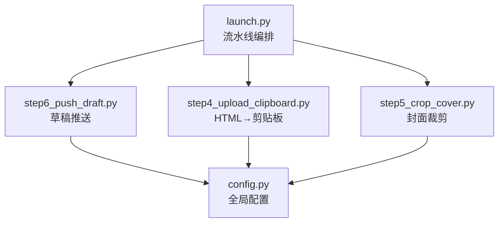
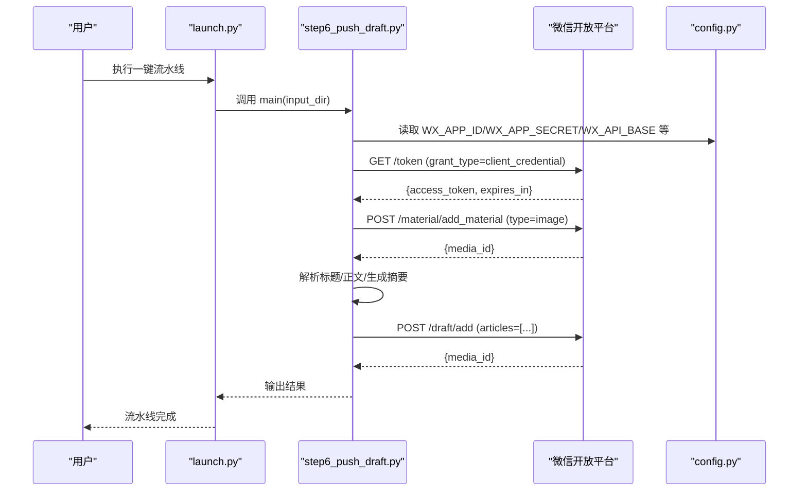
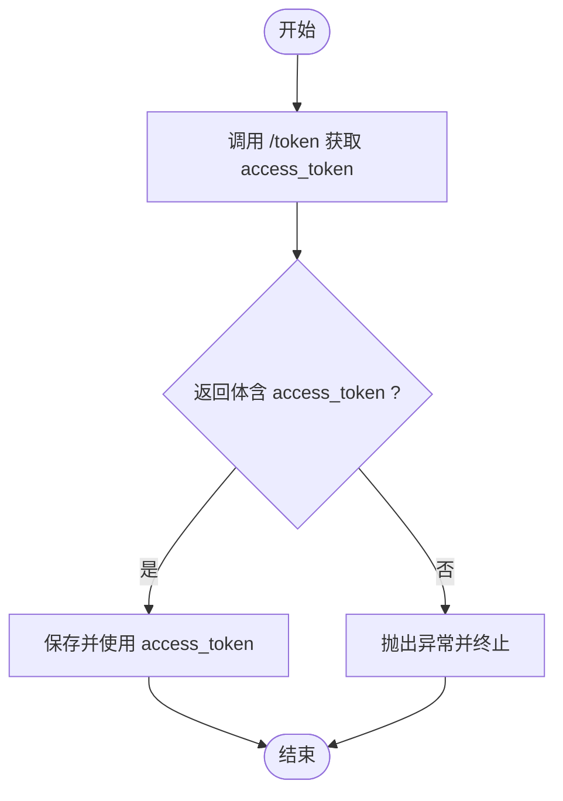
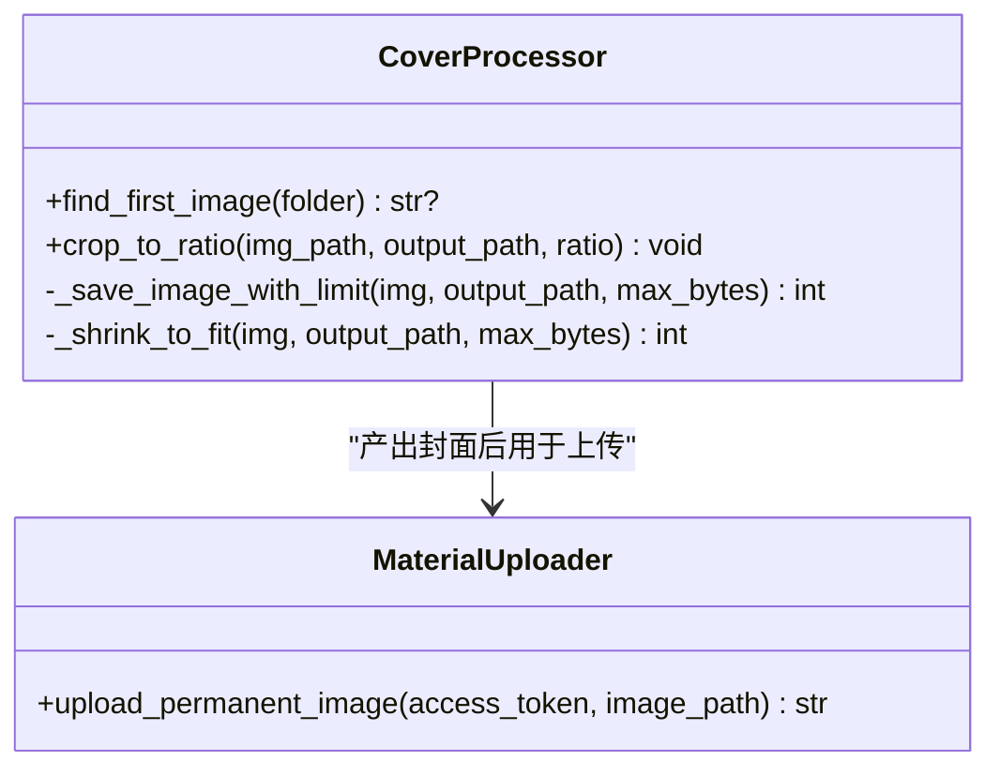
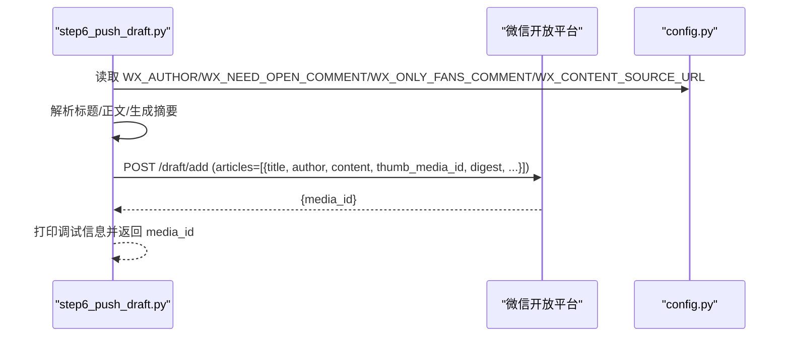
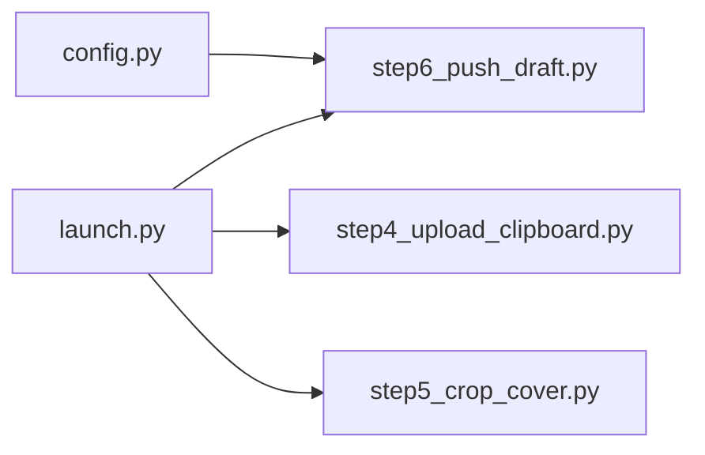

# 微信公众号集成

<cite>
**本文引用的文件**   
- [config.py](file://config.py)
- [launch.py](file://launch.py)
- [step6_push_draft.py](file://step6_push_draft.py)
- [step4_upload_clipboard.py](file://step4_upload_clipboard.py)
- [step5_crop_cover.py](file://step5_crop_cover.py)
</cite>

## 目录
1. [简介](#简介)
2. [项目结构](#项目结构)
3. [核心组件](#核心组件)
4. [架构总览](#架构总览)
5. [详细组件分析](#详细组件分析)
6. [依赖关系分析](#依赖关系分析)
7. [性能与限制](#性能与限制)
8. [故障排查指南](#故障排查指南)
9. [结论](#结论)
10. [附录：API 定义与示例](#附录api-定义与示例)

## 简介
本仓库实现从 Word 文档到微信公众号草稿箱的自动化流水线，重点覆盖以下能力：
- access_token 获取、刷新策略与错误处理
- 草稿推送流程（素材上传、文章构建、发布状态管理）
- 素材管理系统（图片等媒体资源处理）
- 主要 API 调用函数、请求参数与响应格式
- 自定义推送逻辑的代码示例路径
- 微信 API 的限制与最佳实践
- 错误重试机制、日志记录与监控告警建议

## 项目结构
与微信公众号集成功能直接相关的核心文件如下：
- config.py：全局配置（微信公众号 AppID/Secret、API 基础地址、默认草稿字段等）
- launch.py：一键流水线编排器，串联各步骤并支持跳过任意步骤
- step6_push_draft.py：微信公众号草稿推送主流程（access_token、封面上传、摘要生成、草稿创建）
- step4_upload_clipboard.py：HTML 转剪贴板（为人工粘贴到公众号编辑器提供富文本）
- step5_crop_cover.py：封面图裁剪与压缩，适配公众号封面比例与大小限制

图表来源
- [launch.py:42-188](file://launch.py#L42-L188)
- [step6_push_draft.py:276-397](file://step6_push_draft.py#L276-L397)
- [step4_upload_clipboard.py:436-479](file://step4_upload_clipboard.py#L436-L479)
- [step5_crop_cover.py:174-196](file://step5_crop_cover.py#L174-L196)
- [config.py:28-39](file://config.py#L28-L39)

章节来源
- [launch.py:1-201](file://launch.py#L1-L201)
- [config.py:1-39](file://config.py#L1-L39)

## 核心组件
- 认证与令牌管理
  - access_token 获取：通过 AppID + AppSecret 向微信服务端换取令牌。
  - 刷新策略：当前脚本每次运行均重新获取；生产环境建议本地缓存并按有效期提前刷新。
  - 错误处理：网络异常与返回体校验失败时抛出异常并终止流程。
- 素材管理
  - 永久图片素材上传：将封面图作为永久素材上传，返回 media_id 供草稿使用。
  - 封面裁剪与压缩：按 2.35:1 比例裁剪，自动压缩至 10MB 以内。
- 草稿构建与推送
  - 标题提取：从 step1_1 JSON 中取 heading_level=1 的标题，并进行 UTF-8 字节长度保护。
  - 摘要生成：基于正文内容调用大模型生成金句摘要，受 128 字上限保护。
  - 草稿创建：调用草稿箱 API 新增草稿，返回 media_id。
- 剪贴板辅助
  - HTML 转剪贴板：将渲染后的 HTML 转换为 Windows 剪贴板多格式数据，便于人工粘贴到公众号编辑器。

章节来源
- [step6_push_draft.py:42-79](file://step6_push_draft.py#L42-L79)
- [step6_push_draft.py:105-127](file://step6_push_draft.py#L105-L127)
- [step6_push_draft.py:146-182](file://step6_push_draft.py#L146-L182)
- [step6_push_draft.py:252-270](file://step6_push_draft.py#L252-L270)
- [step5_crop_cover.py:133-171](file://step5_crop_cover.py#L133-L171)
- [step4_upload_clipboard.py:436-479](file://step4_upload_clipboard.py#L436-L479)

## 架构总览
整体工作流由 launch.py 统一调度，微信公众号相关的关键交互集中在 step6_push_draft.py 中完成。

图表来源
- [launch.py:179-188](file://launch.py#L179-L188)
- [step6_push_draft.py:42-56](file://step6_push_draft.py#L42-L56)
- [step6_push_draft.py:62-79](file://step6_push_draft.py#L62-L79)
- [step6_push_draft.py:252-270](file://step6_push_draft.py#L252-L270)
- [config.py:28-39](file://config.py#L28-L39)

## 详细组件分析

### 认证与令牌管理（access_token）
- 获取方式
  - 接口：GET https://api.weixin.qq.com/cgi-bin/token
  - 参数：grant_type=client_credential, appid, secret
  - 返回：包含 access_token 与 expires_in
- 刷新策略
  - 当前实现：每次运行都重新获取
  - 建议：在进程内或持久化存储中缓存 token，并在过期前主动刷新
- 错误处理
  - 网络异常：捕获 requests 异常并重试（大模型调用有重试封装，access_token 获取未内置重试）
  - 业务异常：返回体不含 access_token 时抛出运行时异常

图表来源
- [step6_push_draft.py:42-56](file://step6_push_draft.py#L42-L56)

章节来源
- [step6_push_draft.py:42-56](file://step6_push_draft.py#L42-L56)
- [config.py:28-39](file://config.py#L28-L39)

### 素材管理（图片上传与封面裁剪）
- 永久素材上传
  - 接口：POST https://api.weixin.qq.com/cgi-bin/material/add_material
  - 参数：access_token, type=image
  - 表单字段：media（二进制文件）
  - 返回：media_id
- 封面裁剪与压缩
  - 目标比例：2.35:1
  - 文件大小上限：10MB（JPEG quality 自适应压缩，非 JPEG 则尝试缩小分辨率）
  - 输出命名：process/step5_crop_cover.<ext>

图表来源
- [step5_crop_cover.py:133-171](file://step5_crop_cover.py#L133-L171)
- [step6_push_draft.py:62-79](file://step6_push_draft.py#L62-L79)

章节来源
- [step6_push_draft.py:62-79](file://step6_push_draft.py#L62-L79)
- [step5_crop_cover.py:174-196](file://step5_crop_cover.py#L174-L196)

### 草稿构建与推送
- 标题提取
  - 来源：step1_1_docx_to_json.json 中 heading_level=1 的段落
  - 保护：UTF-8 字节数不超过 64 字节
- 摘要生成
  - 输入：step1_3_bold_paragraphs.json > step1_2_split_paragraphs.json > step1_1_docx_to_json.json
  - 方法：调用大模型生成“原文金句”，最大输入字符截断，输出截断至 128 字
- 草稿创建
  - 接口：POST https://api.weixin.qq.com/cgi-bin/draft/add
  - 参数：access_token
  - 载荷：articles 数组，包含 title、author、content、thumb_media_id、digest、need_open_comment、only_fans_can_comment、content_source_url 等

图表来源
- [step6_push_draft.py:105-127](file://step6_push_draft.py#L105-L127)
- [step6_push_draft.py:146-182](file://step6_push_draft.py#L146-L182)
- [step6_push_draft.py:252-270](file://step6_push_draft.py#L252-L270)
- [config.py:34-39](file://config.py#L34-L39)

章节来源
- [step6_push_draft.py:105-127](file://step6_push_draft.py#L105-L127)
- [step6_push_draft.py:146-182](file://step6_push_draft.py#L146-L182)
- [step6_push_draft.py:252-270](file://step6_push_draft.py#L252-L270)
- [config.py:34-39](file://config.py#L34-L39)

### 剪贴板辅助（HTML → 剪贴板）
- 功能要点
  - 解析 HTML 片段，展开简化类名到内联样式
  - 去除格式化空白，确保剪贴板格式正确
  - 本地图片转为 base64 data URI，提升兼容性
  - 写入 Windows 剪贴板多种格式（HTML Format、CF_UNICODETEXT、CF_TEXT、CF_OEMTEXT、CF_LOCALE 等）
- 适用场景
  - 当需要人工在公众号后台编辑器粘贴富文本时使用

章节来源
- [step4_upload_clipboard.py:436-479](file://step4_upload_clipboard.py#L436-L479)

## 依赖关系分析
- 模块耦合
  - launch.py 仅负责步骤编排与路径推导，不直接访问微信 API
  - step6_push_draft.py 依赖 config.py 的全局配置
  - step5_crop_cover.py 独立于微信 API，仅做图像处理
  - step4_upload_clipboard.py 独立于微信 API，仅做剪贴板操作
- 外部依赖
  - requests：HTTP 客户端
  - OpenCV/numpy：图像处理
  - ctypes：Windows 剪贴板操作

图表来源
- [launch.py:179-188](file://launch.py#L179-L188)
- [step6_push_draft.py:31-36](file://step6_push_draft.py#L31-L36)
- [config.py:28-39](file://config.py#L28-L39)

章节来源
- [launch.py:1-201](file://launch.py#L1-L201)
- [config.py:1-39](file://config.py#L1-L39)

## 性能与限制
- 微信 API 限制（与本项目相关）
  - 标题长度：UTF-8 字节不超过 64 字节（已实现截断保护）
  - 摘要长度：最多 128 字（已实现截断保护）
  - 永久素材图片大小：不超过 10MB（封面裁剪已实现自适应压缩）
  - 草稿内容 content 字段：当前脚本以占位字符串提交，实际富文本需另行处理
- 并发与限频
  - 当前为串行调用，无并发控制
  - 建议在批量推送时增加速率限制与退避策略
- 超时与重试
  - 大模型调用具备指数退避重试（MAX_RETRIES=3）
  - access_token 获取与素材上传未内置重试，建议在生产环境补充

[本节为通用指导，不直接分析具体文件]

## 故障排查指南
- access_token 获取失败
  - 检查 WX_APP_ID 与 WX_APP_SECRET 是否正确
  - 确认网络可达且未被防火墙拦截
  - 查看返回体是否包含 access_token
- 封面图上传失败
  - 确认图片路径存在且可读
  - 检查文件大小是否超过 10MB
  - 查看返回体错误码与描述
- 草稿推送失败
  - 检查 articles 字段是否完整（title、thumb_media_id 必填）
  - 确认 content 字段长度与编码符合预期
  - 查看返回体错误码与描述
- 剪贴板写入失败
  - 确认运行环境为 Windows
  - 检查是否有其他程序占用剪贴板
  - 查看各格式写入日志定位失败格式

章节来源
- [step6_push_draft.py:42-56](file://step6_push_draft.py#L42-L56)
- [step6_push_draft.py:62-79](file://step6_push_draft.py#L62-L79)
- [step6_push_draft.py:252-270](file://step6_push_draft.py#L252-L270)
- [step4_upload_clipboard.py:371-431](file://step4_upload_clipboard.py#L371-L431)

## 结论
该方案实现了从 Word 到微信公众号草稿箱的端到端自动化，覆盖了认证、素材上传、草稿构建与推送等关键环节。针对生产环境，建议完善 access_token 缓存与刷新、增加统一的错误重试与日志上报、并对 content 富文本进行更完善的处理与校验。

[本节为总结性内容，不直接分析具体文件]

## 附录：API 定义与示例

### 认证接口
- 名称：获取 access_token
- 方法：GET
- URL：https://api.weixin.qq.com/cgi-bin/token
- 查询参数
  - grant_type：固定值 client_credential
  - appid：公众号 AppID
  - secret：公众号 AppSecret
- 响应字段
  - access_token：访问令牌
  - expires_in：有效期（秒）
- 参考实现路径
  - [get_access_token:42-56](file://step6_push_draft.py#L42-L56)

章节来源
- [step6_push_draft.py:42-56](file://step6_push_draft.py#L42-L56)

### 素材上传接口（图片）
- 名称：上传永久素材（图片）
- 方法：POST
- URL：https://api.weixin.qq.com/cgi-bin/material/add_material
- 查询参数
  - access_token：访问令牌
  - type：image
- 表单字段
  - media：图片二进制文件
- 响应字段
  - media_id：素材 ID
- 参考实现路径
  - [upload_permanent_image:62-79](file://step6_push_draft.py#L62-L79)

章节来源
- [step6_push_draft.py:62-79](file://step6_push_draft.py#L62-L79)

### 草稿创建接口
- 名称：新增草稿
- 方法：POST
- URL：https://api.weixin.qq.com/cgi-bin/draft/add
- 查询参数
  - access_token：访问令牌
- 请求体（JSON）
  - articles：数组，元素包含
    - title：标题（UTF-8 字节 ≤ 64）
    - author：作者
    - content：正文（当前脚本使用占位字符串）
    - thumb_media_id：封面素材 ID
    - digest：摘要（可选，≤ 128 字）
    - need_open_comment：是否开启评论（0/1）
    - only_fans_can_comment：是否仅粉丝可评论（0/1）
    - content_source_url：创作来源链接（可选）
- 响应字段
  - media_id：草稿 ID
- 参考实现路径
  - [push_draft:252-270](file://step6_push_draft.py#L252-L270)
  - [main 组装 article:365-384](file://step6_push_draft.py#L365-L384)

章节来源
- [step6_push_draft.py:252-270](file://step6_push_draft.py#L252-L270)
- [step6_push_draft.py:365-384](file://step6_push_draft.py#L365-L384)

### 自定义推送逻辑示例（代码路径）
- 示例一：修改草稿字段
  - 在 main 中构造 article 对象处添加自定义字段或调整现有字段
  - 参考路径：[article 构造与调试输出:365-384](file://step6_push_draft.py#L365-L384)
- 示例二：替换摘要生成策略
  - 修改 generate_digest 中的 prompt 或调用 call_model 的参数
  - 参考路径：[generate_digest:227-246](file://step6_push_draft.py#L227-L246)、[call_model:188-211](file://step6_push_draft.py#L188-L211)
- 示例三：接入更多素材类型
  - 在 upload_permanent_image 基础上扩展 type=video 等逻辑
  - 参考路径：[upload_permanent_image:62-79](file://step6_push_draft.py#L62-L79)

章节来源
- [step6_push_draft.py:188-211](file://step6_push_draft.py#L188-L211)
- [step6_push_draft.py:227-246](file://step6_push_draft.py#L227-L246)
- [step6_push_draft.py:365-384](file://step6_push_draft.py#L365-L384)

### 错误重试与日志记录建议
- 重试策略
  - 对 access_token 获取与素材上传增加指数退避重试（参考大模型调用的重试封装）
  - 参考路径：[call_model 重试封装:188-211](file://step6_push_draft.py#L188-L211)
- 日志记录
  - 关键节点输出 INFO/WARN/ERROR 级别日志
  - 记录请求 URL、参数摘要、耗时与返回码
- 监控告警
  - 统计失败率与平均耗时，设置阈值告警
  - 对连续失败触发告警并暂停后续任务

章节来源
- [step6_push_draft.py:188-211](file://step6_push_draft.py#L188-L211)