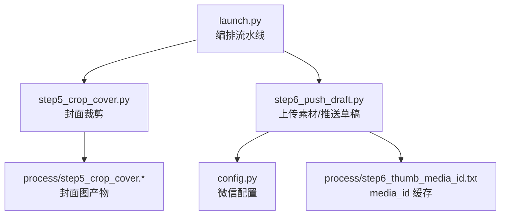
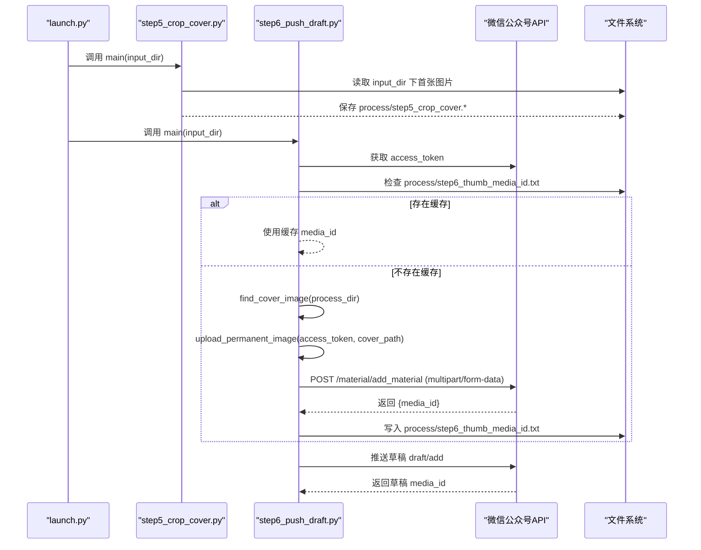
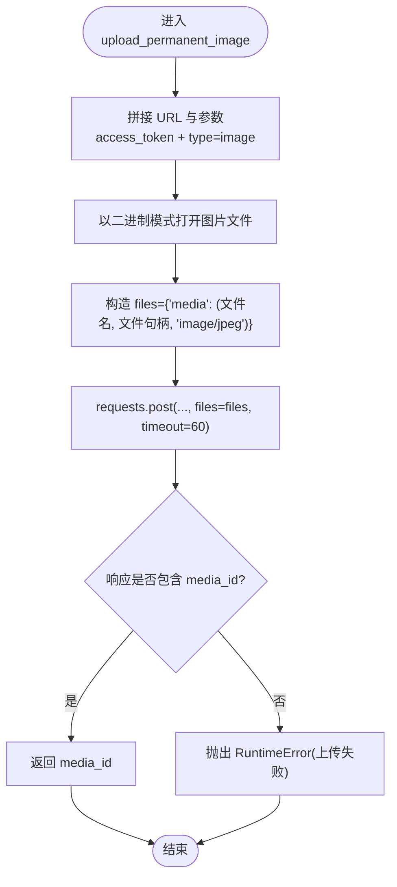
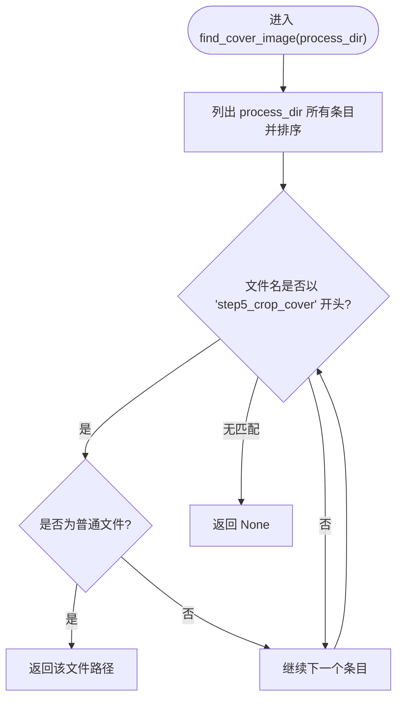
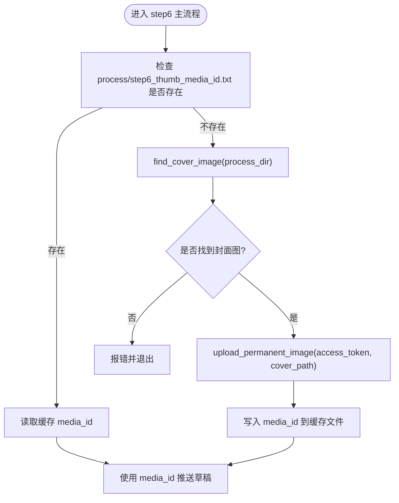
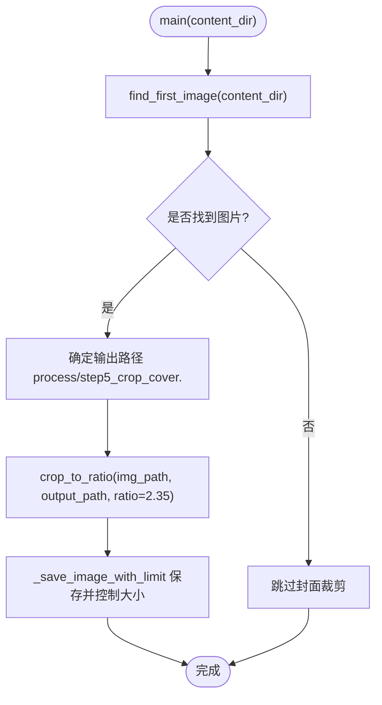
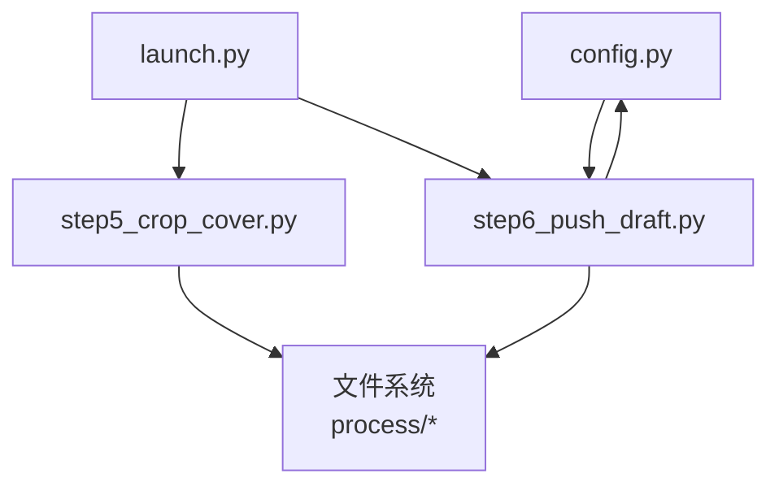

# 素材管理系统

<cite>
**本文引用的文件**   
- [step6_push_draft.py](file://step6_push_draft.py)
- [step5_crop_cover.py](file://step5_crop_cover.py)
- [config.py](file://config.py)
- [launch.py](file://launch.py)
</cite>

## 目录
1. [简介](#简介)
2. [项目结构](#项目结构)
3. [核心组件](#核心组件)
4. [架构总览](#架构总览)
5. [详细组件分析](#详细组件分析)
6. [依赖关系分析](#依赖关系分析)
7. [性能考虑](#性能考虑)
8. [故障排查指南](#故障排查指南)
9. [结论](#结论)
10. [附录：自定义素材管理示例](#附录自定义素材管理示例)

## 简介
本技术文档围绕微信公众号素材管理流程，重点说明以下能力：
- 永久素材上传功能：upload_permanent_image() 的实现细节与 HTTP 请求构建（multipart/form-data、文件流处理）
- 封面图查找机制：find_cover_image() 如何定位 step5_crop_cover.* 文件
- media_id 缓存机制：缓存文件的读写逻辑与失效策略
- 常见问题排查：如文件格式不支持、大小超限等错误处理
- 性能优化建议：批量上传与缓存策略

该流水线由 launch.py 编排，依次执行内容生成、剪贴板写入、封面裁剪与草稿推送。其中素材上传与草稿推送集中在 step6_push_draft.py，封面裁剪在 step5_crop_cover.py，配置项集中于 config.py。

## 项目结构
与素材管理直接相关的核心文件如下：
- step6_push_draft.py：获取 access_token、上传永久素材、查找封面图、生成摘要、推送草稿
- step5_crop_cover.py：从文章实例中选取首张图并裁剪为 2.35:1 的封面图，输出到 process/step5_crop_cover.*
- config.py：微信公众号 AppID/AppSecret、API 基础地址、草稿默认参数等
- launch.py：一键流水线入口，串联各步骤

图表来源
- [launch.py:168-186](file://launch.py#L168-L186)
- [step5_crop_cover.py:174-196](file://step5_crop_cover.py#L174-L196)
- [step6_push_draft.py:310-327](file://step6_push_draft.py#L310-L327)
- [config.py:29-39](file://config.py#L29-L39)

章节来源
- [launch.py:1-201](file://launch.py#L1-L201)
- [step5_crop_cover.py:1-203](file://step5_crop_cover.py#L1-L203)
- [step6_push_draft.py:1-404](file://step6_push_draft.py#L1-L404)
- [config.py:1-39](file://config.py#L1-L39)

## 核心组件
- 永久素材上传：upload_permanent_image(access_token, image_path)
- 封面图查找：find_cover_image(process_dir)
- media_id 缓存：process/step6_thumb_media_id.txt 的读写
- 封面裁剪：step5_crop_cover.py 将首张图片裁剪为 2.35:1 并保存到 process/step5_crop_cover.*
- 流水线编排：launch.py 按顺序调用 step5 与 step6

章节来源
- [step6_push_draft.py:62-79](file://step6_push_draft.py#L62-L79)
- [step6_push_draft.py:133-140](file://step6_push_draft.py#L133-L140)
- [step6_push_draft.py:310-327](file://step6_push_draft.py#L310-L327)
- [step5_crop_cover.py:174-196](file://step5_crop_cover.py#L174-L196)
- [launch.py:168-186](file://launch.py#L168-L186)

## 架构总览
下图展示了从封面裁剪到草稿推送的关键交互路径，包括本地文件与微信 API 的交互。

图表来源
- [launch.py:168-186](file://launch.py#L168-L186)
- [step5_crop_cover.py:174-196](file://step5_crop_cover.py#L174-L196)
- [step6_push_draft.py:42-56](file://step6_push_draft.py#L42-L56)
- [step6_push_draft.py:133-140](file://step6_push_draft.py#L133-L140)
- [step6_push_draft.py:62-79](file://step6_push_draft.py#L62-L79)
- [step6_push_draft.py:310-327](file://step6_push_draft.py#L310-L327)

## 详细组件分析

### 永久素材上传：upload_permanent_image()
- 功能：通过微信接口上传永久图片素材，返回 media_id
- 关键实现要点
  - 请求 URL：{WX_API_BASE}/material/add_material
  - 请求方法：POST
  - 查询参数：access_token、type=image
  - 请求体：multipart/form-data，字段名为 media，值为文件对象（文件名、二进制流、MIME 类型）
  - 超时设置：60s
  - 响应校验：若返回数据不含 media_id，抛出运行时异常
- HTTP 请求构建
  - 使用 requests.post(url, params=params, files=files, timeout=60)
  - files 字典键为 media，值为三元组 (filename, file_handle, mimetype)，requests 自动构造 multipart/form-data 边界与 Content-Type
  - 文件以二进制模式打开，避免编码问题
- 错误处理
  - 网络或权限错误：raise_for_status() 会抛出 HTTPError
  - 业务错误：未包含 media_id 时抛出 RuntimeError，便于上层捕获并提示

图表来源
- [step6_push_draft.py:62-79](file://step6_push_draft.py#L62-L79)

章节来源
- [step6_push_draft.py:62-79](file://step6_push_draft.py#L62-L79)

### 封面图查找：find_cover_image()
- 功能：在 process 目录下查找 step5_crop_cover.* 文件
- 查找策略
  - 遍历 process 目录并按文件名排序
  - 匹配前缀 step5_crop_cover 的文件
  - 仅返回第一个存在的文件路径
- 返回值
  - 找到则返回绝对路径字符串
  - 未找到返回 None，上层需据此判断是否跳过或报错

图表来源
- [step6_push_draft.py:133-140](file://step6_push_draft.py#L133-L140)

章节来源
- [step6_push_draft.py:133-140](file://step6_push_draft.py#L133-L140)

### media_id 缓存机制
- 缓存位置：process/step6_thumb_media_id.txt
- 写入时机：成功上传封面图后，将返回的 media_id 写入该文件
- 读取时机：再次运行 step6 时优先读取缓存，避免重复上传
- 失效策略
  - 当前实现为“存在即使用”，未内置时间戳或版本控制
  - 如需失效策略，可在文件名中加入时间戳或版本号，或在写入时附带过期时间并在读取时校验
- 典型流程
  - 若缓存文件存在：直接读取并使用
  - 否则：查找封面图 → 上传 → 写入缓存

图表来源
- [step6_push_draft.py:310-327](file://step6_push_draft.py#L310-L327)

章节来源
- [step6_push_draft.py:310-327](file://step6_push_draft.py#L310-L327)

### 封面裁剪：step5_crop_cover.py
- 目标：从文章实例目录中找到第一张图片，裁剪为 2.35:1 比例，保存到 process/step5_crop_cover.*
- 关键逻辑
  - 支持扩展名：jpg/jpeg/png/bmp/webp/tiff/tif
  - 中心裁剪：根据宽高比决定裁左右或上下
  - 文件大小限制：最大 10MB；JPEG 采用质量二分搜索压缩，非 JPEG 采用逐步缩放
  - 安全打印：兼容 GBK 终端
- 输出命名：process/step5_crop_cover.<ext>

图表来源
- [step5_crop_cover.py:174-196](file://step5_crop_cover.py#L174-L196)
- [step5_crop_cover.py:133-172](file://step5_crop_cover.py#L133-L172)
- [step5_crop_cover.py:59-107](file://step5_crop_cover.py#L59-L107)

章节来源
- [step5_crop_cover.py:1-203](file://step5_crop_cover.py#L1-L203)

### 流水线编排：launch.py
- 作用：统一入口，按顺序执行 step1~step6
- 相关步骤
  - step5：封面裁剪（调用 step5_crop_cover.main）
  - step6：推送草稿（调用 step6_push_draft.main）
- 可跳过：通过 SKIP_STEP5/SKIP_STEP6 控制

章节来源
- [launch.py:168-186](file://launch.py#L168-L186)

## 依赖关系分析
- 模块耦合
  - step6_push_draft.py 依赖 config.py 中的微信配置
  - step6_push_draft.py 依赖 step5_crop_cover.py 的输出文件（process/step5_crop_cover.*）
  - launch.py 作为编排器，依赖 step5 与 step6 的 main 函数
- 外部依赖
  - requests：HTTP 客户端，用于访问微信 API 与大模型 API
  - cv2/numpy：图像处理（step5）
- 潜在循环依赖
  - 当前未见循环导入，step5 与 step6 通过文件系统解耦

图表来源
- [config.py:29-39](file://config.py#L29-L39)
- [step6_push_draft.py:31-36](file://step6_push_draft.py#L31-L36)
- [step5_crop_cover.py:174-196](file://step5_crop_cover.py#L174-L196)
- [launch.py:168-186](file://launch.py#L168-L186)

章节来源
- [config.py:1-39](file://config.py#L1-L39)
- [step6_push_draft.py:1-404](file://step6_push_draft.py#L1-L404)
- [step5_crop_cover.py:1-203](file://step5_crop_cover.py#L1-L203)
- [launch.py:1-201](file://launch.py#L1-L201)

## 性能考虑
- 批量上传
  - 当前实现为单图上传，适合封面图场景
  - 若需批量上传多张素材，可封装一个批量接口，循环调用 upload_permanent_image，并结合并发（如线程池）提升吞吐
- 缓存策略
  - 已实现 media_id 文本缓存，避免重复上传
  - 建议增加失效策略：例如在缓存文件中记录媒体创建时间或版本号，超过有效期或源文件变更时强制刷新
- 网络与 I/O
  - 上传超时设置为 60s，适用于常规封面图大小
  - 大文件上传建议启用分块上传或断点续传（视平台能力而定）
- 图像处理
  - 封面裁剪对 JPEG 进行质量二分搜索，兼顾体积与画质
  - 非 JPEG 格式采用缩放策略，注意分辨率下降对显示效果的影响

[本节为通用指导，不直接分析具体文件]

## 故障排查指南
- 常见错误与定位
  - 未找到封面图：find_cover_image 返回 None，step6 会报错并终止。请确认 step5 已成功运行且 process 目录中存在 step5_crop_cover.* 文件
  - 上传失败：若响应不包含 media_id，upload_permanent_image 抛出 RuntimeError。检查网络连通性、access_token 有效性、图片格式与大小是否符合微信要求
  - 标题超长：step6 内部会对标题进行 UTF-8 字节截断保护，避免超出微信限制
- 日志与调试
  - 关注控制台输出的 [INFO]/[WARN]/[ERROR] 标记，快速定位失败阶段
  - 对于网络请求，可通过 raise_for_status 抛出的异常信息进一步诊断
- 文件与路径
  - 确保输入目录、process 目录与缓存文件路径正确
  - 中文/emoji 路径已在多处做了兼容处理（如安全打印、绝对路径转换）

章节来源
- [step6_push_draft.py:133-140](file://step6_push_draft.py#L133-L140)
- [step6_push_draft.py:62-79](file://step6_push_draft.py#L62-L79)
- [step6_push_draft.py:105-127](file://step6_push_draft.py#L105-L127)
- [step5_crop_cover.py:174-196](file://step5_crop_cover.py#L174-L196)

## 结论
本系统通过清晰的流水线编排与模块化设计，实现了从内容生成到公众号草稿推送的全链路自动化。素材上传与封面裁剪分别由 step6 与 step5 负责，并通过文件系统与缓存机制解耦。建议在后续迭代中完善缓存失效策略与批量上传能力，以提升整体效率与鲁棒性。

[本节为总结性内容，不直接分析具体文件]

## 附录：自定义素材管理示例
以下为基于现有代码的自定义素材管理思路（不直接粘贴源码，提供路径参考）：
- 自定义上传接口封装
  - 参考路径：[step6_push_draft.py:62-79](file://step6_push_draft.py#L62-L79)
  - 可封装为类或函数，支持传入不同 MIME 类型与重试策略
- 自定义缓存策略
  - 参考路径：[step6_push_draft.py:310-327](file://step6_push_draft.py#L310-L327)
  - 可在缓存文件中追加元数据（如更新时间、源文件哈希），读取时校验是否失效
- 自定义封面图选择
  - 参考路径：[step6_push_draft.py:133-140](file://step6_push_draft.py#L133-L140)
  - 可按规则选择特定名称或尺寸的封面图，而非仅匹配前缀
- 批量上传示例流程
  - 遍历待上传文件列表，循环调用上传函数，收集结果并写入汇总日志
  - 结合并发与重试，提高成功率与吞吐

章节来源
- [step6_push_draft.py:62-79](file://step6_push_draft.py#L62-L79)
- [step6_push_draft.py:310-327](file://step6_push_draft.py#L310-L327)
- [step6_push_draft.py:133-140](file://step6_push_draft.py#L133-L140)