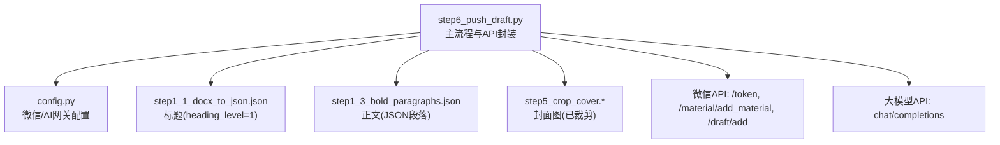
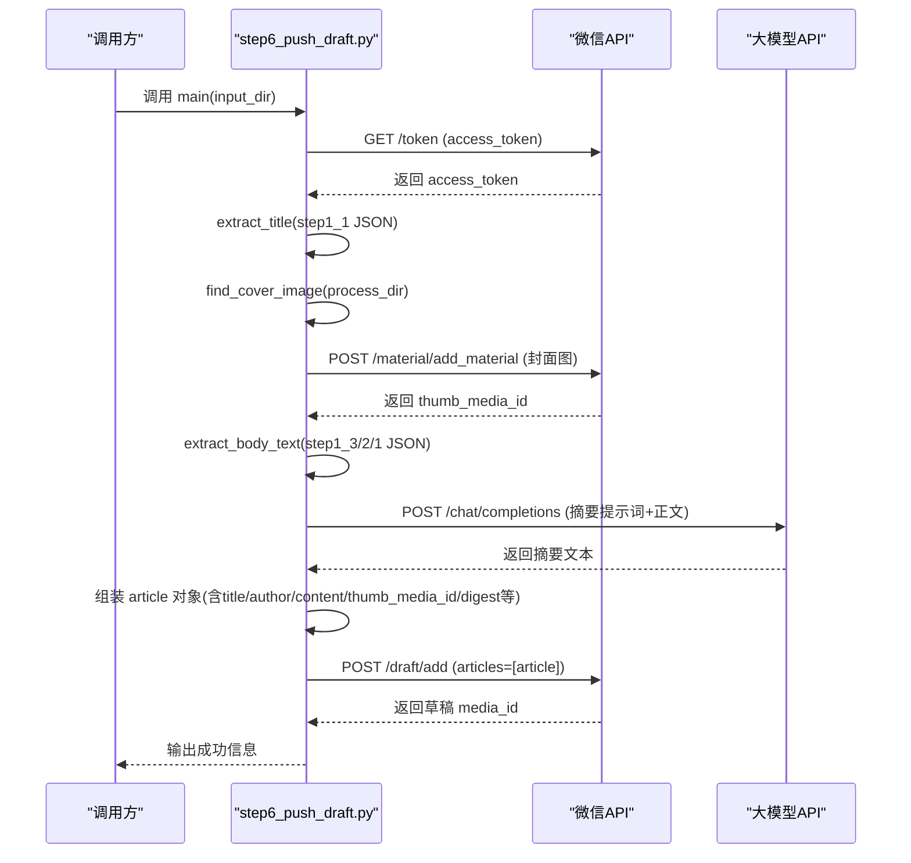
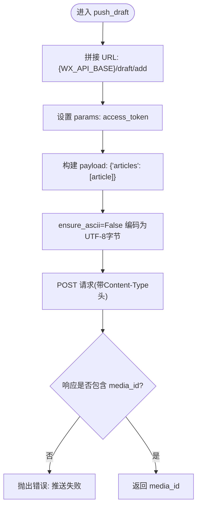
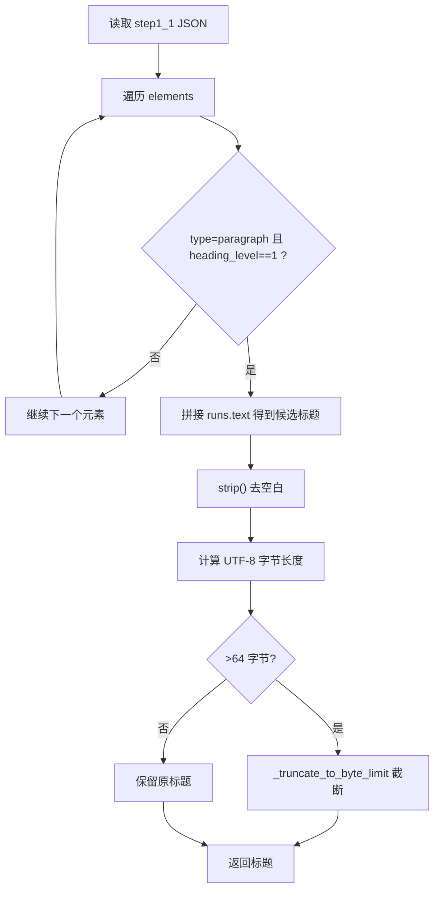
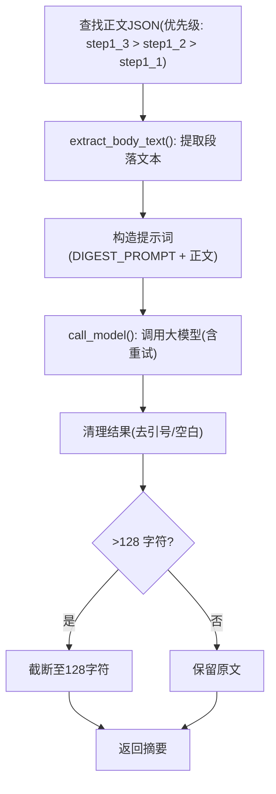
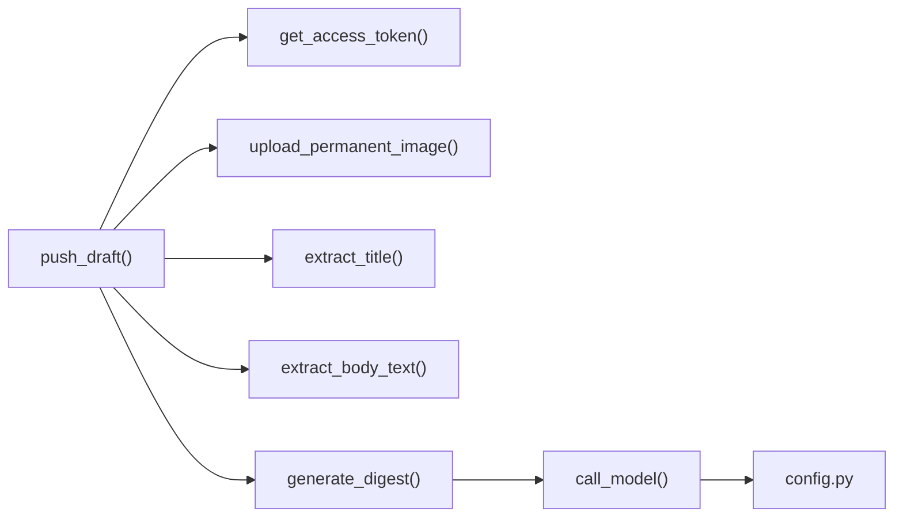

# 草稿推送流程

<cite>
**本文引用的文件**
- [step6_push_draft.py](file://step6_push_draft.py)
- [config.py](file://config.py)
- [step1_1_docx_to_json.json](file://content_instance/content_20260710_1/process/step1_1_docx_to_json.json)
- [step1_3_bold_paragraphs.json](file://content_instance/content_20260710_1/process/step1_3_bold_paragraphs.json)
- [step5_crop_cover.py](file://step5_crop_cover.py)
</cite>

## 目录
1. [简介](#简介)
2. [项目结构](#项目结构)
3. [核心组件](#核心组件)
4. [架构总览](#架构总览)
5. [详细组件分析](#详细组件分析)
6. [依赖关系分析](#依赖关系分析)
7. [性能与限制](#性能与限制)
8. [故障排查指南](#故障排查指南)
9. [结论](#结论)
10. [附录：自定义文章推送逻辑示例](#附录自定义文章推送逻辑示例)

## 简介
本技术文档围绕微信公众号草稿推送功能，聚焦 push_draft() 函数的完整执行流程，涵盖文章数据结构构建、字段验证与长度限制、封面图上传、标题提取（从 step1_1 JSON 中取 heading_level=1）、摘要生成（正文文本提取与大模型调用）以及最终 API 调用。同时提供微信 API 的限制说明与最佳实践建议，并给出可复用的自定义推送实现思路。

## 项目结构
与草稿推送直接相关的代码与数据如下：
- 推送主流程与函数：step6_push_draft.py
- 全局配置（微信与AI网关）：config.py
- 输入数据：
  - 标题来源：content_instance/<实例>/process/step1_1_docx_to_json.json
  - 正文来源（优先）：content_instance/<实例>/process/step1_3_bold_paragraphs.json（回退到 step1_2/step1_1）
  - 封面图：由 step5_crop_cover.* 产出，存放于 process 目录
- 封面裁剪工具：step5_crop_cover.py

图表来源
- [step6_push_draft.py:252-270](file://step6_push_draft.py#L252-L270)
- [config.py:29-38](file://config.py#L29-L38)

章节来源
- [step6_push_draft.py:1-404](file://step6_push_draft.py#L1-L404)
- [config.py:1-39](file://config.py#L1-L39)

## 核心组件
- access_token 获取：通过微信基础接口获取凭证
- 永久素材上传：上传封面图，返回 media_id
- 标题提取：从 step1_1 JSON 中定位 heading_level=1 的段落，拼接 runs.text，并进行 UTF-8 字节长度截断保护
- 正文提取：从 step1_3（或回退 step1_2/step1_1）JSON 中提取所有 paragraph 的 runs.text，按层级插入空行保持可读性
- 摘要生成：构造提示词，调用大模型，对结果进行清理与长度保护（不超过128字）
- 草稿推送：组装 article 对象，调用微信草稿新增接口，返回 media_id

章节来源
- [step6_push_draft.py:42-56](file://step6_push_draft.py#L42-L56)
- [step6_push_draft.py:62-79](file://step6_push_draft.py#L62-L79)
- [step6_push_draft.py:85-127](file://step6_push_draft.py#L85-L127)
- [step6_push_draft.py:146-182](file://step6_push_draft.py#L146-L182)
- [step6_push_draft.py:217-246](file://step6_push_draft.py#L217-L246)
- [step6_push_draft.py:252-270](file://step6_push_draft.py#L252-L270)

## 架构总览
下图展示一次完整的草稿推送时序，包括认证、封面上传、标题与摘要处理、最终草稿创建。

图表来源
- [step6_push_draft.py:42-56](file://step6_push_draft.py#L42-L56)
- [step6_push_draft.py:62-79](file://step6_push_draft.py#L62-L79)
- [step6_push_draft.py:105-127](file://step6_push_draft.py#L105-L127)
- [step6_push_draft.py:146-182](file://step6_push_draft.py#L146-L182)
- [step6_push_draft.py:217-246](file://step6_push_draft.py#L217-L246)
- [step6_push_draft.py:252-270](file://step6_push_draft.py#L252-L270)

## 详细组件分析

### push_draft() 函数执行流程
push_draft(access_token, article) 负责将单篇文章推送到公众号草稿箱。其关键步骤如下：
- 请求地址：{WX_API_BASE}/draft/add
- 参数：access_token（URL 参数）
- 载荷：{"articles": [article]}，其中 article 为字典，包含 title、author、content、thumb_media_id、digest（可选）、content_source_url（可选）、need_open_comment、only_fans_can_comment 等字段
- 编码：手动使用 ensure_ascii=False 的 JSON 编码，并以 application/json; charset=utf-8 发送，避免中文被转义
- 响应校验：若返回体不含 media_id，抛出异常；否则返回 media_id

图表来源
- [step6_push_draft.py:252-270](file://step6_push_draft.py#L252-L270)

章节来源
- [step6_push_draft.py:252-270](file://step6_push_draft.py#L252-L270)

### 文章对象字段定义与限制
在 main() 中组装 article 时，涉及以下字段及约束：
- title：字符串，来自 step1_1 JSON 的 heading_level=1 段落，UTF-8 字节上限 64，超出则截断
- author：字符串，来自配置 WX_AUTHOR
- content：字符串，当前为占位“空”（后续可扩展为真实HTML内容）
- thumb_media_id：字符串，来自上传封面图后返回的 media_id
- digest：字符串（可选），来自大模型生成的摘要金句，最大 128 字符
- content_source_url：字符串（可选），来自配置 WX_CONTENT_SOURCE_URL
- need_open_comment：整数（0/1），来自配置 WX_NEED_OPEN_COMMENT
- only_fans_can_comment：整数（0/1），来自配置 WX_ONLY_FANS_COMMENT

注意：
- 标题截断策略：逐字符累加 UTF-8 字节数，不拆散单个字符，并在末尾去除空白
- 摘要长度保护：超过 128 字符直接截断

章节来源
- [step6_push_draft.py:85-127](file://step6_push_draft.py#L85-L127)
- [step6_push_draft.py:365-376](file://step6_push_draft.py#L365-L376)
- [step6_push_draft.py:350-352](file://step6_push_draft.py#L350-L352)

### 标题提取逻辑（从 step1_1 JSON 取 heading_level=1）
- 读取 step1_1_docx_to_json.json，遍历 elements
- 筛选 type=paragraph 且 heading_level==1 的元素
- 将该元素的 runs 列表中的 text 拼接成标题
- 计算 UTF-8 字节长度，若超过 64 字节，调用 _truncate_to_byte_limit 进行安全截断
- 若未找到一级标题，记录警告并返回 None

图表来源
- [step6_push_draft.py:105-127](file://step6_push_draft.py#L105-L127)
- [step6_push_draft.py:88-102](file://step6_push_draft.py#L88-L102)

章节来源
- [step6_push_draft.py:105-127](file://step6_push_draft.py#L105-L127)
- [step6_push_draft.py:88-102](file://step6_push_draft.py#L88-L102)
- [step1_1_docx_to_json.json:1-200](file://content_instance/content_20260710_1/process/step1_1_docx_to_json.json#L1-L200)

### 摘要生成流程（正文提取 + 大模型调用 + 结果处理）
- 正文来源优先级：step1_3_bold_paragraphs.json > step1_2_split_paragraphs.json > step1_1_docx_to_json.json
- 正文提取：遍历 elements，仅处理 type=paragraph；heading_level>=1 的段落前后插入空行以增强可读性；普通段落每段一行
- 大模型调用：构造 DIGEST_PROMPT 与正文组合的 prompt，调用 call_model（含重试机制）
- 结果处理：去除首尾引号，返回纯文本；若为空则视为无摘要
- 长度保护：摘要超过 128 字符时截断

图表来源
- [step6_push_draft.py:146-182](file://step6_push_draft.py#L146-L182)
- [step6_push_draft.py:217-246](file://step6_push_draft.py#L217-L246)
- [step6_push_draft.py:333-352](file://step6_push_draft.py#L333-L352)

章节来源
- [step6_push_draft.py:146-182](file://step6_push_draft.py#L146-L182)
- [step6_push_draft.py:217-246](file://step6_push_draft.py#L217-L246)
- [step6_push_draft.py:333-352](file://step6_push_draft.py#L333-L352)
- [step1_3_bold_paragraphs.json:1-200](file://content_instance/content_20260710_1/process/step1_3_bold_paragraphs.json#L1-L200)

### 封面图上传与缓存
- 封面图查找：在 process 目录下匹配 step5_crop_cover.* 前缀的文件
- 上传接口：{WX_API_BASE}/material/add_material，type=image，返回 media_id
- 缓存策略：将 thumb_media_id 写入 process/step6_thumb_media_id.txt，下次复用，避免重复上传

章节来源
- [step6_push_draft.py:133-140](file://step6_push_draft.py#L133-L140)
- [step6_push_draft.py:62-79](file://step6_push_draft.py#L62-L79)
- [step6_push_draft.py:313-327](file://step6_push_draft.py#L313-L327)
- [step5_crop_cover.py:33-34](file://step5_crop_cover.py#L33-L34)

### 配置项与常量
- 微信相关：
  - WX_APP_ID、WX_APP_SECRET、WX_API_BASE
  - WX_AUTHOR、WX_CONTENT_SOURCE_URL、WX_NEED_OPEN_COMMENT、WX_ONLY_FANS_COMMENT
- 大模型相关：
  - API_URL、HEADERS、MAX_RETRIES、MAX_TOKENS
- 标题字节上限：_WX_TITLE_MAX_BYTES = 64

章节来源
- [config.py:29-38](file://config.py#L29-L38)
- [config.py:6-21](file://config.py#L6-L21)
- [step6_push_draft.py:85](file://step6_push_draft.py#L85-L85)

## 依赖关系分析
- 模块内依赖：
  - push_draft() 依赖 get_access_token()、upload_permanent_image()、extract_title()、extract_body_text()、generate_digest()
  - generate_digest() 依赖 call_model()
  - call_model() 依赖 config.API_URL、config.HEADERS、config.MAX_RETRIES、config.MAX_TOKENS
- 外部依赖：
  - 微信 API：/token、/material/add_material、/draft/add
  - 大模型 API：/chat/completions

图表来源
- [step6_push_draft.py:42-56](file://step6_push_draft.py#L42-L56)
- [step6_push_draft.py:62-79](file://step6_push_draft.py#L62-L79)
- [step6_push_draft.py:105-127](file://step6_push_draft.py#L105-L127)
- [step6_push_draft.py:146-182](file://step6_push_draft.py#L146-L182)
- [step6_push_draft.py:188-211](file://step6_push_draft.py#L188-L211)
- [config.py:6-21](file://config.py#L6-L21)

章节来源
- [step6_push_draft.py:42-211](file://step6_push_draft.py#L42-L211)
- [config.py:6-21](file://config.py#L6-L21)

## 性能与限制
- 网络超时与重试：
  - 微信 token 获取：timeout=30s
  - 封面上传：timeout=60s
  - 草稿推送：timeout=30s
  - 大模型调用：timeout=120s，最多 MAX_RETRIES 次重试，指数退避等待
- 长度限制：
  - 标题：UTF-8 字节上限 64，超出自动截断
  - 摘要：字符上限 128，超出自动截断
  - 正文输入：为避免超出模型上下文窗口，正文截取前 15000 字符
- 封面图大小：step5_crop_cover.py 内置 10MB 上限（符合微信永久素材图片限制）

章节来源
- [step6_push_draft.py:42-56](file://step6_push_draft.py#L42-L56)
- [step6_push_draft.py:62-79](file://step6_push_draft.py#L62-L79)
- [step6_push_draft.py:188-211](file://step6_push_draft.py#L188-L211)
- [step6_push_draft.py:229-233](file://step6_push_draft.py#L229-L233)
- [step6_push_draft.py:350-352](file://step6_push_draft.py#L350-L352)
- [step5_crop_cover.py:33-34](file://step5_crop_cover.py#L33-L34)

## 故障排查指南
- access_token 获取失败：
  - 检查 WX_APP_ID 与 WX_APP_SECRET 是否正确配置
  - 确认 WX_API_BASE 指向正确的微信基础域名
  - 查看返回体是否包含 access_token 字段
- 封面图上传失败：
  - 确认 step5_crop_cover.* 文件存在且路径正确
  - 检查文件大小是否超过 10MB
  - 查看返回体是否包含 media_id
- 标题提取失败：
  - 确认 step1_1_docx_to_json.json 存在且包含 heading_level=1 的段落
  - 检查 JSON 结构是否符合预期（elements -> paragraph -> runs -> text）
- 摘要生成失败：
  - 检查大模型 API 连通性与鉴权头（client_id/client_secret/api-key）
  - 查看 prompt 长度是否过大（已做 15000 字符截断）
  - 确认返回 choices[0].message.content 非空
- 草稿推送失败：
  - 检查返回体是否包含 media_id
  - 核对 article 各字段类型与长度限制（title 字节<=64，digest 字符<=128）
  - 确认 Content-Type 与 ensure_ascii=False 的编码方式

章节来源
- [step6_push_draft.py:42-56](file://step6_push_draft.py#L42-L56)
- [step6_push_draft.py:62-79](file://step6_push_draft.py#L62-L79)
- [step6_push_draft.py:105-127](file://step6_push_draft.py#L105-L127)
- [step6_push_draft.py:188-211](file://step6_push_draft.py#L188-L211)
- [step6_push_draft.py:252-270](file://step6_push_draft.py#L252-L270)

## 结论
push_draft() 作为草稿推送的核心入口，串联了认证、封面上传、标题与摘要处理、最终草稿创建等关键环节。通过对标题字节长度与摘要字符长度的严格保护，以及对网络请求的重试与超时控制，整体流程具备较好的健壮性与可维护性。建议在后续迭代中扩展 content 字段为真实 HTML 内容，并引入更完善的频率控制与错误码映射策略。

## 附录：自定义文章推送逻辑示例
以下示例展示了如何基于现有能力自定义文章推送逻辑（不包含具体代码内容，仅提供结构与路径指引）：
- 自定义 article 构建：参考 main() 中 article 字典的组装位置，按需添加或替换字段
  - 参考路径：[step6_push_draft.py:365-376](file://step6_push_draft.py#L365-L376)
- 自定义标题提取：修改 extract_title() 的筛选条件或拼接逻辑
  - 参考路径：[step6_push_draft.py:105-127](file://step6_push_draft.py#L105-L127)
- 自定义摘要生成：调整 DIGEST_PROMPT 或正文截取策略
  - 参考路径：[step6_push_draft.py:217-246](file://step6_push_draft.py#L217-L246)
- 自定义封面上传：修改 upload_permanent_image() 的参数或文件类型
  - 参考路径：[step6_push_draft.py:62-79](file://step6_push_draft.py#L62-L79)
- 自定义草稿推送：扩展 push_draft() 的 payload 或增加额外字段校验
  - 参考路径：[step6_push_draft.py:252-270](file://step6_push_draft.py#L252-L270)

章节来源
- [step6_push_draft.py:365-376](file://step6_push_draft.py#L365-L376)
- [step6_push_draft.py:105-127](file://step6_push_draft.py#L105-L127)
- [step6_push_draft.py:217-246](file://step6_push_draft.py#L217-L246)
- [step6_push_draft.py:62-79](file://step6_push_draft.py#L62-L79)
- [step6_push_draft.py:252-270](file://step6_push_draft.py#L252-L270)