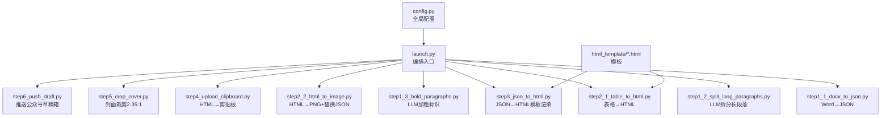
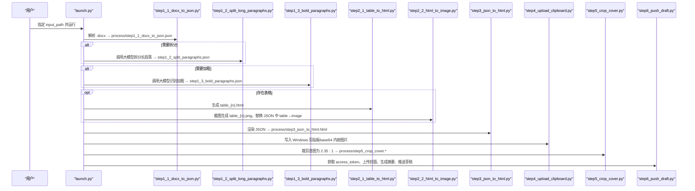
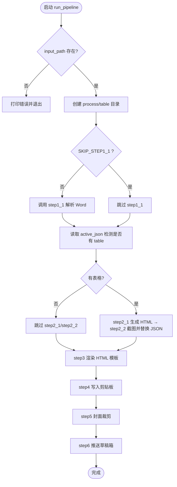

# 快速开始

<cite>
**本文引用的文件**   
- [launch.py](file://launch.py)
- [config.py](file://config.py)
- [step1_1_docx_to_json.py](file://step1_1_docx_to_json.py)
- [step1_2_split_long_paragraphs.py](file://step1_2_split_long_paragraphs.py)
- [step1_3_bold_paragraphs.py](file://step1_3_bold_paragraphs.py)
- [step2_1_table_to_html.py](file://step2_1_table_to_html.py)
- [step2_2_html_to_image.py](file://step2_2_html_to_image.py)
- [step3_json_to_html.py](file://step3_json_to_html.py)
- [step4_upload_clipboard.py](file://step4_upload_clipboard.py)
- [step5_crop_cover.py](file://step5_crop_cover.py)
- [step6_push_draft.py](file://step6_push_draft.py)
- [caicai_html_1_green_classical.html](file://html_template/caicai_html_1_green_classical.html)
- [caicai_html_1_green_table.html](file://html_template/caicai_html_1_green_table.html)
</cite>

## 目录
1. [简介](#简介)
2. [项目结构](#项目结构)
3. [核心组件](#核心组件)
4. [架构总览](#架构总览)
5. [详细组件分析](#详细组件分析)
6. [依赖与安装](#依赖与安装)
7. [配置设置](#配置设置)
8. [首次运行示例](#首次运行示例)
9. [常见问题与故障排除](#常见问题与故障排除)
10. [结论](#结论)

## 简介
本指南面向新用户，帮助你在最短时间内完成环境准备、安装依赖、配置参数并成功运行 content_board 的完整处理流水线。你将学会：
- 如何准备 Word 文档输入文件
- 如何修改 launch.py 中的配置参数
- 如何执行从 Word 到剪贴板再到公众号草稿箱的一键流水线
- 常见问题的解决方案与排错方法

## 项目结构
content_board 采用“按步骤拆分”的模块化设计，由一个编排脚本统一调度各步骤。关键目录与文件说明如下：
- 根目录
  - launch.py：一键编排入口，串联 step1~step6
  - config.py：全局配置（大模型 API、微信公众号等）
  - html_template/：HTML 模板（正文模板、表格模板）
  - content_instance/：文章实例目录，每个子目录包含一次处理的输入与中间产物
- 步骤脚本
  - step1_1_docx_to_json.py：Word → JSON（段落/表格/图片）
  - step1_2_split_long_paragraphs.py：LLM 拆分过长段落
  - step1_3_bold_paragraphs.py：LLM 添加总结性加粗标识
  - step2_1_table_to_html.py：JSON 中表格 → HTML 文件
  - step2_2_html_to_image.py：表格 HTML → PNG 截图 + JSON 替换 table→image
  - step3_json_to_html.py：JSON → 渲染到 HTML 模板
  - step4_upload_clipboard.py：HTML → Windows 剪贴板（图片 base64 内嵌）
  - step5_crop_cover.py：封面图片裁剪为 2.35:1
  - step6_push_draft.py：推送到微信公众号草稿箱

图表来源
- [launch.py:42-193](file://launch.py#L42-L193)
- [config.py:1-39](file://config.py#L1-L39)
- [step3_json_to_html.py:121-143](file://step3_json_to_html.py#L121-L143)
- [step2_1_table_to_html.py:74-118](file://step2_1_table_to_html.py#L74-L118)

章节来源
- [launch.py:1-201](file://launch.py#L1-L201)
- [config.py:1-39](file://config.py#L1-L39)

## 核心组件
- 编排器（launch.py）
  - 负责路径派生、步骤开关控制、顺序调用、统计输出
  - 自动检测是否存在表格元素，决定是否跳过表格相关步骤
- 数据模型（JSON）
  - elements 列表包含 paragraph/table/image 三类元素
  - paragraph 支持 heading_level 和 runs（含 bold 标记）
  - table 包含行列数与单元格文本/加粗信息
- 模板系统
  - 正文模板：caicai_html_1_green_classical.html（占位符 {{BODY_PLACEHOLDER}}）
  - 表格模板：caicai_html_1_green_table.html（占位符 {{TABLE_PLACEHOLDER}}）
- 外部服务
  - 大模型 API（通过 config.py 的 API_URL/HEADERS 配置）
  - 微信公众号 API（access_token、素材上传、草稿箱新增）

章节来源
- [step1_1_docx_to_json.py:145-226](file://step1_1_docx_to_json.py#L145-L226)
- [step3_json_to_html.py:84-143](file://step3_json_to_html.py#L84-L143)
- [step2_1_table_to_html.py:39-118](file://step2_1_table_to_html.py#L39-L118)
- [config.py:1-39](file://config.py#L1-L39)

## 架构总览
下图展示了从 Word 到公众号草稿箱的端到端流程，以及关键中间产物与模板使用点。

图表来源
- [launch.py:42-193](file://launch.py#L42-L193)
- [step1_1_docx_to_json.py:190-226](file://step1_1_docx_to_json.py#L190-L226)
- [step1_2_split_long_paragraphs.py:198-301](file://step1_2_split_long_paragraphs.py#L198-L301)
- [step1_3_bold_paragraphs.py:207-330](file://step1_3_bold_paragraphs.py#L207-L330)
- [step2_1_table_to_html.py:74-118](file://step2_1_table_to_html.py#L74-L118)
- [step2_2_html_to_image.py:120-211](file://step2_2_html_to_image.py#L120-L211)
- [step3_json_to_html.py:121-143](file://step3_json_to_html.py#L121-L143)
- [step4_upload_clipboard.py:436-476](file://step4_upload_clipboard.py#L436-L476)
- [step5_crop_cover.py:174-196](file://step5_crop_cover.py#L174-L196)
- [step6_push_draft.py:276-397](file://step6_push_draft.py#L276-L397)

## 详细组件分析

### 编排器（launch.py）
- 功能要点
  - 根据 input_path 派生 process 与 table 目录
  - 提供 SKIP_STEP* 开关，可按需跳过任意步骤
  - 自动检测 active_json 是否包含 table 元素，决定 step2_1/step2_2 是否执行
  - 打印每步耗时与总体耗时
- 关键路径
  - 输入：input_path（.docx）
  - 输出：process 目录下多阶段中间文件与最终 HTML

图表来源
- [launch.py:42-193](file://launch.py#L42-L193)

章节来源
- [launch.py:28-37](file://launch.py#L28-L37)
- [launch.py:42-193](file://launch.py#L42-L193)

### 步骤1：Word 解析（step1_1_docx_to_json.py）
- 功能要点
  - 遍历段落/表格/图片，构建结构化 JSON
  - 标题识别：以 # 或 ## 开头，heading_level=1/2
  - 合并相邻且 bold 状态相同的 run，减少冗余
  - 提取内联图片并保存到 process/images
- 输出
  - process/step1_1_docx_to_json.json
  - process/images/image_{n}.png

章节来源
- [step1_1_docx_to_json.py:75-184](file://step1_1_docx_to_json.py#L75-L184)
- [step1_1_docx_to_json.py:190-226](file://step1_1_docx_to_json.py#L190-L226)

### 步骤1.2：长段落拆分（step1_2_split_long_paragraphs.py）
- 功能要点
  - 基于阈值（config.SPLIT_THRESHOLD）定位过长 run
  - 调用大模型按语义拆分，返回 JSON 数组
  - 拼接一致性校验：拆分结果必须与原文完全一致
  - 非段落元素原样保留
- 输出
  - process/step1_2_split_paragraphs.json

章节来源
- [step1_2_split_long_paragraphs.py:80-141](file://step1_2_split_long_paragraphs.py#L80-L141)
- [step1_2_split_long_paragraphs.py:198-301](file://step1_2_split_long_paragraphs.py#L198-L301)

### 步骤1.3：总结性加粗（step1_3_bold_paragraphs.py）
- 功能要点
  - 按标题分段，每组正文交由大模型识别总结/判断/序列表达
  - 仅对无加粗的段落进行标记，不重复加粗
  - 精确匹配原文片段，将对应 runs 设为 bold
- 输出
  - process/step1_3_bold_paragraphs.json

章节来源
- [step1_3_bold_paragraphs.py:73-133](file://step1_3_bold_paragraphs.py#L73-L133)
- [step1_3_bold_paragraphs.py:207-330](file://step1_3_bold_paragraphs.py#L207-L330)

### 步骤2：表格处理（step2_1_table_to_html.py / step2_2_html_to_image.py）
- 功能要点
  - step2_1：读取 JSON 中的 table 元素，按绿色主题模板生成独立 HTML
  - step2_2：使用 Selenium + Chrome 截图生成 PNG，并将 JSON 中的 table 替换为 image 引用
- 输出
  - process/table/table_{n}.html
  - process/table/table_{n}.png
  - process/step2_table_to_image.json

章节来源
- [step2_1_table_to_html.py:39-118](file://step2_1_table_to_html.py#L39-L118)
- [step2_2_html_to_image.py:120-211](file://step2_2_html_to_image.py#L120-L211)

### 步骤3：HTML 渲染（step3_json_to_html.py）
- 功能要点
  - 读取 step2 JSON，将段落、标题、图片渲染为 HTML
  - 替换模板中的 {{BODY_PLACEHOLDER}}，输出完整页面
- 输出
  - process/step3_json_to_html.html

章节来源
- [step3_json_to_html.py:84-143](file://step3_json_to_html.py#L84-L143)

### 步骤4：写入剪贴板（step4_upload_clipboard.py）
- 功能要点
  - 解析 HTML，展开 class 样式为内联样式
  - 本地图片转 base64 data URI，确保粘贴兼容
  - 构建 Windows 剪贴板多格式数据并写入
- 输出
  - Windows 剪贴板（HTML Format + 纯文本 + 图片 base64）
  - 同时保存内联样式 HTML 供后续复用

章节来源
- [step4_upload_clipboard.py:115-223](file://step4_upload_clipboard.py#L115-L223)
- [step4_upload_clipboard.py:436-476](file://step4_upload_clipboard.py#L436-L476)

### 步骤5：封面裁剪（step5_crop_cover.py）
- 功能要点
  - 在文章实例文件夹中找到第一个图片文件
  - 中心裁剪为目标宽高比 2.35:1，并自动压缩至微信限制以内
- 输出
  - process/step5_crop_cover.*

章节来源
- [step5_crop_cover.py:133-171](file://step5_crop_cover.py#L133-L171)
- [step5_crop_cover.py:174-196](file://step5_crop_cover.py#L174-L196)

### 步骤6：推送草稿箱（step6_push_draft.py）
- 功能要点
  - 获取 access_token
  - 上传封面图（永久素材），缓存 media_id
  - 从 JSON 提取标题与正文，调用大模型生成摘要金句
  - 调用草稿箱 API 新增草稿
- 输出
  - 公众号草稿箱条目（含标题、作者、摘要、封面等）

章节来源
- [step6_push_draft.py:42-79](file://step6_push_draft.py#L42-L79)
- [step6_push_draft.py:105-127](file://step6_push_draft.py#L105-L127)
- [step6_push_draft.py:276-397](file://step6_push_draft.py#L276-L397)

## 依赖与安装
- Python 版本
  - 建议使用 Python 3.9+（Windows 平台）
- 必需库
  - python-docx（用于解析 .docx）
  - requests（HTTP 请求）
  - selenium（Chrome 截图）
  - opencv-python（图像裁剪与压缩）
  - numpy（图像处理）
- 系统依赖
  - Google Chrome 浏览器（Selenium 截图需要）
  - chromedriver（通常随 selenium 管理，若失败请手动安装并与 Chrome 版本匹配）

安装命令示例（在项目根目录执行）：
- pip install python-docx requests selenium opencv-python numpy

章节来源
- [step2_2_html_to_image.py:16-18](file://step2_2_html_to_image.py#L16-L18)
- [step5_crop_cover.py:15-16](file://step5_crop_cover.py#L15-L16)

## 配置设置
- 大模型 API（config.py）
  - API_URL：大模型接口地址
  - HEADERS：认证头（client_id、client_secret、api-key 等）
  - MAX_RETRIES：最大重试次数
  - MAX_TOKENS：最大 token 数
  - SPLIT_THRESHOLD：段落拆分阈值（字符数）
- 微信公众号（config.py）
  - WX_APP_ID、WX_APP_SECRET：应用凭证
  - WX_API_BASE：API 基础地址
  - WX_AUTHOR：默认作者名
  - WX_CONTENT_SOURCE_URL：创作来源链接
  - WX_NEED_OPEN_COMMENT、WX_ONLY_FANS_COMMENT：评论开关

注意：
- 首次使用前请在 config.py 中填写你的 WX_APP_ID 与 WX_APP_SECRET，否则 step6 会直接报错退出。
- 如需调整拆分策略或加粗频率，可修改 SPLIT_THRESHOLD 及相关提示词逻辑。

章节来源
- [config.py:1-39](file://config.py#L1-L39)
- [step6_push_draft.py:285-287](file://step6_push_draft.py#L285-L287)

## 首次运行示例
- 准备输入文件
  - 在 content_instance 下新建一个文章实例目录（例如 content_YYYYMMDD_N）
  - 将 .docx 文件放入该目录
- 修改 launch.py
  - 打开 launch.py，找到 if __name__ == '__main__' 块
  - 将 input_path 修改为你的 .docx 文件路径（相对或绝对路径均可）
  - 根据需要设置 SKIP_STEP* 开关（默认全部启用）
- 执行流水线
  - 在项目根目录运行：python launch.py
- 预期输出
  - 控制台逐步打印每一步的执行状态与耗时
  - 在文章实例目录下的 process 文件夹中生成中间文件与最终 HTML
  - 若未跳过 step4，Windows 剪贴板将被写入富文本（可直接粘贴到编辑器）
  - 若未跳过 step5，process 中将生成 step5_crop_cover.* 封面图
  - 若未跳过 step6，公众号草稿箱中将新增一条草稿

命令行示例：
- python launch.py

章节来源
- [launch.py:196-201](file://launch.py#L196-L201)
- [launch.py:42-193](file://launch.py#L42-L193)

## 常见问题与故障排除
- 无法打开剪贴板
  - 现象：step4 报 Cannot open clipboard after 5 attempts
  - 排查：确保当前进程具有剪贴板访问权限；关闭占用剪贴板的程序后重试
- Chrome 截图超时或失败
  - 现象：step2_2 报 Chrome 截图超时/失败
  - 排查：确认已安装 Chrome 且版本与 chromedriver 匹配；检查网络与系统资源；必要时降低并发或重启系统
- 大模型调用失败
  - 现象：step1_2/step1_3/step6 报请求失败
  - 排查：检查 config.py 的 API_URL 与 HEADERS 是否正确；确认网络可达；适当增大 MAX_RETRIES
- 微信公众号推送失败
  - 现象：step6 报获取 access_token 失败或上传封面图失败
  - 排查：确认 WX_APP_ID 与 WX_APP_SECRET 正确；检查网络；查看返回的 data 字段定位具体错误
- 未找到封面图
  - 现象：step6 报未找到封面图（step5_crop_cover.*）
  - 排查：先运行 step5，确保 process 中存在 step5_crop_cover.* 文件
- 中文路径或特殊字符导致异常
  - 现象：某些步骤在处理中文/emoji 路径时报错
  - 排查：尽量使用英文路径；如必须使用中文路径，确保终端编码设置为 UTF-8

章节来源
- [step4_upload_clipboard.py:371-384](file://step4_upload_clipboard.py#L371-L384)
- [step2_2_html_to_image.py:90-94](file://step2_2_html_to_image.py#L90-L94)
- [step6_push_draft.py:42-56](file://step6_push_draft.py#L42-L56)
- [step6_push_draft.py:318-327](file://step6_push_draft.py#L318-L327)

## 结论
通过以上步骤，你已完成 content_board 的环境准备、配置与首次运行。建议初次运行时保持所有步骤开启，以便观察完整流水线效果；后续可根据需要调整 SKIP_STEP* 开关以提升效率。如遇问题，请参考常见问题与故障排除部分定位原因。