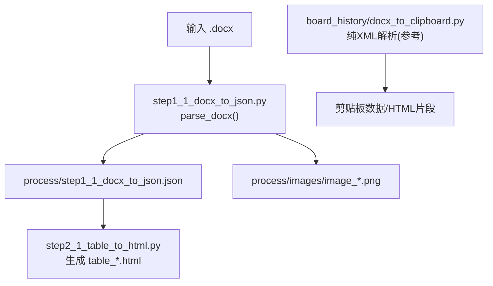
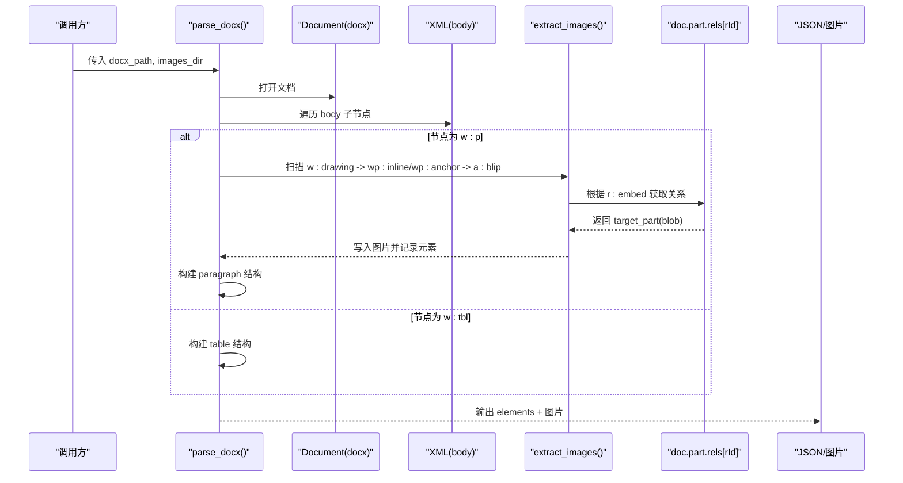
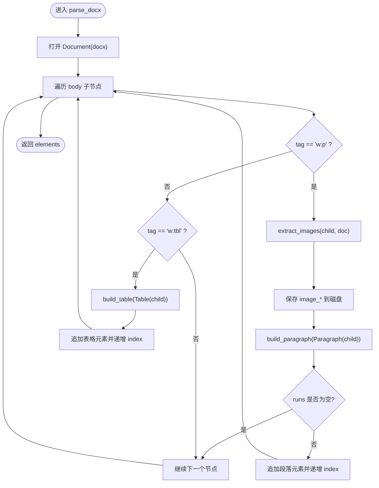
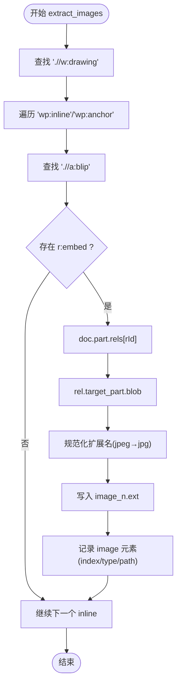
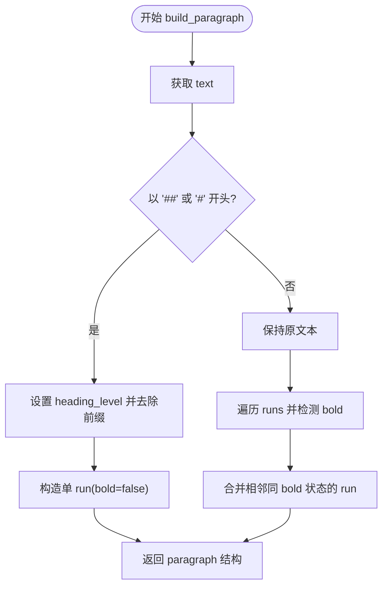
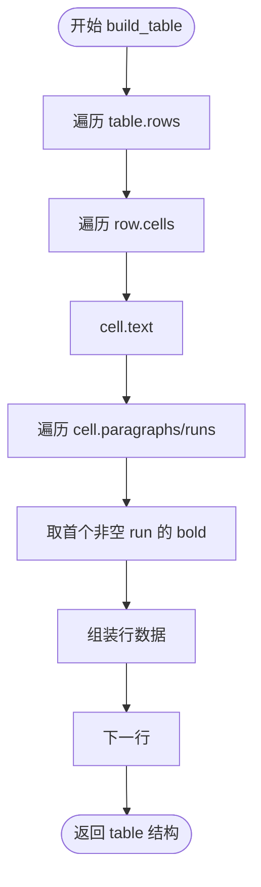
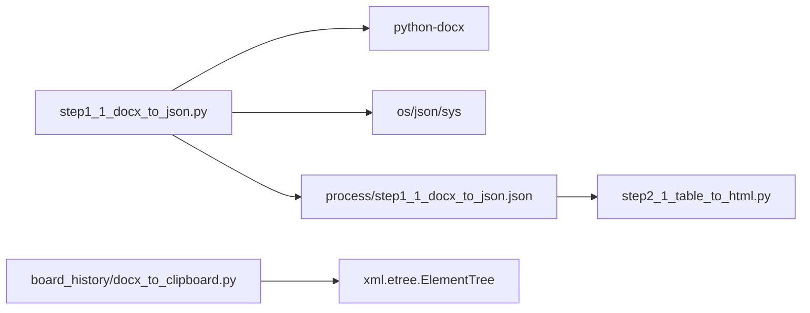

# Word 文档解析核心

<cite>
**本文引用的文件**
- [step1_1_docx_to_json.py](file://step1_1_docx_to_json.py)
- [board_history/docx_to_clipboard.py](file://board_history/docx_to_clipboard.py)
- [step2_1_table_to_html.py](file://step2_1_table_to_html.py)
- [config.py](file://config.py)
- [content_instance/content_20260702_1/process/step1_1_docx_to_json.json](file://content_instance/content_20260702_1/process/step1_1_docx_to_json.json)
</cite>

## 目录
1. [简介](#简介)
2. [项目结构](#项目结构)
3. [核心组件](#核心组件)
4. [架构总览](#架构总览)
5. [详细组件分析](#详细组件分析)
6. [依赖关系分析](#依赖关系分析)
7. [性能与内存管理](#性能与内存管理)
8. [故障排查指南](#故障排查指南)
9. [结论](#结论)
10. [附录：示例与最佳实践](#附录示例与最佳实践)

## 简介
本技术文档聚焦于 Word 文档（.docx）解析的核心能力，围绕以下目标展开：
- 深入解释 docx 的 XML 结构分析原理，包括 w:p（段落）、w:tbl（表格）、w:drawing（图片）等关键标签的识别与处理逻辑。
- 详细描述 parse_docx 函数的实现机制，包括元素遍历算法、索引管理与错误处理策略。
- 说明与 python-docx 库的深度集成方式，包括 Document 对象使用、XML 命名空间处理与关系映射。
- 提供具体代码示例路径，展示如何解析不同类型的文档元素。
- 给出性能优化建议与内存管理最佳实践。

## 项目结构
仓库采用“按步骤流水线”组织，解析核心位于 step1_1_docx_to_json.py；同时 board_history/docx_to_clipboard.py 提供了基于纯 XML 的另一种解析思路，便于对比理解。

图表来源
- [step1_1_docx_to_json.py:145-184](file://step1_1_docx_to_json.py#L145-L184)
- [step2_1_table_to_html.py:74-118](file://step2_1_table_to_html.py#L74-L118)
- [board_history/docx_to_clipboard.py:33-116](file://board_history/docx_to_clipboard.py#L33-L116)

章节来源
- [step1_1_docx_to_json.py:1-233](file://step1_1_docx_to_json.py#L1-L233)
- [board_history/docx_to_clipboard.py:1-478](file://board_history/docx_to_clipboard.py#L1-L478)
- [step2_1_table_to_html.py:1-125](file://step2_1_table_to_html.py#L1-L125)

## 核心组件
- 解析入口与主流程
  - parse_docx(docx_path, images_dir)：按文档顺序遍历 body 子节点，识别 w:p、w:tbl，并提取 w:drawing 内嵌图片。
  - build_paragraph(paragraph)：将 Paragraph 转换为结构化 dict，支持标题前缀识别与 runs 合并。
  - build_table(table)：将 Table 转换为结构化 dict，包含行列统计与单元格文本及加粗标记。
  - extract_images(element, doc, image_counter)：从 w:drawing 中定位 wp:inline/wp:anchor → a:blip → r:embed，通过关系映射读取图片二进制。
- 辅助工具
  - is_run_bold(run)：判断 run 是否加粗，兼容样式继承与属性缺失场景。
- 输出产物
  - JSON：elements 列表，每个元素含 type、index、以及类型相关字段。
  - 图片：process/images/image_{n}.png。

章节来源
- [step1_1_docx_to_json.py:34-69](file://step1_1_docx_to_json.py#L34-L69)
- [step1_1_docx_to_json.py:75-139](file://step1_1_docx_to_json.py#L75-L139)
- [step1_1_docx_to_json.py:145-184](file://step1_1_docx_to_json.py#L145-L184)

## 架构总览
下图展示了从 .docx 到 JSON 和 HTML 的整体数据流，以及两种解析路径（python-docx 与纯 XML）。

图表来源
- [step1_1_docx_to_json.py:145-184](file://step1_1_docx_to_json.py#L145-L184)
- [step1_1_docx_to_json.py:47-69](file://step1_1_docx_to_json.py#L47-L69)

## 详细组件分析

### 1) parse_docx 函数：遍历算法、索引与错误处理
- 遍历算法
  - 直接访问 doc.element.body 的子节点，依据 tag 区分 w:p 与 w:tbl。
  - 对 w:p：先提取内嵌图片，再构建段落；空段落过滤。
  - 对 w:tbl：直接构建表格结构。
- 索引管理
  - 使用 index 自增，保证元素在最终 JSON 中的顺序稳定且可追踪。
- 错误处理
  - 图片提取时捕获 KeyError/AttributeError，避免关系缺失或目标部分不可用导致崩溃。
  - 段落为空时跳过，不污染结果序列。

图表来源
- [step1_1_docx_to_json.py:145-184](file://step1_1_docx_to_json.py#L145-L184)

章节来源
- [step1_1_docx_to_json.py:145-184](file://step1_1_docx_to_json.py#L145-L184)

### 2) 图片解析：w:drawing → wp:inline/wp:anchor → a:blip → r:embed
- 识别路径
  - 在段落元素中查找所有 w:drawing。
  - 进一步查找 wp:inline 或 wp:anchor。
  - 在 inline/anchor 下查找 a:blip，读取 r:embed 关系 ID。
  - 通过 doc.part.rels[rId] 获取 target_part，读取 blob 并写出文件。
- 扩展名处理
  - 从 content_type 推断扩展名，并将 jpeg 标准化为 jpg。
- 健壮性
  - 使用 try/except 捕获 KeyError/AttributeError，忽略损坏或缺失的关系。

图表来源
- [step1_1_docx_to_json.py:47-69](file://step1_1_docx_to_json.py#L47-L69)

章节来源
- [step1_1_docx_to_json.py:47-69](file://step1_1_docx_to_json.py#L47-L69)

### 3) 段落解析：w:p 与 runs 合并、标题识别
- 标题识别
  - 若段落文本以 ## 开头，视为 heading_level=2；以 # 开头，视为 heading_level=1。
  - 标题段落统一 bold=false，去除前缀后作为单一 run。
- 正文段落
  - 遍历 paragraph.runs，检测 is_run_bold(run)。
  - 合并相邻且 bold 状态相同的 run，减少冗余。
- 空段落过滤
  - 若 runs 为空或全部无文本，则跳过该段落。

图表来源
- [step1_1_docx_to_json.py:75-113](file://step1_1_docx_to_json.py#L75-L113)

章节来源
- [step1_1_docx_to_json.py:75-113](file://step1_1_docx_to_json.py#L75-L113)

### 4) 表格解析：w:tbl 结构与单元格加粗
- 数据结构
  - row_count、col_count、data 二维数组，每个单元格包含 text 与 bold。
- 单元格加粗判定
  - 遍历单元格段落与 runs，找到首个非空 run 的加粗状态作为单元格 bold。
- 输出
  - 供后续 step2_1_table_to_html.py 渲染为独立 HTML 表格。

图表来源
- [step1_1_docx_to_json.py:116-139](file://step1_1_docx_to_json.py#L116-L139)

章节来源
- [step1_1_docx_to_json.py:116-139](file://step1_1_docx_to_json.py#L116-L139)

### 5) 与 python-docx 的深度集成：命名空间与关系映射
- 命名空间
  - 使用 qn('w:p')、qn('w:tbl')、qn('w:drawing') 等确保跨平台一致匹配。
- Document 对象
  - 通过 Document(docx_path) 打开文档，doc.element.body 提供底层 XML 节点迭代。
  - 使用 Paragraph(child, doc)、Table(child, doc) 包装 XML 节点为高层 API。
- 关系映射
  - 通过 blip.r:embed 获取关系 ID，再从 doc.part.rels[rId] 定位 target_part，读取 blob。

章节来源
- [step1_1_docx_to_json.py:25-27](file://step1_1_docx_to_json.py#L25-L27)
- [step1_1_docx_to_json.py:145-184](file://step1_1_docx_to_json.py#L145-L184)
- [step1_1_docx_to_json.py:47-69](file://step1_1_docx_to_json.py#L47-L69)

### 6) 纯 XML 解析对照：board_history/docx_to_clipboard.py
- 特点
  - 直接使用 zipfile 解压 docx，ET.parse 解析 word/document.xml。
  - 显式定义 W_NS 与 NS 映射，findall('.//w:p', NS) 遍历段落。
  - 逐段提取 w:rPr/w:b/w:sz/w:color 等属性，保留 size/color/break 信息。
- 适用场景
  - 需要更细粒度控制 XML 解析、避免引入 python-docx 开销的场景。

章节来源
- [board_history/docx_to_clipboard.py:26-27](file://board_history/docx_to_clipboard.py#L26-L27)
- [board_history/docx_to_clipboard.py:33-116](file://board_history/docx_to_clipboard.py#L33-L116)

## 依赖关系分析
- 外部库
  - python-docx：用于高层 API 与关系解析。
  - xml.etree.ElementTree：在 board_history 脚本中用于轻量级 XML 解析。
- 内部模块
  - step2_1_table_to_html.py：消费 step1 输出的 JSON，生成表格 HTML。
  - config.py：全局配置（与解析核心解耦，主要用于后续推送环节）。

图表来源
- [step1_1_docx_to_json.py:22-28](file://step1_1_docx_to_json.py#L22-L28)
- [step2_1_table_to_html.py:18-21](file://step2_1_table_to_html.py#L18-L21)
- [board_history/docx_to_clipboard.py:14-21](file://board_history/docx_to_clipboard.py#L14-L21)

章节来源
- [step1_1_docx_to_json.py:22-28](file://step1_1_docx_to_json.py#L22-L28)
- [step2_1_table_to_html.py:18-21](file://step2_1_table_to_html.py#L18-L21)
- [board_history/docx_to_clipboard.py:14-21](file://board_history/docx_to_clipboard.py#L14-L21)

## 性能与内存管理
- 解析路径选择
  - 对于大型文档，python-docx 会加载整个文档树，内存占用较高。若仅需段落文本与基础格式，可考虑 board_history 的纯 XML 方案，按需解析，降低内存峰值。
- 图片处理
  - 图片以二进制形式写入磁盘，避免在内存中长期持有大对象。
  - 建议在批量处理时限制并发写入，避免 I/O 瓶颈。
- 运行时间
  - 遍历 body 子节点为 O(N)，N 为顶层元素数量；表格与段落内部遍历为 O(R+C+Runs)。
  - 合并相邻 run 可减少后续渲染复杂度。
- 建议
  - 对超大文档可采用分块解析（如仅处理指定页码范围），或在纯 XML 模式下增量解析。
  - 关闭不必要的调试日志，减少 I/O 开销。
  - 合理设置 images_dir 所在磁盘，优先使用 SSD 提升写入速度。

[本节为通用指导，无需特定文件引用]

## 故障排查指南
- 常见错误
  - 关系缺失：r:embed 指向的关系不存在，导致 KeyError。当前实现已捕获并跳过。
  - 目标部分不可用：target_part 属性缺失，导致 AttributeError。同样被捕获并跳过。
  - 空段落：build_paragraph 返回空 runs，会被过滤，不会出现在最终 JSON。
- 诊断方法
  - 检查 process/step1_1_docx_to_json.json 的 total_elements 与各 type 计数，确认解析完整性。
  - 核对 process/images 目录下图片数量与名称是否与 JSON 中 image 元素对应。
  - 若表格未生成 HTML，检查 step2_1_table_to_html.py 的输入 JSON 路径是否正确。

章节来源
- [step1_1_docx_to_json.py:47-69](file://step1_1_docx_to_json.py#L47-L69)
- [step1_1_docx_to_json.py:145-184](file://step1_1_docx_to_json.py#L145-L184)
- [step2_1_table_to_html.py:74-118](file://step2_1_table_to_html.py#L74-L118)

## 结论
本解析核心通过 python-docx 的高层 API 与 XML 命名空间精准匹配，实现了段落、表格与图片的稳定提取与结构化输出。parse_docx 的遍历算法简洁高效，索引管理清晰，错误处理稳健。配合 step2 的表格 HTML 生成，形成完整的 docx → JSON → HTML 流水线。对于大规模文档，可结合纯 XML 解析方案进行性能优化与内存控制。

[本节为总结性内容，无需特定文件引用]

## 附录：示例与最佳实践

- 示例：解析段落与标题
  - 参考路径：[step1_1_docx_to_json.py:75-113](file://step1_1_docx_to_json.py#L75-L113)
  - 输出样例位置：[content_instance/content_20260702_1/process/step1_1_docx_to_json.json](file://content_instance/content_20260702_1/process/step1_1_docx_to_json.json)

- 示例：解析表格
  - 参考路径：[step1_1_docx_to_json.py:116-139](file://step1_1_docx_to_json.py#L116-L139)
  - 生成 HTML：[step2_1_table_to_html.py:39-68](file://step2_1_table_to_html.py#L39-L68)

- 示例：解析图片
  - 参考路径：[step1_1_docx_to_json.py:47-69](file://step1_1_docx_to_json.py#L47-L69)

- 最佳实践
  - 使用 qn() 统一命名空间，避免跨平台差异。
  - 对关系映射进行异常捕获，提高鲁棒性。
  - 合并相邻相同样式的 run，减少冗余。
  - 对空段落进行过滤，保持输出整洁。
  - 图片写入磁盘而非长期驻留内存，降低峰值占用。

章节来源
- [step1_1_docx_to_json.py:75-113](file://step1_1_docx_to_json.py#L75-L113)
- [step1_1_docx_to_json.py:116-139](file://step1_1_docx_to_json.py#L116-L139)
- [step1_1_docx_to_json.py:47-69](file://step1_1_docx_to_json.py#L47-L69)
- [step2_1_table_to_html.py:39-68](file://step2_1_table_to_html.py#L39-L68)
- [content_instance/content_20260702_1/process/step1_1_docx_to_json.json](file://content_instance/content_20260702_1/process/step1_1_docx_to_json.json)