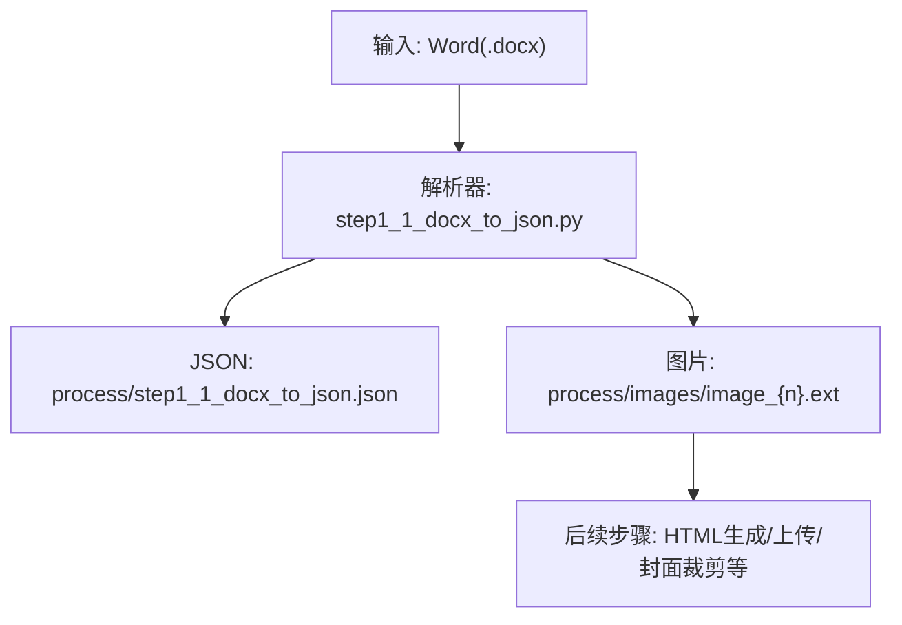
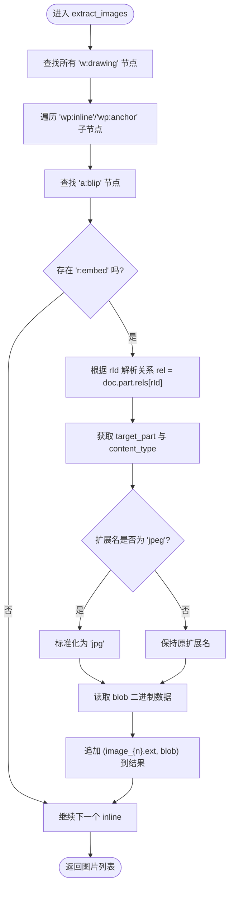
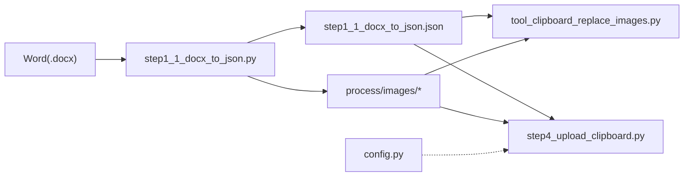

# 图片提取系统

<cite>
**本文引用的文件**
- [step1_1_docx_to_json.py](file://step1_1_docx_to_json.py)
- [tool_clipboard_replace_images.py](file://tool/tool_clipboard_replace_images.py)
- [step4_upload_clipboard.py](file://step4_upload_clipboard.py)
- [step5_crop_cover.py](file://step5_crop_cover.py)
- [config.py](file://config.py)
</cite>

## 目录
1. [简介](#简介)
2. [项目结构](#项目结构)
3. [核心组件](#核心组件)
4. [架构总览](#架构总览)
5. [详细组件分析](#详细组件分析)
6. [依赖关系分析](#依赖关系分析)
7. [性能考量](#性能考量)
8. [故障排查指南](#故障排查指南)
9. [结论](#结论)
10. [附录](#附录)

## 简介
本技术文档聚焦于“图片提取系统”的实现机制，围绕 extract_images 函数展开，深入解释其 XML 元素遍历、drawing 标签识别与内联图片定位算法；详述图片关系映射处理（rId 引用解析、rel.target_part 访问与图片数据提取）；说明图片格式检测与扩展名转换逻辑（含 jpeg 到 jpg 的标准化）；提供具体图片提取示例与不同位置图片的处理流程；解释图片保存机制与文件命名策略；并总结错误处理与资源清理的最佳实践。

## 项目结构
本项目采用按步骤划分的流水线式结构，图片提取位于第一步：从 .docx 中解析段落、表格与图片，输出结构化 JSON 与图片文件。关键路径如下：
- 输入：Word 文档（.docx）
- 输出：process/step1_1_docx_to_json.json 与 process/images/image_{n}.ext



图表来源
- [step1_1_docx_to_json.py:145-184](file://step1_1_docx_to_json.py#L145-L184)

章节来源
- [step1_1_docx_to_json.py:1-20](file://step1_1_docx_to_json.py#L1-L20)
- [step1_1_docx_to_json.py:145-184](file://step1_1_docx_to_json.py#L145-L184)

## 核心组件
- 图片提取函数：extract_images(element, doc, image_counter)
- 文档解析主流程：parse_docx(docx_path, images_dir)
- 图片保存与命名：在 parse_docx 中写入 process/images 目录，命名规则 image_{n}.ext
- 图片格式检测与扩展名标准化：基于 content_type 后缀，将 jpeg 统一为 jpg
- 剪贴板与上传阶段对图片的二次处理：base64 嵌入与 MIME 类型修正

章节来源
- [step1_1_docx_to_json.py:47-69](file://step1_1_docx_to_json.py#L47-L69)
- [step1_1_docx_to_json.py:145-184](file://step1_1_docx_to_json.py#L145-L184)
- [step1_1_docx_to_json.py:190-226](file://step1_1_docx_to_json.py#L190-L226)
- [tool_clipboard_replace_images.py:289-336](file://tool/tool_clipboard_replace_images.py#L289-L336)
- [step4_upload_clipboard.py:214-222](file://step4_upload_clipboard.py#L214-L222)

## 架构总览
下图展示了从 Word 文档到最终可嵌入剪贴板的完整图片处理链路，包括提取、保存、HTML 替换与 base64 嵌入。

```mermaid
sequenceDiagram
participant User as "用户"
participant Step1 as "step1_1_docx_to_json.py"
participant FS as "文件系统(process/images)"
participant Tool as "tool_clipboard_replace_images.py"
participant Upload as "step4_upload_clipboard.py"
User->>Step1 : 运行解析
Step1->>Step1 : extract_images() 遍历XML
Step1->>FS : 写入 image_{n}.ext
Step1-->>User : 输出 JSON(包含图片引用)
User->>Tool : 替换HTML中的为本地base64
Tool->>FS : 读取图片并编码base64
Tool-->>User : 返回替换后的HTML片段
User->>Upload : 构建剪贴板HTML Format
Upload->>Upload : 将src替换为data : image/{mime};base64,...
Upload-->>User : 完成剪贴板数据
```

图表来源
- [step1_1_docx_to_json.py:47-69](file://step1_1_docx_to_json.py#L47-L69)
- [step1_1_docx_to_json.py:145-184](file://step1_1_docx_to_json.py#L145-L184)
- [tool_clipboard_replace_images.py:289-336](file://tool/tool_clipboard_replace_images.py#L289-L336)
- [step4_upload_clipboard.py:214-222](file://step4_upload_clipboard.py#L214-L222)

## 详细组件分析

### extract_images 实现机制
- XML 元素遍历
  - 使用 XPath 风格查找所有 w:drawing 节点，再在其下查找 wp:inline 与 wp:anchor 两种内联布局容器。
  - 在容器内进一步定位 a:blip 节点，该节点通过 r:embed 属性携带 rId 引用。
- 图片关系映射处理
  - 通过 doc.part.rels[rId] 获取关系对象 rel，再访问 rel.target_part 得到图片部件。
  - 从 target_part.content_type 中提取扩展名（content_type.split('/')[-1]）。
  - 若扩展名为 jpeg，则标准化为 jpg，确保浏览器与平台兼容性。
  - 读取 target_part.blob 作为图片二进制数据，并以 image_{n}.ext 命名追加到结果列表。
- 异常与容错
  - 捕获 KeyError 与 AttributeError，忽略无法解析的关系或部件，避免中断整体解析。



图表来源
- [step1_1_docx_to_json.py:47-69](file://step1_1_docx_to_json.py#L47-L69)

章节来源
- [step1_1_docx_to_json.py:47-69](file://step1_1_docx_to_json.py#L47-L69)

### 图片关系映射与 rId 解析
- rId 来源：a:blip 节点的 r:embed 属性值。
- 关系解析：doc.part.rels[rId] 返回关系对象，其中 rel.target_part 指向实际图片部件。
- 内容类型与扩展名：target_part.content_type 通常为 image/jpeg、image/png 等，取最后一段作为扩展名。
- 数据提取：target_part.blob 为原始字节流，直接用于写入文件或 base64 编码。

章节来源
- [step1_1_docx_to_json.py:56-66](file://step1_1_docx_to_json.py#L56-L66)

### 图片格式检测与扩展名转换
- 检测方式：基于 content_type 的后缀段进行判断。
- 标准化策略：当检测到 jpeg 时转换为 jpg，提升跨平台一致性。
- 影响范围：该转换仅影响文件名扩展名，不改变实际二进制内容。

章节来源
- [step1_1_docx_to_json.py:62-64](file://step1_1_docx_to_json.py#L62-L64)

### 图片保存机制与文件命名策略
- 保存位置：process/images 目录，由 parse_docx 创建。
- 命名规则：image_{n}.ext，n 为全局递增计数器，ext 为标准化后的扩展名。
- 写入时机：在遍历段落时，遇到内联图片即立即写入磁盘，随后在 JSON 中记录相对路径。

章节来源
- [step1_1_docx_to_json.py:145-184](file://step1_1_docx_to_json.py#L145-L184)
- [step1_1_docx_to_json.py:190-226](file://step1_1_docx_to_json.py#L190-L226)

### 不同位置图片的处理流程示例
- 段落内联图片
  - 解析顺序：先提取段落内的图片，再生成段落元素。
  - 行为：每个图片生成独立条目，插入到 elements 列表中，并写入磁盘。
- 表格内图片
  - 表格单元格可能包含段落，从而间接包含图片；由于 parse_docx 按 body 子元素顺序遍历，表格内部图片会在对应段落被处理时提取。
- 锚定与内联混合
  - 同时支持 wp:inline 与 wp:anchor 两种布局，确保复杂排版下的图片均能被定位。

章节来源
- [step1_1_docx_to_json.py:145-184](file://step1_1_docx_to_json.py#L145-L184)

### 剪贴板与上传阶段的图片处理
- HTML 替换为 base64
  - tool_clipboard_replace_images.py 会扫描 HTML 中的 ，按顺序替换为 data:image/{mime};base64,...。
  - 若源扩展名为 jpg，则在 MIME 中转为 jpeg，以符合常见约定。
- 构建剪贴板 HTML Format
  - step4_upload_clipboard.py 在构建 Windows 剪贴板 HTML Format 时，同样执行 src → data URI 的替换，确保粘贴后图片内嵌。

章节来源
- [tool_clipboard_replace_images.py:289-336](file://tool/tool_clipboard_replace_images.py#L289-L336)
- [step4_upload_clipboard.py:214-222](file://step4_upload_clipboard.py#L214-L222)

### 封面裁剪与大小控制（相关图片处理）
- 目标比例：2.35:1，用于生成文章封面图。
- 压缩策略：JPEG 通过二分搜索 quality 控制文件大小；非 JPEG 通过逐步缩小分辨率达到上限。
- 大小限制：遵循微信公众号永久素材图片限制（约 10MB）。

章节来源
- [step5_crop_cover.py:27-34](file://step5_crop_cover.py#L27-L34)
- [step5_crop_cover.py:47-107](file://step5_crop_cover.py#L47-L107)

## 依赖关系分析
- 外部库
  - python-docx：用于解析 .docx 的 DOM 与关系映射（Document、part.rels、oxml.ns.qn）。
  - OpenCV（cv2）、NumPy：用于封面裁剪与图像压缩（step5_crop_cover.py）。
- 模块耦合
  - step1_1_docx_to_json.py 负责提取与保存，输出 JSON 供后续步骤消费。
  - tool_clipboard_replace_images.py 与 step4_upload_clipboard.py 依赖 JSON 中的图片路径，执行 HTML 替换与 base64 嵌入。
  - config.py 提供通用配置（如重试次数、令牌上限），但不直接影响图片提取逻辑。



图表来源
- [step1_1_docx_to_json.py:145-184](file://step1_1_docx_to_json.py#L145-L184)
- [tool_clipboard_replace_images.py:289-336](file://tool/tool_clipboard_replace_images.py#L289-L336)
- [step4_upload_clipboard.py:214-222](file://step4_upload_clipboard.py#L214-L222)
- [config.py:1-39](file://config.py#L1-L39)

章节来源
- [step1_1_docx_to_json.py:145-184](file://step1_1_docx_to_json.py#L145-L184)
- [tool_clipboard_replace_images.py:289-336](file://tool/tool_clipboard_replace_images.py#L289-L336)
- [step4_upload_clipboard.py:214-222](file://step4_upload_clipboard.py#L214-L222)
- [config.py:1-39](file://config.py#L1-L39)

## 性能考量
- XML 遍历复杂度
  - 使用 findall('.//') 进行深度遍历，时间复杂度近似 O(N)，N 为 drawing 节点数量。对于大型文档，建议尽量减少重复查找，或在必要时缓存中间结果。
- 关系解析开销
  - 每次 rId 解析涉及字典查找与对象访问，应保证关系完整性以避免异常分支带来的额外开销。
- I/O 写入
  - 逐张写入磁盘，适合中等规模图片集；若图片数量极大，可考虑批量写入或异步化以降低阻塞。
- 压缩与裁剪
  - 封面裁剪的二分搜索 quality 与缩放循环会带来 CPU 开销，建议在批量处理时并行化或限制最大迭代次数。

[本节为通用指导，无需特定文件来源]

## 故障排查指南
- 常见问题
  - rId 缺失或关系不存在：导致 KeyError 或 AttributeError，当前实现已捕获并跳过，但需检查文档是否损坏或图片未正确嵌入。
  - 扩展名不一致：若 content_type 异常或缺失，可能导致扩展名推断失败，建议增加默认回退策略（例如根据魔数检测）。
  - 图片数量不匹配：在 HTML 替换阶段，若 HTML 中的 img 数量与 JSON 中的图片数量不一致，将中止替换并提示错误。
- 调试建议
  - 打印 rId 与 content_type，确认关系映射是否正确。
  - 校验 process/images 目录中文件是否存在且可读。
  - 对比 JSON 中 image_path 与实际文件路径的一致性。
- 资源清理最佳实践
  - 使用 with 语句管理文件句柄，确保异常情况下也能关闭文件。
  - 在批量处理中，及时释放大对象引用，避免内存峰值过高。
  - 对临时生成的 base64 字符串，在完成替换后立即丢弃，减少内存占用。

章节来源
- [step1_1_docx_to_json.py:58-68](file://step1_1_docx_to_json.py#L58-L68)
- [tool_clipboard_replace_images.py:295-303](file://tool/tool_clipboard_replace_images.py#L295-L303)

## 结论
extract_images 函数通过精准的 XML 遍历与关系映射解析，实现了稳健的内联图片提取。结合标准化的扩展名处理与清晰的保存命名策略，系统在复杂排版场景下仍能可靠工作。后续步骤对图片的 base64 嵌入与上传处理，进一步提升了端到端的可用性。建议在大规模文档场景下引入更严格的异常诊断与性能优化措施，以提升鲁棒性与吞吐能力。

[本节为总结性内容，无需特定文件来源]

## 附录
- 术语说明
  - rId：Word 文档关系标识符，用于链接内容与其附件（如图片）。
  - blip：OpenXML 中表示位图数据的节点。
  - anchor/inline：图片在文档中的布局容器，分别表示锚定与内联。
- 参考路径
  - 图片提取核心实现：[step1_1_docx_to_json.py:47-69](file://step1_1_docx_to_json.py#L47-L69)
  - 文档解析主流程：[step1_1_docx_to_json.py:145-184](file://step1_1_docx_to_json.py#L145-L184)
  - HTML 替换为 base64：[tool_clipboard_replace_images.py:289-336](file://tool/tool_clipboard_replace_images.py#L289-L336)
  - 剪贴板 HTML Format 构建：[step4_upload_clipboard.py:214-222](file://step4_upload_clipboard.py#L214-L222)
  - 封面裁剪与压缩：[step5_crop_cover.py:47-107](file://step5_crop_cover.py#L47-L107)