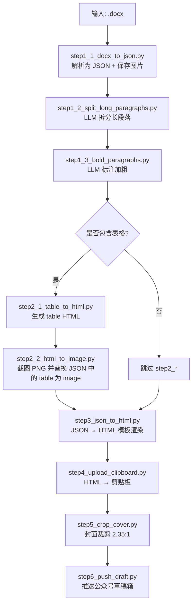
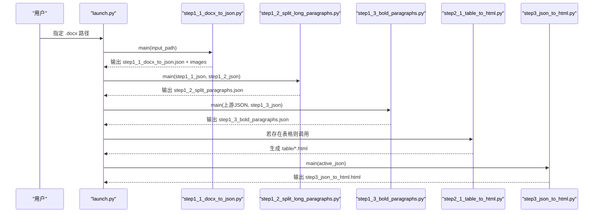
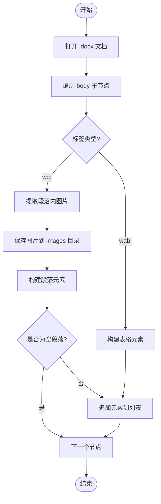
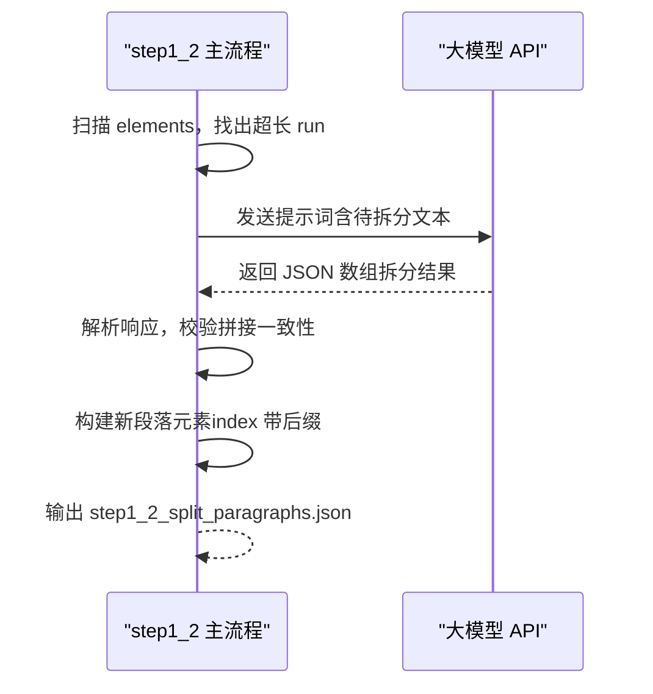
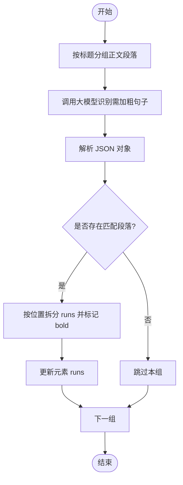
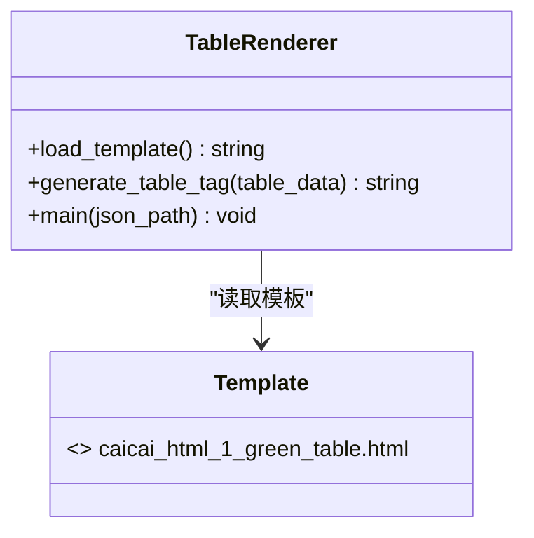
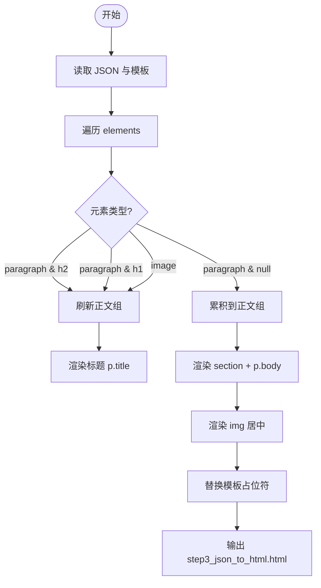
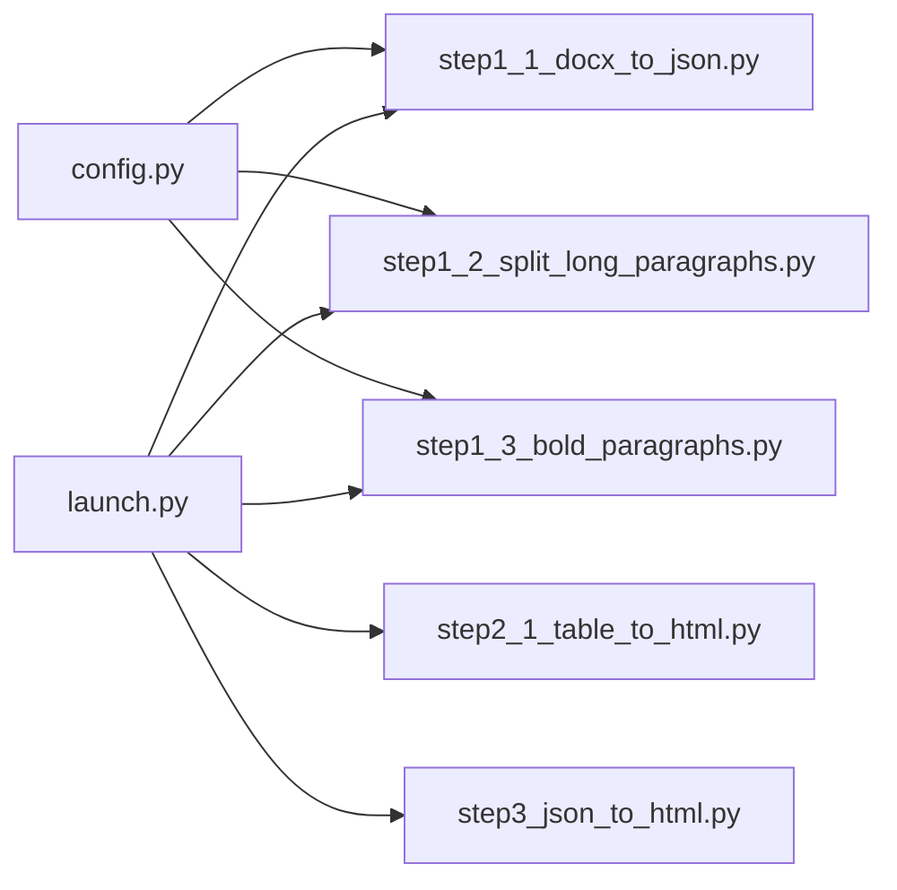

# 文档处理模块

<cite>
**本文引用的文件**   
- [step1_1_docx_to_json.py](file://step1_1_docx_to_json.py)
- [step1_2_split_long_paragraphs.py](file://step1_2_split_long_paragraphs.py)
- [step1_3_bold_paragraphs.py](file://step1_3_bold_paragraphs.py)
- [step2_1_table_to_html.py](file://step2_1_table_to_html.py)
- [step3_json_to_html.py](file://step3_json_to_html.py)
- [launch.py](file://launch.py)
- [config.py](file://config.py)
- [caicai_html_1_green_classical.html](file://html_template/caicai_html_1_green_classical.html)
- [caicai_html_1_green_table.html](file://html_template/caicai_html_1_green_table.html)
- [content_20260702_1/process/step1_1_docx_to_json.json](file://content_instance/content_20260702_1/process/step1_1_docx_to_json.json)
</cite>

## 目录
1. [简介](#简介)
2. [项目结构](#项目结构)
3. [核心组件](#核心组件)
4. [架构总览](#架构总览)
5. [详细组件分析](#详细组件分析)
6. [依赖关系分析](#依赖关系分析)
7. [性能考虑](#性能考虑)
8. [故障排查指南](#故障排查指南)
9. [结论](#结论)
10. [附录：接口与数据模型](#附录接口与数据模型)

## 简介
本模块面向 Word 文档（.docx）到微信公众号剪贴板内容的自动化流水线，覆盖解析、结构化、样式保留、表格渲染、HTML 模板化以及后续上传等步骤。重点包括：
- 基于 python-docx 的 docx XML 结构分析与元素提取算法
- 结构化数据模型设计（段落、Run、表格、图片）
- 样式保留机制（加粗检测与继承）、格式转换逻辑（JSON→HTML）
- 主要函数接口、参数与返回值说明
- 与 python-docx 库的集成方式与最佳实践
- 性能优化建议与常见问题解决方案

## 项目结构
该仓库采用“按步骤拆分”的模块化组织方式，每个处理阶段独立脚本，通过 launch.py 串联执行。关键路径如下：
- step1_1_docx_to_json.py：Word → JSON（段落/表格/图片），并保存内嵌图片
- step1_2_split_long_paragraphs.py：LLM 辅助拆分过长段落
- step1_3_bold_paragraphs.py：LLM 辅助识别总结性/判断性表达并标记加粗
- step2_1_table_to_html.py：表格 JSON → HTML（绿色主题模板）
- step3_json_to_html.py：JSON → HTML（正文模板替换）
- html_template/*：HTML 模板文件
- config.py：全局配置（API、阈值等）
- launch.py：一键流水线编排

图表来源
- [launch.py:42-193](file://launch.py#L42-L193)
- [step1_1_docx_to_json.py:145-184](file://step1_1_docx_to_json.py#L145-L184)
- [step1_2_split_long_paragraphs.py:198-301](file://step1_2_split_long_paragraphs.py#L198-L301)
- [step1_3_bold_paragraphs.py:207-330](file://step1_3_bold_paragraphs.py#L207-L330)
- [step2_1_table_to_html.py:74-118](file://step2_1_table_to_html.py#L74-L118)
- [step3_json_to_html.py:121-142](file://step3_json_to_html.py#L121-L142)

章节来源
- [launch.py:1-201](file://launch.py#L1-L201)

## 核心组件
- Word 解析器：读取 .docx，遍历 body 子节点，识别段落、表格、图片，输出统一 JSON 结构
- 段落处理器：标题识别（# / ##）、run 合并与加粗检测、空段落过滤
- 表格处理器：行/列统计、单元格文本与加粗状态提取
- 图片处理器：从 XML 中定位 drawing/inline/anchor/blip，提取 rId 并写入 images 目录
- LLM 增强：长段落语义拆分；总结性/判断性表达加粗标注
- 渲染器：表格 HTML 生成与模板替换；正文 HTML 生成与模板替换

章节来源
- [step1_1_docx_to_json.py:34-184](file://step1_1_docx_to_json.py#L34-L184)
- [step1_2_split_long_paragraphs.py:80-192](file://step1_2_split_long_paragraphs.py#L80-L192)
- [step1_3_bold_paragraphs.py:73-201](file://step1_3_bold_paragraphs.py#L73-L201)
- [step2_1_table_to_html.py:33-68](file://step2_1_table_to_html.py#L33-L68)
- [step3_json_to_html.py:38-115](file://step3_json_to_html.py#L38-L115)

## 架构总览
整体流程以 JSON 为中间表示，各步骤之间通过文件传递数据，便于调试与断点续跑。

图表来源
- [launch.py:70-155](file://launch.py#L70-L155)
- [step1_1_docx_to_json.py:190-226](file://step1_1_docx_to_json.py#L190-L226)
- [step1_2_split_long_paragraphs.py:198-301](file://step1_2_split_long_paragraphs.py#L198-L301)
- [step1_3_bold_paragraphs.py:207-330](file://step1_3_bold_paragraphs.py#L207-L330)
- [step2_1_table_to_html.py:74-118](file://step2_1_table_to_html.py#L74-L118)
- [step3_json_to_html.py:121-142](file://step3_json_to_html.py#L121-L142)

## 详细组件分析

### Word 解析与 XML 结构分析（step1_1）
- 解析入口：parse_docx(docx_path, images_dir)
  - 使用 python-docx.Document 打开 .docx
  - 直接遍历 doc.element.body 的子节点，按标签区分 w:p（段落）、w:tbl（表格）
  - 对 w:p 先提取内联图片，再构建段落元素；对 w:tbl 构建表格元素
- 图片提取：extract_images(element, doc, image_counter)
  - 在段落 XML 中查找 w:drawing，进一步匹配 wp:inline 或 wp:anchor
  - 定位 a:blip 的 r:embed 属性，通过 rels 获取目标部分，写出图片文件
- 段落构建：build_paragraph(paragraph)
  - 标题识别：优先匹配 ##，其次 #，去除前缀后设置 heading_level=2/1，runs 统一 bold=false
  - 普通段落：遍历 runs，合并相邻且 bold 一致的片段，is_run_bold(run) 支持样式继承检测
- 表格构建：build_table(table)
  - 逐行逐单元格提取 text，并取首个非空 run 的加粗状态作为单元格 bold
- 主流程：main(input_path)
  - 校验输入，创建 process/images 目录，调用 parse_docx，输出 JSON 与图片

图表来源
- [step1_1_docx_to_json.py:145-184](file://step1_1_docx_to_json.py#L145-L184)
- [step1_1_docx_to_json.py:47-69](file://step1_1_docx_to_json.py#L47-L69)
- [step1_1_docx_to_json.py:75-113](file://step1_1_docx_to_json.py#L75-L113)
- [step1_1_docx_to_json.py:116-139](file://step1_1_docx_to_json.py#L116-L139)

章节来源
- [step1_1_docx_to_json.py:34-184](file://step1_1_docx_to_json.py#L34-L184)
- [step1_1_docx_to_json.py:190-226](file://step1_1_docx_to_json.py#L190-L226)

### 长段落拆分（step1_2）
- 触发条件：单个 run.text 长度超过阈值（默认 120）
- 调用大模型：call_model(api_url, headers, max_tokens, prompt, max_retries)
  - 重试策略：指数退避，最大重试次数由配置控制
- 结果解析：parse_json_array(response_text)
  - 支持直接 JSON、代码块包裹、正则提取数组
- 一致性校验：拼接后的文本必须与原文完全一致
- 元素重建：build_split_elements(original_elem, run_idx, split_texts, original_index)
  - 将原段落拆分为多个新 paragraph，index 带 .1/.2 后缀，保持 runs 顺序与加粗状态

图表来源
- [step1_2_split_long_paragraphs.py:80-103](file://step1_2_split_long_paragraphs.py#L80-L103)
- [step1_2_split_long_paragraphs.py:106-140](file://step1_2_split_long_paragraphs.py#L106-L140)
- [step1_2_split_long_paragraphs.py:152-192](file://step1_2_split_long_paragraphs.py#L152-L192)
- [step1_2_split_long_paragraphs.py:198-301](file://step1_2_split_long_paragraphs.py#L198-L301)

章节来源
- [step1_2_split_long_paragraphs.py:198-301](file://step1_2_split_long_paragraphs.py#L198-L301)

### 加粗标识标注（step1_3）
- 分组策略：按标题分段，每组收集若干正文段落
- 调用大模型：call_model(...) 返回 JSON 对象 {index: bold_text}
- 应用加粗：apply_bold_to_paragraph(elem, bold_text)
  - 精确匹配 bold_text 在段落全文中的位置
  - 将对应区间拆分为多段 runs，并将交集部分设为 bold=true
- 去重保护：已有加粗的段落跳过

图表来源
- [step1_3_bold_paragraphs.py:73-96](file://step1_3_bold_paragraphs.py#L73-L96)
- [step1_3_bold_paragraphs.py:99-133](file://step1_3_bold_paragraphs.py#L99-L133)
- [step1_3_bold_paragraphs.py:146-201](file://step1_3_bold_paragraphs.py#L146-L201)
- [step1_3_bold_paragraphs.py:207-330](file://step1_3_bold_paragraphs.py#L207-L330)

章节来源
- [step1_3_bold_paragraphs.py:207-330](file://step1_3_bold_paragraphs.py#L207-L330)

### 表格转 HTML（step2_1）
- 模板加载：load_template() 读取 caicai_html_1_green_table.html
- 表格生成：generate_table_tag(table_data)
  - 首行作为 thead，其余行作为 tbody
  - 单元格 bold 字段映射为 class="bold"
- 输出：process/table/table_{n}.html

图表来源
- [step2_1_table_to_html.py:33-68](file://step2_1_table_to_html.py#L33-L68)
- [caicai_html_1_green_table.html:59-62](file://html_template/caicai_html_1_green_table.html#L59-L62)

章节来源
- [step2_1_table_to_html.py:74-118](file://step2_1_table_to_html.py#L74-L118)

### JSON 到 HTML 渲染（step3）
- 渲染规则：
  - heading_level=1：跳过不渲染
  - heading_level=2：渲染为 

  - 连续正文段落：包裹在 <section style="..."> 中，每段 

  - bold run：渲染为 
  - image：居中 
- 模板替换：将 {{BODY_PLACEHOLDER}} 替换为生成的正文 HTML

图表来源
- [step3_json_to_html.py:38-115](file://step3_json_to_html.py#L38-L115)
- [caicai_html_1_green_classical.html:207-209](file://html_template/caicai_html_1_green_classical.html#L207-L209)

章节来源
- [step3_json_to_html.py:121-142](file://step3_json_to_html.py#L121-L142)

## 依赖关系分析
- 外部库
  - python-docx：用于解析 .docx 的 DOM 与 XML 访问
  - requests：调用大模型 API
- 内部依赖
  - config.py：提供 API_URL、HEADERS、MAX_RETRIES、MAX_TOKENS、SPLIT_THRESHOLD 等
  - launch.py：编排步骤、计算 active_json、自动检测表格存在性

图表来源
- [config.py:1-39](file://config.py#L1-L39)
- [launch.py:42-193](file://launch.py#L42-L193)

章节来源
- [config.py:1-39](file://config.py#L1-L39)
- [launch.py:1-201](file://launch.py#L1-L201)

## 性能考虑
- 解析阶段
  - 直接遍历 doc.element.body，避免不必要的抽象层开销
  - 图片提取时仅匹配必要标签，减少 XML 搜索范围
- 长段落拆分
  - 仅在超过阈值的 run 上调用大模型，降低请求成本
  - 重试策略采用指数退避，避免瞬时失败导致频繁重试
- 渲染阶段
  - 表格 HTML 生成使用字符串拼接，避免复杂模板引擎开销
  - 正文渲染按组批量处理，减少重复操作

[本节为通用指导，无需具体文件引用]

## 故障排查指南
- 输入文件不存在或格式不正确
  - 现象：step1_1 报错退出
  - 解决：确认 .docx 路径正确，扩展名小写匹配
- 图片未提取
  - 现象：images 目录为空
  - 排查：检查段落中是否存在 w:drawing/wp:inline 或 wp:anchor，r:embed 是否正确
- 拆分结果不一致
  - 现象：拼接后与原文不同，保留原段落
  - 解决：调整提示词约束，确保只允许句号/问号/感叹号/分号后切分
- 加粗标注失败
  - 现象：找不到匹配文本，跳过
  - 解决：确认 bold_text 与段落原文完全一致，注意不可见字符（如 NBSP）
- 表格 HTML 未生成
  - 现象：无 table/*.html
  - 排查：active_json 中是否存在 type=table 的元素
- 最终 HTML 缺失内容
  - 现象：{{BODY_PLACEHOLDER}} 未被替换
  - 排查：模板路径与占位符名称是否正确

章节来源
- [step1_1_docx_to_json.py:190-226](file://step1_1_docx_to_json.py#L190-L226)
- [step1_2_split_long_paragraphs.py:251-272](file://step1_2_split_long_paragraphs.py#L251-L272)
- [step1_3_bold_paragraphs.py:290-314](file://step1_3_bold_paragraphs.py#L290-L314)
- [step2_1_table_to_html.py:88-118](file://step2_1_table_to_html.py#L88-L118)
- [step3_json_to_html.py:135-142](file://step3_json_to_html.py#L135-L142)

## 结论
本模块通过清晰的步骤划分与统一的 JSON 中间表示，实现了从 Word 到微信公众号剪贴板的端到端处理。其优势在于：
- 可插拔的 LLM 增强能力（拆分与加粗）
- 严格的样式保留与一致性校验
- 灵活的模板系统（表格与正文分别渲染）
- 完善的错误处理与日志输出

建议在大规模文档处理场景下引入缓存与批处理策略，并对 LLM 调用进行限流与降级处理。

[本节为总结，无需具体文件引用]

## 附录：接口与数据模型

### 数据结构定义
- Element（元素）
  - type: "paragraph" | "table" | "image"
  - index: 数字或字符串（拆分后带 .N 后缀）
- Paragraph（段落）
  - type: "paragraph"
  - heading_level: 1 | 2 | null
  - runs: Run[]
- Run（运行片段）
  - text: string
  - bold: boolean
- Table（表格）
  - type: "table"
  - row_count: number
  - col_count: number
  - data: Cell[][]
- Cell（单元格）
  - text: string
  - bold: boolean
- Image（图片）
  - type: "image"
  - file_name: string
  - image_path: string

章节来源
- [content_20260702_1/process/step1_1_docx_to_json.json:1-200](file://content_instance/content_20260702_1/process/step1_1_docx_to_json.json#L1-L200)

### 主要函数接口
- parse_docx(docx_path, images_dir) -> elements
  - 作用：解析 .docx，返回元素列表
  - 参数：
    - docx_path: str，输入 .docx 路径
    - images_dir: str，图片输出目录
  - 返回：list[Element]
- build_paragraph(paragraph) -> dict
  - 作用：构建段落元素
  - 参数：Paragraph 对象
  - 返回：dict（type=paragraph）
- build_table(table) -> dict
  - 作用：构建表格元素
  - 参数：Table 对象
  - 返回：dict（type=table）
- extract_images(element, doc, image_counter) -> list[(file_name, image_bytes)]
  - 作用：从段落 XML 中提取内联图片
  - 参数：XML 元素、Document、计数器
  - 返回：图片文件名与字节列表
- call_model(api_url, headers, max_tokens, prompt, max_retries) -> str
  - 作用：调用大模型，返回响应文本
  - 参数：API URL、请求头、最大 token、提示词、最大重试次数
  - 返回：str（可能为 None）
- parse_json_array(response_text) -> list[str] | None
  - 作用：从响应中解析 JSON 数组
  - 参数：响应文本
  - 返回：list[str] 或 None
- apply_bold_to_paragraph(elem, bold_text) -> list[Run] | None
  - 作用：将段落中指定文字设为加粗
  - 参数：段落元素、加粗目标文本
  - 返回：新的 runs 列表或 None
- generate_table_tag(table_data) -> str | None
  - 作用：根据表格数据生成 <table>...</table> 片段
  - 参数：表格数据 dict
  - 返回：HTML 片段或 None
- render_runs(runs) -> str
  - 作用：将 runs 列表渲染为内联 HTML 字符串
  - 参数：list[Run]
  - 返回：HTML 片段
- generate_body_html(elements) -> str
  - 作用：将 JSON elements 转为正文区 HTML 片段
  - 参数：list[Element]
  - 返回：HTML 片段

章节来源
- [step1_1_docx_to_json.py:145-184](file://step1_1_docx_to_json.py#L145-L184)
- [step1_1_docx_to_json.py:75-139](file://step1_1_docx_to_json.py#L75-L139)
- [step1_2_split_long_paragraphs.py:80-140](file://step1_2_split_long_paragraphs.py#L80-L140)
- [step1_3_bold_paragraphs.py:146-201](file://step1_3_bold_paragraphs.py#L146-L201)
- [step2_1_table_to_html.py:39-68](file://step2_1_table_to_html.py#L39-L68)
- [step3_json_to_html.py:38-115](file://step3_json_to_html.py#L38-L115)

### 与 python-docx 的集成与最佳实践
- 使用 Document 打开 .docx，并通过 doc.element.body 直接访问底层 XML 节点，提高解析效率
- 使用 qn('w:*') 命名空间访问特定标签，避免误匹配
- 通过 rels 与 target_part 获取图片二进制数据，统一保存到 images 目录
- 对 run.bold 与 rPr/w:b 双重检测，确保样式继承的正确性
- 对空段落与空 runs 进行过滤，减少无效元素数量

章节来源
- [step1_1_docx_to_json.py:34-69](file://step1_1_docx_to_json.py#L34-L69)
- [step1_1_docx_to_json.py:75-113](file://step1_1_docx_to_json.py#L75-L113)

### 代码示例（路径指引）
- 解析段落与表格
  - [step1_1_docx_to_json.py:75-139](file://step1_1_docx_to_json.py#L75-L139)
- 提取图片
  - [step1_1_docx_to_json.py:47-69](file://step1_1_docx_to_json.py#L47-L69)
- 长段落拆分
  - [step1_2_split_long_paragraphs.py:152-192](file://step1_2_split_long_paragraphs.py#L152-L192)
- 加粗标注
  - [step1_3_bold_paragraphs.py:146-201](file://step1_3_bold_paragraphs.py#L146-L201)
- 表格 HTML 生成
  - [step2_1_table_to_html.py:39-68](file://step2_1_table_to_html.py#L39-L68)
- 正文 HTML 渲染
  - [step3_json_to_html.py:38-115](file://step3_json_to_html.py#L38-L115)