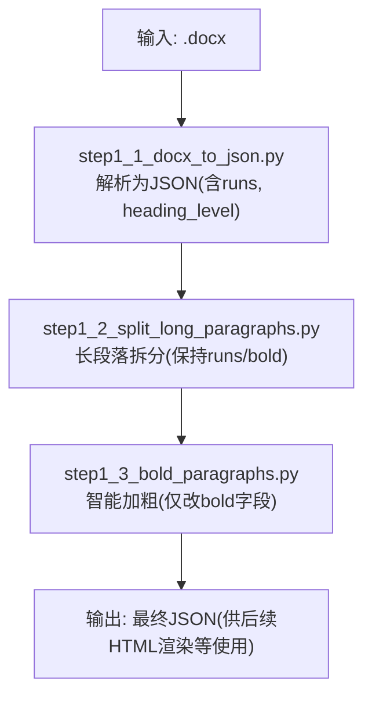
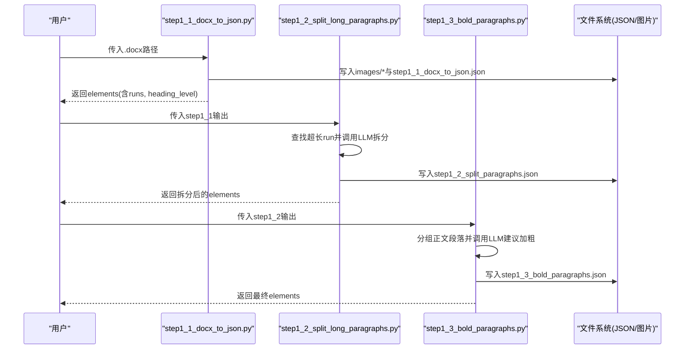
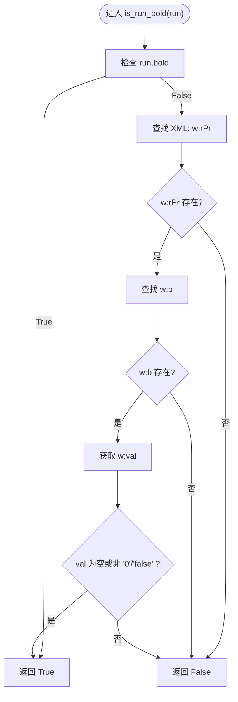
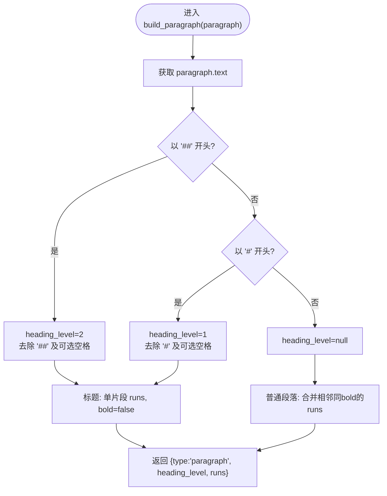
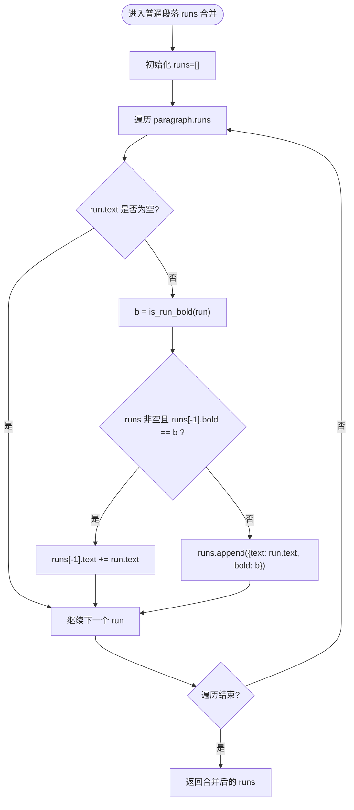
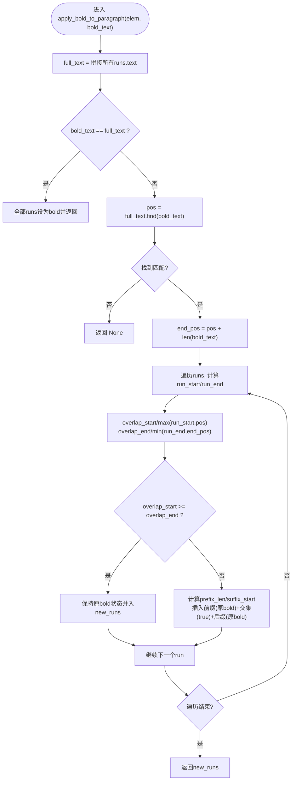
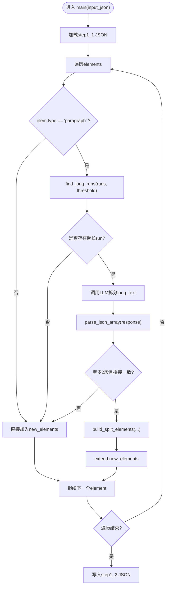
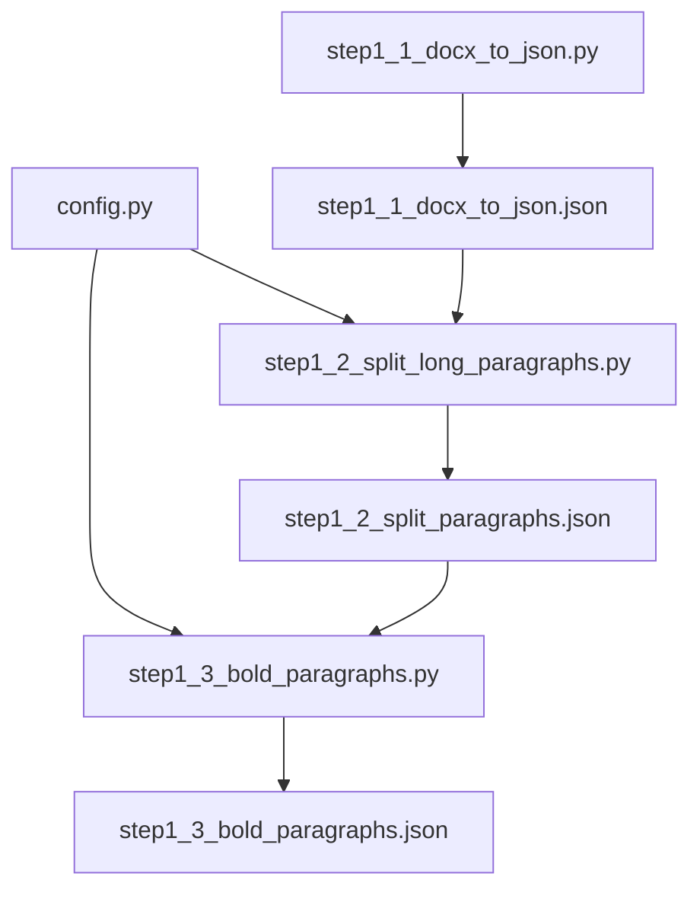

# 样式处理引擎

<cite>
**本文引用的文件列表**
- [step1_1_docx_to_json.py](file://step1_1_docx_to_json.py)
- [step1_2_split_long_paragraphs.py](file://step1_2_split_long_paragraphs.py)
- [step1_3_bold_paragraphs.py](file://step1_3_bold_paragraphs.py)
- [config.py](file://config.py)
- [content_20260702_1/.../step1_1_docx_to_json.json](file://content_instance/content_20260702_1/process/step1_1_docx_to_json.json)
- [content_20260702_1/.../step1_3_bold_paragraphs.json](file://content_instance/content_20260702_1/process/step1_3_bold_paragraphs.json)
</cite>

## 目录
1. [简介](#简介)
2. [项目结构](#项目结构)
3. [核心组件](#核心组件)
4. [架构总览](#架构总览)
5. [详细组件分析](#详细组件分析)
6. [依赖关系分析](#依赖关系分析)
7. [性能考虑](#性能考虑)
8. [故障排查指南](#故障排查指南)
9. [结论](#结论)
10. [附录](#附录)

## 简介
本技术文档聚焦于“样式处理引擎”，围绕以下目标展开：
- 深入解释 is_run_bold 函数的实现原理，包括样式继承检测、XML 属性解析与布尔值判断逻辑。
- 详细描述标题识别算法，涵盖 Markdown 风格的 # 和 ## 前缀处理、heading_level 设置与文本清理机制。
- 说明 run 合并策略，包括相邻相同样式 run 的合并算法与 bold 状态传播。
- 提供具体的样式处理示例，展示复杂文档样式的解析结果。
- 解释样式处理的边界情况与异常处理策略。
- 给出样式处理的性能优化技巧与调试方法。

该引擎位于从 Word 文档到结构化 JSON 的流水线中，后续步骤可基于此结构化数据进行段落拆分、智能加粗等增强处理。

## 项目结构
样式处理相关代码主要分布在三个脚本中：
- step1_1_docx_to_json.py：解析 .docx，提取段落、表格、图片，输出结构化 JSON；包含 is_run_bold、标题识别、run 合并等核心逻辑。
- step1_2_split_long_paragraphs.py：对过长段落进行语义拆分（调用大模型），生成新的 paragraph 元素并保留样式信息。
- step1_3_bold_paragraphs.py：在正文段落上按语义自动添加加粗标记（调用大模型），不改变原文内容。

图表来源
- [step1_1_docx_to_json.py:145-184](file://step1_1_docx_to_json.py#L145-L184)
- [step1_2_split_long_paragraphs.py:198-301](file://step1_2_split_long_paragraphs.py#L198-L301)
- [step1_3_bold_paragraphs.py:207-330](file://step1_3_bold_paragraphs.py#L207-L330)

章节来源
- [step1_1_docx_to_json.py:1-233](file://step1_1_docx_to_json.py#L1-L233)
- [step1_2_split_long_paragraphs.py:1-311](file://step1_2_split_long_paragraphs.py#L1-L311)
- [step1_3_bold_paragraphs.py:1-340](file://step1_3_bold_paragraphs.py#L1-L340)

## 核心组件
- is_run_bold：判断单个 run 是否加粗，支持样式继承检测与 XML 属性解析。
- build_paragraph：构建段落元素，包含标题识别、runs 合并与 heading_level 设置。
- parse_docx：遍历文档元素，组装 elements 列表，同时抽取内嵌图片。
- 长段落拆分：step1_2 将超长 run 拆分为多个新段落，保持 runs 与 bold 一致。
- 智能加粗：step1_3 根据 LLM 建议，精准定位并标记 bold，不改动原文。

章节来源
- [step1_1_docx_to_json.py:34-113](file://step1_1_docx_to_json.py#L34-L113)
- [step1_1_docx_to_json.py:145-184](file://step1_1_docx_to_json.py#L145-L184)
- [step1_2_split_long_paragraphs.py:152-192](file://step1_2_split_long_paragraphs.py#L152-L192)
- [step1_3_bold_paragraphs.py:146-201](file://step1_3_bold_paragraphs.py#L146-L201)

## 架构总览
整体流程如下：
- 读取 .docx，解析段落、表格、图片，生成结构化 JSON。
- 对过长段落进行语义拆分，确保拼接一致性。
- 对正文段落进行智能加粗，仅修改 bold 字段，不增删改文字。
- 输出最终 JSON，供后续 HTML 渲染或上传草稿箱等步骤使用。

图表来源
- [step1_1_docx_to_json.py:190-226](file://step1_1_docx_to_json.py#L190-L226)
- [step1_2_split_long_paragraphs.py:198-301](file://step1_2_split_long_paragraphs.py#L198-L301)
- [step1_3_bold_paragraphs.py:207-330](file://step1_3_bold_paragraphs.py#L207-L330)

## 详细组件分析

### is_run_bold 函数：样式继承检测、XML 属性解析与布尔值判断
is_run_bold 的核心职责是判断一个 run 是否加粗，其逻辑层次如下：
- 优先检查 run.bold 属性（由 python-docx 暴露的便捷属性）。
- 若未显式设置，则回退到 XML 层解析 w:rPr 下的 w:b 节点：
  - 若 w:b 存在且 w:val 为空或未设置为 '0'/'false'，则认为加粗。
  - 否则认为非加粗。
- 该实现体现了“样式继承”的检测思路：当 run 自身未显式设置 bold 时，通过父级样式（rPr）推断实际显示效果。

图表来源
- [step1_1_docx_to_json.py:34-44](file://step1_1_docx_to_json.py#L34-L44)

章节来源
- [step1_1_docx_to_json.py:34-44](file://step1_1_docx_to_json.py#L34-L44)

### 标题识别算法：Markdown 风格 # 与 ## 前缀处理、heading_level 设置与文本清理
build_paragraph 负责段落元素的构建，其中标题识别的关键点：
- 先检测 ## 再检测 #，避免短前缀误匹配长前缀。
- 若检测到 ##，设置 heading_level=2，并去除前缀及可选空格。
- 若检测到 #，设置 heading_level=1，并去除前缀及可选空格。
- 标题段落统一生成单片段 runs，且 bold=false，避免标题被错误加粗。
- 普通段落则按 runs 顺序合并相邻同 bold 状态的片段。

图表来源
- [step1_1_docx_to_json.py:75-113](file://step1_1_docx_to_json.py#L75-L113)

章节来源
- [step1_1_docx_to_json.py:75-113](file://step1_1_docx_to_json.py#L75-L113)

### run 合并策略：相邻相同样式 run 的合并与 bold 状态传播
在普通段落中，引擎会遍历 paragraph.runs，执行以下策略：
- 跳过空文本的 run。
- 计算当前 run 的 bold 状态（调用 is_run_bold）。
- 如果与前一个 run 的 bold 状态相同，则合并文本；否则新建一个 run。
- 合并后，每个 run 携带 text 与 bold 字段，便于后续步骤（如智能加粗）精确定位。

图表来源
- [step1_1_docx_to_json.py:97-108](file://step1_1_docx_to_json.py#L97-L108)

章节来源
- [step1_1_docx_to_json.py:97-108](file://step1_1_docx_to_json.py#L97-L108)

### 智能加粗：apply_bold_to_paragraph 的区间标记与 runs 拆分
step1_3 的智能加粗逻辑：
- 接收段落 elem 与需要加粗的完整原文子串 bold_text。
- 若整段等于 bold_text，则将全部 runs 标为 bold。
- 否则在 full_text 中查找 bold_text 的位置，计算交集区间。
- 对每个 run 计算其与加粗区间的交集，必要时拆分为前缀、交集、后缀三段，分别赋予原 bold 或 true。
- 返回新的 runs 列表，替换原段落 runs。

图表来源
- [step1_3_bold_paragraphs.py:146-201](file://step1_3_bold_paragraphs.py#L146-L201)

章节来源
- [step1_3_bold_paragraphs.py:146-201](file://step1_3_bold_paragraphs.py#L146-L201)

### 长段落拆分：语义拆分与索引命名规则
step1_2 的拆分逻辑：
- 扫描段落 runs，找出超过阈值的 run。
- 调用大模型按语义拆分，返回数组形式的段落文本。
- 校验拼接一致性（必须与原文完全一致）。
- 构建新段落元素：第一个元素包含拆分前的 runs 与第一段拆分文本；中间元素为纯拆分文本；最后一个元素包含最后一段拆分文本与拆分后的 runs。
- index 采用 “原index.N” 的形式，便于溯源。

图表来源
- [step1_2_split_long_paragraphs.py:198-301](file://step1_2_split_long_paragraphs.py#L198-L301)
- [step1_2_split_long_paragraphs.py:152-192](file://step1_2_split_long_paragraphs.py#L152-L192)

章节来源
- [step1_2_split_long_paragraphs.py:198-301](file://step1_2_split_long_paragraphs.py#L198-L301)
- [step1_2_split_long_paragraphs.py:152-192](file://step1_2_split_long_paragraphs.py#L152-L192)

### 具体样式处理示例
以下为来自示例数据的典型场景（节选）：
- 标题段落：heading_level=1 或 2，runs 单片段且 bold=false。
- 普通段落：runs 可能包含多个片段，部分片段 bold=true，体现总结性或判断性表达。
- 智能加粗后：某些段落新增 bold=true 的片段，用于强调关键句。

参考数据路径：
- [step1_1_docx_to_json.json](file://content_instance/content_20260702_1/process/step1_1_docx_to_json.json)
- [step1_3_bold_paragraphs.json](file://content_instance/content_20260702_1/process/step1_3_bold_paragraphs.json)

章节来源
- [content_instance/content_20260702_1/process/step1_1_docx_to_json.json:1-200](file://content_instance/content_20260702_1/process/step1_1_docx_to_json.json#L1-L200)
- [content_instance/content_20260702_1/process/step1_3_bold_paragraphs.json:1-200](file://content_instance/content_20260702_1/process/step1_3_bold_paragraphs.json#L1-L200)

## 依赖关系分析
- step1_1_docx_to_json.py 依赖 python-docx 库解析 .docx，并通过 qn 命名空间访问 XML 节点。
- step1_2 与 step1_3 均依赖 config.py 中的 API_URL、HEADERS、MAX_RETRIES、MAX_TOKENS 等配置。
- 三者之间通过 JSON 文件传递数据，形成松耦合的流水线。

图表来源
- [config.py:1-39](file://config.py#L1-L39)
- [step1_1_docx_to_json.py:190-226](file://step1_1_docx_to_json.py#L190-L226)
- [step1_2_split_long_paragraphs.py:198-301](file://step1_2_split_long_paragraphs.py#L198-L301)
- [step1_3_bold_paragraphs.py:207-330](file://step1_3_bold_paragraphs.py#L207-L330)

章节来源
- [config.py:1-39](file://config.py#L1-L39)
- [step1_1_docx_to_json.py:190-226](file://step1_1_docx_to_json.py#L190-L226)
- [step1_2_split_long_paragraphs.py:198-301](file://step1_2_split_long_paragraphs.py#L198-L301)
- [step1_3_bold_paragraphs.py:207-330](file://step1_3_bold_paragraphs.py#L207-L330)

## 性能考虑
- 减少不必要的 XML 查询：is_run_bold 优先使用 run.bold，仅在缺失时回退到 XML 解析，降低开销。
- 合并相邻同样式 run：减少 runs 数量，有利于后续步骤的定位与渲染效率。
- 长段落拆分阈值可调：通过 SPLIT_THRESHOLD 控制触发拆分的长度，避免过度拆分导致元素膨胀。
- 批量写入与统计：step1_1 在解析完成后一次性写入 JSON，并统计各类型元素数量，便于监控。

[本节为通用指导，无需特定文件引用]

## 故障排查指南
- 文件不存在或格式不支持：step1_1 会在输入路径无效或非 .docx 时退出并打印错误。
- 模型调用失败：step1_2 与 step1_3 内置重试机制与超时保护，失败时记录警告并跳过相应处理。
- 拆分结果不一致：step1_2 对 LLM 返回的数组进行拼接一致性校验，不一致则保留原段落。
- 加粗文字未找到匹配：step1_3 在应用加粗前会验证 bold_text 是否在段落中存在，找不到则跳过。

章节来源
- [step1_1_docx_to_json.py:190-196](file://step1_1_docx_to_json.py#L190-L196)
- [step1_2_split_long_paragraphs.py:251-272](file://step1_2_split_long_paragraphs.py#L251-L272)
- [step1_3_bold_paragraphs.py:278-313](file://step1_3_bold_paragraphs.py#L278-L313)

## 结论
本样式处理引擎通过严谨的 XML 解析与样式继承检测，实现了可靠的 bold 判定与标题识别；通过 run 合并与智能加粗策略，在保证原文不变的前提下增强了可读性与视觉重点。配合长段落拆分，系统能够在保持语义完整的同时提升阅读体验。整体架构清晰、模块解耦良好，具备较好的可扩展性与可维护性。

[本节为总结性内容，无需特定文件引用]

## 附录
- 配置项说明：API_URL、HEADERS、MAX_RETRIES、MAX_TOKENS、SPLIT_THRESHOLD 等参数可在 config.py 中调整。
- 数据流转：step1_1 → step1_2 → step1_3，每步输出独立 JSON，便于断点调试与回溯。

章节来源
- [config.py:1-39](file://config.py#L1-L39)