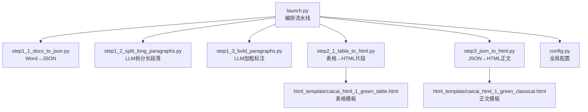
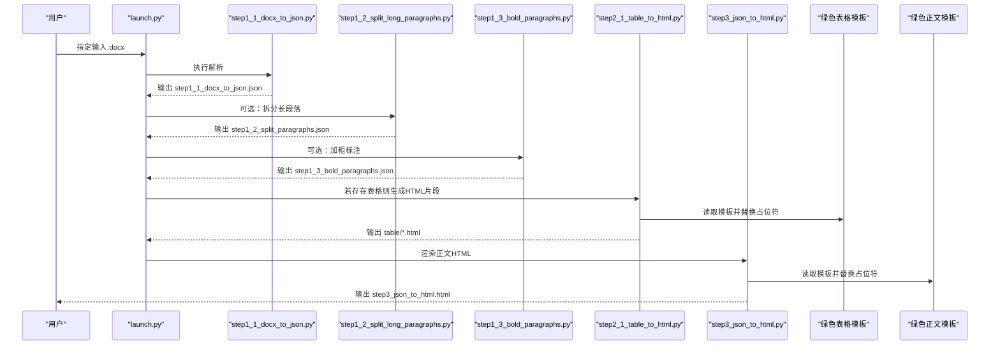
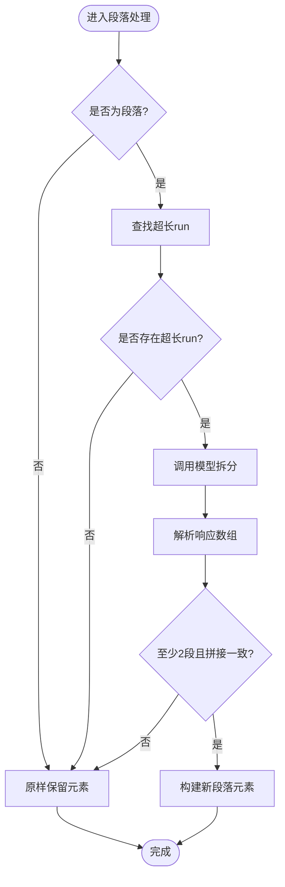
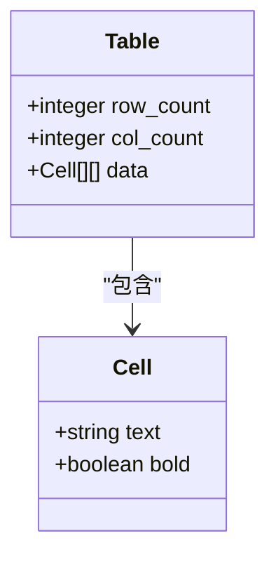
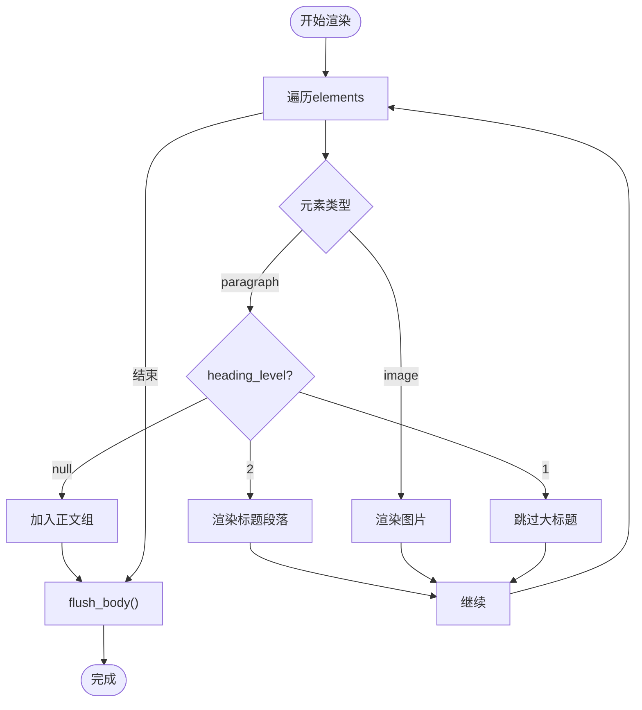
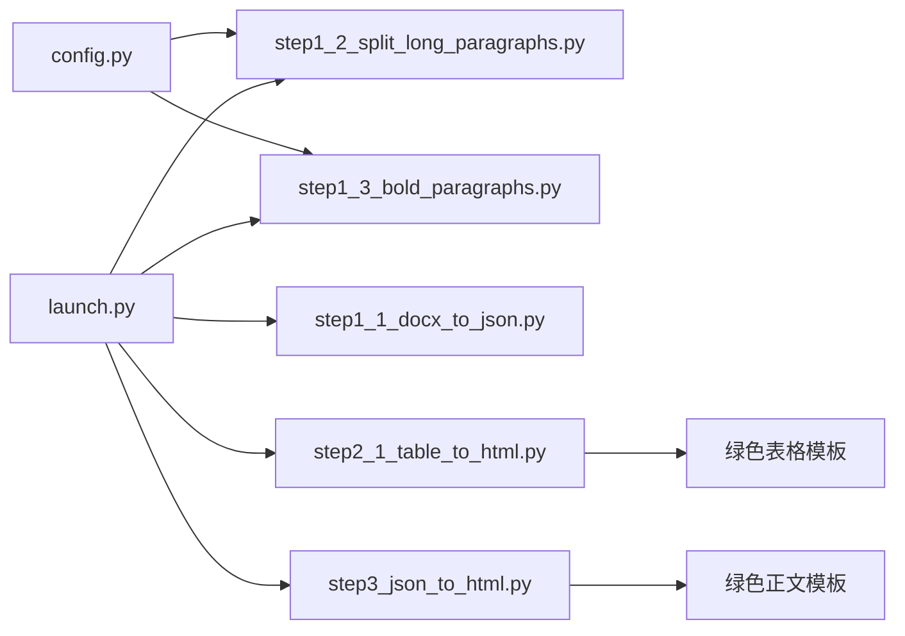

# 结构化数据模型设计

<cite>
**本文引用的文件**
- [launch.py](file://launch.py)
- [config.py](file://config.py)
- [step1_1_docx_to_json.py](file://step1_1_docx_to_json.py)
- [step1_2_split_long_paragraphs.py](file://step1_2_split_long_paragraphs.py)
- [step1_3_bold_paragraphs.py](file://step1_3_bold_paragraphs.py)
- [step2_1_table_to_html.py](file://step2_1_table_to_html.py)
- [step3_json_to_html.py](file://step3_json_to_html.py)
- [caicai_html_1_green_classical.html](file://html_template/caicai_html_1_green_classical.html)
- [caicai_html_1_green_table.html](file://html_template/caicai_html_1_green_table.html)
- [content_20260702_1/step1_1_docx_to_json.json](file://content_instance/content_20260702_1/process/step1_1_docx_to_json.json)
- [content_20260702_1/step1_2_split_paragraphs.json](file://content_instance/content_20260702_1/process/step1_2_split_paragraphs.json)
- [content_20260702_1/step1_3_bold_paragraphs.json](file://content_instance/content_20260702_1/process/step1_3_bold_paragraphs.json)
- [content_20260708_1/step1_1_docx_to_json.json](file://content_instance/content_20260708_1/process/step1_1_docx_to_json.json)
</cite>

## 目录
1. [引言](#引言)
2. [项目结构](#项目结构)
3. [核心组件](#核心组件)
4. [架构总览](#架构总览)
5. [详细组件分析](#详细组件分析)
6. [依赖关系分析](#依赖关系分析)
7. [性能与可扩展性](#性能与可扩展性)
8. [故障排查指南](#故障排查指南)
9. [结论](#结论)
10. [附录：JSON 规范与示例](#附录json-规范与示例)

## 引言
本技术文档聚焦于“结构化数据模型”的设计与实现，围绕 Element、Run、Table 等核心实体展开，系统阐述其定义、关系映射（父子关系、样式继承）、数据流转路径、JSON 输出格式规范（字段、类型约束、校验规则），并提供完整的数据模型示例。同时说明模型的扩展性与向后兼容性策略，以及数据验证与错误恢复机制的实现细节。

## 项目结构
本项目采用流水线式处理结构，以 JSON 作为中间数据载体，贯穿 Word 解析、段落拆分、加粗标注、表格转图、HTML 渲染与发布等环节。关键入口为 launch.py，串联各步骤脚本；config.py 提供全局配置；模板位于 html_template 目录；实际数据样本位于 content_instance 下。

图表来源
- [launch.py:42-193](file://launch.py#L42-L193)
- [step1_1_docx_to_json.py:145-184](file://step1_1_docx_to_json.py#L145-L184)
- [step1_2_split_long_paragraphs.py:198-301](file://step1_2_split_long_paragraphs.py#L198-L301)
- [step1_3_bold_paragraphs.py:207-330](file://step1_3_bold_paragraphs.py#L207-L330)
- [step2_1_table_to_html.py:74-118](file://step2_1_table_to_html.py#L74-L118)
- [step3_json_to_html.py:121-142](file://step3_json_to_html.py#L121-L142)
- [caicai_html_1_green_table.html:59-62](file://html_template/caicai_html_1_green_table.html#L59-L62)
- [caicai_html_1_green_classical.html:187-200](file://html_template/caicai_html_1_green_classical.html#L187-L200)
- [config.py:1-39](file://config.py#L1-L39)

章节来源
- [launch.py:1-201](file://launch.py#L1-L201)
- [config.py:1-39](file://config.py#L1-L39)

## 核心组件
本节定义并解释数据模型的核心实体及其关系。

- 顶层容器
  - 名称：Document
  - 字段：
    - file_name: string，源文件名
    - total_elements: integer，元素总数
    - elements: array<Element>，按文档顺序排列的元素列表
  - 作用：承载整篇文章的结构化内容，作为所有下游处理的输入。

- 元素 Element
  - 类型标识：type ∈ { "paragraph", "table", "image" }
  - 通用字段：
    - index: number|string，元素序号（拆分后可能为带小数后缀的字符串）
  - 子类型：
    - Paragraph
      - heading_level: number|null，标题级别（1=大标题，2=小标题，null=正文）
      - runs: array<Run>，内联文本片段序列
    - Table
      - row_count: integer，行数
      - col_count: integer，列数
      - data: array<array<Cell>>，二维单元格矩阵
    - Image
      - file_name: string，图片文件名
      - image_path: string，相对路径（用于渲染或上传）

- 内联片段 Run
  - 字段：
    - text: string，文本内容
    - bold: boolean，是否加粗
  - 语义：表示最小可独立设置样式的文本单元；Paragraph 通过 runs 组合形成完整段落。

- 单元格 Cell
  - 字段：
    - text: string，单元格文本
    - bold: boolean，是否加粗
  - 语义：Table.data 中的基本单元，支持行级加粗标记。

父子关系与样式继承
- 父子关系
  - Document → elements[]
  - Paragraph → runs[]
  - Table → data[][]
- 样式继承
  - Run.bold 决定段落内某段文本的加粗状态；Paragraph 本身不直接持有样式，而是由 runs 聚合表达。
  - Table.cell.bold 影响对应单元格渲染时的样式（如 HTML 中 class="bold"）。
  - 标题段落（heading_level≠null）在渲染时忽略 bold 属性，统一视为普通标题文本。

数据流转
- step1_1：从 .docx 提取段落、表格、图片，生成 Document.elements。
- step1_2：对过长 run.text 调用 LLM 拆分，插入新 paragraph 元素，保持原文拼接一致性。
- step1_3：基于段落组识别总结/判断/序列性句子，将对应 run 标记为 bold=true。
- step2_1：遍历 table 元素，生成独立 HTML 片段（表头/表体）。
- step3：将 paragraph/image 渲染为 HTML 正文，替换模板占位符。

章节来源
- [step1_1_docx_to_json.py:75-139](file://step1_1_docx_to_json.py#L75-L139)
- [step1_2_split_long_paragraphs.py:152-192](file://step1_2_split_long_paragraphs.py#L152-L192)
- [step1_3_bold_paragraphs.py:146-201](file://step1_3_bold_paragraphs.py#L146-L201)
- [step2_1_table_to_html.py:39-68](file://step2_1_table_to_html.py#L39-L68)
- [step3_json_to_html.py:38-78](file://step3_json_to_html.py#L38-L78)

## 架构总览
下图展示从 Word 到最终 HTML 的整体数据流与模块交互。

图表来源
- [launch.py:70-155](file://launch.py#L70-L155)
- [step1_1_docx_to_json.py:190-226](file://step1_1_docx_to_json.py#L190-L226)
- [step1_2_split_long_paragraphs.py:198-301](file://step1_2_split_long_paragraphs.py#L198-L301)
- [step1_3_bold_paragraphs.py:207-330](file://step1_3_bold_paragraphs.py#L207-L330)
- [step2_1_table_to_html.py:74-118](file://step2_1_table_to_html.py#L74-L118)
- [step3_json_to_html.py:121-142](file://step3_json_to_html.py#L121-L142)
- [caicai_html_1_green_table.html:59-62](file://html_template/caicai_html_1_green_table.html#L59-L62)
- [caicai_html_1_green_classical.html:187-200](file://html_template/caicai_html_1_green_classical.html#L187-L200)

## 详细组件分析

### 段落与内联片段（Paragraph / Run）
- 设计要点
  - 标题段落通过 heading_level 区分，runs 统一 bold=false，避免标题样式污染。
  - 正文段落合并相邻且 bold 相同的 run，减少冗余片段。
  - 拆分流程保留原始 runs 的前后部分，仅对目标 run 进行分割，确保索引与顺序稳定。
- 复杂度
  - 构建 runs：O(n)，n 为段落中 run 数量。
  - 拆分重建：O(m)，m 为新段落数量。
- 错误恢复
  - 若 LLM 返回无效或不可拼接结果，保留原段落不变。
  - 若找不到匹配加粗文本，跳过该段落。

图表来源
- [step1_2_split_long_paragraphs.py:143-192](file://step1_2_split_long_paragraphs.py#L143-L192)
- [step1_2_split_long_paragraphs.py:257-276](file://step1_2_split_long_paragraphs.py#L257-L276)

章节来源
- [step1_1_docx_to_json.py:75-113](file://step1_1_docx_to_json.py#L75-L113)
- [step1_2_split_long_paragraphs.py:143-192](file://step1_2_split_long_paragraphs.py#L143-L192)
- [step1_3_bold_paragraphs.py:146-201](file://step1_3_bold_paragraphs.py#L146-L201)

### 表格（Table）
- 设计要点
  - 使用二维数组 data 存储单元格，第一行作为表头，其余为表体。
  - 每个单元格包含 text 与 bold，便于后续渲染时应用样式。
- 渲染逻辑
  - 表头 th 无 bold 控制；表体 td 根据 cell.bold 添加样式类。
- 复杂度
  - 生成 HTML：O(R*C)，R 为行数，C 为列数。

图表来源
- [step1_1_docx_to_json.py:116-139](file://step1_1_docx_to_json.py#L116-L139)
- [step2_1_table_to_html.py:39-68](file://step2_1_table_to_html.py#L39-L68)

章节来源
- [step1_1_docx_to_json.py:116-139](file://step1_1_docx_to_json.py#L116-L139)
- [step2_1_table_to_html.py:39-68](file://step2_1_table_to_html.py#L39-L68)

### 图片（Image）
- 设计要点
  - 记录 file_name 与 image_path，供后续渲染或上传使用。
  - 在解析阶段按文档顺序插入，保证元素顺序与视觉顺序一致。
- 复杂度
  - 提取与写入：O(k)，k 为段落内图片数量。

章节来源
- [step1_1_docx_to_json.py:47-69](file://step1_1_docx_to_json.py#L47-L69)
- [step1_1_docx_to_json.py:156-175](file://step1_1_docx_to_json.py#L156-L175)

### 渲染器（JSON → HTML）
- 设计要点
  - 标题级别 1 跳过渲染，级别 2 渲染为标题段落。
  - 连续正文段落合并在 section 中，每段 p.body，段间空行分隔。
  - bold run 渲染为 span.hl，图片居中显示。
- 复杂度
  - 遍历 elements：O(N)，N 为元素总数。

图表来源
- [step3_json_to_html.py:84-115](file://step3_json_to_html.py#L84-L115)
- [step3_json_to_html.py:38-78](file://step3_json_to_html.py#L38-L78)

章节来源
- [step3_json_to_html.py:84-115](file://step3_json_to_html.py#L84-L115)
- [step3_json_to_html.py:38-78](file://step3_json_to_html.py#L38-L78)

## 依赖关系分析
- 模块耦合
  - launch.py 作为编排者，低耦合地调用各步骤主函数。
  - 步骤之间通过 JSON 文件解耦，便于单独运行与调试。
- 外部依赖
  - config.py 提供 API 地址、重试次数、令牌上限、阈值等。
  - 模板文件提供渲染外观，不影响数据结构。
- 潜在循环依赖
  - 当前结构无循环依赖，均为单向数据流。

图表来源
- [config.py:1-39](file://config.py#L1-L39)
- [launch.py:70-155](file://launch.py#L70-L155)
- [step2_1_table_to_html.py:26-27](file://step2_1_table_to_html.py#L26-L27)
- [step3_json_to_html.py:28-29](file://step3_json_to_html.py#L28-L29)

章节来源
- [config.py:1-39](file://config.py#L1-L39)
- [launch.py:70-155](file://launch.py#L70-L155)

## 性能与可扩展性
- 性能特征
  - 段落拆分与加粗标注涉及 LLM 调用，受网络与模型响应时间影响；已实现指数退避重试。
  - 表格与正文渲染为纯文本操作，时间复杂度线性，开销较小。
- 优化建议
  - 批量请求：将多个段落合并一次请求，降低调用次数（需权衡提示词长度）。
  - 缓存策略：对相同输入段落的结果进行缓存，避免重复调用。
  - 并行处理：对非段落元素（图片、表格）与段落处理可并行化。
- 可扩展性
  - 新增元素类型：在 Document.elements 中增加 type 分支，并在渲染器中补充对应逻辑。
  - 新增样式：在 Run.bold 基础上可扩展更多属性（如 italic、color），并在渲染器中映射到 CSS。
  - 向后兼容：新增字段默认 null/空值，旧版本渲染器应能安全忽略未知字段。

[本节为一般性指导，无需具体文件引用]

## 故障排查指南
- 常见错误与恢复
  - 文件不存在：步骤入口检查输入路径，打印错误并退出。
  - 非 .docx 文件：step1_1 拒绝处理并提示。
  - LLM 调用失败：重试后仍失败则保留原段落或跳过加粗，不中断流水线。
  - 拆分结果不一致：拼接校验失败时回退到原段落，保证数据完整性。
  - 表格为空：跳过生成，避免产生无效 HTML。
- 定位方法
  - 查看步骤输出日志，确认失败位置与原因。
  - 检查 process 目录下中间 JSON 文件，验证元素结构与字段。
  - 对比模板占位符是否被正确替换。

章节来源
- [step1_1_docx_to_json.py:190-226](file://step1_1_docx_to_json.py#L190-L226)
- [step1_2_split_long_paragraphs.py:251-276](file://step1_2_split_long_paragraphs.py#L251-L276)
- [step1_3_bold_paragraphs.py:278-315](file://step1_3_bold_paragraphs.py#L278-L315)
- [step2_1_table_to_html.py:74-118](file://step2_1_table_to_html.py#L74-L118)

## 结论
本数据模型以简洁清晰的 JSON 结构承载文章元素，通过 Element/Run/Table/Image 的组合表达复杂排版需求。模型具备明确的父子关系与样式继承机制，配合严格的校验与错误恢复策略，确保数据在流水线中的稳定性与可追溯性。未来可在不破坏向后兼容的前提下，平滑扩展新的元素类型与样式属性。

[本节为总结性内容，无需具体文件引用]

## 附录：JSON 规范与示例

### 顶层字段规范
- file_name: string，必填，源文件名
- total_elements: integer，必填，元素总数
- elements: array<Element>，必填，元素列表

### Element 类型与字段
- 通用字段
  - type: enum["paragraph","table","image"]，必填
  - index: number|string，必填
- Paragraph
  - heading_level: number|null，必填
  - runs: array<Run>，必填
- Table
  - row_count: integer，必填
  - col_count: integer，必填
  - data: array<array<Cell>>，必填
- Image
  - file_name: string，必填
  - image_path: string，必填

### Run 与 Cell 字段
- Run
  - text: string，必填
  - bold: boolean，必填
- Cell
  - text: string，必填
  - bold: boolean，必填

### 类型约束与验证规则
- 非空校验：所有必填字段不得为 null 或空字符串（除 heading_level 可为 null）。
- 数值范围：row_count、col_count ≥ 0；total_elements = len(elements)。
- 一致性校验：
  - 拆分后段落拼接必须与原文完全一致。
  - 表格 data 行列数应与 row_count、col_count 一致。
- 渲染兼容性：
  - 标题段落忽略 bold 属性。
  - 未知字段应被安全忽略，不导致渲染失败。

### 数据模型示例（路径引用）
- 段落与图片示例
  - [content_20260702_1/step1_1_docx_to_json.json](file://content_instance/content_20260702_1/process/step1_1_docx_to_json.json)
- 拆分后的段落示例（含 index 小数后缀）
  - [content_20260702_1/step1_2_split_paragraphs.json](file://content_instance/content_20260702_1/process/step1_2_split_paragraphs.json)
- 加粗标注示例（bold=true 的 run）
  - [content_20260702_1/step1_3_bold_paragraphs.json](file://content_instance/content_20260702_1/process/step1_3_bold_paragraphs.json)
- 表格数据示例（二维 data 与 bold 单元格）
  - [content_20260708_1/step1_1_docx_to_json.json](file://content_instance/content_20260708_1/process/step1_1_docx_to_json.json)

[本节为规范与示例汇总，无需额外代码片段]