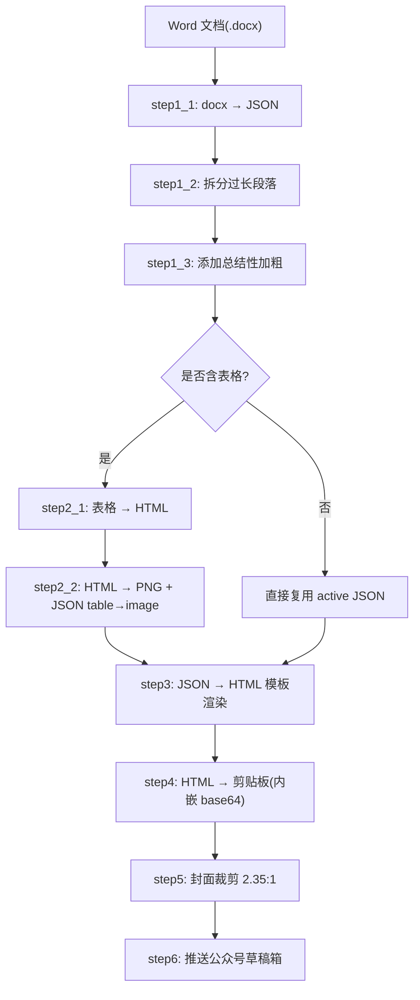
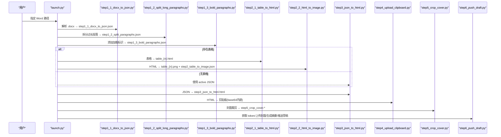
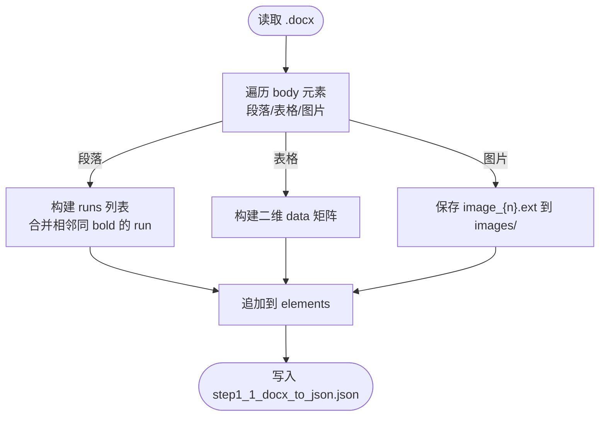
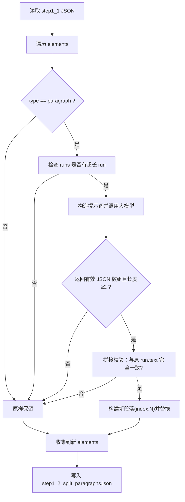
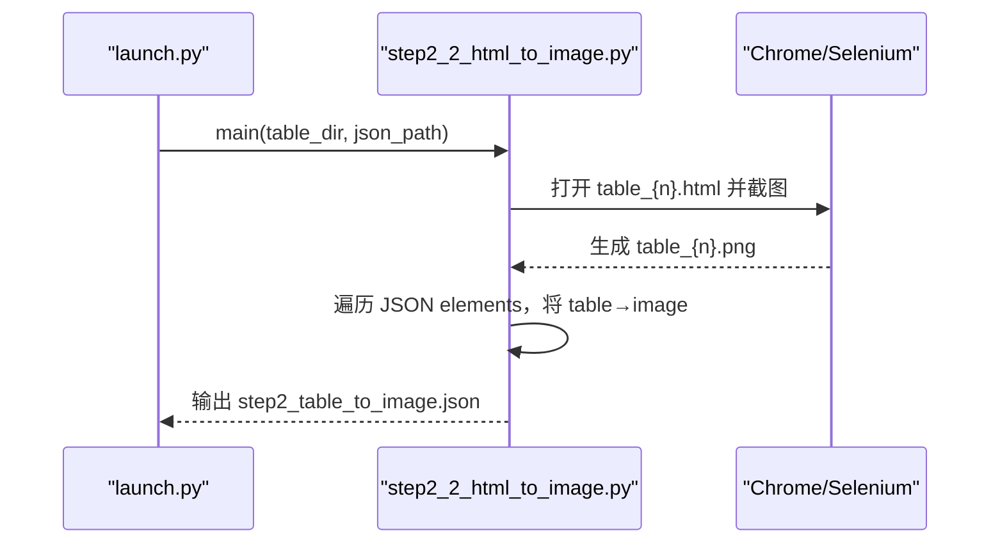
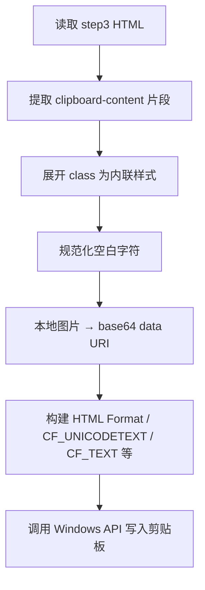
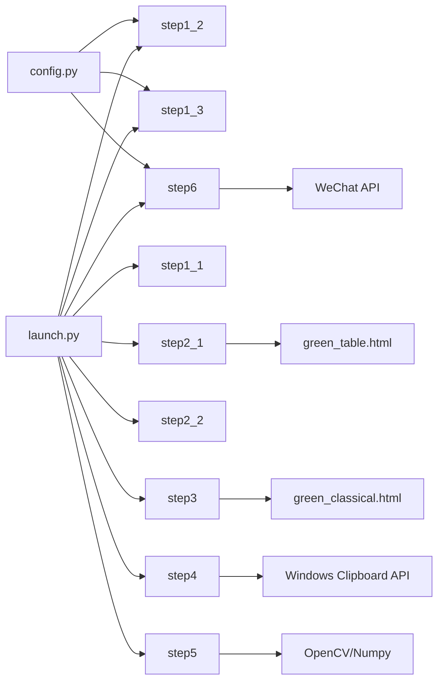

# 数据流管理

<cite>
**本文引用的文件**   
- [config.py](file://config.py)
- [launch.py](file://launch.py)
- [step1_1_docx_to_json.py](file://step1_1_docx_to_json.py)
- [step1_2_split_long_paragraphs.py](file://step1_2_split_long_paragraphs.py)
- [step1_3_bold_paragraphs.py](file://step1_3_bold_paragraphs.py)
- [step2_1_table_to_html.py](file://step2_1_table_to_html.py)
- [step2_2_html_to_image.py](file://step2_2_html_to_image.py)
- [step3_json_to_html.py](file://step3_json_to_html.py)
- [step4_upload_clipboard.py](file://step4_upload_clipboard.py)
- [step5_crop_cover.py](file://step5_crop_cover.py)
- [step6_push_draft.py](file://step6_push_draft.py)
- [caicai_html_1_green_table.html](file://html_template/caicai_html_1_green_table.html)
- [caicai_html_1_green_classical.html](file://html_template/caicai_html_1_green_classical.html)
</cite>

## 目录
1. [简介](#简介)
2. [项目结构](#项目结构)
3. [核心组件](#核心组件)
4. [架构总览](#架构总览)
5. [详细组件分析](#详细组件分析)
6. [依赖关系分析](#依赖关系分析)
7. [性能与可靠性](#性能与可靠性)
8. [故障排查指南](#故障排查指南)
9. [结论](#结论)
10. [附录：中间文件数据结构](#附录中间文件数据结构)

## 简介
本文件面向 content_board 的数据流管理，聚焦于从原始 Word 文档到最终剪贴板数据的完整转换过程。重点说明 process 目录下 JSON 与 HTML 中间文件的组织与命名约定、每个步骤的输入输出格式、路径派生与目录创建机制、数据完整性校验与错误恢复策略，并提供可视化数据流向图，帮助读者快速理解并可靠地维护该流水线。

## 项目结构
- 根目录包含配置、启动器与各处理步骤脚本；模板位于 html_template；示例内容实例位于 content_instance/<content_xxx>/process。
- 每个内容实例在自身目录下生成 process 子目录，用于存放中间产物（JSON/HTML/图片等）。
- launch.py 作为统一入口，按顺序调用各 step 脚本，支持跳过任意步骤以加速调试。

图表来源
- [launch.py:42-193](file://launch.py#L42-L193)
- [step1_1_docx_to_json.py:190-226](file://step1_1_docx_to_json.py#L190-L226)
- [step1_2_split_long_paragraphs.py:198-301](file://step1_2_split_long_paragraphs.py#L198-L301)
- [step1_3_bold_paragraphs.py:207-330](file://step1_3_bold_paragraphs.py#L207-L330)
- [step2_1_table_to_html.py:74-118](file://step2_1_table_to_html.py#L74-L118)
- [step2_2_html_to_image.py:120-210](file://step2_2_html_to_image.py#L120-L210)
- [step3_json_to_html.py:121-142](file://step3_json_to_html.py#L121-L142)
- [step4_upload_clipboard.py:436-475](file://step4_upload_clipboard.py#L436-L475)
- [step5_crop_cover.py:174-196](file://step5_crop_cover.py#L174-L196)
- [step6_push_draft.py:276-397](file://step6_push_draft.py#L276-L397)

章节来源
- [launch.py:42-193](file://launch.py#L42-L193)

## 核心组件
- 配置中心：集中管理 API、微信公众号参数与通用阈值。
- 启动器：编排步骤、派生路径、自动检测表格、控制跳过逻辑。
- 解析与结构化：将 Word 文档解析为统一的 JSON 元素序列。
- 文本增强：基于大模型进行段落拆分与加粗标记。
- 表格处理：表格转 HTML 模板、截图为 PNG、回写 JSON。
- 渲染与导出：JSON 渲染为 HTML 模板，再写入 Windows 剪贴板。
- 媒体与发布：封面裁剪、上传素材、生成摘要、推送草稿。

章节来源
- [config.py:1-39](file://config.py#L1-L39)
- [launch.py:42-193](file://launch.py#L42-L193)

## 架构总览
下图展示了从 Word 到剪贴板的端到端数据流，以及关键中间文件的位置与命名。

图表来源
- [launch.py:42-193](file://launch.py#L42-L193)
- [step1_1_docx_to_json.py:190-226](file://step1_1_docx_to_json.py#L190-L226)
- [step1_2_split_long_paragraphs.py:198-301](file://step1_2_split_long_paragraphs.py#L198-L301)
- [step1_3_bold_paragraphs.py:207-330](file://step1_3_bold_paragraphs.py#L207-L330)
- [step2_1_table_to_html.py:74-118](file://step2_1_table_to_html.py#L74-L118)
- [step2_2_html_to_image.py:120-210](file://step2_2_html_to_image.py#L120-L210)
- [step3_json_to_html.py:121-142](file://step3_json_to_html.py#L121-L142)
- [step4_upload_clipboard.py:436-475](file://step4_upload_clipboard.py#L436-L475)
- [step5_crop_cover.py:174-196](file://step5_crop_cover.py#L174-L196)
- [step6_push_draft.py:276-397](file://step6_push_draft.py#L276-L397)

## 详细组件分析

### 路径派生与目录创建机制
- 所有中间文件均位于输入 Word 所在目录下的 process 子目录中。
- 关键路径由 launch.py 根据输入路径推导：
  - process_dir = input_dir/process
  - table_dir = process_dir/table
  - 各 step 输出文件名固定，如 step1_1_docx_to_json.json、step1_2_split_paragraphs.json、step1_3_bold_paragraphs.json、step2_table_to_image.json、step3_json_to_html.html。
- 目录按需创建：process 与 table 目录在首次使用时通过 os.makedirs(exist_ok=True) 创建。

章节来源
- [launch.py:48-60](file://launch.py#L48-L60)
- [step1_1_docx_to_json.py:198-205](file://step1_1_docx_to_json.py#L198-L205)
- [step2_1_table_to_html.py:79-82](file://step2_1_table_to_html.py#L79-L82)

### 步骤1.1：Word → JSON（step1_1）
- 输入：.docx 文件路径
- 输出：process/step1_1_docx_to_json.json；同时提取内联图片至 process/images/image_{n}.ext
- 数据结构要点：
  - elements 数组，每项包含 type、index、runs（paragraph）、或 row_count/col_count/data（table），或 file_name/image_path（image）
  - paragraph 的 heading_level 可为 null/1/2；runs 为 [{text, bold}]
  - table 的 data 为二维数组，单元格为 {text, bold}
- 标题识别规则：以 # 或 ## 开头的段落被识别为 heading_level=1/2，并去除前缀。

图表来源
- [step1_1_docx_to_json.py:145-184](file://step1_1_docx_to_json.py#L145-L184)
- [step1_1_docx_to_json.py:190-226](file://step1_1_docx_to_json.py#L190-L226)

章节来源
- [step1_1_docx_to_json.py:145-184](file://step1_1_docx_to_json.py#L145-L184)
- [step1_1_docx_to_json.py:190-226](file://step1_1_docx_to_json.py#L190-L226)

### 步骤1.2：拆分过长段落（step1_2）
- 输入：step1_1_docx_to_json.json
- 输出：process/step1_2_split_paragraphs.json（不覆盖原文件）
- 处理逻辑：
  - 遍历 paragraph 的 runs，若某 run.text 长度超过阈值（默认 120，见 config.SPLIT_THRESHOLD），则调用大模型按语义拆分。
  - 返回 JSON 数组形式的多段文本，拼接一致性校验必须与原文完全一致。
  - 将原段落替换为多个新段落，索引采用 original_index.N 后缀以保持可追溯性。
- 失败恢复：
  - 模型调用失败或结果无效时，保留原段落不变。
  - 拼接不一致时，保留原段落并记录警告。

图表来源
- [step1_2_split_long_paragraphs.py:198-301](file://step1_2_split_long_paragraphs.py#L198-L301)
- [config.py:24](file://config.py#L24)

章节来源
- [step1_2_split_long_paragraphs.py:198-301](file://step1_2_split_long_paragraphs.py#L198-L301)
- [config.py:24](file://config.py#L24)

### 步骤1.3：添加总结性加粗（step1_3）
- 输入：step1_2_split_paragraphs.json（若无则回退到 step1_1）
- 输出：process/step1_3_bold_paragraphs.json
- 处理逻辑：
  - 按标题分段，每组正文交由大模型识别适合加粗的总结/判断/序列表达。
  - 已有加粗的段落跳过；没有合适内容则不加。
  - 仅修改 runs 中的 bold 字段，不增删改任何文字。
- 失败恢复：
  - 模型调用失败或无法匹配原文时，跳过该组或该处。

章节来源
- [step1_3_bold_paragraphs.py:207-330](file://step1_3_bold_paragraphs.py#L207-L330)

### 步骤2.1：表格 → HTML（step2_1）
- 输入：active JSON（优先 step1_3，否则 step1_2/step1_1）
- 输出：process/table/table_{n}.html（绿色主题模板）
- 处理逻辑：
  - 筛选 type==table 的元素，按模板 caicai_html_1_green_table.html 生成独立 HTML。
  - 第一行作为 thead，其余为 tbody；单元格 bold 映射为样式类。

章节来源
- [step2_1_table_to_html.py:74-118](file://step2_1_table_to_html.py#L74-L118)
- [caicai_html_1_green_table.html:1-81](file://html_template/caicai_html_1_green_table.html#L1-L81)

### 步骤2.2：HTML → PNG + JSON 替换（step2_2）
- 输入：process/table/table_{n}.html 与 active JSON
- 输出：process/table/table_{n}.png 与 process/step2_table_to_image.json
- 处理逻辑：
  - 使用 Selenium + Chrome 无头模式截图，带超时保护与进程清理。
  - 将 JSON 中的 table 元素按序替换为 image 引用（type=image，含 file_name 与 image_path）。
  - 若无表格，直接将输入 JSON 复制为 step2_table_to_image.json 供下游使用。

图表来源
- [step2_2_html_to_image.py:120-210](file://step2_2_html_to_image.py#L120-L210)

章节来源
- [step2_2_html_to_image.py:120-210](file://step2_2_html_to_image.py#L120-L210)

### 步骤3：JSON → HTML 模板渲染（step3）
- 输入：step2_table_to_image.json（有表格）或 active JSON（无表格）
- 输出：process/step3_json_to_html.html
- 处理逻辑：
  - 将 elements 渲染为 HTML 片段，heading_level=1 跳过，heading_level=2 转为小标题，连续正文合并入 section。
  - 使用模板 caicai_html_1_green_classical.html，替换 {{BODY_PLACEHOLDER}}。

章节来源
- [step3_json_to_html.py:121-142](file://step3_json_to_html.py#L121-L142)
- [caicai_html_1_green_classical.html:1-200](file://html_template/caicai_html_1_green_classical.html#L1-L200)

### 步骤4：HTML → 剪贴板（step4）
- 输入：process/step3_json_to_html.html
- 输出：Windows 剪贴板（HTML Format + 纯文本 + 图片 base64 内嵌）
- 处理逻辑：
  - 提取 article#clipboard-content 片段，展开 class 为内联样式，规范化空白。
  - 本地图片转换为 data URI 内嵌，确保粘贴兼容性。
  - 构建多种剪贴板格式并通过 Windows API 写入。

图表来源
- [step4_upload_clipboard.py:436-475](file://step4_upload_clipboard.py#L436-L475)

章节来源
- [step4_upload_clipboard.py:436-475](file://step4_upload_clipboard.py#L436-L475)

### 步骤5：封面裁剪（step5）
- 输入：content_instance/<content_xxx> 目录（查找首个图片）
- 输出：process/step5_crop_cover.<ext>
- 处理逻辑：
  - 中心裁剪为目标宽高比 2.35:1，JPEG 质量二分搜索压缩，非 JPEG 逐步缩小分辨率。
  - 文件大小上限 10MB，超出则压缩或缩放。

章节来源
- [step5_crop_cover.py:174-196](file://step5_crop_cover.py#L174-L196)

### 步骤6：推送草稿（step6）
- 输入：process 目录（封面图、step1_1 JSON、可选 step1_2/step1_3 JSON）
- 输出：微信公众号草稿箱条目
- 处理逻辑：
  - 获取 access_token，上传封面图得到 thumb_media_id（支持缓存）。
  - 从 step1_1 JSON 提取 heading_level=1 标题（UTF-8 字节限制截断）。
  - 从 step1_3/step1_2/step1_1 中提取正文文本，调用大模型生成摘要金句（≤128字）。
  - 组装文章字段并调用草稿箱 API 推送。

章节来源
- [step6_push_draft.py:276-397](file://step6_push_draft.py#L276-L397)

## 依赖关系分析
- 模块耦合：
  - launch.py 强耦合各 step 主函数，负责路径派生与流程编排。
  - step1_2/step1_3/step6 共享 config 中的 API_URL、HEADERS、MAX_RETRIES、MAX_TOKENS 等。
  - step2_1 依赖 html_template 中的表格模板；step3 依赖整体页面模板。
  - step4 依赖 Windows API 与正则表达式处理 HTML。
  - step5 依赖 OpenCV/Numpy 进行图像处理。
  - step6 依赖 requests 与微信 API。
- 外部依赖：
  - selenium/chromedriver（需系统安装 Chrome）
  - opencv-python/numpy
  - requests
  - python-docx

图表来源
- [launch.py:42-193](file://launch.py#L42-L193)
- [config.py:1-39](file://config.py#L1-L39)
- [step2_1_table_to_html.py:74-118](file://step2_1_table_to_html.py#L74-L118)
- [step3_json_to_html.py:121-142](file://step3_json_to_html.py#L121-L142)
- [step4_upload_clipboard.py:436-475](file://step4_upload_clipboard.py#L436-L475)
- [step5_crop_cover.py:174-196](file://step5_crop_cover.py#L174-L196)
- [step6_push_draft.py:276-397](file://step6_push_draft.py#L276-L397)

章节来源
- [launch.py:42-193](file://launch.py#L42-L193)
- [config.py:1-39](file://config.py#L1-L39)

## 性能与可靠性
- 并行与串行：当前流水线为串行执行，便于调试与状态追踪。如需提升吞吐，可在 step2_2 中对多个 table HTML 并发截图（注意 chromedriver 资源隔离）。
- 超时与重试：
  - 大模型调用具备指数退避重试（MAX_RETRIES）。
  - Chrome 截图具备超时保护与进程强制终止，避免僵尸进程。
- 内存与体积：
  - 剪贴板阶段将图片内嵌为 base64，可能导致 HTML 体积增大，建议对大图进行预处理或延迟嵌入。
  - 封面裁剪支持质量与尺寸双重压缩，确保不超过平台限制。
- 可观测性：
  - 每步均有详细日志输出，包括统计信息、警告与失败原因，便于定位问题。

[本节为通用指导，无需特定文件引用]

## 故障排查指南
- 常见错误与恢复：
  - 文件不存在：各 step 在入口进行存在性检查并退出，确认输入路径正确。
  - 模型调用失败：step1_2/step1_3/step6 会打印警告并回退到原数据，不影响后续步骤。
  - 拼接不一致：step1_2 检测到拼接不一致会保留原段落，避免数据污染。
  - 截图失败：step2_2 捕获异常并记录失败清单，必要时手动重跑该步骤。
  - 剪贴板写入失败：step4 多次尝试打开剪贴板，失败时给出明确错误提示。
- 调试建议：
  - 使用 launch.py 的 SKIP_* 标志跳过耗时步骤，快速验证中间产物。
  - 检查 process 目录下的中间文件是否存在且非空，确认上游步骤成功。
  - 查看 step4 生成的 step4_upload_clipboard.html，验证内联样式与图片嵌入是否正确。

章节来源
- [step1_2_split_long_paragraphs.py:251-272](file://step1_2_split_long_paragraphs.py#L251-L272)
- [step2_2_html_to_image.py:156-169](file://step2_2_html_to_image.py#L156-L169)
- [step4_upload_clipboard.py:376-384](file://step4_upload_clipboard.py#L376-L384)

## 结论
content_board 的数据流管理以“稳定、可追溯、可回退”为核心设计目标。通过明确的中间文件命名与目录结构、严格的完整性校验与错误恢复策略，以及完善的日志与调试开关，确保了从 Word 到剪贴板的端到端转换可靠高效。建议在大规模批量处理场景下引入并发与缓存优化，进一步提升吞吐与稳定性。

[本节为总结性内容，无需特定文件引用]

## 附录：中间文件数据结构

- step1_1_docx_to_json.json
  - 顶层字段：file_name、total_elements、elements
  - elements 项类型：
    - paragraph：{type:"paragraph", heading_level:null|1|2, runs:[{text,bold}], index:int|string}
    - table：{type:"table", row_count:int, col_count:int, data:[[cell]], index:int|string}
    - image：{type:"image", file_name:string, image_path:string, index:int|string}
  - cell：{text:string, bold:boolean}

- step1_2_split_paragraphs.json
  - 结构与 step1_1 相同，但 paragraph 可能被拆分为多个新段落，索引采用 original_index.N 形式。

- step1_3_bold_paragraphs.json
  - 结构与 step1_2 相同，部分 runs 的 bold 字段被设置为 true。

- step2_table_to_image.json
  - 若有表格：table 元素被替换为 image 元素（type:"image", file_name:"table_{n}.png", image_path:"process/table/table_{n}.png"）。
  - 若无表格：与输入 JSON 一致。

- step3_json_to_html.html
  - 基于模板渲染的最终 HTML，包含 <article id="clipboard-content"> 与内联样式。

- 其他辅助文件
  - process/table/table_{n}.html：表格 HTML 模板填充后的产物
  - process/table/table_{n}.png：表格截图
  - process/images/image_{n}.ext：从 Word 提取的内联图片
  - process/step4_upload_clipboard.html：内联样式 HTML（不含 base64，供 step6 复用）
  - process/step5_crop_cover.<ext>：封面裁剪结果
  - process/step6_thumb_media_id.txt：封面 media_id 缓存

章节来源
- [step1_1_docx_to_json.py:190-226](file://step1_1_docx_to_json.py#L190-L226)
- [step1_2_split_long_paragraphs.py:287-301](file://step1_2_split_long_paragraphs.py#L287-L301)
- [step1_3_bold_paragraphs.py:317-330](file://step1_3_bold_paragraphs.py#L317-L330)
- [step2_2_html_to_image.py:175-210](file://step2_2_html_to_image.py#L175-L210)
- [step3_json_to_html.py:121-142](file://step3_json_to_html.py#L121-L142)
- [step4_upload_clipboard.py:455-462](file://step4_upload_clipboard.py#L455-L462)
- [step5_crop_cover.py:188-196](file://step5_crop_cover.py#L188-L196)
- [step6_push_draft.py:313-327](file://step6_push_draft.py#L313-L327)