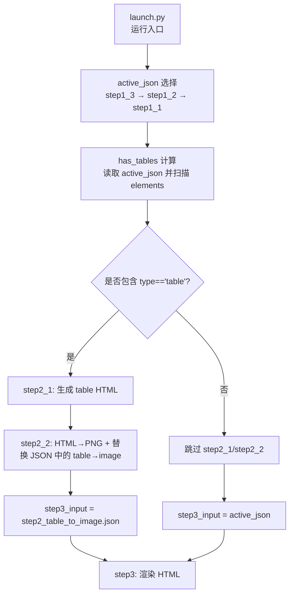
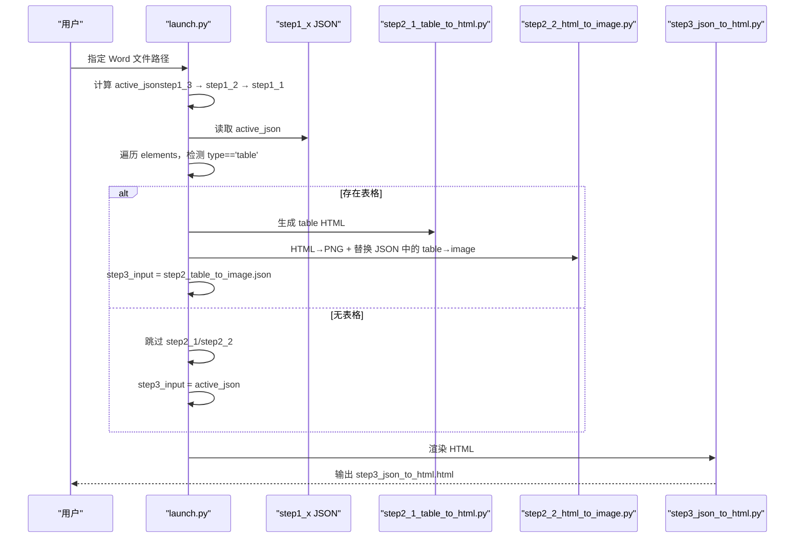
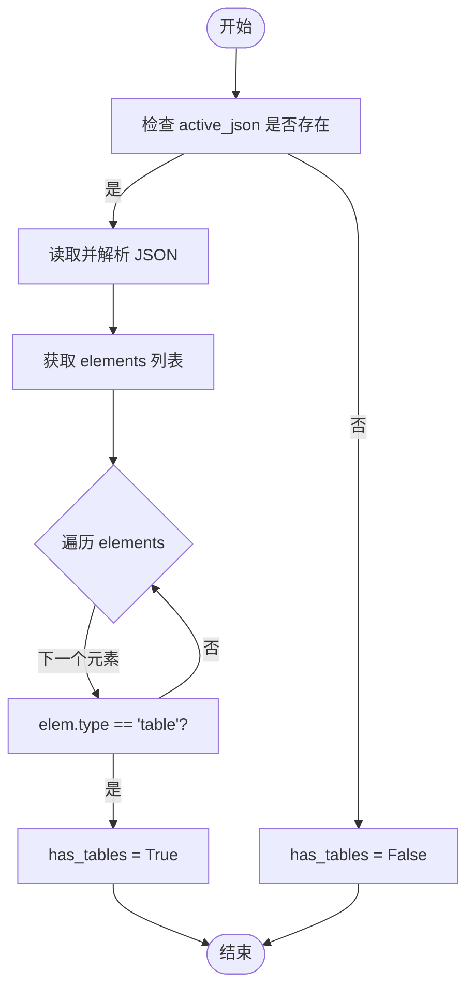
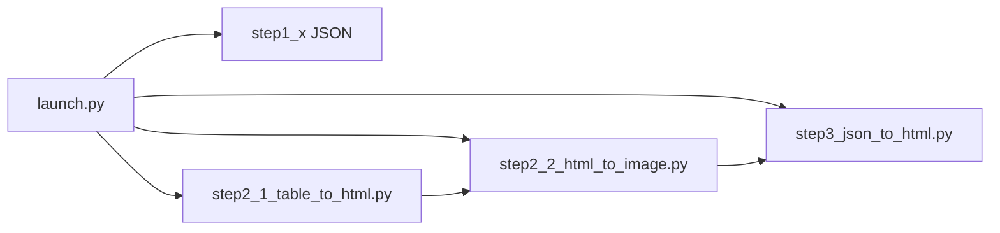

# 动态输入检测

<cite>
**本文引用的文件**
- [launch.py](file://launch.py)
- [step3_json_to_html.py](file://step3_json_to_html.py)
- [step2_1_table_to_html.py](file://step2_1_table_to_html.py)
- [step2_2_html_to_image.py](file://step2_2_html_to_image.py)
- [config.py](file://config.py)
- [content_instance/content_20260708_1/process/step1_3_bold_paragraphs.json](file://content_instance/content_20260708_1/process/step1_3_bold_paragraphs.json)
</cite>

## 目录
1. [简介](#简介)
2. [项目结构](#项目结构)
3. [核心组件](#核心组件)
4. [架构总览](#架构总览)
5. [详细组件分析](#详细组件分析)
6. [依赖关系分析](#依赖关系分析)
7. [性能考量](#性能考量)
8. [故障排查指南](#故障排查指南)
9. [结论](#结论)
10. [附录](#附录)

## 简介
本文聚焦 content_board 的“动态输入检测机制”，即流水线在 step3 之前自动判断是否存在表格，并据此选择 step3 的输入 JSON。该机制包含：
- active_json 的回退策略（step1_3 → step1_2 → step1_1）
- has_tables 标志的计算过程（JSON 解析、elements 遍历、type == 'table' 判定）
- step3_input 的选择逻辑（有表格走 step2 输出，无表格回退到 active_json）
- 文件路径验证与错误处理策略
- 调试技巧与常见问题解决方案

## 项目结构
本项目的流水线由 launch.py 统一编排，各步骤脚本按需执行。动态输入检测的关键逻辑集中在 launch.py 中，涉及以下关键路径与产物：
- process 目录：存放中间 JSON/HTML 产物
- table 子目录：存放表格 HTML/PNG 截图
- step1_x JSON：不同阶段的段落/表格数据
- step2_table_to_image.json：最终用于渲染的 JSON（可能已将 table 替换为 image）
- step3_json_to_html.html：最终渲染的 HTML

图表来源
- [launch.py:104-144](file://launch.py#L104-L144)
- [step2_1_table_to_html.py:74-85](file://step2_1_table_to_html.py#L74-L85)
- [step2_2_html_to_image.py:120-173](file://step2_2_html_to_image.py#L120-L173)
- [step3_json_to_html.py:121-142](file://step3_json_to_html.py#L121-L142)

章节来源
- [launch.py:42-144](file://launch.py#L42-L144)

## 核心组件
- active_json 回退策略：根据 SKIP_STEP1_3 / SKIP_STEP1_2 的开关状态，按优先级选择最终的 step1 JSON 作为后续处理的输入。
- has_tables 检测：打开 active_json，解析 JSON，遍历 elements 数组，检查是否存在 type == 'table' 的元素。
- step3_input 选择：若存在表格则使用 step2 的输出（step2_table_to_image.json），否则直接使用 active_json。
- 文件路径验证：对输入 JSON、目录进行存在性校验；缺失时打印错误并退出或跳过相关步骤。
- 错误处理：对 JSON 解析失败、文件不存在、目录不存在等异常进行捕获与提示，保证流程健壮性。

章节来源
- [launch.py:104-144](file://launch.py#L104-L144)
- [step2_1_table_to_html.py:74-85](file://step2_1_table_to_html.py#L74-L85)
- [step2_2_html_to_image.py:120-173](file://step2_2_html_to_image.py#L120-L173)
- [step3_json_to_html.py:121-142](file://step3_json_to_html.py#L121-L142)

## 架构总览
下图展示从输入 Word 到最终 HTML 的完整流水线，以及动态输入检测在其中的位置与作用。

图表来源
- [launch.py:104-155](file://launch.py#L104-L155)
- [step2_1_table_to_html.py:74-85](file://step2_1_table_to_html.py#L74-L85)
- [step2_2_html_to_image.py:120-173](file://step2_2_html_to_image.py#L120-L173)
- [step3_json_to_html.py:121-142](file://step3_json_to_html.py#L121-L142)

## 详细组件分析

### active_json 回退策略
- 优先级顺序：
  - 若未跳过 step1_3，则 active_json = step1_3_bold_paragraphs.json
  - 否则若未跳过 step1_2，则 active_json = step1_2_split_paragraphs.json
  - 否则 active_json = step1_1_docx_to_json.json
- 目的：确保下游始终有一个可用的 step1 JSON，即使某些步骤被跳过也能继续执行。

章节来源
- [launch.py:104-111](file://launch.py#L104-L111)

### has_tables 检测算法
- 前提：active_json 文件存在
- 步骤：
  - 以 UTF-8 编码读取 active_json
  - 解析 JSON 得到 data
  - 获取 data['elements'] 列表（若不存在则为空列表）
  - 遍历 elements，检查每个元素的 type 字段是否为 'table'
  - 只要发现一个 table，has_tables 即为 True
- 复杂度：O(n)，n 为 elements 数量；空间 O(1)（仅维护布尔标志）

图表来源
- [launch.py:112-118](file://launch.py#L112-L118)

章节来源
- [launch.py:112-118](file://launch.py#L112-L118)

### step3_input 选择逻辑
- 若 has_tables 为 True：
  - step3_input = step2_table_to_image.json（由 step2_2 生成，table 已替换为 image）
- 若 has_tables 为 False：
  - step3_input = active_json（直接使用该阶段 JSON）
- 目的：确保 step3 始终拿到正确的输入 JSON，避免在无表格场景下误读不存在的 step2 产物。

章节来源
- [launch.py:142-144](file://launch.py#L142-L144)

### 文件路径验证机制
- 输入文件存在性检查：
  - 对 active_json 进行 os.path.isfile 检查，不存在则跳过表格检测并默认 has_tables=False
  - 对 step2_1/step2_2 的输入 JSON 和 table 目录进行存在性检查，缺失时打印错误并退出或跳过
- 目录创建：
  - 自动创建 process 和 table 目录，确保后续写入路径有效
- 典型错误处理：
  - JSON 文件不存在：打印 [ERROR] 并 sys.exit(1)
  - 目录不存在：打印 [ERROR] 并 sys.exit(1)
  - 无表格 HTML 文件：step2_2 将原样复制 active_json 为 step2_table_to_image.json，供下游继续使用

章节来源
- [launch.py:44-60](file://launch.py#L44-L60)
- [step2_1_table_to_html.py:74-85](file://step2_1_table_to_html.py#L74-L85)
- [step2_2_html_to_image.py:120-142](file://step2_2_html_to_image.py#L120-L142)
- [step3_json_to_html.py:121-124](file://step3_json_to_html.py#L121-L124)

### 错误处理策略
- 结构化日志：
  - 使用 [INFO]/[WARN]/[ERROR] 前缀，便于快速定位问题
- 容错设计：
  - 无表格时，step2_2 会复制 active_json 为 step2_table_to_image.json，保证下游一致性
  - 截图失败时记录失败清单并继续处理其他表格，最后汇总结果
- 资源清理：
  - 截图完成后尝试清理残留 Chrome 进程，避免系统资源泄漏

章节来源
- [step2_2_html_to_image.py:145-173](file://step2_2_html_to_image.py#L145-L173)
- [step2_2_html_to_image.py:175-211](file://step2_2_html_to_image.py#L175-L211)

### 数据结构与示例
- JSON 顶层结构：
  - file_name：源文件名
  - total_elements：元素总数
  - elements：元素数组，每个元素包含 type 及对应字段
- 表格元素示例：
  - type='table'，包含 row_count、col_count、data 等字段
- 段落/图片元素示例：
  - type='paragraph'，包含 heading_level、runs 等字段
  - type='image'，包含 image_path 等字段

章节来源
- [content_instance/content_20260708_1/process/step1_3_bold_paragraphs.json:1-200](file://content_instance/content_20260708_1/process/step1_3_bold_paragraphs.json#L1-L200)

## 依赖关系分析
- launch.py 作为编排器，依赖各步骤脚本的 main 函数
- step2_1 与 step2_2 共同作用于 table 目录与 JSON 的转换
- step3 依赖最终 JSON（可能是 step2 输出或 active_json）

图表来源
- [launch.py:104-155](file://launch.py#L104-L155)
- [step2_1_table_to_html.py:74-85](file://step2_1_table_to_html.py#L74-L85)
- [step2_2_html_to_image.py:120-173](file://step2_2_html_to_image.py#L120-L173)
- [step3_json_to_html.py:121-142](file://step3_json_to_html.py#L121-L142)

章节来源
- [launch.py:104-155](file://launch.py#L104-L155)

## 性能考量
- has_tables 检测为线性扫描，时间复杂度 O(n)，对常规文档规模影响可忽略
- 表格截图（step2_2）可能受外部浏览器/渲染引擎性能影响，建议：
  - 控制并发截图数量
  - 合理设置超时与重试策略
  - 及时清理残留进程，避免内存泄漏

## 故障排查指南
- 现象：step3 报错 JSON 文件不存在
  - 检查 active_json 是否正确生成，确认 skip 配置与回退逻辑
  - 查看 launch.py 中 active_json 选择分支与 has_tables 计算
- 现象：无表格但 step2 仍被执行
  - 检查 has_tables 计算逻辑，确认 elements 数组中存在 type=='table' 的元素
  - 查看 JSON 样例，确认数据结构是否符合预期
- 现象：step2_2 截图失败
  - 查看失败清单与日志，确认 HTML 文件是否生成成功
  - 检查系统环境（Chrome/渲染引擎）是否正常启动
- 现象：step3 渲染异常
  - 确认 step3_input 指向的 JSON 是否包含有效的 elements 数组
  - 检查模板文件路径与占位符 {{BODY_PLACEHOLDER}} 是否正确

章节来源
- [launch.py:104-155](file://launch.py#L104-L155)
- [step2_2_html_to_image.py:145-173](file://step2_2_html_to_image.py#L145-L173)
- [step3_json_to_html.py:121-142](file://step3_json_to_html.py#L121-L142)

## 结论
动态输入检测通过 active_json 回退与 has_tables 判定，确保了 step3 在不同场景下的输入稳定性。配合完善的文件路径验证与错误处理策略，流水线能够在有无表格的情况下均可靠运行。建议在大规模文档处理时关注截图性能与资源清理，进一步提升整体效率与稳定性。

## 附录
- 全局配置（如 API、微信公众号参数）位于 config.py，不影响动态输入检测的核心逻辑，但会影响后续推送与上传步骤
- 如需调整段落拆分阈值或重试次数，可在相应步骤脚本或配置文件中修改

章节来源
- [config.py:1-39](file://config.py#L1-L39)