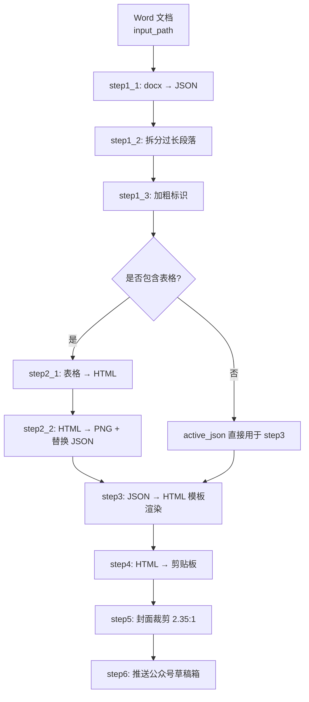
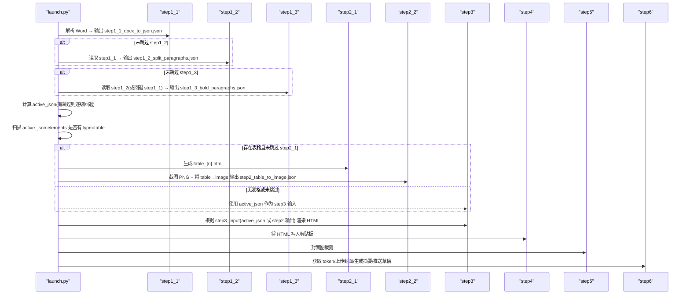
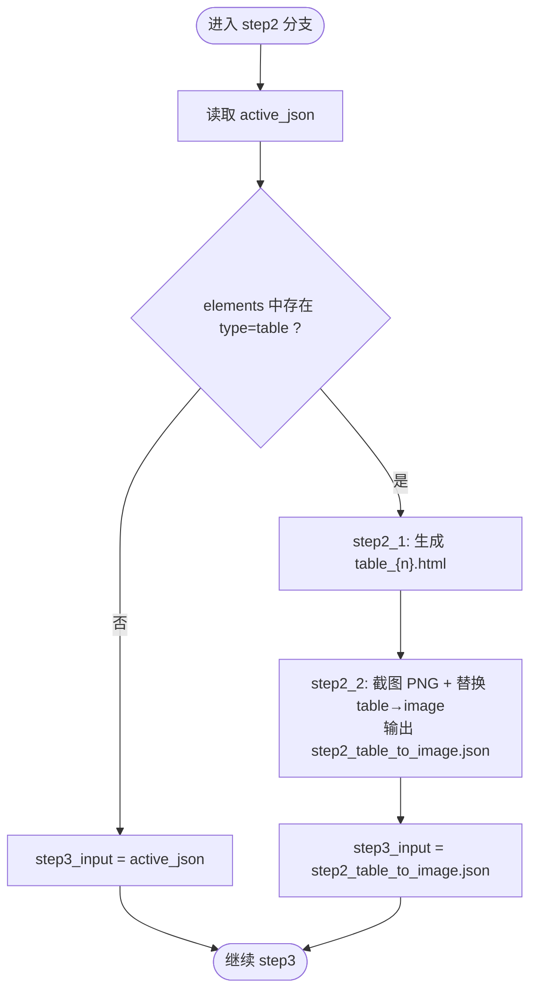
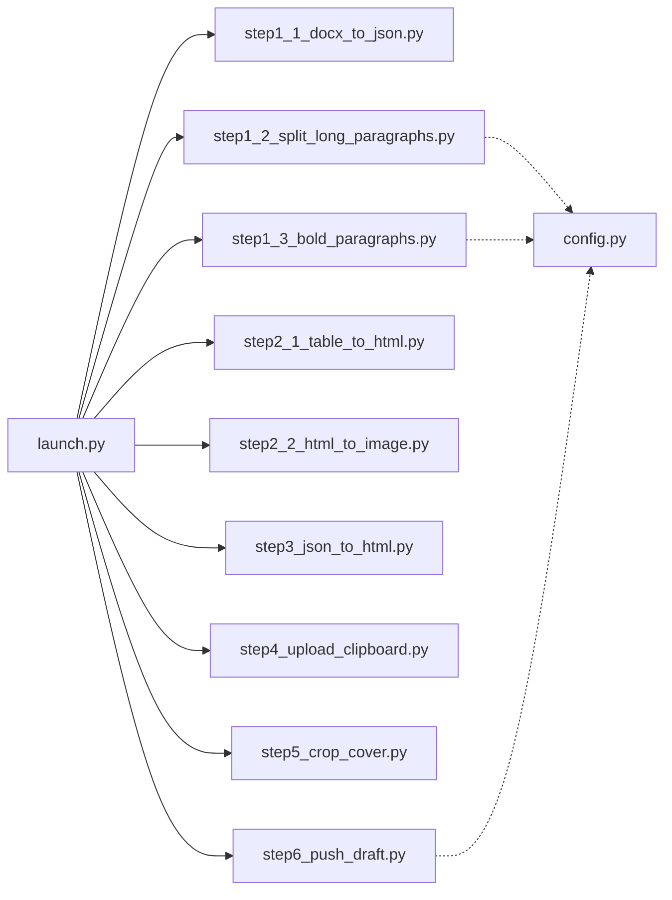

# 数据流管理

<cite>
**本文引用的文件**   
- [config.py](file://config.py)
- [launch.py](file://launch.py)
- [step1_1_docx_to_json.py](file://step1_1_docx_to_json.py)
- [step1_2_split_long_paragraphs.py](file://step1_2_split_long_paragraphs.py)
- [step1_3_bold_paragraphs.py](file://step1_3_bold_paragraphs.py)
- [step2_1_table_to_html.py](file://step2_1_table_to_html.py)
- [step2_2_html_to_image.py](file://step2_2_html_to_image.py)
- [step3_json_to_html.py](file://step3_json_to_html.py)
- [step4_upload_clipboard.py](file://step4_upload_clipboard.py)
- [step5_crop_cover.py](file://step5_crop_cover.py)
- [step6_push_draft.py](file://step6_push_draft.py)
</cite>

## 目录
1. [简介](#简介)
2. [项目结构](#项目结构)
3. [核心组件](#核心组件)
4. [架构总览](#架构总览)
5. [详细组件分析](#详细组件分析)
6. [依赖关系分析](#依赖关系分析)
7. [性能与可靠性](#性能与可靠性)
8. [故障排查指南](#故障排查指南)
9. [结论](#结论)
10. [附录：关键路径与变量说明](#附录关键路径与变量说明)

## 简介
本文件聚焦 content_board 的数据流管理机制，系统性梳理从 Word 文档到微信公众号草稿箱的端到端处理链路。重点包括：
- 步骤间 JSON 文件的读写与路径管理策略
- active_json 变量的生命周期与作用域
- 不同跳过场景下的数据流向与回退逻辑
- process_dir 与 table_dir 的目录结构与组织策略
- step3_input 的选择逻辑（基于表格检测的动态调整）
- 数据完整性校验与错误恢复机制
- 数据流监控与调试方法，确保可追溯性与可靠性

## 项目结构
流水线由 launch.py 统一编排，各步骤脚本以“输入/输出文件”为契约进行解耦协作。每个内容实例位于 content_instance/<实例名>/process 下，所有中间产物均落盘，便于回溯与断点续跑。

图表来源
- [launch.py:42-193](file://launch.py#L42-L193)
- [step1_1_docx_to_json.py:190-233](file://step1_1_docx_to_json.py#L190-L233)
- [step1_2_split_long_paragraphs.py:198-301](file://step1_2_split_long_paragraphs.py#L198-L301)
- [step1_3_bold_paragraphs.py:207-330](file://step1_3_bold_paragraphs.py#L207-L330)
- [step2_1_table_to_html.py:74-118](file://step2_1_table_to_html.py#L74-L118)
- [step2_2_html_to_image.py:120-211](file://step2_2_html_to_image.py#L120-L211)
- [step3_json_to_html.py:121-143](file://step3_json_to_html.py#L121-L143)
- [step4_upload_clipboard.py:436-476](file://step4_upload_clipboard.py#L436-L476)
- [step5_crop_cover.py:174-196](file://step5_crop_cover.py#L174-L196)
- [step6_push_draft.py:276-397](file://step6_push_draft.py#L276-L397)

章节来源
- [launch.py:42-193](file://launch.py#L42-L193)

## 核心组件
- 配置中心：全局 API、重试次数、分段阈值、微信公众号参数等集中管理
- 流水线编排器：负责路径派生、步骤调度、跳过控制、动态选择输入源
- 数据处理步骤：按阶段产出中间 JSON/HTML/PNG，并保证幂等与可重入
- 外部集成：大模型接口、Selenium+Chrome 截图、Windows 剪贴板写入、微信公众号 API

章节来源
- [config.py:1-39](file://config.py#L1-L39)
- [launch.py:28-193](file://launch.py#L28-L193)

## 架构总览
下图展示数据在各步骤间的流转与文件落地位置，以及关键变量 active_json 和 step3_input 的作用范围与选择逻辑。

图表来源
- [launch.py:70-193](file://launch.py#L70-L193)
- [step1_1_docx_to_json.py:190-233](file://step1_1_docx_to_json.py#L190-L233)
- [step1_2_split_long_paragraphs.py:198-301](file://step1_2_split_long_paragraphs.py#L198-L301)
- [step1_3_bold_paragraphs.py:207-330](file://step1_3_bold_paragraphs.py#L207-L330)
- [step2_1_table_to_html.py:74-118](file://step2_1_table_to_html.py#L74-L118)
- [step2_2_html_to_image.py:120-211](file://step2_2_html_to_image.py#L120-L211)
- [step3_json_to_html.py:121-143](file://step3_json_to_html.py#L121-L143)
- [step4_upload_clipboard.py:436-476](file://step4_upload_clipboard.py#L436-L476)
- [step5_crop_cover.py:174-196](file://step5_crop_cover.py#L174-L196)
- [step6_push_draft.py:276-397](file://step6_push_draft.py#L276-L397)

## 详细组件分析

### 路径与目录管理策略
- 根路径派生
  - input_dir：输入 Word 所在目录
  - process_dir：input_dir/process，存放所有中间产物
  - table_dir：process_dir/table，存放表格 HTML 与截图 PNG
- 关键文件命名约定
  - step1_1_docx_to_json.json：初始结构化元素
  - step1_2_split_paragraphs.json：拆分后的段落
  - step1_3_bold_paragraphs.json：加粗标记后的段落
  - step2_table_to_image.json：表格替换为图片引用后的最终 JSON
  - step3_json_to_html.html：最终渲染 HTML
  - step4_upload_clipboard.html：内联样式 HTML（供后续复用）
  - step5_crop_cover.*：封面裁剪结果
  - step6_thumb_media_id.txt：封面 media_id 缓存
- 目录创建
  - 首次运行自动创建 process 与 table 目录，避免重复初始化

章节来源
- [launch.py:48-61](file://launch.py#L48-L61)
- [step1_1_docx_to_json.py:198-206](file://step1_1_docx_to_json.py#L198-L206)
- [step2_1_table_to_html.py:79-83](file://step2_1_table_to_html.py#L79-L83)
- [step2_2_html_to_image.py:120-142](file://step2_2_html_to_image.py#L120-L142)
- [step4_upload_clipboard.py:455-462](file://step4_upload_clipboard.py#L455-L462)
- [step5_crop_cover.py:188-196](file://step5_crop_cover.py#L188-L196)
- [step6_push_draft.py:313-327](file://step6_push_draft.py#L313-L327)

### active_json 的生命周期与作用域
- 作用域：仅在 launch.run_pipeline 函数内部有效，作为“当前活跃 JSON”在后续步骤中传递
- 赋值逻辑（考虑跳过）
  - 若未跳过 step1_3：active_json = step1_3_json
  - 否则若未跳过 step1_2：active_json = step1_2_json
  - 否则：active_json = step1_1_json
- 用途
  - 用于检测是否存在表格元素
  - 若无表格，直接作为 step3 的输入；若有表格，经 step2 处理后得到 step2_table_to_image.json 作为 step3 输入

章节来源
- [launch.py:104-111](file://launch.py#L104-L111)
- [launch.py:143-144](file://launch.py#L143-L144)

### 表格检测与 step3_input 选择逻辑
- 检测方式
  - 读取 active_json，遍历 elements，判断是否存在 type=table 的元素
- 分支决策
  - 存在表格且未跳过 step2_1/step2_2：执行 step2_1 生成 HTML，再执行 step2_2 截图并替换 JSON 中的 table 为 image，输出 step2_table_to_image.json
  - 不存在表格或跳过 step2_*：step3_input 直接使用 active_json
- 输出影响
  - step3 始终接收“最终可用的 JSON”，确保渲染流程稳定

图表来源
- [launch.py:112-144](file://launch.py#L112-L144)
- [step2_1_table_to_html.py:74-118](file://step2_1_table_to_html.py#L74-L118)
- [step2_2_html_to_image.py:120-211](file://step2_2_html_to_image.py#L120-L211)
- [step3_json_to_html.py:121-143](file://step3_json_to_html.py#L121-L143)

### 数据完整性验证与错误恢复
- 文本一致性校验（step1_2）
  - 对拆分结果拼接后与原文严格比对，不一致则保留原段落，防止数据丢失
- 模型调用容错（step1_2/step1_3/step6）
  - 统一的 call_model 封装，支持多次重试与指数等待
  - 失败时打印警告并回退到上游数据，不中断整体流程
- 截图超时保护（step2_2）
  - 通过线程定时器强制终止 Chrome/chromedriver，避免进程泄漏
  - 失败记录并继续处理其他表格
- 剪贴板写入健壮性（step4）
  - 打开剪贴板带重试，空数据格式跳过，异常时释放资源
- 封面图压缩与尺寸限制（step5）
  - JPEG quality 二分搜索，非 JPEG 逐步缩小分辨率，确保不超过平台大小限制
- 标题字节长度保护（step6）
  - 截断至 UTF-8 字节上限，避免 API 拒绝

章节来源
- [step1_2_split_long_paragraphs.py:264-272](file://step1_2_split_long_paragraphs.py#L264-L272)
- [step1_2_split_long_paragraphs.py:80-103](file://step1_2_split_long_paragraphs.py#L80-L103)
- [step1_3_bold_paragraphs.py:73-96](file://step1_3_bold_paragraphs.py#L73-L96)
- [step2_2_html_to_image.py:64-101](file://step2_2_html_to_image.py#L64-L101)
- [step4_upload_clipboard.py:371-431](file://step4_upload_clipboard.py#L371-L431)
- [step5_crop_cover.py:59-107](file://step5_crop_cover.py#L59-L107)
- [step6_push_draft.py:88-102](file://step6_push_draft.py#L88-L102)

### 数据流监控与调试方法
- 控制台日志
  - 每步均有进度与统计信息，便于定位问题
- 中间产物检查
  - 查看 process 目录下各 JSON/HTML/PNG 文件，确认数据形态是否符合预期
- 内联样式 HTML 保存（step4）
  - 自动生成 step4_upload_clipboard.html，便于快速预览渲染效果
- 封面 media_id 缓存（step6）
  - 缓存到 step6_thumb_media_id.txt，避免重复上传
- 调试开关
  - 通过 SKIP_* 标志选择性跳过步骤，快速复现特定环节

章节来源
- [step4_upload_clipboard.py:455-462](file://step4_upload_clipboard.py#L455-L462)
- [step6_push_draft.py:313-327](file://step6_push_draft.py#L313-L327)
- [launch.py:28-38](file://launch.py#L28-L38)

## 依赖关系分析
- 模块耦合
  - launch.py 作为编排器，仅通过文件路径与各步骤交互，低耦合高内聚
  - 各步骤脚本独立可运行，具备自描述输入/输出契约
- 外部依赖
  - requests：大模型与微信公众号 API 调用
  - selenium + Chrome：表格截图
  - ctypes + Windows API：剪贴板写入
  - numpy + opencv-python：封面裁剪与压缩
- 潜在循环依赖
  - 无循环导入，均为单向调用

图表来源
- [launch.py:70-193](file://launch.py#L70-L193)
- [config.py:1-39](file://config.py#L1-L39)

章节来源
- [launch.py:70-193](file://launch.py#L70-L193)
- [config.py:1-39](file://config.py#L1-L39)

## 性能与可靠性
- 并行与串行
  - 流水线串行执行，确保数据顺序正确；表格截图采用单进程逐张处理，避免并发竞争
- 超时与重试
  - 模型调用与截图均设置超时与重试，提升鲁棒性
- 资源清理
  - 截图完成后主动终止残留进程，避免资源泄露
- 文件大小控制
  - 封面图质量自适应压缩，满足平台限制

[本节为通用指导，无需具体文件引用]

## 故障排查指南
- 常见问题
  - 模型调用失败：检查网络与 API 配置，查看重试日志
  - 截图失败：确认 Chrome 安装与环境变量，观察超时日志
  - 剪贴板写入失败：检查权限与系统剪贴板占用情况
  - 封面图过大：查看压缩日志，必要时手动调整原始图片
- 定位手段
  - 查看对应步骤输出的中间文件
  - 启用相应 SKIP_* 标志，隔离问题步骤
  - 使用 step4 生成的内联样式 HTML 进行可视化验证

章节来源
- [step1_2_split_long_paragraphs.py:80-103](file://step1_2_split_long_paragraphs.py#L80-L103)
- [step2_2_html_to_image.py:64-101](file://step2_2_html_to_image.py#L64-L101)
- [step4_upload_clipboard.py:371-431](file://step4_upload_clipboard.py#L371-L431)
- [step5_crop_cover.py:59-107](file://step5_crop_cover.py#L59-L107)

## 结论
content_board 的数据流管理以“文件即状态”为核心，通过明确的中间产物与路径约定实现步骤解耦与可重入。active_json 与 step3_input 的设计确保了在不同跳过场景下的稳健数据流向。完善的校验与恢复机制、丰富的调试输出与中间产物，共同保障了数据处理流程的可追溯性与可靠性。

[本节为总结性内容，无需具体文件引用]

## 附录：关键路径与变量说明
- 关键路径
  - process_dir：input_dir/process
  - table_dir：process_dir/table
  - step1_1_json：process_dir/step1_1_docx_to_json.json
  - step1_2_json：process_dir/step1_2_split_paragraphs.json
  - step1_3_json：process_dir/step1_3_bold_paragraphs.json
  - step2_json：process_dir/step2_table_to_image.json
  - step3_html：process_dir/step3_json_to_html.html
  - step4_inline_html：process_dir/step4_upload_clipboard.html
  - step5_cover：process_dir/step5_crop_cover.*
  - step6_cache：process_dir/step6_thumb_media_id.txt
- 关键变量
  - active_json：当前活跃 JSON，用于表格检测与下游输入选择
  - step3_input：step3 的实际输入 JSON，可能来自 step2 或 active_json

章节来源
- [launch.py:48-61](file://launch.py#L48-L61)
- [launch.py:104-111](file://launch.py#L104-L111)
- [launch.py:143-144](file://launch.py#L143-L144)
- [step4_upload_clipboard.py:455-462](file://step4_upload_clipboard.py#L455-L462)
- [step6_push_draft.py:313-327](file://step6_push_draft.py#L313-L327)