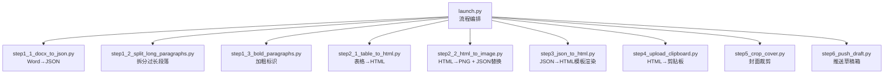
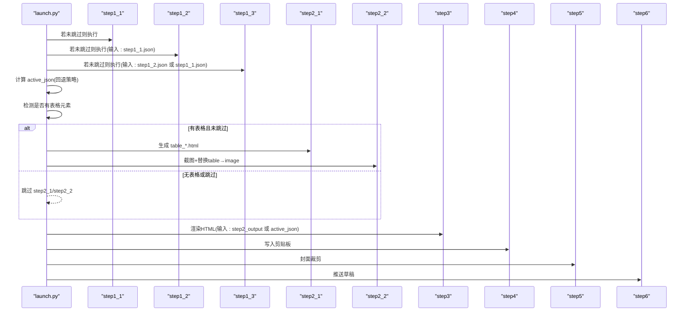
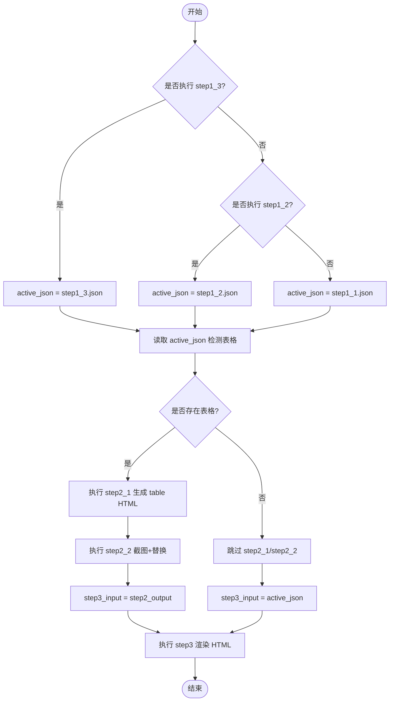
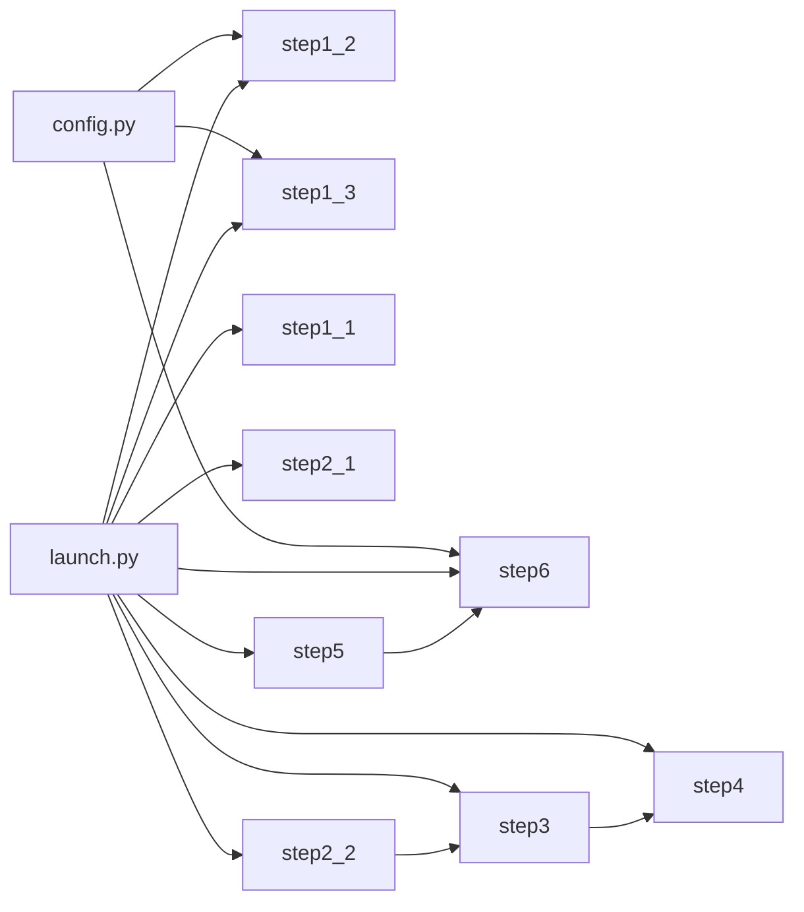

# 步骤控制机制

<cite>
**本文引用的文件**   
- [launch.py](file://launch.py)
- [config.py](file://config.py)
- [step1_1_docx_to_json.py](file://step1_1_docx_to_json.py)
- [step1_2_split_long_paragraphs.py](file://step1_2_split_long_paragraphs.py)
- [step1_3_bold_paragraphs.py](file://step1_3_bold_paragraphs.py)
- [step2_1_table_to_html.py](file://step2_1_table_to_html.py)
- [step2_2_html_to_image.py](file://step2_2_html_to_image.py)
- [step3_json_to_html.py](file://step3_json_to_html.py)
- [step4_upload_clipboard.py](file://step4_upload_clipboard.py)
- [step5_crop_cover.py](file://step5_crop_cover.py)
- [step6_push_draft.py](file://step6_push_draft.py)
</cite>

## 目录
1. [简介](#简介)
2. [项目结构](#项目结构)
3. [核心组件](#核心组件)
4. [架构总览](#架构总览)
5. [详细组件分析](#详细组件分析)
6. [依赖关系分析](#依赖关系分析)
7. [性能与健壮性](#性能与健壮性)
8. [故障排查指南](#故障排查指南)
9. [结论](#结论)
10. [附录：常见跳过场景配置示例](#附录常见跳过场景配置示例)

## 简介
本文件聚焦于 content_board 的“步骤控制机制”，系统性说明以下要点：
- 配置驱动的跳过系统：全局标志 SKIP_STEP1_1 到 SKIP_STEP6 的作用与控制逻辑
- 动态输入检测：表格存在性检查、step3 输入文件的自动选择策略
- active_json 变量的回退策略与数据传递机制
- 条件执行模式与最佳实践
- 错误传播与恢复机制，确保部分步骤失败时的系统健壮性

## 项目结构
流水线由 launch.py 统一编排，各 step 脚本以 JSON/HTML 为中间产物进行解耦。关键路径约定如下：
- process 目录：存放所有中间产物（JSON/HTML/图片）
- table 子目录：存放表格 HTML 及截图 PNG
- images 子目录：存放从 Word 提取的图片

图表来源
- [launch.py:42-188](file://launch.py#L42-L188)

章节来源
- [launch.py:1-201](file://launch.py#L1-L201)

## 核心组件
- 全局配置与常量：API、重试次数、阈值等集中在 config.py
- 流程编排器：launch.py 负责按顺序调用各 step，并基于全局标志和运行时状态决定执行或跳过
- 步骤模块：每个 step 独立可运行，通过标准输入输出文件协作

章节来源
- [config.py:1-39](file://config.py#L1-L39)
- [launch.py:28-39](file://launch.py#L28-L39)

## 架构总览
下图展示了步骤间的依赖关系、数据流向以及条件分支点（如表格检测、active_json 回退）。

图表来源
- [launch.py:70-188](file://launch.py#L70-L188)
- [step2_2_html_to_image.py:175-211](file://step2_2_html_to_image.py#L175-L211)
- [step3_json_to_html.py:121-143](file://step3_json_to_html.py#L121-L143)

## 详细组件分析

### 配置驱动的跳过系统（SKIP_STEP*）
- 全局标志定义在 launch.py 顶部，默认值可按需调整
- 每个步骤入口前判断对应标志，True 表示跳过，False 表示执行
- 典型标志：
  - SKIP_STEP1_1：是否跳过 Word→JSON
  - SKIP_STEP1_2：是否跳过长段落拆分
  - SKIP_STEP1_3：是否跳过加粗标识
  - SKIP_STEP2_1：是否跳过表格→HTML
  - SKIP_STEP2_2：是否跳过 HTML→PNG + JSON 替换
  - SKIP_STEP3：是否跳过 JSON→HTML 渲染
  - SKIP_STEP4：是否跳过 HTML→剪贴板
  - SKIP_STEP5：是否跳过封面裁剪
  - SKIP_STEP6：是否跳过推送草稿

控制逻辑要点：
- 使用 if not SKIP_* 的模式驱动执行
- 对 step1_3 的输入源根据是否跳过 step1_2 做条件选择
- 下游步骤根据 has_tables 与对应 SKIP 标志组合决定是否执行

章节来源
- [launch.py:28-39](file://launch.py#L28-L39)
- [launch.py:70-102](file://launch.py#L70-L102)
- [launch.py:121-141](file://launch.py#L121-L141)
- [launch.py:146-188](file://launch.py#L146-L188)

### 动态输入检测与 step3 输入自动选择
- active_json 回退策略：
  - 优先使用 step1_3 的输出（如果未跳过 step1_3）
  - 否则回退到 step1_2 的输出（如果未跳过 step1_2）
  - 最终回退到 step1_1 的输出
- 表格存在性检测：
  - 读取 active_json，遍历 elements，判断是否存在 type=table 的元素
  - 若无表格，打印提示并跳过 step2_1 与 step2_2
- step3 输入选择：
  - 若有表格且 step2 已执行，则使用 step2 的输出（包含 image 替换）
  - 若无表格或 step2 被跳过，则直接使用 active_json

图表来源
- [launch.py:104-144](file://launch.py#L104-L144)

章节来源
- [launch.py:104-144](file://launch.py#L104-L144)

### 步骤间依赖关系与数据传递
- 文件契约：
  - step1_1 输出：process/step1_1_docx_to_json.json
  - step1_2 输出：process/step1_2_split_paragraphs.json
  - step1_3 输出：process/step1_3_bold_paragraphs.json
  - step2_1 输出：process/table/table_{n}.html
  - step2_2 输出：process/step2_table_to_image.json（将 table 替换为 image）
  - step3 输出：process/step3_json_to_html.html
  - step4 输出：Windows 剪贴板（同时保存内联样式 HTML 供后续复用）
  - step5 输出：process/step5_crop_cover.*
  - step6 输入：上述产物；推送草稿至公众号
- 数据流：
  - 文本结构化：docx → JSON（段落/表格/图片）
  - 文本优化：LLM 拆分与加粗标注
  - 表格处理：JSON → HTML → PNG，并在 JSON 中用 image 引用替换 table
  - 页面渲染：JSON → HTML 模板
  - 平台适配：HTML → 剪贴板（base64 内嵌图片）
  - 素材准备：封面裁剪
  - 发布：上传封面、生成摘要、推送草稿

章节来源
- [step1_1_docx_to_json.py:190-226](file://step1_1_docx_to_json.py#L190-L226)
- [step1_2_split_long_paragraphs.py:198-301](file://step1_2_split_long_paragraphs.py#L198-L301)
- [step1_3_bold_paragraphs.py:207-330](file://step1_3_bold_paragraphs.py#L207-L330)
- [step2_1_table_to_html.py:74-118](file://step2_1_table_to_html.py#L74-L118)
- [step2_2_html_to_image.py:120-211](file://step2_2_html_to_image.py#L120-L211)
- [step3_json_to_html.py:121-143](file://step3_json_to_html.py#L121-L143)
- [step4_upload_clipboard.py:436-476](file://step4_upload_clipboard.py#L436-L476)
- [step5_crop_cover.py:174-196](file://step5_crop_cover.py#L174-L196)
- [step6_push_draft.py:276-397](file://step6_push_draft.py#L276-L397)

### 条件执行的实现模式与最佳实践
- 模式
  - 前置校验：文件存在性、格式合法性（例如 .docx）
  - 条件分支：基于全局标志与运行时检测结果（如 has_tables）
  - 回退策略：当上游步骤被跳过时，自动选择可用的最新产物作为输入
- 最佳实践
  - 保持中间产物命名稳定，便于下游定位
  - 对外部依赖（模型 API、浏览器截图）增加重试与超时保护
  - 对异常路径提供明确日志与降级行为（保留原数据、跳过非关键步骤）

章节来源
- [launch.py:42-66](file://launch.py#L42-L66)
- [launch.py:112-144](file://launch.py#L112-L144)
- [step1_1_docx_to_json.py:190-196](file://step1_1_docx_to_json.py#L190-L196)
- [step2_2_html_to_image.py:120-142](file://step2_2_html_to_image.py#L120-L142)

### 错误传播与恢复机制
- 网络请求（大模型 API）
  - 统一封装 call_model，支持最大重试次数与指数退避等待
  - 解析失败或返回无效结果时，记录警告并回退到原始数据
- 浏览器截图（Chrome/Selenium）
  - 设置超时监控线程，超时后强制终止 Chrome 进程，避免卡死
  - 单个 HTML 截图失败不影响其他文件继续处理
- 文件与路径
  - 缺失文件或目录时打印错误并退出（关键路径），或跳过并给出提示（可选路径）
- 剪贴板写入
  - 多次尝试打开剪贴板，失败则报错退出
  - 本地图片转 base64 时，找不到图片会发出警告但继续处理

章节来源
- [step1_2_split_long_paragraphs.py:80-103](file://step1_2_split_long_paragraphs.py#L80-L103)
- [step1_3_bold_paragraphs.py:73-96](file://step1_3_bold_paragraphs.py#L73-L96)
- [step2_2_html_to_image.py:40-101](file://step2_2_html_to_image.py#L40-L101)
- [step4_upload_clipboard.py:371-431](file://step4_upload_clipboard.py#L371-L431)

## 依赖关系分析
- 模块耦合
  - launch.py 与各 step 之间松耦合，仅通过文件路径约定交互
  - step 内部对第三方库（requests、selenium、opencv、ctypes）的依赖清晰
- 外部集成点
  - 大模型 API：用于段落拆分、加粗标注、摘要生成
  - 微信公众号 API：获取 access_token、上传永久素材、新增草稿
  - 操作系统剪贴板：Windows API 写入多格式数据
  - 浏览器截图：Selenium + Chrome 无头模式

图表来源
- [config.py:1-39](file://config.py#L1-L39)
- [launch.py:42-188](file://launch.py#L42-L188)

章节来源
- [config.py:1-39](file://config.py#L1-L39)
- [launch.py:42-188](file://launch.py#L42-L188)

## 性能与健壮性
- 性能
  - 表格截图采用 headless Chrome，设置高清缩放与窗口移出屏幕，减少 UI 开销
  - 封面裁剪支持 JPEG quality 二分搜索与非 JPEG 分辨率缩放，兼顾质量与体积
- 健壮性
  - 模型调用具备重试与超时保护
  - 截图过程具备超时与进程清理，避免僵尸进程
  - 剪贴板写入具备多次重试与资源释放
  - 路径与编码问题通过安全打印与 UTF-8 读写缓解

[本节为通用指导，不直接分析具体文件]

## 故障排查指南
- 常见问题
  - 模型调用失败：检查网络、API 密钥与配额；查看重试日志
  - 截图失败或超时：确认 Chrome 安装与版本，检查系统权限与沙箱参数
  - 剪贴板写入失败：确认 Windows 环境与其他应用占用情况
  - 封面图缺失：确保 step5 已执行且输出文件存在
- 建议操作
  - 逐步启用步骤（关闭相应 SKIP 标志）定位问题
  - 检查 process 目录下中间产物是否存在且内容合理
  - 关注日志中的 [WARN]/[ERROR] 提示，结合文件路径定位

章节来源
- [step1_2_split_long_paragraphs.py:251-272](file://step1_2_split_long_paragraphs.py#L251-L272)
- [step2_2_html_to_image.py:146-169](file://step2_2_html_to_image.py#L146-L169)
- [step4_upload_clipboard.py:371-431](file://step4_upload_clipboard.py#L371-L431)
- [step6_push_draft.py:318-327](file://step6_push_draft.py#L318-L327)

## 结论
content_board 的步骤控制机制以 launch.py 为核心，通过全局 SKIP 标志与运行时检测（如表格存在性）实现灵活的条件执行。active_json 的回退策略确保了在部分步骤被跳过时，下游仍能获得可用输入。各 step 模块职责单一、产物规范，配合完善的错误处理与恢复机制，使整体流程具备良好的健壮性与可维护性。

[本节为总结，不直接分析具体文件]

## 附录：常见跳过场景配置示例
以下为常用场景的配置思路（修改 launch.py 顶部的 SKIP 标志）：
- 仅调试 step3 渲染
  - 设置 SKIP_STEP1_1=False, SKIP_STEP1_2=True, SKIP_STEP1_3=True, SKIP_STEP2_1=True, SKIP_STEP2_2=True, SKIP_STEP3=False
  - 说明：使用已有 step1_1.json 作为 active_json，跳过表格处理，直接渲染
- 仅测试表格处理链路
  - 设置 SKIP_STEP1_1=False, SKIP_STEP1_2=True, SKIP_STEP1_3=True, SKIP_STEP2_1=False, SKIP_STEP2_2=False, SKIP_STEP3=True
  - 说明：生成 table HTML 与截图，但不渲染最终 HTML
- 仅推送到草稿箱（假设已有 step5 封面）
  - 设置 SKIP_STEP1_1=True, SKIP_STEP1_2=True, SKIP_STEP1_3=True, SKIP_STEP2_1=True, SKIP_STEP2_2=True, SKIP_STEP3=True, SKIP_STEP4=True, SKIP_STEP5=True, SKIP_STEP6=False
  - 说明：跳过全部预处理，直接执行 step6（需确保封面与必要 JSON 存在）

注意：
- 当跳过 step1_2 或 step1_3 时，active_json 会自动回退到更早的产物
- 当检测到无表格时，step2_1/step2_2 会被自动跳过，step3 输入将使用 active_json

章节来源
- [launch.py:28-39](file://launch.py#L28-L39)
- [launch.py:104-144](file://launch.py#L104-L144)