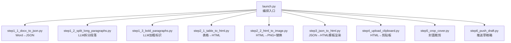
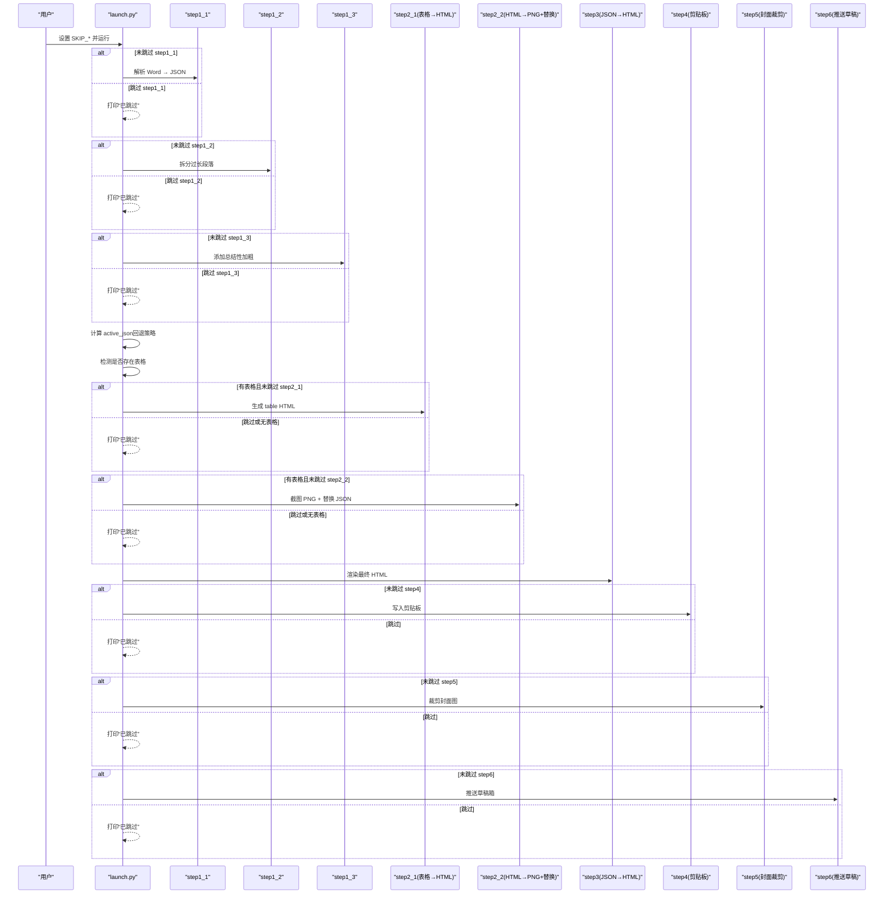
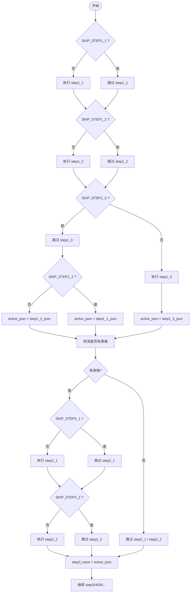
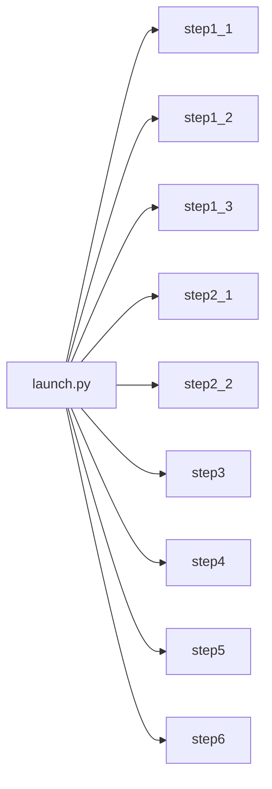

# 跳过控制系统

<cite>
**本文引用的文件**   
- [launch.py](file://launch.py)
- [config.py](file://config.py)
- [step1_1_docx_to_json.py](file://step1_1_docx_to_json.py)
- [step1_2_split_long_paragraphs.py](file://step1_2_split_long_paragraphs.py)
- [step1_3_bold_paragraphs.py](file://step1_3_bold_paragraphs.py)
- [step2_1_table_to_html.py](file://step2_1_table_to_html.py)
- [step2_2_html_to_image.py](file://step2_2_html_to_image.py)
- [step3_json_to_html.py](file://step3_json_to_html.py)
- [step4_upload_clipboard.py](file://step4_upload_clipboard.py)
- [step5_crop_cover.py](file://step5_crop_cover.py)
- [step6_push_draft.py](file://step6_push_draft.py)
</cite>

## 目录
1. [简介](#简介)
2. [项目结构](#项目结构)
3. [核心组件](#核心组件)
4. [架构总览](#架构总览)
5. [详细组件分析](#详细组件分析)
6. [依赖关系分析](#依赖关系分析)
7. [性能与优化建议](#性能与优化建议)
8. [故障排查指南](#故障排查指南)
9. [结论](#结论)
10. [附录：常见跳过场景配置示例](#附录常见跳过场景配置示例)

## 简介
本文件面向 content_board 的“跳过控制系统”，系统性说明全局标志 SKIP_STEP1_1 到 SKIP_STEP6 的配置机制、条件执行逻辑、步骤间依赖管理以及跳过后的行为。文档旨在帮助读者在不深入源码的情况下，也能正确配置并安全地跳过任意步骤，同时保证流水线在部分步骤被跳过时仍能正确运行。

## 项目结构
content_board 采用“按步骤拆分”的模块化设计，由一个统一的编排入口 launch.py 串联各步骤脚本。每个步骤独立负责单一职责，输出中间产物（JSON/HTML/PNG），供后续步骤消费。

图表来源
- [launch.py:1-201](file://launch.py#L1-L201)

章节来源
- [launch.py:1-201](file://launch.py#L1-L201)

## 核心组件
- 全局跳过标志：位于 launch.py 顶部，控制是否执行对应步骤。
- 条件执行模式：统一使用 if not SKIP_* 判断结构；当为 True 时打印“已跳过”，否则调用对应模块 main()。
- 动态输入选择：根据上游是否被跳过，自动选择下游步骤的输入 JSON/HTML 路径，确保链路不断裂。
- 表格存在性检测：若当前 JSON 无表格元素，则自动跳过 step2_1 和 step2_2，避免无效工作。

章节来源
- [launch.py:28-39](file://launch.py#L28-L39)
- [launch.py:70-181](file://launch.py#L70-L181)

## 架构总览
下图展示了跳过控制如何影响数据流与步骤执行顺序。

图表来源
- [launch.py:70-181](file://launch.py#L70-L181)

## 详细组件分析

### 全局跳过标志与条件执行模式
- 标志定义位置：launch.py 顶部集中声明，便于统一修改。
- 判断结构：所有步骤均采用 if not SKIP_* 的模式；True 表示跳过，False 表示执行。
- 打印输出：每个分支均包含明确的进度提示与“已跳过”日志，便于追踪实际执行路径。

章节来源
- [launch.py:28-39](file://launch.py#L28-L39)
- [launch.py:70-181](file://launch.py#L70-L181)

### 步骤功能与跳过后的行为
- step1_1（Word → JSON）
  - 功能：解析 .docx，提取段落、表格、图片，输出结构化 JSON。
  - 跳过行为：直接跳过解析，后续步骤将使用已有 JSON（需提前存在）。
  - 关键路径：process/step1_1_docx_to_json.json
- step1_2（LLM 拆分过长段落）
  - 功能：基于阈值对长段落进行语义拆分，输出新 JSON。
  - 跳过行为：保留原段落结构，不触发模型调用。
  - 关键路径：process/step1_2_split_paragraphs.json
- step1_3（LLM 添加总结性加粗）
  - 功能：识别总结/判断/序列表达，标记 bold。
  - 跳过行为：不修改 bold 字段，保持原文样式。
  - 关键路径：process/step1_3_bold_paragraphs.json
- step2_1（表格 → HTML）
  - 功能：从 JSON 中筛选表格，生成独立 HTML 文件。
  - 跳过行为：不生成 table HTML。
  - 关键路径：process/table/table_{n}.html
- step2_2（HTML → PNG + JSON 替换）
  - 功能：截图生成 PNG，并将 JSON 中的 table 元素替换为 image 引用。
  - 跳过行为：不进行截图与替换，下游仍可使用原始 JSON。
  - 关键路径：process/table/table_{n}.png, process/step2_table_to_image.json
- step3（JSON → HTML 模板渲染）
  - 功能：将段落、标题、图片渲染到模板，输出完整页面。
  - 跳过行为：不生成最终 HTML。
  - 关键路径：process/step3_json_to_html.html
- step4（HTML → 剪贴板）
  - 功能：展开样式、内联图片 base64、构建多格式数据写入 Windows 剪贴板。
  - 跳过行为：不写入剪贴板。
- step5（封面图片裁剪）
  - 功能：查找首张图片，按 2.35:1 比例裁剪并保存。
  - 跳过行为：不裁剪封面。
- step6（推送草稿箱）
  - 功能：获取 access_token、上传封面、生成摘要、推送草稿。
  - 跳过行为：不调用微信 API。

章节来源
- [step1_1_docx_to_json.py:1-233](file://step1_1_docx_to_json.py#L1-L233)
- [step1_2_split_long_paragraphs.py:1-311](file://step1_2_split_long_paragraphs.py#L1-L311)
- [step1_3_bold_paragraphs.py:1-340](file://step1_3_bold_paragraphs.py#L1-L340)
- [step2_1_table_to_html.py:1-125](file://step2_1_table_to_html.py#L1-L125)
- [step2_2_html_to_image.py:1-218](file://step2_2_html_to_image.py#L1-L218)
- [step3_json_to_html.py:1-149](file://step3_json_to_html.py#L1-L149)
- [step4_upload_clipboard.py:1-480](file://step4_upload_clipboard.py#L1-L480)
- [step5_crop_cover.py:1-203](file://step5_crop_cover.py#L1-L203)
- [step6_push_draft.py:1-404](file://step6_push_draft.py#L1-L404)

### 条件执行逻辑的实现模式
- 统一入口：launch.py 的 run_pipeline(input_path) 函数负责调度。
- 判断结构：if not SKIP_* 包裹每个步骤；True 时打印“已跳过”，False 时导入并调用对应模块的 main()。
- 输入回退策略：
  - 对于 step1_3，其输入优先使用 step1_2 的输出；若 step1_2 被跳过，则回退到 step1_1 的输出。
  - 对于下游步骤，通过 active_json 变量决定使用哪个 JSON 作为输入。
- 表格存在性检测：读取 active_json，检查 elements 中是否有 type=table；若无，则自动跳过 step2_1 与 step2_2。

图表来源
- [launch.py:92-144](file://launch.py#L92-L144)

章节来源
- [launch.py:92-144](file://launch.py#L92-L144)

### 步骤间的依赖关系与跳过控制
- 数据依赖链：
  - step1_1 → step1_2 → step1_3 → step2_1 → step2_2 → step3 → step4/5/6
- 回退策略：
  - 若 step1_2 被跳过，step1_3 的输入回退到 step1_1 的输出。
  - 若 step2_1/2_2 被跳过或无表格，step3 的输入直接使用 active_json。
- 外部依赖：
  - step2_2 依赖 Chrome/Selenium 环境。
  - step4 依赖 Windows 剪贴板 API。
  - step5 依赖 OpenCV。
  - step6 依赖网络与微信公众号 API。

章节来源
- [launch.py:104-144](file://launch.py#L104-L144)
- [step2_2_html_to_image.py:1-218](file://step2_2_html_to_image.py#L1-L218)
- [step4_upload_clipboard.py:1-480](file://step4_upload_clipboard.py#L1-L480)
- [step5_crop_cover.py:1-203](file://step5_crop_cover.py#L1-L203)
- [step6_push_draft.py:1-404](file://step6_push_draft.py#L1-L404)

## 依赖关系分析
- 模块耦合：
  - launch.py 与各步骤模块松耦合，仅通过 main() 接口交互。
  - 步骤之间通过文件系统（JSON/HTML/PNG）传递数据，降低运行时耦合。
- 外部依赖：
  - requests：用于大模型与微信 API 调用。
  - selenium/chromedriver：用于 HTML 截图。
  - opencv-python/numpy：用于图片处理。
  - ctypes：用于 Windows 剪贴板操作。
- 循环依赖：未发现循环 import；各步骤可独立运行。

图表来源
- [launch.py:1-201](file://launch.py#L1-L201)

章节来源
- [launch.py:1-201](file://launch.py#L1-L201)

## 性能与优化建议
- 减少不必要的 LLM 调用：
  - 若无需拆分或加粗，可直接跳过 step1_2/step1_3，节省时间与费用。
- 表格处理优化：
  - 无表格时自动跳过 step2_1/step2_2，避免启动浏览器与截图开销。
- 批量处理策略：
  - 在批量模式下，建议先只执行 step1_1，确认 JSON 质量后再按需启用后续步骤。
- 资源清理：
  - step2_2 会在失败或超时后强制终止 Chrome 进程，避免残留占用。

[本节提供通用指导，不直接分析具体文件]

## 故障排查指南
- 常见问题定位
  - 文件不存在：各步骤主函数会检查输入文件，缺失时会打印错误并退出。
  - 模型调用失败：step1_2/step1_3/step6 内置重试与降级逻辑，失败时保留原数据或跳过。
  - 截图失败：step2_2 捕获异常并记录失败清单，支持重试。
  - 剪贴板写入失败：step4 多次尝试打开剪贴板，失败时给出明确提示。
  - 封面图缺失：step5 找不到图片会直接跳过；step6 需要封面图时会报错。
- 调试建议
  - 逐步启用步骤：先设置大部分 SKIP_* 为 True，再逐个设为 False 验证。
  - 观察日志：每个步骤均有清晰的进度与状态输出，便于快速定位问题。
  - 检查中间产物：process 目录下各 JSON/HTML/PNG 文件可作为断点验证。

章节来源
- [step1_1_docx_to_json.py:190-233](file://step1_1_docx_to_json.py#L190-L233)
- [step1_2_split_long_paragraphs.py:247-301](file://step1_2_split_long_paragraphs.py#L247-L301)
- [step1_3_bold_paragraphs.py:275-330](file://step1_3_bold_paragraphs.py#L275-L330)
- [step2_2_html_to_image.py:144-173](file://step2_2_html_to_image.py#L144-L173)
- [step4_upload_clipboard.py:436-480](file://step4_upload_clipboard.py#L436-L480)
- [step5_crop_cover.py:174-203](file://step5_crop_cover.py#L174-L203)
- [step6_push_draft.py:276-404](file://step6_push_draft.py#L276-L404)

## 结论
content_board 的跳过控制系统以 launch.py 为核心，通过全局 SKIP_* 标志与统一的 if not SKIP_* 判断模式，实现了对复杂流水线的灵活控制。系统具备完善的输入回退策略与表格存在性检测，确保在部分步骤被跳过时仍能正确运行。配合清晰的日志输出与健壮的错误处理，该机制既适合单步调试，也适用于批量处理的性能优化。

[本节为总结性内容，不直接分析具体文件]

## 附录：常见跳过场景配置示例
以下示例均以 launch.py 中的全局标志为基础，展示不同目标下的推荐配置。请根据实际需求调整相应标志。

- 仅调试特定步骤
  - 目标：仅测试 step3 渲染效果
  - 配置：SKIP_STEP1_1=False, SKIP_STEP1_2=True, SKIP_STEP1_3=True, SKIP_STEP2_1=True, SKIP_STEP2_2=True, SKIP_STEP3=False, SKIP_STEP4=True, SKIP_STEP5=True, SKIP_STEP6=True
  - 说明：确保 step1_1 已生成 JSON，其余步骤跳过，仅执行 step3。
- 批量处理时的优化策略
  - 目标：大批量文档仅做基础解析与渲染，跳过耗时步骤
  - 配置：SKIP_STEP1_1=False, SKIP_STEP1_2=True, SKIP_STEP1_3=True, SKIP_STEP2_1=True, SKIP_STEP2_2=True, SKIP_STEP3=False, SKIP_STEP4=True, SKIP_STEP5=True, SKIP_STEP6=True
  - 说明：跳过 LLM 与截图，显著降低时间成本。
- 仅生成剪贴板内容
  - 目标：得到可直接粘贴的 HTML 内容
  - 配置：SKIP_STEP1_1=False, SKIP_STEP1_2=True, SKIP_STEP1_3=True, SKIP_STEP2_1=True, SKIP_STEP2_2=True, SKIP_STEP3=False, SKIP_STEP4=False, SKIP_STEP5=True, SKIP_STEP6=True
  - 说明：生成 HTML 并写入剪贴板，便于即时预览。
- 仅推送草稿箱
  - 目标：将现有结果推送到公众号草稿箱
  - 配置：SKIP_STEP1_1=True, SKIP_STEP1_2=True, SKIP_STEP1_3=True, SKIP_STEP2_1=True, SKIP_STEP2_2=True, SKIP_STEP3=True, SKIP_STEP4=True, SKIP_STEP5=True, SKIP_STEP6=False
  - 说明：假设中间产物已存在，仅执行 step6。
- 仅裁剪封面图
  - 目标：生成 2.35:1 封面图
  - 配置：SKIP_STEP1_1=True, SKIP_STEP1_2=True, SKIP_STEP1_3=True, SKIP_STEP2_1=True, SKIP_STEP2_2=True, SKIP_STEP3=True, SKIP_STEP4=True, SKIP_STEP5=False, SKIP_STEP6=True
  - 说明：直接从文章实例文件夹中取首张图片进行裁剪。

章节来源
- [launch.py:28-39](file://launch.py#L28-L39)
- [launch.py:70-181](file://launch.py#L70-L181)