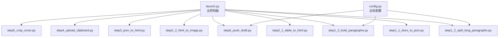
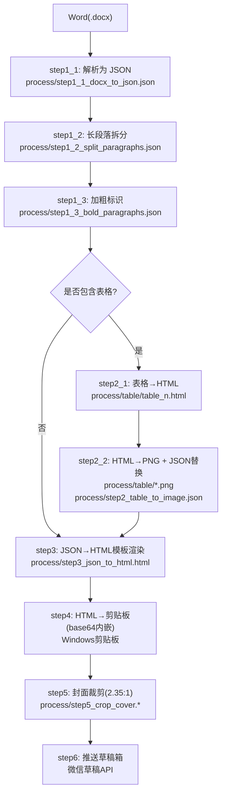
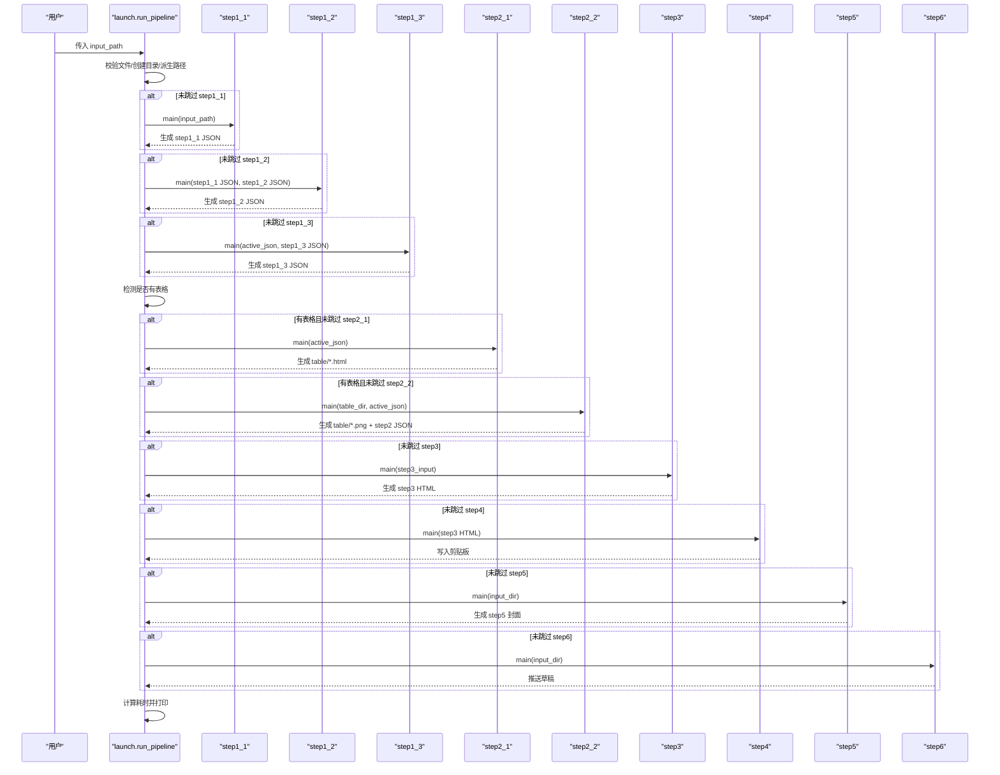
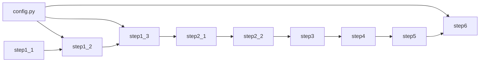
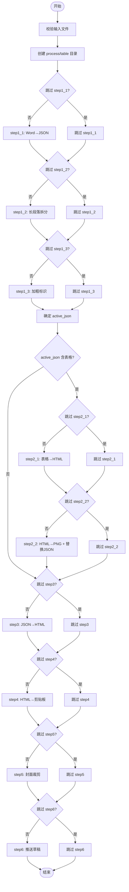
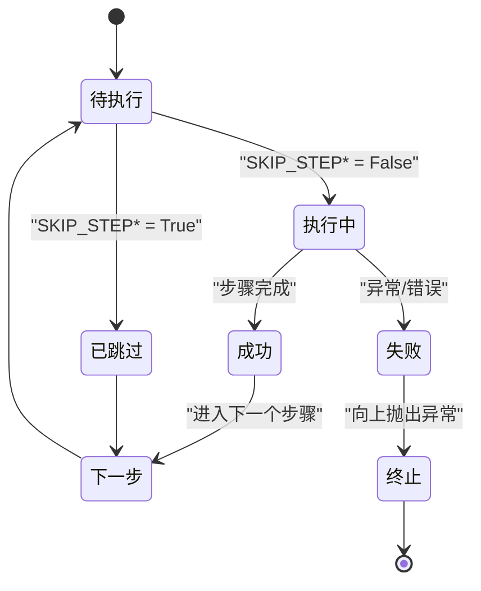

# 流水线执行流程

<cite>
**本文引用的文件**   
- [launch.py](file://launch.py)
- [config.py](file://config.py)
- [step1_1_docx_to_json.py](file://step1_1_docx_to_json.py)
- [step1_2_split_long_paragraphs.py](file://step1_2_split_long_paragraphs.py)
- [step1_3_bold_paragraphs.py](file://step1_3_bold_paragraphs.py)
- [step2_1_table_to_html.py](file://step2_1_table_to_html.py)
- [step2_2_html_to_image.py](file://step2_2_html_to_image.py)
- [step3_json_to_html.py](file://step3_json_to_html.py)
- [step4_upload_clipboard.py](file://step4_upload_clipboard.py)
- [step5_crop_cover.py](file://step5_crop_cover.py)
- [step6_push_draft.py](file://step6_push_draft.py)
</cite>

## 目录
1. [简介](#简介)
2. [项目结构](#项目结构)
3. [核心组件](#核心组件)
4. [架构总览](#架构总览)
5. [详细组件分析](#详细组件分析)
6. [依赖关系分析](#依赖关系分析)
7. [性能与监控](#性能与监控)
8. [故障排查指南](#故障排查指南)
9. [结论](#结论)
10. [附录：执行流程图与状态图](#附录执行流程图与状态图)

## 简介
本文件面向 content_board 项目的“Word → 公众号草稿”一键流水线，聚焦主控制器 launch.py 如何协调 9 个处理步骤的顺序执行，包括输入验证、目录结构初始化、错误处理与进度跟踪机制；并深入解析 run_pipeline 函数的执行逻辑（文件路径派生、中间文件管理、异常处理、性能监控），以及 SKIP_* 跳过控制机制的实现原理。文末提供完整的执行流程图与状态转换图，展示从 Word 文档到公众号草稿的端到端数据流转过程。

## 项目结构
- 顶层入口：launch.py 负责编排 9 步流水线，统一输出/输入路径约定，打印进度与耗时统计。
- 步骤模块：step1_1 ~ step6 共 9 个独立脚本，每个步骤可单独运行，也可被 launch.py 串联调用。
- 配置中心：config.py 集中存放 LLM API 与微信公众号相关参数。
- 模板资源：html_template 下存放表格与正文渲染模板。
- 实例目录：content_instance 下按文章组织 process 中间产物（JSON/HTML/PNG 等）。

图表来源
- [launch.py:42-193](file://launch.py#L42-L193)
- [config.py:1-39](file://config.py#L1-L39)

章节来源
- [launch.py:1-201](file://launch.py#L1-L201)
- [config.py:1-39](file://config.py#L1-L39)

## 核心组件
- 主控制器（launch.py）
  - 负责输入校验、目录创建、步骤调度、跳过控制、进度打印与总耗时统计。
  - 动态选择上游 JSON 作为下游输入，支持有/无表格分支。
- 步骤模块（step1_1 ~ step6）
  - 每个步骤实现单一职责，具备独立的 main 函数，便于独立调试与复用。
- 配置中心（config.py）
  - 统一管理 LLM 接口与微信公众号参数，供多步骤共享。

章节来源
- [launch.py:42-193](file://launch.py#L42-L193)
- [config.py:1-39](file://config.py#L1-L39)

## 架构总览
下图展示了从 Word 到公众号草稿的整体数据流与关键中间产物。

图表来源
- [launch.py:70-188](file://launch.py#L70-L188)
- [step1_1_docx_to_json.py:190-227](file://step1_1_docx_to_json.py#L190-L227)
- [step1_2_split_long_paragraphs.py:198-301](file://step1_2_split_long_paragraphs.py#L198-L301)
- [step1_3_bold_paragraphs.py:207-330](file://step1_3_bold_paragraphs.py#L207-L330)
- [step2_1_table_to_html.py:74-118](file://step2_1_table_to_html.py#L74-L118)
- [step2_2_html_to_image.py:120-211](file://step2_2_html_to_image.py#L120-L211)
- [step3_json_to_html.py:121-143](file://step3_json_to_html.py#L121-L143)
- [step4_upload_clipboard.py:436-476](file://step4_upload_clipboard.py#L436-L476)
- [step5_crop_cover.py:174-196](file://step5_crop_cover.py#L174-L196)
- [step6_push_draft.py:276-397](file://step6_push_draft.py#L276-L397)

## 详细组件分析

### 主控制器与 run_pipeline 执行逻辑
- 输入验证
  - 检查输入文件存在性与扩展名（由 step1_1 内部再次校验 .docx）。
- 目录结构初始化
  - 自动创建 process 与 table 子目录，确保后续步骤写入路径可用。
- 路径派生与中间文件管理
  - 定义 step1_1/step1_2/step1_3 JSON、step2 JSON、step3 HTML 等固定文件名，保证步骤间契约一致。
  - 根据是否跳过 step1_2/step1_3，动态选择 active_json 作为后续步骤输入。
  - 检测 active_json 中是否存在表格元素，决定 step2_1/step2_2 的执行分支。
  - 若存在表格，step3 使用 step2 输出的 step2_table_to_image.json；否则直接使用 active_json。
- 顺序执行与跳过控制
  - 通过 SKIP_STEP* 标志控制每步执行或跳过，并在控制台打印对应进度信息。
- 异常处理
  - 各步骤内部对缺失文件、格式不符、网络请求失败等进行防护；主控制器在步骤调用处未捕获异常，任其向上抛出以便快速失败。
- 进度跟踪与性能监控
  - 记录 total_start 时间戳，结束时计算总耗时并打印。
  - 每步前后打印分隔线与步骤编号，便于定位问题。

图表来源
- [launch.py:42-193](file://launch.py#L42-L193)
- [step1_1_docx_to_json.py:190-227](file://step1_1_docx_to_json.py#L190-L227)
- [step1_2_split_long_paragraphs.py:198-301](file://step1_2_split_long_paragraphs.py#L198-L301)
- [step1_3_bold_paragraphs.py:207-330](file://step1_3_bold_paragraphs.py#L207-L330)
- [step2_1_table_to_html.py:74-118](file://step2_1_table_to_html.py#L74-L118)
- [step2_2_html_to_image.py:120-211](file://step2_2_html_to_image.py#L120-L211)
- [step3_json_to_html.py:121-143](file://step3_json_to_html.py#L121-L143)
- [step4_upload_clipboard.py:436-476](file://step4_upload_clipboard.py#L436-L476)
- [step5_crop_cover.py:174-196](file://step5_crop_cover.py#L174-L196)
- [step6_push_draft.py:276-397](file://step6_push_draft.py#L276-L397)

章节来源
- [launch.py:42-193](file://launch.py#L42-L193)

### 跳过控制机制（SKIP_* 标志）
- 实现位置：launch.py 顶部常量 SKIP_STEP1_1 ~ SKIP_STEP6。
- 行为规则：
  - 当某 SKIP_STEP* 为 True 时，跳过该步骤，仅打印“已跳过”。
  - 下游步骤的输入 JSON 会按“最近一次未跳过的步骤”回退选择：
    - 若未跳过 step1_3，则 active_json = step1_3 JSON；
    - 否则若未跳过 step1_2，则 active_json = step1_2 JSON；
    - 否则 active_json = step1_1 JSON。
  - 表格分支判断基于 active_json 中的 elements 列表是否存在 type=table。
  - step3 的输入 step3_input 在有表格时使用 step2 的输出，否则使用 active_json。
- 典型用途：
  - 调试阶段只跑特定步骤（如仅渲染 HTML 或仅推草稿）。
  - 跳过耗时较长的步骤（如 LLM 拆分/加粗、截图、推送）以加速迭代。

章节来源
- [launch.py:28-37](file://launch.py#L28-L37)
- [launch.py:104-144](file://launch.py#L104-L144)

### 步骤 1.1：Word → JSON
- 功能要点：
  - 解析 .docx，提取段落、表格、图片，输出结构化 JSON。
  - 标题识别：以 # 前缀判定 heading_level（1 或 2），普通段落保留 runs 的 bold 标记。
  - 图片提取：将内联图片保存到 process/images，并在 JSON 中以 image 元素引用。
- 关键约束：
  - 仅支持 .docx 格式；空段落过滤；runs 合并相邻同 bold 状态的片段。

章节来源
- [step1_1_docx_to_json.py:190-227](file://step1_1_docx_to_json.py#L190-L227)

### 步骤 1.2：LLM 拆分过长段落
- 功能要点：
  - 遍历 paragraph 元素的 runs，超过阈值（config.SPLIT_THRESHOLD）时调用大模型进行语义拆分。
  - 拼接一致性校验：拆分结果拼接必须与原文完全一致，否则保留原段落。
  - 输出新文件 step1_2_split_paragraphs.json，不覆盖原文件。
- 外部依赖：
  - config.API_URL、HEADERS、MAX_RETRIES、MAX_TOKENS、SPLIT_THRESHOLD。

章节来源
- [step1_2_split_long_paragraphs.py:198-301](file://step1_2_split_long_paragraphs.py#L198-L301)
- [config.py:6-24](file://config.py#L6-L24)

### 步骤 1.3：LLM 添加总结性加粗
- 功能要点：
  - 按标题分段，每组正文交由大模型识别适合加粗的总结/判断/序列表达。
  - 已有加粗的段落跳过；若无合适内容则不加。
  - 输出新文件 step1_3_bold_paragraphs.json。
- 外部依赖：
  - config.API_URL、HEADERS、MAX_RETRIES、MAX_TOKENS。

章节来源
- [step1_3_bold_paragraphs.py:207-330](file://step1_3_bold_paragraphs.py#L207-L330)
- [config.py:6-22](file://config.py#L6-L22)

### 步骤 2.1：表格 → HTML
- 功能要点：
  - 读取 step1 JSON 中的表格元素，按绿色主题模板生成独立 HTML 文件（process/table/table_n.html）。
  - 第一行作为表头，其余行作为表体，支持单元格 bold 样式。
- 模板依赖：
  - html_template/caicai_html_1_green_table.html。

章节来源
- [step2_1_table_to_html.py:74-118](file://step2_1_table_to_html.py#L74-L118)

### 步骤 2.2：HTML → PNG + JSON 替换
- 功能要点：
  - 使用 Selenium + Chrome 将 table HTML 截图为 PNG（带超时保护与进程清理）。
  - 将 JSON 中的 table 元素按序替换为 image 引用，输出 step2_table_to_image.json。
  - 若无表格，直接复制输入 JSON 作为 step2 输出，供下游继续使用。
- 外部依赖：
  - selenium、Chrome 驱动与环境。

章节来源
- [step2_2_html_to_image.py:120-211](file://step2_2_html_to_image.py#L120-L211)

### 步骤 3：JSON → HTML 模板渲染
- 功能要点：
  - 读取 step2 JSON，将段落、标题、图片渲染为 HTML，替换模板占位符后输出 step3_json_to_html.html。
  - 标题层级处理：heading_level=1 跳过渲染，heading_level=2 渲染为小标题；连续正文合并入 section。
  - bold run 渲染为高亮 span。
- 模板依赖：
  - html_template/caicai_html_1_green_classical.html。

章节来源
- [step3_json_to_html.py:121-143](file://step3_json_to_html.py#L121-L143)

### 步骤 4：HTML → 剪贴板（图片 base64 内嵌）
- 功能要点：
  - 解析 HTML 片段，展开简化 class 标签为完整内联样式，去除格式化空白。
  - 本地图片转 base64 data URI，构建 Windows 剪贴板多格式数据并写入。
  - 同时保存内联样式 HTML 至 step4_upload_clipboard.html，供后续复用。
- 平台依赖：
  - Windows 剪贴板 API（ctypes）。

章节来源
- [step4_upload_clipboard.py:436-476](file://step4_upload_clipboard.py#L436-L476)

### 步骤 5：封面图片裁剪（2.35:1）
- 功能要点：
  - 在文章实例目录下查找第一个图片文件，按 2.35:1 比例居中裁剪，保存到 process 目录。
  - 自动压缩策略：优先降低 JPEG quality，必要时缩小分辨率以满足大小限制。
- 外部依赖：
  - OpenCV、NumPy。

章节来源
- [step5_crop_cover.py:174-196](file://step5_crop_cover.py#L174-L196)

### 步骤 6：推送到公众号草稿箱
- 功能要点：
  - 获取 access_token，提取标题（从 step1_1 JSON 的 heading_level=1），上传封面图并缓存 media_id。
  - 从 step1_3 > step1_2 > step1_1 优先级读取正文文本，调用大模型生成摘要金句。
  - 组装 article 字段并调用草稿箱 API 新增草稿。
- 外部依赖：
  - requests、config 中的微信公众号配置。

章节来源
- [step6_push_draft.py:276-397](file://step6_push_draft.py#L276-L397)
- [config.py:28-39](file://config.py#L28-L39)

## 依赖关系分析
- 模块耦合
  - launch.py 与各 step 模块松耦合，通过固定命名约定传递中间文件。
  - step1_2/step1_3/step6 依赖 config.py 的 LLM 与微信配置。
- 外部依赖
  - LLM 接口（requests）、微信公众号 API（requests）、Selenium+Chrome（截图）、OpenCV（图像处理）、Windows 剪贴板 API（ctypes）。
- 潜在循环依赖
  - 当前设计为单向流水线，无循环依赖。

图表来源
- [config.py:1-39](file://config.py#L1-L39)
- [launch.py:70-188](file://launch.py#L70-L188)

章节来源
- [config.py:1-39](file://config.py#L1-L39)
- [launch.py:70-188](file://launch.py#L70-L188)

## 性能与监控
- 总耗时统计
  - 记录 total_start 时间戳，结束时计算 elapsed 并打印。
- 步骤级日志
  - 每步前后打印分隔线与步骤编号，便于定位瓶颈。
- 外部服务重试
  - LLM 调用封装了 MAX_RETRIES 次重试与指数等待，提升稳定性。
- 截图超时保护
  - 步骤 2.2 使用线程定时器强制终止卡住的 Chrome/chromedriver 进程，避免阻塞。
- 建议优化
  - 对频繁调用的 LLM 接口增加缓存层（相同 prompt 命中缓存）。
  - 批量截图时可考虑并行化（注意系统资源与并发上限）。
  - 对 step4 的 base64 嵌入体积较大的图片，可在推送草稿前按需外链化以减少 payload。

[本节为通用指导，无需具体文件分析]

## 故障排查指南
- 常见错误与定位
  - 文件不存在：各步骤均会在入口校验文件存在性并退出；检查 launch.py 的 input_path 是否正确。
  - 非 .docx 格式：step1_1 会拒绝非 .docx 文件；确认输入后缀。
  - 表格缺失导致 step2 跳过：launch.py 会检测 active_json 中是否存在 table 元素；若无，step2_1/step2_2 将被跳过。
  - 截图失败/超时：检查 Chrome 环境、Selenium 版本与驱动匹配；查看步骤 2.2 的超时与进程清理日志。
  - 剪贴板写入失败：确认 Windows 权限与剪贴板占用情况；步骤 4 会多次尝试打开剪贴板。
  - 推送草稿失败：检查 config.py 中的 WX_APP_ID/WX_APP_SECRET 与网络连通性；关注 access_token 获取与草稿 API 返回。
- 快速恢复
  - 调整 SKIP_* 标志，跳过失败步骤继续执行后续步骤。
  - 针对 step1_2/step1_3 的 LLM 失败，可临时设为 True 跳过，先完成渲染与推送。

章节来源
- [step1_1_docx_to_json.py:190-196](file://step1_1_docx_to_json.py#L190-L196)
- [step2_2_html_to_image.py:120-173](file://step2_2_html_to_image.py#L120-L173)
- [step4_upload_clipboard.py:371-431](file://step4_upload_clipboard.py#L371-L431)
- [step6_push_draft.py:276-327](file://step6_push_draft.py#L276-L327)

## 结论
launch.py 作为主控制器，通过严格的输入校验、目录初始化、路径派生与中间文件管理，将 9 个步骤串联成稳定可靠的流水线。SKIP_* 机制提供了灵活的执行控制，结合完善的日志与异常处理，使得调试与排障更加高效。整体架构清晰、模块解耦良好，具备良好的可扩展性与维护性。

[本节为总结性内容，无需具体文件分析]

## 附录：执行流程图与状态图

### 执行流程图（端到端）

图表来源
- [launch.py:70-188](file://launch.py#L70-L188)

### 状态转换图（步骤状态）

图表来源
- [launch.py:70-188](file://launch.py#L70-L188)