# 流水线架构

<cite>
**本文引用的文件**   
- [launch.py](file://launch.py)
- [config.py](file://config.py)
- [step1_1_docx_to_json.py](file://step1_1_docx_to_json.py)
- [step1_2_split_long_paragraphs.py](file://step1_2_split_long_paragraphs.py)
- [step1_3_bold_paragraphs.py](file://step1_3_bold_paragraphs.py)
- [step2_1_table_to_html.py](file://step2_1_table_to_html.py)
- [step2_2_html_to_image.py](file://step2_2_html_to_image.py)
- [step3_json_to_html.py](file://step3_json_to_html.py)
- [step4_upload_clipboard.py](file://step4_upload_clipboard.py)
- [step5_crop_cover.py](file://step5_crop_cover.py)
- [step6_push_draft.py](file://step6_push_draft.py)
- [caicai_html_1_green_table.html](file://html_template/caicai_html_1_green_table.html)
</cite>

## 目录
1. [引言](#引言)
2. [项目结构](#项目结构)
3. [核心组件](#核心组件)
4. [架构总览](#架构总览)
5. [详细组件分析](#详细组件分析)
6. [依赖关系分析](#依赖关系分析)
7. [性能与可维护性](#性能与可维护性)
8. [故障排查指南](#故障排查指南)
9. [结论](#结论)
10. [附录：中间文件组织与命名约定](#附录中间文件组织与命名约定)

## 引言
本仓库实现了一个“Word → 剪贴板/公众号草稿”的一键流水线，将 Word 文档解析为结构化 JSON，经过段落拆分、加粗标注、表格转图、HTML 渲染、剪贴板写入、封面裁剪与草稿推送等步骤，最终产出可直接粘贴到微信公众号编辑器的富文本内容。流水线采用“顺序执行 + 配置驱动跳过”的管道模式，支持灵活调试与增量重跑。

## 项目结构
- 顶层入口与编排：launch.py
- 全局配置：config.py（API、重试、阈值、公众号参数）
- 处理步骤：step1_1 ~ step6 九个步骤脚本
- HTML 模板：html_template 下的绿色主题模板
- 实例数据：content_instance 下按日期+序号组织的文章实例及其 process 中间产物

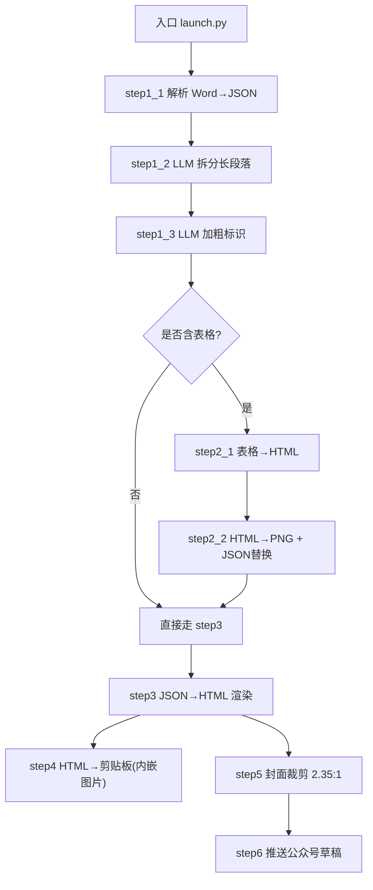

图表来源
- [launch.py:42-193](file://launch.py#L42-L193)
- [step1_1_docx_to_json.py:190-233](file://step1_1_docx_to_json.py#L190-L233)
- [step1_2_split_long_paragraphs.py:198-301](file://step1_2_split_long_paragraphs.py#L198-L301)
- [step1_3_bold_paragraphs.py:207-330](file://step1_3_bold_paragraphs.py#L207-L330)
- [step2_1_table_to_html.py:74-118](file://step2_1_table_to_html.py#L74-L118)
- [step2_2_html_to_image.py:120-211](file://step2_2_html_to_image.py#L120-L211)
- [step3_json_to_html.py:121-143](file://step3_json_to_html.py#L121-L143)
- [step4_upload_clipboard.py:436-476](file://step4_upload_clipboard.py#L436-L476)
- [step5_crop_cover.py:174-196](file://step5_crop_cover.py#L174-L196)
- [step6_push_draft.py:276-397](file://step6_push_draft.py#L276-L397)

章节来源
- [launch.py:1-201](file://launch.py#L1-L201)
- [config.py:1-39](file://config.py#L1-L39)

## 核心组件
- 编排器（launch.py）
  - 负责路径派生、步骤调度、跳过控制、自动检测表格存在性、选择上游输出作为下游输入。
- 步骤模块（step1_1 ~ step6）
  - 每个步骤以 main(input_path|json_path|dir) 形式暴露，独立可运行，也可被编排器调用。
- 配置中心（config.py）
  - 集中管理大模型 API、重试次数、最大 token、段落拆分阈值、微信公众号 AppID/Secret 及默认值。
- 模板系统（html_template）
  - 表格模板与正文模板通过占位符注入生成最终 HTML。

章节来源
- [launch.py:28-193](file://launch.py#L28-L193)
- [config.py:1-39](file://config.py#L1-L39)
- [caicai_html_1_green_table.html:1-81](file://html_template/caicai_html_1_green_table.html#L1-L81)

## 架构总览
流水线遵循“顺序管道 + 条件分支 + 配置化跳过”的设计：
- 顺序执行：step1_1 → step1_2 → step1_3 → (可选 step2_1/step2_2) → step3 → step4 → step5 → step6
- 条件分支：若 JSON 中无表格元素，则跳过 step2_1/step2_2，并回退使用 active_json 作为 step3 输入
- 配置化跳过：通过 TOP 层布尔开关控制任意步骤是否执行，便于调试与增量重跑

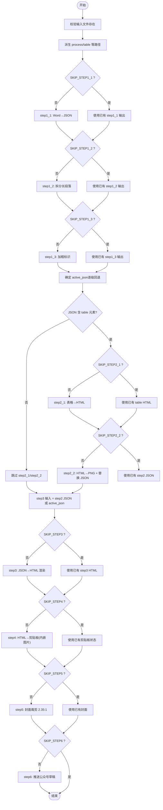

图表来源
- [launch.py:42-193](file://launch.py#L42-L193)

## 详细组件分析

### 编排器（launch.py）
- 职责
  - 校验输入、派生路径、创建 process/table 目录
  - 根据 SKIP_* 标志顺序调用各步骤 main()
  - 自动检测 JSON 是否存在 table 元素，决定是否执行 step2_1/step2_2
  - 动态选择 active_json 和 step3 输入（有表格用 step2 输出，否则回退）
- 关键设计
  - 跳过控制：TOP 层布尔变量，便于快速调试
  - 容错回退：当某步被跳过时，下游步骤能正确读取上游已有产物
  - 日志输出：每步打印进度、耗时统计

章节来源
- [launch.py:28-193](file://launch.py#L28-L193)

### 步骤1_1：Word → JSON（step1_1_docx_to_json.py）
- 职责
  - 解析 .docx，提取段落、表格、图片，输出结构化 JSON
  - 标题识别：# 前缀 → heading_level=1；## → heading_level=2
  - runs 合并相邻同 bold 状态的片段
  - 图片抽取并保存到 process/images
- 输入/输出
  - 输入：.docx 文件路径
  - 输出：process/step1_1_docx_to_json.json；process/images/image_{n}.png
- 复杂度与健壮性
  - 遍历 body 子节点，时间复杂度 O(N)，N 为元素数量
  - 对 XML 属性进行空值保护，避免 KeyError/AttributeError

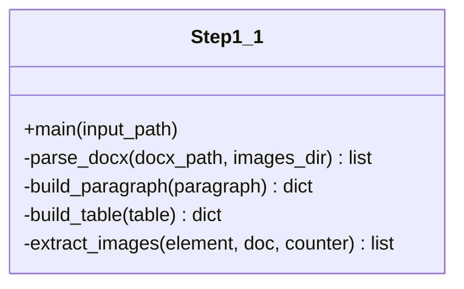

图表来源
- [step1_1_docx_to_json.py:190-233](file://step1_1_docx_to_json.py#L190-L233)
- [step1_1_docx_to_json.py:145-184](file://step1_1_docx_to_json.py#L145-L184)

章节来源
- [step1_1_docx_to_json.py:1-233](file://step1_1_docx_to_json.py#L1-L233)

### 步骤1_2：LLM 拆分过长段落（step1_2_split_long_paragraphs.py）
- 职责
  - 扫描 paragraph 的 runs，超过阈值的 run 调用大模型按语义拆分
  - 拼接一致性校验：拆分结果拼接必须与原文一致
  - 非段落元素原样保留
- 输入/输出
  - 输入：step1_1 输出的 JSON
  - 输出：process/step1_2_split_paragraphs.json
- 错误处理
  - 网络异常重试（指数退避），失败则保留原段落
  - 响应解析失败或拆分段数不足，保留原段落

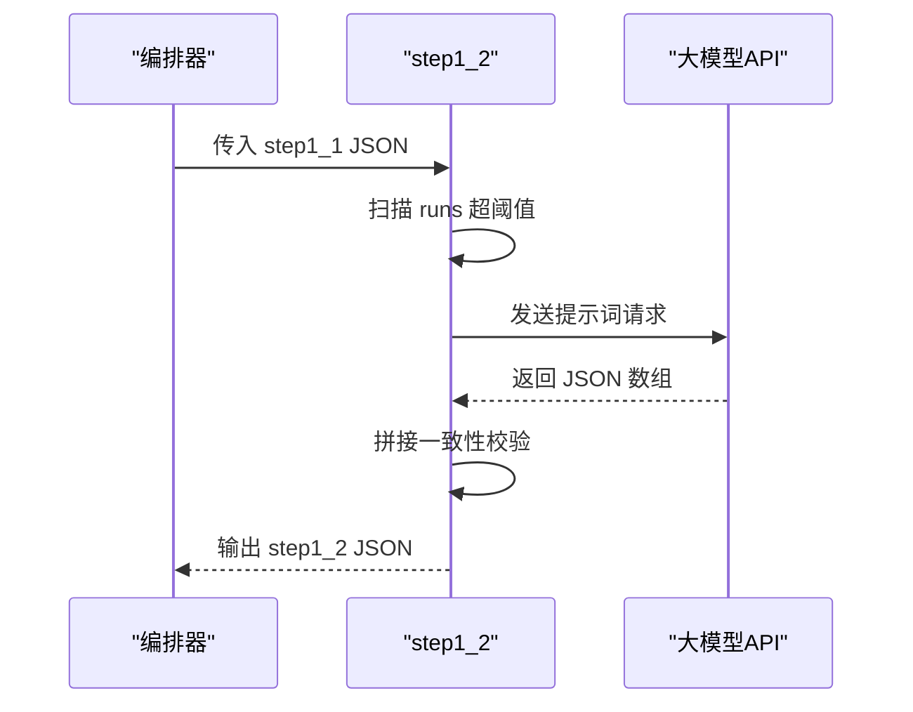

图表来源
- [step1_2_split_long_paragraphs.py:198-301](file://step1_2_split_long_paragraphs.py#L198-L301)
- [config.py:6-24](file://config.py#L6-L24)

章节来源
- [step1_2_split_long_paragraphs.py:1-311](file://step1_2_split_long_paragraphs.py#L1-L311)
- [config.py:1-39](file://config.py#L1-L39)

### 步骤1_3：LLM 加粗标识（step1_3_bold_paragraphs.py）
- 职责
  - 按标题分段，每组正文交由大模型识别总结/判断/序列表达，标记为加粗
  - 已有加粗段落跳过，不强行添加
- 输入/输出
  - 输入：step1_2 输出的 JSON
  - 输出：process/step1_3_bold_paragraphs.json
- 错误处理
  - 模型调用失败或返回无效对象，跳过该组
  - 找不到匹配原文，跳过该处

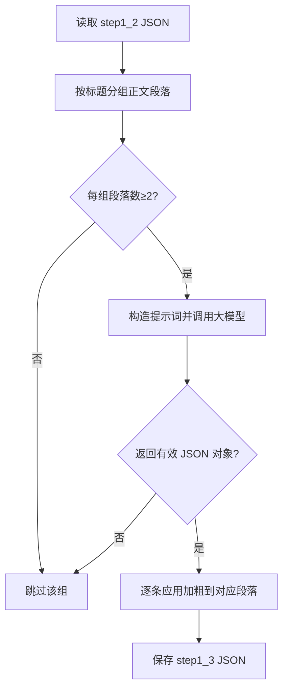

图表来源
- [step1_3_bold_paragraphs.py:207-330](file://step1_3_bold_paragraphs.py#L207-L330)

章节来源
- [step1_3_bold_paragraphs.py:1-340](file://step1_3_bold_paragraphs.py#L1-L340)

### 步骤2_1：表格 → HTML（step2_1_table_to_html.py）
- 职责
  - 从 JSON 筛选 table 元素，按绿色主题模板生成独立 HTML 文件
  - 第一行作为 thead，其余为 tbody
- 输入/输出
  - 输入：active_json（通常为 step1_3 输出）
  - 输出：process/table/table_{n}.html
- 模板
  - html_template/caicai_html_1_green_table.html，占位符 {{TABLE_PLACEHOLDER}}

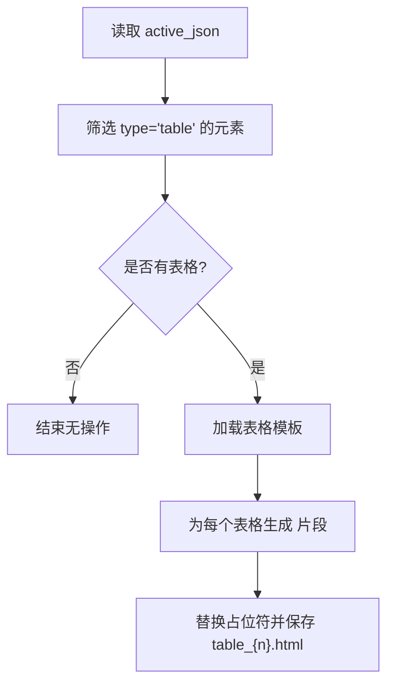

图表来源
- [step2_1_table_to_html.py:74-118](file://step2_1_table_to_html.py#L74-L118)
- [caicai_html_1_green_table.html:59-62](file://html_template/caicai_html_1_green_table.html#L59-L62)

章节来源
- [step2_1_table_to_html.py:1-125](file://step2_1_table_to_html.py#L1-L125)
- [caicai_html_1_green_table.html:1-81](file://html_template/caicai_html_1_green_table.html#L1-L81)

### 步骤2_2：HTML → PNG + JSON 替换（step2_2_html_to_image.py）
- 职责
  - 使用 Selenium + Chrome 截图生成 PNG
  - 将 JSON 中的 table 元素按序替换为 image 引用，输出 step2_table_to_image.json
- 输入/输出
  - 输入：process/table/*.html 与 active_json
  - 输出：process/table/*.png 与 process/step2_table_to_image.json
- 超时与进程清理
  - 线程计时器强制终止卡住的 Chrome/chromedriver
  - 结束后统一清理残留进程

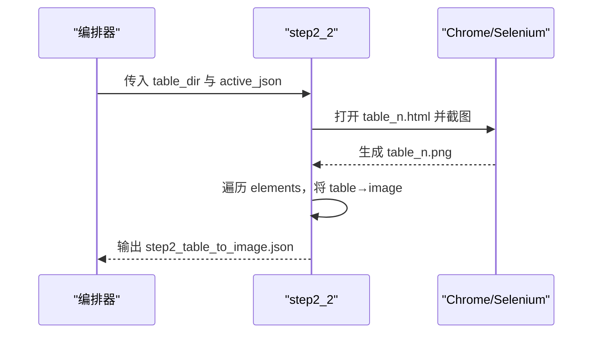

图表来源
- [step2_2_html_to_image.py:120-211](file://step2_2_html_to_image.py#L120-L211)

章节来源
- [step2_2_html_to_image.py:1-218](file://step2_2_html_to_image.py#L1-L218)

### 步骤3：JSON → HTML 渲染（step3_json_to_html.py）
- 职责
  - 将段落、标题、图片渲染为 HTML，替换模板中的 {{BODY_PLACEHOLDER}}
  - heading_level=1 的大标题不渲染到正文区
- 输入/输出
  - 输入：step2 JSON（若无表格则为 active_json）
  - 输出：process/step3_json_to_html.html

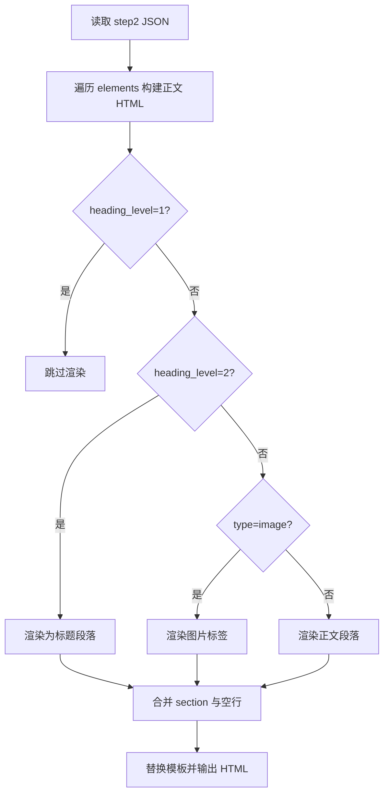

图表来源
- [step3_json_to_html.py:84-143](file://step3_json_to_html.py#L84-L143)

章节来源
- [step3_json_to_html.py:1-149](file://step3_json_to_html.py#L1-L149)

### 步骤4：HTML → 剪贴板（step4_upload_clipboard.py）
- 职责
  - 解析 HTML 片段，展开简化类名到内联样式，去除格式化空白
  - 本地图片转为 base64 data URI，构建 Windows 剪贴板多格式数据并写入
- 输入/输出
  - 输入：process/step3_json_to_html.html
  - 输出：Windows 剪贴板（HTML Format + 纯文本 + 图片 base64）
- 平台约束
  - 仅适用于 Windows（使用 ctypes 调用 user32/kernel32）

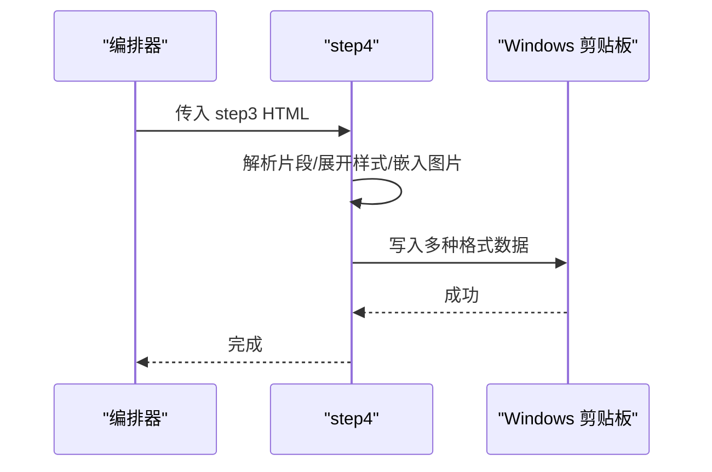

图表来源
- [step4_upload_clipboard.py:436-476](file://step4_upload_clipboard.py#L436-L476)

章节来源
- [step4_upload_clipboard.py:1-480](file://step4_upload_clipboard.py#L1-L480)

### 步骤5：封面裁剪（step5_crop_cover.py）
- 职责
  - 在文章实例文件夹中找到第一个图片，按 2.35:1 比例中心裁剪
  - 自动压缩至 10MB 以内（JPEG quality 二分搜索或缩小分辨率）
- 输入/输出
  - 输入：文章实例目录（如 content_instance/content_xxx）
  - 输出：process/step5_crop_cover.*

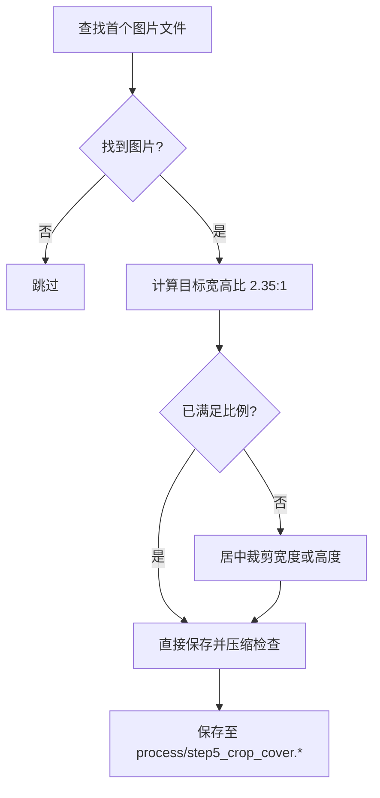

图表来源
- [step5_crop_cover.py:133-196](file://step5_crop_cover.py#L133-L196)

章节来源
- [step5_crop_cover.py:1-203](file://step5_crop_cover.py#L1-L203)

### 步骤6：推送公众号草稿（step6_push_draft.py）
- 职责
  - 获取 access_token，上传封面图，提取标题与摘要，推送草稿
  - 摘要由大模型从正文中提取金句
- 输入/输出
  - 输入：process 目录（step1_1 JSON、step5 封面图等）
  - 输出：公众号草稿（media_id）
- 配置依赖
  - config.py 中的 WX_APP_ID/WX_APP_SECRET 等

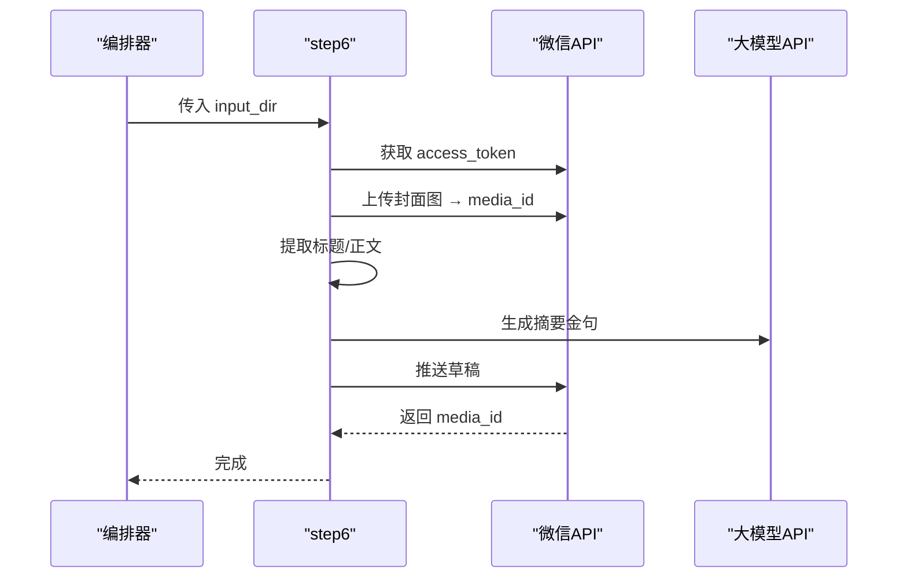

图表来源
- [step6_push_draft.py:276-397](file://step6_push_draft.py#L276-L397)
- [config.py:29-39](file://config.py#L29-L39)

章节来源
- [step6_push_draft.py:1-404](file://step6_push_draft.py#L1-L404)
- [config.py:1-39](file://config.py#L1-L39)

## 依赖关系分析
- 外部依赖
  - requests：HTTP 客户端（大模型 API、微信公众号 API）
  - selenium + Chrome：HTML 截图
  - opencv-python/numpy：图像处理（封面裁剪）
  - python-docx：Word 解析
  - ctypes：Windows 剪贴板写入
- 内部依赖
  - launch.py 依赖所有 step* 模块
  - step1_2/step1_3/step6 依赖 config.py 的配置项
  - step2_1 依赖 html_template 表格模板
  - step3 依赖 html_template 正文模板（未在引用清单中列出具体文件名，但代码中引用了模板路径）

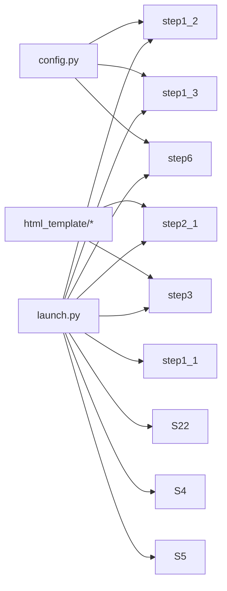

图表来源
- [launch.py:42-193](file://launch.py#L42-L193)
- [config.py:1-39](file://config.py#L1-L39)
- [step2_1_table_to_html.py:26-27](file://step2_1_table_to_html.py#L26-L27)
- [step3_json_to_html.py:28-29](file://step3_json_to_html.py#L28-L29)

章节来源
- [launch.py:1-201](file://launch.py#L1-L201)
- [config.py:1-39](file://config.py#L1-L39)

## 性能与可维护性
- 性能特征
  - 大模型调用为瓶颈：step1_2/step1_3/step6 均涉及远程 HTTP 请求，具备重试与超时保护
  - 截图流程受 Chrome 启动与页面渲染影响：step2_2 提供超时监控与进程清理
  - 图像处理：step5 针对 JPEG 质量二分搜索，兼顾体积与画质
- 优化建议
  - 缓存策略：step6 已缓存封面 media_id，可考虑缓存大模型摘要结果（需幂等键）
  - 并行化：step2_2 的多个 HTML→PNG 可并发执行（注意 Chrome 实例隔离）
  - 资源回收：确保异常路径下关闭浏览器与释放内存
- 可维护性
  - 模块化：每个步骤独立 main，便于单元测试与单独重跑
  - 配置集中：config.py 统一管理敏感信息与通用参数
  - 日志清晰：每步输出进度与统计信息，便于定位问题

[本节为通用指导，无需特定文件来源]

## 故障排查指南
- 常见错误与对策
  - 文件不存在：各步骤入口均有路径校验，确认 launch.py 的 input_path 是否正确
  - 大模型调用失败：检查 config.py 的 API_URL/HEADERS/MAX_RETRIES，关注重试日志
  - Chrome 截图超时：确认系统已安装 Chrome，必要时调整 CHROME_TIMEOUT 或清理残留进程
  - 剪贴板写入失败：仅在 Windows 可用，确认权限与用户会话
  - 微信公众号推送失败：检查 WX_APP_ID/WX_APP_SECRET 与网络连通性
- 诊断要点
  - 查看 process 目录下中间产物是否存在且非空
  - 对比 step1_1/step1_2/step1_3 JSON 的 elements 数量变化
  - 观察 step2_2 的失败列表与 step6 的字段长度调试输出

章节来源
- [step1_1_docx_to_json.py:190-233](file://step1_1_docx_to_json.py#L190-L233)
- [step1_2_split_long_paragraphs.py:198-301](file://step1_2_split_long_paragraphs.py#L198-L301)
- [step2_2_html_to_image.py:120-211](file://step2_2_html_to_image.py#L120-L211)
- [step4_upload_clipboard.py:436-476](file://step4_upload_clipboard.py#L436-L476)
- [step6_push_draft.py:276-397](file://step6_push_draft.py#L276-L397)

## 结论
本流水线以“顺序执行 + 配置化跳过 + 条件分支”为核心，实现了从 Word 到剪贴板/公众号草稿的端到端自动化。其优势在于：
- 高可配置性与可调试性：TOP 层跳过开关与中间产物持久化
- 强容错与回退：步骤间输入选择与错误回退机制完善
- 可扩展性：新增步骤只需遵循 main 接口与中间文件约定

[本节为总结性内容，无需特定文件来源]

## 附录：中间文件组织与命名约定
- 根目录
  - content_instance/<实例名>/process：每个实例的中间产物目录
- 命名约定
  - step1_1_docx_to_json.json：Word 解析后的结构化 JSON
  - step1_2_split_paragraphs.json：拆分后的 JSON（不覆盖上游）
  - step1_3_bold_paragraphs.json：加粗标注后的 JSON（不覆盖上游）
  - table/*.html：表格 HTML 文件（table_{n}.html）
  - table/*.png：表格截图（table_{n}.png）
  - step2_table_to_image.json：将 table 替换为 image 引用的 JSON
  - step3_json_to_html.html：最终渲染的 HTML
  - step4_upload_clipboard.html：内联样式 HTML（供复用）
  - step5_crop_cover.*：封面裁剪结果
  - step6_thumb_media_id.txt：封面媒体 ID 缓存
- 数据流图（中间文件）

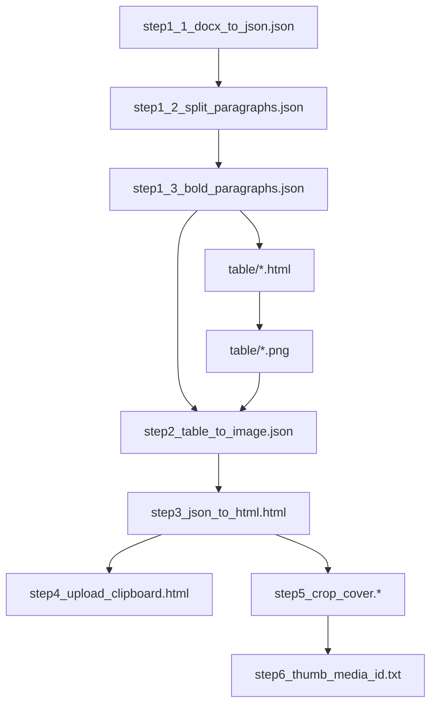

图表来源
- [launch.py:48-60](file://launch.py#L48-L60)
- [step2_1_table_to_html.py:74-118](file://step2_1_table_to_html.py#L74-L118)
- [step2_2_html_to_image.py:175-211](file://step2_2_html_to_image.py#L175-L211)
- [step3_json_to_html.py:121-143](file://step3_json_to_html.py#L121-L143)
- [step4_upload_clipboard.py:456-462](file://step4_upload_clipboard.py#L456-L462)
- [step5_crop_cover.py:174-196](file://step5_crop_cover.py#L174-L196)
- [step6_push_draft.py:313-327](file://step6_push_draft.py#L313-L327)